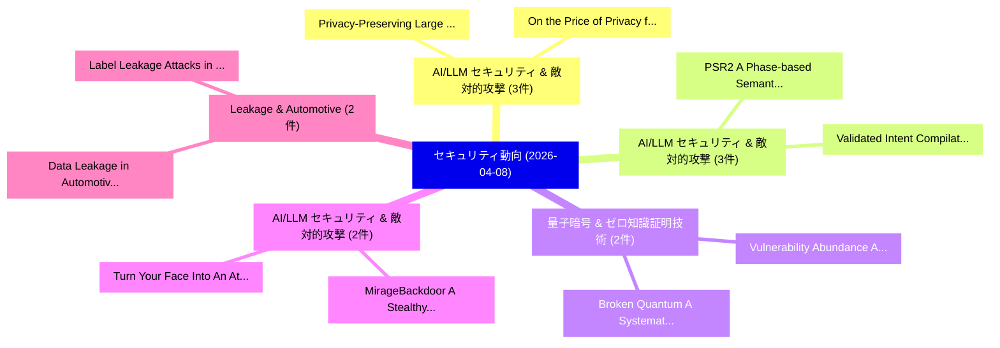

# 📅 02_daily: 日次エグゼクティブサマリー報告書 (2026-04-08)

**集計日時**: 2026-10-02 23:06:04 UTC  
**対象日付**: 2026-04-08  
**本日収集論文数**: 39 件  

---

## 💡 主要セキュリティ動向・脅威インサイト (Executive Insights)

本日の収集論文（計 39 件）において、以下の重点セキュリティ領域で活発な研究動向が確認されました：
- **AI/LLM セキュリティ & 敵対的攻撃** (3 件): 注目論文として 「Privacy-Preserving Large Langu...」、「On the Price of Privacy for La...」 等が発表され、実務防御および攻撃検証の進展が見られます。
- **AI/LLM セキュリティ & 敵対的攻撃** (3 件): 注目論文として 「PSR2: A Phase-based Semantic R...」、「Validated Intent Compilation f...」 等が発表され、実務防御および攻撃検証の進展が見られます。
- **量子暗号 & ゼロ知識証明技術** (2 件): 注目論文として 「Broken Quantum: A Systematic F...」、「Vulnerability Abundance: A for...」 等が発表され、実務防御および攻撃検証の進展が見られます。
- **AI/LLM セキュリティ & 敵対的攻撃** (2 件): 注目論文として 「Turn Your Face Into An Attack ...」、「MirageBackdoor: A Stealthy Att...」 等が発表され、実務防御および攻撃検証の進展が見られます。
- **Leakage & Automotive** (2 件): 注目論文として 「Data Leakage in Automotive Per...」、「Label Leakage Attacks in Machi...」 等が発表され、実務防御および攻撃検証の進展が見られます。

### 🗺️ 技術・脅威トピックマインドマップ

---

## 📌 日次セキュリティ論文一覧 (日本語表形式)

| No | arXiv ID | 論文タイトル (日本語訳) | 重要キーワード | 構造化エグゼクティブ要約 (背景・提案・影響) | 脅威分類 | 詳細リンク |
|---|---|---|---|---|---|---|
| 1 | `2604.06550v3` | [SkillSieve: A Hierarchical Triage Framework for Detecting Malicious AI Agent Skills（セキュリティ分析論文）](../../okf/papers/2026-04-08/2604.06550.md) | `Detecting Malicious`, `Agent Skills`, `Yinghan Hou` | 【提案】概要 (Overview & Key Finding) 本論文「SkillSieve: A Hierarchical Triage Framework for Detecti...。実証評価により経営層・セキュリティ管理者向け推奨アクション (E... | `cs.AI` | [arXiv](https://arxiv.org/abs/2604.06550v3) &#124; [OKF](../../okf/papers/2026-04-08/2604.06550.md) |
| 2 | `2604.06599v1` | [Can Drift-Adaptive Malware Detectors Be Made Robust? Attacks and Defenses Under White-Box and Black-Box Threats（セキュリティ分析論文）](../../okf/papers/2026-04-08/2604.06599.md) | `Can Drift`, `Drift-Adaptive Malware`, `Box Threats` | 【提案】Attacks and Defenses Under White-Box and Black-Box Threats ### (日本語題名: Can Drift-Adapti...。実証評価により経営層・セキュリティ管理者向け推奨アクション (E... | `cybersecurity` | [arXiv](https://arxiv.org/abs/2604.06599v1) &#124; [OKF](../../okf/papers/2026-04-08/2604.06599.md) |
| 3 | `2604.06618v2` | [PoC-Adapt: Semantic-Aware Automated Vulnerability Reproduction with LLM Multi-Agents and Reinforcement Learning-Driven Adaptive Policy（セキュリティ分析論文）](../../okf/papers/2026-04-08/2604.06618.md) | `Aware Automated Vulnerability Reproduction`, `Driven Adaptive Policy`, `Reinforcement Learning` | 【提案】概要 (Overview & Key Finding) 本論文「PoC-Adapt: Semantic-Aware Automated 脆弱性 Reproduction wi...。実証評価により経営層・セキュリティ管理者向け推奨アクション (E... | `cybersecurity` | [arXiv](https://arxiv.org/abs/2604.06618v2) &#124; [OKF](../../okf/papers/2026-04-08/2604.06618.md) |
| 4 | `2604.06633v1` | [Argus: Reorchestrating Static Analysis via a Multi-Agent Ensemble for Full-Chain Security 脆弱性検出](../../okf/papers/2026-04-08/2604.06633.md) | `Agent Ensemble`, `Multi-Agent Ensemble`, `Full-Chain Security` | 【提案】概要 (Overview & Key Finding) 本論文「Argus: Reorchestrating Static Analysis via a Multi-Agen...。実証評価により経営層・セキュリティ管理者向け推奨アクション (E... | `executive-summary` | [arXiv](https://arxiv.org/abs/2604.06633v1) &#124; [OKF](../../okf/papers/2026-04-08/2604.06633.md) |
| 5 | `2604.06638v1` | [RPM-Net Reciprocal Point MLP Network for Unknown Network Security Threat Detection（セキュリティ分析論文）](../../okf/papers/2026-04-08/2604.06638.md) | `Unknown Network Security Threat Detection`, `Net Reciprocal Point`, `RPM-Net Reciprocal` | 【提案】概要 (Overview & Key Finding) 本論文「RPM-Net Reciprocal Point MLP Network for Unknown Networ...。実証評価により経営層・セキュリティ管理者向け推奨アクション (E... | `cs.AI` | [arXiv](https://arxiv.org/abs/2604.06638v1) &#124; [OKF](../../okf/papers/2026-04-08/2604.06638.md) |
| 6 | `2604.06693v1` | [Aegon: Auditable AI Content Access with Ledger-Bound Tokens and Hardware-Attested Mobile Receipts（セキュリティ分析論文）](../../okf/papers/2026-04-08/2604.06693.md) | `Attested Mobile Receipts`, `Content Access`, `Bound Tokens` | 【提案】概要 (Overview & Key Finding) 本論文「Aegon: Auditable AI Content Access with Ledger-Bound To...。実証評価により経営層・セキュリティ管理者向け推奨アクション (E... | `executive-summary` | [arXiv](https://arxiv.org/abs/2604.06693v1) &#124; [OKF](../../okf/papers/2026-04-08/2604.06693.md) |
| 7 | `2604.06712v2` | [Broken Quantum: A Systematic Formal Verification Study of Security Vulnerabilities Across the Open-Source Quantum Computing Simulator Ecosystem（セキュリティ分析論文）](../../okf/papers/2026-04-08/2604.06712.md) | `Source Quantum Computing Simulator Ecosystem`, `Security Vulnerabilities Across`, `Broken Quantum` | 【提案】概要 (Overview & Key Finding) 本論文「Broken 量子: A Systematic Formal Verification Study of Se...。実証評価により経営層・セキュリティ管理者向け推奨アクション (E... | `executive-summary` | [arXiv](https://arxiv.org/abs/2604.06712v2) &#124; [OKF](../../okf/papers/2026-04-08/2604.06712.md) |
| 8 | `2604.06729v1` | [Turn Your Face Into An Attack Surface: Screen Attack Using Facial Reflections in Video Conferencing（セキュリティ分析論文）](../../okf/papers/2026-04-08/2604.06729.md) | `Screen Attack Using Facial Reflections`, `Video Conferencing`, `Yong Huang` | 【提案】概要 (Overview & Key Finding) 本論文「Turn Your Face Into An Attack Surface: Screen Attack Us...。実証評価により経営層・セキュリティ管理者向け推奨アクション (E... | `cybersecurity` | [arXiv](https://arxiv.org/abs/2604.06729v1) &#124; [OKF](../../okf/papers/2026-04-08/2604.06729.md) |
| 9 | `2604.06759v1` | [Understanding Data Collection, Brokerage, and Spam in the Lead Marketing Ecosystem（セキュリティ分析論文）](../../okf/papers/2026-04-08/2604.06759.md) | `Understanding Data Collection`, `Lead Marketing Ecosystem`, `Yash Vekaria` | 【提案】概要 (Overview & Key Finding) 本論文「Understanding Data Collection, Brokerage, and Spam in t...。実証評価により経営層・セキュリティ管理者向け推奨アクション (E... | `executive-summary` | [arXiv](https://arxiv.org/abs/2604.06759v1) &#124; [OKF](../../okf/papers/2026-04-08/2604.06759.md) |
| 10 | `2604.06762v1` | [ARuleCon: Agentic Security Rule Conversion（セキュリティ分析論文）](../../okf/papers/2026-04-08/2604.06762.md) | `Agentic Security Rule Conversion`, `Hoon Wei Lim`, `Jin Song Dong` | 【提案】概要 (Overview & Key Finding) 本論文「ARuleCon: Agentic Security Rule Conversion（セキュリティ分析論文）」...。実証評価により経営層・セキュリティ管理者向け推奨アクション (E... | `cybersecurity` | [arXiv](https://arxiv.org/abs/2604.06762v1) &#124; [OKF](../../okf/papers/2026-04-08/2604.06762.md) |
| 11 | `2604.06811v2` | [SkillTrojan: Backdoor Attacks on Skill-Based Agent Systems（セキュリティ分析論文）](../../okf/papers/2026-04-08/2604.06811.md) | `Based Agent Systems`, `Backdoor Attacks`, `Skill-Based Agent` | 【提案】概要 (Overview & Key Finding) 本論文「SkillTrojan: Backdoor Attacks on Skill-Based Agent Syst...。実証評価により経営層・セキュリティ管理者向け推奨アクション (E... | `cs.AI` | [arXiv](https://arxiv.org/abs/2604.06811v2) &#124; [OKF](../../okf/papers/2026-04-08/2604.06811.md) |
| 12 | `2604.06831v1` | [Privacy-Preserving Large Language Model: Text-free Inference Through Alignment and Adaptationに向けて](../../okf/papers/2026-04-08/2604.06831.md) | `Preserving Large Language Model`, `Privacy-Preserving Large`, `Text-free Inference` | 【提案】概要 (Overview & Key Finding) 本論文「Privacy-Preserving Large Language Model: Text-free Infe...。実証評価により経営層・セキュリティ管理者向け推奨アクション (E... | `cs.AI` | [arXiv](https://arxiv.org/abs/2604.06831v1) &#124; [OKF](../../okf/papers/2026-04-08/2604.06831.md) |
| 13 | `2604.06833v1` | [FedDetox: Robust Federated SLM Alignment via On-Device Data Sanitization（セキュリティ分析論文）](../../okf/papers/2026-04-08/2604.06833.md) | `Device Data Sanitization`, `Robust Federated`, `On-Device Data` | 【提案】概要 (Overview & Key Finding) 本論文「FedDetox: Robust Federated SLM Alignment via On-Device ...。実証評価により経営層・セキュリティ管理者向け推奨アクション (E... | `executive-summary` | [arXiv](https://arxiv.org/abs/2604.06833v1) &#124; [OKF](../../okf/papers/2026-04-08/2604.06833.md) |
| 14 | `2604.06840v2` | [MirageBackdoor: A Stealthy Attack that Induces Think-Well-Answer-Wrong Reasoning（セキュリティ分析論文）](../../okf/papers/2026-04-08/2604.06840.md) | `Stealthy Attack`, `Induces Think`, `Wrong Reasoning` | 【提案】概要 (Overview & Key Finding) 本論文「MirageBackdoor: A Stealthy Attack that Induces Think-We...。実証評価により経営層・セキュリティ管理者向け推奨アクション (E... | `cybersecurity` | [arXiv](https://arxiv.org/abs/2604.06840v2) &#124; [OKF](../../okf/papers/2026-04-08/2604.06840.md) |
| 15 | `2604.06899v1` | [Data Leakage in Automotive Perception: Practitioners' Insights（セキュリティ分析論文）](../../okf/papers/2026-04-08/2604.06899.md) | `Data Leakage`, `Automotive Perception`, `Md Abu Ahammed Babu` | 【提案】概要 (Overview & Key Finding) 本論文「Data Leakage in Automotive Perception: Practitioners' I...。実証評価により経営層・セキュリティ管理者向け推奨アクション (E... | `executive-summary` | [arXiv](https://arxiv.org/abs/2604.06899v1) &#124; [OKF](../../okf/papers/2026-04-08/2604.06899.md) |
| 16 | `2604.06900v1` | [SentinelSphere: Integrating AI-Powered Real-Time Threat Detection with サイバーセキュリティ Awareness Training](../../okf/papers/2026-04-08/2604.06900.md) | `Time Threat Detection`, `Powered Real`, `AI-Powered Real` | 【提案】概要 (Overview & Key Finding) 本論文「SentinelSphere: Integrating AI-Powered Real-Time 脅威 Det...。実証評価により経営層・セキュリティ管理者向け推奨アクション (E... | `cs.CE` | [arXiv](https://arxiv.org/abs/2604.06900v1) &#124; [OKF](../../okf/papers/2026-04-08/2604.06900.md) |
| 17 | `2604.06942v1` | [Evaluating PQC KEMs, Combiners, and Cascade Encryption via Adaptive IND-CPA Testing Using Deep Learning（セキュリティ分析論文）](../../okf/papers/2026-04-08/2604.06942.md) | `Testing Using Deep Learning`, `Cascade Encryption`, `IND-CPA Testing` | 【提案】概要 (Overview & Key Finding) 本論文「Evaluating PQC KEMs, Combiners, and Cascade Encryption ...。実証評価により経営層・セキュリティ管理者向け推奨アクション (E... | `executive-summary` | [arXiv](https://arxiv.org/abs/2604.06942v1) &#124; [OKF](../../okf/papers/2026-04-08/2604.06942.md) |
| 18 | `2604.06967v2` | [VulLink: A Dynamic Open-Access Vulnerability Graph Database for サイバーセキュリティ Data Mining](../../okf/papers/2026-04-08/2604.06967.md) | `Access Vulnerability Graph Database`, `Dynamic Open`, `Open-Access Vulnerability` | 【提案】概要 (Overview & Key Finding) 本論文「VulLink: A Dynamic Open-Access 脆弱性 Graph Database for サ...。実証評価により経営層・セキュリティ管理者向け推奨アクション (E... | `cs.DB` | [arXiv](https://arxiv.org/abs/2604.06967v2) &#124; [OKF](../../okf/papers/2026-04-08/2604.06967.md) |
| 19 | `2604.06975v2` | [PSR2: A Phase-based Semantic Reasoning Framework for Atomicity Violation Detection via Contract Refinement（セキュリティ分析論文）](../../okf/papers/2026-04-08/2604.06975.md) | `Atomicity Violation Detection`, `Phase-based Semantic`, `Contract Refinement` | 【提案】概要 (Overview & Key Finding) 本論文「PSR2: A Phase-based Semantic Reasoning Framework for At...。実証評価により経営層・セキュリティ管理者向け推奨アクション (E... | `cybersecurity` | [arXiv](https://arxiv.org/abs/2604.06975v2) &#124; [OKF](../../okf/papers/2026-04-08/2604.06975.md) |
| 20 | `2604.06987v1` | [CAAP: Capture-Aware Adversarial Patch Attacks on Palmprint Recognition Models（セキュリティ分析論文）](../../okf/papers/2026-04-08/2604.06987.md) | `Aware Adversarial Patch Attacks`, `Palmprint Recognition Models`, `Capture-Aware Adversarial` | 【提案】概要 (Overview & Key Finding) 本論文「CAAP: Capture-Aware Adversarial Patch Attacks on Palmpr...。実証評価により経営層・セキュリティ管理者向け推奨アクション (E... | `cs.AI` | [arXiv](https://arxiv.org/abs/2604.06987v1) &#124; [OKF](../../okf/papers/2026-04-08/2604.06987.md) |
| 21 | `2604.07071v1` | [BioMoTouch: Touch-Based Behavioral Authentication via Biometric-Motion Interaction Modeling（セキュリティ分析論文）](../../okf/papers/2026-04-08/2604.07071.md) | `Based Behavioral Authentication`, `Motion Interaction Modeling`, `Touch-Based Behavioral` | 【提案】概要 (Overview & Key Finding) 本論文「BioMoTouch: Touch-Based Behavioral Authentication via B...。実証評価により経営層・セキュリティ管理者向け推奨アクション (E... | `executive-summary` | [arXiv](https://arxiv.org/abs/2604.07071v1) &#124; [OKF](../../okf/papers/2026-04-08/2604.07071.md) |
| 22 | `2604.07125v2` | [Scalable and Private 連合学習 Using Distributed Differential Privacy and Secure Aggregation](../../okf/papers/2026-04-08/2604.07125.md) | `Private Federated Learning Using Distributed Differential Privacy`, `Secure Aggregation`, `Using Distributed Differential Privacy` | 【提案】概要 (Overview & Key Finding) 本論文「Scalable and Private 連合学習 Using Distributed 差分プライバシー an...。実証評価により経営層・セキュリティ管理者向け推奨アクション (E... | `executive-summary` | [arXiv](https://arxiv.org/abs/2604.07125v2) &#124; [OKF](../../okf/papers/2026-04-08/2604.07125.md) |
| 23 | `2604.07223v2` | [TraceSafe: A Systematic Assessment of LLM Guardrails on Multi-Step Tool-Calling Trajectories（セキュリティ分析論文）](../../okf/papers/2026-04-08/2604.07223.md) | `Systematic Assessment`, `Step Tool`, `Calling Trajectories` | 【提案】概要 (Overview & Key Finding) 本論文「TraceSafe: A Systematic Assessment of LLM Guardrails on...。実証評価により経営層・セキュリティ管理者向け推奨アクション (E... | `cs.AI` | [arXiv](https://arxiv.org/abs/2604.07223v2) &#124; [OKF](../../okf/papers/2026-04-08/2604.07223.md) |
| 24 | `2604.07238v1` | [On the Price of Privacy for Language Identification and Generation（セキュリティ分析論文）](../../okf/papers/2026-04-08/2604.07238.md) | `Language Identification`, `Xiaoyu Li`, `Andi Han` | 【提案】概要 (Overview & Key Finding) 本論文「On the Price of Privacy for Language Identification and...。実証評価により経営層・セキュリティ管理者向け推奨アクション (E... | `executive-summary` | [arXiv](https://arxiv.org/abs/2604.07238v1) &#124; [OKF](../../okf/papers/2026-04-08/2604.07238.md) |
| 25 | `2604.07264v1` | [Validated Intent Compilation for Constrained Routing in LEO Mega-Constellations（セキュリティ分析論文）](../../okf/papers/2026-04-08/2604.07264.md) | `Validated Intent Compilation`, `Constrained Routing`, `Yuanhang Li` | 【提案】概要 (Overview & Key Finding) 本論文「Validated Intent Compilation for Constrained Routing in...。実証評価により経営層・セキュリティ管理者向け推奨アクション (E... | `cs.AI` | [arXiv](https://arxiv.org/abs/2604.07264v1) &#124; [OKF](../../okf/papers/2026-04-08/2604.07264.md) |
| 26 | `2604.07386v1` | [Label Leakage Attacks in Machine Unlearning: A Parameter and Inversion-Based Approach（セキュリティ分析論文）](../../okf/papers/2026-04-08/2604.07386.md) | `Label Leakage Attacks`, `Machine Unlearning`, `Weidong Zheng` | 【提案】概要 (Overview & Key Finding) 本論文「Label Leakage Attacks in Machine Unlearning: A Paramete...。実証評価により経営層・セキュリティ管理者向け推奨アクション (E... | `cybersecurity` | [arXiv](https://arxiv.org/abs/2604.07386v1) &#124; [OKF](../../okf/papers/2026-04-08/2604.07386.md) |
| 27 | `2604.07403v1` | [RefineRAG: Word-Level Poisoning Attacks via Retriever-Guided Text Refinement（セキュリティ分析論文）](../../okf/papers/2026-04-08/2604.07403.md) | `Level Poisoning Attacks`, `Guided Text Refinement`, `Word-Level Poisoning` | 【提案】概要 (Overview & Key Finding) 本論文「RefineRAG: Word-Level Poisoning Attacks via Retriever-G...。実証評価により経営層・セキュリティ管理者向け推奨アクション (E... | `cybersecurity` | [arXiv](https://arxiv.org/abs/2604.07403v1) &#124; [OKF](../../okf/papers/2026-04-08/2604.07403.md) |
| 28 | `2604.07486v3` | [Private Seeds, Public LLMs: Realistic and Privacy-Preserving Synthetic Data Generation（セキュリティ分析論文）](../../okf/papers/2026-04-08/2604.07486.md) | `Preserving Synthetic Data Generation`, `Private Seeds`, `Privacy-Preserving Synthetic` | 【提案】概要 (Overview & Key Finding) 本論文「Private Seeds, Public LLMs: Realistic and Privacy-Prese...。実証評価により経営層・セキュリティ管理者向け推奨アクション (E... | `cs.AI` | [arXiv](https://arxiv.org/abs/2604.07486v3) &#124; [OKF](../../okf/papers/2026-04-08/2604.07486.md) |
| 29 | `2604.07493v1` | [Differentially Private Modeling of Disease Transmission within Human Contact Networks（セキュリティ分析論文）](../../okf/papers/2026-04-08/2604.07493.md) | `Differentially Private Modeling`, `Human Contact Networks`, `Disease Transmission` | 【提案】概要 (Overview & Key Finding) 本論文「Differentially Private Modeling of Disease Transmission...。実証評価により経営層・セキュリティ管理者向け推奨アクション (E... | `executive-summary` | [arXiv](https://arxiv.org/abs/2604.07493v1) &#124; [OKF](../../okf/papers/2026-04-08/2604.07493.md) |
| 30 | `2604.07532v2` | [IPEK: Intelligent Priority-Aware Event-Based Trust with Asymmetric Knowledge for Resilient Vehicular Ad-Hoc Networks（セキュリティ分析論文）](../../okf/papers/2026-04-08/2604.07532.md) | `Resilient Vehicular Ad`, `Intelligent Priority`, `Aware Event` | 【提案】概要 (Overview & Key Finding) 本論文「IPEK: Intelligent Priority-Aware Event-Based Trust with...。実証評価により経営層・セキュリティ管理者向け推奨アクション (E... | `Cryptography` | [arXiv](https://arxiv.org/abs/2604.07532v2) &#124; [OKF](../../okf/papers/2026-04-08/2604.07532.md) |
| 31 | `2604.07536v1` | [TRUSTDESC: Preventing Tool Poisoning in LLM Applications via Trusted Description Generation（セキュリティ分析論文）](../../okf/papers/2026-04-08/2604.07536.md) | `Preventing Tool Poisoning`, `Trusted Description Generation`, `Hengkai Ye` | 【提案】概要 (Overview & Key Finding) 本論文「TRUSTDESC: Preventing Tool Poisoning in LLM Application...。実証評価により経営層・セキュリティ管理者向け推奨アクション (E... | `cybersecurity` | [arXiv](https://arxiv.org/abs/2604.07536v1) &#124; [OKF](../../okf/papers/2026-04-08/2604.07536.md) |
| 32 | `2604.07539v2` | [Vulnerability Abundance: A formal proof of infinite vulnerabilities in code（セキュリティ分析論文）](../../okf/papers/2026-04-08/2604.07539.md) | `Vulnerability Abundance`, `Eireann Leverett`, `Raw Meta` | 【提案】概要 (Overview & Key Finding) 本論文「脆弱性 Abundance: A formal proof of infinite vulnerabiliti...。実証評価により経営層・セキュリティ管理者向け推奨アクション (E... | `executive-summary` | [arXiv](https://arxiv.org/abs/2604.07539v2) &#124; [OKF](../../okf/papers/2026-04-08/2604.07539.md) |
| 33 | `2604.07551v1` | [MCP-DPT: A Defense-Placement Taxonomy and Coverage Analysis for Model Context Protocol Security（セキュリティ分析論文）](../../okf/papers/2026-04-08/2604.07551.md) | `Model Context Protocol Security`, `Placement Taxonomy`, `Defense-Placement Taxonomy` | 【提案】概要 (Overview & Key Finding) 本論文「MCP-DPT: A Defense-Placement Taxonomy and Coverage Anal...。実証評価により経営層・セキュリティ管理者向け推奨アクション (E... | `cs.AI` | [arXiv](https://arxiv.org/abs/2604.07551v1) &#124; [OKF](../../okf/papers/2026-04-08/2604.07551.md) |
| 34 | `2604.07552v1` | [SAFE: Spatially-Aware Feedback Enhancement for Fault-Tolerant Trust Management in VANETs（セキュリティ分析論文）](../../okf/papers/2026-04-08/2604.07552.md) | `Aware Feedback Enhancement`, `Tolerant Trust Management`, `Spatially-Aware Feedback` | 【提案】概要 (Overview & Key Finding) 本論文「SAFE: Spatially-Aware Feedback Enhancement for Fault-To...。実証評価により経営層・セキュリティ管理者向け推奨アクション (E... | `cs.NI` | [arXiv](https://arxiv.org/abs/2604.07552v1) &#124; [OKF](../../okf/papers/2026-04-08/2604.07552.md) |
| 35 | `2604.07568v1` | [MEV-ACE: Identity-Authenticated Fair Ordering for Proposer-Controlled MEV Mitigation（セキュリティ分析論文）](../../okf/papers/2026-04-08/2604.07568.md) | `Authenticated Fair Ordering`, `Identity-Authenticated Fair`, `Proposer-Controlled MEV` | 【提案】概要 (Overview & Key Finding) 本論文「MEV-ACE: Identity-Authenticated Fair Ordering for Propo...。実証評価により経営層・セキュリティ管理者向け推奨アクション (E... | `executive-summary` | [arXiv](https://arxiv.org/abs/2604.07568v1) &#124; [OKF](../../okf/papers/2026-04-08/2604.07568.md) |
| 36 | `2604.07581v1` | [Interpreting the Error of Differentially Private Median Queries through Randomization Intervals（セキュリティ分析論文）](../../okf/papers/2026-04-08/2604.07581.md) | `Differentially Private Median Queries`, `Randomization Intervals`, `Thomas Humphries` | 【提案】概要 (Overview & Key Finding) 本論文「Interpreting the Error of Differentially Private Median...。実証評価により経営層・セキュリティ管理者向け推奨アクション (E... | `cs.DB` | [arXiv](https://arxiv.org/abs/2604.07581v1) &#124; [OKF](../../okf/papers/2026-04-08/2604.07581.md) |
| 37 | `2604.08607v1` | [Joint Interference Detection and Identification via Adversarial Multi-task Learning（セキュリティ分析論文）](../../okf/papers/2026-04-08/2604.08607.md) | `Joint Interference Detection`, `Adversarial Multi`, `Multi-task Learning` | 【提案】概要 (Overview & Key Finding) 本論文「Joint Interference Detection and Identification via Adv...。実証評価により経営層・セキュリティ管理者向け推奨アクション (E... | `cs.AI` | [arXiv](https://arxiv.org/abs/2604.08607v1) &#124; [OKF](../../okf/papers/2026-04-08/2604.08607.md) |
| 38 | `2604.08608v2` | [Semantic Intent Fragmentation: A Single-Shot Compositional Attack on Multi-Agent AI Pipelines（セキュリティ分析論文）](../../okf/papers/2026-04-08/2604.08608.md) | `Semantic Intent Fragmentation`, `Shot Compositional Attack`, `Single-Shot Compositional` | 【提案】概要 (Overview & Key Finding) 本論文「Semantic Intent Fragmentation: A Single-Shot Compositio...。実証評価により経営層・セキュリティ管理者向け推奨アクション (E... | `cs.AI` | [arXiv](https://arxiv.org/abs/2604.08608v2) &#124; [OKF](../../okf/papers/2026-04-08/2604.08608.md) |
| 39 | `2605.02914v1` | [When Safety Geometry Collapses: Fine-Tuning Vulnerabilities in Agentic Guard Models（セキュリティ分析論文）](../../okf/papers/2026-04-08/2605.02914.md) | `Agentic Guard Models`, `Tuning Vulnerabilities`, `Fine-Tuning Vulnerabilities` | 【提案】概要 (Overview & Key Finding) 本論文「When Safety Geometry Collapses: Fine-Tuning Vulnerabili...。実証評価により経営層・セキュリティ管理者向け推奨アクション (E... | `cs.AI` | [arXiv](https://arxiv.org/abs/2605.02914v1) &#124; [OKF](../../okf/papers/2026-04-08/2605.02914.md) |

