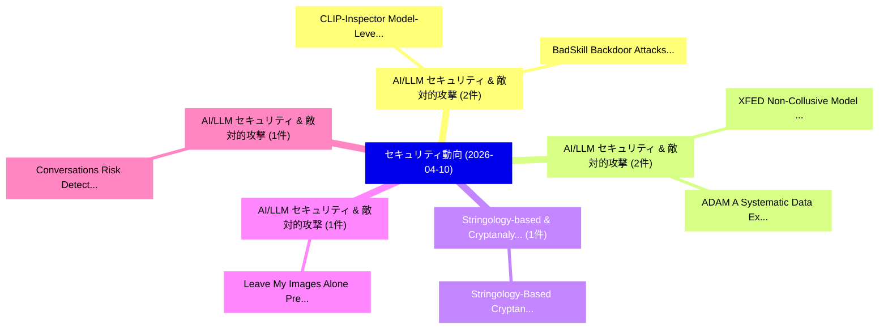

# 📅 02_daily: 日次エグゼクティブサマリー報告書 (2026-04-10)

**集計日時**: 2026-10-02 23:06:04 UTC  
**対象日付**: 2026-04-10  
**本日収集論文数**: 17 件  

---

## 💡 主要セキュリティ動向・脅威インサイト (Executive Insights)

本日の収集論文（計 17 件）において、以下の重点セキュリティ領域で活発な研究動向が確認されました：
- **AI/LLM セキュリティ & 敵対的攻撃** (2 件): 注目論文として 「CLIP-Inspector: Model-Level Ba...」、「BadSkill: Backdoor Attacks on ...」 等が発表され、実務防御および攻撃検証の進展が見られます。
- **AI/LLM セキュリティ & 敵対的攻撃** (2 件): 注目論文として 「XFED: Non-Collusive Model Pois...」、「ADAM: A Systematic Data Extrac...」 等が発表され、実務防御および攻撃検証の進展が見られます。
- **Stringology-based & Cryptanalysis** (1 件): 注目論文として 「Stringology-Based Cryptanalysi...」 等が発表され、実務防御および攻撃検証の進展が見られます。
- **AI/LLM セキュリティ & 敵対的攻撃** (1 件): 注目論文として 「Leave My Images Alone: Prevent...」 等が発表され、実務防御および攻撃検証の進展が見られます。
- **AI/LLM セキュリティ & 敵対的攻撃** (1 件): 注目論文として 「Conversations Risk Detection L...」 等が発表され、実務防御および攻撃検証の進展が見られます。

### 🗺️ 技術・脅威トピックマインドマップ

---

## 📌 日次セキュリティ論文一覧 (日本語表形式)

| No | arXiv ID | 論文タイトル (日本語訳) | 重要キーワード | 構造化エグゼクティブ要約 (背景・提案・影響) | 脅威分類 | 詳細リンク |
|---|---|---|---|---|---|---|
| 1 | `2604.08862v1` | [Stringology-Based Cryptanalysis for EChaCha20 Stream Cipher（セキュリティ分析論文）](../../okf/papers/2026-04-10/2604.08862.md) | `Based Cryptanalysis`, `Stream Cipher`, `Stringology-Based Cryptanalysis` | 【提案】概要 (Overview & Key Finding) 本論文「Stringology-Based Cryptanalysis for EChaCha20 Stream Ci...。実証評価により経営層・セキュリティ管理者向け推奨アクション (E... | `cybersecurity` | [arXiv](https://arxiv.org/abs/2604.08862v1) &#124; [OKF](../../okf/papers/2026-04-10/2604.08862.md) |
| 2 | `2604.09024v1` | [Leave My Images Alone: Preventing Multi-Modal 大規模言語モデル from Analyzing Images via Visual Prompt Injection](../../okf/papers/2026-04-10/2604.09024.md) | `Visual Prompt Injection`, `Preventing Multi`, `Analyzing Images` | 【提案】概要 (Overview & Key Finding) 本論文「Leave My Images Alone: Preventing Multi-Modal 大規模言語モデル ...。実証評価により経営層・セキュリティ管理者向け推奨アクション (E... | `cs.AI` | [arXiv](https://arxiv.org/abs/2604.09024v1) &#124; [OKF](../../okf/papers/2026-04-10/2604.09024.md) |
| 3 | `2604.09056v1` | [Conversations Risk Detection LLMs in Financial Agents via Multi-Stage Generative Rollout（セキュリティ分析論文）](../../okf/papers/2026-04-10/2604.09056.md) | `Conversations Risk Detection`, `Stage Generative Rollout`, `Financial Agents` | 【提案】概要 (Overview & Key Finding) 本論文「Conversations Risk Detection LLMs in Financial Agents v...。実証評価により経営層・セキュリティ管理者向け推奨アクション (E... | `cs.CE` | [arXiv](https://arxiv.org/abs/2604.09056v1) &#124; [OKF](../../okf/papers/2026-04-10/2604.09056.md) |
| 4 | `2604.09089v1` | [DeepGuard: Secure Code Generation via Multi-Layer Semantic Aggregation（セキュリティ分析論文）](../../okf/papers/2026-04-10/2604.09089.md) | `Secure Code Generation`, `Layer Semantic Aggregation`, `Multi-Layer Semantic` | 【提案】概要 (Overview & Key Finding) 本論文「DeepGuard: Secure Code Generation via Multi-Layer Seman...。実証評価により経営層・セキュリティ管理者向け推奨アクション (E... | `cs.AI` | [arXiv](https://arxiv.org/abs/2604.09089v1) &#124; [OKF](../../okf/papers/2026-04-10/2604.09089.md) |
| 5 | `2604.09101v1` | [CLIP-Inspector: Model-Level Backdoor Detection for Prompt-Tuned CLIP via OOD Trigger Inversion（セキュリティ分析論文）](../../okf/papers/2026-04-10/2604.09101.md) | `Level Backdoor Detection`, `Trigger Inversion`, `Model-Level Backdoor` | 【提案】概要 (Overview & Key Finding) 本論文「CLIP-Inspector: Model-Level Backdoor Detection for Prom...。実証評価により経営層・セキュリティ管理者向け推奨アクション (E... | `cs.AI` | [arXiv](https://arxiv.org/abs/2604.09101v1) &#124; [OKF](../../okf/papers/2026-04-10/2604.09101.md) |
| 6 | `2604.09153v1` | [Hagenberg Risk Management Process (Part 3): Operationalization, Probabilities, and Causal Analysis（セキュリティ分析論文）](../../okf/papers/2026-04-10/2604.09153.md) | `Hagenberg Risk Management Process`, `Hagenberg Risk Management Proce`, `Eckehard Hermann` | 【提案】概要 (Overview & Key Finding) 本論文「Hagenberg Risk Management Process (Part 3): Operational...。実証評価により経営層・セキュリティ管理者向け推奨アクション (E... | `cybersecurity` | [arXiv](https://arxiv.org/abs/2604.09153v1) &#124; [OKF](../../okf/papers/2026-04-10/2604.09153.md) |
| 7 | `2604.09165v1` | [A Deductive System for Contract Satisfaction Proofs（セキュリティ分析論文）](../../okf/papers/2026-04-10/2604.09165.md) | `Contract Satisfaction Proofs`, `Deductive System`, `Arthur Correnson` | 【提案】概要 (Overview & Key Finding) 本論文「A Deductive System for Contract Satisfaction Proofs（セキュ...。実証評価により経営層・セキュリティ管理者向け推奨アクション (E... | `cs.PL` | [arXiv](https://arxiv.org/abs/2604.09165v1) &#124; [OKF](../../okf/papers/2026-04-10/2604.09165.md) |
| 8 | `2604.09235v1` | [Unreal Thinking: Chain-of-Thought Hijacking via Two-stage Backdoor（セキュリティ分析論文）](../../okf/papers/2026-04-10/2604.09235.md) | `Unreal Thinking`, `Thought Hijacking`, `Two-stage Backdoor` | 【提案】概要 (Overview & Key Finding) 本論文「Unreal Thinking: Chain-of-Thought Hijacking via Two-sta...。実証評価により経営層・セキュリティ管理者向け推奨アクション (E... | `cybersecurity` | [arXiv](https://arxiv.org/abs/2604.09235v1) &#124; [OKF](../../okf/papers/2026-04-10/2604.09235.md) |
| 9 | `2604.09292v1` | [Cross-Paradigm Models of Restricted Syndrome Decoding with Application to CROSS（セキュリティ分析論文）](../../okf/papers/2026-04-10/2604.09292.md) | `Restricted Syndrome Decoding`, `Paradigm Models`, `Cross-Paradigm Models` | 【提案】概要 (Overview & Key Finding) 本論文「Cross-Paradigm Models of Restricted Syndrome Decoding w...。実証評価により経営層・セキュリティ管理者向け推奨アクション (E... | `executive-summary` | [arXiv](https://arxiv.org/abs/2604.09292v1) &#124; [OKF](../../okf/papers/2026-04-10/2604.09292.md) |
| 10 | `2604.09316v1` | [ChatGPT, is this real? The influence of generative AI on writing style in top-tier サイバーセキュリティ papers](../../okf/papers/2026-04-10/2604.09316.md) | `top-tier cybersecurity`, `Daan Vansteenhuyse`, `Raw Meta` | 【提案】The influence of generative AI on writing style in top-tier cybersecurity papers ### (日...。実証評価により経営層・セキュリティ管理者向け推奨アクション (E... | `cybersecurity` | [arXiv](https://arxiv.org/abs/2604.09316v1) &#124; [OKF](../../okf/papers/2026-04-10/2604.09316.md) |
| 11 | `2604.09378v1` | [BadSkill: Backdoor Attacks on Agent Skills via Model-in-Skill Poisoning（セキュリティ分析論文）](../../okf/papers/2026-04-10/2604.09378.md) | `Backdoor Attacks`, `Agent Skills`, `Skill Poisoning` | 【提案】概要 (Overview & Key Finding) 本論文「BadSkill: Backdoor Attacks on Agent Skills via Model-in...。実証評価により経営層・セキュリティ管理者向け推奨アクション (E... | `cs.AI` | [arXiv](https://arxiv.org/abs/2604.09378v1) &#124; [OKF](../../okf/papers/2026-04-10/2604.09378.md) |
| 12 | `2604.09489v1` | [XFED: Non-Collusive Model Poisoning Attack Against Byzantine-Robust Federated Classifiers（セキュリティ分析論文）](../../okf/papers/2026-04-10/2604.09489.md) | `Robust Federated Classifiers`, `Non-Collusive Model`, `Byzantine-Robust Federated` | 【提案】概要 (Overview & Key Finding) 本論文「XFED: Non-Collusive モデル汚染 Attack Against Byzantine-Robu...。実証評価により経営層・セキュリティ管理者向け推奨アクション (E... | `cs.AI` | [arXiv](https://arxiv.org/abs/2604.09489v1) &#124; [OKF](../../okf/papers/2026-04-10/2604.09489.md) |
| 13 | `2604.09541v1` | [Trans-RAG: Query-Centric Vector Transformation for Secure Cross-Organizational Retrieval（セキュリティ分析論文）](../../okf/papers/2026-04-10/2604.09541.md) | `Centric Vector Transformation`, `Secure Cross`, `Organizational Retrieval` | 【提案】概要 (Overview & Key Finding) 本論文「Trans-RAG: Query-Centric Vector Transformation for Secu...。実証評価により経営層・セキュリティ管理者向け推奨アクション (E... | `executive-summary` | [arXiv](https://arxiv.org/abs/2604.09541v1) &#124; [OKF](../../okf/papers/2026-04-10/2604.09541.md) |
| 14 | `2604.09747v1` | [ADAM: A Systematic Data Extraction Attack on Agent Memory via Adaptive Querying（セキュリティ分析論文）](../../okf/papers/2026-04-10/2604.09747.md) | `Systematic Data Extraction Attack`, `Agent Memory`, `Adaptive Querying` | 【提案】概要 (Overview & Key Finding) 本論文「ADAM: A Systematic Data Extraction Attack on Agent Memo...。実証評価により経営層・セキュリティ管理者向け推奨アクション (E... | `cs.AI` | [arXiv](https://arxiv.org/abs/2604.09747v1) &#124; [OKF](../../okf/papers/2026-04-10/2604.09747.md) |
| 15 | `2604.09748v1` | [Backdoors in RLVR: Jailbreak Backdoors in LLMs From Verifiable Reward（セキュリティ分析論文）](../../okf/papers/2026-04-10/2604.09748.md) | `Jailbreak Backdoors`, `Weiyang Guo`, `Zesheng Shi` | 【提案】概要 (Overview & Key Finding) 本論文「Backdoors in RLVR: ジェイルブレイク Backdoors in LLMs From Veri...。実証評価により経営層・セキュリティ管理者向け推奨アクション (E... | `cs.AI` | [arXiv](https://arxiv.org/abs/2604.09748v1) &#124; [OKF](../../okf/papers/2026-04-10/2604.09748.md) |
| 16 | `2604.09750v1` | [Conflicts Make Large Reasoning Models Vulnerable to Attacks（セキュリティ分析論文）](../../okf/papers/2026-04-10/2604.09750.md) | `Conflicts Make Large Reasoning Models Vulnerable`, `Honghao Liu`, `Chengjin Xu` | 【提案】概要 (Overview & Key Finding) 本論文「Conflicts Make Large Reasoning Models Vulnerable to Att...。実証評価により経営層・セキュリティ管理者向け推奨アクション (E... | `cs.AI` | [arXiv](https://arxiv.org/abs/2604.09750v1) &#124; [OKF](../../okf/papers/2026-04-10/2604.09750.md) |
| 17 | `2604.09924v1` | [S3CDM: A secret-sharing-scheme-based cyberattack detection model and its simulation implementation（セキュリティ分析論文）](../../okf/papers/2026-04-10/2604.09924.md) | `scheme-based cyberattack`, `Chi Sing Chum`, `Jia Lu` | 【提案】概要 (Overview & Key Finding) 本論文「S3CDM: A secret-sharing-scheme-based cyberattack detect...。実証評価により経営層・セキュリティ管理者向け推奨アクション (E... | `cybersecurity` | [arXiv](https://arxiv.org/abs/2604.09924v1) &#124; [OKF](../../okf/papers/2026-04-10/2604.09924.md) |

