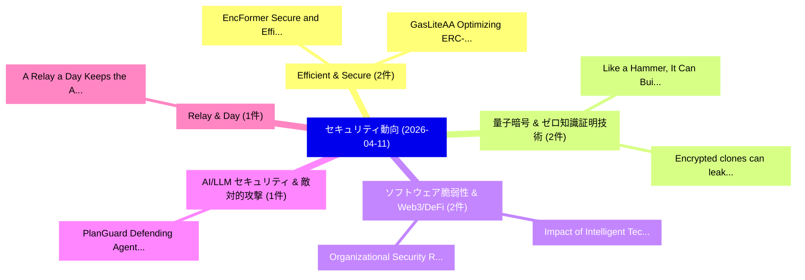

# 📅 02_daily: 日次エグゼクティブサマリー報告書 (2026-04-11)

**集計日時**: 2026-10-02 23:06:04 UTC  
**対象日付**: 2026-04-11  
**本日収集論文数**: 15 件  

---

## 💡 主要セキュリティ動向・脅威インサイト (Executive Insights)

本日の収集論文（計 15 件）において、以下の重点セキュリティ領域で活発な研究動向が確認されました：
- **Efficient & Secure** (2 件): 注目論文として 「EncFormer: Secure and Efficien...」、「GasLiteAA: Optimizing ERC-4337...」 等が発表され、実務防御および攻撃検証の進展が見られます。
- **量子暗号 & ゼロ知識証明技術** (2 件): 注目論文として 「Like a Hammer, It Can Build, I...」、「Encrypted clones can leak: Cla...」 等が発表され、実務防御および攻撃検証の進展が見られます。
- **ソフトウェア脆弱性 & Web3/DeFi** (2 件): 注目論文として 「Impact of Intelligent Technolo...」、「Organizational Security Resour...」 等が発表され、実務防御および攻撃検証の進展が見られます。
- **AI/LLM セキュリティ & 敵対的攻撃** (1 件): 注目論文として 「PlanGuard: Defending Agents ag...」 等が発表され、実務防御および攻撃検証の進展が見られます。
- **Relay & Day** (1 件): 注目論文として 「A Relay a Day Keeps the AirTag...」 等が発表され、実務防御および攻撃検証の進展が見られます。

### 🗺️ 技術・脅威トピックマインドマップ

---

## 📌 日次セキュリティ論文一覧 (日本語表形式)

| No | arXiv ID | 論文タイトル (日本語訳) | 重要キーワード | 構造化エグゼクティブ要約 (背景・提案・影響) | 脅威分類 | 詳細リンク |
|---|---|---|---|---|---|---|
| 1 | `2604.09975v1` | [EncFormer: Secure and Efficient Transformer Inference over Encrypted Data（セキュリティ分析論文）](../../okf/papers/2026-04-11/2604.09975.md) | `Efficient Transformer Inference`, `Encrypted Data`, `Khin Mi Mi Aung` | 【提案】概要 (Overview & Key Finding) 本論文「EncFormer: Secure and Efficient Transformer Inference o...。実証評価により経営層・セキュリティ管理者向け推奨アクション (E... | `cybersecurity` | [arXiv](https://arxiv.org/abs/2604.09975v1) &#124; [OKF](../../okf/papers/2026-04-11/2604.09975.md) |
| 2 | `2604.09998v2` | [Like a Hammer, It Can Build, It Can Break: Large Language Model Uses, Perceptions, and Adoption in サイバーセキュリティ Operations on Reddit](../../okf/papers/2026-04-11/2604.09998.md) | `Large Language Model Uses`, `Cybersecurity Operations`, `Souradip Nath` | 【提案】概要 (Overview & Key Finding) 本論文「Like a Hammer, It Can Build, It Can Break: Large Langua...。実証評価により経営層・セキュリティ管理者向け推奨アクション (E... | `cs.AI` | [arXiv](https://arxiv.org/abs/2604.09998v2) &#124; [OKF](../../okf/papers/2026-04-11/2604.09998.md) |
| 3 | `2604.10052v1` | [Impact of Intelligent Technologies on IoV Security: Integrating Edge Computing and AI（セキュリティ分析論文）](../../okf/papers/2026-04-11/2604.10052.md) | `Integrating Edge Computing`, `Intelligent Technologies`, `Awais Bilal` | 【提案】概要 (Overview & Key Finding) 本論文「Impact of Intelligent Technologies on IoV Security: Int...。実証評価により経営層・セキュリティ管理者向け推奨アクション (E... | `cs.NI` | [arXiv](https://arxiv.org/abs/2604.10052v1) &#124; [OKF](../../okf/papers/2026-04-11/2604.10052.md) |
| 4 | `2604.10134v1` | [PlanGuard: Defending Agents against Indirect Prompt Injection via Planning-based Consistency Verification（セキュリティ分析論文）](../../okf/papers/2026-04-11/2604.10134.md) | `Indirect Prompt Injection`, `Defending Agents`, `Consistency Verification` | 【提案】概要 (Overview & Key Finding) 本論文「PlanGuard: Defending Agents against Indirect プロンプトインジェク...。実証評価により経営層・セキュリティ管理者向け推奨アクション (E... | `cybersecurity` | [arXiv](https://arxiv.org/abs/2604.10134v1) &#124; [OKF](../../okf/papers/2026-04-11/2604.10134.md) |
| 5 | `2604.10138v2` | [A Relay a Day Keeps the AirTag Away: Practical Relay Attacks on Apple's AirTags（セキュリティ分析論文）](../../okf/papers/2026-04-11/2604.10138.md) | `Practical Relay Attacks`, `Day Keeps`, `Leonid Liadveikin` | 【提案】概要 (Overview & Key Finding) 本論文「A Relay a Day Keeps the AirTag Away: Practical Relay At...。実証評価により経営層・セキュリティ管理者向け推奨アクション (E... | `executive-summary` | [arXiv](https://arxiv.org/abs/2604.10138v2) &#124; [OKF](../../okf/papers/2026-04-11/2604.10138.md) |
| 6 | `2604.10145v1` | [Mask-Free Privacy Extraction and Rewriting: A Domain-Aware Approach via Prototype Learning（セキュリティ分析論文）](../../okf/papers/2026-04-11/2604.10145.md) | `Free Privacy Extraction`, `Mask-Free Privacy`, `Prototype Learning` | 【提案】概要 (Overview & Key Finding) 本論文「Mask-Free Privacy Extraction and Rewriting: A Domain-Aw...。実証評価により経営層・セキュリティ管理者向け推奨アクション (E... | `cybersecurity` | [arXiv](https://arxiv.org/abs/2604.10145v1) &#124; [OKF](../../okf/papers/2026-04-11/2604.10145.md) |
| 7 | `2604.10155v1` | [Encrypted clones can leak: Classification of informative subsets in Quantum Encrypted Cloning（セキュリティ分析論文）](../../okf/papers/2026-04-11/2604.10155.md) | `Quantum Encrypted Cloning`, `Gabriele Gianini`, `Omar Hasan` | 【提案】概要 (Overview & Key Finding) 本論文「Encrypted clones can leak: Classification of informativ...。実証評価により経営層・セキュリティ管理者向け推奨アクション (E... | `executive-summary` | [arXiv](https://arxiv.org/abs/2604.10155v1) &#124; [OKF](../../okf/papers/2026-04-11/2604.10155.md) |
| 8 | `2604.10160v1` | [GasLiteAA: Optimizing ERC-4337 for Efficient and Secure Gas Sponsorship（セキュリティ分析論文）](../../okf/papers/2026-04-11/2604.10160.md) | `Secure Gas Sponsorship`, `Hongxu Su`, `Mingzhe Liu` | 【提案】概要 (Overview & Key Finding) 本論文「GasLiteAA: Optimizing ERC-4337 for Efficient and Secure...。実証評価により経営層・セキュリティ管理者向け推奨アクション (E... | `cs.CE` | [arXiv](https://arxiv.org/abs/2604.10160v1) &#124; [OKF](../../okf/papers/2026-04-11/2604.10160.md) |
| 9 | `2604.10175v1` | ["bot lane noob" Deployment of NLP-based Toxicity Detectors in Video Gamesに向けて](../../okf/papers/2026-04-11/2604.10175.md) | `Toxicity Detectors`, `NLP-based Toxicity`, `Towards Deployment` | 【提案】概要 (Overview & Key Finding) 本論文「"bot lane noob" Deployment of NLP-based Toxicity Detect...。実証評価により経営層・セキュリティ管理者向け推奨アクション (E... | `executive-summary` | [arXiv](https://arxiv.org/abs/2604.10175v1) &#124; [OKF](../../okf/papers/2026-04-11/2604.10175.md) |
| 10 | `2604.10250v1` | [Organizational Security Resource Estimation via Vulnerability Queueing（セキュリティ分析論文）](../../okf/papers/2026-04-11/2604.10250.md) | `Organizational Security Resource Estimation`, `Vulnerability Queueing`, `Zachary Dobos` | 【提案】概要 (Overview & Key Finding) 本論文「Organizational Security Resource Estimation via 脆弱性 Que...。実証評価により経営層・セキュリティ管理者向け推奨アクション (E... | `executive-summary` | [arXiv](https://arxiv.org/abs/2604.10250v1) &#124; [OKF](../../okf/papers/2026-04-11/2604.10250.md) |
| 11 | `2604.10271v5` | [Hijacking Text Heritage: Hiding the Human Signature through Homoglyphic Substitution（セキュリティ分析論文）](../../okf/papers/2026-04-11/2604.10271.md) | `Hijacking Text Heritage`, `Human Signature`, `Homoglyphic Substitution` | 【提案】概要 (Overview & Key Finding) 本論文「Hijacking Text Heritage: Hiding the Human Signature thr...。実証評価により経営層・セキュリティ管理者向け推奨アクション (E... | `executive-summary` | [arXiv](https://arxiv.org/abs/2604.10271v5) &#124; [OKF](../../okf/papers/2026-04-11/2604.10271.md) |
| 12 | `2604.10326v1` | [Jailbreaking the Matrix: Nullspace Steering for Controlled Model Subversion（セキュリティ分析論文）](../../okf/papers/2026-04-11/2604.10326.md) | `Controlled Model Subversion`, `Nullspace Steering`, `Sumit Kumar Jha` | 【提案】概要 (Overview & Key Finding) 本論文「ジェイルブレイクing the Matrix: Nullspace Steering for Controll...。実証評価により経営層・セキュリティ管理者向け推奨アクション (E... | `cs.AI` | [arXiv](https://arxiv.org/abs/2604.10326v1) &#124; [OKF](../../okf/papers/2026-04-11/2604.10326.md) |
| 13 | `2604.10380v1` | [Automatic Teller Machines for Offline E-cash（セキュリティ分析論文）](../../okf/papers/2026-04-11/2604.10380.md) | `Automatic Teller Machines`, `Anrin Chakraborti`, `Qingzhao Zhang` | 【提案】概要 (Overview & Key Finding) 本論文「Automatic Teller Machines for Offline E-cash（セキュリティ分析論文...。実証評価によりReiter - **公開日時**: `2026-... | `cybersecurity` | [arXiv](https://arxiv.org/abs/2604.10380v1) &#124; [OKF](../../okf/papers/2026-04-11/2604.10380.md) |
| 14 | `2604.16477v1` | [A Constructive Proof of Rice's Theorem and the Halting Problem via Hilbert's Tenth Problem（セキュリティ分析論文）](../../okf/papers/2026-04-11/2604.16477.md) | `Constructive Proof`, `Halting Problem`, `Tenth Problem` | 【提案】概要 (Overview & Key Finding) 本論文「A Constructive Proof of Rice's Theorem and the Halting ...。実証評価により経営層・セキュリティ管理者向け推奨アクション (E... | `cs.LO` | [arXiv](https://arxiv.org/abs/2604.16477v1) &#124; [OKF](../../okf/papers/2026-04-11/2604.16477.md) |
| 15 | `2605.20208v1` | [Artificial Pancreas Implantables -- How Healthcare Professionals May Deal With DIY Bio Cases（セキュリティ分析論文）](../../okf/papers/2026-04-11/2605.20208.md) | `Artificial Pancreas Implantables`, `Bio Cases`, `Austin James` | 【提案】概要 (Overview & Key Finding) 本論文「Artificial Pancreas Implantables -- How Healthcare Prof...。実証評価により経営層・セキュリティ管理者向け推奨アクション (E... | `executive-summary` | [arXiv](https://arxiv.org/abs/2605.20208v1) &#124; [OKF](../../okf/papers/2026-04-11/2605.20208.md) |

