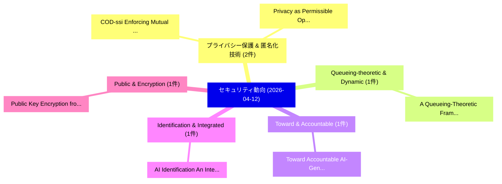

# 📅 02_daily: 日次エグゼクティブサマリー報告書 (2026-04-12)

**集計日時**: 2026-10-02 23:06:04 UTC  
**対象日付**: 2026-04-12  
**本日収集論文数**: 16 件  

---

## 💡 主要セキュリティ動向・脅威インサイト (Executive Insights)

本日の収集論文（計 16 件）において、以下の重点セキュリティ領域で活発な研究動向が確認されました：
- **プライバシー保護 & 匿名化技術** (2 件): 注目論文として 「COD-ssi: Enforcing Mutual Priv...」、「Privacy as Permissible Operati...」 等が発表され、実務防御および攻撃検証の進展が見られます。
- **Queueing-theoretic & Dynamic** (1 件): 注目論文として 「A Queueing-Theoretic Framework...」 等が発表され、実務防御および攻撃検証の進展が見られます。
- **Toward & Accountable** (1 件): 注目論文として 「Toward Accountable AI-Generate...」 等が発表され、実務防御および攻撃検証の進展が見られます。
- **Identification & Integrated** (1 件): 注目論文として 「AI Identification: An Integrat...」 等が発表され、実務防御および攻撃検証の進展が見られます。
- **Public & Encryption** (1 件): 注目論文として 「Public Key Encryption from Hig...」 等が発表され、実務防御および攻撃検証の進展が見られます。

### 🗺️ 技術・脅威トピックマインドマップ

---

## 📌 日次セキュリティ論文一覧 (日本語表形式)

| No | arXiv ID | 論文タイトル (日本語訳) | 重要キーワード | 構造化エグゼクティブ要約 (背景・提案・影響) | 脅威分類 | 詳細リンク |
|---|---|---|---|---|---|---|
| 1 | `2604.10427v2` | [A Queueing-Theoretic Framework for Dynamic Attack Surfaces: Data-Integrated Risk Analysis and Adaptive Defense（セキュリティ分析論文）](../../okf/papers/2026-04-12/2604.10427.md) | `Dynamic Attack Surfaces`, `Adaptive Defense`, `Data-Integrated Risk` | 【提案】概要 (Overview & Key Finding) 本論文「A Queueing-Theoretic Framework for Dynamic Attack Surfa...。実証評価により経営層・セキュリティ管理者向け推奨アクション (E... | `cs.AI` | [arXiv](https://arxiv.org/abs/2604.10427v2) &#124; [OKF](../../okf/papers/2026-04-12/2604.10427.md) |
| 2 | `2604.10460v1` | [Toward Accountable AI-Generated Content on Social Platforms: Steganographic Attribution and Multimodal Harm Detection（セキュリティ分析論文）](../../okf/papers/2026-04-12/2604.10460.md) | `Multimodal Harm Detection`, `Toward Accountable`, `Generated Content` | 【提案】概要 (Overview & Key Finding) 本論文「Toward Accountable AI-Generated Content on Social Platf...。実証評価により経営層・セキュリティ管理者向け推奨アクション (E... | `cs.ET` | [arXiv](https://arxiv.org/abs/2604.10460v1) &#124; [OKF](../../okf/papers/2026-04-12/2604.10460.md) |
| 3 | `2604.10473v1` | [AI Identification: An Integrated Framework for Sustainable Governance in Digital Enterprises（セキュリティ分析論文）](../../okf/papers/2026-04-12/2604.10473.md) | `Sustainable Governance`, `Digital Enterprises`, `Di Kevin Gao` | 【提案】概要 (Overview & Key Finding) 本論文「AI Identification: An Integrated Framework for Sustaina...。実証評価により経営層・セキュリティ管理者向け推奨アクション (E... | `cybersecurity` | [arXiv](https://arxiv.org/abs/2604.10473v1) &#124; [OKF](../../okf/papers/2026-04-12/2604.10473.md) |
| 4 | `2604.10479v1` | [Public Key Encryption from High-Corruption Constraint Satisfaction Problems（セキュリティ分析論文）](../../okf/papers/2026-04-12/2604.10479.md) | `Corruption Constraint Satisfaction Problems`, `Public Key Encryption`, `High-Corruption Constraint` | 【提案】概要 (Overview & Key Finding) 本論文「Public Key Encryption from High-Corruption Constraint S...。実証評価により経営層・セキュリティ管理者向け推奨アクション (E... | `cybersecurity` | [arXiv](https://arxiv.org/abs/2604.10479v1) &#124; [OKF](../../okf/papers/2026-04-12/2604.10479.md) |
| 5 | `2604.10501v1` | [MuSimA: A Tool with Multi-modal Input for Generating Bespoke ABAC Datasets（セキュリティ分析論文）](../../okf/papers/2026-04-12/2604.10501.md) | `Generating Bespoke`, `Multi-modal Input`, `Saket Jha` | 【提案】概要 (Overview & Key Finding) 本論文「MuSimA: A Tool with Multi-modal Input for Generating Be...。実証評価により経営層・セキュリティ管理者向け推奨アクション (E... | `cybersecurity` | [arXiv](https://arxiv.org/abs/2604.10501v1) &#124; [OKF](../../okf/papers/2026-04-12/2604.10501.md) |
| 6 | `2604.10522v1` | [SEED: A Large-Scale Benchmark for Provenance Tracing in Sequential Deepfake Facial Edits（セキュリティ分析論文）](../../okf/papers/2026-04-12/2604.10522.md) | `Sequential Deepfake Facial Edits`, `Scale Benchmark`, `Provenance Tracing` | 【提案】概要 (Overview & Key Finding) 本論文「SEED: A Large-Scale Benchmark for Provenance Tracing in...。実証評価により経営層・セキュリティ管理者向け推奨アクション (E... | `cybersecurity` | [arXiv](https://arxiv.org/abs/2604.10522v1) &#124; [OKF](../../okf/papers/2026-04-12/2604.10522.md) |
| 7 | `2604.10534v1` | [Machine Learning-Based MCP Attacksの検出](../../okf/papers/2026-04-12/2604.10534.md) | `Machine Learning`, `Based Detection`, `Learning-Based Detection` | 【提案】概要 (Overview & Key Finding) 本論文「Machine Learning-Based MCP Attacksの検出」（原題: Machine Lear...。実証評価により経営層・セキュリティ管理者向け推奨アクション (E... | `cs.AI` | [arXiv](https://arxiv.org/abs/2604.10534v1) &#124; [OKF](../../okf/papers/2026-04-12/2604.10534.md) |
| 8 | `2604.10577v2` | [The Blind Spot of Agent Safety: How Benign User Instructions Expose Critical Vulnerabilities in Computer-Use Agents（セキュリティ分析論文）](../../okf/papers/2026-04-12/2604.10577.md) | `Agent Safety`, `Use Agents`, `Computer-Use Agents` | 【提案】概要 (Overview & Key Finding) 本論文「The Blind Spot of Agent Safety: How Benign User Instruc...。実証評価により経営層・セキュリティ管理者向け推奨アクション (E... | `cs.AI` | [arXiv](https://arxiv.org/abs/2604.10577v2) &#124; [OKF](../../okf/papers/2026-04-12/2604.10577.md) |
| 9 | `2604.10611v2` | [DuCodeMark: Dual-Purpose Code Dataset Watermarking via Style-Aware Watermark-Poison Design（セキュリティ分析論文）](../../okf/papers/2026-04-12/2604.10611.md) | `Purpose Code Dataset Watermarking`, `Dual-Purpose Code`, `Aware Watermark` | 【提案】概要 (Overview & Key Finding) 本論文「DuCodeMark: Dual-Purpose Code Dataset Watermarking via ...。実証評価により経営層・セキュリティ管理者向け推奨アクション (E... | `cybersecurity` | [arXiv](https://arxiv.org/abs/2604.10611v2) &#124; [OKF](../../okf/papers/2026-04-12/2604.10611.md) |
| 10 | `2604.10648v1` | [Analyzing Vector Register Usage in Linux Packages to Understand Real-World Impact of Downfall Attack（セキュリティ分析論文）](../../okf/papers/2026-04-12/2604.10648.md) | `Analyzing Vector Register Usage`, `Linux Packages`, `Understand Real` | 【提案】概要 (Overview & Key Finding) 本論文「Analyzing Vector Register Usage in Linux Packages to Un...。実証評価により経営層・セキュリティ管理者向け推奨アクション (E... | `cybersecurity` | [arXiv](https://arxiv.org/abs/2604.10648v1) &#124; [OKF](../../okf/papers/2026-04-12/2604.10648.md) |
| 11 | `2604.10681v2` | [Critical-CoT: A Robust Defense Framework against Reasoning-Level Backdoor Attacks in 大規模言語モデル](../../okf/papers/2026-04-12/2604.10681.md) | `Level Backdoor Attacks`, `Reasoning-Level Backdoor`, `Large Language Models` | 【提案】概要 (Overview & Key Finding) 本論文「Critical-CoT: A Robust Defense Framework against Reason...。実証評価により経営層・セキュリティ管理者向け推奨アクション (E... | `cs.AI` | [arXiv](https://arxiv.org/abs/2604.10681v2) &#124; [OKF](../../okf/papers/2026-04-12/2604.10681.md) |
| 12 | `2604.10685v1` | [COD-ssi: Enforcing Mutual Privacy for Credential Oblivious Disclosure in Self Sovereign Identity（セキュリティ分析論文）](../../okf/papers/2026-04-12/2604.10685.md) | `Enforcing Mutual Privacy`, `Credential Oblivious Disclosure`, `Self Sovereign Identity` | 【提案】概要 (Overview & Key Finding) 本論文「COD-ssi: Enforcing Mutual Privacy for Credential Oblivi...。実証評価により経営層・セキュリティ管理者向け推奨アクション (E... | `cs.ET` | [arXiv](https://arxiv.org/abs/2604.10685v1) &#124; [OKF](../../okf/papers/2026-04-12/2604.10685.md) |
| 13 | `2604.10717v1` | [Detecting RAG Extraction Attack via Dual-Path Runtime Integrity Game（セキュリティ分析論文）](../../okf/papers/2026-04-12/2604.10717.md) | `Path Runtime Integrity Game`, `Extraction Attack`, `Dual-Path Runtime` | 【提案】概要 (Overview & Key Finding) 本論文「Detecting RAG Extraction Attack via Dual-Path Runtime I...。実証評価により経営層・セキュリティ管理者向け推奨アクション (E... | `cs.AI` | [arXiv](https://arxiv.org/abs/2604.10717v1) &#124; [OKF](../../okf/papers/2026-04-12/2604.10717.md) |
| 14 | `2604.10800v1` | [Verify Before You Fix: Agentic Execution Grounding for Trustworthy Cross-Language Code Analysis（セキュリティ分析論文）](../../okf/papers/2026-04-12/2604.10800.md) | `Agentic Execution Grounding`, `Trustworthy Cross`, `Cross-Language Code` | 【提案】概要 (Overview & Key Finding) 本論文「Verify Before You Fix: Agentic Execution Grounding for ...。実証評価により経営層・セキュリティ管理者向け推奨アクション (E... | `cs.PL` | [arXiv](https://arxiv.org/abs/2604.10800v1) &#124; [OKF](../../okf/papers/2026-04-12/2604.10800.md) |
| 15 | `2604.10832v1` | [Privacy as Permissible Operations: An ABAC Framework for Policy-Law Compliance（セキュリティ分析論文）](../../okf/papers/2026-04-12/2604.10832.md) | `Permissible Operations`, `Law Compliance`, `Policy-Law Compliance` | 【提案】概要 (Overview & Key Finding) 本論文「Privacy as Permissible Operations: An ABAC Framework fo...。実証評価により経営層・セキュリティ管理者向け推奨アクション (E... | `cybersecurity` | [arXiv](https://arxiv.org/abs/2604.10832v1) &#124; [OKF](../../okf/papers/2026-04-12/2604.10832.md) |
| 16 | `2604.11839v2` | [Beyond Static Sandboxing: Learned Capability Governance for Autonomous AI Agents（セキュリティ分析論文）](../../okf/papers/2026-04-12/2604.11839.md) | `Beyond Static Sandboxing`, `Learned Capability Governance`, `Bronislav Sidik` | 【提案】概要 (Overview & Key Finding) 本論文「Beyond Static Sandboxing: Learned Capability Governance...。実証評価により経営層・セキュリティ管理者向け推奨アクション (E... | `cs.AI` | [arXiv](https://arxiv.org/abs/2604.11839v2) &#124; [OKF](../../okf/papers/2026-04-12/2604.11839.md) |

