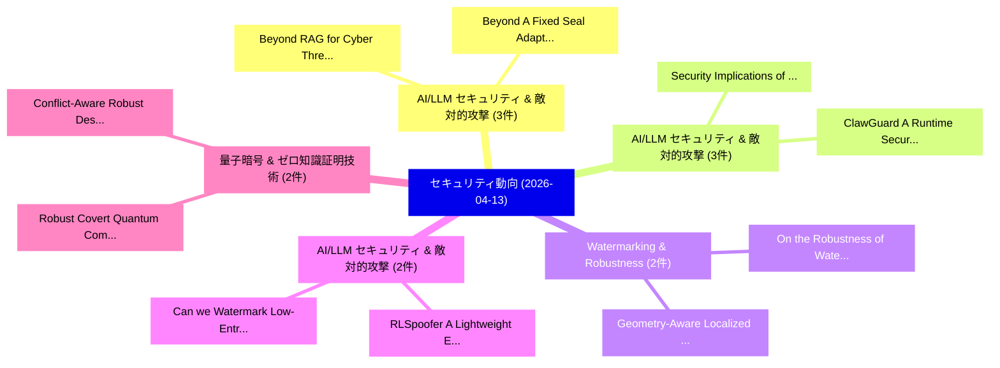

# 📅 02_daily: 日次エグゼクティブサマリー報告書 (2026-04-13)

**集計日時**: 2026-10-02 23:06:05 UTC  
**対象日付**: 2026-04-13  
**本日収集論文数**: 33 件  

---

## 💡 主要セキュリティ動向・脅威インサイト (Executive Insights)

本日の収集論文（計 33 件）において、以下の重点セキュリティ領域で活発な研究動向が確認されました：
- **AI/LLM セキュリティ & 敵対的攻撃** (3 件): 注目論文として 「Beyond A Fixed Seal: Adaptive ...」、「Beyond RAG for Cyber Threat In...」 等が発表され、実務防御および攻撃検証の進展が見られます。
- **AI/LLM セキュリティ & 敵対的攻撃** (3 件): 注目論文として 「Security Implications of 5G Co...」、「ClawGuard: A Runtime Security ...」 等が発表され、実務防御および攻撃検証の進展が見られます。
- **Watermarking & Robustness** (2 件): 注目論文として 「Geometry-Aware Localized Water...」、「On the Robustness of Watermark...」 等が発表され、実務防御および攻撃検証の進展が見られます。
- **AI/LLM セキュリティ & 敵対的攻撃** (2 件): 注目論文として 「RLSpoofer: A Lightweight Evalu...」、「Can we Watermark Low-Entropy L...」 等が発表され、実務防御および攻撃検証の進展が見られます。
- **量子暗号 & ゼロ知識証明技術** (2 件): 注目論文として 「Robust Covert Quantum Communic...」、「Conflict-Aware Robust Design f...」 等が発表され、実務防御および攻撃検証の進展が見られます。

### 🗺️ 技術・脅威トピックマインドマップ

---

## 📌 日次セキュリティ論文一覧 (日本語表形式)

| No | arXiv ID | 論文タイトル (日本語訳) | 重要キーワード | 構造化エグゼクティブ要約 (背景・提案・影響) | 脅威分類 | 詳細リンク |
|---|---|---|---|---|---|---|
| 1 | `2604.10881v1` | [Answering Counting Queries with Differential Privacy on a Quantum Computer（セキュリティ分析論文）](../../okf/papers/2026-04-13/2604.10881.md) | `Answering Counting Queries`, `Differential Privacy`, `Quantum Computer` | 【提案】概要 (Overview & Key Finding) 本論文「Answering Counting Queries with 差分プライバシー on a 量子 Comput...。実証評価により経営層・セキュリティ管理者向け推奨アクション (E... | `executive-summary` | [arXiv](https://arxiv.org/abs/2604.10881v1) &#124; [OKF](../../okf/papers/2026-04-13/2604.10881.md) |
| 2 | `2604.10893v1` | [Beyond A Fixed Seal: Adaptive Stealing Watermark in 大規模言語モデル](../../okf/papers/2026-04-13/2604.10893.md) | `Adaptive Stealing Watermark`, `Fixed Seal`, `Large Language Models` | 【提案】概要 (Overview & Key Finding) 本論文「Beyond A Fixed Seal: Adaptive Stealing Watermark in 大規模...。実証評価により経営層・セキュリティ管理者向け推奨アクション (E... | `cs.AI` | [arXiv](https://arxiv.org/abs/2604.10893v1) &#124; [OKF](../../okf/papers/2026-04-13/2604.10893.md) |
| 3 | `2604.10933v2` | [QShield: Neural Networks Against Adversarial Attacks using Quantum Circuitsのセキュリティ強化](../../okf/papers/2026-04-13/2604.10933.md) | `Quantum Circuits`, `Navid Azimi`, `Aditya Prakash` | 【提案】概要 (Overview & Key Finding) 本論文「QShield: Neural Networks Against 敵対的攻撃s using 量子 Circui...。実証評価により経営層・セキュリティ管理者向け推奨アクション (E... | `cs.AI` | [arXiv](https://arxiv.org/abs/2604.10933v2) &#124; [OKF](../../okf/papers/2026-04-13/2604.10933.md) |
| 4 | `2604.11078v1` | [From Context to Rules: Toward Unified Detection Rule Generation（セキュリティ分析論文）](../../okf/papers/2026-04-13/2604.11078.md) | `Toward Unified Detection Rule Generation`, `Cheng Meng`, `Wenxin Le` | 【提案】概要 (Overview & Key Finding) 本論文「From Context to Rules: Toward Unified Detection Rule Ge...。実証評価により経営層・セキュリティ管理者向け推奨アクション (E... | `cybersecurity` | [arXiv](https://arxiv.org/abs/2604.11078v1) &#124; [OKF](../../okf/papers/2026-04-13/2604.11078.md) |
| 5 | `2604.11141v1` | [Reducing Hallucination in Enterprise AI Workflows via Hybrid Utility Minimum Bayes Risk (HUMBR)（セキュリティ分析論文）](../../okf/papers/2026-04-13/2604.11141.md) | `Hybrid Utility Minimum Bayes Risk`, `Reducing Hallucination`, `Jay Minesh Shah` | 【提案】概要 (Overview & Key Finding) 本論文「Reducing Hallucination in Enterprise AI Workflows via H...。実証評価により経営層・セキュリティ管理者向け推奨アクション (E... | `executive-summary` | [arXiv](https://arxiv.org/abs/2604.11141v1) &#124; [OKF](../../okf/papers/2026-04-13/2604.11141.md) |
| 6 | `2604.11148v1` | [Hardware-Efficient Compound IC Protection with Lightweight Cryptography（セキュリティ分析論文）](../../okf/papers/2026-04-13/2604.11148.md) | `Efficient Compound`, `Lightweight Cryptography`, `Hardware-Efficient Compound` | 【提案】概要 (Overview & Key Finding) 本論文「Hardware-Efficient Compound IC Protection with Lightwei...。実証評価により経営層・セキュリティ管理者向け推奨アクション (E... | `cybersecurity` | [arXiv](https://arxiv.org/abs/2604.11148v1) &#124; [OKF](../../okf/papers/2026-04-13/2604.11148.md) |
| 7 | `2604.11259v1` | [Mobile GUI Agent Privacy Personalization with Trajectory Induced Preference Optimization（セキュリティ分析論文）](../../okf/papers/2026-04-13/2604.11259.md) | `Trajectory Induced Preference Optimization`, `Agent Privacy Personalization`, `Zhixin Lin` | 【提案】概要 (Overview & Key Finding) 本論文「Mobile GUI Agent Privacy Personalization with Trajector...。実証評価により経営層・セキュリティ管理者向け推奨アクション (E... | `cs.AI` | [arXiv](https://arxiv.org/abs/2604.11259v1) &#124; [OKF](../../okf/papers/2026-04-13/2604.11259.md) |
| 8 | `2604.11309v1` | [The Salami Slicing Threat: Exploiting Cumulative Risks in LLM Systems（セキュリティ分析論文）](../../okf/papers/2026-04-13/2604.11309.md) | `Exploiting Cumulative Risks`, `Yihao Zhang`, `Kai Wang` | 【提案】概要 (Overview & Key Finding) 本論文「The Salami Slicing 脅威: Exploiting Cumulative Risks in L...。実証評価により経営層・セキュリティ管理者向け推奨アクション (E... | `cs.AI` | [arXiv](https://arxiv.org/abs/2604.11309v1) &#124; [OKF](../../okf/papers/2026-04-13/2604.11309.md) |
| 9 | `2604.11324v1` | [BRIDGE and TCH-Net: Heterogeneous Benchmark and Multi-Branch Baseline for Cross-Domain IoT Botnet Detection（セキュリティ分析論文）](../../okf/papers/2026-04-13/2604.11324.md) | `Heterogeneous Benchmark`, `Branch Baseline`, `Botnet Detection` | 【提案】概要 (Overview & Key Finding) 本論文「BRIDGE and TCH-Net: Heterogeneous Benchmark and Multi-B...。実証評価により経営層・セキュリティ管理者向け推奨アクション (E... | `cs.NI` | [arXiv](https://arxiv.org/abs/2604.11324v1) &#124; [OKF](../../okf/papers/2026-04-13/2604.11324.md) |
| 10 | `2604.11344v2` | [Geometry-Aware Localized Watermarking for Copyright Protection in Embedding-as-a-Service（セキュリティ分析論文）](../../okf/papers/2026-04-13/2604.11344.md) | `Aware Localized Watermarking`, `Geometry-Aware Localized`, `Copyright Protection` | 【提案】概要 (Overview & Key Finding) 本論文「Geometry-Aware Localized Watermarking for Copyright Pro...。実証評価により経営層・セキュリティ管理者向け推奨アクション (E... | `executive-summary` | [arXiv](https://arxiv.org/abs/2604.11344v2) &#124; [OKF](../../okf/papers/2026-04-13/2604.11344.md) |
| 11 | `2604.11362v1` | [How to reconstruct (anonymously) a secret cellular automaton（セキュリティ分析論文）](../../okf/papers/2026-04-13/2604.11362.md) | `Luca Mariot`, `Federico Mazzone`, `Luca Manzoni` | 【提案】概要 (Overview & Key Finding) 本論文「How to reconstruct (anonymously) a secret cellular auto...。実証評価により経営層・セキュリティ管理者向け推奨アクション (E... | `math.CO` | [arXiv](https://arxiv.org/abs/2604.11362v1) &#124; [OKF](../../okf/papers/2026-04-13/2604.11362.md) |
| 12 | `2604.11394v1` | [Optimizing IoT Intrusion Detection with Tabular Foundation Models for Smart City Forensics（セキュリティ分析論文）](../../okf/papers/2026-04-13/2604.11394.md) | `Tabular Foundation Models`, `Smart City Forensics`, `Intrusion Detection` | 【提案】概要 (Overview & Key Finding) 本論文「Optimizing IoT Intrusion Detection with Tabular Foundat...。実証評価により経営層・セキュリティ管理者向け推奨アクション (E... | `cybersecurity` | [arXiv](https://arxiv.org/abs/2604.11394v1) &#124; [OKF](../../okf/papers/2026-04-13/2604.11394.md) |
| 13 | `2604.11419v1` | [Beyond RAG for Cyber Threat Intelligence: A Systematic Evaluation of Graph-Based and Agentic Retrieval（セキュリティ分析論文）](../../okf/papers/2026-04-13/2604.11419.md) | `Cyber Threat Intelligence`, `Agentic Retrieval`, `Dzenan Hamzic` | 【提案】概要 (Overview & Key Finding) 本論文「Beyond RAG for Cyber 脅威 Intelligence: A Systematic Eval...。実証評価により経営層・セキュリティ管理者向け推奨アクション (E... | `cs.AI` | [arXiv](https://arxiv.org/abs/2604.11419v1) &#124; [OKF](../../okf/papers/2026-04-13/2604.11419.md) |
| 14 | `2604.11429v1` | [Short Message Service (SMS) Phishing Attacks and Defenses: A Systematic Review（セキュリティ分析論文）](../../okf/papers/2026-04-13/2604.11429.md) | `Short Message Service`, `Phishing Attacks`, `Systematic Review` | 【提案】概要 (Overview & Key Finding) 本論文「Short Message Service (SMS) Phishing Attacks and Defens...。実証評価により経営層・セキュリティ管理者向け推奨アクション (E... | `cybersecurity` | [arXiv](https://arxiv.org/abs/2604.11429v1) &#124; [OKF](../../okf/papers/2026-04-13/2604.11429.md) |
| 15 | `2604.11430v2` | [Hardening x402: PII-Safe Agentic Payments via Pre-Execution Metadata Filtering（セキュリティ分析論文）](../../okf/papers/2026-04-13/2604.11430.md) | `Safe Agentic Payments`, `Execution Metadata Filtering`, `PII-Safe Agentic` | 【提案】概要 (Overview & Key Finding) 本論文「Hardening x402: PII-Safe Agentic Payments via Pre-Execu...。実証評価により経営層・セキュリティ管理者向け推奨アクション (E... | `cs.AI` | [arXiv](https://arxiv.org/abs/2604.11430v2) &#124; [OKF](../../okf/papers/2026-04-13/2604.11430.md) |
| 16 | `2604.11506v1` | [RedShell: A Generative AI-Based Approach to Ethical Hacking（セキュリティ分析論文）](../../okf/papers/2026-04-13/2604.11506.md) | `Ethical Hacking`, `Ricardo Bessa`, `Rui Claro` | 【提案】概要 (Overview & Key Finding) 本論文「RedShell: A Generative AI-Based Approach to Ethical Hac...。実証評価により経営層・セキュリティ管理者向け推奨アクション (E... | `cybersecurity` | [arXiv](https://arxiv.org/abs/2604.11506v1) &#124; [OKF](../../okf/papers/2026-04-13/2604.11506.md) |
| 17 | `2604.11509v1` | [Security Implications of 5G Communication in Industrial Systems（セキュリティ分析論文）](../../okf/papers/2026-04-13/2604.11509.md) | `Security Implications`, `Industrial Systems`, `Stefan Lenz` | 【提案】概要 (Overview & Key Finding) 本論文「Security Implications of 5G Communication in Industrial...。実証評価により経営層・セキュリティ管理者向け推奨アクション (E... | `cs.NI` | [arXiv](https://arxiv.org/abs/2604.11509v1) &#124; [OKF](../../okf/papers/2026-04-13/2604.11509.md) |
| 18 | `2604.11546v1` | [RLSpoofer: A Lightweight Evaluator for LLM Watermark Spoofing Resilience（セキュリティ分析論文）](../../okf/papers/2026-04-13/2604.11546.md) | `Watermark Spoofing Resilience`, `Lightweight Evaluator`, `Hanbo Huang` | 【提案】概要 (Overview & Key Finding) 本論文「RLSpoofer: A Lightweight Evaluator for LLM Watermark Sp...。実証評価により経営層・セキュリティ管理者向け推奨アクション (E... | `cybersecurity` | [arXiv](https://arxiv.org/abs/2604.11546v1) &#124; [OKF](../../okf/papers/2026-04-13/2604.11546.md) |
| 19 | `2604.11659v1` | [GPU Acceleration of Sparse Fully Homomorphic Encrypted DNNs（セキュリティ分析論文）](../../okf/papers/2026-04-13/2604.11659.md) | `Sparse Fully Homomorphic Encrypted`, `Sparse Fully Homom`, `Kaustubh Shivdikar` | 【提案】概要 (Overview & Key Finding) 本論文「GPU Acceleration of Sparse Fully Homomorphic Encrypted ...。実証評価により経営層・セキュリティ管理者向け推奨アクション (E... | `executive-summary` | [arXiv](https://arxiv.org/abs/2604.11659v1) &#124; [OKF](../../okf/papers/2026-04-13/2604.11659.md) |
| 20 | `2604.11681v1` | [AmBox: Device-to-Blockchain Ambient Sensing for Food Traceability（セキュリティ分析論文）](../../okf/papers/2026-04-13/2604.11681.md) | `Blockchain Ambient Sensing`, `Food Traceability`, `Miguel Guerreiro Fernandes` | 【提案】概要 (Overview & Key Finding) 本論文「AmBox: Device-to-Blockchain Ambient Sensing for Food Tr...。実証評価により経営層・セキュリティ管理者向け推奨アクション (E... | `cs.ET` | [arXiv](https://arxiv.org/abs/2604.11681v1) &#124; [OKF](../../okf/papers/2026-04-13/2604.11681.md) |
| 21 | `2604.11720v1` | [On the Robustness of Watermarking for Autoregressive Image Generation（セキュリティ分析論文）](../../okf/papers/2026-04-13/2604.11720.md) | `Autoregressive Image Generation`, `Autoregressive Image Gene`, `Denis Lukovnikov` | 【提案】概要 (Overview & Key Finding) 本論文「On the Robustness of Watermarking for Autoregressive Im...。実証評価により経営層・セキュリティ管理者向け推奨アクション (E... | `cs.AI` | [arXiv](https://arxiv.org/abs/2604.11720v1) &#124; [OKF](../../okf/papers/2026-04-13/2604.11720.md) |
| 22 | `2604.11752v1` | [A Synthetic Conversational Smishing Dataset for Social Engineering Detection（セキュリティ分析論文）](../../okf/papers/2026-04-13/2604.11752.md) | `Synthetic Conversational Smishing Dataset`, `Social Engineering Detection`, `Carl Lochstampfor` | 【提案】概要 (Overview & Key Finding) 本論文「A Synthetic Conversational Smishing Dataset for Social ...。実証評価により経営層・セキュリティ管理者向け推奨アクション (E... | `cybersecurity` | [arXiv](https://arxiv.org/abs/2604.11752v1) &#124; [OKF](../../okf/papers/2026-04-13/2604.11752.md) |
| 23 | `2604.11772v1` | [Automated Pentesting with Large Language Modelsに向けて](../../okf/papers/2026-04-13/2604.11772.md) | `Towards Automated Pentesting`, `Large Language Models`, `Automated Pentesting` | 【提案】概要 (Overview & Key Finding) 本論文「Automated Pentesting with Large Language Modelsに向けて」（原題...。実証評価により経営層・セキュリティ管理者向け推奨アクション (E... | `cybersecurity` | [arXiv](https://arxiv.org/abs/2604.11772v1) &#124; [OKF](../../okf/papers/2026-04-13/2604.11772.md) |
| 24 | `2604.11790v2` | [ClawGuard: A Runtime Security Framework for Tool-Augmented LLMエージェント Against Indirect Prompt Injection](../../okf/papers/2026-04-13/2604.11790.md) | `Tool-Augmented LLM`, `Wei Zhao`, `Zhe Li` | 【提案】概要 (Overview & Key Finding) 本論文「ClawGuard: A Runtime Security Framework for Tool-Augmen...。実証評価により経営層・セキュリティ管理者向け推奨アクション (E... | `cs.AI` | [arXiv](https://arxiv.org/abs/2604.11790v2) &#124; [OKF](../../okf/papers/2026-04-13/2604.11790.md) |
| 25 | `2604.11853v1` | [Evaluating Lightweight Block Cipher Payload Encryption for Real-Time CAN Traffic（セキュリティ分析論文）](../../okf/papers/2026-04-13/2604.11853.md) | `Evaluating Lightweight Block Cipher Payload Encryption`, `Real-Time CAN`, `Kevin Setterstrom` | 【提案】概要 (Overview & Key Finding) 本論文「Evaluating Lightweight Block Cipher Payload Encryption ...。実証評価により経営層・セキュリティ管理者向け推奨アクション (E... | `cybersecurity` | [arXiv](https://arxiv.org/abs/2604.11853v1) &#124; [OKF](../../okf/papers/2026-04-13/2604.11853.md) |
| 26 | `2604.11928v1` | [INTARG: Informed Real-Time Adversarial Attack Generation for Time-Series Regression（セキュリティ分析論文）](../../okf/papers/2026-04-13/2604.11928.md) | `Time Adversarial Attack Generation`, `Informed Real`, `Real-Time Adversarial` | 【提案】概要 (Overview & Key Finding) 本論文「INTARG: Informed Real-Time 敵対的攻撃 Generation for Time-Se...。実証評価により経営層・セキュリティ管理者向け推奨アクション (E... | `executive-summary` | [arXiv](https://arxiv.org/abs/2604.11928v1) &#124; [OKF](../../okf/papers/2026-04-13/2604.11928.md) |
| 27 | `2604.11950v2` | [AnyPoC: Universal Proof-of-Concept Test Generation for Scalable LLM-Based Bug Detection（セキュリティ分析論文）](../../okf/papers/2026-04-13/2604.11950.md) | `Concept Test Generation`, `Based Bug Detection`, `Universal Proof` | 【提案】概要 (Overview & Key Finding) 本論文「AnyPoC: Universal Proof-of-Concept Test Generation for ...。実証評価により経営層・セキュリティ管理者向け推奨アクション (E... | `cs.AI` | [arXiv](https://arxiv.org/abs/2604.11950v2) &#124; [OKF](../../okf/papers/2026-04-13/2604.11950.md) |
| 28 | `2604.12040v1` | [SIR-Bench: Evaluating Investigation Depth in Security Incident Response Agents（セキュリティ分析論文）](../../okf/papers/2026-04-13/2604.12040.md) | `Security Incident Response Agents`, `Evaluating Investigation Depth`, `Daniel Begimher` | 【提案】概要 (Overview & Key Finding) 本論文「SIR-Bench: Evaluating Investigation Depth in Security I...。実証評価により経営層・セキュリティ管理者向け推奨アクション (E... | `cs.AI` | [arXiv](https://arxiv.org/abs/2604.12040v1) &#124; [OKF](../../okf/papers/2026-04-13/2604.12040.md) |
| 29 | `2604.12051v1` | [Can we Watermark Low-Entropy LLM Outputs?（セキュリティ分析論文）](../../okf/papers/2026-04-13/2604.12051.md) | `Watermark Low`, `Low-Entropy LLM`, `Noam Mazor` | 【提案】### (日本語題名: Can we Watermark Low-Entropy LLM Outputs?（セキュリティ分析論文）)  > [!NOTE] > **OKF M...。実証評価により経営層・セキュリティ管理者向け推奨アクション (E... | `cybersecurity` | [arXiv](https://arxiv.org/abs/2604.12051v1) &#124; [OKF](../../okf/papers/2026-04-13/2604.12051.md) |
| 30 | `2604.12064v1` | [LLM-Redactor: An Empirical Evaluation of Eight Techniques for Privacy-Preserving LLM Requests（セキュリティ分析論文）](../../okf/papers/2026-04-13/2604.12064.md) | `Eight Techniques`, `Privacy-Preserving LLM`, `Godfred Manu Addo Boakye` | 【提案】概要 (Overview & Key Finding) 本論文「LLM-Redactor: An Empirical Evaluation of Eight Techniqu...。実証評価により経営層・セキュリティ管理者向け推奨アクション (E... | `executive-summary` | [arXiv](https://arxiv.org/abs/2604.12064v1) &#124; [OKF](../../okf/papers/2026-04-13/2604.12064.md) |
| 31 | `2604.13116v1` | [Robust Covert Quantum Communication under Bounded Channel Uncertainty（セキュリティ分析論文）](../../okf/papers/2026-04-13/2604.13116.md) | `Robust Covert Quantum Communication`, `Bounded Channel Uncertainty`, `Vahid Azimi Mousolou` | 【提案】概要 (Overview & Key Finding) 本論文「Robust Covert 量子 Communication under Bounded Channel Un...。実証評価によりPapadopoulos, Vahid Azimi。 | `executive-summary` | [arXiv](https://arxiv.org/abs/2604.13116v1) &#124; [OKF](../../okf/papers/2026-04-13/2604.13116.md) |
| 32 | `2604.13122v1` | [Conflict-Aware Robust Design for Covert Wireless Communications（セキュリティ分析論文）](../../okf/papers/2026-04-13/2604.13122.md) | `Aware Robust Design`, `Covert Wireless Communications`, `Conflict-Aware Robust` | 【提案】概要 (Overview & Key Finding) 本論文「Conflict-Aware Robust Design for Covert Wireless Commun...。実証評価により経営層・セキュリティ管理者向け推奨アクション (E... | `executive-summary` | [arXiv](https://arxiv.org/abs/2604.13122v1) &#124; [OKF](../../okf/papers/2026-04-13/2604.13122.md) |
| 33 | `2604.22790v1` | [Structural Limits of Soft Fusion in Multi-Warden Covert Communication（セキュリティ分析論文）](../../okf/papers/2026-04-13/2604.22790.md) | `Warden Covert Communication`, `Structural Limits`, `Soft Fusion` | 【提案】概要 (Overview & Key Finding) 本論文「Structural Limits of Soft Fusion in Multi-Warden Covert...。実証評価により経営層・セキュリティ管理者向け推奨アクション (E... | `executive-summary` | [arXiv](https://arxiv.org/abs/2604.22790v1) &#124; [OKF](../../okf/papers/2026-04-13/2604.22790.md) |

