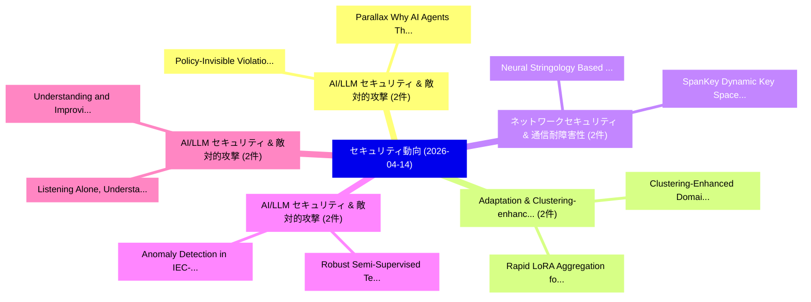

# 📅 02_daily: 日次エグゼクティブサマリー報告書 (2026-04-14)

**集計日時**: 2026-10-02 23:06:05 UTC  
**対象日付**: 2026-04-14  
**本日収集論文数**: 38 件  

---

## 💡 主要セキュリティ動向・脅威インサイト (Executive Insights)

本日の収集論文（計 38 件）において、以下の重点セキュリティ領域で活発な研究動向が確認されました：
- **AI/LLM セキュリティ & 敵対的攻撃** (2 件): 注目論文として 「Policy-Invisible Violations in...」、「Parallax: Why AI Agents That T...」 等が発表され、実務防御および攻撃検証の進展が見られます。
- **Adaptation & Clustering-enhanced** (2 件): 注目論文として 「Clustering-Enhanced Domain Ada...」、「Rapid LoRA Aggregation for Wir...」 等が発表され、実務防御および攻撃検証の進展が見られます。
- **ネットワークセキュリティ & 通信耐障害性** (2 件): 注目論文として 「SpanKey: Dynamic Key Space Con...」、「Neural Stringology Based Crypt...」 等が発表され、実務防御および攻撃検証の進展が見られます。
- **AI/LLM セキュリティ & 敵対的攻撃** (2 件): 注目論文として 「Robust Semi-Supervised Tempora...」、「Anomaly Detection in IEC-61850...」 等が発表され、実務防御および攻撃検証の進展が見られます。
- **AI/LLM セキュリティ & 敵対的攻撃** (2 件): 注目論文として 「Understanding and Improving Co...」、「Listening Alone, Understanding...」 等が発表され、実務防御および攻撃検証の進展が見られます。

### 🗺️ 技術・脅威トピックマインドマップ

---

## 📌 日次セキュリティ論文一覧 (日本語表形式)

| No | arXiv ID | 論文タイトル (日本語訳) | 重要キーワード | 構造化エグゼクティブ要約 (背景・提案・影響) | 脅威分類 | 詳細リンク |
|---|---|---|---|---|---|---|
| 1 | `2604.12168v1` | [Fully Homomorphic Encryption on Llama 3 model for privacy preserving LLM inference（セキュリティ分析論文）](../../okf/papers/2026-04-14/2604.12168.md) | `Fully Homomorphic Encryption`, `Anes Abdennebi`, `Nadjia Kara` | 【提案】概要 (Overview & Key Finding) 本論文「Fully 準同型暗号 on Llama 3 model for privacy preserving LLM...。実証評価により経営層・セキュリティ管理者向け推奨アクション (E... | `cs.AI` | [arXiv](https://arxiv.org/abs/2604.12168v1) &#124; [OKF](../../okf/papers/2026-04-14/2604.12168.md) |
| 2 | `2604.12172v1` | [COBALT-TLA: A Neuro-Symbolic Verification Loop for Cross-Chain Bridge Vulnerability Discovery（セキュリティ分析論文）](../../okf/papers/2026-04-14/2604.12172.md) | `Chain Bridge Vulnerability Discovery`, `Symbolic Verification Loop`, `Neuro-Symbolic Verification` | 【提案】概要 (Overview & Key Finding) 本論文「COBALT-TLA: A Neuro-Symbolic Verification Loop for Cros...。実証評価により経営層・セキュリティ管理者向け推奨アクション (E... | `cs.LO` | [arXiv](https://arxiv.org/abs/2604.12172v1) &#124; [OKF](../../okf/papers/2026-04-14/2604.12172.md) |
| 3 | `2604.12177v1` | [Policy-Invisible Violations in LLM-Based Agents（セキュリティ分析論文）](../../okf/papers/2026-04-14/2604.12177.md) | `Invisible Violations`, `Based Agents`, `Policy-Invisible Violations` | 【提案】概要 (Overview & Key Finding) 本論文「Policy-Invisible Violations in LLM-Based Agents（セキュリティ分...。実証評価により経営層・セキュリティ管理者向け推奨アクション (E... | `cs.AI` | [arXiv](https://arxiv.org/abs/2604.12177v1) &#124; [OKF](../../okf/papers/2026-04-14/2604.12177.md) |
| 4 | `2604.12178v1` | [Mitigating S-RAHA: An On-device Framework to Prevent Forwarding of Re-Captured Images（セキュリティ分析論文）](../../okf/papers/2026-04-14/2604.12178.md) | `Prevent Forwarding`, `Captured Images`, `Re-Captured Images` | 【提案】概要 (Overview & Key Finding) 本論文「Mitigating S-RAHA: An On-device Framework to Prevent Fo...。実証評価により# Mitigating S-RAHA: An O... | `cybersecurity` | [arXiv](https://arxiv.org/abs/2604.12178v1) &#124; [OKF](../../okf/papers/2026-04-14/2604.12178.md) |
| 5 | `2604.12183v1` | [Clustering-Enhanced Domain Adaptation for Cross-Domain Intrusion Detection in Industrial Control Systems（セキュリティ分析論文）](../../okf/papers/2026-04-14/2604.12183.md) | `Enhanced Domain Adaptation`, `Domain Intrusion Detection`, `Industrial Control Systems` | 【提案】概要 (Overview & Key Finding) 本論文「Clustering-Enhanced Domain Adaptation for Cross-Domain ...。実証評価により経営層・セキュリティ管理者向け推奨アクション (E... | `cs.AI` | [arXiv](https://arxiv.org/abs/2604.12183v1) &#124; [OKF](../../okf/papers/2026-04-14/2604.12183.md) |
| 6 | `2604.12216v1` | [TimeMark: A Trustworthy Time Watermarking Framework for Exact Generation-Time Recovery from AIGC（セキュリティ分析論文）](../../okf/papers/2026-04-14/2604.12216.md) | `Exact Generation`, `Time Recovery`, `Generation-Time Recovery` | 【提案】概要 (Overview & Key Finding) 本論文「TimeMark: A Trustworthy Time Watermarking Framework for...。実証評価により経営層・セキュリティ管理者向け推奨アクション (E... | `executive-summary` | [arXiv](https://arxiv.org/abs/2604.12216v1) &#124; [OKF](../../okf/papers/2026-04-14/2604.12216.md) |
| 7 | `2604.12228v1` | [From IOCs to Regex: Automating CTI Operationalization for SOC with LLMs（セキュリティ分析論文）](../../okf/papers/2026-04-14/2604.12228.md) | `Yu Tseng`, `Lan Zhang`, `Xiaoyan Sun` | 【提案】概要 (Overview & Key Finding) 本論文「From IOCs to Regex: Automating CTI Operationalization f...。実証評価により経営層・セキュリティ管理者向け推奨アクション (E... | `cybersecurity` | [arXiv](https://arxiv.org/abs/2604.12228v1) &#124; [OKF](../../okf/papers/2026-04-14/2604.12228.md) |
| 8 | `2604.12232v1` | [TEMPLATEFUZZ: Fine-Grained Chat Template Fuzzing for Jailbreaking and Red Teaming LLMs（セキュリティ分析論文）](../../okf/papers/2026-04-14/2604.12232.md) | `Grained Chat Template Fuzzing`, `Red Teaming`, `Fine-Grained Chat` | 【提案】概要 (Overview & Key Finding) 本論文「TEMPLATEFUZZ: Fine-Grained Chat Template Fuzzing for ジェ...。実証評価により経営層・セキュリティ管理者向け推奨アクション (E... | `cs.AI` | [arXiv](https://arxiv.org/abs/2604.12232v1) &#124; [OKF](../../okf/papers/2026-04-14/2604.12232.md) |
| 9 | `2604.12254v2` | [SpanKey: Dynamic Key Space Conditioning for Neural Network Access Control（セキュリティ分析論文）](../../okf/papers/2026-04-14/2604.12254.md) | `Dynamic Key Space Conditioning`, `Neural Network Access Control`, `Raw Meta` | 【提案】概要 (Overview & Key Finding) 本論文「SpanKey: Dynamic Key Space Conditioning for Neural Netw...。実証評価により経営層・セキュリティ管理者向け推奨アクション (E... | `cs.AI` | [arXiv](https://arxiv.org/abs/2604.12254v2) &#124; [OKF](../../okf/papers/2026-04-14/2604.12254.md) |
| 10 | `2604.12284v1` | [WebAgentGuard: A Reasoning-Driven Guard Model for Detecting Prompt Injection Attacks in Web Agents（セキュリティ分析論文）](../../okf/papers/2026-04-14/2604.12284.md) | `Detecting Prompt Injection Attacks`, `Driven Guard Model`, `Web Agents` | 【提案】概要 (Overview & Key Finding) 本論文「WebAgentGuard: A Reasoning-Driven Guard Model for Detec...。実証評価により経営層・セキュリティ管理者向け推奨アクション (E... | `cybersecurity` | [arXiv](https://arxiv.org/abs/2604.12284v1) &#124; [OKF](../../okf/papers/2026-04-14/2604.12284.md) |
| 11 | `2604.12329v1` | [UniDetect: LLM-Driven Universal Fraud Detection across Heterogeneous Blockchains（セキュリティ分析論文）](../../okf/papers/2026-04-14/2604.12329.md) | `Driven Universal Fraud Detection`, `Heterogeneous Blockchains`, `LLM-Driven Universal` | 【提案】概要 (Overview & Key Finding) 本論文「UniDetect: LLM-Driven Universal Fraud Detection across ...。実証評価により経営層・セキュリティ管理者向け推奨アクション (E... | `executive-summary` | [arXiv](https://arxiv.org/abs/2604.12329v1) &#124; [OKF](../../okf/papers/2026-04-14/2604.12329.md) |
| 12 | `2604.12342v1` | [CoLA: A Choice Leakage Attack Framework to Expose Privacy Risks in Subset Training（セキュリティ分析論文）](../../okf/papers/2026-04-14/2604.12342.md) | `Expose Privacy Risks`, `Subset Training`, `Qi Li` | 【提案】概要 (Overview & Key Finding) 本論文「CoLA: A Choice Leakage Attack Framework to Expose Priva...。実証評価により経営層・セキュリティ管理者向け推奨アクション (E... | `cs.CV` | [arXiv](https://arxiv.org/abs/2604.12342v1) &#124; [OKF](../../okf/papers/2026-04-14/2604.12342.md) |
| 13 | `2604.12359v1` | [Compiling Activation Steering into Weights via Null-Space Constraints for Stealthy Backdoors（セキュリティ分析論文）](../../okf/papers/2026-04-14/2604.12359.md) | `Compiling Activation Steering`, `Space Constraints`, `Stealthy Backdoors` | 【提案】概要 (Overview & Key Finding) 本論文「Compiling Activation Steering into Weights via Null-Spa...。実証評価により経営層・セキュリティ管理者向け推奨アクション (E... | `executive-summary` | [arXiv](https://arxiv.org/abs/2604.12359v1) &#124; [OKF](../../okf/papers/2026-04-14/2604.12359.md) |
| 14 | `2604.12407v1` | [Tamper-Proofing with Self-Modifying Code（セキュリティ分析論文）](../../okf/papers/2026-04-14/2604.12407.md) | `Modifying Code`, `Self-Modifying Code`, `Gregory Morse` | 【提案】概要 (Overview & Key Finding) 本論文「Tamper-Proofing with Self-Modifying Code（セキュリティ分析論文）」（原...。実証評価により経営層・セキュリティ管理者向け推奨アクション (E... | `cybersecurity` | [arXiv](https://arxiv.org/abs/2604.12407v1) &#124; [OKF](../../okf/papers/2026-04-14/2604.12407.md) |
| 15 | `2604.12408v1` | [Security and Resilience in 自動運転車両: A Proactive Design Approach](../../okf/papers/2026-04-14/2604.12408.md) | `Autonomous Vehicles`, `Murad Mehrab Abrar`, `Chieh Tsai` | 【提案】概要 (Overview & Key Finding) 本論文「Security and Resilience in 自動運転車両: A Proactive Design A...。実証評価により経営層・セキュリティ管理者向け推奨アクション (E... | `cs.AI` | [arXiv](https://arxiv.org/abs/2604.12408v1) &#124; [OKF](../../okf/papers/2026-04-14/2604.12408.md) |
| 16 | `2604.12428v1` | [Practical Evaluation of the Crypto-Agility Maturity Model（セキュリティ分析論文）](../../okf/papers/2026-04-14/2604.12428.md) | `Agility Maturity Model`, `Crypto-Agility Maturity`, `Leonie Wolf` | 【提案】概要 (Overview & Key Finding) 本論文「Practical Evaluation of the Crypto-Agility Maturity Mod...。実証評価により経営層・セキュリティ管理者向け推奨アクション (E... | `cybersecurity` | [arXiv](https://arxiv.org/abs/2604.12428v1) &#124; [OKF](../../okf/papers/2026-04-14/2604.12428.md) |
| 17 | `2604.12431v2` | [VeriX-Anon: A Multi-Layered Framework for Mathematically Verifiable Outsourced Target-Driven Data Anonymization（セキュリティ分析論文）](../../okf/papers/2026-04-14/2604.12431.md) | `Mathematically Verifiable Outsourced Target`, `Driven Data Anonymization`, `Target-Driven Data` | 【提案】概要 (Overview & Key Finding) 本論文「VeriX-Anon: A Multi-Layered Framework for Mathematicall...。実証評価により経営層・セキュリティ管理者向け推奨アクション (E... | `cs.DB` | [arXiv](https://arxiv.org/abs/2604.12431v2) &#124; [OKF](../../okf/papers/2026-04-14/2604.12431.md) |
| 18 | `2604.12446v1` | [Scaling Exposes the Trigger: Input-Level Backdoor Detection in Text-to-Image Diffusion Models via Cross-Attention Scaling（セキュリティ分析論文）](../../okf/papers/2026-04-14/2604.12446.md) | `Level Backdoor Detection`, `Image Diffusion Models`, `Scaling Exposes` | 【提案】概要 (Overview & Key Finding) 本論文「Scaling Exposes the Trigger: Input-Level Backdoor Detec...。実証評価により経営層・セキュリティ管理者向け推奨アクション (E... | `cs.CV` | [arXiv](https://arxiv.org/abs/2604.12446v1) &#124; [OKF](../../okf/papers/2026-04-14/2604.12446.md) |
| 19 | `2604.12500v1` | [Safety Training Modulates Harmful Misalignment Under On-Policy RL, But Direction Depends on Environment Design（セキュリティ分析論文）](../../okf/papers/2026-04-14/2604.12500.md) | `Environment Design`, `On-Policy RL`, `Leon Eshuijs` | 【提案】概要 (Overview & Key Finding) 本論文「Safety Training Modulates Harmful Misalignment Under On...。実証評価により経営層・セキュリティ管理者向け推奨アクション (E... | `executive-summary` | [arXiv](https://arxiv.org/abs/2604.12500v1) &#124; [OKF](../../okf/papers/2026-04-14/2604.12500.md) |
| 20 | `2604.12548v1` | [DeepSeek Robustness Against Semantic-Character Dual-Space Mutated Prompt Injection（セキュリティ分析論文）](../../okf/papers/2026-04-14/2604.12548.md) | `Space Mutated Prompt Injection`, `Character Dual`, `Semantic-Character Dual` | 【提案】概要 (Overview & Key Finding) 本論文「DeepSeek Robustness Against Semantic-Character Dual-Spa...。実証評価により経営層・セキュリティ管理者向け推奨アクション (E... | `cybersecurity` | [arXiv](https://arxiv.org/abs/2604.12548v1) &#124; [OKF](../../okf/papers/2026-04-14/2604.12548.md) |
| 21 | `2604.12601v1` | [LLM-Guided Prompt Evolution for Password Guessing（セキュリティ分析論文）](../../okf/papers/2026-04-14/2604.12601.md) | `Guided Prompt Evolution`, `Password Guessing`, `LLM-Guided Prompt` | 【提案】概要 (Overview & Key Finding) 本論文「LLM-Guided Prompt Evolution for Password Guessing（セキュリテ...。実証評価によりBolokhov, Oleg Y.。 | `cs.AI` | [arXiv](https://arxiv.org/abs/2604.12601v1) &#124; [OKF](../../okf/papers/2026-04-14/2604.12601.md) |
| 22 | `2604.12655v1` | [Robust Semi-Supervised Temporal Intrusion Detection for Adversarial Cloud Networks（セキュリティ分析論文）](../../okf/papers/2026-04-14/2604.12655.md) | `Supervised Temporal Intrusion Detection`, `Adversarial Cloud Networks`, `Robust Semi` | 【提案】概要 (Overview & Key Finding) 本論文「Robust Semi-Supervised Temporal Intrusion Detection for...。実証評価により経営層・セキュリティ管理者向け推奨アクション (E... | `executive-summary` | [arXiv](https://arxiv.org/abs/2604.12655v1) &#124; [OKF](../../okf/papers/2026-04-14/2604.12655.md) |
| 23 | `2604.12737v2` | [Evaluating Differential Privacy Against Membership Inference in 連合学習: Insights from the NIST Genomics Red Team Challenge](../../okf/papers/2026-04-14/2604.12737.md) | `Genomics Red Team Challenge`, `Federated Learning`, `Carvalho Bertoli` | 【提案】概要 (Overview & Key Finding) 本論文「Evaluating 差分プライバシー Against Membership Inference in 連合学...。実証評価により経営層・セキュリティ管理者向け推奨アクション (E... | `executive-summary` | [arXiv](https://arxiv.org/abs/2604.12737v2) &#124; [OKF](../../okf/papers/2026-04-14/2604.12737.md) |
| 24 | `2604.12817v1` | [Understanding and Improving Continuous Adversarial Training for LLMs via In-context Learning Theory（セキュリティ分析論文）](../../okf/papers/2026-04-14/2604.12817.md) | `Improving Continuous Adversarial Training`, `Learning Theory`, `In-context Learning` | 【提案】概要 (Overview & Key Finding) 本論文「Understanding and Improving Continuous Adversarial Trai...。実証評価により経営層・セキュリティ管理者向け推奨アクション (E... | `executive-summary` | [arXiv](https://arxiv.org/abs/2604.12817v1) &#124; [OKF](../../okf/papers/2026-04-14/2604.12817.md) |
| 25 | `2604.12834v1` | [Rapid LoRA Aggregation for Wireless Channel Adaptation in Open-Set Radio Frequency Fingerprinting（セキュリティ分析論文）](../../okf/papers/2026-04-14/2604.12834.md) | `Wireless Channel Adaptation`, `Set Radio Frequency Fingerprinting`, `Open-Set Radio` | 【提案】概要 (Overview & Key Finding) 本論文「Rapid LoRA Aggregation for Wireless Channel Adaptation ...。実証評価により経営層・セキュリティ管理者向け推奨アクション (E... | `executive-summary` | [arXiv](https://arxiv.org/abs/2604.12834v1) &#124; [OKF](../../okf/papers/2026-04-14/2604.12834.md) |
| 26 | `2604.12850v1` | [EXTree: Supporting Explainability in Attribute-based Access Controlに向けて](../../okf/papers/2026-04-14/2604.12850.md) | `Attribute-based Access`, `Towards Supporting Explainability`, `Access Control` | 【提案】概要 (Overview & Key Finding) 本論文「EXTree: Supporting Explainability in Attribute-based アク...。実証評価により経営層・セキュリティ管理者向け推奨アクション (E... | `cybersecurity` | [arXiv](https://arxiv.org/abs/2604.12850v1) &#124; [OKF](../../okf/papers/2026-04-14/2604.12850.md) |
| 27 | `2604.12913v2` | [CoDe-R: Refining Decompiler Output with LLMs via Rationale Guidance and Adaptive Inference（セキュリティ分析論文）](../../okf/papers/2026-04-14/2604.12913.md) | `Refining Decompiler Output`, `Rationale Guidance`, `Adaptive Inference` | 【提案】概要 (Overview & Key Finding) 本論文「CoDe-R: Refining Decompiler Output with LLMs via Ration...。実証評価により経営層・セキュリティ管理者向け推奨アクション (E... | `cs.AI` | [arXiv](https://arxiv.org/abs/2604.12913v2) &#124; [OKF](../../okf/papers/2026-04-14/2604.12913.md) |
| 28 | `2604.12954v1` | [Distinguishers for Skew and Linearized Reed-Solomon Codes（セキュリティ分析論文）](../../okf/papers/2026-04-14/2604.12954.md) | `Linearized Reed`, `Solomon Codes`, `Reed-Solomon Codes` | 【提案】概要 (Overview & Key Finding) 本論文「Distinguishers for Skew and Linearized Reed-Solomon Cod...。実証評価により経営層・セキュリティ管理者向け推奨アクション (E... | `executive-summary` | [arXiv](https://arxiv.org/abs/2604.12954v1) &#124; [OKF](../../okf/papers/2026-04-14/2604.12954.md) |
| 29 | `2604.12986v1` | [Parallax: Why AI Agents That Think Must Never Act（セキュリティ分析論文）](../../okf/papers/2026-04-14/2604.12986.md) | `Joel Fokou`, `Raw Meta`, `Executive Summary` | 【提案】背景とセキュリティ上の課題 (Background & Problem) 本研究はサイバー脅威環境におけるセキュリティ構造・脆弱性の検証を目的としています。(主要検出項目: ...。実証評価により経営層・セキュリティ管理者向け推奨アクション (E... | `cs.AI` | [arXiv](https://arxiv.org/abs/2604.12986v1) &#124; [OKF](../../okf/papers/2026-04-14/2604.12986.md) |
| 30 | `2604.12994v2` | [LogicEval: A Systematic Framework for Evaluating Automated Repair Techniques for Logical Vulnerabilities in Real-World Software（セキュリティ分析論文）](../../okf/papers/2026-04-14/2604.12994.md) | `Evaluating Automated Repair Techniques`, `Logical Vulnerabilities`, `World Software` | 【提案】概要 (Overview & Key Finding) 本論文「LogicEval: A Systematic Framework for Evaluating Automa...。実証評価により経営層・セキュリティ管理者向け推奨アクション (E... | `cs.AI` | [arXiv](https://arxiv.org/abs/2604.12994v2) &#124; [OKF](../../okf/papers/2026-04-14/2604.12994.md) |
| 31 | `2604.13153v1` | [PatchPoison: Poisoning Multi-View Datasets to Degrade 3D Reconstruction（セキュリティ分析論文）](../../okf/papers/2026-04-14/2604.13153.md) | `Poisoning Multi`, `View Datasets`, `Multi-View Datasets` | 【提案】概要 (Overview & Key Finding) 本論文「PatchPoison: Poisoning Multi-View Datasets to Degrade 3...。実証評価により経営層・セキュリティ管理者向け推奨アクション (E... | `cs.CV` | [arXiv](https://arxiv.org/abs/2604.13153v1) &#124; [OKF](../../okf/papers/2026-04-14/2604.13153.md) |
| 32 | `2604.13274v1` | [Sequential Change Detection for Multiple Data Streams with Differential Privacy（セキュリティ分析論文）](../../okf/papers/2026-04-14/2604.13274.md) | `Sequential Change Detection`, `Multiple Data Streams`, `Differential Privacy` | 【提案】概要 (Overview & Key Finding) 本論文「Sequential Change Detection for Multiple Data Streams w...。実証評価により経営層・セキュリティ管理者向け推奨アクション (E... | `executive-summary` | [arXiv](https://arxiv.org/abs/2604.13274v1) &#124; [OKF](../../okf/papers/2026-04-14/2604.13274.md) |
| 33 | `2604.13289v1` | [Neural Stringology Based CryptEChaCha20の分析](../../okf/papers/2026-04-14/2604.13289.md) | `Neural Stringology Based Cryptanalysis`, `Neural Stringology Based`, `Victor Kebande` | 【提案】概要 (Overview & Key Finding) 本論文「Neural Stringology Based CryptEChaCha20の分析」（原題: Neural ...。実証評価により経営層・セキュリティ管理者向け推奨アクション (E... | `cybersecurity` | [arXiv](https://arxiv.org/abs/2604.13289v1) &#124; [OKF](../../okf/papers/2026-04-14/2604.13289.md) |
| 34 | `2604.13298v1` | [Can Agents Secure Hardware? Evaluating Agentic LLM-Driven Obfuscation for IP Protection（セキュリティ分析論文）](../../okf/papers/2026-04-14/2604.13298.md) | `Can Agents Secure Hardware`, `Evaluating Agentic`, `Driven Obfuscation` | 【提案】Evaluating Agentic LLM-Driven Obfuscation for IP Protection ### (日本語題名: Can Agents Secu...。実証評価により経営層・セキュリティ管理者向け推奨アクション (E... | `cybersecurity` | [arXiv](https://arxiv.org/abs/2604.13298v1) &#124; [OKF](../../okf/papers/2026-04-14/2604.13298.md) |
| 35 | `2604.13301v1` | [Honeypot Protocol（セキュリティ分析論文）](../../okf/papers/2026-04-14/2604.13301.md) | `Honeypot Protocol`, `Najmul Hasan`, `Raw Meta` | 【提案】概要 (Overview & Key Finding) 本論文「Honeypot Protocol（セキュリティ分析論文）」（原題: Honeypot Protocol / ...。実証評価により経営層・セキュリティ管理者向け推奨アクション (E... | `cs.AI` | [arXiv](https://arxiv.org/abs/2604.13301v1) &#124; [OKF](../../okf/papers/2026-04-14/2604.13301.md) |
| 36 | `2604.13308v1` | [Threat Modeling and Attack Surface IoT-Enabled Controlled Environment Agriculture Systemsの分析](../../okf/papers/2026-04-14/2604.13308.md) | `Threat Modeling`, `IoT-Enabled Controlled`, `Enabled Controlled Environment Agriculture Systems` | 【提案】概要 (Overview & Key Finding) 本論文「脅威 Modeling and Attack Surface IoT-Enabled Controlled E...。実証評価により経営層・セキュリティ管理者向け推奨アクション (E... | `executive-summary` | [arXiv](https://arxiv.org/abs/2604.13308v1) &#124; [OKF](../../okf/papers/2026-04-14/2604.13308.md) |
| 37 | `2604.13348v1` | [Listening Alone, Understanding Together: Collaborative Context Recovery for Privacy-Aware AI（セキュリティ分析論文）](../../okf/papers/2026-04-14/2604.13348.md) | `Collaborative Context Recovery`, `Listening Alone`, `Understanding Together` | 【提案】概要 (Overview & Key Finding) 本論文「Listening Alone, Understanding Together: Collaborative ...。実証評価により経営層・セキュリティ管理者向け推奨アクション (E... | `cs.AI` | [arXiv](https://arxiv.org/abs/2604.13348v1) &#124; [OKF](../../okf/papers/2026-04-14/2604.13348.md) |
| 38 | `2604.14233v1` | [Anomaly Detection in IEC-61850 GOOSE Networks: Evaluating Unsupervised and Temporal Learning for Real-Time Intrusion Detection（セキュリティ分析論文）](../../okf/papers/2026-04-14/2604.14233.md) | `Time Intrusion Detection`, `Anomaly Detection`, `Evaluating Unsupervised` | 【提案】概要 (Overview & Key Finding) 本論文「Anomaly Detection in IEC-61850 GOOSE Networks: Evaluati...。実証評価により経営層・セキュリティ管理者向け推奨アクション (E... | `executive-summary` | [arXiv](https://arxiv.org/abs/2604.14233v1) &#124; [OKF](../../okf/papers/2026-04-14/2604.14233.md) |

