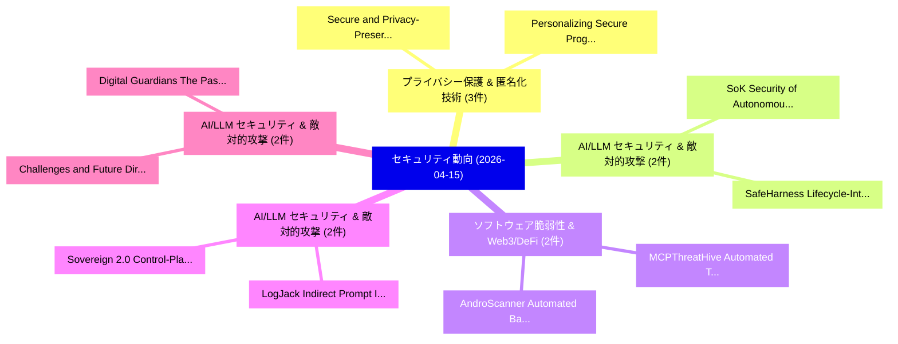

# 📅 02_daily: 日次エグゼクティブサマリー報告書 (2026-04-15)

**集計日時**: 2026-10-02 23:06:05 UTC  
**対象日付**: 2026-04-15  
**本日収集論文数**: 30 件  

---

## 💡 主要セキュリティ動向・脅威インサイト (Executive Insights)

本日の収集論文（計 30 件）において、以下の重点セキュリティ領域で活発な研究動向が確認されました：
- **プライバシー保護 & 匿名化技術** (3 件): 注目論文として 「Secure and Privacy-Preserving ...」、「Personalizing Secure Programmi...」 等が発表され、実務防御および攻撃検証の進展が見られます。
- **AI/LLM セキュリティ & 敵対的攻撃** (2 件): 注目論文として 「SafeHarness: Lifecycle-Integra...」、「SoK: Security of Autonomous LL...」 等が発表され、実務防御および攻撃検証の進展が見られます。
- **ソフトウェア脆弱性 & Web3/DeFi** (2 件): 注目論文として 「MCPThreatHive: Automated Threa...」、「AndroScanner: Automated Backen...」 等が発表され、実務防御および攻撃検証の進展が見られます。
- **AI/LLM セキュリティ & 敵対的攻撃** (2 件): 注目論文として 「Sovereign 2.0: Control-Plane S...」、「LogJack: Indirect Prompt Injec...」 等が発表され、実務防御および攻撃検証の進展が見られます。
- **AI/LLM セキュリティ & 敵対的攻撃** (2 件): 注目論文として 「Challenges and Future Directio...」、「Digital Guardians: The Past an...」 等が発表され、実務防御および攻撃検証の進展が見られます。

### 🗺️ 技術・脅威トピックマインドマップ

---

## 📌 日次セキュリティ論文一覧 (日本語表形式)

| No | arXiv ID | 論文タイトル (日本語訳) | 重要キーワード | 構造化エグゼクティブ要約 (背景・提案・影響) | 脅威分類 | 詳細リンク |
|---|---|---|---|---|---|---|
| 1 | `2604.13474v1` | [Secure and Privacy-Preserving Vertical 連合学習](../../okf/papers/2026-04-15/2604.13474.md) | `Privacy-Preserving Vertical`, `Preserving Vertical Federated Learning`, `Preserving Vertical` | 【提案】概要 (Overview & Key Finding) 本論文「Secure and Privacy-Preserving Vertical 連合学習」（原題: Secure...。実証評価によりNascimento, Yiwei Cai - *... | `cs.AI` | [arXiv](https://arxiv.org/abs/2604.13474v1) &#124; [OKF](../../okf/papers/2026-04-15/2604.13474.md) |
| 2 | `2604.13630v2` | [SafeHarness: Lifecycle-Integrated Security Architecture for LLM-based Agent Deployment（セキュリティ分析論文）](../../okf/papers/2026-04-15/2604.13630.md) | `Integrated Security Architecture`, `Agent Deployment`, `Lifecycle-Integrated Security` | 【提案】概要 (Overview & Key Finding) 本論文「SafeHarness: Lifecycle-Integrated Security Architecture...。実証評価により経営層・セキュリティ管理者向け推奨アクション (E... | `cs.AI` | [arXiv](https://arxiv.org/abs/2604.13630v2) &#124; [OKF](../../okf/papers/2026-04-15/2604.13630.md) |
| 3 | `2604.13635v1` | [Look One Step Ahead: Forward-Looking Incentive Design with Strategic Privacy for Proactive Service Provisioning over Air-Ground Integrated Edge Networks（セキュリティ分析論文）](../../okf/papers/2026-04-15/2604.13635.md) | `Look One Step Ahead`, `Ground Integrated Edge Networks`, `Looking Incentive Design` | 【提案】概要 (Overview & Key Finding) 本論文「Look One Step Ahead: Forward-Looking Incentive Design w...。実証評価により経営層・セキュリティ管理者向け推奨アクション (E... | `cs.NI` | [arXiv](https://arxiv.org/abs/2604.13635v1) &#124; [OKF](../../okf/papers/2026-04-15/2604.13635.md) |
| 4 | `2604.13668v2` | [Where Trust Fails: Mapping Location-Data Provenance Risks in Europe（セキュリティ分析論文）](../../okf/papers/2026-04-15/2604.13668.md) | `Data Provenance Risks`, `Mapping Location`, `Location-Data Provenance` | 【提案】概要 (Overview & Key Finding) 本論文「Where Trust Fails: Mapping Location-Data Provenance Ris...。実証評価により経営層・セキュリティ管理者向け推奨アクション (E... | `cybersecurity` | [arXiv](https://arxiv.org/abs/2604.13668v2) &#124; [OKF](../../okf/papers/2026-04-15/2604.13668.md) |
| 5 | `2604.13675v1` | [Erlang Binary and Source Code Obfuscation（セキュリティ分析論文）](../../okf/papers/2026-04-15/2604.13675.md) | `Source Code Obfuscation`, `Erlang Binary`, `Gregory Morse` | 【提案】概要 (Overview & Key Finding) 本論文「Erlang Binary and Source Code Obfuscation（セキュリティ分析論文）」（...。実証評価により経営層・セキュリティ管理者向け推奨アクション (E... | `cs.PL` | [arXiv](https://arxiv.org/abs/2604.13675v1) &#124; [OKF](../../okf/papers/2026-04-15/2604.13675.md) |
| 6 | `2604.13764v1` | [RealVuln: Rule-Based, General-Purpose LLM, and Security-Specialized Scanners on Real-World Codeのベンチマーク評価](../../okf/papers/2026-04-15/2604.13764.md) | `Specialized Scanners`, `General-Purpose LLM`, `Security-Specialized Scanners` | 【提案】概要 (Overview & Key Finding) 本論文「RealVuln: Rule-Based, General-Purpose LLM, and Security...。実証評価により経営層・セキュリティ管理者向け推奨アクション (E... | `cybersecurity` | [arXiv](https://arxiv.org/abs/2604.13764v1) &#124; [OKF](../../okf/papers/2026-04-15/2604.13764.md) |
| 7 | `2604.13776v2` | [Who Gets Flagged? The Pluralistic Evaluation Gap in AI Content Watermarking（セキュリティ分析論文）](../../okf/papers/2026-04-15/2604.13776.md) | `Content Watermarking`, `Alexander Nemecek`, `Osama Zafar` | 【提案】The Pluralistic Evaluation Gap in AI Content Watermarking ### (日本語題名: Who Gets Flagged?。実証評価により経営層・セキュリティ管理者向け推奨アクション (Exec... | `cs.CV` | [arXiv](https://arxiv.org/abs/2604.13776v2) &#124; [OKF](../../okf/papers/2026-04-15/2604.13776.md) |
| 8 | `2604.13849v1` | [MCPThreatHive: Automated Threat Intelligence for Model Context Protocol Ecosystems（セキュリティ分析論文）](../../okf/papers/2026-04-15/2604.13849.md) | `Model Context Protocol Ecosystems`, `Automated Threat Intelligence`, `Yi Ting Shen` | 【提案】概要 (Overview & Key Finding) 本論文「MCPThreatHive: Automated 脅威 Intelligence for Model Cont...。実証評価により経営層・セキュリティ管理者向け推奨アクション (E... | `cs.AI` | [arXiv](https://arxiv.org/abs/2604.13849v1) &#124; [OKF](../../okf/papers/2026-04-15/2604.13849.md) |
| 9 | `2604.13955v1` | [Personalizing Secure Programming Education with LLM-Injected Vulnerabilitiesに向けて](../../okf/papers/2026-04-15/2604.13955.md) | `Towards Personalizing Secure Programming Education`, `Personalizing Secure Programming Education`, `Injected Vulnerabilities` | 【提案】概要 (Overview & Key Finding) 本論文「Personalizing Secure Programming Education with LLM-Inj...。実証評価により経営層・セキュリティ管理者向け推奨アクション (E... | `executive-summary` | [arXiv](https://arxiv.org/abs/2604.13955v1) &#124; [OKF](../../okf/papers/2026-04-15/2604.13955.md) |
| 10 | `2604.14014v3` | [Commit Signing on Githubの分析](../../okf/papers/2026-04-15/2604.14014.md) | `Commit Signing`, `Abubakar Sadiq Shittu`, `John Sadik` | 【提案】概要 (Overview & Key Finding) 本論文「Commit Signing on Githubの分析」（原題: Analysis of Commit Sig...。実証評価により経営層・セキュリティ管理者向け推奨アクション (E... | `executive-summary` | [arXiv](https://arxiv.org/abs/2604.14014v3) &#124; [OKF](../../okf/papers/2026-04-15/2604.14014.md) |
| 11 | `2604.14038v1` | [KindHML: formal verification of smart contracts based on Hennessy-Milner logic（セキュリティ分析論文）](../../okf/papers/2026-04-15/2604.14038.md) | `Hennessy-Milner logic`, `Massimo Bartoletti`, `Angelo Ferrando` | 【提案】概要 (Overview & Key Finding) 本論文「KindHML: formal verification of スマートコントラクトs based on He...。実証評価により経営層・セキュリティ管理者向け推奨アクション (E... | `cs.LO` | [arXiv](https://arxiv.org/abs/2604.14038v1) &#124; [OKF](../../okf/papers/2026-04-15/2604.14038.md) |
| 12 | `2604.14135v2` | [Temporary Power Adjusting Withholding Attack（セキュリティ分析論文）](../../okf/papers/2026-04-15/2604.14135.md) | `Temporary Power Adjusting Withholding Attack`, `Mustafa Doger`, `Sennur Ulukus` | 【提案】概要 (Overview & Key Finding) 本論文「Temporary Power Adjusting Withholding Attack（セキュリティ分析論文...。実証評価により経営層・セキュリティ管理者向け推奨アクション (E... | `math.PR` | [arXiv](https://arxiv.org/abs/2604.14135v2) &#124; [OKF](../../okf/papers/2026-04-15/2604.14135.md) |
| 13 | `2604.14242v1` | [Sovereign 2.0: Control-Plane Sovereignty for Cloud Systems Under Disruption（セキュリティ分析論文）](../../okf/papers/2026-04-15/2604.14242.md) | `Plane Sovereignty`, `Control-Plane Sovereignty`, `Justin Stark` | 【提案】概要 (Overview & Key Finding) 本論文「Sovereign 2.0: Control-Plane Sovereignty for Cloud Syst...。実証評価により経営層・セキュリティ管理者向け推奨アクション (E... | `executive-summary` | [arXiv](https://arxiv.org/abs/2604.14242v1) &#124; [OKF](../../okf/papers/2026-04-15/2604.14242.md) |
| 14 | `2604.14250v1` | [Head Count: Privacy-Preserving Face-Based Crowd Monitoring（セキュリティ分析論文）](../../okf/papers/2026-04-15/2604.14250.md) | `Based Crowd Monitoring`, `Head Count`, `Preserving Face` | 【提案】概要 (Overview & Key Finding) 本論文「Head Count: Privacy-Preserving Face-Based Crowd Monitor...。実証評価により経営層・セキュリティ管理者向け推奨アクション (E... | `executive-summary` | [arXiv](https://arxiv.org/abs/2604.14250v1) &#124; [OKF](../../okf/papers/2026-04-15/2604.14250.md) |
| 15 | `2604.14317v1` | [Challenges and Future Directions in Agentic Reverse Engineering Systems（セキュリティ分析論文）](../../okf/papers/2026-04-15/2604.14317.md) | `Agentic Reverse Engineering Systems`, `Future Directions`, `Salem Radey` | 【提案】概要 (Overview & Key Finding) 本論文「Challenges and Future Directions in Agentic Reverse Eng...。実証評価により経営層・セキュリティ管理者向け推奨アクション (E... | `cs.AI` | [arXiv](https://arxiv.org/abs/2604.14317v1) &#124; [OKF](../../okf/papers/2026-04-15/2604.14317.md) |
| 16 | `2604.14330v2` | [Understanding Student Experiences with TLS Client Authentication（セキュリティ分析論文）](../../okf/papers/2026-04-15/2604.14330.md) | `Understanding Student Experiences`, `Client Authentication`, `Abubakar Sadiq Shittu` | 【提案】概要 (Overview & Key Finding) 本論文「Understanding Student Experiences with TLS Client Authe...。実証評価により経営層・セキュリティ管理者向け推奨アクション (E... | `cybersecurity` | [arXiv](https://arxiv.org/abs/2604.14330v2) &#124; [OKF](../../okf/papers/2026-04-15/2604.14330.md) |
| 17 | `2604.14357v1` | [Filament: Denning-Style Information Flow Control for Rust（セキュリティ分析論文）](../../okf/papers/2026-04-15/2604.14357.md) | `Style Information Flow Control`, `Denning-Style Information`, `Quan Zhou` | 【提案】概要 (Overview & Key Finding) 本論文「Filament: Denning-Style Information Flow Control for Ru...。実証評価によりChing, Quan Zhou, Danfeng... | `cs.PL` | [arXiv](https://arxiv.org/abs/2604.14357v1) &#124; [OKF](../../okf/papers/2026-04-15/2604.14357.md) |
| 18 | `2604.14360v1` | [Digital Guardians: The Past and The Future of Cyber-Physical Resilience（セキュリティ分析論文）](../../okf/papers/2026-04-15/2604.14360.md) | `Digital Guardians`, `Physical Resilience`, `Cyber-Physical Resilience` | 【提案】概要 (Overview & Key Finding) 本論文「Digital Guardians: The Past and The Future of Cyber-Phy...。実証評価により経営層・セキュリティ管理者向け推奨アクション (E... | `executive-summary` | [arXiv](https://arxiv.org/abs/2604.14360v1) &#124; [OKF](../../okf/papers/2026-04-15/2604.14360.md) |
| 19 | `2604.14431v1` | [AndroScanner: Automated Backend 脆弱性検出 for Android Applications](../../okf/papers/2026-04-15/2604.14431.md) | `Android Applications`, `Automated Backend Vulnerability Detection`, `Automated Backend` | 【提案】概要 (Overview & Key Finding) 本論文「AndroScanner: Automated Backend 脆弱性検出 for Android Appli...。実証評価により経営層・セキュリティ管理者向け推奨アクション (E... | `cs.NI` | [arXiv](https://arxiv.org/abs/2604.14431v1) &#124; [OKF](../../okf/papers/2026-04-15/2604.14431.md) |
| 20 | `2604.14444v1` | [Robustness Machine Learning Models for IoT Intrusion Detection Under Data Poisoning Attacksの分析](../../okf/papers/2026-04-15/2604.14444.md) | `Robustness Machine Learning Models`, `Machine Learning Models`, `Kingsford Sarkodie Obeng Kwakye` | 【提案】概要 (Overview & Key Finding) 本論文「Robustness Machine Learning Models for IoT Intrusion De...。実証評価により経営層・セキュリティ管理者向け推奨アクション (E... | `cs.AI` | [arXiv](https://arxiv.org/abs/2604.14444v1) &#124; [OKF](../../okf/papers/2026-04-15/2604.14444.md) |
| 21 | `2604.14457v1` | [NeuroTrace: Inference Provenance-Based Adversarial Examplesの検出](../../okf/papers/2026-04-15/2604.14457.md) | `Inference Provenance`, `Based Detection`, `Adversarial Examples` | 【提案】概要 (Overview & Key Finding) 本論文「NeuroTrace: Inference Provenance-Based Adversarial Exam...。実証評価により経営層・セキュリティ管理者向け推奨アクション (E... | `cybersecurity` | [arXiv](https://arxiv.org/abs/2604.14457v1) &#124; [OKF](../../okf/papers/2026-04-15/2604.14457.md) |
| 22 | `2604.15367v2` | [SoK: Security of Autonomous LLMエージェント in Agentic Commerce](../../okf/papers/2026-04-15/2604.15367.md) | `Agentic Commerce`, `Jiaxin Wang`, `Ya Liu` | 【提案】概要 (Overview & Key Finding) 本論文「SoK: Security of Autonomous LLMエージェント in Agentic Commer...。実証評価により経営層・セキュリティ管理者向け推奨アクション (E... | `executive-summary` | [arXiv](https://arxiv.org/abs/2604.15367v2) &#124; [OKF](../../okf/papers/2026-04-15/2604.15367.md) |
| 23 | `2604.15368v1` | [LogJack: Indirect Prompt Injection Through Cloud Logs Against LLM Debugging Agents（セキュリティ分析論文）](../../okf/papers/2026-04-15/2604.15368.md) | `Debugging Agents`, `Harsh Shah`, `Raw Meta` | 【提案】概要 (Overview & Key Finding) 本論文「LogJack: Indirect プロンプトインジェクション Through Cloud Logs Agai...。実証評価により経営層・セキュリティ管理者向け推奨アクション (E... | `cybersecurity` | [arXiv](https://arxiv.org/abs/2604.15368v1) &#124; [OKF](../../okf/papers/2026-04-15/2604.15368.md) |
| 24 | `2604.15369v1` | [An Agentic Workflow for Detecting Personally Identifiable Information in Crash Narratives（セキュリティ分析論文）](../../okf/papers/2026-04-15/2604.15369.md) | `Detecting Personally Identifiable Information`, `Crash Narratives`, `Junyi Ma` | 【提案】概要 (Overview & Key Finding) 本論文「An Agentic Workflow for Detecting Personally Identifiab...。実証評価により経営層・セキュリティ管理者向け推奨アクション (E... | `cybersecurity` | [arXiv](https://arxiv.org/abs/2604.15369v1) &#124; [OKF](../../okf/papers/2026-04-15/2604.15369.md) |
| 25 | `2604.15370v1` | [TopFeaRe: Locating Critical State of Adversarial Resilience for Graphs Regarding Topology-Feature Entanglement（セキュリティ分析論文）](../../okf/papers/2026-04-15/2604.15370.md) | `Locating Critical State`, `Graphs Regarding Topology`, `Adversarial Resilience` | 【提案】概要 (Overview & Key Finding) 本論文「TopFeaRe: Locating Critical State of Adversarial Resili...。実証評価により経営層・セキュリティ管理者向け推奨アクション (E... | `executive-summary` | [arXiv](https://arxiv.org/abs/2604.15370v1) &#124; [OKF](../../okf/papers/2026-04-15/2604.15370.md) |
| 26 | `2604.15372v1` | [The Synthetic Media Shift: Tracking the Rise, Virality, and Detectability of AI-Generated Multimodal Misinformation（セキュリティ分析論文）](../../okf/papers/2026-04-15/2604.15372.md) | `Generated Multimodal Misinformation`, `AI-Generated Multimodal`, `Zacharias Chrysidis` | 【提案】概要 (Overview & Key Finding) 本論文「The Synthetic Media Shift: Tracking the Rise, Virality,...。実証評価により経営層・セキュリティ管理者向け推奨アクション (E... | `cs.AI` | [arXiv](https://arxiv.org/abs/2604.15372v1) &#124; [OKF](../../okf/papers/2026-04-15/2604.15372.md) |
| 27 | `2604.15375v1` | [VeriCWEty: Embedding enabled Line-Level CWE Detection in Verilog（セキュリティ分析論文）](../../okf/papers/2026-04-15/2604.15375.md) | `Line-Level CWE`, `Prithwish Basu Roy`, `Zeng Wang` | 【提案】概要 (Overview & Key Finding) 本論文「VeriCWEty: Embedding enabled Line-Level CWE Detection i...。実証評価により経営層・セキュリティ管理者向け推奨アクション (E... | `cs.AI` | [arXiv](https://arxiv.org/abs/2604.15375v1) &#124; [OKF](../../okf/papers/2026-04-15/2604.15375.md) |
| 28 | `2604.16515v1` | [Penny Wise, Pixel Foolish: Bypassing Price Constraints in Multimodal Agents via Visual Adversarial Perturbations（セキュリティ分析論文）](../../okf/papers/2026-04-15/2604.16515.md) | `Bypassing Price Constraints`, `Visual Adversarial Perturbations`, `Penny Wise` | 【提案】概要 (Overview & Key Finding) 本論文「Penny Wise, Pixel Foolish: Bypassing Price Constraints ...。実証評価により経営層・セキュリティ管理者向け推奨アクション (E... | `cs.CV` | [arXiv](https://arxiv.org/abs/2604.16515v1) &#124; [OKF](../../okf/papers/2026-04-15/2604.16515.md) |
| 29 | `2604.18614v1` | [HadAgent: Harness-Aware Decentralized Agentic AI Serving with Proof-of-Inference Blockchain Consensus（セキュリティ分析論文）](../../okf/papers/2026-04-15/2604.18614.md) | `Aware Decentralized Agentic`, `Inference Blockchain Consensus`, `Harness-Aware Decentralized` | 【提案】概要 (Overview & Key Finding) 本論文「HadAgent: Harness-Aware Decentralized Agentic AI Servin...。実証評価により経営層・セキュリティ管理者向け推奨アクション (E... | `cs.ET` | [arXiv](https://arxiv.org/abs/2604.18614v1) &#124; [OKF](../../okf/papers/2026-04-15/2604.18614.md) |
| 30 | `2605.12529v1` | [BackFlush: Knowledge-Free Backdoor Detection and Elimination with Watermark Preservation in 大規模言語モデル](../../okf/papers/2026-04-15/2605.12529.md) | `Free Backdoor Detection`, `Knowledge-Free Backdoor`, `Watermark Preservation` | 【提案】概要 (Overview & Key Finding) 本論文「BackFlush: Knowledge-Free Backdoor Detection and Elimin...。実証評価により経営層・セキュリティ管理者向け推奨アクション (E... | `cybersecurity` | [arXiv](https://arxiv.org/abs/2605.12529v1) &#124; [OKF](../../okf/papers/2026-04-15/2605.12529.md) |

