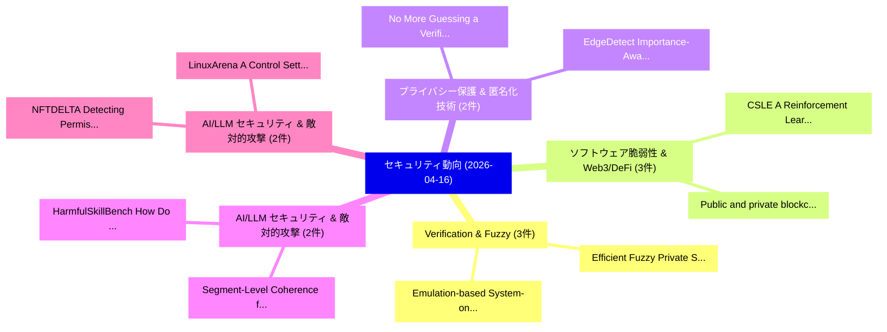

# 📅 02_daily: 日次エグゼクティブサマリー報告書 (2026-04-16)

**集計日時**: 2026-10-02 23:06:05 UTC  
**対象日付**: 2026-04-16  
**本日収集論文数**: 31 件  

---

## 💡 主要セキュリティ動向・脅威インサイト (Executive Insights)

本日の収集論文（計 31 件）において、以下の重点セキュリティ領域で活発な研究動向が確認されました：
- **Verification & Fuzzy** (3 件): 注目論文として 「Efficient Fuzzy Private Set In...」、「Emulation-based System-on-Chip...」 等が発表され、実務防御および攻撃検証の進展が見られます。
- **ソフトウェア脆弱性 & Web3/DeFi** (3 件): 注目論文として 「CSLE: A Reinforcement Learning...」、「Public and private blockchain ...」 等が発表され、実務防御および攻撃検証の進展が見られます。
- **プライバシー保護 & 匿名化技術** (2 件): 注目論文として 「EdgeDetect: Importance-Aware G...」、「No More Guessing: a Verifiable...」 等が発表され、実務防御および攻撃検証の進展が見られます。
- **AI/LLM セキュリティ & 敵対的攻撃** (2 件): 注目論文として 「Segment-Level Coherence for Ro...」、「HarmfulSkillBench: How Do Harm...」 等が発表され、実務防御および攻撃検証の進展が見られます。
- **AI/LLM セキュリティ & 敵対的攻撃** (2 件): 注目論文として 「NFTDELTA: Detecting Permission...」、「LinuxArena: A Control Setting ...」 等が発表され、実務防御および攻撃検証の進展が見られます。

### 🗺️ 技術・脅威トピックマインドマップ

---

## 📌 日次セキュリティ論文一覧 (日本語表形式)

| No | arXiv ID | 論文タイトル (日本語訳) | 重要キーワード | 構造化エグゼクティブ要約 (背景・提案・影響) | 脅威分類 | 詳細リンク |
|---|---|---|---|---|---|---|
| 1 | `2604.14495v1` | [Decoupling Identity from Utility: Privacy-by-Design Frameworks for Financial Ecosystems（セキュリティ分析論文）](../../okf/papers/2026-04-16/2604.14495.md) | `Decoupling Identity`, `Design Frameworks`, `Financial Ecosystems` | 【提案】概要 (Overview & Key Finding) 本論文「Decoupling Identity from Utility: Privacy-by-Design Fra...。実証評価により経営層・セキュリティ管理者向け推奨アクション (E... | `cs.CE` | [arXiv](https://arxiv.org/abs/2604.14495v1) &#124; [OKF](../../okf/papers/2026-04-16/2604.14495.md) |
| 2 | `2604.14512v1` | [CBCL: Safe Self-Extending Agent Communication（セキュリティ分析論文）](../../okf/papers/2026-04-16/2604.14512.md) | `Extending Agent Communication`, `Safe Self`, `Self-Extending Agent` | 【提案】概要 (Overview & Key Finding) 本論文「CBCL: Safe Self-Extending Agent Communication（セキュリティ分析論...。実証評価により経営層・セキュリティ管理者向け推奨アクション (E... | `cs.AI` | [arXiv](https://arxiv.org/abs/2604.14512v1) &#124; [OKF](../../okf/papers/2026-04-16/2604.14512.md) |
| 3 | `2604.14604v1` | [Hijacking Large Audio-Language Models via Context-Agnostic and Imperceptible Auditory Prompt Injection（セキュリティ分析論文）](../../okf/papers/2026-04-16/2604.14604.md) | `Hijacking Large Audio`, `Imperceptible Auditory Prompt Injection`, `Language Models` | 【提案】概要 (Overview & Key Finding) 本論文「Hijacking Large Audio-Language Models via Context-Agnos...。実証評価により経営層・セキュリティ管理者向け推奨アクション (E... | `cs.AI` | [arXiv](https://arxiv.org/abs/2604.14604v1) &#124; [OKF](../../okf/papers/2026-04-16/2604.14604.md) |
| 4 | `2604.14663v1` | [EdgeDetect: Importance-Aware Gradient Compression with Homomorphic Aggregation for Federated Intrusion Detection（セキュリティ分析論文）](../../okf/papers/2026-04-16/2604.14663.md) | `Aware Gradient Compression`, `Federated Intrusion Detection`, `Homomorphic Aggregation` | 【提案】概要 (Overview & Key Finding) 本論文「EdgeDetect: Importance-Aware Gradient Compression with ...。実証評価により経営層・セキュリティ管理者向け推奨アクション (E... | `cybersecurity` | [arXiv](https://arxiv.org/abs/2604.14663v1) &#124; [OKF](../../okf/papers/2026-04-16/2604.14663.md) |
| 5 | `2604.14685v1` | [Beyond Nodes vs. Edges: A Multi-View Fusion Framework for Provenance-Based Intrusion Detection（セキュリティ分析論文）](../../okf/papers/2026-04-16/2604.14685.md) | `Based Intrusion Detection`, `Beyond Nodes`, `Multi-View Fusion` | 【提案】概要 (Overview & Key Finding) 本論文「Beyond Nodes vs. Edges: A Multi-View Fusion Framework f...。実証評価により経営層・セキュリティ管理者向け推奨アクション (E... | `cybersecurity` | [arXiv](https://arxiv.org/abs/2604.14685v1) &#124; [OKF](../../okf/papers/2026-04-16/2604.14685.md) |
| 6 | `2604.14717v2` | [Layered Mutability: Continuity and Governance in Persistent Self-Modifying Agents（セキュリティ分析論文）](../../okf/papers/2026-04-16/2604.14717.md) | `Layered Mutability`, `Persistent Self`, `Modifying Agents` | 【提案】概要 (Overview & Key Finding) 本論文「Layered Mutability: Continuity and Governance in Persis...。実証評価により経営層・セキュリティ管理者向け推奨アクション (E... | `cs.AI` | [arXiv](https://arxiv.org/abs/2604.14717v2) &#124; [OKF](../../okf/papers/2026-04-16/2604.14717.md) |
| 7 | `2604.14865v1` | [Segment-Level Coherence for Robust Harmful Intent Probing in LLMs（セキュリティ分析論文）](../../okf/papers/2026-04-16/2604.14865.md) | `Robust Harmful Intent Probing`, `Level Coherence`, `Segment-Level Coherence` | 【提案】概要 (Overview & Key Finding) 本論文「Segment-Level Coherence for Robust Harmful Intent Probi...。実証評価により経営層・セキュリティ管理者向け推奨アクション (E... | `executive-summary` | [arXiv](https://arxiv.org/abs/2604.14865v1) &#124; [OKF](../../okf/papers/2026-04-16/2604.14865.md) |
| 8 | `2604.14909v1` | [Efficient Fuzzy Private Set Intersection from Secret-shared OPRF（セキュリティ分析論文）](../../okf/papers/2026-04-16/2604.14909.md) | `Efficient Fuzzy Private Set Intersection`, `Secret-shared OPRF`, `Xinpeng Yang` | 【提案】概要 (Overview & Key Finding) 本論文「Efficient Fuzzy Private Set Intersection from Secret-sh...。実証評価によりDeng, Yonggang Wen, Tianw... | `cybersecurity` | [arXiv](https://arxiv.org/abs/2604.14909v1) &#124; [OKF](../../okf/papers/2026-04-16/2604.14909.md) |
| 9 | `2604.14957v1` | [MLDAS: Machine Learning Dynamic Algorithm Selection for Software-Defined Networking Security（セキュリティ分析論文）](../../okf/papers/2026-04-16/2604.14957.md) | `Machine Learning Dynamic Algorithm Selection`, `Defined Networking Security`, `Software-Defined Networking` | 【提案】概要 (Overview & Key Finding) 本論文「MLDAS: Machine Learning Dynamic Algorithm Selection for...。実証評価により経営層・セキュリティ管理者向け推奨アクション (E... | `cs.NI` | [arXiv](https://arxiv.org/abs/2604.14957v1) &#124; [OKF](../../okf/papers/2026-04-16/2604.14957.md) |
| 10 | `2604.14973v1` | [Robustness of Vision Foundation Models to Common Perturbations（セキュリティ分析論文）](../../okf/papers/2026-04-16/2604.14973.md) | `Vision Foundation Models`, `Common Perturbations`, `Neil Zhenqiang Gong` | 【提案】概要 (Overview & Key Finding) 本論文「Robustness of Vision Foundation Models to Common Pertur...。実証評価により経営層・セキュリティ管理者向け推奨アクション (E... | `cs.CV` | [arXiv](https://arxiv.org/abs/2604.14973v1) &#124; [OKF](../../okf/papers/2026-04-16/2604.14973.md) |
| 11 | `2604.14996v1` | [ConGISATA: A Framework for Continuous Gamified Information Security Awareness Training and Assessment（セキュリティ分析論文）](../../okf/papers/2026-04-16/2604.14996.md) | `Continuous Gamified Information Security Awareness Training`, `Ofir Cohen`, `Ron Bitton` | 【提案】概要 (Overview & Key Finding) 本論文「ConGISATA: A Framework for Continuous Gamified Informat...。実証評価により経営層・セキュリティ管理者向け推奨アクション (E... | `cybersecurity` | [arXiv](https://arxiv.org/abs/2604.14996v1) &#124; [OKF](../../okf/papers/2026-04-16/2604.14996.md) |
| 12 | `2604.15022v1` | [Route to Rome Attack: Directing LLM Routers to Expensive Models via Adversarial Suffix Optimization（セキュリティ分析論文）](../../okf/papers/2026-04-16/2604.15022.md) | `Adversarial Suffix Optimization`, `Rome Attack`, `Expensive Models` | 【提案】概要 (Overview & Key Finding) 本論文「Route to Rome Attack: Directing LLM Routers to Expensiv...。実証評価により経営層・セキュリティ管理者向け推奨アクション (E... | `cs.AI` | [arXiv](https://arxiv.org/abs/2604.15022v1) &#124; [OKF](../../okf/papers/2026-04-16/2604.15022.md) |
| 13 | `2604.15063v1` | [No More Guessing: a Verifiable Gradient Inversion Attack in 連合学習](../../okf/papers/2026-04-16/2604.15063.md) | `Verifiable Gradient Inversion Attack`, `Federated Learning`, `Francesco Diana` | 【提案】概要 (Overview & Key Finding) 本論文「No More Guessing: a Verifiable Gradient Inversion Attac...。実証評価により経営層・セキュリティ管理者向け推奨アクション (E... | `cs.AI` | [arXiv](https://arxiv.org/abs/2604.15063v1) &#124; [OKF](../../okf/papers/2026-04-16/2604.15063.md) |
| 14 | `2604.15073v1` | [Emulation-based System-on-Chip Security Verification: Challenges and Opportunities（セキュリティ分析論文）](../../okf/papers/2026-04-16/2604.15073.md) | `Chip Security Verification`, `Emulation-based System`, `on-Chip Security` | 【提案】概要 (Overview & Key Finding) 本論文「Emulation-based System-on-Chip Security Verification: C...。実証評価により経営層・セキュリティ管理者向け推奨アクション (E... | `cybersecurity` | [arXiv](https://arxiv.org/abs/2604.15073v1) &#124; [OKF](../../okf/papers/2026-04-16/2604.15073.md) |
| 15 | `2604.15115v1` | [FedIDM: Achieving Fast and Stable Convergence in Byzantine 連合学習 through Iterative Distribution Matching](../../okf/papers/2026-04-16/2604.15115.md) | `Iterative Distribution Matching`, `Achieving Fast`, `Stable Convergence` | 【提案】概要 (Overview & Key Finding) 本論文「FedIDM: Achieving Fast and Stable Convergence in Byzant...。実証評価により経営層・セキュリティ管理者向け推奨アクション (E... | `executive-summary` | [arXiv](https://arxiv.org/abs/2604.15115v1) &#124; [OKF](../../okf/papers/2026-04-16/2604.15115.md) |
| 16 | `2604.15118v1` | [NFTDELTA: Detecting Permission Control Vulnerabilities in NFT Contracts through Multi-View Learning（セキュリティ分析論文）](../../okf/papers/2026-04-16/2604.15118.md) | `Detecting Permission Control Vulnerabilities`, `View Learning`, `Multi-View Learning` | 【提案】概要 (Overview & Key Finding) 本論文「NFTDELTA: Detecting Permission Control Vulnerabilities ...。実証評価により経営層・セキュリティ管理者向け推奨アクション (E... | `cybersecurity` | [arXiv](https://arxiv.org/abs/2604.15118v1) &#124; [OKF](../../okf/papers/2026-04-16/2604.15118.md) |
| 17 | `2604.15136v1` | [Feedback-Driven Execution for LLM-Based Binary Analysis（セキュリティ分析論文）](../../okf/papers/2026-04-16/2604.15136.md) | `Driven Execution`, `Feedback-Driven Execution`, `LLM-Based Binary` | 【提案】概要 (Overview & Key Finding) 本論文「Feedback-Driven Execution for LLM-Based Binary Analysis...。実証評価により経営層・セキュリティ管理者向け推奨アクション (E... | `cybersecurity` | [arXiv](https://arxiv.org/abs/2604.15136v1) &#124; [OKF](../../okf/papers/2026-04-16/2604.15136.md) |
| 18 | `2604.15249v2` | [Structural Dependency Analysis for Masked NTT Hardware: Scalable Pre-Silicon Verification of Post-Quantum Cryptographic Accelerators（セキュリティ分析論文）](../../okf/papers/2026-04-16/2604.15249.md) | `Quantum Cryptographic Accelerators`, `Scalable Pre`, `Silicon Verification` | 【提案】概要 (Overview & Key Finding) 本論文「Structural Dependency Analysis for Masked NTT Hardware:...。実証評価により経営層・セキュリティ管理者向け推奨アクション (E... | `cybersecurity` | [arXiv](https://arxiv.org/abs/2604.15249v2) &#124; [OKF](../../okf/papers/2026-04-16/2604.15249.md) |
| 19 | `2604.15384v2` | [LinuxArena: A Control Setting for AI Agents in Live Production Software Environments（セキュリティ分析論文）](../../okf/papers/2026-04-16/2604.15384.md) | `Live Production Software Environments`, `Control Setting`, `Samuel Prieto Lima` | 【提案】概要 (Overview & Key Finding) 本論文「LinuxArena: A Control Setting for AI Agents in Live Pro...。実証評価により経営層・セキュリティ管理者向け推奨アクション (E... | `cs.AI` | [arXiv](https://arxiv.org/abs/2604.15384v2) &#124; [OKF](../../okf/papers/2026-04-16/2604.15384.md) |
| 20 | `2604.15402v1` | [Graded Symbolic Verification with a Fuzzy Dolev-Yao Attacker Model（セキュリティ分析論文）](../../okf/papers/2026-04-16/2604.15402.md) | `Graded Symbolic Verification`, `Yao Attacker Model`, `Fuzzy Dolev` | 【提案】概要 (Overview & Key Finding) 本論文「Graded Symbolic Verification with a Fuzzy Dolev-Yao Att...。実証評価により経営層・セキュリティ管理者向け推奨アクション (E... | `cs.LO` | [arXiv](https://arxiv.org/abs/2604.15402v1) &#124; [OKF](../../okf/papers/2026-04-16/2604.15402.md) |
| 21 | `2604.15415v1` | [HarmfulSkillBench: How Do Harmful Skills Weaponize Your Agents?（セキュリティ分析論文）](../../okf/papers/2026-04-16/2604.15415.md) | `Yukun Jiang`, `Yage Zhang`, `Michael Backes` | 【提案】### (日本語題名: HarmfulSkillBench: How Do Harmful Skills Weaponize Your Agents?（セキュリティ分析論文）...。実証評価により経営層・セキュリティ管理者向け推奨アクション (E... | `cs.AI` | [arXiv](https://arxiv.org/abs/2604.15415v1) &#124; [OKF](../../okf/papers/2026-04-16/2604.15415.md) |
| 22 | `2604.15461v1` | [Evaluating LLM Simulators as Differentially Private Data Generators（セキュリティ分析論文）](../../okf/papers/2026-04-16/2604.15461.md) | `Differentially Private Data Generators`, `Dehao Yuan`, `Mayana Pereira` | 【提案】概要 (Overview & Key Finding) 本論文「Evaluating LLM Simulators as Differentially Private Dat...。実証評価によりNguyen, Mayana Pereira。 | `executive-summary` | [arXiv](https://arxiv.org/abs/2604.15461v1) &#124; [OKF](../../okf/papers/2026-04-16/2604.15461.md) |
| 23 | `2604.15499v1` | [SecureRouter: Encrypted Routing for Efficient Secure Inference（セキュリティ分析論文）](../../okf/papers/2026-04-16/2604.15499.md) | `Efficient Secure Inference`, `Encrypted Routing`, `Yukuan Zhang` | 【提案】概要 (Overview & Key Finding) 本論文「SecureRouter: Encrypted Routing for Efficient Secure In...。実証評価により経営層・セキュリティ管理者向け推奨アクション (E... | `cs.AI` | [arXiv](https://arxiv.org/abs/2604.15499v1) &#124; [OKF](../../okf/papers/2026-04-16/2604.15499.md) |
| 24 | `2604.15579v2` | [Don't Make Models Guess Security and Safety: Symbolic Guardrails for Domain-Specific AI Agents（セキュリティ分析論文）](../../okf/papers/2026-04-16/2604.15579.md) | `Make Models Guess Security`, `Symbolic Guardrails`, `Domain-Specific AI` | 【提案】概要 (Overview & Key Finding) 本論文「Don't Make Models Guess Security and Safety: Symbolic G...。実証評価により経営層・セキュリティ管理者向け推奨アクション (E... | `cs.AI` | [arXiv](https://arxiv.org/abs/2604.15579v2) &#124; [OKF](../../okf/papers/2026-04-16/2604.15579.md) |
| 25 | `2604.15584v1` | [A Framework for Post Quantum Migration in IoT-Based Healthcare Systems（セキュリティ分析論文）](../../okf/papers/2026-04-16/2604.15584.md) | `Post Quantum Migration`, `Based Healthcare Systems`, `IoT-Based Healthcare` | 【提案】概要 (Overview & Key Finding) 本論文「A Framework for Post 量子 Migration in IoT-Based Healthca...。実証評価により経営層・セキュリティ管理者向け推奨アクション (E... | `cybersecurity` | [arXiv](https://arxiv.org/abs/2604.15584v1) &#124; [OKF](../../okf/papers/2026-04-16/2604.15584.md) |
| 26 | `2604.15590v1` | [CSLE: A Reinforcement Learning Platform for Autonomous Security Management（セキュリティ分析論文）](../../okf/papers/2026-04-16/2604.15590.md) | `Reinforcement Learning Platform`, `Autonomous Security Management`, `Kim Hammar` | 【提案】概要 (Overview & Key Finding) 本論文「CSLE: A Reinforcement Learning Platform for Autonomous ...。実証評価により経営層・セキュリティ管理者向け推奨アクション (E... | `cs.AI` | [arXiv](https://arxiv.org/abs/2604.15590v1) &#124; [OKF](../../okf/papers/2026-04-16/2604.15590.md) |
| 27 | `2604.16521v1` | [CAMP: Cumulative Agentic Masking and Pruning for Privacy Protection in Multi-Turn LLM Conversations（セキュリティ分析論文）](../../okf/papers/2026-04-16/2604.16521.md) | `Cumulative Agentic Masking`, `Privacy Protection`, `Multi-Turn LLM` | 【提案】概要 (Overview & Key Finding) 本論文「CAMP: Cumulative Agentic Masking and Pruning for Privac...。実証評価により経営層・セキュリティ管理者向け推奨アクション (E... | `cs.AI` | [arXiv](https://arxiv.org/abs/2604.16521v1) &#124; [OKF](../../okf/papers/2026-04-16/2604.16521.md) |
| 28 | `2604.16523v1` | [Privacy-Preserving Semantic Segmentation without Key Management（セキュリティ分析論文）](../../okf/papers/2026-04-16/2604.16523.md) | `Preserving Semantic Segmentation`, `Key Management`, `Privacy-Preserving Semantic` | 【提案】背景とセキュリティ上の課題 (Background & Problem) 本研究はサイバー脅威環境におけるセキュリティ構造・脆弱性の検証を目的としています。(主要検出項目: ...。実証評価により経営層・セキュリティ管理者向け推奨アクション (E... | `cs.CV` | [arXiv](https://arxiv.org/abs/2604.16523v1) &#124; [OKF](../../okf/papers/2026-04-16/2604.16523.md) |
| 29 | `2604.16524v1` | [Anumati: Proof of Adherence as a Formal Consent Model for Autonomous Agent Protocols（セキュリティ分析論文）](../../okf/papers/2026-04-16/2604.16524.md) | `Formal Consent Model`, `Autonomous Agent Protocols`, `Ravi Kiran Kadaboina` | 【提案】概要 (Overview & Key Finding) 本論文「Anumati: Proof of Adherence as a Formal Consent Model f...。実証評価により経営層・セキュリティ管理者向け推奨アクション (E... | `cybersecurity` | [arXiv](https://arxiv.org/abs/2604.16524v1) &#124; [OKF](../../okf/papers/2026-04-16/2604.16524.md) |
| 30 | `2604.16534v1` | [Public and private blockchain for decentralized digital building twins and building automation system（セキュリティ分析論文）](../../okf/papers/2026-04-16/2604.16534.md) | `Reachsak Ly`, `Alireza Shojaei`, `Raw Meta` | 【提案】概要 (Overview & Key Finding) 本論文「Public and private blockchain for decentralized digital...。実証評価により経営層・セキュリティ管理者向け推奨アクション (E... | `cs.AI` | [arXiv](https://arxiv.org/abs/2604.16534v1) &#124; [OKF](../../okf/papers/2026-04-16/2604.16534.md) |
| 31 | `2605.18773v1` | [Decentralized autonomous organization and blockchain-based incentivization framework for community-based facilities management（セキュリティ分析論文）](../../okf/papers/2026-04-16/2605.18773.md) | `blockchain-based incentivization`, `community-based facilities`, `Reachsak Ly` | 【提案】概要 (Overview & Key Finding) 本論文「Decentralized autonomous organization and blockchain-ba...。実証評価により経営層・セキュリティ管理者向け推奨アクション (E... | `cs.AI` | [arXiv](https://arxiv.org/abs/2605.18773v1) &#124; [OKF](../../okf/papers/2026-04-16/2605.18773.md) |

