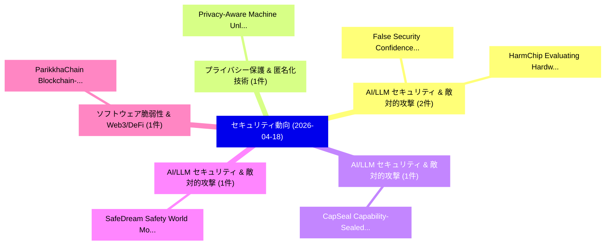

# 📅 02_daily: 日次エグゼクティブサマリー報告書 (2026-04-18)

**集計日時**: 2026-10-02 23:06:05 UTC  
**対象日付**: 2026-04-18  
**本日収集論文数**: 18 件  

---

## 💡 主要セキュリティ動向・脅威インサイト (Executive Insights)

本日の収集論文（計 18 件）において、以下の重点セキュリティ領域で活発な研究動向が確認されました：
- **AI/LLM セキュリティ & 敵対的攻撃** (2 件): 注目論文として 「False Security Confidence in B...」、「HarmChip: Evaluating Hardware ...」 等が発表され、実務防御および攻撃検証の進展が見られます。
- **プライバシー保護 & 匿名化技術** (1 件): 注目論文として 「Privacy-Aware Machine Unlearni...」 等が発表され、実務防御および攻撃検証の進展が見られます。
- **AI/LLM セキュリティ & 敵対的攻撃** (1 件): 注目論文として 「CapSeal: Capability-Sealed Sec...」 等が発表され、実務防御および攻撃検証の進展が見られます。
- **AI/LLM セキュリティ & 敵対的攻撃** (1 件): 注目論文として 「SafeDream: Safety World Model ...」 等が発表され、実務防御および攻撃検証の進展が見られます。
- **ソフトウェア脆弱性 & Web3/DeFi** (1 件): 注目論文として 「ParikkhaChain: Blockchain-Base...」 等が発表され、実務防御および攻撃検証の進展が見られます。

### 🗺️ 技術・脅威トピックマインドマップ

---

## 📌 日次セキュリティ論文一覧 (日本語表形式)

| No | arXiv ID | 論文タイトル (日本語訳) | 重要キーワード | 構造化エグゼクティブ要約 (背景・提案・影響) | 脅威分類 | 詳細リンク |
|---|---|---|---|---|---|---|
| 1 | `2604.16760v1` | [Privacy-Aware Machine Unlearning with SISA for Reinforcement Learning-Based Ransomware Detection（セキュリティ分析論文）](../../okf/papers/2026-04-18/2604.16760.md) | `Aware Machine Unlearning`, `Based Ransomware Detection`, `Privacy-Aware Machine` | 【提案】概要 (Overview & Key Finding) 本論文「Privacy-Aware Machine Unlearning with SISA for Reinforc...。実証評価により経営層・セキュリティ管理者向け推奨アクション (E... | `cybersecurity` | [arXiv](https://arxiv.org/abs/2604.16760v1) &#124; [OKF](../../okf/papers/2026-04-18/2604.16760.md) |
| 2 | `2604.16762v1` | [CapSeal: Capability-Sealed Secret Mediation for Secure Agent Execution（セキュリティ分析論文）](../../okf/papers/2026-04-18/2604.16762.md) | `Sealed Secret Mediation`, `Secure Agent Execution`, `Capability-Sealed Secret` | 【提案】概要 (Overview & Key Finding) 本論文「CapSeal: Capability-Sealed Secret Mediation for Secure ...。実証評価によりCheung - **公開日時**:。 | `cs.AI` | [arXiv](https://arxiv.org/abs/2604.16762v1) &#124; [OKF](../../okf/papers/2026-04-18/2604.16762.md) |
| 3 | `2604.16824v1` | [SafeDream: Safety World Model for Proactive Early Jailbreak Detection（セキュリティ分析論文）](../../okf/papers/2026-04-18/2604.16824.md) | `Proactive Early Jailbreak Detection`, `Safety World Model`, `Bo Yan` | 【提案】概要 (Overview & Key Finding) 本論文「SafeDream: Safety World Model for Proactive Early ジェイルブ...。実証評価により経営層・セキュリティ管理者向け推奨アクション (E... | `cs.AI` | [arXiv](https://arxiv.org/abs/2604.16824v1) &#124; [OKF](../../okf/papers/2026-04-18/2604.16824.md) |
| 4 | `2604.16827v1` | [ParikkhaChain: Blockchain-Based Result Processing and Privacy-Preserving Academic Record Management for the Complete Examination Lifecycle（セキュリティ分析論文）](../../okf/papers/2026-04-18/2604.16827.md) | `Preserving Academic Record Management`, `Complete Examination Lifecycle`, `Privacy-Preserving Academic` | 【提案】概要 (Overview & Key Finding) 本論文「ParikkhaChain: Blockchain-Based Result Processing and P...。実証評価により経営層・セキュリティ管理者向け推奨アクション (E... | `cybersecurity` | [arXiv](https://arxiv.org/abs/2604.16827v1) &#124; [OKF](../../okf/papers/2026-04-18/2604.16827.md) |
| 5 | `2604.16832v1` | [DALC-CT: Dynamic Low-Level Code Traces for Constant-Time Verificationの分析](../../okf/papers/2026-04-18/2604.16832.md) | `Level Code Traces`, `Low-Level Code`, `Time Verification` | 【提案】概要 (Overview & Key Finding) 本論文「DALC-CT: Dynamic Low-Level Code Traces for Constant-Tim...。実証評価により経営層・セキュリティ管理者向け推奨アクション (E... | `cs.PL` | [arXiv](https://arxiv.org/abs/2604.16832v1) &#124; [OKF](../../okf/papers/2026-04-18/2604.16832.md) |
| 6 | `2604.16834v1` | [Deep Encrypted Training: Low-Latency, Memory-Efficient, and High-Throughput Inference for Privacy-Preserving Neural Networksに向けて](../../okf/papers/2026-04-18/2604.16834.md) | `Throughput Inference`, `High-Throughput Inference`, `Privacy-Preserving Neural` | 【提案】概要 (Overview & Key Finding) 本論文「Deep Encrypted Training: Low-Latency, Memory-Efficient,...。実証評価により経営層・セキュリティ管理者向け推奨アクション (E... | `executive-summary` | [arXiv](https://arxiv.org/abs/2604.16834v1) &#124; [OKF](../../okf/papers/2026-04-18/2604.16834.md) |
| 7 | `2604.16838v2` | [enclawed: A Configurable, Sector-Neutral Hardening Framework for Single-User AI Assistant Gateways（セキュリティ分析論文）](../../okf/papers/2026-04-18/2604.16838.md) | `Assistant Gateways`, `Sector-Neutral Hardening`, `Single-User AI` | 【提案】概要 (Overview & Key Finding) 本論文「enclawed: A Configurable, Sector-Neutral Hardening Fram...。実証評価により経営層・セキュリティ管理者向け推奨アクション (E... | `cs.AI` | [arXiv](https://arxiv.org/abs/2604.16838v2) &#124; [OKF](../../okf/papers/2026-04-18/2604.16838.md) |
| 8 | `2604.16870v2` | [Governed MCP: Kernel-Level Tool Governance for AI Agents via Logit-Based Safety Primitives（セキュリティ分析論文）](../../okf/papers/2026-04-18/2604.16870.md) | `Level Tool Governance`, `Based Safety Primitives`, `Kernel-Level Tool` | 【提案】概要 (Overview & Key Finding) 本論文「Governed MCP: Kernel-Level Tool Governance for AI Agent...。実証評価により経営層・セキュリティ管理者向け推奨アクション (E... | `cs.AI` | [arXiv](https://arxiv.org/abs/2604.16870v2) &#124; [OKF](../../okf/papers/2026-04-18/2604.16870.md) |
| 9 | `2604.16913v1` | [The Cognitive Penalty: Ablating System 1 and System 2 Reasoning in Edge-Native SLMs for Decentralized Consensus（セキュリティ分析論文）](../../okf/papers/2026-04-18/2604.16913.md) | `Ablating System`, `Decentralized Consensus`, `Edge-Native SLMs` | 【提案】概要 (Overview & Key Finding) 本論文「The Cognitive Penalty: Ablating System 1 and System 2 R...。実証評価により経営層・セキュリティ管理者向け推奨アクション (E... | `cs.AI` | [arXiv](https://arxiv.org/abs/2604.16913v1) &#124; [OKF](../../okf/papers/2026-04-18/2604.16913.md) |
| 10 | `2604.16966v1` | [Visual Inception: Compromising Long-term Planning in Agentic Recommenders via Multimodal Memory Poisoning（セキュリティ分析論文）](../../okf/papers/2026-04-18/2604.16966.md) | `Multimodal Memory Poisoning`, `Visual Inception`, `Compromising Long` | 【提案】概要 (Overview & Key Finding) 本論文「Visual Inception: Compromising Long-term Planning in Ag...。実証評価により経営層・セキュリティ管理者向け推奨アクション (E... | `cs.AI` | [arXiv](https://arxiv.org/abs/2604.16966v1) &#124; [OKF](../../okf/papers/2026-04-18/2604.16966.md) |
| 11 | `2604.17003v2` | [From Public-Key Linting to Operational Post-Quantum X.509 Assurance for ML-KEM and ML-DSA: Registry-Driven Policy, Mutation-Based Evaluation, and Import Validation（セキュリティ分析論文）](../../okf/papers/2026-04-18/2604.17003.md) | `Key Linting`, `Operational Post`, `Driven Policy` | 【提案】概要 (Overview & Key Finding) 本論文「From Public-Key Linting to Operational Post-量子 X.509 As...。実証評価により経営層・セキュリティ管理者向け推奨アクション (E... | `cybersecurity` | [arXiv](https://arxiv.org/abs/2604.17003v2) &#124; [OKF](../../okf/papers/2026-04-18/2604.17003.md) |
| 12 | `2604.17014v2` | [False Security Confidence in Benign LLM Code Generation（セキュリティ分析論文）](../../okf/papers/2026-04-18/2604.17014.md) | `False Security Confidence`, `Code Generation`, `Xiaolei Ren` | 【提案】概要 (Overview & Key Finding) 本論文「False Security Confidence in Benign LLM Code Generation...。実証評価により経営層・セキュリティ管理者向け推奨アクション (E... | `cybersecurity` | [arXiv](https://arxiv.org/abs/2604.17014v2) &#124; [OKF](../../okf/papers/2026-04-18/2604.17014.md) |
| 13 | `2604.17093v1` | [HarmChip: Evaluating Hardware Security Centric LLM Safety via Jailbreak Benchmarking（セキュリティ分析論文）](../../okf/papers/2026-04-18/2604.17093.md) | `Evaluating Hardware Security Centric`, `Jailbreak Benchmarking`, `Prithwish Basu Roy` | 【提案】概要 (Overview & Key Finding) 本論文「HarmChip: Evaluating Hardware Security Centric LLM Safe...。実証評価により経営層・セキュリティ管理者向け推奨アクション (E... | `cybersecurity` | [arXiv](https://arxiv.org/abs/2604.17093v1) &#124; [OKF](../../okf/papers/2026-04-18/2604.17093.md) |
| 14 | `2604.17125v1` | [CASCADE: A Cascaded Hybrid Defense Architecture for Prompt Injection Detection in MCP-Based Systems（セキュリティ分析論文）](../../okf/papers/2026-04-18/2604.17125.md) | `Cascaded Hybrid Defense Architecture`, `Prompt Injection Detection`, `Based Systems` | 【提案】概要 (Overview & Key Finding) 本論文「CASCADE: A Cascaded Hybrid Defense Architecture for プロン...。実証評価により経営層・セキュリティ管理者向け推奨アクション (E... | `cs.AI` | [arXiv](https://arxiv.org/abs/2604.17125v1) &#124; [OKF](../../okf/papers/2026-04-18/2604.17125.md) |
| 15 | `2604.17133v1` | [If Only My CGM Could Speak: A Privacy-Preserving Agent for Question Answering over Continuous Glucose Data（セキュリティ分析論文）](../../okf/papers/2026-04-18/2604.17133.md) | `Continuous Glucose Data`, `Preserving Agent`, `Privacy-Preserving Agent` | 【提案】概要 (Overview & Key Finding) 本論文「If Only My CGM Could Speak: A Privacy-Preserving Agent ...。実証評価により経営層・セキュリティ管理者向け推奨アクション (E... | `cs.AI` | [arXiv](https://arxiv.org/abs/2604.17133v1) &#124; [OKF](../../okf/papers/2026-04-18/2604.17133.md) |
| 16 | `2604.17159v1` | [Systematic Capability of Frontier Large Language Models for Offensive Cyber Tasksのベンチマーク評価](../../okf/papers/2026-04-18/2604.17159.md) | `Frontier Large Language Models`, `Systematic Capability`, `Offensive Cyber` | 【提案】概要 (Overview & Key Finding) 本論文「Systematic Capability of Frontier Large Language Models...。実証評価により経営層・セキュリティ管理者向け推奨アクション (E... | `cs.AI` | [arXiv](https://arxiv.org/abs/2604.17159v1) &#124; [OKF](../../okf/papers/2026-04-18/2604.17159.md) |
| 17 | `2604.18633v1` | [Global Web, Local Privacy? An International Review of Web Tracking（セキュリティ分析論文）](../../okf/papers/2026-04-18/2604.18633.md) | `Global Web`, `Local Privacy`, `Web Tracking` | 【提案】An International Review of Web Tracking ### (日本語題名: Global Web, Local Privacy?。実証評価により経営層・セキュリティ管理者向け推奨アクション (Executive Rec... | `executive-summary` | [arXiv](https://arxiv.org/abs/2604.18633v1) &#124; [OKF](../../okf/papers/2026-04-18/2604.18633.md) |
| 18 | `2605.05224v1` | [Channel-Level Semantic Perturbations: Unlearnable Examples for Diverse Training Paradigms（セキュリティ分析論文）](../../okf/papers/2026-04-18/2605.05224.md) | `Level Semantic Perturbations`, `Diverse Training Paradigms`, `Channel-Level Semantic` | 【提案】概要 (Overview & Key Finding) 本論文「Channel-Level Semantic Perturbations: Unlearnable Examp...。実証評価により経営層・セキュリティ管理者向け推奨アクション (E... | `cs.AI` | [arXiv](https://arxiv.org/abs/2605.05224v1) &#124; [OKF](../../okf/papers/2026-04-18/2605.05224.md) |

