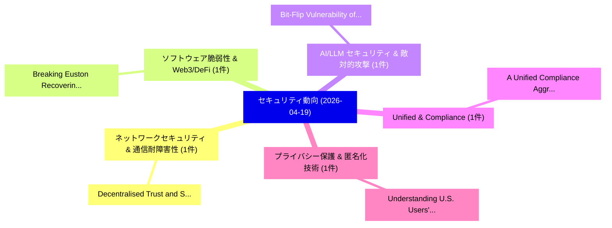

# 📅 02_daily: 日次エグゼクティブサマリー報告書 (2026-04-19)

**集計日時**: 2026-10-02 23:06:05 UTC  
**対象日付**: 2026-04-19  
**本日収集論文数**: 15 件  

---

## 💡 主要セキュリティ動向・脅威インサイト (Executive Insights)

本日の収集論文（計 15 件）において、以下の重点セキュリティ領域で活発な研究動向が確認されました：
- **ネットワークセキュリティ & 通信耐障害性** (1 件): 注目論文として 「Decentralised Trust and Securi...」 等が発表され、実務防御および攻撃検証の進展が見られます。
- **ソフトウェア脆弱性 & Web3/DeFi** (1 件): 注目論文として 「Breaking Euston: Recovering Pr...」 等が発表され、実務防御および攻撃検証の進展が見られます。
- **AI/LLM セキュリティ & 敵対的攻撃** (1 件): 注目論文として 「Bit-Flip Vulnerability of Shar...」 等が発表され、実務防御および攻撃検証の進展が見られます。
- **Unified & Compliance** (1 件): 注目論文として 「A Unified Compliance Aggregato...」 等が発表され、実務防御および攻撃検証の進展が見られます。
- **プライバシー保護 & 匿名化技術** (1 件): 注目論文として 「Understanding U.S. Users' Secu...」 等が発表され、実務防御および攻撃検証の進展が見られます。

### 🗺️ 技術・脅威トピックマインドマップ

---

## 📌 日次セキュリティ論文一覧 (日本語表形式)

| No | arXiv ID | 論文タイトル (日本語訳) | 重要キーワード | 構造化エグゼクティブ要約 (背景・提案・影響) | 脅威分類 | 詳細リンク |
|---|---|---|---|---|---|---|
| 1 | `2604.17179v1` | [Decentralised Trust and Security Mechanisms for IoT Networks at the Edge: A Comprehensive Review（セキュリティ分析論文）](../../okf/papers/2026-04-19/2604.17179.md) | `Decentralised Trust`, `Security Mechanisms`, `Comprehensive Review` | 【提案】概要 (Overview & Key Finding) 本論文「Decentralised Trust and Security Mechanisms for IoT Net...。実証評価により経営層・セキュリティ管理者向け推奨アクション (E... | `cs.NI` | [arXiv](https://arxiv.org/abs/2604.17179v1) &#124; [OKF](../../okf/papers/2026-04-19/2604.17179.md) |
| 2 | `2604.17238v2` | [Breaking Euston: Recovering Private Inputs from Secure Inference by Exploiting Subspace Leakage（セキュリティ分析論文）](../../okf/papers/2026-04-19/2604.17238.md) | `Recovering Private Inputs`, `Exploiting Subspace Leakage`, `Breaking Euston` | 【提案】概要 (Overview & Key Finding) 本論文「Breaking Euston: Recovering Private Inputs from Secure ...。実証評価により経営層・セキュリティ管理者向け推奨アクション (E... | `cybersecurity` | [arXiv](https://arxiv.org/abs/2604.17238v2) &#124; [OKF](../../okf/papers/2026-04-19/2604.17238.md) |
| 3 | `2604.17249v2` | [Bit-Flip Vulnerability of Shared KV-Cache Blocks in LLM Serving Systems（セキュリティ分析論文）](../../okf/papers/2026-04-19/2604.17249.md) | `Flip Vulnerability`, `Cache Blocks`, `Serving Systems` | 【提案】概要 (Overview & Key Finding) 本論文「Bit-Flip 脆弱性 of Shared KV-Cache Blocks in LLM Serving S...。実証評価により経営層・セキュリティ管理者向け推奨アクション (E... | `executive-summary` | [arXiv](https://arxiv.org/abs/2604.17249v2) &#124; [OKF](../../okf/papers/2026-04-19/2604.17249.md) |
| 4 | `2604.17256v1` | [A Unified Compliance Aggregator Framework for Automated Multi-Tool Security Assessment of Linux Systems（セキュリティ分析論文）](../../okf/papers/2026-04-19/2604.17256.md) | `Tool Security Assessment`, `Automated Multi`, `Linux Systems` | 【提案】概要 (Overview & Key Finding) 本論文「A Unified Compliance Aggregator Framework for Automated...。実証評価により経営層・セキュリティ管理者向け推奨アクション (E... | `executive-summary` | [arXiv](https://arxiv.org/abs/2604.17256v1) &#124; [OKF](../../okf/papers/2026-04-19/2604.17256.md) |
| 5 | `2604.17270v2` | [Understanding U.S. Users' Security and Privacy Transparency Needs for Consumer-Facing Generative AI（セキュリティ分析論文）](../../okf/papers/2026-04-19/2604.17270.md) | `Privacy Transparency Needs`, `Facing Generative`, `Consumer-Facing Generative` | 【提案】Users' Security and Privacy Transparency Needs for Consumer-Facing Generative AI ### (日...。実証評価により経営層・セキュリティ管理者向け推奨アクション (E... | `cs.AI` | [arXiv](https://arxiv.org/abs/2604.17270v2) &#124; [OKF](../../okf/papers/2026-04-19/2604.17270.md) |
| 6 | `2604.17313v1` | [GuardPhish: Open-Source LLMs from Phishing Abuseのセキュリティ強化](../../okf/papers/2026-04-19/2604.17313.md) | `Open-Source LLMs`, `Securing Open`, `Phishing Abuse` | 【提案】概要 (Overview & Key Finding) 本論文「GuardPhish: Open-Source LLMs from Phishing Abuseのセキュリティ...。実証評価により経営層・セキュリティ管理者向け推奨アクション (E... | `cybersecurity` | [arXiv](https://arxiv.org/abs/2604.17313v1) &#124; [OKF](../../okf/papers/2026-04-19/2604.17313.md) |
| 7 | `2604.17342v1` | [Monotone but Exciting: On Evolving Monotone Boolean Functions with High Nonlinearity（セキュリティ分析論文）](../../okf/papers/2026-04-19/2604.17342.md) | `High Nonlinearity`, `Claude Carlet`, `Domagoj Jakobovic` | 【提案】概要 (Overview & Key Finding) 本論文「Monotone but Exciting: On Evolving Monotone Boolean Fun...。実証評価により経営層・セキュリティ管理者向け推奨アクション (E... | `executive-summary` | [arXiv](https://arxiv.org/abs/2604.17342v1) &#124; [OKF](../../okf/papers/2026-04-19/2604.17342.md) |
| 8 | `2604.17476v1` | [Privatar: Scalable Privacy-preserving Multi-user VR via Secure Offloading（セキュリティ分析論文）](../../okf/papers/2026-04-19/2604.17476.md) | `Scalable Privacy`, `Secure Offloading`, `Privacy-preserving Multi` | 【提案】概要 (Overview & Key Finding) 本論文「Privatar: Scalable Privacy-preserving Multi-user VR via...。実証評価により経営層・セキュリティ管理者向け推奨アクション (E... | `cs.CV` | [arXiv](https://arxiv.org/abs/2604.17476v1) &#124; [OKF](../../okf/papers/2026-04-19/2604.17476.md) |
| 9 | `2604.17481v1` | [A Novel Quantum Augmented Framework to Improve Microgrid サイバーセキュリティ](../../okf/papers/2026-04-19/2604.17481.md) | `Improve Microgrid Cybersecurity`, `Improve Microgrid`, `Nitin Jha` | 【提案】概要 (Overview & Key Finding) 本論文「A Novel 量子 Augmented Framework to Improve Microgrid サイバ...。実証評価により経営層・セキュリティ管理者向け推奨アクション (E... | `executive-summary` | [arXiv](https://arxiv.org/abs/2604.17481v1) &#124; [OKF](../../okf/papers/2026-04-19/2604.17481.md) |
| 10 | `2604.17511v2` | [Atomic Decision Boundaries: A Structural Requirement for Guaranteeing Execution-Time Admissibility in Autonomous Systems（セキュリティ分析論文）](../../okf/papers/2026-04-19/2604.17511.md) | `Atomic Decision Boundaries`, `Structural Requirement`, `Guaranteeing Execution` | 【提案】概要 (Overview & Key Finding) 本論文「Atomic Decision Boundaries: A Structural Requirement fo...。実証評価により経営層・セキュリティ管理者向け推奨アクション (E... | `cs.AI` | [arXiv](https://arxiv.org/abs/2604.17511v2) &#124; [OKF](../../okf/papers/2026-04-19/2604.17511.md) |
| 11 | `2604.17517v2` | [From Admission to Invariants: Measuring Deviation in Delegated Agent Systems（セキュリティ分析論文）](../../okf/papers/2026-04-19/2604.17517.md) | `Delegated Agent Systems`, `Measuring Deviation`, `Marcelo Fernandez` | 【提案】概要 (Overview & Key Finding) 本論文「From Admission to Invariants: Measuring Deviation in De...。実証評価により経営層・セキュリティ管理者向け推奨アクション (E... | `cs.AI` | [arXiv](https://arxiv.org/abs/2604.17517v2) &#124; [OKF](../../okf/papers/2026-04-19/2604.17517.md) |
| 12 | `2604.17522v1` | [Explainable Attention-Based LSTM Framework for Early AI-Assisted Ransomware via File System Behavioral Analysisの検出](../../okf/papers/2026-04-19/2604.17522.md) | `Explainable Attention`, `Assisted Ransomware`, `Attention-Based LSTM` | 【提案】概要 (Overview & Key Finding) 本論文「Explainable Attention-Based LSTM Framework for Early AI...。実証評価により経営層・セキュリティ管理者向け推奨アクション (E... | `cybersecurity` | [arXiv](https://arxiv.org/abs/2604.17522v1) &#124; [OKF](../../okf/papers/2026-04-19/2604.17522.md) |
| 13 | `2604.17556v1` | [SoK: Reshaping Research on Network Intrusion Detection Systems（セキュリティ分析論文）](../../okf/papers/2026-04-19/2604.17556.md) | `Network Intrusion Detection Systems`, `Reshaping Research`, `Giovanni Apruzzese` | 【提案】概要 (Overview & Key Finding) 本論文「SoK: Reshaping Research on Network Intrusion Detection ...。実証評価により経営層・セキュリティ管理者向け推奨アクション (E... | `cybersecurity` | [arXiv](https://arxiv.org/abs/2604.17556v1) &#124; [OKF](../../okf/papers/2026-04-19/2604.17556.md) |
| 14 | `2604.17596v1` | [Terminal Wrench: A Dataset of 331 Reward-Hackable Environments and 3,632 Exploit Trajectories（セキュリティ分析論文）](../../okf/papers/2026-04-19/2604.17596.md) | `Terminal Wrench`, `Hackable Environments`, `Reward-Hackable Environments` | 【提案】概要 (Overview & Key Finding) 本論文「Terminal Wrench: A Dataset of 331 Reward-Hackable Envir...。実証評価により経営層・セキュリティ管理者向け推奨アクション (E... | `cs.AI` | [arXiv](https://arxiv.org/abs/2604.17596v1) &#124; [OKF](../../okf/papers/2026-04-19/2604.17596.md) |
| 15 | `2604.17668v1` | [Original Sin of npm: A Study on Vulnerability Propagation in JavaScript Dependency Networks（セキュリティ分析論文）](../../okf/papers/2026-04-19/2604.17668.md) | `Original Sin`, `Vulnerability Propagation`, `Dependency Networks` | 【提案】概要 (Overview & Key Finding) 本論文「Original Sin of npm: A Study on 脆弱性 Propagation in Java...。実証評価により経営層・セキュリティ管理者向け推奨アクション (E... | `cybersecurity` | [arXiv](https://arxiv.org/abs/2604.17668v1) &#124; [OKF](../../okf/papers/2026-04-19/2604.17668.md) |

