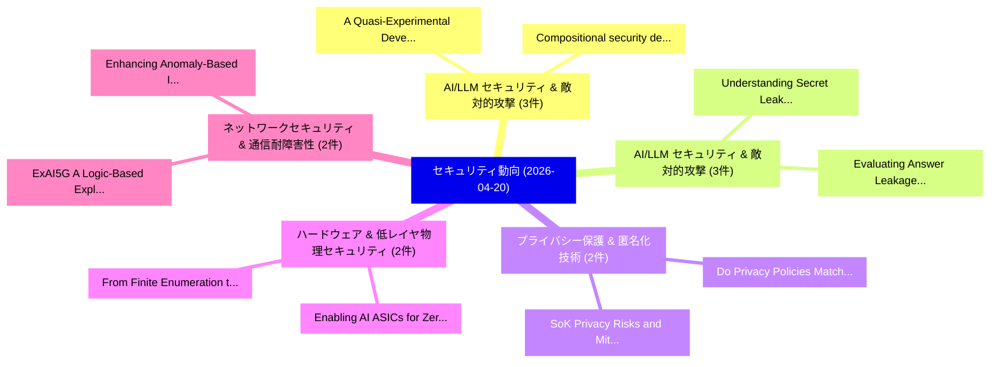

# 📅 02_daily: 日次エグゼクティブサマリー報告書 (2026-04-20)

**集計日時**: 2026-10-02 23:06:06 UTC  
**対象日付**: 2026-04-20  
**本日収集論文数**: 36 件  

---

## 💡 主要セキュリティ動向・脅威インサイト (Executive Insights)

本日の収集論文（計 36 件）において、以下の重点セキュリティ領域で活発な研究動向が確認されました：
- **AI/LLM セキュリティ & 敵対的攻撃** (3 件): 注目論文として 「A Quasi-Experimental Developer...」、「Compositional security definit...」 等が発表され、実務防御および攻撃検証の進展が見られます。
- **AI/LLM セキュリティ & 敵対的攻撃** (3 件): 注目論文として 「Understanding Secret Leakage R...」、「Evaluating Answer Leakage Robu...」 等が発表され、実務防御および攻撃検証の進展が見られます。
- **プライバシー保護 & 匿名化技術** (2 件): 注目論文として 「SoK: Privacy Risks and Mitigat...」、「Do Privacy Policies Match with...」 等が発表され、実務防御および攻撃検証の進展が見られます。
- **ハードウェア & 低レイヤ物理セキュリティ** (2 件): 注目論文として 「Enabling AI ASICs for Zero Kno...」、「From Finite Enumeration to Uni...」 等が発表され、実務防御および攻撃検証の進展が見られます。
- **ネットワークセキュリティ & 通信耐障害性** (2 件): 注目論文として 「ExAI5G: A Logic-Based Explaina...」、「Enhancing Anomaly-Based Intrus...」 等が発表され、実務防御および攻撃検証の進展が見られます。

### 🗺️ 技術・脅威トピックマインドマップ

---

## 📌 日次セキュリティ論文一覧 (日本語表形式)

| No | arXiv ID | 論文タイトル (日本語訳) | 重要キーワード | 構造化エグゼクティブ要約 (背景・提案・影響) | 脅威分類 | 詳細リンク |
|---|---|---|---|---|---|---|
| 1 | `2604.17750v1` | [SDLLMFuzz: Dynamic-static LLM-assisted greybox fuzzing for structured input programs（セキュリティ分析論文）](../../okf/papers/2026-04-20/2604.17750.md) | `Dynamic-static LLM`, `Yihao Zou`, `Tianming Zheng` | 【提案】概要 (Overview & Key Finding) 本論文「SDLLMFuzz: Dynamic-static LLM-assisted greybox fuzzing ...。実証評価により経営層・セキュリティ管理者向け推奨アクション (E... | `cs.PL` | [arXiv](https://arxiv.org/abs/2604.17750v1) &#124; [OKF](../../okf/papers/2026-04-20/2604.17750.md) |
| 2 | `2604.17763v1` | [A Quasi-Experimental Developer Study of Security Training in LLM-Assisted Web Application Development（セキュリティ分析論文）](../../okf/papers/2026-04-20/2604.17763.md) | `Assisted Web Application Development`, `Quasi-Experimental Developer`, `Security Training` | 【提案】概要 (Overview & Key Finding) 本論文「A Quasi-Experimental Developer Study of Security Traini...。実証評価により経営層・セキュリティ管理者向け推奨アクション (E... | `executive-summary` | [arXiv](https://arxiv.org/abs/2604.17763v1) &#124; [OKF](../../okf/papers/2026-04-20/2604.17763.md) |
| 3 | `2604.17788v1` | [SoK: Privacy Risks and Mitigation in Online Propaganda Detection through the PROMPT Frameworkの分析](../../okf/papers/2026-04-20/2604.17788.md) | `Online Propaganda Detection`, `Privacy Risks`, `Al Nahian Bin Emran` | 【提案】概要 (Overview & Key Finding) 本論文「SoK: Privacy Risks and Mitigation in Online Propaganda ...。実証評価により経営層・セキュリティ管理者向け推奨アクション (E... | `executive-summary` | [arXiv](https://arxiv.org/abs/2604.17788v1) &#124; [OKF](../../okf/papers/2026-04-20/2604.17788.md) |
| 4 | `2604.17806v1` | [Party Autonomy in Determining the Law Applicable to Non-contractual Obligations concerning Cross-Border Data Transfers（セキュリティ分析論文）](../../okf/papers/2026-04-20/2604.17806.md) | `Border Data Transfers`, `Party Autonomy`, `Law Applicable` | 【提案】概要 (Overview & Key Finding) 本論文「Party Autonomy in Determining the Law Applicable to Non...。実証評価により経営層・セキュリティ管理者向け推奨アクション (E... | `cs.AI` | [arXiv](https://arxiv.org/abs/2604.17806v1) &#124; [OKF](../../okf/papers/2026-04-20/2604.17806.md) |
| 5 | `2604.17808v1` | [Enabling AI ASICs for Zero Knowledge Proof（セキュリティ分析論文）](../../okf/papers/2026-04-20/2604.17808.md) | `Zero Knowledge Proof`, `Jianming Tong`, `Jingtian Dang` | 【提案】概要 (Overview & Key Finding) 本論文「Enabling AI ASICs for Zero Knowledge Proof（セキュリティ分析論文）」...。実証評価により経営層・セキュリティ管理者向け推奨アクション (E... | `cs.PL` | [arXiv](https://arxiv.org/abs/2604.17808v1) &#124; [OKF](../../okf/papers/2026-04-20/2604.17808.md) |
| 6 | `2604.17814v1` | [Understanding Secret Leakage Risks in Code LLMs: A Tokenization Perspective（セキュリティ分析論文）](../../okf/papers/2026-04-20/2604.17814.md) | `Understanding Secret Leakage Risks`, `Tokenization Perspective`, `Meifang Chen` | 【提案】概要 (Overview & Key Finding) 本論文「Understanding Secret Leakage Risks in Code LLMs: A Toke...。実証評価により経営層・セキュリティ管理者向け推奨アクション (E... | `cs.AI` | [arXiv](https://arxiv.org/abs/2604.17814v1) &#124; [OKF](../../okf/papers/2026-04-20/2604.17814.md) |
| 7 | `2604.17816v1` | [Privacy-Preserving Product-Quantized Approximate Nearest Neighbor Search Framework for Large-scale Datasets via A Hybrid of Fully Homomorphic Encryption and Trusted Execution Environment（セキュリティ分析論文）](../../okf/papers/2026-04-20/2604.17816.md) | `Fully Homomorphic Encryption`, `Trusted Execution Environment`, `Preserving Product` | 【提案】概要 (Overview & Key Finding) 本論文「Privacy-Preserving Product-Quantized Approximate Neares...。実証評価によりセキュリティ影響と実験結果 (Results & ... | `cybersecurity` | [arXiv](https://arxiv.org/abs/2604.17816v1) &#124; [OKF](../../okf/papers/2026-04-20/2604.17816.md) |
| 8 | `2604.17860v2` | [TitanCA: Lessons from Orchestrating LLMエージェント to Discover 100+ CVEs](../../okf/papers/2026-04-20/2604.17860.md) | `Ngoc Tan Bui`, `Phuc Thanh Nguyen`, `Yan Naing Tun` | 【提案】概要 (Overview & Key Finding) 本論文「TitanCA: Lessons from Orchestrating LLMエージェント to Discov...。実証評価により経営層・セキュリティ管理者向け推奨アクション (E... | `cybersecurity` | [arXiv](https://arxiv.org/abs/2604.17860v2) &#124; [OKF](../../okf/papers/2026-04-20/2604.17860.md) |
| 9 | `2604.17948v2` | [RAVEN: Retrieval-Augmented Vulnerability Exploration Network for Memory Corruption Analysis in User Code and Binary Programs（セキュリティ分析論文）](../../okf/papers/2026-04-20/2604.17948.md) | `Augmented Vulnerability Exploration Network`, `Retrieval-Augmented Vulnerability`, `User Code` | 【提案】概要 (Overview & Key Finding) 本論文「RAVEN: Retrieval-Augmented 脆弱性 Exploration Network for ...。実証評価により経営層・セキュリティ管理者向け推奨アクション (E... | `cs.AI` | [arXiv](https://arxiv.org/abs/2604.17948v2) &#124; [OKF](../../okf/papers/2026-04-20/2604.17948.md) |
| 10 | `2604.18052v1` | [ExAI5G: A Logic-Based Explainable AI Framework for Intrusion Detection in 5G Networks（セキュリティ分析論文）](../../okf/papers/2026-04-20/2604.18052.md) | `Based Explainable`, `Intrusion Detection`, `Logic-Based Explainable` | 【提案】概要 (Overview & Key Finding) 本論文「ExAI5G: A Logic-Based Explainable AI Framework for Intr...。実証評価により経営層・セキュリティ管理者向け推奨アクション (E... | `cs.AI` | [arXiv](https://arxiv.org/abs/2604.18052v1) &#124; [OKF](../../okf/papers/2026-04-20/2604.18052.md) |
| 11 | `2604.18066v1` | [Enhancing Anomaly-Based Intrusion Detection Systems with Process Mining（セキュリティ分析論文）](../../okf/papers/2026-04-20/2604.18066.md) | `Based Intrusion Detection Systems`, `Enhancing Anomaly`, `Process Mining` | 【提案】概要 (Overview & Key Finding) 本論文「Enhancing Anomaly-Based Intrusion Detection Systems wit...。実証評価により経営層・セキュリティ管理者向け推奨アクション (E... | `cs.NI` | [arXiv](https://arxiv.org/abs/2604.18066v1) &#124; [OKF](../../okf/papers/2026-04-20/2604.18066.md) |
| 12 | `2604.18080v1` | [Dynamic Risk Assessment by Bayesian Attack Graphs and Process Mining（セキュリティ分析論文）](../../okf/papers/2026-04-20/2604.18080.md) | `Dynamic Risk Assessment`, `Bayesian Attack Graphs`, `Process Mining` | 【提案】概要 (Overview & Key Finding) 本論文「Dynamic Risk Assessment by Bayesian Attack Graphs and P...。実証評価により経営層・セキュリティ管理者向け推奨アクション (E... | `cs.NI` | [arXiv](https://arxiv.org/abs/2604.18080v1) &#124; [OKF](../../okf/papers/2026-04-20/2604.18080.md) |
| 13 | `2604.18163v2` | [Audit-or-Cast: Enforcing Honest Elections with Privacy-Preserving Public Verification（セキュリティ分析論文）](../../okf/papers/2026-04-20/2604.18163.md) | `Enforcing Honest Elections`, `Preserving Public Verification`, `Privacy-Preserving Public` | 【提案】概要 (Overview & Key Finding) 本論文「Audit-or-Cast: Enforcing Honest Elections with Privacy-...。実証評価により経営層・セキュリティ管理者向け推奨アクション (E... | `cybersecurity` | [arXiv](https://arxiv.org/abs/2604.18163v2) &#124; [OKF](../../okf/papers/2026-04-20/2604.18163.md) |
| 14 | `2604.18179v3` | [Committed SAE-Feature Traces for Audited-Session Substitution Detection in Hosted LLMs（セキュリティ分析論文）](../../okf/papers/2026-04-20/2604.18179.md) | `Session Substitution Detection`, `Feature Traces`, `SAE-Feature Traces` | 【提案】概要 (Overview & Key Finding) 本論文「Committed SAE-Feature Traces for Audited-Session Substi...。実証評価により経営層・セキュリティ管理者向け推奨アクション (E... | `cs.AI` | [arXiv](https://arxiv.org/abs/2604.18179v3) &#124; [OKF](../../okf/papers/2026-04-20/2604.18179.md) |
| 15 | `2604.18231v2` | [AgenTEE: Confidential LLM Agent Execution on Edge Devices（セキュリティ分析論文）](../../okf/papers/2026-04-20/2604.18231.md) | `Agent Execution`, `Edge Devices`, `Amir Al Sadi` | 【提案】概要 (Overview & Key Finding) 本論文「AgenTEE: Confidential LLM Agent Execution on Edge Devic...。実証評価により経営層・セキュリティ管理者向け推奨アクション (E... | `executive-summary` | [arXiv](https://arxiv.org/abs/2604.18231v2) &#124; [OKF](../../okf/papers/2026-04-20/2604.18231.md) |
| 16 | `2604.18248v4` | [Beyond Pattern Matching: Seven Cross-Domain Techniques for Prompt Injection Detection（セキュリティ分析論文）](../../okf/papers/2026-04-20/2604.18248.md) | `Beyond Pattern Matching`, `Prompt Injection Detection`, `Seven Cross` | 【提案】概要 (Overview & Key Finding) 本論文「Beyond Pattern Matching: Seven Cross-Domain Techniques ...。実証評価により経営層・セキュリティ管理者向け推奨アクション (E... | `executive-summary` | [arXiv](https://arxiv.org/abs/2604.18248v4) &#124; [OKF](../../okf/papers/2026-04-20/2604.18248.md) |
| 17 | `2604.18282v1` | [Subcodes of Lambda-Gabidulin Codes for Compact-Ciphertext Cryptography（セキュリティ分析論文）](../../okf/papers/2026-04-20/2604.18282.md) | `Gabidulin Codes`, `Ciphertext Cryptography`, `Lambda-Gabidulin Codes` | 【提案】概要 (Overview & Key Finding) 本論文「Subcodes of Lambda-Gabidulin Codes for Compact-Cipherte...。実証評価により経営層・セキュリティ管理者向け推奨アクション (E... | `executive-summary` | [arXiv](https://arxiv.org/abs/2604.18282v1) &#124; [OKF](../../okf/papers/2026-04-20/2604.18282.md) |
| 18 | `2604.18300v1` | [Compositional security definitions for higher-order where declassification（セキュリティ分析論文）](../../okf/papers/2026-04-20/2604.18300.md) | `Jan Menz`, `Peixuan Li`, `Deepak Garg` | 【提案】概要 (Overview & Key Finding) 本論文「Compositional security definitions for higher-order whe...。実証評価により経営層・セキュリティ管理者向け推奨アクション (E... | `cs.PL` | [arXiv](https://arxiv.org/abs/2604.18300v1) &#124; [OKF](../../okf/papers/2026-04-20/2604.18300.md) |
| 19 | `2604.18352v1` | [Tight Auditing of Differential Privacy in MST and AIM（セキュリティ分析論文）](../../okf/papers/2026-04-20/2604.18352.md) | `Tight Auditing`, `Differential Privacy`, `Meenatchi Sundaram Muthu Selva Annamalai` | 【提案】概要 (Overview & Key Finding) 本論文「Tight Auditing of 差分プライバシー in MST and AIM（セキュリティ分析論文）」（...。実証評価により経営層・セキュリティ管理者向け推奨アクション (E... | `cs.AI` | [arXiv](https://arxiv.org/abs/2604.18352v1) &#124; [OKF](../../okf/papers/2026-04-20/2604.18352.md) |
| 20 | `2604.18395v1` | [Capturing Monetarily Exploitable Vulnerability in Smart Contracts via Auditor Knowledge-Learning Fuzzing（セキュリティ分析論文）](../../okf/papers/2026-04-20/2604.18395.md) | `Capturing Monetarily Exploitable Vulnerability`, `Smart Contracts`, `Auditor Knowledge` | 【提案】概要 (Overview & Key Finding) 本論文「Capturing Monetarily Exploitable 脆弱性 in スマートコントラクトs via...。実証評価により経営層・セキュリティ管理者向け推奨アクション (E... | `cybersecurity` | [arXiv](https://arxiv.org/abs/2604.18395v1) &#124; [OKF](../../okf/papers/2026-04-20/2604.18395.md) |
| 21 | `2604.18510v1` | [Different Paths to Harmful Compliance: Behavioral Side Effects and Mechanistic Divergence Across LLM Jailbreaks（セキュリティ分析論文）](../../okf/papers/2026-04-20/2604.18510.md) | `Behavioral Side Effects`, `Mechanistic Divergence Across`, `Different Paths` | 【提案】概要 (Overview & Key Finding) 本論文「Different Paths to Harmful Compliance: Behavioral Side ...。実証評価により経営層・セキュリティ管理者向け推奨アクション (E... | `cs.AI` | [arXiv](https://arxiv.org/abs/2604.18510v1) &#124; [OKF](../../okf/papers/2026-04-20/2604.18510.md) |
| 22 | `2604.18552v3` | [Do Privacy Policies Match with the Logs? Privacy Disclosure in Android Application Logsの実証研究](../../okf/papers/2026-04-20/2604.18552.md) | `Privacy Disclosure`, `Android Application Logs`, `Android Application` | 【提案】An Empirical Study of Privacy Disclosure in Android Application Logs ### (日本語題名: Do Pri...。実証評価により経営層・セキュリティ管理者向け推奨アクション (E... | `Privacy & Provenance` | [arXiv](https://arxiv.org/abs/2604.18552v3) &#124; [OKF](../../okf/papers/2026-04-20/2604.18552.md) |
| 23 | `2604.18649v1` | [Position: No Retroactive Cure for Infringement during Training（セキュリティ分析論文）](../../okf/papers/2026-04-20/2604.18649.md) | `Satoru Utsunomiya`, `Masaru Isonuma`, `Junichiro Mori` | 【提案】概要 (Overview & Key Finding) 本論文「Position: No Retroactive Cure for Infringement during T...。実証評価により経営層・セキュリティ管理者向け推奨アクション (E... | `cs.AI` | [arXiv](https://arxiv.org/abs/2604.18649v1) &#124; [OKF](../../okf/papers/2026-04-20/2604.18649.md) |
| 24 | `2604.18652v2` | [From Craft to Kernel: A Governance-First Execution Architecture and Semantic ISA for Agentic Computers（セキュリティ分析論文）](../../okf/papers/2026-04-20/2604.18652.md) | `First Execution Architecture`, `Agentic Computers`, `Governance-First Execution` | 【提案】概要 (Overview & Key Finding) 本論文「From Craft to Kernel: A Governance-First Execution Arch...。実証評価により経営層・セキュリティ管理者向け推奨アクション (E... | `cs.AI` | [arXiv](https://arxiv.org/abs/2604.18652v2) &#124; [OKF](../../okf/papers/2026-04-20/2604.18652.md) |
| 25 | `2604.18658v1` | [Owner-Harm: A Missing Threat Model for AI Agent Safety（セキュリティ分析論文）](../../okf/papers/2026-04-20/2604.18658.md) | `Missing Threat Model`, `Agent Safety`, `Dongcheng Zhang` | 【提案】概要 (Overview & Key Finding) 本論文「Owner-Harm: A Missing 脅威 Model for AI Agent Safety（セキュリ...。実証評価により経営層・セキュリティ管理者向け推奨アクション (E... | `cs.AI` | [arXiv](https://arxiv.org/abs/2604.18658v1) &#124; [OKF](../../okf/papers/2026-04-20/2604.18658.md) |
| 26 | `2604.18660v1` | [Evaluating Answer Leakage Robustness of LLM Tutors against Adversarial Student Attacks（セキュリティ分析論文）](../../okf/papers/2026-04-20/2604.18660.md) | `Evaluating Answer Leakage Robustness`, `Adversarial Student Attacks`, `Adversarial Student Attac` | 【提案】概要 (Overview & Key Finding) 本論文「Evaluating Answer Leakage Robustness of LLM Tutors agai...。実証評価により経営層・セキュリティ管理者向け推奨アクション (E... | `cs.AI` | [arXiv](https://arxiv.org/abs/2604.18660v1) &#124; [OKF](../../okf/papers/2026-04-20/2604.18660.md) |
| 27 | `2604.18663v1` | [Beyond Explicit Refusals: Soft-Failure Attacks on Retrieval-Augmented Generation（セキュリティ分析論文）](../../okf/papers/2026-04-20/2604.18663.md) | `Beyond Explicit Refusals`, `Failure Attacks`, `Soft-Failure Attacks` | 【提案】概要 (Overview & Key Finding) 本論文「Beyond Explicit Refusals: Soft-Failure Attacks on Retri...。実証評価により経営層・セキュリティ管理者向け推奨アクション (E... | `cs.AI` | [arXiv](https://arxiv.org/abs/2604.18663v1) &#124; [OKF](../../okf/papers/2026-04-20/2604.18663.md) |
| 28 | `2604.18697v1` | [Beyond Indistinguishability: Measuring Extraction Risk in LLM APIs（セキュリティ分析論文）](../../okf/papers/2026-04-20/2604.18697.md) | `Measuring Extraction Risk`, `Beyond Indistinguishability`, `Ruixuan Liu` | 【提案】概要 (Overview & Key Finding) 本論文「Beyond Indistinguishability: Measuring Extraction Risk ...。実証評価により経営層・セキュリティ管理者向け推奨アクション (E... | `executive-summary` | [arXiv](https://arxiv.org/abs/2604.18697v1) &#124; [OKF](../../okf/papers/2026-04-20/2604.18697.md) |
| 29 | `2604.18716v1` | [TrEEStealer: Stealing Decision Trees via Enclave Side Channels（セキュリティ分析論文）](../../okf/papers/2026-04-20/2604.18716.md) | `Stealing Decision Trees`, `Enclave Side Channels`, `Jonas Sander` | 【提案】概要 (Overview & Key Finding) 本論文「TrEEStealer: Stealing Decision Trees via Enclave Side C...。実証評価により経営層・セキュリティ管理者向け推奨アクション (E... | `executive-summary` | [arXiv](https://arxiv.org/abs/2604.18716v1) &#124; [OKF](../../okf/papers/2026-04-20/2604.18716.md) |
| 30 | `2604.18717v2` | [From Finite Enumeration to Universal Proof: Ring-Theoretic Foundations for PQC Hardware Masking Verification（セキュリティ分析論文）](../../okf/papers/2026-04-20/2604.18717.md) | `Hardware Masking Verification`, `Universal Proof`, `Theoretic Foundations` | 【提案】概要 (Overview & Key Finding) 本論文「From Finite Enumeration to Universal Proof: Ring-Theore...。実証評価により経営層・セキュリティ管理者向け推奨アクション (E... | `cybersecurity` | [arXiv](https://arxiv.org/abs/2604.18717v2) &#124; [OKF](../../okf/papers/2026-04-20/2604.18717.md) |
| 31 | `2604.18718v1` | [Optimal Agentic Architectures for Offensive Security Tasksに向けて](../../okf/papers/2026-04-20/2604.18718.md) | `Towards Optimal Agentic Architectures`, `Offensive Security Tasks`, `Optimal Agentic Architectures` | 【提案】概要 (Overview & Key Finding) 本論文「Optimal Agentic Architectures for Offensive Security Ta...。実証評価により経営層・セキュリティ管理者向け推奨アクション (E... | `cs.AI` | [arXiv](https://arxiv.org/abs/2604.18718v1) &#124; [OKF](../../okf/papers/2026-04-20/2604.18718.md) |
| 32 | `2604.18756v1` | [Understanding the Robustness of Sparse Autoencodersに向けて](../../okf/papers/2026-04-20/2604.18756.md) | `Towards Understanding`, `Sparse Autoencoders`, `Ahson Saiyed` | 【提案】概要 (Overview & Key Finding) 本論文「Understanding the Robustness of Sparse Autoencodersに向けて...。実証評価により経営層・セキュリティ管理者向け推奨アクション (E... | `cs.AI` | [arXiv](https://arxiv.org/abs/2604.18756v1) &#124; [OKF](../../okf/papers/2026-04-20/2604.18756.md) |
| 33 | `2604.18789v1` | [ARES: Adaptive Red-Teaming and End-to-End Repair of Policy-Reward System（セキュリティ分析論文）](../../okf/papers/2026-04-20/2604.18789.md) | `Adaptive Red`, `End Repair`, `Reward System` | 【提案】概要 (Overview & Key Finding) 本論文「ARES: Adaptive Red-Teaming and End-to-End Repair of Pol...。実証評価により経営層・セキュリティ管理者向け推奨アクション (E... | `cs.AI` | [arXiv](https://arxiv.org/abs/2604.18789v1) &#124; [OKF](../../okf/papers/2026-04-20/2604.18789.md) |
| 34 | `2604.18819v1` | [Blockchain-Driven AI-Enhanced Post-Quantum Multivariate Identity-based Signature and Privacy-Preserving Data Aggregation Scheme for Fog-enabled Flying Ad-Hoc Networks（セキュリティ分析論文）](../../okf/papers/2026-04-20/2604.18819.md) | `Preserving Data Aggregation Scheme`, `Quantum Multivariate Identity`, `Enhanced Post` | 【提案】概要 (Overview & Key Finding) 本論文「Blockchain-Driven AI-Enhanced Post-量子 Multivariate Iden...。実証評価により経営層・セキュリティ管理者向け推奨アクション (E... | `cybersecurity` | [arXiv](https://arxiv.org/abs/2604.18819v1) &#124; [OKF](../../okf/papers/2026-04-20/2604.18819.md) |
| 35 | `2604.18860v1` | [Temporal UI State Inconsistency in Desktop GUI Agents: Formalizing and Defending Against TOCTOU Attacks on Computer-Use Agents（セキュリティ分析論文）](../../okf/papers/2026-04-20/2604.18860.md) | `State Inconsistency`, `Use Agents`, `Computer-Use Agents` | 【提案】概要 (Overview & Key Finding) 本論文「Temporal UI State Inconsistency in Desktop GUI Agents: ...。実証評価により経営層・セキュリティ管理者向け推奨アクション (E... | `cs.AI` | [arXiv](https://arxiv.org/abs/2604.18860v1) &#124; [OKF](../../okf/papers/2026-04-20/2604.18860.md) |
| 36 | `2606.11196v1` | [PoQ-Judge: A Multi-Architecture Evaluation Framework for Cost-Aware Proof-of-Quality in Decentralized LLM Inference（セキュリティ分析論文）](../../okf/papers/2026-04-20/2606.11196.md) | `Aware Proof`, `Cost-Aware Proof`, `Arther Tian` | 【提案】概要 (Overview & Key Finding) 本論文「PoQ-Judge: A Multi-Architecture Evaluation Framework fo...。実証評価により経営層・セキュリティ管理者向け推奨アクション (E... | `cs.AI` | [arXiv](https://arxiv.org/abs/2606.11196v1) &#124; [OKF](../../okf/papers/2026-04-20/2606.11196.md) |

