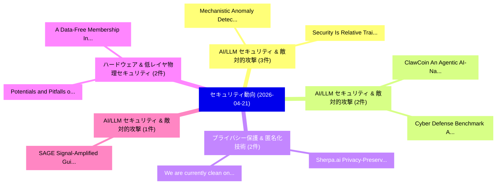

# 📅 02_daily: 日次エグゼクティブサマリー報告書 (2026-04-21)

**集計日時**: 2026-10-02 23:06:06 UTC  
**対象日付**: 2026-04-21  
**本日収集論文数**: 32 件  

---

## 💡 主要セキュリティ動向・脅威インサイト (Executive Insights)

本日の収集論文（計 32 件）において、以下の重点セキュリティ領域で活発な研究動向が確認されました：
- **AI/LLM セキュリティ & 敵対的攻撃** (3 件): 注目論文として 「Mechanistic Anomaly Detection ...」、「Security Is Relative: Training...」 等が発表され、実務防御および攻撃検証の進展が見られます。
- **AI/LLM セキュリティ & 敵対的攻撃** (2 件): 注目論文として 「ClawCoin: An Agentic AI-Native...」、「Cyber Defense Benchmark: Agent...」 等が発表され、実務防御および攻撃検証の進展が見られます。
- **プライバシー保護 & 匿名化技術** (2 件): 注目論文として 「Sherpa.ai Privacy-Preserving M...」、「"We are currently clean on OPS...」 等が発表され、実務防御および攻撃検証の進展が見られます。
- **ハードウェア & 低レイヤ物理セキュリティ** (2 件): 注目論文として 「A Data-Free Membership Inferen...」、「Potentials and Pitfalls of App...」 等が発表され、実務防御および攻撃検証の進展が見られます。
- **AI/LLM セキュリティ & 敵対的攻撃** (1 件): 注目論文として 「SAGE: Signal-Amplified Guided ...」 等が発表され、実務防御および攻撃検証の進展が見られます。

### 🗺️ 技術・脅威トピックマインドマップ

---

## 📌 日次セキュリティ論文一覧 (日本語表形式)

| No | arXiv ID | 論文タイトル (日本語訳) | 重要キーワード | 構造化エグゼクティブ要約 (背景・提案・影響) | 脅威分類 | 詳細リンク |
|---|---|---|---|---|---|---|
| 1 | `2604.18970v2` | [Mechanistic Anomaly Detection via Functional Attribution（セキュリティ分析論文）](../../okf/papers/2026-04-21/2604.18970.md) | `Mechanistic Anomaly Detection`, `Functional Attribution`, `Hugo Lyons Keenan` | 【提案】概要 (Overview & Key Finding) 本論文「Mechanistic Anomaly Detection via Functional Attributio...。実証評価により経営層・セキュリティ管理者向け推奨アクション (E... | `executive-summary` | [arXiv](https://arxiv.org/abs/2604.18970v2) &#124; [OKF](../../okf/papers/2026-04-21/2604.18970.md) |
| 2 | `2604.19012v1` | [Security Is Relative: Training-Free 脆弱性検出 via Multi-Agent Behavioral Contract Synthesis](../../okf/papers/2026-04-21/2604.19012.md) | `Agent Behavioral Contract Synthesis`, `Multi-Agent Behavioral`, `Free Vulnerability Detection` | 【提案】概要 (Overview & Key Finding) 本論文「Security Is Relative: Training-Free 脆弱性検出 via Multi-Age...。実証評価により経営層・セキュリティ管理者向け推奨アクション (E... | `executive-summary` | [arXiv](https://arxiv.org/abs/2604.19012v1) &#124; [OKF](../../okf/papers/2026-04-21/2604.19012.md) |
| 3 | `2604.19026v1` | [ClawCoin: An Agentic AI-Native Cryptocurrency for Decentralized Agent Economies（セキュリティ分析論文）](../../okf/papers/2026-04-21/2604.19026.md) | `Decentralized Agent Economies`, `Native Cryptocurrency`, `AI-Native Cryptocurrency` | 【提案】概要 (Overview & Key Finding) 本論文「ClawCoin: An Agentic AI-Native Cryptocurrency for Decen...。実証評価により経営層・セキュリティ管理者向け推奨アクション (E... | `executive-summary` | [arXiv](https://arxiv.org/abs/2604.19026v1) &#124; [OKF](../../okf/papers/2026-04-21/2604.19026.md) |
| 4 | `2604.19031v1` | [SAGE: Signal-Amplified Guided Embeddings for LLM-based 脆弱性検出](../../okf/papers/2026-04-21/2604.19031.md) | `Amplified Guided Embeddings`, `Signal-Amplified Guided`, `Vulnerability Detection` | 【提案】概要 (Overview & Key Finding) 本論文「SAGE: Signal-Amplified Guided Embeddings for LLM-based ...。実証評価により経営層・セキュリティ管理者向け推奨アクション (E... | `cybersecurity` | [arXiv](https://arxiv.org/abs/2604.19031v1) &#124; [OKF](../../okf/papers/2026-04-21/2604.19031.md) |
| 5 | `2604.19049v1` | [Refute-or-Promote: An Adversarial Stage-Gated Multi-Agent Review Methodology for High-Precision LLM-Assisted Defect Discovery（セキュリティ分析論文）](../../okf/papers/2026-04-21/2604.19049.md) | `Agent Review Methodology`, `Assisted Defect Discovery`, `Gated Multi` | 【提案】概要 (Overview & Key Finding) 本論文「Refute-or-Promote: An Adversarial Stage-Gated Multi-Age...。実証評価により経営層・セキュリティ管理者向け推奨アクション (E... | `cs.AI` | [arXiv](https://arxiv.org/abs/2604.19049v1) &#124; [OKF](../../okf/papers/2026-04-21/2604.19049.md) |
| 6 | `2604.19053v3` | [CHRONOS: A Hardware-Assisted Phase-Decoupled Framework for Secure 連合学習 in IoT](../../okf/papers/2026-04-21/2604.19053.md) | `Assisted Phase`, `Hardware-Assisted Phase`, `Secure Federated Learning` | 【提案】概要 (Overview & Key Finding) 本論文「CHRONOS: A Hardware-Assisted Phase-Decoupled Framework ...。実証評価により経営層・セキュリティ管理者向け推奨アクション (E... | `executive-summary` | [arXiv](https://arxiv.org/abs/2604.19053v3) &#124; [OKF](../../okf/papers/2026-04-21/2604.19053.md) |
| 7 | `2604.19083v1` | [ProjLens: Unveiling the Role of Projectors in Multimodal Model Safety（セキュリティ分析論文）](../../okf/papers/2026-04-21/2604.19083.md) | `Multimodal Model Safety`, `Kun Wang`, `Cheng Qian` | 【提案】概要 (Overview & Key Finding) 本論文「ProjLens: Unveiling the Role of Projectors in Multimoda...。実証評価により経営層・セキュリティ管理者向け推奨アクション (E... | `cs.AI` | [arXiv](https://arxiv.org/abs/2604.19083v1) &#124; [OKF](../../okf/papers/2026-04-21/2604.19083.md) |
| 8 | `2604.19090v1` | [Dual-Guard: Dual-Channel Latent Watermarking for Provenance and Tamper Localization in Diffusion Images（セキュリティ分析論文）](../../okf/papers/2026-04-21/2604.19090.md) | `Channel Latent Watermarking`, `Tamper Localization`, `Diffusion Images` | 【提案】概要 (Overview & Key Finding) 本論文「Dual-Guard: Dual-Channel Latent Watermarking for Proven...。実証評価により経営層・セキュリティ管理者向け推奨アクション (E... | `cybersecurity` | [arXiv](https://arxiv.org/abs/2604.19090v1) &#124; [OKF](../../okf/papers/2026-04-21/2604.19090.md) |
| 9 | `2604.19118v1` | [DP-FlogTinyLLM: Differentially private federated log anomaly detection using Tiny LLMs（セキュリティ分析論文）](../../okf/papers/2026-04-21/2604.19118.md) | `Isaiah Thompson`, `Tanmay Sen`, `Ritwik Bhattacharya` | 【提案】概要 (Overview & Key Finding) 本論文「DP-FlogTinyLLM: Differentially private federated log an...。実証評価により経営層・セキュリティ管理者向け推奨アクション (E... | `cs.AI` | [arXiv](https://arxiv.org/abs/2604.19118v1) &#124; [OKF](../../okf/papers/2026-04-21/2604.19118.md) |
| 10 | `2604.19219v2` | [Sherpa.ai Privacy-Preserving Multi-Party Entity Alignment without Intersection Disclosure for Noisy Identifiers（セキュリティ分析論文）](../../okf/papers/2026-04-21/2604.19219.md) | `Party Entity Alignment`, `Preserving Multi`, `Intersection Disclosure` | 【提案】背景とセキュリティ上の課題 (Background & Problem) 本研究はサイバー脅威環境におけるセキュリティ構造・脆弱性の検証を目的としています。(主要検出項目: ...。実証評価により経営層・セキュリティ管理者向け推奨アクション (E... | `cs.AI` | [arXiv](https://arxiv.org/abs/2604.19219v2) &#124; [OKF](../../okf/papers/2026-04-21/2604.19219.md) |
| 11 | `2604.19354v2` | [Do Agents Dream of Root Shells? Partial-Credit Evaluation of LLMエージェント in Capture the Flag Challenges](../../okf/papers/2026-04-21/2604.19354.md) | `Root Shells`, `Flag Challenges`, `Ali Al` | 【提案】Partial-Credit Evaluation of LLM Agents in Capture the Flag Challenges ### (日本語題名: Do A...。実証評価により経営層・セキュリティ管理者向け推奨アクション (E... | `cs.AI` | [arXiv](https://arxiv.org/abs/2604.19354v2) &#124; [OKF](../../okf/papers/2026-04-21/2604.19354.md) |
| 12 | `2604.19422v1` | [Secure Storage and Privacy-Preserving Scanpath Comparison via Garbled Circuits in Eye Tracking（セキュリティ分析論文）](../../okf/papers/2026-04-21/2604.19422.md) | `Preserving Scanpath Comparison`, `Secure Storage`, `Garbled Circuits` | 【提案】概要 (Overview & Key Finding) 本論文「Secure Storage and Privacy-Preserving Scanpath Comparis...。実証評価により経営層・セキュリティ管理者向け推奨アクション (E... | `executive-summary` | [arXiv](https://arxiv.org/abs/2604.19422v1) &#124; [OKF](../../okf/papers/2026-04-21/2604.19422.md) |
| 13 | `2604.19438v1` | [Malicious ML Model Detection by Learning Dynamic Behaviors（セキュリティ分析論文）](../../okf/papers/2026-04-21/2604.19438.md) | `Learning Dynamic Behaviors`, `Model Detection`, `Sarang Nambiar` | 【提案】概要 (Overview & Key Finding) 本論文「Malicious ML Model Detection by Learning Dynamic Behavi...。実証評価により経営層・セキュリティ管理者向け推奨アクション (E... | `executive-summary` | [arXiv](https://arxiv.org/abs/2604.19438v1) &#124; [OKF](../../okf/papers/2026-04-21/2604.19438.md) |
| 14 | `2604.19461v2` | [Involuntary In-Context Learning: Exploiting Few-Shot Pattern Completion to Bypass Safety Alignment in GPT-5.4（セキュリティ分析論文）](../../okf/papers/2026-04-21/2604.19461.md) | `Shot Pattern Completion`, `Bypass Safety Alignment`, `Context Learning` | 【提案】概要 (Overview & Key Finding) 本論文「Involuntary In-Context Learning: Exploiting Few-Shot Pa...。実証評価により経営層・セキュリティ管理者向け推奨アクション (E... | `cybersecurity` | [arXiv](https://arxiv.org/abs/2604.19461v2) &#124; [OKF](../../okf/papers/2026-04-21/2604.19461.md) |
| 15 | `2604.19471v1` | [API Security Based on Automatic OpenAPI Mapping（セキュリティ分析論文）](../../okf/papers/2026-04-21/2604.19471.md) | `Security Based`, `Yarin Levi`, `Ran Dubin` | 【提案】概要 (Overview & Key Finding) 本論文「API Security Based on Automatic OpenAPI Mapping（セキュリティ分...。実証評価により経営層・セキュリティ管理者向け推奨アクション (E... | `cybersecurity` | [arXiv](https://arxiv.org/abs/2604.19471v1) &#124; [OKF](../../okf/papers/2026-04-21/2604.19471.md) |
| 16 | `2604.19496v1` | [EvoPatch-IoT: Evolution-Aware Cross-Architecture Vulnerability Retrieval and Patch-State Profiling for BusyBox-Based IoT Firmware（セキュリティ分析論文）](../../okf/papers/2026-04-21/2604.19496.md) | `Architecture Vulnerability Retrieval`, `Aware Cross`, `State Profiling` | 【提案】概要 (Overview & Key Finding) 本論文「EvoPatch-IoT: Evolution-Aware Cross-Architecture 脆弱性 Re...。実証評価により経営層・セキュリティ管理者向け推奨アクション (E... | `cybersecurity` | [arXiv](https://arxiv.org/abs/2604.19496v1) &#124; [OKF](../../okf/papers/2026-04-21/2604.19496.md) |
| 17 | `2604.19504v1` | [Cyclic Equalizability Characterized by Parikh Vectors（セキュリティ分析論文）](../../okf/papers/2026-04-21/2604.19504.md) | `Cyclic Equalizability Characterized`, `Parikh Vectors`, `Sarunyu Thongjarast` | 【提案】概要 (Overview & Key Finding) 本論文「Cyclic Equalizability Characterized by Parikh Vectors（セ...。実証評価により経営層・セキュリティ管理者向け推奨アクション (E... | `math.CO` | [arXiv](https://arxiv.org/abs/2604.19504v1) &#124; [OKF](../../okf/papers/2026-04-21/2604.19504.md) |
| 18 | `2604.19514v1` | [When Graph Structure Becomes a Liability: A Critical Re-Evaluation of Graph Neural Networks for Bitcoin Fraud Detection under Temporal Distribution Shift（セキュリティ分析論文）](../../okf/papers/2026-04-21/2604.19514.md) | `Graph Neural Networks`, `Bitcoin Fraud Detection`, `Temporal Distribution Shift` | 【提案】概要 (Overview & Key Finding) 本論文「When Graph Structure Becomes a Liability: A Critical Re...。実証評価により経営層・セキュリティ管理者向け推奨アクション (E... | `cs.AI` | [arXiv](https://arxiv.org/abs/2604.19514v1) &#124; [OKF](../../okf/papers/2026-04-21/2604.19514.md) |
| 19 | `2604.19526v1` | [Evaluating LLM-Generated Obfuscated XSS Payloads for Machine Learning-Based Detection（セキュリティ分析論文）](../../okf/papers/2026-04-21/2604.19526.md) | `Generated Obfuscated`, `Machine Learning`, `Based Detection` | 【提案】概要 (Overview & Key Finding) 本論文「Evaluating LLM-Generated Obfuscated XSS Payloads for Ma...。実証評価により経営層・セキュリティ管理者向け推奨アクション (E... | `executive-summary` | [arXiv](https://arxiv.org/abs/2604.19526v1) &#124; [OKF](../../okf/papers/2026-04-21/2604.19526.md) |
| 20 | `2604.19533v3` | [Cyber Defense Benchmark: Agentic Threat Hunting Evaluation for LLMs in SecOps（セキュリティ分析論文）](../../okf/papers/2026-04-21/2604.19533.md) | `Cyber Defense Benchmark`, `Alankrit Chona`, `Igor Kozlov` | 【提案】概要 (Overview & Key Finding) 本論文「Cyber Defense Benchmark: Agentic 脅威 Hunting Evaluation ...。実証評価により経営層・セキュリティ管理者向け推奨アクション (E... | `cs.AI` | [arXiv](https://arxiv.org/abs/2604.19533v3) &#124; [OKF](../../okf/papers/2026-04-21/2604.19533.md) |
| 21 | `2604.19628v1` | [Adding Compilation Metadata To Binaries To Make Disassembly Decidable（セキュリティ分析論文）](../../okf/papers/2026-04-21/2604.19628.md) | `Daniel Engel`, `Freek Verbeek`, `Pranav Kumar` | 【提案】概要 (Overview & Key Finding) 本論文「Adding Compilation Metadata To Binaries To Make Disasse...。実証評価により経営層・セキュリティ管理者向け推奨アクション (E... | `cs.PL` | [arXiv](https://arxiv.org/abs/2604.19628v1) &#124; [OKF](../../okf/papers/2026-04-21/2604.19628.md) |
| 22 | `2604.19657v1` | [An AI Agent Execution Environment to Safeguard User Data（セキュリティ分析論文）](../../okf/papers/2026-04-21/2604.19657.md) | `Agent Execution Environment`, `Safeguard User Data`, `Robert Stanley` | 【提案】概要 (Overview & Key Finding) 本論文「An AI Agent Execution Environment to Safeguard User Dat...。実証評価により経営層・セキュリティ管理者向け推奨アクション (E... | `cs.AI` | [arXiv](https://arxiv.org/abs/2604.19657v1) &#124; [OKF](../../okf/papers/2026-04-21/2604.19657.md) |
| 23 | `2604.19711v1` | ["We are currently clean on OPSEC": Why JD Can't Encrypt（セキュリティ分析論文）](../../okf/papers/2026-04-21/2604.19711.md) | `Maurice Chiodo`, `Toni Erskine`, `Raw Meta` | 【提案】背景とセキュリティ上の課題 (Background & Problem) 本研究はサイバー脅威環境におけるセキュリティ構造・脆弱性の検証を目的としています。(主要検出項目: ...。実証評価によりWright - **公開日時**: `2026-... | `executive-summary` | [arXiv](https://arxiv.org/abs/2604.19711v1) &#124; [OKF](../../okf/papers/2026-04-21/2604.19711.md) |
| 24 | `2604.19890v1` | [Efficient Arithmetic-and-Comparison Homomorphic Encryption with Space Switching（セキュリティ分析論文）](../../okf/papers/2026-04-21/2604.19890.md) | `Comparison Homomorphic Encryption`, `Efficient Arithmetic`, `Space Switching` | 【提案】概要 (Overview & Key Finding) 本論文「Efficient Arithmetic-and-Comparison 準同型暗号 with Space Sw...。実証評価により経営層・セキュリティ管理者向け推奨アクション (E... | `cybersecurity` | [arXiv](https://arxiv.org/abs/2604.19890v1) &#124; [OKF](../../okf/papers/2026-04-21/2604.19890.md) |
| 25 | `2604.19891v1` | [A Data-Free Membership Inference Attack on 連合学習 in Hardware Assurance](../../okf/papers/2026-04-21/2604.19891.md) | `Free Membership Inference Attack`, `Hardware Assurance`, `Data-Free Membership` | 【提案】概要 (Overview & Key Finding) 本論文「A Data-Free Membership Inference Attack on 連合学習 in Hard...。実証評価により経営層・セキュリティ管理者向け推奨アクション (E... | `cybersecurity` | [arXiv](https://arxiv.org/abs/2604.19891v1) &#124; [OKF](../../okf/papers/2026-04-21/2604.19891.md) |
| 26 | `2604.19915v1` | [DECIFR: Domain-Aware Exfiltration of Circuit Information from Federated Gradient Reconstruction（セキュリティ分析論文）](../../okf/papers/2026-04-21/2604.19915.md) | `Federated Gradient Reconstruction`, `Aware Exfiltration`, `Domain-Aware Exfiltration` | 【提案】概要 (Overview & Key Finding) 本論文「DECIFR: Domain-Aware Exfiltration of Circuit Informatio...。実証評価により経営層・セキュリティ管理者向け推奨アクション (E... | `cybersecurity` | [arXiv](https://arxiv.org/abs/2604.19915v1) &#124; [OKF](../../okf/papers/2026-04-21/2604.19915.md) |
| 27 | `2604.20020v1` | [Potentials and Pitfalls of Applying 連合学習 in Hardware Assurance](../../okf/papers/2026-04-21/2604.20020.md) | `Hardware Assurance`, `Applying Federated Learning`, `Gijung Lee` | 【提案】概要 (Overview & Key Finding) 本論文「Potentials and Pitfalls of Applying 連合学習 in Hardware As...。実証評価により経営層・セキュリティ管理者向け推奨アクション (E... | `cybersecurity` | [arXiv](https://arxiv.org/abs/2604.20020v1) &#124; [OKF](../../okf/papers/2026-04-21/2604.20020.md) |
| 28 | `2604.20047v1` | [PASTA: A Patch-Agnostic Twofold-Stealthy Backdoor Attack on Vision Transformers（セキュリティ分析論文）](../../okf/papers/2026-04-21/2604.20047.md) | `Stealthy Backdoor Attack`, `Agnostic Twofold`, `Vision Transformers` | 【提案】概要 (Overview & Key Finding) 本論文「PASTA: A Patch-Agnostic Twofold-Stealthy Backdoor Attac...。実証評価により経営層・セキュリティ管理者向け推奨アクション (E... | `cs.CV` | [arXiv](https://arxiv.org/abs/2604.20047v1) &#124; [OKF](../../okf/papers/2026-04-21/2604.20047.md) |
| 29 | `2604.20062v1` | [連合学習 over Blockchain-Enabled Cloud Infrastructure](../../okf/papers/2026-04-21/2604.20062.md) | `Enabled Cloud Infrastructure`, `Blockchain-Enabled Cloud`, `Federated Learning` | 【提案】概要 (Overview & Key Finding) 本論文「連合学習 over Blockchain-Enabled Cloud Infrastructure」（原題: ...。実証評価により経営層・セキュリティ管理者向け推奨アクション (E... | `executive-summary` | [arXiv](https://arxiv.org/abs/2604.20062v1) &#124; [OKF](../../okf/papers/2026-04-21/2604.20062.md) |
| 30 | `2604.20895v1` | [a Systematic Risk Assessment of Deep Neural Network Limitations in Autonomous Driving Perceptionに向けて](../../okf/papers/2026-04-21/2604.20895.md) | `Deep Neural Network Limitations`, `Systematic Risk Assessment`, `Autonomous Driving` | 【提案】概要 (Overview & Key Finding) 本論文「a Systematic Risk Assessment of Deep Neural Network Lim...。実証評価により経営層・セキュリティ管理者向け推奨アクション (E... | `executive-summary` | [arXiv](https://arxiv.org/abs/2604.20895v1) &#124; [OKF](../../okf/papers/2026-04-21/2604.20895.md) |
| 31 | `2604.20903v1` | [Sensitivity Uncertainty Alignment in 大規模言語モデル](../../okf/papers/2026-04-21/2604.20903.md) | `Sensitivity Uncertainty Alignment`, `Large Language Models`, `Prakul Sunil Hiremath` | 【提案】概要 (Overview & Key Finding) 本論文「Sensitivity Uncertainty Alignment in 大規模言語モデル」（原題: Sens...。実証評価によりHiremath - **公開日時**: `202... | `cybersecurity` | [arXiv](https://arxiv.org/abs/2604.20903v1) &#124; [OKF](../../okf/papers/2026-04-21/2604.20903.md) |
| 32 | `2605.22830v1` | [Intercloud: Eventual Consistency for Decentralised Economies via Chilling-Effect Consensus（セキュリティ分析論文）](../../okf/papers/2026-04-21/2605.22830.md) | `Eventual Consistency`, `Decentralised Economies`, `Effect Consensus` | 【提案】概要 (Overview & Key Finding) 本論文「Intercloud: Eventual Consistency for Decentralised Econ...。実証評価により経営層・セキュリティ管理者向け推奨アクション (E... | `executive-summary` | [arXiv](https://arxiv.org/abs/2605.22830v1) &#124; [OKF](../../okf/papers/2026-04-21/2605.22830.md) |

