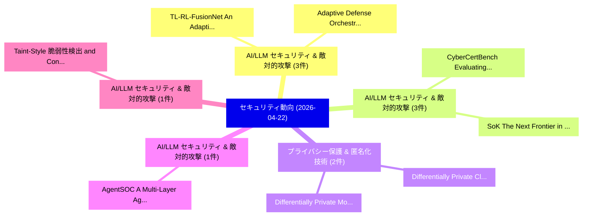

# 📅 02_daily: 日次エグゼクティブサマリー報告書 (2026-04-22)

**集計日時**: 2026-10-02 23:06:06 UTC  
**対象日付**: 2026-04-22  
**本日収集論文数**: 37 件  

---

## 💡 主要セキュリティ動向・脅威インサイト (Executive Insights)

本日の収集論文（計 37 件）において、以下の重点セキュリティ領域で活発な研究動向が確認されました：
- **AI/LLM セキュリティ & 敵対的攻撃** (3 件): 注目論文として 「TL-RL-FusionNet: An Adaptive a...」、「Adaptive Defense Orchestration...」 等が発表され、実務防御および攻撃検証の進展が見られます。
- **AI/LLM セキュリティ & 敵対的攻撃** (3 件): 注目論文として 「CyberCertBench: Evaluating LLM...」、「SoK: The Next Frontier in AV S...」 等が発表され、実務防御および攻撃検証の進展が見られます。
- **プライバシー保護 & 匿名化技術** (2 件): 注目論文として 「Differentially Private Cluster...」、「Differentially Private Model M...」 等が発表され、実務防御および攻撃検証の進展が見られます。
- **AI/LLM セキュリティ & 敵対的攻撃** (1 件): 注目論文として 「AgentSOC: A Multi-Layer Agenti...」 等が発表され、実務防御および攻撃検証の進展が見られます。
- **AI/LLM セキュリティ & 敵対的攻撃** (1 件): 注目論文として 「Taint-Style 脆弱性検出 and Confirma...」 等が発表され、実務防御および攻撃検証の進展が見られます。

### 🗺️ 技術・脅威トピックマインドマップ

---

## 📌 日次セキュリティ論文一覧 (日本語表形式)

| No | arXiv ID | 論文タイトル (日本語訳) | 重要キーワード | 構造化エグゼクティブ要約 (背景・提案・影響) | 脅威分類 | 詳細リンク |
|---|---|---|---|---|---|---|
| 1 | `2604.20134v1` | [AgentSOC: A Multi-Layer Agentic AI Framework for Security Operations Automation（セキュリティ分析論文）](../../okf/papers/2026-04-22/2604.20134.md) | `Security Operations Automation`, `Layer Agentic`, `Multi-Layer Agentic` | 【提案】概要 (Overview & Key Finding) 本論文「AgentSOC: A Multi-Layer Agentic AI Framework for Securi...。実証評価により経営層・セキュリティ管理者向け推奨アクション (E... | `cs.AI` | [arXiv](https://arxiv.org/abs/2604.20134v1) &#124; [OKF](../../okf/papers/2026-04-22/2604.20134.md) |
| 2 | `2604.20179v1` | [Taint-Style 脆弱性検出 and Confirmation for Node.js Packages Using LLM Agent Reasoning](../../okf/papers/2026-04-22/2604.20179.md) | `Packages Using`, `Agent Reasoning`, `Style Vulnerability Detection` | 【提案】概要 (Overview & Key Finding) 本論文「Taint-Style 脆弱性検出 and Confirmation for Node.js Packages...。実証評価により経営層・セキュリティ管理者向け推奨アクション (E... | `cs.AI` | [arXiv](https://arxiv.org/abs/2604.20179v1) &#124; [OKF](../../okf/papers/2026-04-22/2604.20179.md) |
| 3 | `2604.20211v1` | [Secure Logging: Characterizing and Benchmarking Logging Code Security Issues with LLMsに向けて](../../okf/papers/2026-04-22/2604.20211.md) | `Benchmarking Logging Code Security Issues`, `Towards Secure Logging`, `Secure Logging` | 【提案】概要 (Overview & Key Finding) 本論文「Secure Logging: Characterizing and Benchmarking Logging...。実証評価により経営層・セキュリティ管理者向け推奨アクション (E... | `cs.AI` | [arXiv](https://arxiv.org/abs/2604.20211v1) &#124; [OKF](../../okf/papers/2026-04-22/2604.20211.md) |
| 4 | `2604.20245v1` | [Secure Rate-Distortion-Perception: A Randomized Distributed Function Computation Approach for Realism（セキュリティ分析論文）](../../okf/papers/2026-04-22/2604.20245.md) | `Secure Rate`, `Raw Meta`, `Executive Summary` | 【提案】概要 (Overview & Key Finding) 本論文「Secure Rate-Distortion-Perception: A Randomized Distrib...。実証評価により経営層・セキュリティ管理者向け推奨アクション (E... | `cs.CV` | [arXiv](https://arxiv.org/abs/2604.20245v1) &#124; [OKF](../../okf/papers/2026-04-22/2604.20245.md) |
| 5 | `2604.20260v1` | [TL-RL-FusionNet: An Adaptive and Efficient Reinforcement Learning-Driven Transfer Learning Framework for Detecting Evolving Ransomware Threats（セキュリティ分析論文）](../../okf/papers/2026-04-22/2604.20260.md) | `Detecting Evolving Ransomware Threats`, `Efficient Reinforcement Learning`, `Learning-Driven Transfer` | 【提案】概要 (Overview & Key Finding) 本論文「TL-RL-FusionNet: An Adaptive and Efficient Reinforcemen...。実証評価により経営層・セキュリティ管理者向け推奨アクション (E... | `cybersecurity` | [arXiv](https://arxiv.org/abs/2604.20260v1) &#124; [OKF](../../okf/papers/2026-04-22/2604.20260.md) |
| 6 | `2604.20269v2` | [Text Steganography with Dynamic Codebook and Multimodal Large Language Model（セキュリティ分析論文）](../../okf/papers/2026-04-22/2604.20269.md) | `Multimodal Large Language Model`, `Text Steganography`, `Dynamic Codebook` | 【提案】概要 (Overview & Key Finding) 本論文「Text Steganography with Dynamic Codebook and Multimodal...。実証評価により経営層・セキュリティ管理者向け推奨アクション (E... | `cs.AI` | [arXiv](https://arxiv.org/abs/2604.20269v2) &#124; [OKF](../../okf/papers/2026-04-22/2604.20269.md) |
| 7 | `2604.20378v1` | [TLSCheck 2.0: An Enhanced Memory Forensics Approach to Efficiently Detect TLS Callbacks（セキュリティ分析論文）](../../okf/papers/2026-04-22/2604.20378.md) | `Efficiently Detect`, `Raw Meta`, `Executive Summary` | 【提案】概要 (Overview & Key Finding) 本論文「TLSCheck 2.0: An Enhanced Memory Forensics Approach to ...。実証評価により経営層・セキュリティ管理者向け推奨アクション (E... | `cybersecurity` | [arXiv](https://arxiv.org/abs/2604.20378v1) &#124; [OKF](../../okf/papers/2026-04-22/2604.20378.md) |
| 8 | `2604.20389v1` | [CyberCertBench: Evaluating LLMs in サイバーセキュリティ Certification Knowledge](../../okf/papers/2026-04-22/2604.20389.md) | `Cybersecurity Certification Knowledge`, `Certification Knowledge`, `Gustav Keppler` | 【提案】概要 (Overview & Key Finding) 本論文「CyberCertBench: Evaluating LLMs in サイバーセキュリティ Certifica...。実証評価により経営層・セキュリティ管理者向け推奨アクション (E... | `cs.AI` | [arXiv](https://arxiv.org/abs/2604.20389v1) &#124; [OKF](../../okf/papers/2026-04-22/2604.20389.md) |
| 9 | `2604.20401v1` | [Onyx: Cost-Efficient Disk-Oblivious ANN Search（セキュリティ分析論文）](../../okf/papers/2026-04-22/2604.20401.md) | `Efficient Disk`, `Cost-Efficient Disk`, `Zirui Neil Zhao` | 【提案】概要 (Overview & Key Finding) 本論文「Onyx: Cost-Efficient Disk-Oblivious ANN Search（セキュリティ分析...。実証評価によりEdward Suh, Raluca Ada Po... | `cs.AI` | [arXiv](https://arxiv.org/abs/2604.20401v1) &#124; [OKF](../../okf/papers/2026-04-22/2604.20401.md) |
| 10 | `2604.20495v1` | [Certified Malware Detection: Provable Guarantees Against Evasion Attacksに向けて](../../okf/papers/2026-04-22/2604.20495.md) | `Towards Certified Malware Detection`, `Certified Malware Detection`, `Nandakrishna Giri` | 【提案】概要 (Overview & Key Finding) 本論文「Certified マルウェア Detection: Provable Guarantees Against ...。実証評価により経営層・セキュリティ管理者向け推奨アクション (E... | `executive-summary` | [arXiv](https://arxiv.org/abs/2604.20495v1) &#124; [OKF](../../okf/papers/2026-04-22/2604.20495.md) |
| 11 | `2604.20496v1` | [Mythos and the Unverified Cage: Z3-Based Pre-Deployment Verification for Frontier-Model Sandbox Infrastructure（セキュリティ分析論文）](../../okf/papers/2026-04-22/2604.20496.md) | `Model Sandbox Infrastructure`, `Unverified Cage`, `Based Pre` | 【提案】概要 (Overview & Key Finding) 本論文「Mythos and the Unverified Cage: Z3-Based Pre-Deployment...。実証評価により経営層・セキュリティ管理者向け推奨アクション (E... | `cs.AI` | [arXiv](https://arxiv.org/abs/2604.20496v1) &#124; [OKF](../../okf/papers/2026-04-22/2604.20496.md) |
| 12 | `2604.20576v1` | [PVAC: A RowHammer Mitigation Architecture Exploiting Per-victim-row Counting（セキュリティ分析論文）](../../okf/papers/2026-04-22/2604.20576.md) | `Mitigation Architecture Exploiting Per`, `Nam Sung Kim`, `Jung Ho Ahn` | 【提案】概要 (Overview & Key Finding) 本論文「PVAC: A RowHammer Mitigation Architecture Exploiting Pe...。実証評価により経営層・セキュリティ管理者向け推奨アクション (E... | `executive-summary` | [arXiv](https://arxiv.org/abs/2604.20576v1) &#124; [OKF](../../okf/papers/2026-04-22/2604.20576.md) |
| 13 | `2604.20596v1` | [Differentially Private Clustered 連合学習 with Privacy-Preserving Initialization and Normality-Driven Aggregation](../../okf/papers/2026-04-22/2604.20596.md) | `Preserving Initialization`, `Driven Aggregation`, `Privacy-Preserving Initialization` | 【提案】概要 (Overview & Key Finding) 本論文「Differentially Private Clustered 連合学習 with Privacy-Pres...。実証評価により経営層・セキュリティ管理者向け推奨アクション (E... | `executive-summary` | [arXiv](https://arxiv.org/abs/2604.20596v1) &#124; [OKF](../../okf/papers/2026-04-22/2604.20596.md) |
| 14 | `2604.20621v1` | [SoK: The Next Frontier in AV Security: Systematizing Perception Attacks and the Emerging Threat of Multi-Sensor Fusion（セキュリティ分析論文）](../../okf/papers/2026-04-22/2604.20621.md) | `Systematizing Perception Attacks`, `Emerging Threat`, `Sensor Fusion` | 【提案】概要 (Overview & Key Finding) 本論文「SoK: The Next Frontier in AV Security: Systematizing Pe...。実証評価により経営層・セキュリティ管理者向け推奨アクション (E... | `cybersecurity` | [arXiv](https://arxiv.org/abs/2604.20621v1) &#124; [OKF](../../okf/papers/2026-04-22/2604.20621.md) |
| 15 | `2604.20704v1` | [Auto-ART: Structured Literature Synthesis and Automated Adversarial Robustness Testing（セキュリティ分析論文）](../../okf/papers/2026-04-22/2604.20704.md) | `Automated Adversarial Robustness Testing`, `Structured Literature Synthesis`, `Abhijit Talluri` | 【提案】概要 (Overview & Key Finding) 本論文「Auto-ART: Structured Literature Synthesis and Automated...。実証評価により経営層・セキュリティ管理者向け推奨アクション (E... | `executive-summary` | [arXiv](https://arxiv.org/abs/2604.20704v1) &#124; [OKF](../../okf/papers/2026-04-22/2604.20704.md) |
| 16 | `2604.20765v1` | [CVEs With a CVSS Score Greater Than or Equal to 9（セキュリティ分析論文）](../../okf/papers/2026-04-22/2604.20765.md) | `Lena Sinterhauf`, `Roland Kaltefleiter`, `Raw Meta` | 【提案】概要 (Overview & Key Finding) 本論文「CVEs With a CVSS Score Greater Than or Equal to 9（セキュリテ...。実証評価により経営層・セキュリティ管理者向け推奨アクション (E... | `cybersecurity` | [arXiv](https://arxiv.org/abs/2604.20765v1) &#124; [OKF](../../okf/papers/2026-04-22/2604.20765.md) |
| 17 | `2604.20771v1` | [DAIRE: A lightweight AI model for real-time Controller Area Network attacks in the Internet of Vehiclesの検出](../../okf/papers/2026-04-22/2604.20771.md) | `Controller Area Network`, `real-time detection`, `real-time Controller` | 【提案】概要 (Overview & Key Finding) 本論文「DAIRE: A lightweight AI model for real-time Controller ...。実証評価により経営層・セキュリティ管理者向け推奨アクション (E... | `cs.AI` | [arXiv](https://arxiv.org/abs/2604.20771v1) &#124; [OKF](../../okf/papers/2026-04-22/2604.20771.md) |
| 18 | `2604.20793v2` | [Fresh Masking Makes NTT Pipelines Composable: Machine-Checked Proofs for Arithmetic Masking in PQC Hardware（セキュリティ分析論文）](../../okf/papers/2026-04-22/2604.20793.md) | `Fresh Masking Makes`, `Pipelines Composable`, `Checked Proofs` | 【提案】概要 (Overview & Key Finding) 本論文「Fresh Masking Makes NTT Pipelines Composable: Machine-C...。実証評価により経営層・セキュリティ管理者向け推奨アクション (E... | `cybersecurity` | [arXiv](https://arxiv.org/abs/2604.20793v2) &#124; [OKF](../../okf/papers/2026-04-22/2604.20793.md) |
| 19 | `2604.20801v1` | [Synthesizing Multi-Agent Harnesses for Vulnerability Discovery（セキュリティ分析論文）](../../okf/papers/2026-04-22/2604.20801.md) | `Synthesizing Multi`, `Agent Harnesses`, `Vulnerability Discovery` | 【提案】概要 (Overview & Key Finding) 本論文「Synthesizing Multi-Agent Harnesses for 脆弱性 Discovery（セキ...。実証評価により経営層・セキュリティ管理者向け推奨アクション (E... | `arXiv` | [arXiv](https://arxiv.org/abs/2604.20801v1) &#124; [OKF](../../okf/papers/2026-04-22/2604.20801.md) |
| 20 | `2604.20826v1` | [An Attack Vectors Against FIDO2 Authenticationの分析](../../okf/papers/2026-04-22/2604.20826.md) | `Alexander Berladskyy`, `Raw Meta`, `Executive Summary` | 【提案】概要 (Overview & Key Finding) 本論文「An Attack Vectors Against FIDO2 Authenticationの分析」（原題: ...。実証評価により経営層・セキュリティ管理者向け推奨アクション (E... | `arXiv` | [arXiv](https://arxiv.org/abs/2604.20826v1) &#124; [OKF](../../okf/papers/2026-04-22/2604.20826.md) |
| 21 | `2604.20833v2` | [AVISE: Framework for Evaluating the Security of AI Systems（セキュリティ分析論文）](../../okf/papers/2026-04-22/2604.20833.md) | `Mikko Lempinen`, `Joni Kemppainen`, `Niklas Raesalmi` | 【提案】概要 (Overview & Key Finding) 本論文「AVISE: Framework for Evaluating the Security of AI Syst...。実証評価により経営層・セキュリティ管理者向け推奨アクション (E... | `arXiv` | [arXiv](https://arxiv.org/abs/2604.20833v2) &#124; [OKF](../../okf/papers/2026-04-22/2604.20833.md) |
| 22 | `2604.20911v1` | [Omission Constraints Decay While Commission Constraints Persist in Long-Context LLMエージェント](../../okf/papers/2026-04-22/2604.20911.md) | `Long-Context LLM`, `Yeran Gamage`, `Raw Meta` | 【提案】概要 (Overview & Key Finding) 本論文「Omission Constraints Decay While Commission Constraints...。実証評価により経営層・セキュリティ管理者向け推奨アクション (E... | `cs.AI` | [arXiv](https://arxiv.org/abs/2604.20911v1) &#124; [OKF](../../okf/papers/2026-04-22/2604.20911.md) |
| 23 | `2604.20927v1` | [Hidden Secrets in the arXiv: Discovering, Analyzing, and Preventing Unintentional Information Disclosure in Source Files of Scientific Preprints（セキュリティ分析論文）](../../okf/papers/2026-04-22/2604.20927.md) | `Preventing Unintentional Information Disclosure`, `Hidden Secrets`, `Source Files` | 【提案】概要 (Overview & Key Finding) 本論文「Hidden Secrets in the arXiv: Discovering, Analyzing, an...。実証評価により経営層・セキュリティ管理者向け推奨アクション (E... | `cybersecurity` | [arXiv](https://arxiv.org/abs/2604.20927v1) &#124; [OKF](../../okf/papers/2026-04-22/2604.20927.md) |
| 24 | `2604.20930v1` | [SafeRedirect: Defeating Internal Safety Collapse via Task-Completion Redirection in Frontier LLMs（セキュリティ分析論文）](../../okf/papers/2026-04-22/2604.20930.md) | `Defeating Internal Safety Collapse`, `Completion Redirection`, `Task-Completion Redirection` | 【提案】概要 (Overview & Key Finding) 本論文「SafeRedirect: Defeating Internal Safety Collapse via Ta...。実証評価により経営層・セキュリティ管理者向け推奨アクション (E... | `cs.AI` | [arXiv](https://arxiv.org/abs/2604.20930v1) &#124; [OKF](../../okf/papers/2026-04-22/2604.20930.md) |
| 25 | `2604.20932v1` | [Adaptive Defense Orchestration for RAG: A Sentinel-Strategist Architecture against Multi-Vector Attacks（セキュリティ分析論文）](../../okf/papers/2026-04-22/2604.20932.md) | `Adaptive Defense Orchestration`, `Strategist Architecture`, `Vector Attacks` | 【提案】概要 (Overview & Key Finding) 本論文「Adaptive Defense Orchestration for RAG: A Sentinel-Stra...。実証評価により経営層・セキュリティ管理者向け推奨アクション (E... | `cs.AI` | [arXiv](https://arxiv.org/abs/2604.20932v1) &#124; [OKF](../../okf/papers/2026-04-22/2604.20932.md) |
| 26 | `2604.20934v1` | [SDNGuardStack: An Explainable Ensemble Learning Framework for High-Accuracy Intrusion Detection in Software-Defined Networks（セキュリティ分析論文）](../../okf/papers/2026-04-22/2604.20934.md) | `Accuracy Intrusion Detection`, `Defined Networks`, `High-Accuracy Intrusion` | 【提案】概要 (Overview & Key Finding) 本論文「SDNGuardStack: An Explainable Ensemble Learning Framewo...。実証評価により経営層・セキュリティ管理者向け推奨アクション (E... | `executive-summary` | [arXiv](https://arxiv.org/abs/2604.20934v1) &#124; [OKF](../../okf/papers/2026-04-22/2604.20934.md) |
| 27 | `2604.20945v1` | [Breaking Bad: Interpretability-Based Safety Audits of State-of-the-Art LLMs（セキュリティ分析論文）](../../okf/papers/2026-04-22/2604.20945.md) | `Based Safety Audits`, `Breaking Bad`, `Interpretability-Based Safety` | 【提案】背景とセキュリティ上の課題 (Background & Problem) 本研究はサイバー脅威環境におけるセキュリティ構造・脆弱性の検証を目的としています。(主要検出項目: ...。実証評価により経営層・セキュリティ管理者向け推奨アクション (E... | `executive-summary` | [arXiv](https://arxiv.org/abs/2604.20945v1) &#124; [OKF](../../okf/papers/2026-04-22/2604.20945.md) |
| 28 | `2604.20985v2` | [Differentially Private Model Merging（セキュリティ分析論文）](../../okf/papers/2026-04-22/2604.20985.md) | `Differentially Private Model Merging`, `Qichuan Yin`, `Manzil Zaheer` | 【提案】概要 (Overview & Key Finding) 本論文「Differentially Private Model Merging（セキュリティ分析論文）」（原題: D...。実証評価により経営層・セキュリティ管理者向け推奨アクション (E... | `arXiv` | [arXiv](https://arxiv.org/abs/2604.20985v2) &#124; [OKF](../../okf/papers/2026-04-22/2604.20985.md) |
| 29 | `2604.20994v1` | [Breaking MCP with Function Hijacking Attacks: Novel Threats for Function Calling and Agentic Models（セキュリティ分析論文）](../../okf/papers/2026-04-22/2604.20994.md) | `Function Hijacking Attacks`, `Function Calling`, `Agentic Models` | 【提案】概要 (Overview & Key Finding) 本論文「Breaking MCP with Function Hijacking Attacks: Novel Thr...。実証評価により経営層・セキュリティ管理者向け推奨アクション (E... | `arXiv` | [arXiv](https://arxiv.org/abs/2604.20994v1) &#124; [OKF](../../okf/papers/2026-04-22/2604.20994.md) |
| 30 | `2604.21001v1` | [VRSafe: A Secure Virtual Keyboard to Mitigate Keystroke Inference in Virtual Reality（セキュリティ分析論文）](../../okf/papers/2026-04-22/2604.21001.md) | `Secure Virtual Keyboard`, `Mitigate Keystroke Inference`, `Virtual Reality` | 【提案】概要 (Overview & Key Finding) 本論文「VRSafe: A Secure Virtual Keyboard to Mitigate Keystroke...。実証評価により経営層・セキュリティ管理者向け推奨アクション (E... | `arXiv` | [arXiv](https://arxiv.org/abs/2604.21001v1) &#124; [OKF](../../okf/papers/2026-04-22/2604.21001.md) |
| 31 | `2604.21051v2` | [Residual Risk Assessment in Benign Code: How Far Are We? A Multi-Model Semantic and Structural Similarity Approach（セキュリティ分析論文）](../../okf/papers/2026-04-22/2604.21051.md) | `Residual Risk Assessment`, `Benign Code`, `Model Semantic` | 【提案】A Multi-Model Semantic and Structural Similarity Approach ### (日本語題名: Residual Risk Ass...。実証評価により経営層・セキュリティ管理者向け推奨アクション (E... | `arXiv` | [arXiv](https://arxiv.org/abs/2604.21051v2) &#124; [OKF](../../okf/papers/2026-04-22/2604.21051.md) |
| 32 | `2604.21055v1` | [Layer 2 Blockchains Simplified: A Survey of Vector Commitment Schemes, ZKP Frameworks, Layer-2 Data Structures and Verkle Trees（セキュリティ分析論文）](../../okf/papers/2026-04-22/2604.21055.md) | `Vector Commitment Schemes`, `Blockchains Simplified`, `Data Structures` | 【提案】概要 (Overview & Key Finding) 本論文「Layer 2 Blockchains Simplified: A Survey of Vector Comm...。実証評価により経営層・セキュリティ管理者向け推奨アクション (E... | `arXiv` | [arXiv](https://arxiv.org/abs/2604.21055v1) &#124; [OKF](../../okf/papers/2026-04-22/2604.21055.md) |
| 33 | `2604.21083v1` | [Behavioral Consistency and Transparency Analysis on Large Language Model API Gateways（セキュリティ分析論文）](../../okf/papers/2026-04-22/2604.21083.md) | `Large Language Model`, `Behavioral Consistency`, `Guanjie Lin` | 【提案】概要 (Overview & Key Finding) 本論文「Behavioral Consistency and Transparency Analysis on Lar...。実証評価により経営層・セキュリティ管理者向け推奨アクション (E... | `arXiv` | [arXiv](https://arxiv.org/abs/2604.21083v1) &#124; [OKF](../../okf/papers/2026-04-22/2604.21083.md) |
| 34 | `2604.21111v1` | [A Ground-Truth-Based Evaluation of 脆弱性検出 Across Multiple Ecosystems](../../okf/papers/2026-04-22/2604.21111.md) | `Vulnerability Detection Across Multiple Ecosystems`, `Across Multiple Ecosystems`, `Peter Mandl` | 【提案】概要 (Overview & Key Finding) 本論文「A Ground-Truth-Based Evaluation of 脆弱性検出 Across Multipl...。実証評価により経営層・セキュリティ管理者向け推奨アクション (E... | `arXiv` | [arXiv](https://arxiv.org/abs/2604.21111v1) &#124; [OKF](../../okf/papers/2026-04-22/2604.21111.md) |
| 35 | `2604.21131v1` | [Cross-Session Threats in AI Agents: Benchmark, Evaluation, and Algorithms（セキュリティ分析論文）](../../okf/papers/2026-04-22/2604.21131.md) | `Session Threats`, `Cross-Session Threats`, `Ari Azarafrooz` | 【提案】概要 (Overview & Key Finding) 本論文「Cross-Session Threats in AI Agents: Benchmark, Evaluati...。実証評価により経営層・セキュリティ管理者向け推奨アクション (E... | `arXiv` | [arXiv](https://arxiv.org/abs/2604.21131v1) &#124; [OKF](../../okf/papers/2026-04-22/2604.21131.md) |
| 36 | `2604.21153v1` | [Image-Based Malware Type Classification on MalNet-Image Tiny: Effects of Multi-Scale Fusion, Transfer Learning, Data Augmentation, and Schedule-Free Optimization（セキュリティ分析論文）](../../okf/papers/2026-04-22/2604.21153.md) | `Based Malware Type Classification`, `Image Tiny`, `Scale Fusion` | 【提案】概要 (Overview & Key Finding) 本論文「Image-Based マルウェア Type Classification on MalNet-Image T...。実証評価により経営層・セキュリティ管理者向け推奨アクション (E... | `arXiv` | [arXiv](https://arxiv.org/abs/2604.21153v1) &#124; [OKF](../../okf/papers/2026-04-22/2604.21153.md) |
| 37 | `2604.21159v1` | [Adaptive Instruction Composition for Automated LLM Red-Teaming（セキュリティ分析論文）](../../okf/papers/2026-04-22/2604.21159.md) | `Adaptive Instruction Composition`, `Jesse Zymet`, `Andy Luo` | 【提案】概要 (Overview & Key Finding) 本論文「Adaptive Instruction Composition for Automated LLM Red-...。実証評価により経営層・セキュリティ管理者向け推奨アクション (E... | `arXiv` | [arXiv](https://arxiv.org/abs/2604.21159v1) &#124; [OKF](../../okf/papers/2026-04-22/2604.21159.md) |

