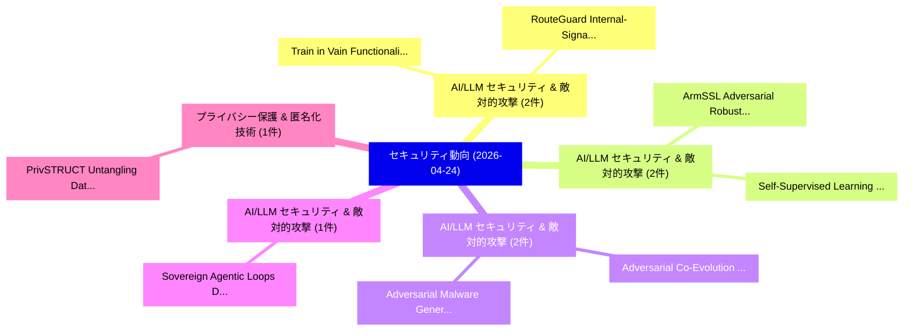

# 📅 02_daily: 日次エグゼクティブサマリー報告書 (2026-04-24)

**集計日時**: 2026-10-02 23:06:06 UTC  
**対象日付**: 2026-04-24  
**本日収集論文数**: 25 件  

---

## 💡 主要セキュリティ動向・脅威インサイト (Executive Insights)

本日の収集論文（計 25 件）において、以下の重点セキュリティ領域で活発な研究動向が確認されました：
- **AI/LLM セキュリティ & 敵対的攻撃** (2 件): 注目論文として 「Train in Vain: Functionality-P...」、「RouteGuard: Internal-Signal Sk...」 等が発表され、実務防御および攻撃検証の進展が見られます。
- **AI/LLM セキュリティ & 敵対的攻撃** (2 件): 注目論文として 「ArmSSL: Adversarial Robust Bla...」、「Self-Supervised Learning for A...」 等が発表され、実務防御および攻撃検証の進展が見られます。
- **AI/LLM セキュリティ & 敵対的攻撃** (2 件): 注目論文として 「Adversarial Co-Evolution of Ma...」、「Adversarial Malware Generation...」 等が発表され、実務防御および攻撃検証の進展が見られます。
- **AI/LLM セキュリティ & 敵対的攻撃** (1 件): 注目論文として 「Sovereign Agentic Loops: Decou...」 等が発表され、実務防御および攻撃検証の進展が見られます。
- **プライバシー保護 & 匿名化技術** (1 件): 注目論文として 「PrivSTRUCT: Untangling Data Pu...」 等が発表され、実務防御および攻撃検証の進展が見られます。

### 🗺️ 技術・脅威トピックマインドマップ

---

## 📌 日次セキュリティ論文一覧 (日本語表形式)

| No | arXiv ID | 論文タイトル (日本語訳) | 重要キーワード | 構造化エグゼクティブ要約 (背景・提案・影響) | 脅威分類 | 詳細リンク |
|---|---|---|---|---|---|---|
| 1 | `2604.22136v1` | [Sovereign Agentic Loops: Decoupling AI Reasoning from Execution in Real-World Systems（セキュリティ分析論文）](../../okf/papers/2026-04-24/2604.22136.md) | `Sovereign Agentic Loops`, `World Systems`, `Real-World Systems` | 【提案】概要 (Overview & Key Finding) 本論文「Sovereign Agentic Loops: Decoupling AI Reasoning from E...。実証評価により経営層・セキュリティ管理者向け推奨アクション (E... | `arXiv` | [arXiv](https://arxiv.org/abs/2604.22136v1) &#124; [OKF](../../okf/papers/2026-04-24/2604.22136.md) |
| 2 | `2604.22157v1` | [PrivSTRUCT: Untangling Data Purpose Compliance of Privacy Policies in Google Play Store（セキュリティ分析論文）](../../okf/papers/2026-04-24/2604.22157.md) | `Untangling Data Purpose Compliance`, `Google Play Store`, `Privacy Policies` | 【提案】概要 (Overview & Key Finding) 本論文「PrivSTRUCT: Untangling Data Purpose Compliance of Priva...。実証評価により経営層・セキュリティ管理者向け推奨アクション (E... | `arXiv` | [arXiv](https://arxiv.org/abs/2604.22157v1) &#124; [OKF](../../okf/papers/2026-04-24/2604.22157.md) |
| 3 | `2604.22176v1` | [FixV2W: Correcting Invalid CVE-CWE Mappings with Knowledge Graph Embeddings（セキュリティ分析論文）](../../okf/papers/2026-04-24/2604.22176.md) | `Knowledge Graph Embeddings`, `Correcting Invalid`, `CVE-CWE Mappings` | 【提案】概要 (Overview & Key Finding) 本論文「FixV2W: Correcting Invalid CVE-CWE Mappings with Knowle...。実証評価により経営層・セキュリティ管理者向け推奨アクション (E... | `arXiv` | [arXiv](https://arxiv.org/abs/2604.22176v1) &#124; [OKF](../../okf/papers/2026-04-24/2604.22176.md) |
| 4 | `2604.22191v2` | [Behavioral Canaries: Auditing Private Retrieved Context Usage in RL Fine-Tuning（セキュリティ分析論文）](../../okf/papers/2026-04-24/2604.22191.md) | `Auditing Private Retrieved Context Usage`, `Behavioral Canaries`, `Chaoran Chen` | 【提案】概要 (Overview & Key Finding) 本論文「Behavioral Canaries: Auditing Private Retrieved Context...。実証評価により経営層・セキュリティ管理者向け推奨アクション (E... | `arXiv` | [arXiv](https://arxiv.org/abs/2604.22191v2) &#124; [OKF](../../okf/papers/2026-04-24/2604.22191.md) |
| 5 | `2604.22291v1` | [Train in Vain: Functionality-Preserving Poisoning to Prevent Unauthorized Use of Code Datasets（セキュリティ分析論文）](../../okf/papers/2026-04-24/2604.22291.md) | `Prevent Unauthorized Use`, `Preserving Poisoning`, `Code Datasets` | 【提案】概要 (Overview & Key Finding) 本論文「Train in Vain: Functionality-Preserving Poisoning to Pr...。実証評価により経営層・セキュリティ管理者向け推奨アクション (E... | `arXiv` | [arXiv](https://arxiv.org/abs/2604.22291v1) &#124; [OKF](../../okf/papers/2026-04-24/2604.22291.md) |
| 6 | `2604.22304v1` | [Resource-Aware Layered Intrusion Detection Allocation Model（セキュリティ分析論文）](../../okf/papers/2026-04-24/2604.22304.md) | `Aware Layered Intrusion Detection Allocation Model`, `Resource-Aware Layered`, `Raw Meta` | 【提案】概要 (Overview & Key Finding) 本論文「Resource-Aware Layered Intrusion Detection Allocation M...。実証評価により経営層・セキュリティ管理者向け推奨アクション (E... | `arXiv` | [arXiv](https://arxiv.org/abs/2604.22304v1) &#124; [OKF](../../okf/papers/2026-04-24/2604.22304.md) |
| 7 | `2604.22307v1` | [Introducing the Cyber-Physical Data Flow Diagram to Improve Threat Modelling of Internet of Things Devices（セキュリティ分析論文）](../../okf/papers/2026-04-24/2604.22307.md) | `Physical Data Flow Diagram`, `Improve Threat Modelling`, `Cyber-Physical Data` | 【提案】概要 (Overview & Key Finding) 本論文「Introducing the Cyber-Physical Data Flow Diagram to Imp...。実証評価により経営層・セキュリティ管理者向け推奨アクション (E... | `arXiv` | [arXiv](https://arxiv.org/abs/2604.22307v1) &#124; [OKF](../../okf/papers/2026-04-24/2604.22307.md) |
| 8 | `2604.22427v1` | [Automation-Exploit: A Multi-Agent LLM Framework for Adaptive Offensive Security with Digital Twin-Based Risk-Mitigated Exploitation（セキュリティ分析論文）](../../okf/papers/2026-04-24/2604.22427.md) | `Adaptive Offensive Security`, `Digital Twin`, `Based Risk` | 【提案】概要 (Overview & Key Finding) 本論文「Automation-エクスプロイト: A Multi-Agent LLM Framework for Ada...。実証評価により経営層・セキュリティ管理者向け推奨アクション (E... | `arXiv` | [arXiv](https://arxiv.org/abs/2604.22427v1) &#124; [OKF](../../okf/papers/2026-04-24/2604.22427.md) |
| 9 | `2604.22429v1` | [Horizontal SCA Attacks on Binary kP Algorithms using Chevallier-Mames Atomic Blocks（セキュリティ分析論文）](../../okf/papers/2026-04-24/2604.22429.md) | `Mames Atomic Blocks`, `Chevallier-Mames Atomic`, `Gerald Isheanesu Matungamire` | 【提案】概要 (Overview & Key Finding) 本論文「Horizontal SCA Attacks on Binary kP Algorithms using Ch...。実証評価により経営層・セキュリティ管理者向け推奨アクション (E... | `arXiv` | [arXiv](https://arxiv.org/abs/2604.22429v1) &#124; [OKF](../../okf/papers/2026-04-24/2604.22429.md) |
| 10 | `2604.22438v1` | [SSG: Logit-Balanced Vocabulary Partitioning for LLM Watermarking（セキュリティ分析論文）](../../okf/papers/2026-04-24/2604.22438.md) | `Balanced Vocabulary Partitioning`, `Logit-Balanced Vocabulary`, `Chenxi Gu` | 【提案】概要 (Overview & Key Finding) 本論文「SSG: Logit-Balanced Vocabulary Partitioning for LLM Wat...。実証評価により経営層・セキュリティ管理者向け推奨アクション (E... | `arXiv` | [arXiv](https://arxiv.org/abs/2604.22438v1) &#124; [OKF](../../okf/papers/2026-04-24/2604.22438.md) |
| 11 | `2604.22505v1` | [Information-Theoretic Authenticated PIR: From PIR-RV To APIR（セキュリティ分析論文）](../../okf/papers/2026-04-24/2604.22505.md) | `Theoretic Authenticated`, `Information-Theoretic Authenticated`, `Liang Feng Zhang` | 【提案】概要 (Overview & Key Finding) 本論文「Information-Theoretic Authenticated PIR: From PIR-RV To...。実証評価により経営層・セキュリティ管理者向け推奨アクション (E... | `arXiv` | [arXiv](https://arxiv.org/abs/2604.22505v1) &#124; [OKF](../../okf/papers/2026-04-24/2604.22505.md) |
| 12 | `2604.22550v1` | [ArmSSL: Adversarial Robust Black-Box Watermarking for Self-Supervised Learning Pre-trained Encoders（セキュリティ分析論文）](../../okf/papers/2026-04-24/2604.22550.md) | `Adversarial Robust Black`, `Supervised Learning Pre`, `Box Watermarking` | 【提案】概要 (Overview & Key Finding) 本論文「ArmSSL: Adversarial Robust Black-Box Watermarking for S...。実証評価により経営層・セキュリティ管理者向け推奨アクション (E... | `arXiv` | [arXiv](https://arxiv.org/abs/2604.22550v1) &#124; [OKF](../../okf/papers/2026-04-24/2604.22550.md) |
| 13 | `2604.22569v1` | [Adversarial Co-Evolution of Malware and Detection Models: A Bilevel Optimization Perspective（セキュリティ分析論文）](../../okf/papers/2026-04-24/2604.22569.md) | `Bilevel Optimization Perspective`, `Adversarial Co`, `Detection Models` | 【提案】概要 (Overview & Key Finding) 本論文「Adversarial Co-Evolution of マルウェア and Detection Models:...。実証評価により経営層・セキュリティ管理者向け推奨アクション (E... | `arXiv` | [arXiv](https://arxiv.org/abs/2604.22569v1) &#124; [OKF](../../okf/papers/2026-04-24/2604.22569.md) |
| 14 | `2604.22602v1` | [PASS: A Provenanced Access Subaccount System for Blockchain Wallets（セキュリティ分析論文）](../../okf/papers/2026-04-24/2604.22602.md) | `Provenanced Access Subaccount System`, `Blockchain Wallets`, `Jay Yu` | 【提案】概要 (Overview & Key Finding) 本論文「PASS: A Provenanced Access Subaccount System for Blockc...。実証評価により経営層・セキュリティ管理者向け推奨アクション (E... | `arXiv` | [arXiv](https://arxiv.org/abs/2604.22602v1) &#124; [OKF](../../okf/papers/2026-04-24/2604.22602.md) |
| 15 | `2604.22629v1` | [Detecting Concept Drift in Evolving Malware Families Using Rule-Based Classifier Representations（セキュリティ分析論文）](../../okf/papers/2026-04-24/2604.22629.md) | `Evolving Malware Families Using Rule`, `Detecting Concept Drift`, `Based Classifier Representations` | 【提案】概要 (Overview & Key Finding) 本論文「Detecting Concept Drift in Evolving マルウェア Families Usin...。実証評価により経営層・セキュリティ管理者向け推奨アクション (E... | `arXiv` | [arXiv](https://arxiv.org/abs/2604.22629v1) &#124; [OKF](../../okf/papers/2026-04-24/2604.22629.md) |
| 16 | `2604.22639v1` | [Adversarial Malware Generation in Linux ELF Binaries via Semantic-Preserving Transformations（セキュリティ分析論文）](../../okf/papers/2026-04-24/2604.22639.md) | `Adversarial Malware Generation`, `Preserving Transformations`, `Semantic-Preserving Transformations` | 【提案】概要 (Overview & Key Finding) 本論文「Adversarial マルウェア Generation in Linux ELF Binaries via ...。実証評価により経営層・セキュリティ管理者向け推奨アクション (E... | `arXiv` | [arXiv](https://arxiv.org/abs/2604.22639v1) &#124; [OKF](../../okf/papers/2026-04-24/2604.22639.md) |
| 17 | `2604.22879v1` | [Beyond Single-Agent Alignment: Preventing Context-Fragmented Violations in Multi-Agent Systems（セキュリティ分析論文）](../../okf/papers/2026-04-24/2604.22879.md) | `Beyond Single`, `Agent Alignment`, `Single-Agent Alignment` | 【提案】概要 (Overview & Key Finding) 本論文「Beyond Single-Agent Alignment: Preventing Context-Fragm...。実証評価により経営層・セキュリティ管理者向け推奨アクション (E... | `arXiv` | [arXiv](https://arxiv.org/abs/2604.22879v1) &#124; [OKF](../../okf/papers/2026-04-24/2604.22879.md) |
| 18 | `2604.22888v1` | [RouteGuard: Internal-Signal Skill Poisoning in LLM Agentsの検出](../../okf/papers/2026-04-24/2604.22888.md) | `Signal Skill Poisoning`, `Signal Detection`, `Skill Poisoning` | 【提案】概要 (Overview & Key Finding) 本論文「RouteGuard: Internal-Signal Skill Poisoning in LLM Agen...。実証評価により経営層・セキュリティ管理者向け推奨アクション (E... | `arXiv` | [arXiv](https://arxiv.org/abs/2604.22888v1) &#124; [OKF](../../okf/papers/2026-04-24/2604.22888.md) |
| 19 | `2604.22898v1` | [Reconstructive Authority Model: Runtime Execution Validity Under Partial Observability（セキュリティ分析論文）](../../okf/papers/2026-04-24/2604.22898.md) | `Reconstructive Authority Model`, `Marcelo Fernandez`, `Raw Meta` | 【提案】概要 (Overview & Key Finding) 本論文「Reconstructive Authority Model: Runtime Execution Valid...。実証評価により経営層・セキュリティ管理者向け推奨アクション (E... | `arXiv` | [arXiv](https://arxiv.org/abs/2604.22898v1) &#124; [OKF](../../okf/papers/2026-04-24/2604.22898.md) |
| 20 | `2604.22900v2` | [Module Lattice Security (Part II): Module Lattice Reduction via Optimal Sign Selection（セキュリティ分析論文）](../../okf/papers/2026-04-24/2604.22900.md) | `Module Lattice Security`, `Module Lattice Reduction`, `Optimal Sign Selection` | 【提案】概要 (Overview & Key Finding) 本論文「Module Lattice Security (Part II): Module Lattice Reduc...。実証評価により経営層・セキュリティ管理者向け推奨アクション (E... | `arXiv` | [arXiv](https://arxiv.org/abs/2604.22900v2) &#124; [OKF](../../okf/papers/2026-04-24/2604.22900.md) |
| 21 | `2604.22935v1` | [Secure eFPGA-Enabled Edge LLM Inference: Architectural and Hardware Countermeasures（セキュリティ分析論文）](../../okf/papers/2026-04-24/2604.22935.md) | `Enabled Edge`, `eFPGA-Enabled Edge`, `Hardware Countermeasures` | 【提案】概要 (Overview & Key Finding) 本論文「Secure eFPGA-Enabled Edge LLM Inference: Architectural ...。実証評価により経営層・セキュリティ管理者向け推奨アクション (E... | `arXiv` | [arXiv](https://arxiv.org/abs/2604.22935v1) &#124; [OKF](../../okf/papers/2026-04-24/2604.22935.md) |
| 22 | `2604.23016v1` | [DeepSignature: Digitally Signed, Content-Encoding Watermarks for Robust and Transparent Image Authentication（セキュリティ分析論文）](../../okf/papers/2026-04-24/2604.23016.md) | `Transparent Image Authentication`, `Digitally Signed`, `Encoding Watermarks` | 【提案】概要 (Overview & Key Finding) 本論文「DeepSignature: Digitally Signed, Content-Encoding Water...。実証評価により経営層・セキュリティ管理者向け推奨アクション (E... | `arXiv` | [arXiv](https://arxiv.org/abs/2604.23016v1) &#124; [OKF](../../okf/papers/2026-04-24/2604.23016.md) |
| 23 | `2604.23025v2` | [Self-Supervised Learning for Android マルウェア検出 on a Time-Stamped Dataset](../../okf/papers/2026-04-24/2604.23025.md) | `Supervised Learning`, `Stamped Dataset`, `Self-Supervised Learning` | 【提案】概要 (Overview & Key Finding) 本論文「Self-Supervised Learning for Android マルウェア検出 on a Time-...。実証評価により経営層・セキュリティ管理者向け推奨アクション (E... | `arXiv` | [arXiv](https://arxiv.org/abs/2604.23025v2) &#124; [OKF](../../okf/papers/2026-04-24/2604.23025.md) |
| 24 | `2604.23058v1` | [The Security Cost of Intelligence: AI Capability, Cyber Risk, and Deployment Paradox（セキュリティ分析論文）](../../okf/papers/2026-04-24/2604.23058.md) | `Cyber Risk`, `Deployment Paradox`, `Sukwoong Choi` | 【提案】概要 (Overview & Key Finding) 本論文「The Security Cost of Intelligence: AI Capability, Cyber...。実証評価により経営層・セキュリティ管理者向け推奨アクション (E... | `arXiv` | [arXiv](https://arxiv.org/abs/2604.23058v1) &#124; [OKF](../../okf/papers/2026-04-24/2604.23058.md) |
| 25 | `2604.23067v1` | [Training a General Purpose Automated Red Teaming Model（セキュリティ分析論文）](../../okf/papers/2026-04-24/2604.23067.md) | `General Purpose Automated Red Teaming Model`, `Aishwarya Padmakumar`, `Leon Derczynski` | 【提案】概要 (Overview & Key Finding) 本論文「Training a General Purpose Automated Red Teaming Model（...。実証評価により経営層・セキュリティ管理者向け推奨アクション (E... | `arXiv` | [arXiv](https://arxiv.org/abs/2604.23067v1) &#124; [OKF](../../okf/papers/2026-04-24/2604.23067.md) |

