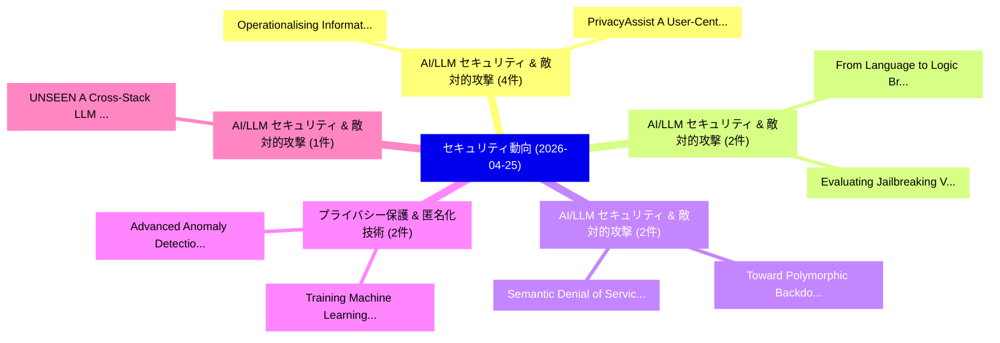

# 📅 02_daily: 日次エグゼクティブサマリー報告書 (2026-04-25)

**集計日時**: 2026-10-02 23:06:06 UTC  
**対象日付**: 2026-04-25  
**本日収集論文数**: 22 件  

---

## 💡 主要セキュリティ動向・脅威インサイト (Executive Insights)

本日の収集論文（計 22 件）において、以下の重点セキュリティ領域で活発な研究動向が確認されました：
- **AI/LLM セキュリティ & 敵対的攻撃** (4 件): 注目論文として 「Operationalising Information S...」、「PrivacyAssist: A User-Centric ...」 等が発表され、実務防御および攻撃検証の進展が見られます。
- **AI/LLM セキュリティ & 敵対的攻撃** (2 件): 注目論文として 「From Language to Logic: Bridgi...」、「Evaluating Jailbreaking Vulner...」 等が発表され、実務防御および攻撃検証の進展が見られます。
- **AI/LLM セキュリティ & 敵対的攻撃** (2 件): 注目論文として 「Toward Polymorphic Backdoor ag...」、「Semantic Denial of Service in ...」 等が発表され、実務防御および攻撃検証の進展が見られます。
- **プライバシー保護 & 匿名化技術** (2 件): 注目論文として 「Training Machine Learning Mode...」、「Advanced Anomaly Detection and...」 等が発表され、実務防御および攻撃検証の進展が見られます。
- **AI/LLM セキュリティ & 敵対的攻撃** (1 件): 注目論文として 「UNSEEN: A Cross-Stack LLM Unle...」 等が発表され、実務防御および攻撃検証の進展が見られます。

### 🗺️ 技術・脅威トピックマインドマップ

---

## 📌 日次セキュリティ論文一覧 (日本語表形式)

| No | arXiv ID | 論文タイトル (日本語訳) | 重要キーワード | 構造化エグゼクティブ要約 (背景・提案・影響) | 脅威分類 | 詳細リンク |
|---|---|---|---|---|---|---|
| 1 | `2604.23100v1` | [From Language to Logic: Bridging LLMs & Formal Representations for RTL Assertion Generation（セキュリティ分析論文）](../../okf/papers/2026-04-25/2604.23100.md) | `Formal Representations`, `Assertion Generation`, `Nowfel Mashnoor` | 【提案】概要 (Overview & Key Finding) 本論文「From Language to Logic: Bridging LLMs & Formal Represen...。実証評価により経営層・セキュリティ管理者向け推奨アクション (E... | `arXiv` | [arXiv](https://arxiv.org/abs/2604.23100v1) &#124; [OKF](../../okf/papers/2026-04-25/2604.23100.md) |
| 2 | `2604.23141v1` | [UNSEEN: A Cross-Stack LLM Unlearning Defense against AR-LLM Social Engineering Attacks（セキュリティ分析論文）](../../okf/papers/2026-04-25/2604.23141.md) | `Social Engineering Attacks`, `Unlearning Defense`, `Cross-Stack LLM` | 【提案】概要 (Overview & Key Finding) 本論文「UNSEEN: A Cross-Stack LLM Unlearning Defense against AR...。実証評価により経営層・セキュリティ管理者向け推奨アクション (E... | `arXiv` | [arXiv](https://arxiv.org/abs/2604.23141v1) &#124; [OKF](../../okf/papers/2026-04-25/2604.23141.md) |
| 3 | `2604.23170v1` | [Core Logic and Algorithmic Performance Enhancements for a System Vulnerability Analysis Technique for Complex Mission Critical Systems Implementation（セキュリティ分析論文）](../../okf/papers/2026-04-25/2604.23170.md) | `Complex Mission Critical Systems Implementation`, `Algorithmic Performance Enhancements`, `Core Logic` | 【提案】概要 (Overview & Key Finding) 本論文「Core Logic and Algorithmic Performance Enhancements for...。実証評価により経営層・セキュリティ管理者向け推奨アクション (E... | `arXiv` | [arXiv](https://arxiv.org/abs/2604.23170v1) &#124; [OKF](../../okf/papers/2026-04-25/2604.23170.md) |
| 4 | `2604.23196v1` | [AsmRAG: LLM-Driven マルウェア検出 by Retrieving Functionally Similar Assembly Code](../../okf/papers/2026-04-25/2604.23196.md) | `Retrieving Functionally Similar Assembly Code`, `Driven Malware Detection`, `LLM-Driven Malware` | 【提案】概要 (Overview & Key Finding) 本論文「AsmRAG: LLM-Driven マルウェア検出 by Retrieving Functionally S...。実証評価により経営層・セキュリティ管理者向け推奨アクション (E... | `arXiv` | [arXiv](https://arxiv.org/abs/2604.23196v1) &#124; [OKF](../../okf/papers/2026-04-25/2604.23196.md) |
| 5 | `2604.23205v1` | [Tessera: Secure, Near-Line-Rate Weight Streaming for UMA Edge Accelerators（セキュリティ分析論文）](../../okf/papers/2026-04-25/2604.23205.md) | `Rate Weight Streaming`, `Edge Accelerators`, `Animan Naskar` | 【提案】概要 (Overview & Key Finding) 本論文「Tessera: Secure, Near-Line-Rate Weight Streaming for UM...。実証評価により経営層・セキュリティ管理者向け推奨アクション (E... | `arXiv` | [arXiv](https://arxiv.org/abs/2604.23205v1) &#124; [OKF](../../okf/papers/2026-04-25/2604.23205.md) |
| 6 | `2604.23230v1` | [Operationalising Information Security Management: A Procedural Framework ISO/IEC 27001:2022 Implementation in a Financial-Technology Organisationの分析](../../okf/papers/2026-04-25/2604.23230.md) | `Operationalising Information Security Management`, `Technology Organisation`, `Financial-Technology Organisation` | 【提案】概要 (Overview & Key Finding) 本論文「Operationalising Information Security Management: A Pro...。実証評価により経営層・セキュリティ管理者向け推奨アクション (E... | `arXiv` | [arXiv](https://arxiv.org/abs/2604.23230v1) &#124; [OKF](../../okf/papers/2026-04-25/2604.23230.md) |
| 7 | `2604.23231v1` | [Toward Polymorphic Backdoor against Semantic Communication via Intensity-Based Poisoning（セキュリティ分析論文）](../../okf/papers/2026-04-25/2604.23231.md) | `Toward Polymorphic Backdoor`, `Semantic Communication`, `Based Poisoning` | 【提案】概要 (Overview & Key Finding) 本論文「Toward Polymorphic Backdoor against Semantic Communicat...。実証評価により経営層・セキュリティ管理者向け推奨アクション (E... | `arXiv` | [arXiv](https://arxiv.org/abs/2604.23231v1) &#124; [OKF](../../okf/papers/2026-04-25/2604.23231.md) |
| 8 | `2604.23238v2` | [Hiding in Plain Sight: Detectability-Aware Antidistillation of Reasoning Models（セキュリティ分析論文）](../../okf/papers/2026-04-25/2604.23238.md) | `Plain Sight`, `Aware Antidistillation`, `Detectability-Aware Antidistillation` | 【提案】概要 (Overview & Key Finding) 本論文「Hiding in Plain Sight: Detectability-Aware Antidistilla...。実証評価により経営層・セキュリティ管理者向け推奨アクション (E... | `arXiv` | [arXiv](https://arxiv.org/abs/2604.23238v2) &#124; [OKF](../../okf/papers/2026-04-25/2604.23238.md) |
| 9 | `2604.23245v1` | [Training Machine Learning Models on Encrypted Data: A Privacy-Preserving Framework using Homomorphic Encryption（セキュリティ分析論文）](../../okf/papers/2026-04-25/2604.23245.md) | `Training Machine Learning Models`, `Encrypted Data`, `Homomorphic Encryption` | 【提案】概要 (Overview & Key Finding) 本論文「Training Machine Learning Models on Encrypted Data: A P...。実証評価により経営層・セキュリティ管理者向け推奨アクション (E... | `arXiv` | [arXiv](https://arxiv.org/abs/2604.23245v1) &#124; [OKF](../../okf/papers/2026-04-25/2604.23245.md) |
| 10 | `2604.23248v1` | [PrivacyAssist: A User-Centric Agent Framework for Detecting Privacy Inconsistencies in Android Apps（セキュリティ分析論文）](../../okf/papers/2026-04-25/2604.23248.md) | `Detecting Privacy Inconsistencies`, `User-Centric Agent`, `Android Apps` | 【提案】概要 (Overview & Key Finding) 本論文「PrivacyAssist: A User-Centric Agent Framework for Detec...。実証評価により経営層・セキュリティ管理者向け推奨アクション (E... | `arXiv` | [arXiv](https://arxiv.org/abs/2604.23248v1) &#124; [OKF](../../okf/papers/2026-04-25/2604.23248.md) |
| 11 | `2604.23280v1` | [AI Identity: Standards, Gaps, and Research Directions for AI Agents（セキュリティ分析論文）](../../okf/papers/2026-04-25/2604.23280.md) | `Research Directions`, `Takumi Otsuka`, `Kentaroh Toyoda` | 【提案】概要 (Overview & Key Finding) 本論文「AI Identity: Standards, Gaps, and Research Directions f...。実証評価により経営層・セキュリティ管理者向け推奨アクション (E... | `arXiv` | [arXiv](https://arxiv.org/abs/2604.23280v1) &#124; [OKF](../../okf/papers/2026-04-25/2604.23280.md) |
| 12 | `2604.23331v1` | [Branch Landing: Bloom Filter-Based Source Authorization for Forward-Edge CFI on RISC-V（セキュリティ分析論文）](../../okf/papers/2026-04-25/2604.23331.md) | `Based Source Authorization`, `Branch Landing`, `Bloom Filter` | 【提案】概要 (Overview & Key Finding) 本論文「Branch Landing: Bloom Filter-Based Source Authorization...。実証評価により経営層・セキュリティ管理者向け推奨アクション (E... | `arXiv` | [arXiv](https://arxiv.org/abs/2604.23331v1) &#124; [OKF](../../okf/papers/2026-04-25/2604.23331.md) |
| 13 | `2604.23332v1` | [Advanced Anomaly Detection and Threat Intelligence in Zero Trust IoT Environments Using Machine Learning（セキュリティ分析論文）](../../okf/papers/2026-04-25/2604.23332.md) | `Advanced Anomaly Detection`, `Environments Using Machine Learning`, `Threat Intelligence` | 【提案】概要 (Overview & Key Finding) 本論文「Advanced Anomaly Detection and 脅威 Intelligence in ゼロトラス...。実証評価により経営層・セキュリティ管理者向け推奨アクション (E... | `arXiv` | [arXiv](https://arxiv.org/abs/2604.23332v1) &#124; [OKF](../../okf/papers/2026-04-25/2604.23332.md) |
| 14 | `2604.23338v2` | [A Systematic Survey of Security Threats and Defenses in LLM-Based AI Agents: A Layered Attack Surface Framework（セキュリティ分析論文）](../../okf/papers/2026-04-25/2604.23338.md) | `Systematic Survey`, `Security Threats`, `LLM-Based AI` | 【提案】概要 (Overview & Key Finding) 本論文「A Systematic Survey of Security Threats and Defenses in...。実証評価により経営層・セキュリティ管理者向け推奨アクション (E... | `arXiv` | [arXiv](https://arxiv.org/abs/2604.23338v2) &#124; [OKF](../../okf/papers/2026-04-25/2604.23338.md) |
| 15 | `2604.23341v3` | [Evaluating Jailbreaking Vulnerabilities in LLMs Deployed as Assistants for Smart Grid Operations: A Benchmark Against NERC Standards（セキュリティ分析論文）](../../okf/papers/2026-04-25/2604.23341.md) | `Evaluating Jailbreaking Vulnerabilities`, `Smart Grid Operations`, `Ahmad Mohammad Saber` | 【提案】概要 (Overview & Key Finding) 本論文「Evaluating ジェイルブレイクing Vulnerabilities in LLMs Deployed...。実証評価により経営層・セキュリティ管理者向け推奨アクション (E... | `arXiv` | [arXiv](https://arxiv.org/abs/2604.23341v3) &#124; [OKF](../../okf/papers/2026-04-25/2604.23341.md) |
| 16 | `2604.23374v1` | [Ghost in the Agent: Redefining Information Flow Tracking for LLMエージェント](../../okf/papers/2026-04-25/2604.23374.md) | `Redefining Information Flow Tracking`, `Yuandao Cai`, `Wensheng Tang` | 【提案】概要 (Overview & Key Finding) 本論文「Ghost in the Agent: Redefining Information Flow Trackin...。実証評価により経営層・セキュリティ管理者向け推奨アクション (E... | `arXiv` | [arXiv](https://arxiv.org/abs/2604.23374v1) &#124; [OKF](../../okf/papers/2026-04-25/2604.23374.md) |
| 17 | `2604.23425v1` | [When the Agent Is the Adversary: Architectural Requirements for Agentic AI Containment After the April 2026 Frontier Model Escape（セキュリティ分析論文）](../../okf/papers/2026-04-25/2604.23425.md) | `Frontier Model Escape`, `Architectural Requirements`, `Richard Joseph Mitchell` | 【提案】概要 (Overview & Key Finding) 本論文「When the Agent Is the Adversary: Architectural Requirem...。実証評価により経営層・セキュリティ管理者向け推奨アクション (E... | `arXiv` | [arXiv](https://arxiv.org/abs/2604.23425v1) &#124; [OKF](../../okf/papers/2026-04-25/2604.23425.md) |
| 18 | `2604.23437v2` | [Scalable and Verifiable 連合学習 for Cross-Institution Financial Fraud Detection](../../okf/papers/2026-04-25/2604.23437.md) | `Institution Financial Fraud Detection`, `Cross-Institution Financial`, `Verifiable Federated Learning` | 【提案】概要 (Overview & Key Finding) 本論文「Scalable and Verifiable 連合学習 for Cross-Institution Fina...。実証評価により経営層・セキュリティ管理者向け推奨アクション (E... | `arXiv` | [arXiv](https://arxiv.org/abs/2604.23437v2) &#124; [OKF](../../okf/papers/2026-04-25/2604.23437.md) |
| 19 | `2604.23457v1` | [ARIstoteles -- Dissecting Apple's Baseband Interface（セキュリティ分析論文）](../../okf/papers/2026-04-25/2604.23457.md) | `Dissecting Apple`, `Baseband Interface`, `Stephan Kleber` | 【提案】概要 (Overview & Key Finding) 本論文「ARIstoteles -- Dissecting Apple's Baseband Interface（セキ...。実証評価により経営層・セキュリティ管理者向け推奨アクション (E... | `arXiv` | [arXiv](https://arxiv.org/abs/2604.23457v1) &#124; [OKF](../../okf/papers/2026-04-25/2604.23457.md) |
| 20 | `2604.23459v1` | [Architecture Matters for Multi-Agent Security（セキュリティ分析論文）](../../okf/papers/2026-04-25/2604.23459.md) | `Architecture Matters`, `Agent Security`, `Multi-Agent Security` | 【提案】概要 (Overview & Key Finding) 本論文「Architecture Matters for Multi-Agent Security（セキュリティ分析論...。実証評価によりAnderson, Christian Schro... | `arXiv` | [arXiv](https://arxiv.org/abs/2604.23459v1) &#124; [OKF](../../okf/papers/2026-04-25/2604.23459.md) |
| 21 | `2604.24790v1` | [Semantic Denial of Service in LLM-controlled robots（セキュリティ分析論文）](../../okf/papers/2026-04-25/2604.24790.md) | `Semantic Denial`, `LLM-controlled robots`, `Jonathan Steinberg` | 【提案】概要 (Overview & Key Finding) 本論文「Semantic サービス運用妨害 in LLM-controlled robots（セキュリティ分析論文）」...。実証評価により経営層・セキュリティ管理者向け推奨アクション (E... | `arXiv` | [arXiv](https://arxiv.org/abs/2604.24790v1) &#124; [OKF](../../okf/papers/2026-04-25/2604.24790.md) |
| 22 | `2604.24794v1` | [V.O.I.C.E (Voice, Ownership, Identity, Control, Expression): Risk Taxonomy of Synthetic Voice Generation From Empirical Data（セキュリティ分析論文）](../../okf/papers/2026-04-25/2604.24794.md) | `Risk Taxonomy`, `Tanusree Sharma`, `Anish Krishnagiri` | 【提案】概要 (Overview & Key Finding) 本論文「V.O.I.C.E (Voice, Ownership, Identity, Control, Express...。実証評価により経営層・セキュリティ管理者向け推奨アクション (E... | `arXiv` | [arXiv](https://arxiv.org/abs/2604.24794v1) &#124; [OKF](../../okf/papers/2026-04-25/2604.24794.md) |

