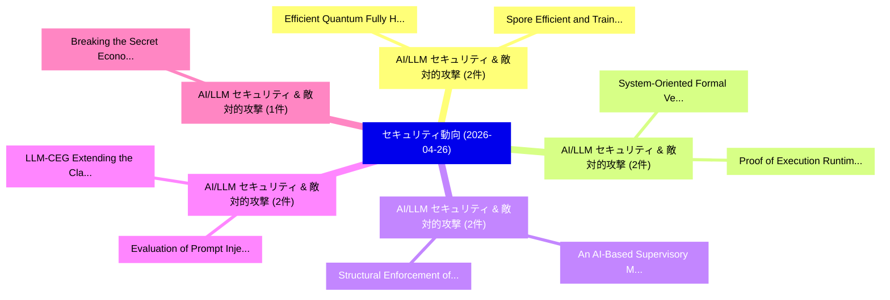

# 📅 02_daily: 日次エグゼクティブサマリー報告書 (2026-04-26)

**集計日時**: 2026-10-02 23:06:06 UTC  
**対象日付**: 2026-04-26  
**本日収集論文数**: 18 件  

---

## 💡 主要セキュリティ動向・脅威インサイト (Executive Insights)

本日の収集論文（計 18 件）において、以下の重点セキュリティ領域で活発な研究動向が確認されました：
- **AI/LLM セキュリティ & 敵対的攻撃** (2 件): 注目論文として 「Efficient Quantum Fully Homomo...」、「Spore: Efficient and Training-...」 等が発表され、実務防御および攻撃検証の進展が見られます。
- **AI/LLM セキュリティ & 敵対的攻撃** (2 件): 注目論文として 「System-Oriented Formal Verific...」、「Proof of Execution: Runtime Ve...」 等が発表され、実務防御および攻撃検証の進展が見られます。
- **AI/LLM セキュリティ & 敵対的攻撃** (2 件): 注目論文として 「Structural Enforcement of Goal...」、「An AI-Based Supervisory Measur...」 等が発表され、実務防御および攻撃検証の進展が見られます。
- **AI/LLM セキュリティ & 敵対的攻撃** (2 件): 注目論文として 「LLM-CEG: Extending the Classif...」、「Evaluation of Prompt Injection...」 等が発表され、実務防御および攻撃検証の進展が見られます。
- **AI/LLM セキュリティ & 敵対的攻撃** (1 件): 注目論文として 「Breaking the Secret: Economic ...」 等が発表され、実務防御および攻撃検証の進展が見られます。

### 🗺️ 技術・脅威トピックマインドマップ

---

## 📌 日次セキュリティ論文一覧 (日本語表形式)

| No | arXiv ID | 論文タイトル (日本語訳) | 重要キーワード | 構造化エグゼクティブ要約 (背景・提案・影響) | 脅威分類 | 詳細リンク |
|---|---|---|---|---|---|---|
| 1 | `2604.23490v2` | [Efficient Quantum Fully Homomorphic Encryption（セキュリティ分析論文）](../../okf/papers/2026-04-26/2604.23490.md) | `Efficient Quantum Fully Homomorphic Encryption`, `Fengxia Liu`, `Zixian Gong` | 【提案】概要 (Overview & Key Finding) 本論文「Efficient 量子 Fully 準同型暗号（セキュリティ分析論文）」（原題: Efficient 量子 ...。実証評価により経営層・セキュリティ管理者向け推奨アクション (E... | `arXiv` | [arXiv](https://arxiv.org/abs/2604.23490v2) &#124; [OKF](../../okf/papers/2026-04-26/2604.23490.md) |
| 2 | `2604.23511v1` | [Breaking the Secret: Economic Interventions for Combating Collusion in Embodied Multi-Agent Systems（セキュリティ分析論文）](../../okf/papers/2026-04-26/2604.23511.md) | `Economic Interventions`, `Combating Collusion`, `Embodied Multi` | 【提案】概要 (Overview & Key Finding) 本論文「Breaking the Secret: Economic Interventions for Combati...。実証評価により経営層・セキュリティ管理者向け推奨アクション (E... | `arXiv` | [arXiv](https://arxiv.org/abs/2604.23511v1) &#124; [OKF](../../okf/papers/2026-04-26/2604.23511.md) |
| 3 | `2604.23516v1` | [Time-Delayed Publicly Verifiable Quantum Computation for Classical Verifiers（セキュリティ分析論文）](../../okf/papers/2026-04-26/2604.23516.md) | `Delayed Publicly Verifiable Quantum Computation`, `Classical Verifiers`, `Time-Delayed Publicly` | 【提案】概要 (Overview & Key Finding) 本論文「Time-Delayed Publicly Verifiable 量子 Computation for Cla...。実証評価により経営層・セキュリティ管理者向け推奨アクション (E... | `arXiv` | [arXiv](https://arxiv.org/abs/2604.23516v1) &#124; [OKF](../../okf/papers/2026-04-26/2604.23516.md) |
| 4 | `2604.23538v3` | [Personal Data Exposure in Thailandの分析](../../okf/papers/2026-04-26/2604.23538.md) | `Personal Data Exposure`, `Suphannee Sivakorn`, `Sasawat Malaivongs` | 【提案】概要 (Overview & Key Finding) 本論文「Personal Data Exposure in Thailandの分析」（原題: Analysis of ...。実証評価により経営層・セキュリティ管理者向け推奨アクション (E... | `arXiv` | [arXiv](https://arxiv.org/abs/2604.23538v3) &#124; [OKF](../../okf/papers/2026-04-26/2604.23538.md) |
| 5 | `2604.23545v1` | [Safeguarding Skies: Airport サイバーセキュリティ in the Digital Age](../../okf/papers/2026-04-26/2604.23545.md) | `Safeguarding Skies`, `Digital Age`, `Airport Cybersecurity` | 【提案】概要 (Overview & Key Finding) 本論文「Safeguarding Skies: Airport サイバーセキュリティ in the Digital A...。実証評価により経営層・セキュリティ管理者向け推奨アクション (E... | `arXiv` | [arXiv](https://arxiv.org/abs/2604.23545v1) &#124; [OKF](../../okf/papers/2026-04-26/2604.23545.md) |
| 6 | `2604.23560v1` | [System-Oriented Formal Verification of Local-First Access Controlに向けて](../../okf/papers/2026-04-26/2604.23560.md) | `Oriented Formal Verification`, `System-Oriented Formal`, `Local-First Access` | 【提案】概要 (Overview & Key Finding) 本論文「System-Oriented Formal Verification of Local-First アクセス...。実証評価により経営層・セキュリティ管理者向け推奨アクション (E... | `arXiv` | [arXiv](https://arxiv.org/abs/2604.23560v1) &#124; [OKF](../../okf/papers/2026-04-26/2604.23560.md) |
| 7 | `2604.23563v1` | [CyberCane: Neuro-Symbolic RAG for Privacy-Preserving Phishing Detection with Formal Ontology Reasoning（セキュリティ分析論文）](../../okf/papers/2026-04-26/2604.23563.md) | `Preserving Phishing Detection`, `Formal Ontology Reasoning`, `Neuro-Symbolic RAG` | 【提案】概要 (Overview & Key Finding) 本論文「CyberCane: Neuro-Symbolic RAG for Privacy-Preserving Ph...。実証評価により経営層・セキュリティ管理者向け推奨アクション (E... | `arXiv` | [arXiv](https://arxiv.org/abs/2604.23563v1) &#124; [OKF](../../okf/papers/2026-04-26/2604.23563.md) |
| 8 | `2604.23568v1` | [Green-Red Watermarking for Recommender Systems（セキュリティ分析論文）](../../okf/papers/2026-04-26/2604.23568.md) | `Red Watermarking`, `Recommender Systems`, `Green-Red Watermarking` | 【提案】概要 (Overview & Key Finding) 本論文「Green-Red Watermarking for Recommender Systems（セキュリティ分析...。実証評価により経営層・セキュリティ管理者向け推奨アクション (E... | `arXiv` | [arXiv](https://arxiv.org/abs/2604.23568v1) &#124; [OKF](../../okf/papers/2026-04-26/2604.23568.md) |
| 9 | `2604.23617v1` | [The Vehicle May Be Sick: Denial of Diagnostic Services by Exploiting the CAN Transport Protocol（セキュリティ分析論文）](../../okf/papers/2026-04-26/2604.23617.md) | `Diagnostic Services`, `Transport Protocol`, `Huy Kang Kim` | 【提案】概要 (Overview & Key Finding) 本論文「The Vehicle May Be Sick: Denial of Diagnostic Services ...。実証評価により経営層・セキュリティ管理者向け推奨アクション (E... | `arXiv` | [arXiv](https://arxiv.org/abs/2604.23617v1) &#124; [OKF](../../okf/papers/2026-04-26/2604.23617.md) |
| 10 | `2604.23646v1` | [Structural Enforcement of Goal Integrity in AI Agents via Separation-of-Powers Architecture（セキュリティ分析論文）](../../okf/papers/2026-04-26/2604.23646.md) | `Structural Enforcement`, `Goal Integrity`, `Powers Architecture` | 【提案】概要 (Overview & Key Finding) 本論文「Structural Enforcement of Goal Integrity in AI Agents v...。実証評価により経営層・セキュリティ管理者向け推奨アクション (E... | `arXiv` | [arXiv](https://arxiv.org/abs/2604.23646v1) &#124; [OKF](../../okf/papers/2026-04-26/2604.23646.md) |
| 11 | `2604.23649v1` | [Rényi Pufferfish Privacy with Gaussian-based Priors: From Single Gaussian to Mixture Model（セキュリティ分析論文）](../../okf/papers/2026-04-26/2604.23649.md) | `Pufferfish Privacy`, `Mixture Model`, `Gaussian-based Priors` | 【提案】概要 (Overview & Key Finding) 本論文「Rényi Pufferfish Privacy with Gaussian-based Priors: Fr...。実証評価により経営層・セキュリティ管理者向け推奨アクション (E... | `arXiv` | [arXiv](https://arxiv.org/abs/2604.23649v1) &#124; [OKF](../../okf/papers/2026-04-26/2604.23649.md) |
| 12 | `2604.23666v1` | [An AI-Based Supervisory Measurement Integrity Validation Layer for Cyber-Resilient AC/DC Protection in Inverter-Based Microgrids（セキュリティ分析論文）](../../okf/papers/2026-04-26/2604.23666.md) | `Based Supervisory Measurement Integrity Validation Layer`, `Based Microgrids`, `AI-Based Supervisory` | 【提案】概要 (Overview & Key Finding) 本論文「An AI-Based Supervisory Measurement Integrity Validatio...。実証評価により経営層・セキュリティ管理者向け推奨アクション (E... | `arXiv` | [arXiv](https://arxiv.org/abs/2604.23666v1) &#124; [OKF](../../okf/papers/2026-04-26/2604.23666.md) |
| 13 | `2604.23711v1` | [Spore: Efficient and Training-Free Privacy Extraction Attack on LLMs via Inference-Time Hybrid Probing（セキュリティ分析論文）](../../okf/papers/2026-04-26/2604.23711.md) | `Free Privacy Extraction Attack`, `Time Hybrid Probing`, `Training-Free Privacy` | 【提案】概要 (Overview & Key Finding) 本論文「Spore: Efficient and Training-Free Privacy Extraction A...。実証評価により経営層・セキュリティ管理者向け推奨アクション (E... | `arXiv` | [arXiv](https://arxiv.org/abs/2604.23711v1) &#124; [OKF](../../okf/papers/2026-04-26/2604.23711.md) |
| 14 | `2604.23795v1` | [LLM-CEG: Extending the Classification Error Gauge Framework for Privacy Auditing of 大規模言語モデル](../../okf/papers/2026-04-26/2604.23795.md) | `Privacy Auditing`, `Large Language Models`, `Kato Mivule` | 【提案】概要 (Overview & Key Finding) 本論文「LLM-CEG: Extending the Classification Error Gauge Frame...。実証評価により経営層・セキュリティ管理者向け推奨アクション (E... | `arXiv` | [arXiv](https://arxiv.org/abs/2604.23795v1) &#124; [OKF](../../okf/papers/2026-04-26/2604.23795.md) |
| 15 | `2604.23812v1` | [SeqShield: A Behavioral Analysis Approach to Uncover Rootkits（セキュリティ分析論文）](../../okf/papers/2026-04-26/2604.23812.md) | `Uncover Rootkits`, `Paras Ghodeshwar`, `Anand Handa` | 【提案】概要 (Overview & Key Finding) 本論文「SeqShield: A Behavioral Analysis Approach to Uncover Ro...。実証評価により経営層・セキュリティ管理者向け推奨アクション (E... | `arXiv` | [arXiv](https://arxiv.org/abs/2604.23812v1) &#124; [OKF](../../okf/papers/2026-04-26/2604.23812.md) |
| 16 | `2604.23887v2` | [Evaluation of Prompt Injection Defenses in 大規模言語モデル](../../okf/papers/2026-04-26/2604.23887.md) | `Prompt Injection Defenses`, `Large Language Models`, `Priyal Deep` | 【提案】概要 (Overview & Key Finding) 本論文「Evaluation of プロンプトインジェクション Defenses in 大規模言語モデル」（原題: E...。実証評価により経営層・セキュリティ管理者向け推奨アクション (E... | `arXiv` | [arXiv](https://arxiv.org/abs/2604.23887v2) &#124; [OKF](../../okf/papers/2026-04-26/2604.23887.md) |
| 17 | `2604.23905v1` | [SMSI: System Model Security Inference: Automated Threat Modeling for Cyber-Physical Systems（セキュリティ分析論文）](../../okf/papers/2026-04-26/2604.23905.md) | `System Model Security Inference`, `Automated Threat Modeling`, `Physical Systems` | 【提案】概要 (Overview & Key Finding) 本論文「SMSI: System Model Security Inference: Automated 脅威 Mod...。実証評価により経営層・セキュリティ管理者向け推奨アクション (E... | `arXiv` | [arXiv](https://arxiv.org/abs/2604.23905v1) &#124; [OKF](../../okf/papers/2026-04-26/2604.23905.md) |
| 18 | `2607.05397v1` | [Proof of Execution: Runtime Verification for Governed AI Agent Actions（セキュリティ分析論文）](../../okf/papers/2026-04-26/2607.05397.md) | `Runtime Verification`, `Agent Actions`, `James Rhodes` | 【提案】概要 (Overview & Key Finding) 本論文「Proof of Execution: Runtime Verification for Governed A...。実証評価により経営層・セキュリティ管理者向け推奨アクション (E... | `arXiv` | [arXiv](https://arxiv.org/abs/2607.05397v1) &#124; [OKF](../../okf/papers/2026-04-26/2607.05397.md) |

