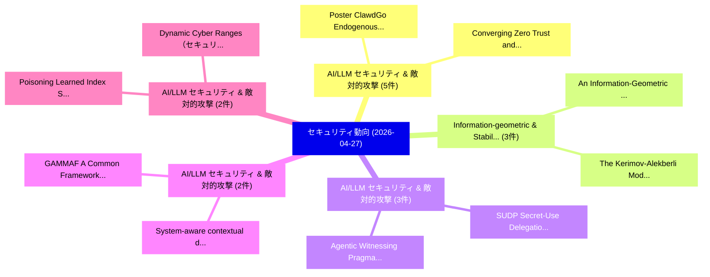

# 📅 02_daily: 日次エグゼクティブサマリー報告書 (2026-04-27)

**集計日時**: 2026-10-02 23:06:07 UTC  
**対象日付**: 2026-04-27  
**本日収集論文数**: 42 件  

---

## 💡 主要セキュリティ動向・脅威インサイト (Executive Insights)

本日の収集論文（計 42 件）において、以下の重点セキュリティ領域で活発な研究動向が確認されました：
- **AI/LLM セキュリティ & 敵対的攻撃** (5 件): 注目論文として 「Poster: ClawdGo: Endogenous Se...」、「Converging Zero Trust and IoT ...」 等が発表され、実務防御および攻撃検証の進展が見られます。
- **Information-geometric & Stability** (3 件): 注目論文として 「An Information-Geometric Frame...」、「The Kerimov-Alekberli Model: A...」 等が発表され、実務防御および攻撃検証の進展が見られます。
- **AI/LLM セキュリティ & 敵対的攻撃** (3 件): 注目論文として 「Agentic Witnessing: Pragmatic ...」、「SUDP: Secret-Use Delegation Pr...」 等が発表され、実務防御および攻撃検証の進展が見られます。
- **AI/LLM セキュリティ & 敵対的攻撃** (2 件): 注目論文として 「System-aware contextual digita...」、「GAMMAF: A Common Framework for...」 等が発表され、実務防御および攻撃検証の進展が見られます。
- **AI/LLM セキュリティ & 敵対的攻撃** (2 件): 注目論文として 「Dynamic Cyber Ranges（セキュリティ分析論...」、「Poisoning Learned Index Struct...」 等が発表され、実務防御および攻撃検証の進展が見られます。

### 🗺️ 技術・脅威トピックマインドマップ

---

## 📌 日次セキュリティ論文一覧 (日本語表形式)

| No | arXiv ID | 論文タイトル (日本語訳) | 重要キーワード | 構造化エグゼクティブ要約 (背景・提案・影響) | 脅威分類 | 詳細リンク |
|---|---|---|---|---|---|---|
| 1 | `2604.24020v1` | [Poster: ClawdGo: Endogenous Security Awareness Training for Autonomous AI Agents（セキュリティ分析論文）](../../okf/papers/2026-04-27/2604.24020.md) | `Endogenous Security Awareness Training`, `Jiaqi Li`, `Yang Zhao` | 【提案】概要 (Overview & Key Finding) 本論文「Poster: ClawdGo: Endogenous Security Awareness Training...。実証評価により経営層・セキュリティ管理者向け推奨アクション (E... | `arXiv` | [arXiv](https://arxiv.org/abs/2604.24020v1) &#124; [OKF](../../okf/papers/2026-04-27/2604.24020.md) |
| 2 | `2604.24051v1` | [System-aware contextual digital twin for ICS anomaly diagnosis（セキュリティ分析論文）](../../okf/papers/2026-04-27/2604.24051.md) | `System-aware contextual`, `Eungyu Woo`, `Yooshin Kim` | 【提案】概要 (Overview & Key Finding) 本論文「System-aware contextual digital twin for ICS anomaly di...。実証評価により経営層・セキュリティ管理者向け推奨アクション (E... | `arXiv` | [arXiv](https://arxiv.org/abs/2604.24051v1) &#124; [OKF](../../okf/papers/2026-04-27/2604.24051.md) |
| 3 | `2604.24066v1` | [Listen to the Voices of Everyday Users: Democratizing Privacy Ratings for Sensitive Data Access in Mobile Apps（セキュリティ分析論文）](../../okf/papers/2026-04-27/2604.24066.md) | `Democratizing Privacy Ratings`, `Sensitive Data Access`, `Everyday Users` | 【提案】概要 (Overview & Key Finding) 本論文「Listen to the Voices of Everyday Users: Democratizing P...。実証評価により経営層・セキュリティ管理者向け推奨アクション (E... | `arXiv` | [arXiv](https://arxiv.org/abs/2604.24066v1) &#124; [OKF](../../okf/papers/2026-04-27/2604.24066.md) |
| 4 | `2604.24076v1` | [An Information-Geometric Framework for Stability Large Language Models under Entropic Stressの分析](../../okf/papers/2026-04-27/2604.24076.md) | `Stability Large Language Models`, `Large Language Models`, `Entropic Stress` | 【提案】概要 (Overview & Key Finding) 本論文「An Information-Geometric Framework for Stability Large ...。実証評価により経営層・セキュリティ管理者向け推奨アクション (E... | `arXiv` | [arXiv](https://arxiv.org/abs/2604.24076v1) &#124; [OKF](../../okf/papers/2026-04-27/2604.24076.md) |
| 5 | `2604.24082v1` | [Jailbreaking Frontier Foundation Models Through Intention Deception（セキュリティ分析論文）](../../okf/papers/2026-04-27/2604.24082.md) | `Xinhe Wang`, `Katia Sycara`, `Yaqi Xie` | 【提案】概要 (Overview & Key Finding) 本論文「ジェイルブレイクing Frontier Foundation Models Through Intentio...。実証評価により経営層・セキュリティ管理者向け推奨アクション (E... | `arXiv` | [arXiv](https://arxiv.org/abs/2604.24082v1) &#124; [OKF](../../okf/papers/2026-04-27/2604.24082.md) |
| 6 | `2604.24083v1` | [The Kerimov-Alekberli Model: An Information-Geometric Framework for Real-Time System Stability（セキュリティ分析論文）](../../okf/papers/2026-04-27/2604.24083.md) | `Time System Stability`, `Alekberli Model`, `Kerimov-Alekberli Model` | 【提案】概要 (Overview & Key Finding) 本論文「The Kerimov-Alekberli Model: An Information-Geometric F...。実証評価により経営層・セキュリティ管理者向け推奨アクション (E... | `arXiv` | [arXiv](https://arxiv.org/abs/2604.24083v1) &#124; [OKF](../../okf/papers/2026-04-27/2604.24083.md) |
| 7 | `2604.24085v1` | [Evaluating Cryptographic API Misuse Detectors for Go（セキュリティ分析論文）](../../okf/papers/2026-04-27/2604.24085.md) | `Evaluating Cryptographic`, `Misuse Detectors`, `Vivi Andersson` | 【提案】概要 (Overview & Key Finding) 本論文「Evaluating Cryptographic API Misuse Detectors for Go（セキ...。実証評価により経営層・セキュリティ管理者向け推奨アクション (E... | `arXiv` | [arXiv](https://arxiv.org/abs/2604.24085v1) &#124; [OKF](../../okf/papers/2026-04-27/2604.24085.md) |
| 8 | `2604.24118v1` | [AgentVisor: Defending LLMエージェント Against Prompt Injection via Semantic Virtualization](../../okf/papers/2026-04-27/2604.24118.md) | `Semantic Virtualization`, `Zonghao Ying`, `Haozheng Wang` | 【提案】概要 (Overview & Key Finding) 本論文「AgentVisor: Defending LLMエージェント Against プロンプトインジェクション v...。実証評価により経営層・セキュリティ管理者向け推奨アクション (E... | `arXiv` | [arXiv](https://arxiv.org/abs/2604.24118v1) &#124; [OKF](../../okf/papers/2026-04-27/2604.24118.md) |
| 9 | `2604.24131v1` | [Detecting Avalanche Effect in Adversarial Settings: Spotting the Encryption Loops in Ransomware（セキュリティ分析論文）](../../okf/papers/2026-04-27/2604.24131.md) | `Detecting Avalanche Effect`, `Adversarial Settings`, `Encryption Loops` | 【提案】概要 (Overview & Key Finding) 本論文「Detecting Avalanche Effect in Adversarial Settings: Spo...。実証評価により経営層・セキュリティ管理者向け推奨アクション (E... | `arXiv` | [arXiv](https://arxiv.org/abs/2604.24131v1) &#124; [OKF](../../okf/papers/2026-04-27/2604.24131.md) |
| 10 | `2604.24162v2` | [Defusing the Trigger: Tail-Risk-Informed Attention Rebalancing for LLM Backdoor Mitigation（セキュリティ分析論文）](../../okf/papers/2026-04-27/2604.24162.md) | `Informed Attention Rebalancing`, `Backdoor Mitigation`, `Kaisheng Fan` | 【提案】概要 (Overview & Key Finding) 本論文「Defusing the Trigger: Tail-Risk-Informed Attention Reba...。実証評価により経営層・セキュリティ管理者向け推奨アクション (E... | `arXiv` | [arXiv](https://arxiv.org/abs/2604.24162v2) &#124; [OKF](../../okf/papers/2026-04-27/2604.24162.md) |
| 11 | `2604.24184v1` | [Dynamic Cyber Ranges（セキュリティ分析論文）](../../okf/papers/2026-04-27/2604.24184.md) | `Dynamic Cyber Ranges`, `Maite Del Mundo De Torres`, `Samuel Rodriguez Borines` | 【提案】概要 (Overview & Key Finding) 本論文「Dynamic Cyber Ranges（セキュリティ分析論文）」（原題: Dynamic Cyber Ran...。実証評価により経営層・セキュリティ管理者向け推奨アクション (E... | `arXiv` | [arXiv](https://arxiv.org/abs/2604.24184v1) &#124; [OKF](../../okf/papers/2026-04-27/2604.24184.md) |
| 12 | `2604.24203v1` | [Agentic Witnessing: Pragmatic and Scalable TEE-Enabled Privacy-Preserving Auditing（セキュリティ分析論文）](../../okf/papers/2026-04-27/2604.24203.md) | `Agentic Witnessing`, `Enabled Privacy`, `Preserving Auditing` | 【提案】概要 (Overview & Key Finding) 本論文「Agentic Witnessing: Pragmatic and Scalable TEE-Enabled ...。実証評価により経営層・セキュリティ管理者向け推奨アクション (E... | `arXiv` | [arXiv](https://arxiv.org/abs/2604.24203v1) &#124; [OKF](../../okf/papers/2026-04-27/2604.24203.md) |
| 13 | `2604.24205v1` | [Converging Zero Trust and IoT Security: A Multivocal Literature Review（セキュリティ分析論文）](../../okf/papers/2026-04-27/2604.24205.md) | `Converging Zero Trust`, `Multivocal Literature Review`, `Mariam Wehbe` | 【提案】概要 (Overview & Key Finding) 本論文「Converging ゼロトラスト and IoT Security: A Multivocal Litera...。実証評価により経営層・セキュリティ管理者向け推奨アクション (E... | `arXiv` | [arXiv](https://arxiv.org/abs/2604.24205v1) &#124; [OKF](../../okf/papers/2026-04-27/2604.24205.md) |
| 14 | `2604.24277v2` | [Resolving Conflicts Between RTOS Timekeeping and Uninterruptable Trusted Computing（セキュリティ分析論文）](../../okf/papers/2026-04-27/2604.24277.md) | `Uninterruptable Trusted Computing`, `Ivan De Oliveira Nunes`, `Antonio Joia Neto` | 【提案】概要 (Overview & Key Finding) 本論文「Resolving Conflicts Between RTOS Timekeeping and Uninte...。実証評価により経営層・セキュリティ管理者向け推奨アクション (E... | `arXiv` | [arXiv](https://arxiv.org/abs/2604.24277v2) &#124; [OKF](../../okf/papers/2026-04-27/2604.24277.md) |
| 15 | `2604.24287v1` | [RowHammer Vulnerability Counter (RVC): Redefining RowHammer Detection with Victim-Centric Tracking（セキュリティ分析論文）](../../okf/papers/2026-04-27/2604.24287.md) | `Vulnerability Counter`, `Centric Tracking`, `Victim-Centric Tracking` | 【提案】概要 (Overview & Key Finding) 本論文「RowHammer 脆弱性 Counter (RVC): Redefining RowHammer Detec...。実証評価により経営層・セキュリティ管理者向け推奨アクション (E... | `arXiv` | [arXiv](https://arxiv.org/abs/2604.24287v1) &#124; [OKF](../../okf/papers/2026-04-27/2604.24287.md) |
| 16 | `2604.24326v1` | [X-NegoBox: An Explainable Privacy-Budget Negotiation Framework for Secure Peer-to-Peer Energy Data Exchange（セキュリティ分析論文）](../../okf/papers/2026-04-27/2604.24326.md) | `Peer Energy Data Exchange`, `Privacy-Budget Negotiation`, `Secure Peer` | 【提案】概要 (Overview & Key Finding) 本論文「X-NegoBox: An Explainable Privacy-Budget Negotiation Fr...。実証評価により経営層・セキュリティ管理者向け推奨アクション (E... | `arXiv` | [arXiv](https://arxiv.org/abs/2604.24326v1) &#124; [OKF](../../okf/papers/2026-04-27/2604.24326.md) |
| 17 | `2604.24332v1` | [Mitigating Error Amplification in Fast Adversarial Training（セキュリティ分析論文）](../../okf/papers/2026-04-27/2604.24332.md) | `Mitigating Error Amplification`, `Fast Adversarial Training`, `Mengnan Zhao` | 【提案】概要 (Overview & Key Finding) 本論文「Mitigating Error Amplification in Fast Adversarial Trai...。実証評価により経営層・セキュリティ管理者向け推奨アクション (E... | `arXiv` | [arXiv](https://arxiv.org/abs/2604.24332v1) &#124; [OKF](../../okf/papers/2026-04-27/2604.24332.md) |
| 18 | `2604.24341v1` | [GoAT-X: A Graph of Auditing Thoughts for Token Transactions in Cross-Chain Contractsのセキュリティ強化](../../okf/papers/2026-04-27/2604.24341.md) | `Auditing Thoughts`, `Token Transactions`, `Securing Token Transactions` | 【提案】概要 (Overview & Key Finding) 本論文「GoAT-X: A Graph of Auditing Thoughts for Token Transact...。実証評価により経営層・セキュリティ管理者向け推奨アクション (E... | `arXiv` | [arXiv](https://arxiv.org/abs/2604.24341v1) &#124; [OKF](../../okf/papers/2026-04-27/2604.24341.md) |
| 19 | `2604.24350v1` | [Unveiling the Backdoor Mechanism Hidden Behind Catastrophic Overfitting in Fast Adversarial Training（セキュリティ分析論文）](../../okf/papers/2026-04-27/2604.24350.md) | `Backdoor Mechanism Hidden Behind Catastrophic Overfitting`, `Fast Adversarial Training`, `Backdoor Mechanism Hidden Behind Catastrophic Overfitt` | 【提案】概要 (Overview & Key Finding) 本論文「Unveiling the Backdoor Mechanism Hidden Behind Catastro...。実証評価により経営層・セキュリティ管理者向け推奨アクション (E... | `arXiv` | [arXiv](https://arxiv.org/abs/2604.24350v1) &#124; [OKF](../../okf/papers/2026-04-27/2604.24350.md) |
| 20 | `2604.24385v1` | [Information-Theoretic Distributed Point Functions with Shorter Keys（セキュリティ分析論文）](../../okf/papers/2026-04-27/2604.24385.md) | `Theoretic Distributed Point Functions`, `Shorter Keys`, `Information-Theoretic Distributed` | 【提案】概要 (Overview & Key Finding) 本論文「Information-Theoretic Distributed Point Functions with ...。実証評価により経営層・セキュリティ管理者向け推奨アクション (E... | `arXiv` | [arXiv](https://arxiv.org/abs/2604.24385v1) &#124; [OKF](../../okf/papers/2026-04-27/2604.24385.md) |
| 21 | `2604.24398v1` | [MAS-SZZ: Multi-Agentic SZZ Algorithm for Vulnerability-Inducing Commit Identification（セキュリティ分析論文）](../../okf/papers/2026-04-27/2604.24398.md) | `Inducing Commit Identification`, `Multi-Agentic SZZ`, `Vulnerability-Inducing Commit` | 【提案】概要 (Overview & Key Finding) 本論文「MAS-SZZ: Multi-Agentic SZZ Algorithm for 脆弱性-Inducing C...。実証評価により経営層・セキュリティ管理者向け推奨アクション (E... | `arXiv` | [arXiv](https://arxiv.org/abs/2604.24398v1) &#124; [OKF](../../okf/papers/2026-04-27/2604.24398.md) |
| 22 | `2604.24404v1` | [From Spoofing to Trust: Emergency Alerts Spoofing Testbed and Cross-Cell Verification（セキュリティ分析論文）](../../okf/papers/2026-04-27/2604.24404.md) | `Emergency Alerts Spoofing Testbed`, `Cell Verification`, `Cross-Cell Verification` | 【提案】概要 (Overview & Key Finding) 本論文「From Spoofing to Trust: Emergency Alerts Spoofing Testb...。実証評価により経営層・セキュリティ管理者向け推奨アクション (E... | `arXiv` | [arXiv](https://arxiv.org/abs/2604.24404v1) &#124; [OKF](../../okf/papers/2026-04-27/2604.24404.md) |
| 23 | `2604.24468v1` | [A Survey on Split Learning for LLM Fine-Tuning: Models, Systems, and Privacy Optimizations（セキュリティ分析論文）](../../okf/papers/2026-04-27/2604.24468.md) | `Split Learning`, `Privacy Optimizations`, `Zihan Liu` | 【提案】概要 (Overview & Key Finding) 本論文「A Survey on Split Learning for LLM Fine-Tuning: Models,...。実証評価により経営層・セキュリティ管理者向け推奨アクション (E... | `arXiv` | [arXiv](https://arxiv.org/abs/2604.24468v1) &#124; [OKF](../../okf/papers/2026-04-27/2604.24468.md) |
| 24 | `2604.24477v1` | [GAMMAF: A Common Framework for Graph-Based Anomaly Monitoring in LLM Multi-Agent Systemsのベンチマーク評価](../../okf/papers/2026-04-27/2604.24477.md) | `Graph-Based Anomaly`, `Based Anomaly Monitoring`, `Based Anomaly Monitoring Benchmarking` | 【提案】概要 (Overview & Key Finding) 本論文「GAMMAF: A Common Framework for Graph-Based Anomaly Moni...。実証評価により経営層・セキュリティ管理者向け推奨アクション (E... | `arXiv` | [arXiv](https://arxiv.org/abs/2604.24477v1) &#124; [OKF](../../okf/papers/2026-04-27/2604.24477.md) |
| 25 | `2604.24542v1` | [Layerwise Convergence Fingerprints for Runtime Misbehavior Detection in 大規模言語モデル](../../okf/papers/2026-04-27/2604.24542.md) | `Layerwise Convergence Fingerprints`, `Runtime Misbehavior Detection`, `Large Language Models` | 【提案】概要 (Overview & Key Finding) 本論文「Layerwise Convergence Fingerprints for Runtime Misbehav...。実証評価により経営層・セキュリティ管理者向け推奨アクション (E... | `arXiv` | [arXiv](https://arxiv.org/abs/2604.24542v1) &#124; [OKF](../../okf/papers/2026-04-27/2604.24542.md) |
| 26 | `2604.24599v1` | [DETOUR: A Practical Backdoor Attack against Object Detection（セキュリティ分析論文）](../../okf/papers/2026-04-27/2604.24599.md) | `Practical Backdoor Attack`, `Object Detection`, `Dazhuang Liu` | 【提案】概要 (Overview & Key Finding) 本論文「DETOUR: A Practical Backdoor Attack against Object Dete...。実証評価により経営層・セキュリティ管理者向け推奨アクション (E... | `arXiv` | [arXiv](https://arxiv.org/abs/2604.24599v1) &#124; [OKF](../../okf/papers/2026-04-27/2604.24599.md) |
| 27 | `2604.24644v1` | [ARCANE: Cross-Campaign Attacker Re-identification via Passive Beacon Telemetry -- A Bayesian Network Framework for Longitudinal Cyber Attribution（セキュリティ分析論文）](../../okf/papers/2026-04-27/2604.24644.md) | `Campaign Attacker Re`, `Passive Beacon Telemetry`, `Longitudinal Cyber Attribution` | 【提案】概要 (Overview & Key Finding) 本論文「ARCANE: Cross-Campaign Attacker Re-identification via P...。実証評価により経営層・セキュリティ管理者向け推奨アクション (E... | `arXiv` | [arXiv](https://arxiv.org/abs/2604.24644v1) &#124; [OKF](../../okf/papers/2026-04-27/2604.24644.md) |
| 28 | `2604.24657v1` | [AgentWard: A Lifecycle Security Architecture for Autonomous AI Agents（セキュリティ分析論文）](../../okf/papers/2026-04-27/2604.24657.md) | `Lifecycle Security Architecture`, `Yixiang Zhang`, `Xinhao Deng` | 【提案】概要 (Overview & Key Finding) 本論文「AgentWard: A Lifecycle Security Architecture for Autono...。実証評価により経営層・セキュリティ管理者向け推奨アクション (E... | `arXiv` | [arXiv](https://arxiv.org/abs/2604.24657v1) &#124; [OKF](../../okf/papers/2026-04-27/2604.24657.md) |
| 29 | `2604.24670v2` | [Machine-Checked Cardinality Bounds for Masked Barrett Reduction: A 1-Bit Side-Channel Leakage Barrier in Post-Quantum Cryptographic Hardware（セキュリティ分析論文）](../../okf/papers/2026-04-27/2604.24670.md) | `Checked Cardinality Bounds`, `Masked Barrett Reduction`, `Channel Leakage Barrier` | 【提案】概要 (Overview & Key Finding) 本論文「Machine-Checked Cardinality Bounds for Masked Barrett R...。実証評価により経営層・セキュリティ管理者向け推奨アクション (E... | `arXiv` | [arXiv](https://arxiv.org/abs/2604.24670v2) &#124; [OKF](../../okf/papers/2026-04-27/2604.24670.md) |
| 30 | `2604.24701v1` | [Profiling Resilient to Change in Probe Position（セキュリティ分析論文）](../../okf/papers/2026-04-27/2604.24701.md) | `Profiling Resilient`, `Probe Position`, `Elie Bursztein` | 【提案】概要 (Overview & Key Finding) 本論文「Profiling Resilient to Change in Probe Position（セキュリティ分...。実証評価により経営層・セキュリティ管理者向け推奨アクション (E... | `arXiv` | [arXiv](https://arxiv.org/abs/2604.24701v1) &#124; [OKF](../../okf/papers/2026-04-27/2604.24701.md) |
| 31 | `2604.24826v1` | [A Comparative Evaluation of AI Agent Security Guardrails（セキュリティ分析論文）](../../okf/papers/2026-04-27/2604.24826.md) | `Agent Security Guardrails`, `Qi Li`, `Jiu Li` | 【提案】概要 (Overview & Key Finding) 本論文「A Comparative Evaluation of AI Agent Security Guardrail...。実証評価により経営層・セキュリティ管理者向け推奨アクション (E... | `arXiv` | [arXiv](https://arxiv.org/abs/2604.24826v1) &#124; [OKF](../../okf/papers/2026-04-27/2604.24826.md) |
| 32 | `2604.24869v1` | [Network Impact of Post-Quantum Certificate Chain sizes on Time to First Byte in TLS Deployments（セキュリティ分析論文）](../../okf/papers/2026-04-27/2604.24869.md) | `Quantum Certificate Chain`, `Network Impact`, `Post-Quantum Certificate` | 【提案】概要 (Overview & Key Finding) 本論文「Network Impact of Post-量子 Certificate Chain sizes on Ti...。実証評価により経営層・セキュリティ管理者向け推奨アクション (E... | `arXiv` | [arXiv](https://arxiv.org/abs/2604.24869v1) &#124; [OKF](../../okf/papers/2026-04-27/2604.24869.md) |
| 33 | `2604.24890v1` | [Verifying Provenance of Digital Media: Why the C2PA Specifications Fall Short（セキュリティ分析論文）](../../okf/papers/2026-04-27/2604.24890.md) | `Specifications Fall Short`, `Verifying Provenance`, `Digital Media` | 【提案】概要 (Overview & Key Finding) 本論文「Verifying Provenance of Digital Media: Why the C2PA Spe...。実証評価により経営層・セキュリティ管理者向け推奨アクション (E... | `arXiv` | [arXiv](https://arxiv.org/abs/2604.24890v1) &#124; [OKF](../../okf/papers/2026-04-27/2604.24890.md) |
| 34 | `2604.24920v3` | [SUDP: Secret-Use Delegation Protocol for Agentic Systems（セキュリティ分析論文）](../../okf/papers/2026-04-27/2604.24920.md) | `Use Delegation Protocol`, `Agentic Systems`, `Secret-Use Delegation` | 【提案】概要 (Overview & Key Finding) 本論文「SUDP: Secret-Use Delegation Protocol for Agentic System...。実証評価により経営層・セキュリティ管理者向け推奨アクション (E... | `arXiv` | [arXiv](https://arxiv.org/abs/2604.24920v3) &#124; [OKF](../../okf/papers/2026-04-27/2604.24920.md) |
| 35 | `2604.24935v1` | [CAN-QA: A Question-Answering Benchmark for Reasoning over In-Vehicle CAN Traffic（セキュリティ分析論文）](../../okf/papers/2026-04-27/2604.24935.md) | `Answering Benchmark`, `Question-Answering Benchmark`, `In-Vehicle CAN` | 【提案】概要 (Overview & Key Finding) 本論文「CAN-QA: A Question-Answering Benchmark for Reasoning ov...。実証評価により経営層・セキュリティ管理者向け推奨アクション (E... | `arXiv` | [arXiv](https://arxiv.org/abs/2604.24935v1) &#124; [OKF](../../okf/papers/2026-04-27/2604.24935.md) |
| 36 | `2604.24975v1` | [Poisoning Learned Index Structures: Static and Dynamic ALEXに対する敵対的攻撃](../../okf/papers/2026-04-27/2604.24975.md) | `Poisoning Learned Index Structures`, `Dynamic Adversarial Attacks`, `Allen Jue` | 【提案】概要 (Overview & Key Finding) 本論文「Poisoning Learned Index Structures: Static and Dynamic ...。実証評価により経営層・セキュリティ管理者向け推奨アクション (E... | `arXiv` | [arXiv](https://arxiv.org/abs/2604.24975v1) &#124; [OKF](../../okf/papers/2026-04-27/2604.24975.md) |
| 37 | `2604.25015v1` | [A Tree-Based Repository Blockchain Framework for Shared Governance in Collaborative Fork Ecosystems（セキュリティ分析論文）](../../okf/papers/2026-04-27/2604.25015.md) | `Collaborative Fork Ecosystems`, `Shared Governance`, `Tree-Based Repository` | 【提案】概要 (Overview & Key Finding) 本論文「A Tree-Based Repository Blockchain Framework for Shared...。実証評価により経営層・セキュリティ管理者向け推奨アクション (E... | `arXiv` | [arXiv](https://arxiv.org/abs/2604.25015v1) &#124; [OKF](../../okf/papers/2026-04-27/2604.25015.md) |
| 38 | `2604.25069v1` | [Extended Abstract: Shaperd: Easily Adoptable Real-Time Traffic Shaper for Fully Encrypted Protocols（セキュリティ分析論文）](../../okf/papers/2026-04-27/2604.25069.md) | `Easily Adoptable Real`, `Time Traffic Shaper`, `Fully Encrypted Protocols` | 【提案】概要 (Overview & Key Finding) 本論文「Extended Abstract: Shaperd: Easily Adoptable Real-Time ...。実証評価により経営層・セキュリティ管理者向け推奨アクション (E... | `arXiv` | [arXiv](https://arxiv.org/abs/2604.25069v1) &#124; [OKF](../../okf/papers/2026-04-27/2604.25069.md) |
| 39 | `2604.25071v1` | [Scalable Secure Biometric Authentication without Auxiliary Identifiers（セキュリティ分析論文）](../../okf/papers/2026-04-27/2604.25071.md) | `Scalable Secure Biometric Authentication`, `Auxiliary Identifiers`, `Scalable Secure Biometric` | 【提案】背景とセキュリティ上の課題 (Background & Problem) 本研究はサイバー脅威環境におけるセキュリティ構造・脆弱性の検証を目的としています。(主要検出項目: ...。実証評価により経営層・セキュリティ管理者向け推奨アクション (E... | `arXiv` | [arXiv](https://arxiv.org/abs/2604.25071v1) &#124; [OKF](../../okf/papers/2026-04-27/2604.25071.md) |
| 40 | `2604.25959v1` | [On the Centralization of Governance Power in Decentralized Autonomous Organizations（セキュリティ分析論文）](../../okf/papers/2026-04-27/2604.25959.md) | `Decentralized Autonomous Organizations`, `Governance Power`, `Vabuk Pahari` | 【提案】概要 (Overview & Key Finding) 本論文「On the Centralization of Governance Power in Decentrali...。実証評価により経営層・セキュリティ管理者向け推奨アクション (E... | `arXiv` | [arXiv](https://arxiv.org/abs/2604.25959v1) &#124; [OKF](../../okf/papers/2026-04-27/2604.25959.md) |
| 41 | `2604.26974v1` | [C8s: A Confidential Kubernetes Architecture（セキュリティ分析論文）](../../okf/papers/2026-04-27/2604.26974.md) | `Confidential Kubernetes Architecture`, `Amean Asad`, `Raw Meta` | 【提案】概要 (Overview & Key Finding) 本論文「C8s: A Confidential Kubernetes Architecture（セキュリティ分析論文）...。実証評価により経営層・セキュリティ管理者向け推奨アクション (E... | `arXiv` | [arXiv](https://arxiv.org/abs/2604.26974v1) &#124; [OKF](../../okf/papers/2026-04-27/2604.26974.md) |
| 42 | `2605.08106v1` | [Secure Integrated Sensing and Communication: Information Theory Offers Insights（セキュリティ分析論文）](../../okf/papers/2026-04-27/2605.08106.md) | `Information Theory Offers Insights`, `Secure Integrated Sensing`, `Truman Welling` | 【提案】概要 (Overview & Key Finding) 本論文「Secure Integrated Sensing and Communication: Informatio...。実証評価により経営層・セキュリティ管理者向け推奨アクション (E... | `arXiv` | [arXiv](https://arxiv.org/abs/2605.08106v1) &#124; [OKF](../../okf/papers/2026-04-27/2605.08106.md) |

