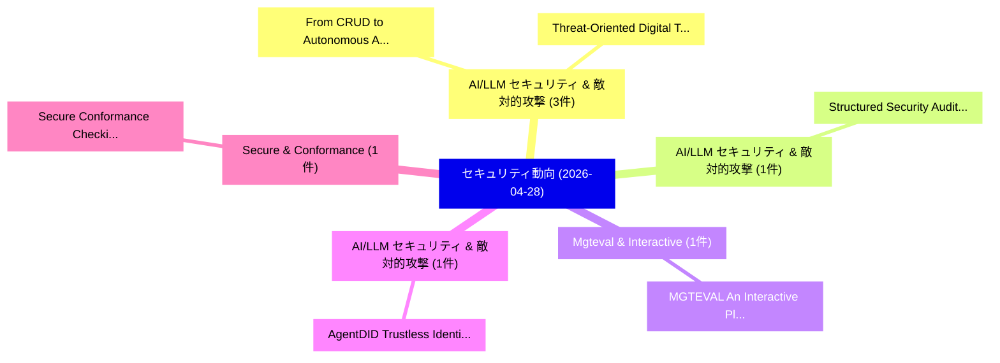

# 📅 02_daily: 日次エグゼクティブサマリー報告書 (2026-04-28)

**集計日時**: 2026-10-02 23:06:07 UTC  
**対象日付**: 2026-04-28  
**本日収集論文数**: 21 件  

---

## 💡 主要セキュリティ動向・脅威インサイト (Executive Insights)

本日の収集論文（計 21 件）において、以下の重点セキュリティ領域で活発な研究動向が確認されました：
- **AI/LLM セキュリティ & 敵対的攻撃** (3 件): 注目論文として 「From CRUD to Autonomous Agents...」、「Threat-Oriented Digital Twinni...」 等が発表され、実務防御および攻撃検証の進展が見られます。
- **AI/LLM セキュリティ & 敵対的攻撃** (1 件): 注目論文として 「Structured Security Auditing a...」 等が発表され、実務防御および攻撃検証の進展が見られます。
- **Mgteval & Interactive** (1 件): 注目論文として 「MGTEVAL: An Interactive Platfo...」 等が発表され、実務防御および攻撃検証の進展が見られます。
- **AI/LLM セキュリティ & 敵対的攻撃** (1 件): 注目論文として 「AgentDID: Trustless Identity A...」 等が発表され、実務防御および攻撃検証の進展が見られます。
- **Secure & Conformance** (1 件): 注目論文として 「Secure Conformance Checking us...」 等が発表され、実務防御および攻撃検証の進展が見られます。

### 🗺️ 技術・脅威トピックマインドマップ

---

## 📌 日次セキュリティ論文一覧 (日本語表形式)

| No | arXiv ID | 論文タイトル (日本語訳) | 重要キーワード | 構造化エグゼクティブ要約 (背景・提案・影響) | 脅威分類 | 詳細リンク |
|---|---|---|---|---|---|---|
| 1 | `2604.25109v1` | [Structured Security Auditing and Robustness Enhancement for Untrusted Agent Skills（セキュリティ分析論文）](../../okf/papers/2026-04-28/2604.25109.md) | `Structured Security Auditing`, `Untrusted Agent Skills`, `Robustness Enhancement` | 【提案】概要 (Overview & Key Finding) 本論文「Structured Security Auditing and Robustness Enhancement...。実証評価により経営層・セキュリティ管理者向け推奨アクション (E... | `arXiv` | [arXiv](https://arxiv.org/abs/2604.25109v1) &#124; [OKF](../../okf/papers/2026-04-28/2604.25109.md) |
| 2 | `2604.25152v1` | [MGTEVAL: An Interactive Platform for Systemtic Evaluation of Machine-Generated Text Detectors（セキュリティ分析論文）](../../okf/papers/2026-04-28/2604.25152.md) | `Generated Text Detectors`, `Machine-Generated Text`, `Yuanfan Li` | 【提案】概要 (Overview & Key Finding) 本論文「MGTEVAL: An Interactive Platform for Systemtic Evaluati...。実証評価により経営層・セキュリティ管理者向け推奨アクション (E... | `arXiv` | [arXiv](https://arxiv.org/abs/2604.25152v1) &#124; [OKF](../../okf/papers/2026-04-28/2604.25152.md) |
| 3 | `2604.25189v1` | [AgentDID: Trustless Identity Authentication for AI Agents（セキュリティ分析論文）](../../okf/papers/2026-04-28/2604.25189.md) | `Trustless Identity Authentication`, `Minghui Xu`, `Xiaoyu Liu` | 【提案】概要 (Overview & Key Finding) 本論文「AgentDID: Trustless Identity Authentication for AI Agen...。実証評価により経営層・セキュリティ管理者向け推奨アクション (E... | `arXiv` | [arXiv](https://arxiv.org/abs/2604.25189v1) &#124; [OKF](../../okf/papers/2026-04-28/2604.25189.md) |
| 4 | `2604.25190v1` | [Secure Conformance Checking using Token-based Replay and Homomorphic Encryption（セキュリティ分析論文）](../../okf/papers/2026-04-28/2604.25190.md) | `Secure Conformance Checking`, `Homomorphic Encryption`, `Token-based Replay` | 【提案】概要 (Overview & Key Finding) 本論文「Secure Conformance Checking using Token-based Replay an...。実証評価により経営層・セキュリティ管理者向け推奨アクション (E... | `arXiv` | [arXiv](https://arxiv.org/abs/2604.25190v1) &#124; [OKF](../../okf/papers/2026-04-28/2604.25190.md) |
| 5 | `2604.25200v1` | [Making AI-Assisted Grant Evaluation Auditable without Exposing the Model（セキュリティ分析論文）](../../okf/papers/2026-04-28/2604.25200.md) | `AI-Assisted Grant`, `Kemal Bicakci`, `Raw Meta` | 【提案】背景とセキュリティ上の課題 (Background & Problem) 本研究はサイバー脅威環境におけるセキュリティ構造・脆弱性の検証を目的としています。(主要検出項目: ...。実証評価により経営層・セキュリティ管理者向け推奨アクション (E... | `arXiv` | [arXiv](https://arxiv.org/abs/2604.25200v1) &#124; [OKF](../../okf/papers/2026-04-28/2604.25200.md) |
| 6 | `2604.25247v1` | [R-CoT: A Reasoning-Layer Watermark via Redundant Chain-of-Thought in 大規模言語モデル](../../okf/papers/2026-04-28/2604.25247.md) | `Layer Watermark`, `Redundant Chain`, `Reasoning-Layer Watermark` | 【提案】概要 (Overview & Key Finding) 本論文「R-CoT: A Reasoning-Layer Watermark via Redundant Chain-...。実証評価により経営層・セキュリティ管理者向け推奨アクション (E... | `arXiv` | [arXiv](https://arxiv.org/abs/2604.25247v1) &#124; [OKF](../../okf/papers/2026-04-28/2604.25247.md) |
| 7 | `2604.25264v1` | [MARD: A Multi-Agent Framework for Robust Android マルウェア検出](../../okf/papers/2026-04-28/2604.25264.md) | `Robust Android Malware Detection`, `Robust Android`, `Xueying Zeng` | 【提案】概要 (Overview & Key Finding) 本論文「MARD: A Multi-Agent Framework for Robust Android マルウェア検...。実証評価により経営層・セキュリティ管理者向け推奨アクション (E... | `arXiv` | [arXiv](https://arxiv.org/abs/2604.25264v1) &#124; [OKF](../../okf/papers/2026-04-28/2604.25264.md) |
| 8 | `2604.25486v1` | [ReTokSync: Self-Synchronizing Tokenization Disambiguation for Generative Linguistic Steganography（セキュリティ分析論文）](../../okf/papers/2026-04-28/2604.25486.md) | `Synchronizing Tokenization Disambiguation`, `Generative Linguistic Steganography`, `Self-Synchronizing Tokenization` | 【提案】概要 (Overview & Key Finding) 本論文「ReTokSync: Self-Synchronizing Tokenization Disambiguati...。実証評価により経営層・セキュリティ管理者向け推奨アクション (E... | `arXiv` | [arXiv](https://arxiv.org/abs/2604.25486v1) &#124; [OKF](../../okf/papers/2026-04-28/2604.25486.md) |
| 9 | `2604.25544v1` | [Medoid Prototype Alignment for Cross-Plant Unknown Attack Detection in Industrial Control Systems（セキュリティ分析論文）](../../okf/papers/2026-04-28/2604.25544.md) | `Plant Unknown Attack Detection`, `Medoid Prototype Alignment`, `Industrial Control Systems` | 【提案】概要 (Overview & Key Finding) 本論文「Medoid Prototype Alignment for Cross-Plant Unknown Atta...。実証評価により経営層・セキュリティ管理者向け推奨アクション (E... | `arXiv` | [arXiv](https://arxiv.org/abs/2604.25544v1) &#124; [OKF](../../okf/papers/2026-04-28/2604.25544.md) |
| 10 | `2604.25555v1` | [From CRUD to Autonomous Agents: Formal Validation and Zero-Trust Security for Semantic Gateways in AI-Native Enterprise Systems（セキュリティ分析論文）](../../okf/papers/2026-04-28/2604.25555.md) | `Native Enterprise Systems`, `Autonomous Agents`, `Formal Validation` | 【提案】概要 (Overview & Key Finding) 本論文「From CRUD to Autonomous Agents: Formal Validation and ゼ...。実証評価により経営層・セキュリティ管理者向け推奨アクション (E... | `arXiv` | [arXiv](https://arxiv.org/abs/2604.25555v1) &#124; [OKF](../../okf/papers/2026-04-28/2604.25555.md) |
| 11 | `2604.25562v1` | [SnapGuard: Lightweight Prompt Injection Detection for Screenshot-Based Web Agents（セキュリティ分析論文）](../../okf/papers/2026-04-28/2604.25562.md) | `Lightweight Prompt Injection Detection`, `Based Web Agents`, `Screenshot-Based Web` | 【提案】概要 (Overview & Key Finding) 本論文「SnapGuard: Lightweight プロンプトインジェクション Detection for Scre...。実証評価により経営層・セキュリティ管理者向け推奨アクション (E... | `arXiv` | [arXiv](https://arxiv.org/abs/2604.25562v1) &#124; [OKF](../../okf/papers/2026-04-28/2604.25562.md) |
| 12 | `2604.25634v1` | [The Surprising Universality of LLM Outputs: A Real-Time Verification Primitive（セキュリティ分析論文）](../../okf/papers/2026-04-28/2604.25634.md) | `Time Verification Primitive`, `Real-Time Verification`, `Alex Bogdan` | 【提案】概要 (Overview & Key Finding) 本論文「The Surprising Universality of LLM Outputs: A Real-Time...。実証評価により経営層・セキュリティ管理者向け推奨アクション (E... | `arXiv` | [arXiv](https://arxiv.org/abs/2604.25634v1) &#124; [OKF](../../okf/papers/2026-04-28/2604.25634.md) |
| 13 | `2604.25757v1` | [Threat-Oriented Digital Twinning for Security Evaluation of Autonomous Platforms（セキュリティ分析論文）](../../okf/papers/2026-04-28/2604.25757.md) | `Oriented Digital Twinning`, `Threat-Oriented Digital`, `Autonomous Platforms` | 【提案】概要 (Overview & Key Finding) 本論文「脅威-Oriented Digital Twinning for Security Evaluation of...。実証評価により経営層・セキュリティ管理者向け推奨アクション (E... | `arXiv` | [arXiv](https://arxiv.org/abs/2604.25757v1) &#124; [OKF](../../okf/papers/2026-04-28/2604.25757.md) |
| 14 | `2604.25846v1` | [Agentic Investigation of Security Alertsに向けて](../../okf/papers/2026-04-28/2604.25846.md) | `Towards Agentic Investigation`, `Security Alerts`, `Agentic Investigation` | 【提案】概要 (Overview & Key Finding) 本論文「Agentic Investigation of Security Alertsに向けて」（原題: Towar...。実証評価により経営層・セキュリティ管理者向け推奨アクション (E... | `arXiv` | [arXiv](https://arxiv.org/abs/2604.25846v1) &#124; [OKF](../../okf/papers/2026-04-28/2604.25846.md) |
| 15 | `2604.25878v2` | [Prime-Field PINI: Machine-Checked Composition Theorems for Post-Quantum NTT Masking（セキュリティ分析論文）](../../okf/papers/2026-04-28/2604.25878.md) | `Checked Composition Theorems`, `Prime-Field PINI`, `Machine-Checked Composition` | 【提案】概要 (Overview & Key Finding) 本論文「Prime-Field PINI: Machine-Checked Composition Theorems ...。実証評価により経営層・セキュリティ管理者向け推奨アクション (E... | `arXiv` | [arXiv](https://arxiv.org/abs/2604.25878v2) &#124; [OKF](../../okf/papers/2026-04-28/2604.25878.md) |
| 16 | `2604.25891v1` | [Conditional misalignment: common interventions can hide emergent misalignment behind contextual triggers（セキュリティ分析論文）](../../okf/papers/2026-04-28/2604.25891.md) | `Jan Betley`, `Anna Sztyber`, `Daniel Tan` | 【提案】概要 (Overview & Key Finding) 本論文「Conditional misalignment: common interventions can hide...。実証評価により経営層・セキュリティ管理者向け推奨アクション (E... | `arXiv` | [arXiv](https://arxiv.org/abs/2604.25891v1) &#124; [OKF](../../okf/papers/2026-04-28/2604.25891.md) |
| 17 | `2604.25913v1` | [Credit Limits beyond Full Collateralization in Decentralized Micropayments: Incentive Conditions（セキュリティ分析論文）](../../okf/papers/2026-04-28/2604.25913.md) | `Credit Limits`, `Full Collateralization`, `Decentralized Micropayments` | 【提案】概要 (Overview & Key Finding) 本論文「Credit Limits beyond Full Collateralization in Decentra...。実証評価により経営層・セキュリティ管理者向け推奨アクション (E... | `arXiv` | [arXiv](https://arxiv.org/abs/2604.25913v1) &#124; [OKF](../../okf/papers/2026-04-28/2604.25913.md) |
| 18 | `2604.25979v2` | [A Quantitative Confirmation of the Currier Language Distinction（セキュリティ分析論文）](../../okf/papers/2026-04-28/2604.25979.md) | `Currier Language Distinction`, `Quantitative Confirmation`, `Christophe Parisel` | 【提案】概要 (Overview & Key Finding) 本論文「A Quantitative Confirmation of the Currier Language Dis...。実証評価により経営層・セキュリティ管理者向け推奨アクション (E... | `arXiv` | [arXiv](https://arxiv.org/abs/2604.25979v2) &#124; [OKF](../../okf/papers/2026-04-28/2604.25979.md) |
| 19 | `2604.26079v1` | [大規模言語モデル as Explainable Cyberattack Detectors for Energy Industrial Control Systems](../../okf/papers/2026-04-28/2604.26079.md) | `Energy Industrial Control Systems`, `Explainable Cyberattack Detectors`, `Large Language Models` | 【提案】概要 (Overview & Key Finding) 本論文「大規模言語モデル as Explainable Cyberattack Detectors for Energ...。実証評価により経営層・セキュリティ管理者向け推奨アクション (E... | `arXiv` | [arXiv](https://arxiv.org/abs/2604.26079v1) &#124; [OKF](../../okf/papers/2026-04-28/2604.26079.md) |
| 20 | `2604.26094v1` | [GenDetect: Generalizing Reactive Detection for Resilience Against Imitative DeFi Attack Cascade（セキュリティ分析論文）](../../okf/papers/2026-04-28/2604.26094.md) | `Generalizing Reactive Detection`, `Attack Cascade`, `Bowen Cai` | 【提案】概要 (Overview & Key Finding) 本論文「GenDetect: Generalizing Reactive Detection for Resilien...。実証評価により経営層・セキュリティ管理者向け推奨アクション (E... | `arXiv` | [arXiv](https://arxiv.org/abs/2604.26094v1) &#124; [OKF](../../okf/papers/2026-04-28/2604.26094.md) |
| 21 | `2605.00034v1` | [Symbolic Execution Meets Multi-LLM Orchestration: Detecting Memory Vulnerabilities in Incomplete Rust CVE Snippets（セキュリティ分析論文）](../../okf/papers/2026-04-28/2605.00034.md) | `Symbolic Execution Meets Multi`, `Detecting Memory Vulnerabilities`, `Multi-LLM Orchestration` | 【提案】概要 (Overview & Key Finding) 本論文「Symbolic Execution Meets Multi-LLM Orchestration: Detec...。実証評価により経営層・セキュリティ管理者向け推奨アクション (E... | `arXiv` | [arXiv](https://arxiv.org/abs/2605.00034v1) &#124; [OKF](../../okf/papers/2026-04-28/2605.00034.md) |

