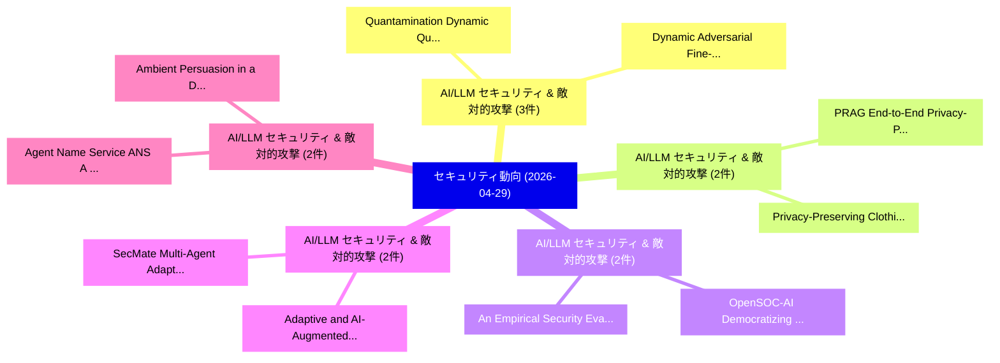

# 📅 02_daily: 日次エグゼクティブサマリー報告書 (2026-04-29)

**集計日時**: 2026-10-02 23:06:07 UTC  
**対象日付**: 2026-04-29  
**本日収集論文数**: 32 件  

---

## 💡 主要セキュリティ動向・脅威インサイト (Executive Insights)

本日の収集論文（計 32 件）において、以下の重点セキュリティ領域で活発な研究動向が確認されました：
- **AI/LLM セキュリティ & 敵対的攻撃** (3 件): 注目論文として 「Quantamination: Dynamic Quanti...」、「Dynamic Adversarial Fine-Tunin...」 等が発表され、実務防御および攻撃検証の進展が見られます。
- **AI/LLM セキュリティ & 敵対的攻撃** (2 件): 注目論文として 「Privacy-Preserving Clothing Cl...」、「PRAG: End-to-End Privacy-Prese...」 等が発表され、実務防御および攻撃検証の進展が見られます。
- **AI/LLM セキュリティ & 敵対的攻撃** (2 件): 注目論文として 「OpenSOC-AI: Democratizing Secu...」、「An Empirical Security Evaluati...」 等が発表され、実務防御および攻撃検証の進展が見られます。
- **AI/LLM セキュリティ & 敵対的攻撃** (2 件): 注目論文として 「SecMate: Multi-Agent Adaptive ...」、「Adaptive and AI-Augmented Secu...」 等が発表され、実務防御および攻撃検証の進展が見られます。
- **AI/LLM セキュリティ & 敵対的攻撃** (2 件): 注目論文として 「Agent Name Service (ANS): A Pr...」、「Ambient Persuasion in a Deploy...」 等が発表され、実務防御および攻撃検証の進展が見られます。

### 🗺️ 技術・脅威トピックマインドマップ

---

## 📌 日次セキュリティ論文一覧 (日本語表形式)

| No | arXiv ID | 論文タイトル (日本語訳) | 重要キーワード | 構造化エグゼクティブ要約 (背景・提案・影響) | 脅威分類 | 詳細リンク |
|---|---|---|---|---|---|---|
| 1 | `2604.26184v1` | [Privacy-Preserving Clothing Classification using Vision Transformer for Thermal Comfort Estimation（セキュリティ分析論文）](../../okf/papers/2026-04-29/2604.26184.md) | `Preserving Clothing Classification`, `Thermal Comfort Estimation`, `Vision Transformer` | 【提案】概要 (Overview & Key Finding) 本論文「Privacy-Preserving Clothing Classification using Vision...。実証評価により経営層・セキュリティ管理者向け推奨アクション (E... | `arXiv` | [arXiv](https://arxiv.org/abs/2604.26184v1) &#124; [OKF](../../okf/papers/2026-04-29/2604.26184.md) |
| 2 | `2604.26217v1` | [OpenSOC-AI: Democratizing Security Operations with Parameter Efficient LLM Log Analysis（セキュリティ分析論文）](../../okf/papers/2026-04-29/2604.26217.md) | `Democratizing Security Operations`, `Parameter Efficient`, `Chaitanya Vilas Garware` | 【提案】概要 (Overview & Key Finding) 本論文「OpenSOC-AI: Democratizing Security Operations with Para...。実証評価により経営層・セキュリティ管理者向け推奨アクション (E... | `arXiv` | [arXiv](https://arxiv.org/abs/2604.26217v1) &#124; [OKF](../../okf/papers/2026-04-29/2604.26217.md) |
| 3 | `2604.26219v1` | [eDySec: A Deep Learning-based Explainable Dynamic Analysis Framework for Detecting Malicious Packages in PyPI Ecosystem（セキュリティ分析論文）](../../okf/papers/2026-04-29/2604.26219.md) | `Detecting Malicious Packages`, `Deep Learning`, `Learning-based Explainable` | 【提案】概要 (Overview & Key Finding) 本論文「eDySec: A Deep Learning-based Explainable Dynamic Analy...。実証評価により経営層・セキュリティ管理者向け推奨アクション (E... | `arXiv` | [arXiv](https://arxiv.org/abs/2604.26219v1) &#124; [OKF](../../okf/papers/2026-04-29/2604.26219.md) |
| 4 | `2604.26235v1` | [LATTICE: Evaluating Decision Support Utility of Crypto Agents（セキュリティ分析論文）](../../okf/papers/2026-04-29/2604.26235.md) | `Evaluating Decision Support Utility`, `Crypto Agents`, `Aaron Chan` | 【提案】概要 (Overview & Key Finding) 本論文「LATTICE: Evaluating Decision Support Utility of Crypto ...。実証評価により経営層・セキュリティ管理者向け推奨アクション (E... | `arXiv` | [arXiv](https://arxiv.org/abs/2604.26235v1) &#124; [OKF](../../okf/papers/2026-04-29/2604.26235.md) |
| 5 | `2604.26274v1` | [Enforcing Benign Trajectories: A Behavioral Firewall for Structured-Workflow AI Agents（セキュリティ分析論文）](../../okf/papers/2026-04-29/2604.26274.md) | `Enforcing Benign Trajectories`, `Behavioral Firewall`, `Structured-Workflow AI` | 【提案】概要 (Overview & Key Finding) 本論文「Enforcing Benign Trajectories: A Behavioral Firewall fo...。実証評価により経営層・セキュリティ管理者向け推奨アクション (E... | `arXiv` | [arXiv](https://arxiv.org/abs/2604.26274v1) &#124; [OKF](../../okf/papers/2026-04-29/2604.26274.md) |
| 6 | `2604.26313v1` | [VulStyle: A Multi-Modal Pre-Training for Code Stylometry-Augmented 脆弱性検出](../../okf/papers/2026-04-29/2604.26313.md) | `Modal Pre`, `Code Stylometry`, `Multi-Modal Pre` | 【提案】概要 (Overview & Key Finding) 本論文「VulStyle: A Multi-Modal Pre-Training for Code Stylometr...。実証評価により経営層・セキュリティ管理者向け推奨アクション (E... | `arXiv` | [arXiv](https://arxiv.org/abs/2604.26313v1) &#124; [OKF](../../okf/papers/2026-04-29/2604.26313.md) |
| 7 | `2604.26339v1` | [Can Cross-Layer Design Bridge Security and Efficiency? A Robust Authentication Framework for Healthcare Information Exchange Systems（セキュリティ分析論文）](../../okf/papers/2026-04-29/2604.26339.md) | `Layer Design Bridge Security`, `Healthcare Information Exchange Systems`, `Can Cross` | 【提案】A Robust Authentication Framework for Healthcare Information Exchange Systems ### (日本語題...。実証評価により経営層・セキュリティ管理者向け推奨アクション (E... | `arXiv` | [arXiv](https://arxiv.org/abs/2604.26339v1) &#124; [OKF](../../okf/papers/2026-04-29/2604.26339.md) |
| 8 | `2604.26343v1` | [Taking a Bite Out of the Forbidden Fruit: Characterizing Third-Party Iranian iOS App Stores（セキュリティ分析論文）](../../okf/papers/2026-04-29/2604.26343.md) | `Forbidden Fruit`, `Characterizing Third`, `Party Iranian` | 【提案】概要 (Overview & Key Finding) 本論文「Taking a Bite Out of the Forbidden Fruit: Characterizin...。実証評価により経営層・セキュリティ管理者向け推奨アクション (E... | `arXiv` | [arXiv](https://arxiv.org/abs/2604.26343v1) &#124; [OKF](../../okf/papers/2026-04-29/2604.26343.md) |
| 9 | `2604.26394v1` | [SecMate: Multi-Agent Adaptive サイバーセキュリティ Troubleshooting with Tri-Context Personalization](../../okf/papers/2026-04-29/2604.26394.md) | `Context Personalization`, `Multi-Agent Adaptive`, `Tri-Context Personalization` | 【提案】概要 (Overview & Key Finding) 本論文「SecMate: Multi-Agent Adaptive サイバーセキュリティ Troubleshootin...。実証評価により経営層・セキュリティ管理者向け推奨アクション (E... | `arXiv` | [arXiv](https://arxiv.org/abs/2604.26394v1) &#124; [OKF](../../okf/papers/2026-04-29/2604.26394.md) |
| 10 | `2604.26413v1` | [Quantum Gatekeeper: Multi-Factor Context-Bound Image Steganography with VQC Based Key Derivation on Quantum Hardware（セキュリティ分析論文）](../../okf/papers/2026-04-29/2604.26413.md) | `Bound Image Steganography`, `Based Key Derivation`, `Quantum Gatekeeper` | 【提案】概要 (Overview & Key Finding) 本論文「量子 Gatekeeper: Multi-Factor Context-Bound Image Stegano...。実証評価により経営層・セキュリティ管理者向け推奨アクション (E... | `arXiv` | [arXiv](https://arxiv.org/abs/2604.26413v1) &#124; [OKF](../../okf/papers/2026-04-29/2604.26413.md) |
| 11 | `2604.26430v1` | [A Multi-Level Integrity Evaluation Framework for Quantum Circuits under Controlled Anomaly Injection（セキュリティ分析論文）](../../okf/papers/2026-04-29/2604.26430.md) | `Controlled Anomaly Injection`, `Multi-Level Integrity`, `Quantum Circuits` | 【提案】概要 (Overview & Key Finding) 本論文「A Multi-Level Integrity Evaluation Framework for 量子 Cir...。実証評価により経営層・セキュリティ管理者向け推奨アクション (E... | `arXiv` | [arXiv](https://arxiv.org/abs/2604.26430v1) &#124; [OKF](../../okf/papers/2026-04-29/2604.26430.md) |
| 12 | `2604.26467v1` | [Differentially Private Contrastive Learning via Bounding Group-level Contribution（セキュリティ分析論文）](../../okf/papers/2026-04-29/2604.26467.md) | `Differentially Private Contrastive Learning`, `Bounding Group`, `Group-level Contribution` | 【提案】概要 (Overview & Key Finding) 本論文「Differentially Private Contrastive Learning via Boundin...。実証評価により経営層・セキュリティ管理者向け推奨アクション (E... | `arXiv` | [arXiv](https://arxiv.org/abs/2604.26467v1) &#124; [OKF](../../okf/papers/2026-04-29/2604.26467.md) |
| 13 | `2604.26495v2` | [Beyond Code Reasoning: Specification-Anchored Auditing of Multi-Implementation Distributed Protocols（セキュリティ分析論文）](../../okf/papers/2026-04-29/2604.26495.md) | `Beyond Code Reasoning`, `Implementation Distributed Protocols`, `Anchored Auditing` | 【提案】概要 (Overview & Key Finding) 本論文「Beyond Code Reasoning: Specification-Anchored Auditing ...。実証評価により経営層・セキュリティ管理者向け推奨アクション (E... | `arXiv` | [arXiv](https://arxiv.org/abs/2604.26495v2) &#124; [OKF](../../okf/papers/2026-04-29/2604.26495.md) |
| 14 | `2604.26505v1` | [Quantamination: Dynamic Quantization Leaks Your Data Across the Batch（セキュリティ分析論文）](../../okf/papers/2026-04-29/2604.26505.md) | `Hanna Foerster`, `Ilia Shumailov`, `Cheng Zhang` | 【提案】概要 (Overview & Key Finding) 本論文「Quantamination: Dynamic Quantization Leaks Your Data Ac...。実証評価により経営層・セキュリティ管理者向け推奨アクション (E... | `arXiv` | [arXiv](https://arxiv.org/abs/2604.26505v1) &#124; [OKF](../../okf/papers/2026-04-29/2604.26505.md) |
| 15 | `2604.26506v2` | [SafeReview: Defending LLM-based Review Systems Against Adversarial Hidden Prompts（セキュリティ分析論文）](../../okf/papers/2026-04-29/2604.26506.md) | `LLM-based Review`, `Yuan Xin`, `Yixuan Weng` | 【提案】概要 (Overview & Key Finding) 本論文「SafeReview: Defending LLM-based Review Systems Against ...。実証評価により経営層・セキュリティ管理者向け推奨アクション (E... | `arXiv` | [arXiv](https://arxiv.org/abs/2604.26506v2) &#124; [OKF](../../okf/papers/2026-04-29/2604.26506.md) |
| 16 | `2604.26511v1` | [Tatemae: Detecting Alignment Faking via Tool Selection in LLMs（セキュリティ分析論文）](../../okf/papers/2026-04-29/2604.26511.md) | `Detecting Alignment Faking`, `Tool Selection`, `Matteo Leonesi` | 【提案】概要 (Overview & Key Finding) 本論文「Tatemae: Detecting Alignment Faking via Tool Selection ...。実証評価により経営層・セキュリティ管理者向け推奨アクション (E... | `arXiv` | [arXiv](https://arxiv.org/abs/2604.26511v1) &#124; [OKF](../../okf/papers/2026-04-29/2604.26511.md) |
| 17 | `2604.26525v2` | [PRAG: End-to-End Privacy-Preserving Retrieval-Augmented Generation（セキュリティ分析論文）](../../okf/papers/2026-04-29/2604.26525.md) | `End Privacy`, `Preserving Retrieval`, `Augmented Generation` | 【提案】概要 (Overview & Key Finding) 本論文「PRAG: End-to-End Privacy-Preserving Retrieval-Augmented...。実証評価により経営層・セキュリティ管理者向け推奨アクション (E... | `arXiv` | [arXiv](https://arxiv.org/abs/2604.26525v2) &#124; [OKF](../../okf/papers/2026-04-29/2604.26525.md) |
| 18 | `2604.26536v1` | [Preventing Distinguishability between Multiplication and Squaring Operations（セキュリティ分析論文）](../../okf/papers/2026-04-29/2604.26536.md) | `Preventing Distinguishability`, `Squaring Operations`, `Alkistis Aikaterini Sigourou` | 【提案】概要 (Overview & Key Finding) 本論文「Preventing Distinguishability between Multiplication an...。実証評価により経営層・セキュリティ管理者向け推奨アクション (E... | `arXiv` | [arXiv](https://arxiv.org/abs/2604.26536v1) &#124; [OKF](../../okf/papers/2026-04-29/2604.26536.md) |
| 19 | `2604.26736v1` | [Catching the Fly: Practical Challenges in Making Blockchain FlyClient Real（セキュリティ分析論文）](../../okf/papers/2026-04-29/2604.26736.md) | `Practical Challenges`, `Making Blockchain`, `Pericle Perazzo` | 【提案】概要 (Overview & Key Finding) 本論文「Catching the Fly: Practical Challenges in Making Blockc...。実証評価により経営層・セキュリティ管理者向け推奨アクション (E... | `arXiv` | [arXiv](https://arxiv.org/abs/2604.26736v1) &#124; [OKF](../../okf/papers/2026-04-29/2604.26736.md) |
| 20 | `2604.26997v1` | [Agent Name Service (ANS): A Proof-of-Concept Trust Layer for Secure AI Agent Discovery, Identity, and Governance in Kubernetes（セキュリティ分析論文）](../../okf/papers/2026-04-29/2604.26997.md) | `Agent Name Service`, `Concept Trust Layer`, `Agent Discovery` | 【提案】概要 (Overview & Key Finding) 本論文「Agent Name Service (ANS): A Proof-of-Concept Trust Laye...。実証評価により経営層・セキュリティ管理者向け推奨アクション (E... | `arXiv` | [arXiv](https://arxiv.org/abs/2604.26997v1) &#124; [OKF](../../okf/papers/2026-04-29/2604.26997.md) |
| 21 | `2604.27000v1` | [Adaptive and AI-Augmented Security Testing: A Systematic Survey of Program Analysis, Feedback-Driven Testing, and Hybrid Learning-Based Approaches（セキュリティ分析論文）](../../okf/papers/2026-04-29/2604.27000.md) | `Augmented Security Testing`, `Systematic Survey`, `Driven Testing` | 【提案】概要 (Overview & Key Finding) 本論文「Adaptive and AI-Augmented Security Testing: A Systemati...。実証評価により経営層・セキュリティ管理者向け推奨アクション (E... | `arXiv` | [arXiv](https://arxiv.org/abs/2604.27000v1) &#124; [OKF](../../okf/papers/2026-04-29/2604.27000.md) |
| 22 | `2604.27001v1` | [An Empirical Security Evaluation of LLM-Generated Cryptographic Rust Code（セキュリティ分析論文）](../../okf/papers/2026-04-29/2604.27001.md) | `Generated Cryptographic Rust Code`, `LLM-Generated Cryptographic`, `Mohamed Elsayed` | 【提案】概要 (Overview & Key Finding) 本論文「An Empirical Security Evaluation of LLM-Generated Crypt...。実証評価により経営層・セキュリティ管理者向け推奨アクション (E... | `arXiv` | [arXiv](https://arxiv.org/abs/2604.27001v1) &#124; [OKF](../../okf/papers/2026-04-29/2604.27001.md) |
| 23 | `2604.27002v1` | [Membership Inference Attacks Against Video 大規模言語モデル](../../okf/papers/2026-04-29/2604.27002.md) | `Wei Song`, `Yuxin Cao`, `Ziqi Ding` | 【提案】概要 (Overview & Key Finding) 本論文「Membership Inference Attacks Against Video 大規模言語モデル」（原題...。実証評価により経営層・セキュリティ管理者向け推奨アクション (E... | `arXiv` | [arXiv](https://arxiv.org/abs/2604.27002v1) &#124; [OKF](../../okf/papers/2026-04-29/2604.27002.md) |
| 24 | `2604.27014v1` | [Fidelity, Diversity, and Privacy: A Multi-Dimensional LLM Evaluation for Clinical Data Augmentation（セキュリティ分析論文）](../../okf/papers/2026-04-29/2604.27014.md) | `Clinical Data Augmentation`, `Multi-Dimensional LLM`, `Guillermo Iglesias` | 【提案】概要 (Overview & Key Finding) 本論文「Fidelity, Diversity, and Privacy: A Multi-Dimensional L...。実証評価により経営層・セキュリティ管理者向け推奨アクション (E... | `arXiv` | [arXiv](https://arxiv.org/abs/2604.27014v1) &#124; [OKF](../../okf/papers/2026-04-29/2604.27014.md) |
| 25 | `2604.27019v3` | [Dynamic Adversarial Fine-Tuning Reorganizes Refusal Geometry（セキュリティ分析論文）](../../okf/papers/2026-04-29/2604.27019.md) | `Tuning Reorganizes Refusal Geometry`, `Dynamic Adversarial Fine`, `Fine-Tuning Reorganizes` | 【提案】概要 (Overview & Key Finding) 本論文「Dynamic Adversarial Fine-Tuning Reorganizes Refusal Geo...。実証評価により経営層・セキュリティ管理者向け推奨アクション (E... | `arXiv` | [arXiv](https://arxiv.org/abs/2604.27019v3) &#124; [OKF](../../okf/papers/2026-04-29/2604.27019.md) |
| 26 | `2604.27143v2` | [Enhancing Linux Privilege Escalation Attack Capabilities of Local LLMエージェント](../../okf/papers/2026-04-29/2604.27143.md) | `Enhancing Linux Privilege Escalation Attack Capabilities`, `Benjamin Probst`, `Andreas Happe` | 【提案】概要 (Overview & Key Finding) 本論文「Enhancing Linux 権限昇格 Attack Capabilities of Local LLMエー...。実証評価により経営層・セキュリティ管理者向け推奨アクション (E... | `arXiv` | [arXiv](https://arxiv.org/abs/2604.27143v2) &#124; [OKF](../../okf/papers/2026-04-29/2604.27143.md) |
| 27 | `2604.27153v1` | [Formulating Subgroup Discovery as a Quantum Optimization Problem for Network Security（セキュリティ分析論文）](../../okf/papers/2026-04-29/2604.27153.md) | `Formulating Subgroup Discovery`, `Quantum Optimization Problem`, `Network Security` | 【提案】概要 (Overview & Key Finding) 本論文「Formulating Subgroup Discovery as a 量子 Optimization Pro...。実証評価により経営層・セキュリティ管理者向け推奨アクション (E... | `arXiv` | [arXiv](https://arxiv.org/abs/2604.27153v1) &#124; [OKF](../../okf/papers/2026-04-29/2604.27153.md) |
| 28 | `2604.27202v1` | [Indirect Prompt Injection in the Wild: Prevalence, Techniques, and Objectivesの実証研究](../../okf/papers/2026-04-29/2604.27202.md) | `Indirect Prompt Injection`, `Soheil Khodayari`, `Xuenan Zhang` | 【提案】概要 (Overview & Key Finding) 本論文「Indirect プロンプトインジェクション in the Wild: Prevalence, Techniq...。実証評価により経営層・セキュリティ管理者向け推奨アクション (E... | `arXiv` | [arXiv](https://arxiv.org/abs/2604.27202v1) &#124; [OKF](../../okf/papers/2026-04-29/2604.27202.md) |
| 29 | `2604.27238v1` | [SafeTune: Mitigating Data Poisoning in LLM Fine-Tuning for RTL Code Generation（セキュリティ分析論文）](../../okf/papers/2026-04-29/2604.27238.md) | `Mitigating Data Poisoning`, `Code Generation`, `Mahshid Rezakhani` | 【提案】概要 (Overview & Key Finding) 本論文「SafeTune: Mitigating Data Poisoning in LLM Fine-Tuning ...。実証評価により経営層・セキュリティ管理者向け推奨アクション (E... | `arXiv` | [arXiv](https://arxiv.org/abs/2604.27238v1) &#124; [OKF](../../okf/papers/2026-04-29/2604.27238.md) |
| 30 | `2604.27267v2` | [From Prompt to Physical Actuation: Holistic Threat Modeling of LLM-Enabled Robotic Systems（セキュリティ分析論文）](../../okf/papers/2026-04-29/2604.27267.md) | `Holistic Threat Modeling`, `Enabled Robotic Systems`, `Physical Actuation` | 【提案】概要 (Overview & Key Finding) 本論文「From Prompt to Physical Actuation: Holistic 脅威 Modeling...。実証評価により経営層・セキュリティ管理者向け推奨アクション (E... | `arXiv` | [arXiv](https://arxiv.org/abs/2604.27267v2) &#124; [OKF](../../okf/papers/2026-04-29/2604.27267.md) |
| 31 | `2605.00055v1` | [Ambient Persuasion in a Deployed AI Agent: Unauthorized Escalation Following Routine Non-Adversarial Content Exposure（セキュリティ分析論文）](../../okf/papers/2026-04-29/2605.00055.md) | `Unauthorized Escalation Following Routine Non`, `Adversarial Content Exposure`, `Ambient Persuasion` | 【提案】概要 (Overview & Key Finding) 本論文「Ambient Persuasion in a Deployed AI Agent: Unauthorized...。実証評価により経営層・セキュリティ管理者向け推奨アクション (E... | `arXiv` | [arXiv](https://arxiv.org/abs/2605.00055v1) &#124; [OKF](../../okf/papers/2026-04-29/2605.00055.md) |
| 32 | `2605.21497v1` | [Autonomous LLMエージェント & CTFs: A Second Look](../../okf/papers/2026-04-29/2605.21497.md) | `Second Look`, `Thanh Minh Bui`, `Youness Bouchari` | 【提案】概要 (Overview & Key Finding) 本論文「Autonomous LLMエージェント & CTFs: A Second Look」（原題: Autonom...。実証評価により経営層・セキュリティ管理者向け推奨アクション (E... | `arXiv` | [arXiv](https://arxiv.org/abs/2605.21497v1) &#124; [OKF](../../okf/papers/2026-04-29/2605.21497.md) |

