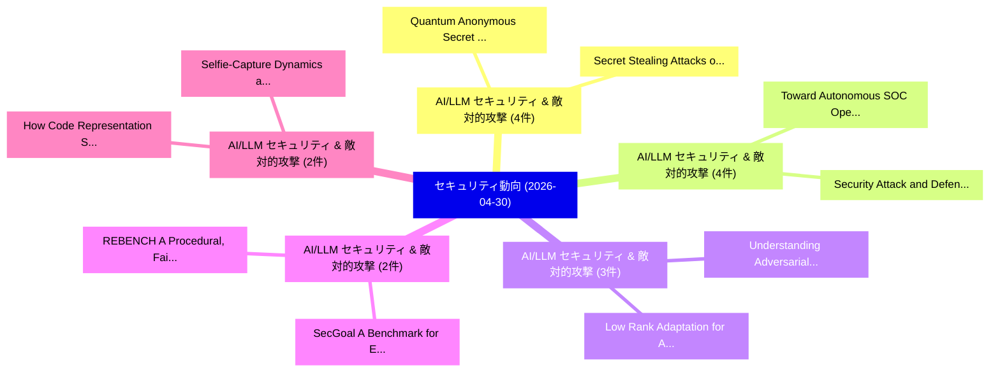

# 📅 02_daily: 日次エグゼクティブサマリー報告書 (2026-04-30)

**集計日時**: 2026-10-02 23:06:07 UTC  
**対象日付**: 2026-04-30  
**本日収集論文数**: 39 件  

---

## 💡 主要セキュリティ動向・脅威インサイト (Executive Insights)

本日の収集論文（計 39 件）において、以下の重点セキュリティ領域で活発な研究動向が確認されました：
- **AI/LLM セキュリティ & 敵対的攻撃** (4 件): 注目論文として 「Quantum Anonymous Secret Shari...」、「Secret Stealing Attacks on Loc...」 等が発表され、実務防御および攻撃検証の進展が見られます。
- **AI/LLM セキュリティ & 敵対的攻撃** (4 件): 注目論文として 「Toward Autonomous SOC Operatio...」、「Security Attack and Defense St...」 等が発表され、実務防御および攻撃検証の進展が見られます。
- **AI/LLM セキュリティ & 敵対的攻撃** (3 件): 注目論文として 「Understanding Adversarial Tran...」、「Low Rank Adaptation for Advers...」 等が発表され、実務防御および攻撃検証の進展が見られます。
- **AI/LLM セキュリティ & 敵対的攻撃** (2 件): 注目論文として 「REBENCH: A Procedural, Fair-by...」、「SecGoal: A Benchmark for Extra...」 等が発表され、実務防御および攻撃検証の進展が見られます。
- **AI/LLM セキュリティ & 敵対的攻撃** (2 件): 注目論文として 「How Code Representation Shapes...」、「Selfie-Capture Dynamics as an ...」 等が発表され、実務防御および攻撃検証の進展が見られます。

### 🗺️ 技術・脅威トピックマインドマップ

---

## 📌 日次セキュリティ論文一覧 (日本語表形式)

| No | arXiv ID | 論文タイトル (日本語訳) | 重要キーワード | 構造化エグゼクティブ要約 (背景・提案・影響) | 脅威分類 | 詳細リンク |
|---|---|---|---|---|---|---|
| 1 | `2604.27284v1` | [Quantum Anonymous Secret Sharing with Permutation Invariant Codes（セキュリティ分析論文）](../../okf/papers/2026-04-30/2604.27284.md) | `Quantum Anonymous Secret Sharing`, `Permutation Invariant Codes`, `Varin Sikand` | 【提案】概要 (Overview & Key Finding) 本論文「量子 Anonymous Secret Sharing with Permutation Invariant ...。実証評価により経営層・セキュリティ管理者向け推奨アクション (E... | `arXiv` | [arXiv](https://arxiv.org/abs/2604.27284v1) &#124; [OKF](../../okf/papers/2026-04-30/2604.27284.md) |
| 2 | `2604.27302v1` | [Static Attribution of Android Residential Proxy Malware Using Graph Kernels（セキュリティ分析論文）](../../okf/papers/2026-04-30/2604.27302.md) | `Android Residential Proxy Malware Using Graph Kernels`, `Static Attribution`, `Peter Clark` | 【提案】概要 (Overview & Key Finding) 本論文「Static Attribution of Android Residential Proxy マルウェア U...。実証評価により経営層・セキュリティ管理者向け推奨アクション (E... | `arXiv` | [arXiv](https://arxiv.org/abs/2604.27302v1) &#124; [OKF](../../okf/papers/2026-04-30/2604.27302.md) |
| 3 | `2604.27319v1` | [REBENCH: A Procedural, Fair-by-Construction Benchmark for LLMs on Stripped-Binary Types and Names (Extended Version)（セキュリティ分析論文）](../../okf/papers/2026-04-30/2604.27319.md) | `Construction Benchmark`, `Binary Types`, `Extended Version` | 【提案】概要 (Overview & Key Finding) 本論文「REBENCH: A Procedural, Fair-by-Construction Benchmark f...。実証評価により経営層・セキュリティ管理者向け推奨アクション (E... | `arXiv` | [arXiv](https://arxiv.org/abs/2604.27319v1) &#124; [OKF](../../okf/papers/2026-04-30/2604.27319.md) |
| 4 | `2604.27321v1` | [Toward Autonomous SOC Operations: End-to-End LLM Framework for Threat Detection, Query Generation, and Resolution in Security Operations（セキュリティ分析論文）](../../okf/papers/2026-04-30/2604.27321.md) | `Toward Autonomous`, `Threat Detection`, `Query Generation` | 【提案】概要 (Overview & Key Finding) 本論文「Toward Autonomous SOC Operations: End-to-End LLM Framew...。実証評価により経営層・セキュリティ管理者向け推奨アクション (E... | `arXiv` | [arXiv](https://arxiv.org/abs/2604.27321v1) &#124; [OKF](../../okf/papers/2026-04-30/2604.27321.md) |
| 5 | `2604.27414v1` | [Understanding Adversarial Transferability in Vision-Language Models for Autonomous Driving: A Cross-Architecture Analysis（セキュリティ分析論文）](../../okf/papers/2026-04-30/2604.27414.md) | `Understanding Adversarial Transferability`, `Language Models`, `Autonomous Driving` | 【提案】概要 (Overview & Key Finding) 本論文「Understanding Adversarial Transferability in Vision-Lan...。実証評価により経営層・セキュリティ管理者向け推奨アクション (E... | `arXiv` | [arXiv](https://arxiv.org/abs/2604.27414v1) &#124; [OKF](../../okf/papers/2026-04-30/2604.27414.md) |
| 6 | `2604.27426v1` | [Secret Stealing Attacks on Local LLM Fine-Tuning through Supply-Chain Model Code Backdoors（セキュリティ分析論文）](../../okf/papers/2026-04-30/2604.27426.md) | `Chain Model Code Backdoors`, `Secret Stealing Attacks`, `Supply-Chain Model` | 【提案】概要 (Overview & Key Finding) 本論文「Secret Stealing Attacks on Local LLM Fine-Tuning throug...。実証評価により経営層・セキュリティ管理者向け推奨アクション (E... | `arXiv` | [arXiv](https://arxiv.org/abs/2604.27426v1) &#124; [OKF](../../okf/papers/2026-04-30/2604.27426.md) |
| 7 | `2604.27434v1` | [AdaBFL: Multi-Layer Defensive Adaptive Aggregation for Bzantine-Robust 連合学習](../../okf/papers/2026-04-30/2604.27434.md) | `Layer Defensive Adaptive Aggregation`, `Multi-Layer Defensive`, `Robust Federated Learning` | 【提案】概要 (Overview & Key Finding) 本論文「AdaBFL: Multi-Layer Defensive Adaptive Aggregation for ...。実証評価により経営層・セキュリティ管理者向け推奨アクション (E... | `arXiv` | [arXiv](https://arxiv.org/abs/2604.27434v1) &#124; [OKF](../../okf/papers/2026-04-30/2604.27434.md) |
| 8 | `2604.27438v2` | [Tracking Conversations: Measuring Content and Identity Exposure on AI Chatbots（セキュリティ分析論文）](../../okf/papers/2026-04-30/2604.27438.md) | `Tracking Conversations`, `Measuring Content`, `Identity Exposure` | 【提案】概要 (Overview & Key Finding) 本論文「Tracking Conversations: Measuring Content and Identity ...。実証評価により経営層・セキュリティ管理者向け推奨アクション (E... | `arXiv` | [arXiv](https://arxiv.org/abs/2604.27438v2) &#124; [OKF](../../okf/papers/2026-04-30/2604.27438.md) |
| 9 | `2604.27456v3` | [Federated Generation of Synthetic RNA-seq Data（セキュリティ分析論文）](../../okf/papers/2026-04-30/2604.27456.md) | `Federated Generation`, `RNA-seq Data`, `Martine De Cock` | 【提案】概要 (Overview & Key Finding) 本論文「Federated Generation of Synthetic RNA-seq Data（セキュリティ分析...。実証評価により経営層・セキュリティ管理者向け推奨アクション (E... | `arXiv` | [arXiv](https://arxiv.org/abs/2604.27456v3) &#124; [OKF](../../okf/papers/2026-04-30/2604.27456.md) |
| 10 | `2604.27464v1` | [Security Attack and Defense Strategies for Autonomous Agent Frameworks: A Layered Review with OpenClaw as a Case Study（セキュリティ分析論文）](../../okf/papers/2026-04-30/2604.27464.md) | `Autonomous Agent Frameworks`, `Security Attack`, `Defense Strategies` | 【提案】概要 (Overview & Key Finding) 本論文「Security Attack and Defense Strategies for Autonomous A...。実証評価により経営層・セキュリティ管理者向け推奨アクション (E... | `arXiv` | [arXiv](https://arxiv.org/abs/2604.27464v1) &#124; [OKF](../../okf/papers/2026-04-30/2604.27464.md) |
| 11 | `2604.27487v1` | [Low Rank Adaptation for Adversarial Perturbation（セキュリティ分析論文）](../../okf/papers/2026-04-30/2604.27487.md) | `Low Rank Adaptation`, `Adversarial Perturbation`, `Han Liu` | 【提案】概要 (Overview & Key Finding) 本論文「Low Rank Adaptation for Adversarial Perturbation（セキュリティ...。実証評価により経営層・セキュリティ管理者向け推奨アクション (E... | `arXiv` | [arXiv](https://arxiv.org/abs/2604.27487v1) &#124; [OKF](../../okf/papers/2026-04-30/2604.27487.md) |
| 12 | `2604.27497v1` | [SST-Guard: Detecting and Characterizing Server-Side Google Analytics in the Wild（セキュリティ分析論文）](../../okf/papers/2026-04-30/2604.27497.md) | `Side Google Analytics`, `Characterizing Server`, `Server-Side Google` | 【提案】概要 (Overview & Key Finding) 本論文「SST-Guard: Detecting and Characterizing Server-Side Goo...。実証評価により経営層・セキュリティ管理者向け推奨アクション (E... | `arXiv` | [arXiv](https://arxiv.org/abs/2604.27497v1) &#124; [OKF](../../okf/papers/2026-04-30/2604.27497.md) |
| 13 | `2604.27560v1` | [SBN Explorer: Cryptographic Boolean Networksの実証研究](../../okf/papers/2026-04-30/2604.27560.md) | `Cryptographic Boolean Networks`, `Cryptographic Boolean`, `Arnaud Valence` | 【提案】概要 (Overview & Key Finding) 本論文「SBN Explorer: Cryptographic Boolean Networksの実証研究」（原題: ...。実証評価により経営層・セキュリティ管理者向け推奨アクション (E... | `arXiv` | [arXiv](https://arxiv.org/abs/2604.27560v1) &#124; [OKF](../../okf/papers/2026-04-30/2604.27560.md) |
| 14 | `2604.27601v2` | [SecGoal: A Benchmark for Extracting Formalizable Security Goals from Protocol Documents（セキュリティ分析論文）](../../okf/papers/2026-04-30/2604.27601.md) | `Extracting Formalizable Security Goals`, `Protocol Documents`, `Dawei Huang` | 【提案】概要 (Overview & Key Finding) 本論文「SecGoal: A Benchmark for Extracting Formalizable Securi...。実証評価により経営層・セキュリティ管理者向け推奨アクション (E... | `arXiv` | [arXiv](https://arxiv.org/abs/2604.27601v2) &#124; [OKF](../../okf/papers/2026-04-30/2604.27601.md) |
| 15 | `2604.27666v1` | [VOW: Verifiable and Oblivious Watermark Detection for 大規模言語モデル](../../okf/papers/2026-04-30/2604.27666.md) | `Oblivious Watermark Detection`, `Large Language Models`, `Xiaokun Luan` | 【提案】概要 (Overview & Key Finding) 本論文「VOW: Verifiable and Oblivious Watermark Detection for 大...。実証評価により経営層・セキュリティ管理者向け推奨アクション (E... | `arXiv` | [arXiv](https://arxiv.org/abs/2604.27666v1) &#124; [OKF](../../okf/papers/2026-04-30/2604.27666.md) |
| 16 | `2604.27674v1` | [One Single Hub Text Breaks CLIP: Identifying Vulnerabilities in Cross-Modal Encoders via Hubness（セキュリティ分析論文）](../../okf/papers/2026-04-30/2604.27674.md) | `One Single Hub Text Breaks`, `Identifying Vulnerabilities`, `Modal Encoders` | 【提案】概要 (Overview & Key Finding) 本論文「One Single Hub Text Breaks CLIP: Identifying Vulnerabil...。実証評価により経営層・セキュリティ管理者向け推奨アクション (E... | `arXiv` | [arXiv](https://arxiv.org/abs/2604.27674v1) &#124; [OKF](../../okf/papers/2026-04-30/2604.27674.md) |
| 17 | `2604.27694v2` | [The Satoshi Overhang: Why the Bear Case is Bounded（セキュリティ分析論文）](../../okf/papers/2026-04-30/2604.27694.md) | `Bear Case`, `Raw Meta`, `Executive Summary` | 【提案】概要 (Overview & Key Finding) 本論文「The Satoshi Overhang: Why the Bear Case is Bounded（セキュリ...。実証評価によりUlrich - **公開日時**: `2026-... | `arXiv` | [arXiv](https://arxiv.org/abs/2604.27694v2) &#124; [OKF](../../okf/papers/2026-04-30/2604.27694.md) |
| 18 | `2604.27714v1` | [How Code Representation Shapes False-Positive Dynamics in Cross-Language LLM 脆弱性検出](../../okf/papers/2026-04-30/2604.27714.md) | `Positive Dynamics`, `False-Positive Dynamics`, `Cross-Language LLM` | 【提案】概要 (Overview & Key Finding) 本論文「How Code Representation Shapes False-Positive Dynamics ...。実証評価により経営層・セキュリティ管理者向け推奨アクション (E... | `arXiv` | [arXiv](https://arxiv.org/abs/2604.27714v1) &#124; [OKF](../../okf/papers/2026-04-30/2604.27714.md) |
| 19 | `2604.27801v1` | [Variational and Majorization Principles in Lattice Reduction（セキュリティ分析論文）](../../okf/papers/2026-04-30/2604.27801.md) | `Majorization Principles`, `Lattice Reduction`, `Florina Almenares Mendoza` | 【提案】概要 (Overview & Key Finding) 本論文「Variational and Majorization Principles in Lattice Redu...。実証評価により経営層・セキュリティ管理者向け推奨アクション (E... | `arXiv` | [arXiv](https://arxiv.org/abs/2604.27801v1) &#124; [OKF](../../okf/papers/2026-04-30/2604.27801.md) |
| 20 | `2604.27804v1` | [Machine Unlearning for Class Removal through SISA-based Deep Neural Network Architectures（セキュリティ分析論文）](../../okf/papers/2026-04-30/2604.27804.md) | `Deep Neural Network Architectures`, `Machine Unlearning`, `Class Removal` | 【提案】概要 (Overview & Key Finding) 本論文「Machine Unlearning for Class Removal through SISA-based...。実証評価により経営層・セキュリティ管理者向け推奨アクション (E... | `arXiv` | [arXiv](https://arxiv.org/abs/2604.27804v1) &#124; [OKF](../../okf/papers/2026-04-30/2604.27804.md) |
| 21 | `2604.27818v1` | [MASCing: Configurable Mixture-of-Experts Behavior via Activation Steering Masks（セキュリティ分析論文）](../../okf/papers/2026-04-30/2604.27818.md) | `Activation Steering Masks`, `Configurable Mixture`, `Experts Behavior` | 【提案】概要 (Overview & Key Finding) 本論文「MASCing: Configurable Mixture-of-Experts Behavior via A...。実証評価により経営層・セキュリティ管理者向け推奨アクション (E... | `arXiv` | [arXiv](https://arxiv.org/abs/2604.27818v1) &#124; [OKF](../../okf/papers/2026-04-30/2604.27818.md) |
| 22 | `2604.27830v1` | [WOOTdroid: Whole-system Online On-device Tracing for Android（セキュリティ分析論文）](../../okf/papers/2026-04-30/2604.27830.md) | `Whole-system Online`, `On-device Tracing`, `Simon Althaus` | 【提案】概要 (Overview & Key Finding) 本論文「WOOTdroid: Whole-system Online On-device Tracing for An...。実証評価により経営層・セキュリティ管理者向け推奨アクション (E... | `arXiv` | [arXiv](https://arxiv.org/abs/2604.27830v1) &#124; [OKF](../../okf/papers/2026-04-30/2604.27830.md) |
| 23 | `2604.27861v1` | [TwinGate: Stateful Defense against Decompositional Jailbreaks in Untraceable Traffic via Asymmetric Contrastive Learning（セキュリティ分析論文）](../../okf/papers/2026-04-30/2604.27861.md) | `Asymmetric Contrastive Learning`, `Stateful Defense`, `Decompositional Jailbreaks` | 【提案】概要 (Overview & Key Finding) 本論文「TwinGate: Stateful Defense against Decompositional ジェイル...。実証評価により経営層・セキュリティ管理者向け推奨アクション (E... | `arXiv` | [arXiv](https://arxiv.org/abs/2604.27861v1) &#124; [OKF](../../okf/papers/2026-04-30/2604.27861.md) |
| 24 | `2604.28129v1` | [Latent Adversarial Detection: Adaptive Probing of LLM Activations for Multi-Turn Attack Detection（セキュリティ分析論文）](../../okf/papers/2026-04-30/2604.28129.md) | `Latent Adversarial Detection`, `Turn Attack Detection`, `Adaptive Probing` | 【提案】概要 (Overview & Key Finding) 本論文「Latent Adversarial Detection: Adaptive Probing of LLM A...。実証評価により経営層・セキュリティ管理者向け推奨アクション (E... | `arXiv` | [arXiv](https://arxiv.org/abs/2604.28129v1) &#124; [OKF](../../okf/papers/2026-04-30/2604.28129.md) |
| 25 | `2604.28157v1` | [FlashRT: Computationally and Memory Efficient Red-Teaming for Prompt Injection and Knowledge Corruptionに向けて](../../okf/papers/2026-04-30/2604.28157.md) | `Memory Efficient Red`, `Prompt Injection`, `Knowledge Corruption` | 【提案】概要 (Overview & Key Finding) 本論文「FlashRT: Computationally and Memory Efficient Red-Teami...。実証評価により経営層・セキュリティ管理者向け推奨アクション (E... | `arXiv` | [arXiv](https://arxiv.org/abs/2604.28157v1) &#124; [OKF](../../okf/papers/2026-04-30/2604.28157.md) |
| 26 | `2605.00065v1` | [Lightweight Tamper-Evident Log Integrity Verification for IoT Edge Environments: A Merkle Tree Pipeline with Adaptive Chunking（セキュリティ分析論文）](../../okf/papers/2026-04-30/2605.00065.md) | `Evident Log Integrity Verification`, `Merkle Tree Pipeline`, `Lightweight Tamper` | 【提案】概要 (Overview & Key Finding) 本論文「Lightweight Tamper-Evident Log Integrity Verification f...。実証評価により経営層・セキュリティ管理者向け推奨アクション (E... | `arXiv` | [arXiv](https://arxiv.org/abs/2605.00065v1) &#124; [OKF](../../okf/papers/2026-04-30/2605.00065.md) |
| 27 | `2605.00071v1` | [Compliance-Aware Agentic Payments on Stablecoin Rails（セキュリティ分析論文）](../../okf/papers/2026-04-30/2605.00071.md) | `Aware Agentic Payments`, `Stablecoin Rails`, `Compliance-Aware Agentic` | 【提案】概要 (Overview & Key Finding) 本論文「Compliance-Aware Agentic Payments on Stablecoin Rails（セ...。実証評価により経営層・セキュリティ管理者向け推奨アクション (E... | `arXiv` | [arXiv](https://arxiv.org/abs/2605.00071v1) &#124; [OKF](../../okf/papers/2026-04-30/2605.00071.md) |
| 28 | `2605.00072v1` | [XekRung Technical Report（セキュリティ分析論文）](../../okf/papers/2026-04-30/2605.00072.md) | `Technical Report`, `Kaiwen Lv Kacuila`, `Jiutian Zeng` | 【提案】概要 (Overview & Key Finding) 本論文「XekRung Technical Report（セキュリティ分析論文）」（原題: XekRung Techn...。実証評価により経営層・セキュリティ管理者向け推奨アクション (E... | `arXiv` | [arXiv](https://arxiv.org/abs/2605.00072v1) &#124; [OKF](../../okf/papers/2026-04-30/2605.00072.md) |
| 29 | `2605.00076v1` | [zkSBOM: Privacy-Preserving SBOM Sharing with Zero-Knowledge Sets（セキュリティ分析論文）](../../okf/papers/2026-04-30/2605.00076.md) | `Knowledge Sets`, `Privacy-Preserving SBOM`, `Zero-Knowledge Sets` | 【提案】概要 (Overview & Key Finding) 本論文「zkSBOM: Privacy-Preserving SBOM Sharing with Zero-Knowl...。実証評価により経営層・セキュリティ管理者向け推奨アクション (E... | `arXiv` | [arXiv](https://arxiv.org/abs/2605.00076v1) &#124; [OKF](../../okf/papers/2026-04-30/2605.00076.md) |
| 30 | `2605.00081v1` | [Alignment Contracts for Agentic Security Systems（セキュリティ分析論文）](../../okf/papers/2026-04-30/2605.00081.md) | `Agentic Security Systems`, `Alignment Contracts`, `Isaac David` | 【提案】概要 (Overview & Key Finding) 本論文「Alignment Contracts for Agentic Security Systems（セキュリティ...。実証評価により経営層・セキュリティ管理者向け推奨アクション (E... | `arXiv` | [arXiv](https://arxiv.org/abs/2605.00081v1) &#124; [OKF](../../okf/papers/2026-04-30/2605.00081.md) |
| 31 | `2605.00120v1` | [GAFSV-Net: A Vision Framework for Online Signature Verification（セキュリティ分析論文）](../../okf/papers/2026-04-30/2605.00120.md) | `Online Signature Verification`, `Himanshu Singhal`, `Suresh Sundaram` | 【提案】概要 (Overview & Key Finding) 本論文「GAFSV-Net: A Vision Framework for Online Signature Veri...。実証評価により経営層・セキュリティ管理者向け推奨アクション (E... | `arXiv` | [arXiv](https://arxiv.org/abs/2605.00120v1) &#124; [OKF](../../okf/papers/2026-04-30/2605.00120.md) |
| 32 | `2605.00156v1` | [RoboKA: KAN Informed Multimodal Learning for RoboCall Surveillance System（セキュリティ分析論文）](../../okf/papers/2026-04-30/2605.00156.md) | `Informed Multimodal Learning`, `Surveillance System`, `Aditya Kumar Sinha` | 【提案】概要 (Overview & Key Finding) 本論文「RoboKA: KAN Informed Multimodal Learning for RoboCall S...。実証評価により経営層・セキュリティ管理者向け推奨アクション (E... | `arXiv` | [arXiv](https://arxiv.org/abs/2605.00156v1) &#124; [OKF](../../okf/papers/2026-04-30/2605.00156.md) |
| 33 | `2605.00183v1` | [I can't recognize (yet): Delayed Rendering to Defeat Visual Phishing Detectors（セキュリティ分析論文）](../../okf/papers/2026-04-30/2605.00183.md) | `Defeat Visual Phishing Detectors`, `Delayed Rendering`, `Cristiano Alex Rado` | 【提案】背景とセキュリティ上の課題 (Background & Problem) 本研究はサイバー脅威環境におけるセキュリティ構造・脆弱性の検証を目的としています。(主要検出項目: ...。実証評価により経営層・セキュリティ管理者向け推奨アクション (E... | `arXiv` | [arXiv](https://arxiv.org/abs/2605.00183v1) &#124; [OKF](../../okf/papers/2026-04-30/2605.00183.md) |
| 34 | `2605.00218v1` | [Selfie-Capture Dynamics as an Auxiliary Signal Against Deepfakes and Injection Attacks for Mobile Identity Verification（セキュリティ分析論文）](../../okf/papers/2026-04-30/2605.00218.md) | `Mobile Identity Verification`, `Capture Dynamics`, `Injection Attacks` | 【提案】概要 (Overview & Key Finding) 本論文「Selfie-Capture Dynamics as an Auxiliary Signal Against ...。実証評価により経営層・セキュリティ管理者向け推奨アクション (E... | `arXiv` | [arXiv](https://arxiv.org/abs/2605.00218v1) &#124; [OKF](../../okf/papers/2026-04-30/2605.00218.md) |
| 35 | `2605.00236v1` | [Attention Is Where You Attack（セキュリティ分析論文）](../../okf/papers/2026-04-30/2605.00236.md) | `Aviral Srivastava`, `Sourav Panda`, `Raw Meta` | 【提案】概要 (Overview & Key Finding) 本論文「Attention Is Where You Attack（セキュリティ分析論文）」（原題: Attentio...。実証評価により経営層・セキュリティ管理者向け推奨アクション (E... | `arXiv` | [arXiv](https://arxiv.org/abs/2605.00236v1) &#124; [OKF](../../okf/papers/2026-04-30/2605.00236.md) |
| 36 | `2605.00267v2` | [Jailbroken Frontier Models Retain Their Capabilities（セキュリティ分析論文）](../../okf/papers/2026-04-30/2605.00267.md) | `Daniel Zhu`, `Zihan Wang`, `Xuchan Bao` | 【提案】概要 (Overview & Key Finding) 本論文「Jailbroken Frontier Models Retain Their Capabilities（セキ...。実証評価により経営層・セキュリティ管理者向け推奨アクション (E... | `arXiv` | [arXiv](https://arxiv.org/abs/2605.00267v2) &#124; [OKF](../../okf/papers/2026-04-30/2605.00267.md) |
| 37 | `2605.00279v1` | [A Comparative Machine Learning Models for Intrusion Detection in Intelligent Transport Systemsの分析](../../okf/papers/2026-04-30/2605.00279.md) | `Intrusion Detection`, `Comparative Machine Learning Models`, `Intelligent Transport` | 【提案】概要 (Overview & Key Finding) 本論文「A Comparative Machine Learning Models for Intrusion Det...。実証評価により経営層・セキュリティ管理者向け推奨アクション (E... | `arXiv` | [arXiv](https://arxiv.org/abs/2605.00279v1) &#124; [OKF](../../okf/papers/2026-04-30/2605.00279.md) |
| 38 | `2605.00283v1` | [A Privacy-Preserving Approach to Conformance Checking（セキュリティ分析論文）](../../okf/papers/2026-04-30/2605.00283.md) | `Conformance Checking`, `Abel Armas`, `Astrid Rivera` | 【提案】概要 (Overview & Key Finding) 本論文「A Privacy-Preserving Approach to Conformance Checking（セ...。実証評価により経営層・セキュリティ管理者向け推奨アクション (E... | `arXiv` | [arXiv](https://arxiv.org/abs/2605.00283v1) &#124; [OKF](../../okf/papers/2026-04-30/2605.00283.md) |
| 39 | `2605.00297v1` | [Trident: Improving マルウェア検出 with LLMs and Behavioral Features](../../okf/papers/2026-04-30/2605.00297.md) | `Behavioral Features`, `Improving Malware Detection`, `Rebecca Saul` | 【提案】概要 (Overview & Key Finding) 本論文「Trident: Improving マルウェア検出 with LLMs and Behavioral Fea...。実証評価により経営層・セキュリティ管理者向け推奨アクション (E... | `arXiv` | [arXiv](https://arxiv.org/abs/2605.00297v1) &#124; [OKF](../../okf/papers/2026-04-30/2605.00297.md) |

