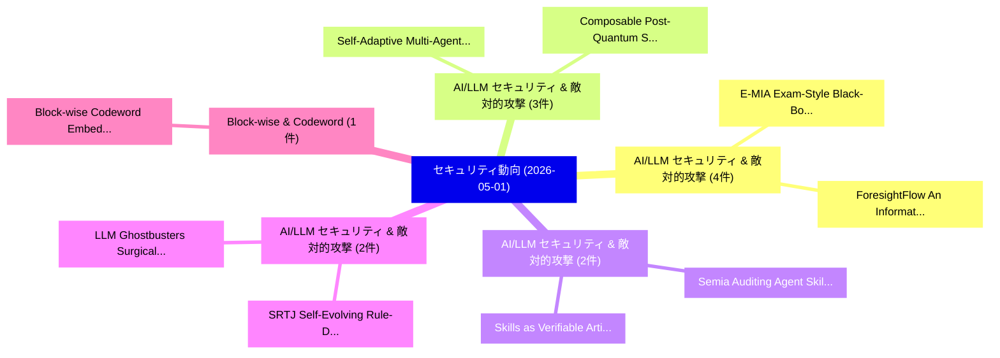

# 📅 02_daily: 日次エグゼクティブサマリー報告書 (2026-05-01)

**集計日時**: 2026-10-02 23:06:07 UTC  
**対象日付**: 2026-05-01  
**本日収集論文数**: 26 件  

---

## 💡 主要セキュリティ動向・脅威インサイト (Executive Insights)

本日の収集論文（計 26 件）において、以下の重点セキュリティ領域で活発な研究動向が確認されました：
- **AI/LLM セキュリティ & 敵対的攻撃** (4 件): 注目論文として 「ForesightFlow: An Information ...」、「E-MIA: Exam-Style Black-Box Me...」 等が発表され、実務防御および攻撃検証の進展が見られます。
- **AI/LLM セキュリティ & 敵対的攻撃** (3 件): 注目論文として 「Self-Adaptive Multi-Agent LLM-...」、「Composable Post-Quantum Securi...」 等が発表され、実務防御および攻撃検証の進展が見られます。
- **AI/LLM セキュリティ & 敵対的攻撃** (2 件): 注目論文として 「Semia: Auditing Agent Skills v...」、「Skills as Verifiable Artifacts...」 等が発表され、実務防御および攻撃検証の進展が見られます。
- **AI/LLM セキュリティ & 敵対的攻撃** (2 件): 注目論文として 「SRTJ: Self-Evolving Rule-Drive...」、「LLM Ghostbusters: Surgical Hal...」 等が発表され、実務防御および攻撃検証の進展が見られます。
- **Block-wise & Codeword** (1 件): 注目論文として 「Block-wise Codeword Embedding ...」 等が発表され、実務防御および攻撃検証の進展が見られます。

### 🗺️ 技術・脅威トピックマインドマップ

---

## 📌 日次セキュリティ論文一覧 (日本語表形式)

| No | arXiv ID | 論文タイトル (日本語訳) | 重要キーワード | 構造化エグゼクティブ要約 (背景・提案・影響) | 脅威分類 | 詳細リンク |
|---|---|---|---|---|---|---|
| 1 | `2605.00314v1` | [Semia: Auditing Agent Skills via Constraint-Guided Representation Synthesis（セキュリティ分析論文）](../../okf/papers/2026-05-01/2605.00314.md) | `Auditing Agent Skills`, `Guided Representation Synthesis`, `Constraint-Guided Representation` | 【提案】概要 (Overview & Key Finding) 本論文「Semia: Auditing Agent Skills via Constraint-Guided Repr...。実証評価により経営層・セキュリティ管理者向け推奨アクション (E... | `arXiv` | [arXiv](https://arxiv.org/abs/2605.00314v1) &#124; [OKF](../../okf/papers/2026-05-01/2605.00314.md) |
| 2 | `2605.00348v2` | [Block-wise Codeword Embedding for Reliable Multi-bit Text Watermarking（セキュリティ分析論文）](../../okf/papers/2026-05-01/2605.00348.md) | `Codeword Embedding`, `Reliable Multi`, `Text Watermarking` | 【提案】概要 (Overview & Key Finding) 本論文「Block-wise Codeword Embedding for Reliable Multi-bit Te...。実証評価により経営層・セキュリティ管理者向け推奨アクション (E... | `arXiv` | [arXiv](https://arxiv.org/abs/2605.00348v2) &#124; [OKF](../../okf/papers/2026-05-01/2605.00348.md) |
| 3 | `2605.00352v1` | [Integrating Log-Based Security Analytics in Agile Workflows: A Real-World Experience Report（セキュリティ分析論文）](../../okf/papers/2026-05-01/2605.00352.md) | `Based Security Analytics`, `World Experience Report`, `Integrating Log` | 【提案】概要 (Overview & Key Finding) 本論文「Integrating Log-Based Security Analytics in Agile Workf...。実証評価により経営層・セキュリティ管理者向け推奨アクション (E... | `arXiv` | [arXiv](https://arxiv.org/abs/2605.00352v1) &#124; [OKF](../../okf/papers/2026-05-01/2605.00352.md) |
| 4 | `2605.00424v2` | [Skills as Verifiable Artifacts: A Trust Schema and a Biconditional Correctness Criterion for Human-in-the-Loop Agent Runtimes（セキュリティ分析論文）](../../okf/papers/2026-05-01/2605.00424.md) | `Biconditional Correctness Criterion`, `Loop Agent Runtimes`, `Verifiable Artifacts` | 【提案】概要 (Overview & Key Finding) 本論文「Skills as Verifiable Artifacts: A Trust Schema and a Bi...。実証評価により経営層・セキュリティ管理者向け推奨アクション (E... | `arXiv` | [arXiv](https://arxiv.org/abs/2605.00424v2) &#124; [OKF](../../okf/papers/2026-05-01/2605.00424.md) |
| 5 | `2605.00460v1` | [CleanBase: Detecting Malicious Documents in RAG Knowledge Databases（セキュリティ分析論文）](../../okf/papers/2026-05-01/2605.00460.md) | `Detecting Malicious Documents`, `Knowledge Databases`, `Weifei Jin` | 【提案】概要 (Overview & Key Finding) 本論文「CleanBase: Detecting Malicious Documents in RAG Knowled...。実証評価により経営層・セキュリティ管理者向け推奨アクション (E... | `arXiv` | [arXiv](https://arxiv.org/abs/2605.00460v1) &#124; [OKF](../../okf/papers/2026-05-01/2605.00460.md) |
| 6 | `2605.00487v1` | [Zero-Knowledge Model Checking（セキュリティ分析論文）](../../okf/papers/2026-05-01/2605.00487.md) | `Knowledge Model Checking`, `Zero-Knowledge Model`, `Pascal Berrang` | 【提案】概要 (Overview & Key Finding) 本論文「Zero-Knowledge Model Checking（セキュリティ分析論文）」（原題: Zero-Kno...。実証評価により経営層・セキュリティ管理者向け推奨アクション (E... | `arXiv` | [arXiv](https://arxiv.org/abs/2605.00487v1) &#124; [OKF](../../okf/papers/2026-05-01/2605.00487.md) |
| 7 | `2605.00493v2` | [ForesightFlow: An Information Leakage Score Framework for Prediction Markets（セキュリティ分析論文）](../../okf/papers/2026-05-01/2605.00493.md) | `Prediction Markets`, `Maksym Nechepurenko`, `Raw Meta` | 【提案】概要 (Overview & Key Finding) 本論文「ForesightFlow: An Information Leakage Score Framework f...。実証評価により経営層・セキュリティ管理者向け推奨アクション (E... | `arXiv` | [arXiv](https://arxiv.org/abs/2605.00493v2) &#124; [OKF](../../okf/papers/2026-05-01/2605.00493.md) |
| 8 | `2605.00558v1` | [Pick and Sort for Graphical Authentication（セキュリティ分析論文）](../../okf/papers/2026-05-01/2605.00558.md) | `Graphical Authentication`, `Argianto Rahartomo`, `Mohammad Ghafari` | 【提案】概要 (Overview & Key Finding) 本論文「Pick and Sort for Graphical Authentication（セキュリティ分析論文）」...。実証評価により経営層・セキュリティ管理者向け推奨アクション (E... | `arXiv` | [arXiv](https://arxiv.org/abs/2605.00558v1) &#124; [OKF](../../okf/papers/2026-05-01/2605.00558.md) |
| 9 | `2605.00613v2` | [KingsGuard: Enclave Data Protection Under Real-World TEE Vulnerabilities（セキュリティ分析論文）](../../okf/papers/2026-05-01/2605.00613.md) | `Real-World TEE`, `Saltanat Firdous Allaqband`, `Rohit Srinivas` | 【提案】概要 (Overview & Key Finding) 本論文「KingsGuard: Enclave Data Protection Under Real-World TE...。実証評価により経営層・セキュリティ管理者向け推奨アクション (E... | `arXiv` | [arXiv](https://arxiv.org/abs/2605.00613v2) &#124; [OKF](../../okf/papers/2026-05-01/2605.00613.md) |
| 10 | `2605.00625v1` | [Defense against Poisoning Attacks under Shuffle-DP（セキュリティ分析論文）](../../okf/papers/2026-05-01/2605.00625.md) | `Poisoning Attacks`, `Siyi Wang`, `Qiyao Luo` | 【提案】概要 (Overview & Key Finding) 本論文「Defense against Poisoning Attacks under Shuffle-DP（セキュリ...。実証評価により経営層・セキュリティ管理者向け推奨アクション (E... | `arXiv` | [arXiv](https://arxiv.org/abs/2605.00625v1) &#124; [OKF](../../okf/papers/2026-05-01/2605.00625.md) |
| 11 | `2605.00689v1` | [ML-Bench&Guard: Policy-Grounded Multilingual Safety Benchmark and Guardrail for 大規模言語モデル](../../okf/papers/2026-05-01/2605.00689.md) | `Grounded Multilingual Safety Benchmark`, `Policy-Grounded Multilingual`, `Large Language Models` | 【提案】概要 (Overview & Key Finding) 本論文「ML-Bench&Guard: Policy-Grounded Multilingual Safety Ben...。実証評価により経営層・セキュリティ管理者向け推奨アクション (E... | `arXiv` | [arXiv](https://arxiv.org/abs/2605.00689v1) &#124; [OKF](../../okf/papers/2026-05-01/2605.00689.md) |
| 12 | `2605.00699v3` | [STARE: Step-wise Temporal Alignment and Red-teaming Engine for Multi-modal Toxicity Attack（セキュリティ分析論文）](../../okf/papers/2026-05-01/2605.00699.md) | `Temporal Alignment`, `Toxicity Attack`, `Step-wise Temporal` | 【提案】概要 (Overview & Key Finding) 本論文「STARE: Step-wise Temporal Alignment and Red-teaming Eng...。実証評価により経営層・セキュリティ管理者向け推奨アクション (E... | `arXiv` | [arXiv](https://arxiv.org/abs/2605.00699v3) &#124; [OKF](../../okf/papers/2026-05-01/2605.00699.md) |
| 13 | `2605.00741v1` | [Self-Adaptive Multi-Agent LLM-Based Security Pattern Selection for IoT Systems（セキュリティ分析論文）](../../okf/papers/2026-05-01/2605.00741.md) | `Based Security Pattern Selection`, `Adaptive Multi`, `Self-Adaptive Multi` | 【提案】概要 (Overview & Key Finding) 本論文「Self-Adaptive Multi-Agent LLM-Based Security Pattern Se...。実証評価により経営層・セキュリティ管理者向け推奨アクション (E... | `arXiv` | [arXiv](https://arxiv.org/abs/2605.00741v1) &#124; [OKF](../../okf/papers/2026-05-01/2605.00741.md) |
| 14 | `2605.00788v1` | [Repurposing Image Diffusion Models for Adversarial Synthetic Structured Data: A Case Study of Ground Truth Drift（セキュリティ分析論文）](../../okf/papers/2026-05-01/2605.00788.md) | `Repurposing Image Diffusion Models`, `Adversarial Synthetic Structured Data`, `Ground Truth Drift` | 【提案】概要 (Overview & Key Finding) 本論文「Repurposing Image Diffusion Models for Adversarial Synt...。実証評価により経営層・セキュリティ管理者向け推奨アクション (E... | `arXiv` | [arXiv](https://arxiv.org/abs/2605.00788v1) &#124; [OKF](../../okf/papers/2026-05-01/2605.00788.md) |
| 15 | `2605.00796v1` | [When RAG Chatbots Expose Their Backend: An Anonymized Case Study of Privacy and Security Risks in Patient-Facing Medical AI（セキュリティ分析論文）](../../okf/papers/2026-05-01/2605.00796.md) | `Security Risks`, `Facing Medical`, `Patient-Facing Medical` | 【提案】概要 (Overview & Key Finding) 本論文「When RAG Chatbots Expose Their Backend: An Anonymized C...。実証評価により経営層・セキュリティ管理者向け推奨アクション (E... | `arXiv` | [arXiv](https://arxiv.org/abs/2605.00796v1) &#124; [OKF](../../okf/papers/2026-05-01/2605.00796.md) |
| 16 | `2605.00955v1` | [E-MIA: Exam-Style Black-Box Membership Inference Attacks against RAG Systems（セキュリティ分析論文）](../../okf/papers/2026-05-01/2605.00955.md) | `Box Membership Inference Attacks`, `Style Black`, `Exam-Style Black` | 【提案】概要 (Overview & Key Finding) 本論文「E-MIA: Exam-Style Black-Box Membership Inference Attack...。実証評価により経営層・セキュリティ管理者向け推奨アクション (E... | `arXiv` | [arXiv](https://arxiv.org/abs/2605.00955v1) &#124; [OKF](../../okf/papers/2026-05-01/2605.00955.md) |
| 17 | `2605.00961v1` | [Composable Post-Quantum Security for FADEC-Coupled Dual-Spool Turbofan Cyber-Physical Systems（セキュリティ分析論文）](../../okf/papers/2026-05-01/2605.00961.md) | `Spool Turbofan Cyber`, `Composable Post`, `Quantum Security` | 【提案】概要 (Overview & Key Finding) 本論文「Composable Post-量子 Security for FADEC-Coupled Dual-Spoo...。実証評価により経営層・セキュリティ管理者向け推奨アクション (E... | `arXiv` | [arXiv](https://arxiv.org/abs/2605.00961v1) &#124; [OKF](../../okf/papers/2026-05-01/2605.00961.md) |
| 18 | `2605.00974v1` | [SRTJ: Self-Evolving Rule-Driven Training-Free LLM Jailbreaking（セキュリティ分析論文）](../../okf/papers/2026-05-01/2605.00974.md) | `Evolving Rule`, `Driven Training`, `Self-Evolving Rule` | 【提案】概要 (Overview & Key Finding) 本論文「SRTJ: Self-Evolving Rule-Driven Training-Free LLM ジェイルブ...。実証評価により経営層・セキュリティ管理者向け推奨アクション (E... | `arXiv` | [arXiv](https://arxiv.org/abs/2605.00974v1) &#124; [OKF](../../okf/papers/2026-05-01/2605.00974.md) |
| 19 | `2605.01008v1` | [Semantics-Based Verification of an Implemented Shor Oracle for ECDLP in Qrisp（セキュリティ分析論文）](../../okf/papers/2026-05-01/2605.01008.md) | `Implemented Shor Oracle`, `Based Verification`, `Semantics-Based Verification` | 【提案】概要 (Overview & Key Finding) 本論文「Semantics-Based Verification of an Implemented Shor Ora...。実証評価により経営層・セキュリティ管理者向け推奨アクション (E... | `arXiv` | [arXiv](https://arxiv.org/abs/2605.01008v1) &#124; [OKF](../../okf/papers/2026-05-01/2605.01008.md) |
| 20 | `2605.01037v3` | [Certified Purity for Cognitive Workflow Executors: From Static Analysis to Cryptographic Attestation（セキュリティ分析論文）](../../okf/papers/2026-05-01/2605.01037.md) | `Cognitive Workflow Executors`, `Certified Purity`, `Cryptographic Attestation` | 【提案】概要 (Overview & Key Finding) 本論文「Certified Purity for Cognitive Workflow Executors: From...。実証評価により経営層・セキュリティ管理者向け推奨アクション (E... | `arXiv` | [arXiv](https://arxiv.org/abs/2605.01037v3) &#124; [OKF](../../okf/papers/2026-05-01/2605.01037.md) |
| 21 | `2605.01047v1` | [LLM Ghostbusters: Surgical Hallucination Suppression via Adaptive Unlearning（セキュリティ分析論文）](../../okf/papers/2026-05-01/2605.01047.md) | `Surgical Hallucination Suppression`, `Adaptive Unlearning`, `Joseph Spracklen` | 【提案】概要 (Overview & Key Finding) 本論文「LLM Ghostbusters: Surgical Hallucination Suppression vi...。実証評価により経営層・セキュリティ管理者向け推奨アクション (E... | `arXiv` | [arXiv](https://arxiv.org/abs/2605.01047v1) &#124; [OKF](../../okf/papers/2026-05-01/2605.01047.md) |
| 22 | `2605.01078v1` | [A Sentence Relation-Based Approach to Sanitizing Malicious Instructions（セキュリティ分析論文）](../../okf/papers/2026-05-01/2605.01078.md) | `Sanitizing Malicious Instructions`, `Sentence Relation`, `Soumil Datta` | 【提案】概要 (Overview & Key Finding) 本論文「A Sentence Relation-Based Approach to Sanitizing Malici...。実証評価により経営層・セキュリティ管理者向け推奨アクション (E... | `arXiv` | [arXiv](https://arxiv.org/abs/2605.01078v1) &#124; [OKF](../../okf/papers/2026-05-01/2605.01078.md) |
| 23 | `2605.01129v2` | [Revisiting Privacy Leakage in Machine Unlearning: Membership Inference Beyond the Forgotten Set（セキュリティ分析論文）](../../okf/papers/2026-05-01/2605.01129.md) | `Revisiting Privacy Leakage`, `Membership Inference Beyond`, `Machine Unlearning` | 【提案】概要 (Overview & Key Finding) 本論文「Revisiting Privacy Leakage in Machine Unlearning: Membe...。実証評価により経営層・セキュリティ管理者向け推奨アクション (E... | `arXiv` | [arXiv](https://arxiv.org/abs/2605.01129v2) &#124; [OKF](../../okf/papers/2026-05-01/2605.01129.md) |
| 24 | `2605.01133v3` | [When Embedding-Based Defenses Fail: Rethinking Safety in LLM-Based Multi-Agent Systems（セキュリティ分析論文）](../../okf/papers/2026-05-01/2605.01133.md) | `Based Defenses Fail`, `Rethinking Safety`, `Embedding-Based Defenses` | 【提案】概要 (Overview & Key Finding) 本論文「When Embedding-Based Defenses Fail: Rethinking Safety i...。実証評価により経営層・セキュリティ管理者向け推奨アクション (E... | `arXiv` | [arXiv](https://arxiv.org/abs/2605.01133v3) &#124; [OKF](../../okf/papers/2026-05-01/2605.01133.md) |
| 25 | `2605.01137v1` | [Metric-Normalized Posterior Leakage (mPL): Attacker-Aligned Privacy for Joint Consumption（セキュリティ分析論文）](../../okf/papers/2026-05-01/2605.01137.md) | `Normalized Posterior Leakage`, `Aligned Privacy`, `Joint Consumption` | 【提案】概要 (Overview & Key Finding) 本論文「Metric-Normalized Posterior Leakage (mPL): Attacker-Ali...。実証評価により経営層・セキュリティ管理者向け推奨アクション (E... | `arXiv` | [arXiv](https://arxiv.org/abs/2605.01137v1) &#124; [OKF](../../okf/papers/2026-05-01/2605.01137.md) |
| 26 | `2605.08132v1` | [OrbitBFT: Enabling Scalable and Robust BFT Consensus in LEO Constellations（セキュリティ分析論文）](../../okf/papers/2026-05-01/2605.08132.md) | `Enabling Scalable`, `Tianyi Sun`, `Shuo Liu` | 【提案】概要 (Overview & Key Finding) 本論文「OrbitBFT: Enabling Scalable and Robust BFT Consensus in...。実証評価により経営層・セキュリティ管理者向け推奨アクション (E... | `arXiv` | [arXiv](https://arxiv.org/abs/2605.08132v1) &#124; [OKF](../../okf/papers/2026-05-01/2605.08132.md) |

