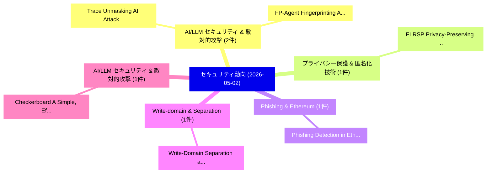

# 📅 02_daily: 日次エグゼクティブサマリー報告書 (2026-05-02)

**集計日時**: 2026-10-02 23:06:07 UTC  
**対象日付**: 2026-05-02  
**本日収集論文数**: 15 件  

---

## 💡 主要セキュリティ動向・脅威インサイト (Executive Insights)

本日の収集論文（計 15 件）において、以下の重点セキュリティ領域で活発な研究動向が確認されました：
- **AI/LLM セキュリティ & 敵対的攻撃** (2 件): 注目論文として 「Trace: Unmasking AI Attack Age...」、「FP-Agent: Fingerprinting AI Br...」 等が発表され、実務防御および攻撃検証の進展が見られます。
- **プライバシー保護 & 匿名化技術** (1 件): 注目論文として 「FLRSP: Privacy-Preserving 連合学習...」 等が発表され、実務防御および攻撃検証の進展が見られます。
- **Phishing & Ethereum** (1 件): 注目論文として 「Phishing Detection in Ethereum...」 等が発表され、実務防御および攻撃検証の進展が見られます。
- **Write-domain & Separation** (1 件): 注目論文として 「Write-Domain Separation and No...」 等が発表され、実務防御および攻撃検証の進展が見られます。
- **AI/LLM セキュリティ & 敵対的攻撃** (1 件): 注目論文として 「Checkerboard: A Simple, Effect...」 等が発表され、実務防御および攻撃検証の進展が見られます。

### 🗺️ 技術・脅威トピックマインドマップ

---

## 📌 日次セキュリティ論文一覧 (日本語表形式)

| No | arXiv ID | 論文タイトル (日本語訳) | 重要キーワード | 構造化エグゼクティブ要約 (背景・提案・影響) | 脅威分類 | 詳細リンク |
|---|---|---|---|---|---|---|
| 1 | `2605.01186v1` | [Trace: Unmasking AI Attack Agents Through Terminal Behavior Fingerprinting（セキュリティ分析論文）](../../okf/papers/2026-05-02/2605.01186.md) | `Murali Ediga`, `Sudipta Chattopadhyay`, `Raw Meta` | 【提案】概要 (Overview & Key Finding) 本論文「Trace: Unmasking AI Attack Agents Through Terminal Beha...。実証評価により経営層・セキュリティ管理者向け推奨アクション (E... | `arXiv` | [arXiv](https://arxiv.org/abs/2605.01186v1) &#124; [OKF](../../okf/papers/2026-05-02/2605.01186.md) |
| 2 | `2605.01204v1` | [FLRSP: Privacy-Preserving 連合学習 Using Randomly Selected Model Parameters](../../okf/papers/2026-05-02/2605.01204.md) | `Preserving Federated Learning Using Randomly Selected Model Parameters`, `Using Randomly Selected Model Parameters`, `Privacy-Preserving Federated` | 【提案】概要 (Overview & Key Finding) 本論文「FLRSP: Privacy-Preserving 連合学習 Using Randomly Selected ...。実証評価により経営層・セキュリティ管理者向け推奨アクション (E... | `arXiv` | [arXiv](https://arxiv.org/abs/2605.01204v1) &#124; [OKF](../../okf/papers/2026-05-02/2605.01204.md) |
| 3 | `2605.01207v1` | [Phishing Detection in Ethereum via Temporal Graph Contrastive Learning（セキュリティ分析論文）](../../okf/papers/2026-05-02/2605.01207.md) | `Temporal Graph Contrastive Learning`, `Phishing Detection`, `Cong Wu` | 【提案】概要 (Overview & Key Finding) 本論文「Phishing Detection in Ethereum via Temporal Graph Contr...。実証評価により経営層・セキュリティ管理者向け推奨アクション (E... | `arXiv` | [arXiv](https://arxiv.org/abs/2605.01207v1) &#124; [OKF](../../okf/papers/2026-05-02/2605.01207.md) |
| 4 | `2605.01210v1` | [Write-Domain Separation and Non-Custodial Enforcement: A Structural Impossibility in Account-Based Ledgers, with a Commitment-Based Construction（セキュリティ分析論文）](../../okf/papers/2026-05-02/2605.01210.md) | `Domain Separation`, `Custodial Enforcement`, `Structural Impossibility` | 【提案】概要 (Overview & Key Finding) 本論文「Write-Domain Separation and Non-Custodial Enforcement: ...。実証評価により経営層・セキュリティ管理者向け推奨アクション (E... | `arXiv` | [arXiv](https://arxiv.org/abs/2605.01210v1) &#124; [OKF](../../okf/papers/2026-05-02/2605.01210.md) |
| 5 | `2605.01247v1` | [FP-Agent: Fingerprinting AI Browsing Agents（セキュリティ分析論文）](../../okf/papers/2026-05-02/2605.01247.md) | `Browsing Agents`, `Ethan Wang`, `Zubair Shafiq` | 【提案】概要 (Overview & Key Finding) 本論文「FP-Agent: Fingerprinting AI Browsing Agents（セキュリティ分析論文）...。実証評価により経営層・セキュリティ管理者向け推奨アクション (E... | `arXiv` | [arXiv](https://arxiv.org/abs/2605.01247v1) &#124; [OKF](../../okf/papers/2026-05-02/2605.01247.md) |
| 6 | `2605.01298v1` | [Checkerboard: A Simple, Effective, Efficient and Learning-free Clean Label Backdoor Attack with Low Poisoning Budget（セキュリティ分析論文）](../../okf/papers/2026-05-02/2605.01298.md) | `Clean Label Backdoor Attack`, `Low Poisoning Budget`, `Learning-free Clean` | 【提案】概要 (Overview & Key Finding) 本論文「Checkerboard: A Simple, Effective, Efficient and Learni...。実証評価により経営層・セキュリティ管理者向け推奨アクション (E... | `arXiv` | [arXiv](https://arxiv.org/abs/2605.01298v1) &#124; [OKF](../../okf/papers/2026-05-02/2605.01298.md) |
| 7 | `2605.01301v1` | [From Stealthy Data Fabrication to Unsafe Driving: Realistic Scenario Attacks on Collaborative Perception（セキュリティ分析論文）](../../okf/papers/2026-05-02/2605.01301.md) | `Realistic Scenario Attacks`, `Unsafe Driving`, `Collaborative Perception` | 【提案】概要 (Overview & Key Finding) 本論文「From Stealthy Data Fabrication to Unsafe Driving: Reali...。実証評価により経営層・セキュリティ管理者向け推奨アクション (E... | `arXiv` | [arXiv](https://arxiv.org/abs/2605.01301v1) &#124; [OKF](../../okf/papers/2026-05-02/2605.01301.md) |
| 8 | `2605.01449v1` | [VisInject: Disruption != Injection -- A Dual-Dimension Evaluation of Universal Vision-Language Modelsに対する敵対的攻撃](../../okf/papers/2026-05-02/2605.01449.md) | `Universal Vision`, `Universal Adversarial Attacks`, `Language Models` | 【提案】概要 (Overview & Key Finding) 本論文「VisInject: Disruption != Injection -- A Dual-Dimension ...。実証評価により経営層・セキュリティ管理者向け推奨アクション (E... | `arXiv` | [arXiv](https://arxiv.org/abs/2605.01449v1) &#124; [OKF](../../okf/papers/2026-05-02/2605.01449.md) |
| 9 | `2605.01454v1` | [PQC Validator: Validating Post-Quantum Readiness in Cloud-Native 5G Core Networks（セキュリティ分析論文）](../../okf/papers/2026-05-02/2605.01454.md) | `Validating Post`, `Quantum Readiness`, `Core Networks` | 【提案】概要 (Overview & Key Finding) 本論文「PQC Validator: Validating Post-量子 Readiness in Cloud-Na...。実証評価により経営層・セキュリティ管理者向け推奨アクション (E... | `arXiv` | [arXiv](https://arxiv.org/abs/2605.01454v1) &#124; [OKF](../../okf/papers/2026-05-02/2605.01454.md) |
| 10 | `2605.01462v1` | [LocalAlign: Enabling Generalizable Prompt Injection Defense via Generation of Near-Target Adversarial Examples for Alignment Training（セキュリティ分析論文）](../../okf/papers/2026-05-02/2605.01462.md) | `Enabling Generalizable Prompt Injection Defense`, `Target Adversarial Examples`, `Alignment Training` | 【提案】概要 (Overview & Key Finding) 本論文「LocalAlign: Enabling Generalizable プロンプトインジェクション Defens...。実証評価により経営層・セキュリティ管理者向け推奨アクション (E... | `arXiv` | [arXiv](https://arxiv.org/abs/2605.01462v1) &#124; [OKF](../../okf/papers/2026-05-02/2605.01462.md) |
| 11 | `2605.01515v1` | [MelShield: Robust Mel-Domain Audio Watermarking for Provenance Attribution of AI Generated Synthesized Speech（セキュリティ分析論文）](../../okf/papers/2026-05-02/2605.01515.md) | `Domain Audio Watermarking`, `Generated Synthesized Speech`, `Robust Mel` | 【提案】概要 (Overview & Key Finding) 本論文「MelShield: Robust Mel-Domain Audio Watermarking for Pro...。実証評価により経営層・セキュリティ管理者向け推奨アクション (E... | `arXiv` | [arXiv](https://arxiv.org/abs/2605.01515v1) &#124; [OKF](../../okf/papers/2026-05-02/2605.01515.md) |
| 12 | `2605.01569v1` | [ShieldShare: Building a VPN-backed Android Hotspot for Secure Internet Sharing with Per-User Traffic Accounting（セキュリティ分析論文）](../../okf/papers/2026-05-02/2605.01569.md) | `Secure Internet Sharing`, `User Traffic Accounting`, `Android Hotspot` | 【提案】概要 (Overview & Key Finding) 本論文「ShieldShare: Building a VPN-backed Android Hotspot for ...。実証評価により経営層・セキュリティ管理者向け推奨アクション (E... | `arXiv` | [arXiv](https://arxiv.org/abs/2605.01569v1) &#124; [OKF](../../okf/papers/2026-05-02/2605.01569.md) |
| 13 | `2605.01644v1` | [Toward a Principled Framework for Agent Safety Measurement（セキュリティ分析論文）](../../okf/papers/2026-05-02/2605.01644.md) | `Agent Safety Measurement`, `Shuyi Lin`, `Anshuman Suri` | 【提案】概要 (Overview & Key Finding) 本論文「Toward a Principled Framework for Agent Safety Measurem...。実証評価により経営層・セキュリティ管理者向け推奨アクション (E... | `arXiv` | [arXiv](https://arxiv.org/abs/2605.01644v1) &#124; [OKF](../../okf/papers/2026-05-02/2605.01644.md) |
| 14 | `2605.02958v2` | [Tracing the Dynamics of Refusal: Exploiting Latent Refusal Trajectories for Robust Jailbreak Detection（セキュリティ分析論文）](../../okf/papers/2026-05-02/2605.02958.md) | `Exploiting Latent Refusal Trajectories`, `Robust Jailbreak Detection`, `Wei Yang Bryan Lim` | 【提案】概要 (Overview & Key Finding) 本論文「Tracing the Dynamics of Refusal: Exploiting Latent Refu...。実証評価により経営層・セキュリティ管理者向け推奨アクション (E... | `arXiv` | [arXiv](https://arxiv.org/abs/2605.02958v2) &#124; [OKF](../../okf/papers/2026-05-02/2605.02958.md) |
| 15 | `2605.12535v3` | [Ghost in the Context: Policy-Carriage Integrity in LLMエージェント](../../okf/papers/2026-05-02/2605.12535.md) | `Carriage Integrity`, `Policy-Carriage Integrity`, `Igor Santos` | 【提案】概要 (Overview & Key Finding) 本論文「Ghost in the Context: Policy-Carriage Integrity in LLMエ...。実証評価により経営層・セキュリティ管理者向け推奨アクション (E... | `arXiv` | [arXiv](https://arxiv.org/abs/2605.12535v3) &#124; [OKF](../../okf/papers/2026-05-02/2605.12535.md) |

