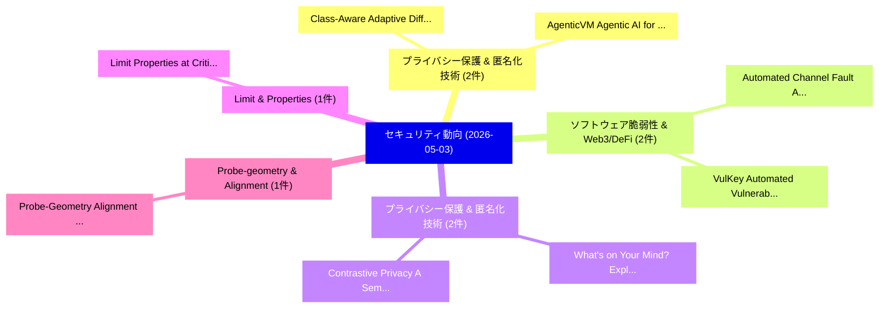

# 📅 02_daily: 日次エグゼクティブサマリー報告書 (2026-05-03)

**集計日時**: 2026-10-02 23:06:07 UTC  
**対象日付**: 2026-05-03  
**本日収集論文数**: 24 件  

---

## 💡 主要セキュリティ動向・脅威インサイト (Executive Insights)

本日の収集論文（計 24 件）において、以下の重点セキュリティ領域で活発な研究動向が確認されました：
- **プライバシー保護 & 匿名化技術** (2 件): 注目論文として 「Class-Aware Adaptive Different...」、「AgenticVM: Agentic AI for Adap...」 等が発表され、実務防御および攻撃検証の進展が見られます。
- **ソフトウェア脆弱性 & Web3/DeFi** (2 件): 注目論文として 「Automated Channel Fault Analys...」、「VulKey: Automated Vulnerabilit...」 等が発表され、実務防御および攻撃検証の進展が見られます。
- **プライバシー保護 & 匿名化技術** (2 件): 注目論文として 「What's on Your Mind? Exploring...」、「Contrastive Privacy: A Semanti...」 等が発表され、実務防御および攻撃検証の進展が見られます。
- **Limit & Properties** (1 件): 注目論文として 「Limit Properties at Critical I...」 等が発表され、実務防御および攻撃検証の進展が見られます。
- **Probe-geometry & Alignment** (1 件): 注目論文として 「Probe-Geometry Alignment: Eras...」 等が発表され、実務防御および攻撃検証の進展が見られます。

### 🗺️ 技術・脅威トピックマインドマップ

---

## 📌 日次セキュリティ論文一覧 (日本語表形式)

| No | arXiv ID | 論文タイトル (日本語訳) | 重要キーワード | 構造化エグゼクティブ要約 (背景・提案・影響) | 脅威分類 | 詳細リンク |
|---|---|---|---|---|---|---|
| 1 | `2605.01654v1` | [Limit Properties at Critical Indices of Linear Canonical Riesz Potentials and Their Applications to Security of Multi-Image Encryption（セキュリティ分析論文）](../../okf/papers/2026-05-03/2605.01654.md) | `Linear Canonical Riesz Potentials`, `Limit Properties`, `Critical Indices` | 【提案】概要 (Overview & Key Finding) 本論文「Limit Properties at Critical Indices of Linear Canonica...。実証評価により経営層・セキュリティ管理者向け推奨アクション (E... | `arXiv` | [arXiv](https://arxiv.org/abs/2605.01654v1) &#124; [OKF](../../okf/papers/2026-05-03/2605.01654.md) |
| 2 | `2605.01679v1` | [Class-Aware Adaptive Differential Privacy in Deep Learning for Sensor-Based Fall Detection（セキュリティ分析論文）](../../okf/papers/2026-05-03/2605.01679.md) | `Aware Adaptive Differential Privacy`, `Based Fall Detection`, `Deep Learning` | 【提案】概要 (Overview & Key Finding) 本論文「Class-Aware Adaptive 差分プライバシー in Deep Learning for Sens...。実証評価により経営層・セキュリティ管理者向け推奨アクション (E... | `arXiv` | [arXiv](https://arxiv.org/abs/2605.01679v1) &#124; [OKF](../../okf/papers/2026-05-03/2605.01679.md) |
| 3 | `2605.01699v3` | [Probe-Geometry Alignment: Erasing the Cross-Sequence Memorization Signature Below Chance（セキュリティ分析論文）](../../okf/papers/2026-05-03/2605.01699.md) | `Geometry Alignment`, `Probe-Geometry Alignment`, `Cross-Sequence Memorization` | 【提案】概要 (Overview & Key Finding) 本論文「Probe-Geometry Alignment: Erasing the Cross-Sequence Me...。実証評価により経営層・セキュリティ管理者向け推奨アクション (E... | `arXiv` | [arXiv](https://arxiv.org/abs/2605.01699v3) &#124; [OKF](../../okf/papers/2026-05-03/2605.01699.md) |
| 4 | `2605.01705v1` | [Toward Resilient 5G Networks: Comparative Federated and Centralized Learning for RF Jamming Detectionの分析](../../okf/papers/2026-05-03/2605.01705.md) | `Toward Resilient`, `Centralized Learning`, `Comparative Federated` | 【提案】概要 (Overview & Key Finding) 本論文「Toward Resilient 5G Networks: Comparative Federated and...。実証評価により経営層・セキュリティ管理者向け推奨アクション (E... | `arXiv` | [arXiv](https://arxiv.org/abs/2605.01705v1) &#124; [OKF](../../okf/papers/2026-05-03/2605.01705.md) |
| 5 | `2605.01721v1` | [Automated Channel Fault Analysis with Tofu（セキュリティ分析論文）](../../okf/papers/2026-05-03/2605.01721.md) | `Jacob Ginesin`, `Cristina Nita`, `Raw Meta` | 【提案】概要 (Overview & Key Finding) 本論文「Automated Channel Fault Analysis with Tofu（セキュリティ分析論文）」...。実証評価により経営層・セキュリティ管理者向け推奨アクション (E... | `arXiv` | [arXiv](https://arxiv.org/abs/2605.01721v1) &#124; [OKF](../../okf/papers/2026-05-03/2605.01721.md) |
| 6 | `2605.01739v1` | [AgenticVM: Agentic AI for Adaptive Software Vulnerability Management（セキュリティ分析論文）](../../okf/papers/2026-05-03/2605.01739.md) | `Adaptive Software Vulnerability Management`, `Asrul Arifin`, `Hussain Ahmad` | 【提案】概要 (Overview & Key Finding) 本論文「AgenticVM: Agentic AI for Adaptive Software 脆弱性 Managem...。実証評価により経営層・セキュリティ管理者向け推奨アクション (E... | `arXiv` | [arXiv](https://arxiv.org/abs/2605.01739v1) &#124; [OKF](../../okf/papers/2026-05-03/2605.01739.md) |
| 7 | `2605.01740v1` | [Architectural Obsolescence of Unhardened Agentic-AI Runtimes（セキュリティ分析論文）](../../okf/papers/2026-05-03/2605.01740.md) | `Architectural Obsolescence`, `Unhardened Agentic`, `Agentic-AI Runtimes` | 【提案】概要 (Overview & Key Finding) 本論文「Architectural Obsolescence of Unhardened Agentic-AI Run...。実証評価により経営層・セキュリティ管理者向け推奨アクション (E... | `arXiv` | [arXiv](https://arxiv.org/abs/2605.01740v1) &#124; [OKF](../../okf/papers/2026-05-03/2605.01740.md) |
| 8 | `2605.01769v3` | [VulKey: Automated Vulnerability Repair Guided by Domain-Specific Repair Patterns（セキュリティ分析論文）](../../okf/papers/2026-05-03/2605.01769.md) | `Automated Vulnerability Repair Guided`, `Specific Repair Patterns`, `Domain-Specific Repair` | 【提案】概要 (Overview & Key Finding) 本論文「VulKey: Automated 脆弱性 Repair Guided by Domain-Specific ...。実証評価により経営層・セキュリティ管理者向け推奨アクション (E... | `arXiv` | [arXiv](https://arxiv.org/abs/2605.01769v3) &#124; [OKF](../../okf/papers/2026-05-03/2605.01769.md) |
| 9 | `2605.01782v1` | [Needle-in-RAG: Prompt-Conditioned Character-Level Traceback of Poisoned Spans in Retrieved Evidence（セキュリティ分析論文）](../../okf/papers/2026-05-03/2605.01782.md) | `Conditioned Character`, `Level Traceback`, `Poisoned Spans` | 【提案】概要 (Overview & Key Finding) 本論文「Needle-in-RAG: Prompt-Conditioned Character-Level Trace...。実証評価により経営層・セキュリティ管理者向け推奨アクション (E... | `arXiv` | [arXiv](https://arxiv.org/abs/2605.01782v1) &#124; [OKF](../../okf/papers/2026-05-03/2605.01782.md) |
| 10 | `2605.01834v1` | [Repurposing and Evaluating the (In)Feasibility of Dataset Poisoning enabled Watermarking for Contrastive Learning（セキュリティ分析論文）](../../okf/papers/2026-05-03/2605.01834.md) | `Dataset Poisoning`, `Contrastive Learning`, `Zhiyang Dai` | 【提案】概要 (Overview & Key Finding) 本論文「Repurposing and Evaluating the (In)Feasibility of Datas...。実証評価により経営層・セキュリティ管理者向け推奨アクション (E... | `arXiv` | [arXiv](https://arxiv.org/abs/2605.01834v1) &#124; [OKF](../../okf/papers/2026-05-03/2605.01834.md) |
| 11 | `2605.01885v1` | [QASecClaw: A Multi-Agent LLM Approach for False Positive Reduction in Static Application Security Testing（セキュリティ分析論文）](../../okf/papers/2026-05-03/2605.01885.md) | `False Positive Reduction`, `Static Application Security Testing`, `Multi-Agent LLM` | 【提案】概要 (Overview & Key Finding) 本論文「QASecClaw: A Multi-Agent LLM Approach for False Positiv...。実証評価により経営層・セキュリティ管理者向け推奨アクション (E... | `arXiv` | [arXiv](https://arxiv.org/abs/2605.01885v1) &#124; [OKF](../../okf/papers/2026-05-03/2605.01885.md) |
| 12 | `2605.01892v1` | [CyberAId: AI-Driven サイバーセキュリティ for Financial Service Providers](../../okf/papers/2026-05-03/2605.01892.md) | `Financial Service Providers`, `Driven Cybersecurity`, `AI-Driven Cybersecurity` | 【提案】概要 (Overview & Key Finding) 本論文「CyberAId: AI-Driven サイバーセキュリティ for Financial Service Pr...。実証評価により経営層・セキュリティ管理者向け推奨アクション (E... | `arXiv` | [arXiv](https://arxiv.org/abs/2605.01892v1) &#124; [OKF](../../okf/papers/2026-05-03/2605.01892.md) |
| 13 | `2605.01913v1` | [RefusalGuard: Geometry-Preserving Fine-Tuning for Safety in LLMs（セキュリティ分析論文）](../../okf/papers/2026-05-03/2605.01913.md) | `Preserving Fine`, `Geometry-Preserving Fine`, `Mohammad Mohammadi Amiri` | 【提案】概要 (Overview & Key Finding) 本論文「RefusalGuard: Geometry-Preserving Fine-Tuning for Safet...。実証評価により経営層・セキュリティ管理者向け推奨アクション (E... | `arXiv` | [arXiv](https://arxiv.org/abs/2605.01913v1) &#124; [OKF](../../okf/papers/2026-05-03/2605.01913.md) |
| 14 | `2605.01930v2` | [GPU Fingerprinting for Location Verification（セキュリティ分析論文）](../../okf/papers/2026-05-03/2605.01930.md) | `Location Verification`, `Wayne Tee`, `Jonathan Happel` | 【提案】概要 (Overview & Key Finding) 本論文「GPU Fingerprinting for Location Verification（セキュリティ分析論文...。実証評価により経営層・セキュリティ管理者向け推奨アクション (E... | `arXiv` | [arXiv](https://arxiv.org/abs/2605.01930v2) &#124; [OKF](../../okf/papers/2026-05-03/2605.01930.md) |
| 15 | `2605.01960v1` | [LAPRAS : Learning-Augmented PRivate Answering for linear query Streams（セキュリティ分析論文）](../../okf/papers/2026-05-03/2605.01960.md) | `Learning-Augmented PRivate`, `Pranay Mundra`, `Adam Sealfon` | 【提案】概要 (Overview & Key Finding) 本論文「LAPRAS : Learning-Augmented PRivate Answering for linea...。実証評価により経営層・セキュリティ管理者向け推奨アクション (E... | `arXiv` | [arXiv](https://arxiv.org/abs/2605.01960v1) &#124; [OKF](../../okf/papers/2026-05-03/2605.01960.md) |
| 16 | `2605.01962v1` | [FIRCE: A Framework for Intrusion Response and Conformal Evaluation（セキュリティ分析論文）](../../okf/papers/2026-05-03/2605.01962.md) | `Intrusion Response`, `Seth Barrett`, `Lin Li` | 【提案】概要 (Overview & Key Finding) 本論文「FIRCE: A Framework for Intrusion Response and Conformal...。実証評価により経営層・セキュリティ管理者向け推奨アクション (E... | `arXiv` | [arXiv](https://arxiv.org/abs/2605.01962v1) &#124; [OKF](../../okf/papers/2026-05-03/2605.01962.md) |
| 17 | `2605.01970v3` | [Trojan Hippo: Weaponizing Agent Memory for Data Exfiltration（セキュリティ分析論文）](../../okf/papers/2026-05-03/2605.01970.md) | `Weaponizing Agent Memory`, `Trojan Hippo`, `Data Exfiltration` | 【提案】概要 (Overview & Key Finding) 本論文「Trojan Hippo: Weaponizing Agent Memory for Data Exfiltr...。実証評価により経営層・セキュリティ管理者向け推奨アクション (E... | `arXiv` | [arXiv](https://arxiv.org/abs/2605.01970v3) &#124; [OKF](../../okf/papers/2026-05-03/2605.01970.md) |
| 18 | `2605.01985v2` | [Plausible Deniability in Fully Homomorphic Computation（セキュリティ分析論文）](../../okf/papers/2026-05-03/2605.01985.md) | `Fully Homomorphic Computation`, `Plausible Deniability`, `Shahzad Ahmad` | 【提案】概要 (Overview & Key Finding) 本論文「Plausible Deniability in Fully Homomorphic Computation（...。実証評価により経営層・セキュリティ管理者向け推奨アクション (E... | `arXiv` | [arXiv](https://arxiv.org/abs/2605.01985v2) &#124; [OKF](../../okf/papers/2026-05-03/2605.01985.md) |
| 19 | `2605.02016v3` | [What's on Your Mind? Exploring Privacy of Mental Health Apps（セキュリティ分析論文）](../../okf/papers/2026-05-03/2605.02016.md) | `Mental Health Apps`, `Exploring Privacy`, `Emiliano De Cristofaro` | 【提案】Exploring Privacy of Mental Health Apps ### (日本語題名: What's on Your Mind?。実証評価により経営層・セキュリティ管理者向け推奨アクション (Executive Recommend... | `arXiv` | [arXiv](https://arxiv.org/abs/2605.02016v3) &#124; [OKF](../../okf/papers/2026-05-03/2605.02016.md) |
| 20 | `2605.02077v2` | [Obscura: Privacy-Preserving Protocol for the Algorand Blockchain Using LSAG Ring Signatures（セキュリティ分析論文）](../../okf/papers/2026-05-03/2605.02077.md) | `Algorand Blockchain Using`, `Preserving Protocol`, `Ring Signatures` | 【提案】概要 (Overview & Key Finding) 本論文「Obscura: Privacy-Preserving Protocol for the Algorand B...。実証評価により経営層・セキュリティ管理者向け推奨アクション (E... | `arXiv` | [arXiv](https://arxiv.org/abs/2605.02077v2) &#124; [OKF](../../okf/papers/2026-05-03/2605.02077.md) |
| 21 | `2605.02102v1` | [Stochastic Modeling of Human-Machine Authentication Channels under Partial Information Leakage（セキュリティ分析論文）](../../okf/papers/2026-05-03/2605.02102.md) | `Machine Authentication Channels`, `Partial Information Leakage`, `Stochastic Modeling` | 【提案】概要 (Overview & Key Finding) 本論文「Stochastic Modeling of Human-Machine Authentication Cha...。実証評価により経営層・セキュリティ管理者向け推奨アクション (E... | `arXiv` | [arXiv](https://arxiv.org/abs/2605.02102v1) &#124; [OKF](../../okf/papers/2026-05-03/2605.02102.md) |
| 22 | `2605.02970v1` | [Decompose to Understand, Fuse to Detect: Frequency-Decoupled Anomaly Detection for Encrypted Network Traffic（セキュリティ分析論文）](../../okf/papers/2026-05-03/2605.02970.md) | `Decoupled Anomaly Detection`, `Encrypted Network Traffic`, `Frequency-Decoupled Anomaly` | 【提案】概要 (Overview & Key Finding) 本論文「Decompose to Understand, Fuse to Detect: Frequency-Deco...。実証評価により経営層・セキュリティ管理者向け推奨アクション (E... | `arXiv` | [arXiv](https://arxiv.org/abs/2605.02970v1) &#124; [OKF](../../okf/papers/2026-05-03/2605.02970.md) |
| 23 | `2605.02977v1` | [Contrastive Privacy: A Semantic Approach to Measuring Privacy of AI-based Sanitization（セキュリティ分析論文）](../../okf/papers/2026-05-03/2605.02977.md) | `Contrastive Privacy`, `Measuring Privacy`, `AI-based Sanitization` | 【提案】概要 (Overview & Key Finding) 本論文「Contrastive Privacy: A Semantic Approach to Measuring P...。実証評価により経営層・セキュリティ管理者向け推奨アクション (E... | `arXiv` | [arXiv](https://arxiv.org/abs/2605.02977v1) &#124; [OKF](../../okf/papers/2026-05-03/2605.02977.md) |
| 24 | `2605.21498v1` | [Chain Reactions: How Nonce Collisions in ECDSA Compromise Polygon MEV Searchers（セキュリティ分析論文）](../../okf/papers/2026-05-03/2605.21498.md) | `Chain Reactions`, `Compromise Polygon`, `Raffaele Della Pietra` | 【提案】概要 (Overview & Key Finding) 本論文「Chain Reactions: How Nonce Collisions in ECDSA Compromi...。実証評価により経営層・セキュリティ管理者向け推奨アクション (E... | `arXiv` | [arXiv](https://arxiv.org/abs/2605.21498v1) &#124; [OKF](../../okf/papers/2026-05-03/2605.21498.md) |

