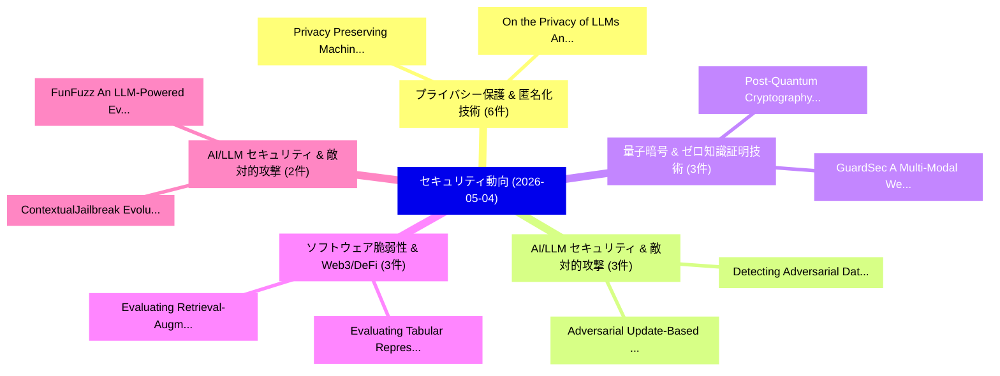

# 📅 02_daily: 日次エグゼクティブサマリー報告書 (2026-05-04)

**集計日時**: 2026-10-02 23:06:08 UTC  
**対象日付**: 2026-05-04  
**本日収集論文数**: 45 件  

---

## 💡 主要セキュリティ動向・脅威インサイト (Executive Insights)

本日の収集論文（計 45 件）において、以下の重点セキュリティ領域で活発な研究動向が確認されました：
- **プライバシー保護 & 匿名化技術** (6 件): 注目論文として 「On the Privacy of LLMs: An Abl...」、「Privacy Preserving Machine Lea...」 等が発表され、実務防御および攻撃検証の進展が見られます。
- **AI/LLM セキュリティ & 敵対的攻撃** (3 件): 注目論文として 「Detecting Adversarial Data via...」、「Adversarial Update-Based Feder...」 等が発表され、実務防御および攻撃検証の進展が見られます。
- **量子暗号 & ゼロ知識証明技術** (3 件): 注目論文として 「Post-Quantum Cryptography Migr...」、「GuardSec: A Multi-Modal Web Pl...」 等が発表され、実務防御および攻撃検証の進展が見られます。
- **ソフトウェア脆弱性 & Web3/DeFi** (3 件): 注目論文として 「Evaluating Tabular Representat...」、「Evaluating Retrieval-Augmented...」 等が発表され、実務防御および攻撃検証の進展が見られます。
- **AI/LLM セキュリティ & 敵対的攻撃** (2 件): 注目論文として 「ContextualJailbreak: Evolution...」、「FunFuzz: An LLM-Powered Evolut...」 等が発表され、実務防御および攻撃検証の進展が見られます。

### 🗺️ 技術・脅威トピックマインドマップ

---

## 📌 日次セキュリティ論文一覧 (日本語表形式)

| No | arXiv ID | 論文タイトル (日本語訳) | 重要キーワード | 構造化エグゼクティブ要約 (背景・提案・影響) | 脅威分類 | 詳細リンク |
|---|---|---|---|---|---|---|
| 1 | `2605.02109v1` | [Detecting Adversarial Data via Provable Adversarial Noise Amplification（セキュリティ分析論文）](../../okf/papers/2026-05-04/2605.02109.md) | `Provable Adversarial Noise Amplification`, `Detecting Adversarial Data`, `Furkan Mumcu` | 【提案】概要 (Overview & Key Finding) 本論文「Detecting Adversarial Data via Provable Adversarial Noi...。実証評価により経営層・セキュリティ管理者向け推奨アクション (E... | `arXiv` | [arXiv](https://arxiv.org/abs/2605.02109v1) &#124; [OKF](../../okf/papers/2026-05-04/2605.02109.md) |
| 2 | `2605.02110v1` | [Adversarial Update-Based Federated Unlearning for Poisoned Model Recovery（セキュリティ分析論文）](../../okf/papers/2026-05-04/2605.02110.md) | `Based Federated Unlearning`, `Poisoned Model Recovery`, `Adversarial Update` | 【提案】概要 (Overview & Key Finding) 本論文「Adversarial Update-Based Federated Unlearning for Poiso...。実証評価により経営層・セキュリティ管理者向け推奨アクション (E... | `arXiv` | [arXiv](https://arxiv.org/abs/2605.02110v1) &#124; [OKF](../../okf/papers/2026-05-04/2605.02110.md) |
| 3 | `2605.02121v1` | [SCRIBE: Practical Static Binary Patching via Binary-Aware Recompilation of Decompiled Code（セキュリティ分析論文）](../../okf/papers/2026-05-04/2605.02121.md) | `Practical Static Binary Patching`, `Aware Recompilation`, `Decompiled Code` | 【提案】概要 (Overview & Key Finding) 本論文「SCRIBE: Practical Static Binary Patching via Binary-Awa...。実証評価により経営層・セキュリティ管理者向け推奨アクション (E... | `arXiv` | [arXiv](https://arxiv.org/abs/2605.02121v1) &#124; [OKF](../../okf/papers/2026-05-04/2605.02121.md) |
| 4 | `2605.02187v2` | [Rewriting the Response Path: Silent Tampering and Provider-Signed Defense in BYOK LLMエージェント](../../okf/papers/2026-05-04/2605.02187.md) | `Response Path`, `Silent Tampering`, `Signed Defense` | 【提案】概要 (Overview & Key Finding) 本論文「Rewriting the Response Path: Silent Tampering and Provi...。実証評価により経営層・セキュリティ管理者向け推奨アクション (E... | `arXiv` | [arXiv](https://arxiv.org/abs/2605.02187v2) &#124; [OKF](../../okf/papers/2026-05-04/2605.02187.md) |
| 5 | `2605.02255v1` | [On the Privacy of LLMs: An Ablation Study（セキュリティ分析論文）](../../okf/papers/2026-05-04/2605.02255.md) | `Karima Makhlouf`, `Lamiaa Basyoni`, `Syed Khaderi` | 【提案】概要 (Overview & Key Finding) 本論文「On the Privacy of LLMs: An Ablation Study（セキュリティ分析論文）」（...。実証評価により経営層・セキュリティ管理者向け推奨アクション (E... | `arXiv` | [arXiv](https://arxiv.org/abs/2605.02255v1) &#124; [OKF](../../okf/papers/2026-05-04/2605.02255.md) |
| 6 | `2605.02276v1` | [Post-Quantum Cryptography Migration in Australian Real-Time Payment Infrastructure: A Monte Carlo Simulation Study of the New Payments Platform（セキュリティ分析論文）](../../okf/papers/2026-05-04/2605.02276.md) | `Quantum Cryptography Migration`, `Time Payment Infrastructure`, `New Payments Platform` | 【提案】概要 (Overview & Key Finding) 本論文「ポスト量子暗号 Migration in Australian Real-Time Payment Infra...。実証評価により経営層・セキュリティ管理者向け推奨アクション (E... | `arXiv` | [arXiv](https://arxiv.org/abs/2605.02276v1) &#124; [OKF](../../okf/papers/2026-05-04/2605.02276.md) |
| 7 | `2605.02319v1` | [Optimal Privacy-Utility Trade-Offs in LDP: Functional and Geometric Perspectives（セキュリティ分析論文）](../../okf/papers/2026-05-04/2605.02319.md) | `Optimal Privacy`, `Utility Trade`, `Geometric Perspectives` | 【提案】概要 (Overview & Key Finding) 本論文「Optimal Privacy-Utility Trade-Offs in LDP: Functional a...。実証評価により経営層・セキュリティ管理者向け推奨アクション (E... | `arXiv` | [arXiv](https://arxiv.org/abs/2605.02319v1) &#124; [OKF](../../okf/papers/2026-05-04/2605.02319.md) |
| 8 | `2605.02346v1` | [APIOT: Autonomous Vulnerability Management Across Bare-Metal Industrial OT Networks（セキュリティ分析論文）](../../okf/papers/2026-05-04/2605.02346.md) | `Autonomous Vulnerability Management Across Bare`, `Metal Industrial`, `Bare-Metal Industrial` | 【提案】概要 (Overview & Key Finding) 本論文「APIOT: Autonomous 脆弱性 Management Across Bare-Metal Indu...。実証評価により経営層・セキュリティ管理者向け推奨アクション (E... | `arXiv` | [arXiv](https://arxiv.org/abs/2605.02346v1) &#124; [OKF](../../okf/papers/2026-05-04/2605.02346.md) |
| 9 | `2605.02372v1` | [Privacy Preserving Machine Learning Workflow: from Anonymization to Personalized Differential Privacy Budgets in 連合学習](../../okf/papers/2026-05-04/2605.02372.md) | `Privacy Preserving Machine Learning Workflow`, `Personalized Differential Privacy Budgets`, `Federated Learning` | 【提案】概要 (Overview & Key Finding) 本論文「Privacy Preserving Machine Learning Workflow: from Anon...。実証評価により経営層・セキュリティ管理者向け推奨アクション (E... | `arXiv` | [arXiv](https://arxiv.org/abs/2605.02372v1) &#124; [OKF](../../okf/papers/2026-05-04/2605.02372.md) |
| 10 | `2605.02374v1` | [Fight Poison with Poison: Enhancing Robustness in Few-shot Machine-Generated Text Detection with Adversarial Training（セキュリティ分析論文）](../../okf/papers/2026-05-04/2605.02374.md) | `Generated Text Detection`, `Fight Poison`, `Enhancing Robustness` | 【提案】概要 (Overview & Key Finding) 本論文「Fight Poison with Poison: Enhancing Robustness in Few-s...。実証評価により経営層・セキュリティ管理者向け推奨アクション (E... | `arXiv` | [arXiv](https://arxiv.org/abs/2605.02374v1) &#124; [OKF](../../okf/papers/2026-05-04/2605.02374.md) |
| 11 | `2605.02381v1` | [Design and Performance Evaluation of a BLE-Based IoT Authentication System（セキュリティ分析論文）](../../okf/papers/2026-05-04/2605.02381.md) | `Authentication System`, `BLE-Based IoT`, `Nitesh Yadav` | 【提案】概要 (Overview & Key Finding) 本論文「Design and Performance Evaluation of a BLE-Based IoT Au...。実証評価により経営層・セキュリティ管理者向け推奨アクション (E... | `arXiv` | [arXiv](https://arxiv.org/abs/2605.02381v1) &#124; [OKF](../../okf/papers/2026-05-04/2605.02381.md) |
| 12 | `2605.02391v2` | [Differentially Private Runtime Monitoring（セキュリティ分析論文）](../../okf/papers/2026-05-04/2605.02391.md) | `Differentially Private Runtime Monitoring`, `Bernd Finkbeiner`, `Frederik Scheerer` | 【提案】概要 (Overview & Key Finding) 本論文「Differentially Private Runtime Monitoring（セキュリティ分析論文）」（...。実証評価により経営層・セキュリティ管理者向け推奨アクション (E... | `arXiv` | [arXiv](https://arxiv.org/abs/2605.02391v2) &#124; [OKF](../../okf/papers/2026-05-04/2605.02391.md) |
| 13 | `2605.02502v4` | [GuardSec: A Multi-Modal Web Platform for Real-Time Digital Fraud Detection, Entity Verification, and Connection Security Analysis in the African Context（セキュリティ分析論文）](../../okf/papers/2026-05-04/2605.02502.md) | `Time Digital Fraud Detection`, `Modal Web Platform`, `Entity Verification` | 【提案】概要 (Overview & Key Finding) 本論文「GuardSec: A Multi-Modal Web Platform for Real-Time Digi...。実証評価により経営層・セキュリティ管理者向け推奨アクション (E... | `arXiv` | [arXiv](https://arxiv.org/abs/2605.02502v4) &#124; [OKF](../../okf/papers/2026-05-04/2605.02502.md) |
| 14 | `2605.02519v1` | [Evaluating Tabular Representation Learning for Network Intrusion Detection（セキュリティ分析論文）](../../okf/papers/2026-05-04/2605.02519.md) | `Evaluating Tabular Representation Learning`, `Network Intrusion Detection`, `Muhammad Usman Butt` | 【提案】概要 (Overview & Key Finding) 本論文「Evaluating Tabular Representation Learning for Network ...。実証評価により経営層・セキュリティ管理者向け推奨アクション (E... | `arXiv` | [arXiv](https://arxiv.org/abs/2605.02519v1) &#124; [OKF](../../okf/papers/2026-05-04/2605.02519.md) |
| 15 | `2605.02553v1` | [Noisy Networks, Nosy Neighbors: Simple Privacy Attacks Against Residential Wireless Traffic（セキュリティ分析論文）](../../okf/papers/2026-05-04/2605.02553.md) | `Noisy Networks`, `Nosy Neighbors`, `Arne Roszeitis` | 【提案】概要 (Overview & Key Finding) 本論文「Noisy Networks, Nosy Neighbors: Simple Privacy Attacks ...。実証評価により経営層・セキュリティ管理者向け推奨アクション (E... | `arXiv` | [arXiv](https://arxiv.org/abs/2605.02553v1) &#124; [OKF](../../okf/papers/2026-05-04/2605.02553.md) |
| 16 | `2605.02557v1` | [VertMark: A Unified Training-Free Robust Watermarking Framework for Vertical Domain Pre-trained Language Models（セキュリティ分析論文）](../../okf/papers/2026-05-04/2605.02557.md) | `Vertical Domain Pre`, `Unified Training`, `Language Models` | 【提案】概要 (Overview & Key Finding) 本論文「VertMark: A Unified Training-Free Robust Watermarking F...。実証評価により経営層・セキュリティ管理者向け推奨アクション (E... | `arXiv` | [arXiv](https://arxiv.org/abs/2605.02557v1) &#124; [OKF](../../okf/papers/2026-05-04/2605.02557.md) |
| 17 | `2605.02647v1` | [ContextualJailbreak: Evolutionary Red-Teaming via Simulated Conversational Priming（セキュリティ分析論文）](../../okf/papers/2026-05-04/2605.02647.md) | `Simulated Conversational Priming`, `Evolutionary Red`, `Red-Teaming via` | 【提案】概要 (Overview & Key Finding) 本論文「Contextualジェイルブレイク: Evolutionary Red-Teaming via Simula...。実証評価により経営層・セキュリティ管理者向け推奨アクション (E... | `arXiv` | [arXiv](https://arxiv.org/abs/2605.02647v1) &#124; [OKF](../../okf/papers/2026-05-04/2605.02647.md) |
| 18 | `2605.02702v1` | [Reflecthernet: Exfiltrating 100BASE-TX Ethernet Traffic Using a Retroreflector Hardware Trojan（セキュリティ分析論文）](../../okf/papers/2026-05-04/2605.02702.md) | `Ethernet Traffic Using`, `Retroreflector Hardware Trojan`, `100BASE-TX Ethernet` | 【提案】概要 (Overview & Key Finding) 本論文「Reflecthernet: Exfiltrating 100BASE-TX Ethernet Traffic...。実証評価により経営層・セキュリティ管理者向け推奨アクション (E... | `arXiv` | [arXiv](https://arxiv.org/abs/2605.02702v1) &#124; [OKF](../../okf/papers/2026-05-04/2605.02702.md) |
| 19 | `2605.02715v1` | [Dimensionality-Aware Anomaly Detection in Learned Representations of Self-Supervised Speech Models（セキュリティ分析論文）](../../okf/papers/2026-05-04/2605.02715.md) | `Aware Anomaly Detection`, `Supervised Speech Models`, `Learned Representations` | 【提案】概要 (Overview & Key Finding) 本論文「Dimensionality-Aware Anomaly Detection in Learned Repre...。実証評価により経営層・セキュリティ管理者向け推奨アクション (E... | `arXiv` | [arXiv](https://arxiv.org/abs/2605.02715v1) &#124; [OKF](../../okf/papers/2026-05-04/2605.02715.md) |
| 20 | `2605.02789v1` | [FunFuzz: An LLM-Powered Evolutionary Fuzzing Framework（セキュリティ分析論文）](../../okf/papers/2026-05-04/2605.02789.md) | `LLM-Powered Evolutionary`, `Raw Meta`, `Executive Summary` | 【提案】概要 (Overview & Key Finding) 本論文「FunFuzz: An LLM-Powered Evolutionary Fuzzing Framework（...。実証評価によりHernández-Ramos - **公開日時*... | `arXiv` | [arXiv](https://arxiv.org/abs/2605.02789v1) &#124; [OKF](../../okf/papers/2026-05-04/2605.02789.md) |
| 21 | `2605.02795v1` | [Analyzing Unsolicited Internet Traffic: Measuring IoT Security Threats via Network Telescopes（セキュリティ分析論文）](../../okf/papers/2026-05-04/2605.02795.md) | `Analyzing Unsolicited Internet Traffic`, `Security Threats`, `Network Telescopes` | 【提案】概要 (Overview & Key Finding) 本論文「Analyzing Unsolicited Internet Traffic: Measuring IoT S...。実証評価により経営層・セキュリティ管理者向け推奨アクション (E... | `arXiv` | [arXiv](https://arxiv.org/abs/2605.02795v1) &#124; [OKF](../../okf/papers/2026-05-04/2605.02795.md) |
| 22 | `2605.02812v1` | [Autonomous LLM Agent Worms: Cross-Platform Propagation, Automated Discovery and Temporal Re-Entry Defense（セキュリティ分析論文）](../../okf/papers/2026-05-04/2605.02812.md) | `Agent Worms`, `Platform Propagation`, `Automated Discovery` | 【提案】概要 (Overview & Key Finding) 本論文「Autonomous LLM Agent Worms: Cross-Platform Propagation,...。実証評価により経営層・セキュリティ管理者向け推奨アクション (E... | `arXiv` | [arXiv](https://arxiv.org/abs/2605.02812v1) &#124; [OKF](../../okf/papers/2026-05-04/2605.02812.md) |
| 23 | `2605.02824v1` | [InsureConnect: Blockchain and Digital Identity for the Property Insurance Market（セキュリティ分析論文）](../../okf/papers/2026-05-04/2605.02824.md) | `Property Insurance Market`, `Digital Identity`, `Eduardo Travassos` | 【提案】概要 (Overview & Key Finding) 本論文「InsureConnect: Blockchain and Digital Identity for the ...。実証評価により経営層・セキュリティ管理者向け推奨アクション (E... | `arXiv` | [arXiv](https://arxiv.org/abs/2605.02824v1) &#124; [OKF](../../okf/papers/2026-05-04/2605.02824.md) |
| 24 | `2605.02856v2` | [The 1-Bit Barrier is Universal: k-Stage Pipeline Composition and Unified Leakage Bounds for Standard Modular Reductions in PQC Hardware（セキュリティ分析論文）](../../okf/papers/2026-05-04/2605.02856.md) | `Stage Pipeline Composition`, `Unified Leakage Bounds`, `Standard Modular Reductions` | 【提案】概要 (Overview & Key Finding) 本論文「The 1-Bit Barrier is Universal: k-Stage Pipeline Compos...。実証評価により経営層・セキュリティ管理者向け推奨アクション (E... | `arXiv` | [arXiv](https://arxiv.org/abs/2605.02856v2) &#124; [OKF](../../okf/papers/2026-05-04/2605.02856.md) |
| 25 | `2605.02868v1` | [EvoPoC: Automated Exploit Synthesis for DeFi Smart Contracts via Hierarchical Knowledge Graphs（セキュリティ分析論文）](../../okf/papers/2026-05-04/2605.02868.md) | `Automated Exploit Synthesis`, `Hierarchical Knowledge Graphs`, `Smart Contracts` | 【提案】概要 (Overview & Key Finding) 本論文「EvoPoC: Automated エクスプロイト Synthesis for DeFi スマートコントラクト...。実証評価により経営層・セキュリティ管理者向け推奨アクション (E... | `arXiv` | [arXiv](https://arxiv.org/abs/2605.02868v1) &#124; [OKF](../../okf/papers/2026-05-04/2605.02868.md) |
| 26 | `2605.02978v1` | [Observability for Post-Quantum TLS Readiness: A Multi-Surface Evidence Framework（セキュリティ分析論文）](../../okf/papers/2026-05-04/2605.02978.md) | `Post-Quantum TLS`, `Multi-Surface Evidence`, `Luis Delgado` | 【提案】概要 (Overview & Key Finding) 本論文「Observability for Post-量子 TLS Readiness: A Multi-Surfac...。実証評価により経営層・セキュリティ管理者向け推奨アクション (E... | `arXiv` | [arXiv](https://arxiv.org/abs/2605.02978v1) &#124; [OKF](../../okf/papers/2026-05-04/2605.02978.md) |
| 27 | `2605.02979v1` | [a Risk-Cost Model for Financial Adaptive Authenticationに向けて](../../okf/papers/2026-05-04/2605.02979.md) | `Cost Model`, `Risk-Cost Model`, `Financial Adaptive Authentication` | 【提案】概要 (Overview & Key Finding) 本論文「a Risk-Cost Model for Financial Adaptive Authentication...。実証評価により経営層・セキュリティ管理者向け推奨アクション (E... | `arXiv` | [arXiv](https://arxiv.org/abs/2605.02979v1) &#124; [OKF](../../okf/papers/2026-05-04/2605.02979.md) |
| 28 | `2605.02982v1` | [SoK: After Decades of Web Tracker Detection, What's Next?（セキュリティ分析論文）](../../okf/papers/2026-05-04/2605.02982.md) | `Web Tracker Detection`, `Wolf Rieder`, `Philip Raschke` | 【提案】### (日本語題名: SoK: After Decades of Web Tracker Detection, What's Next?（セキュリティ分析論文）)  > [...。実証評価により経営層・セキュリティ管理者向け推奨アクション (E... | `arXiv` | [arXiv](https://arxiv.org/abs/2605.02982v1) &#124; [OKF](../../okf/papers/2026-05-04/2605.02982.md) |
| 29 | `2605.02987v1` | [LiteShield: Hybrid Feature Selection-Driven Lightweight Intrusion Detection for Resource-Constrained IoT Networks（セキュリティ分析論文）](../../okf/papers/2026-05-04/2605.02987.md) | `Hybrid Feature Selection`, `Driven Lightweight Intrusion Detection`, `Selection-Driven Lightweight` | 【提案】概要 (Overview & Key Finding) 本論文「LiteShield: Hybrid Feature Selection-Driven Lightweight...。実証評価により経営層・セキュリティ管理者向け推奨アクション (E... | `arXiv` | [arXiv](https://arxiv.org/abs/2605.02987v1) &#124; [OKF](../../okf/papers/2026-05-04/2605.02987.md) |
| 30 | `2605.02990v2` | [ChaRVoC: A Challenge-Response Voice Cancelable Authentication System（セキュリティ分析論文）](../../okf/papers/2026-05-04/2605.02990.md) | `Response Voice Cancelable Authentication System`, `Challenge-Response Voice`, `Khang Vo` | 【提案】概要 (Overview & Key Finding) 本論文「ChaRVoC: A Challenge-Response Voice Cancelable Authenti...。実証評価により経営層・セキュリティ管理者向け推奨アクション (E... | `arXiv` | [arXiv](https://arxiv.org/abs/2605.02990v2) &#124; [OKF](../../okf/papers/2026-05-04/2605.02990.md) |
| 31 | `2605.02992v1` | [PHANTOM: Polymorphic Honeytoken Adaptation with Narrative-Tailored Organisational Mimicry（セキュリティ分析論文）](../../okf/papers/2026-05-04/2605.02992.md) | `Polymorphic Honeytoken Adaptation`, `Tailored Organisational Mimicry`, `Narrative-Tailored Organisational` | 【提案】概要 (Overview & Key Finding) 本論文「PHANTOM: Polymorphic Honeytoken Adaptation with Narrati...。実証評価により経営層・セキュリティ管理者向け推奨アクション (E... | `arXiv` | [arXiv](https://arxiv.org/abs/2605.02992v1) &#124; [OKF](../../okf/papers/2026-05-04/2605.02992.md) |
| 32 | `2605.03034v1` | [Stable Agentic Control: Tool-Mediated LLM Architecture for Autonomous Cyber Defense（セキュリティ分析論文）](../../okf/papers/2026-05-04/2605.03034.md) | `Stable Agentic Control`, `Autonomous Cyber Defense`, `Tool-Mediated LLM` | 【提案】概要 (Overview & Key Finding) 本論文「Stable Agentic Control: Tool-Mediated LLM Architecture ...。実証評価により経営層・セキュリティ管理者向け推奨アクション (E... | `arXiv` | [arXiv](https://arxiv.org/abs/2605.03034v1) &#124; [OKF](../../okf/papers/2026-05-04/2605.03034.md) |
| 33 | `2605.03069v1` | [Distributed Deep Variational Approach for Privacy-preserving Data Release（セキュリティ分析論文）](../../okf/papers/2026-05-04/2605.03069.md) | `Data Release`, `Privacy-preserving Data`, `Zahir Alsulaimawi` | 【提案】概要 (Overview & Key Finding) 本論文「Distributed Deep Variational Approach for Privacy-prese...。実証評価により経営層・セキュリティ管理者向け推奨アクション (E... | `arXiv` | [arXiv](https://arxiv.org/abs/2605.03069v1) &#124; [OKF](../../okf/papers/2026-05-04/2605.03069.md) |
| 34 | `2605.03095v1` | [Revisiting JBShield: Breaking and Rebuilding Representation-Level Jailbreak Defenses（セキュリティ分析論文）](../../okf/papers/2026-05-04/2605.03095.md) | `Level Jailbreak Defenses`, `Rebuilding Representation`, `Representation-Level Jailbreak` | 【提案】概要 (Overview & Key Finding) 本論文「Revisiting JBShield: Breaking and Rebuilding Representa...。実証評価により経営層・セキュリティ管理者向け推奨アクション (E... | `arXiv` | [arXiv](https://arxiv.org/abs/2605.03095v1) &#124; [OKF](../../okf/papers/2026-05-04/2605.03095.md) |
| 35 | `2605.03129v1` | [PIIGuard: Mitigating PII Harvesting under Adversarial Sanitization（セキュリティ分析論文）](../../okf/papers/2026-05-04/2605.03129.md) | `Adversarial Sanitization`, `Mingshuo Liu`, `Yiwei Zha` | 【提案】概要 (Overview & Key Finding) 本論文「PIIGuard: Mitigating PII Harvesting under Adversarial S...。実証評価により経営層・セキュリティ管理者向け推奨アクション (E... | `arXiv` | [arXiv](https://arxiv.org/abs/2605.03129v1) &#124; [OKF](../../okf/papers/2026-05-04/2605.03129.md) |
| 36 | `2605.03138v1` | [Zero Day Attacks: Novel Behaviour or Novel Vulnerability?（セキュリティ分析論文）](../../okf/papers/2026-05-04/2605.03138.md) | `Zero Day Attacks`, `Nnamdi Jibunoh`, `Sara Khanchi` | 【提案】### (日本語題名: Zero Day Attacks: Novel Behaviour or Novel 脆弱性?（セキュリティ分析論文）)  > [!NOTE] > *...。実証評価により経営層・セキュリティ管理者向け推奨アクション (E... | `arXiv` | [arXiv](https://arxiv.org/abs/2605.03138v1) &#124; [OKF](../../okf/papers/2026-05-04/2605.03138.md) |
| 37 | `2605.03140v1` | [Evaluating Retrieval-Augmented Generation for Explainable Malware Analysis（セキュリティ分析論文）](../../okf/papers/2026-05-04/2605.03140.md) | `Evaluating Retrieval`, `Augmented Generation`, `Retrieval-Augmented Generation` | 【提案】概要 (Overview & Key Finding) 本論文「Evaluating Retrieval-Augmented Generation for Explainab...。実証評価により経営層・セキュリティ管理者向け推奨アクション (E... | `arXiv` | [arXiv](https://arxiv.org/abs/2605.03140v1) &#124; [OKF](../../okf/papers/2026-05-04/2605.03140.md) |
| 38 | `2605.03158v1` | [HackerSignal: A Large-Scale Multi-Source Dataset Linking Hacker Community Discourse to the CVE Vulnerability Lifecycle（セキュリティ分析論文）](../../okf/papers/2026-05-04/2605.03158.md) | `Source Dataset Linking Hacker Community Discourse`, `Scale Multi`, `Large-Scale Multi` | 【提案】概要 (Overview & Key Finding) 本論文「HackerSignal: A Large-Scale Multi-Source Dataset Linkin...。実証評価により経営層・セキュリティ管理者向け推奨アクション (E... | `arXiv` | [arXiv](https://arxiv.org/abs/2605.03158v1) &#124; [OKF](../../okf/papers/2026-05-04/2605.03158.md) |
| 39 | `2605.03179v1` | [A Validated Prompt Bank for Malicious Code Generation: Separating Executable Weapons from Security Knowledge in 1,554 Consensus-Labeled Prompts（セキュリティ分析論文）](../../okf/papers/2026-05-04/2605.03179.md) | `Validated Prompt Bank`, `Malicious Code Generation`, `Separating Executable Weapons` | 【提案】概要 (Overview & Key Finding) 本論文「A Validated Prompt Bank for Malicious Code Generation: ...。実証評価により経営層・セキュリティ管理者向け推奨アクション (E... | `arXiv` | [arXiv](https://arxiv.org/abs/2605.03179v1) &#124; [OKF](../../okf/papers/2026-05-04/2605.03179.md) |
| 40 | `2605.03188v2` | [Dependency-Aware Privacy for Multi-turn Agents（セキュリティ分析論文）](../../okf/papers/2026-05-04/2605.03188.md) | `Aware Privacy`, `Dependency-Aware Privacy`, `Multi-turn Agents` | 【提案】概要 (Overview & Key Finding) 本論文「Dependency-Aware Privacy for Multi-turn Agents（セキュリティ分析...。実証評価により経営層・セキュリティ管理者向け推奨アクション (E... | `arXiv` | [arXiv](https://arxiv.org/abs/2605.03188v2) &#124; [OKF](../../okf/papers/2026-05-04/2605.03188.md) |
| 41 | `2605.03213v2` | [When Agents Handle Secrets: A Survey of Confidential Computing for Agentic AI（セキュリティ分析論文）](../../okf/papers/2026-05-04/2605.03213.md) | `Confidential Computing`, `Javad Forough`, `Marios Kogias` | 【提案】概要 (Overview & Key Finding) 本論文「When Agents Handle Secrets: A Survey of Confidential Co...。実証評価により経営層・セキュリティ管理者向け推奨アクション (E... | `arXiv` | [arXiv](https://arxiv.org/abs/2605.03213v2) &#124; [OKF](../../okf/papers/2026-05-04/2605.03213.md) |
| 42 | `2605.03226v2` | [Self-Mined Hardness for Safety Fine-Tuning（セキュリティ分析論文）](../../okf/papers/2026-05-04/2605.03226.md) | `Mined Hardness`, `Safety Fine`, `Self-Mined Hardness` | 【提案】概要 (Overview & Key Finding) 本論文「Self-Mined Hardness for Safety Fine-Tuning（セキュリティ分析論文）」...。実証評価により経営層・セキュリティ管理者向け推奨アクション (E... | `arXiv` | [arXiv](https://arxiv.org/abs/2605.03226v2) &#124; [OKF](../../okf/papers/2026-05-04/2605.03226.md) |
| 43 | `2605.03228v1` | [MAGE: Safeguarding LLMエージェント against Long-Horizon Threats via Shadow Memory](../../okf/papers/2026-05-04/2605.03228.md) | `Horizon Threats`, `Shadow Memory`, `Long-Horizon Threats` | 【提案】概要 (Overview & Key Finding) 本論文「MAGE: Safeguarding LLMエージェント against Long-Horizon Threa...。実証評価により経営層・セキュリティ管理者向け推奨アクション (E... | `arXiv` | [arXiv](https://arxiv.org/abs/2605.03228v1) &#124; [OKF](../../okf/papers/2026-05-04/2605.03228.md) |
| 44 | `2605.03230v2` | [SILMARILS: Information-Theoretic and Quantum-Secure Designated-Verifier Signatures（セキュリティ分析論文）](../../okf/papers/2026-05-04/2605.03230.md) | `Secure Designated`, `Verifier Signatures`, `Quantum-Secure Designated` | 【提案】概要 (Overview & Key Finding) 本論文「SILMARILS: Information-Theoretic and 量子-Secure Designat...。実証評価により経営層・セキュリティ管理者向け推奨アクション (E... | `arXiv` | [arXiv](https://arxiv.org/abs/2605.03230v2) &#124; [OKF](../../okf/papers/2026-05-04/2605.03230.md) |
| 45 | `2605.08164v1` | [parHSOM: A novel parallel Hierarchical Self-Organizing Map implementation（セキュリティ分析論文）](../../okf/papers/2026-05-04/2605.08164.md) | `Hierarchical Self`, `Organizing Map`, `Self-Organizing Map` | 【提案】概要 (Overview & Key Finding) 本論文「parHSOM: A novel parallel Hierarchical Self-Organizing ...。実証評価により経営層・セキュリティ管理者向け推奨アクション (E... | `arXiv` | [arXiv](https://arxiv.org/abs/2605.08164v1) &#124; [OKF](../../okf/papers/2026-05-04/2605.08164.md) |

