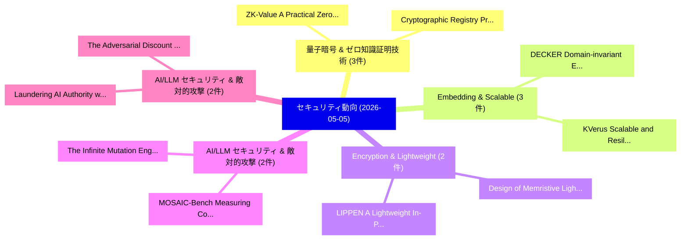

# 📅 02_daily: 日次エグゼクティブサマリー報告書 (2026-05-05)

**集計日時**: 2026-10-02 23:06:08 UTC  
**対象日付**: 2026-05-05  
**本日収集論文数**: 35 件  

---

## 💡 主要セキュリティ動向・脅威インサイト (Executive Insights)

本日の収集論文（計 35 件）において、以下の重点セキュリティ領域で活発な研究動向が確認されました：
- **量子暗号 & ゼロ知識証明技術** (3 件): 注目論文として 「Cryptographic Registry Provena...」、「ZK-Value: A Practical Zero-Kno...」 等が発表され、実務防御および攻撃検証の進展が見られます。
- **Embedding & Scalable** (3 件): 注目論文として 「DECKER: Domain-invariant Embed...」、「KVerus: Scalable and Resilient...」 等が発表され、実務防御および攻撃検証の進展が見られます。
- **Encryption & Lightweight** (2 件): 注目論文として 「Design of Memristive Lightweig...」、「LIPPEN: A Lightweight In-Place...」 等が発表され、実務防御および攻撃検証の進展が見られます。
- **AI/LLM セキュリティ & 敵対的攻撃** (2 件): 注目論文として 「The Infinite Mutation Engine? ...」、「MOSAIC-Bench: Measuring Compos...」 等が発表され、実務防御および攻撃検証の進展が見られます。
- **AI/LLM セキュリティ & 敵対的攻撃** (2 件): 注目論文として 「Laundering AI Authority with A...」、「The Adversarial Discount -- AI...」 等が発表され、実務防御および攻撃検証の進展が見られます。

### 🗺️ 技術・脅威トピックマインドマップ

---

## 📌 日次セキュリティ論文一覧 (日本語表形式)

| No | arXiv ID | 論文タイトル (日本語訳) | 重要キーワード | 構造化エグゼクティブ要約 (背景・提案・影響) | 脅威分類 | 詳細リンク |
|---|---|---|---|---|---|---|
| 1 | `2605.03309v2` | [Cryptographic Registry Provenance: Structural Defense Against Dependency Confusion in AI Package Ecosystems（セキュリティ分析論文）](../../okf/papers/2026-05-05/2605.03309.md) | `Cryptographic Registry Provenance`, `Package Ecosystems`, `Raw Meta` | 【提案】概要 (Overview & Key Finding) 本論文「Cryptographic Registry Provenance: Structural Defense A...。実証評価により経営層・セキュリティ管理者向け推奨アクション (E... | `arXiv` | [arXiv](https://arxiv.org/abs/2605.03309v2) &#124; [OKF](../../okf/papers/2026-05-05/2605.03309.md) |
| 2 | `2605.03353v4` | [SkCC: Portable and Secure Skill Compilation for Cross-Framework LLMエージェント](../../okf/papers/2026-05-05/2605.03353.md) | `Secure Skill Compilation`, `Cross-Framework LLM`, `Yipeng Ouyang` | 【提案】概要 (Overview & Key Finding) 本論文「SkCC: Portable and Secure Skill Compilation for Cross-F...。実証評価により経営層・セキュリティ管理者向け推奨アクション (E... | `arXiv` | [arXiv](https://arxiv.org/abs/2605.03353v4) &#124; [OKF](../../okf/papers/2026-05-05/2605.03353.md) |
| 3 | `2605.03378v2` | [ARGUS: Defending LLMエージェント Against Context-Aware Prompt Injection](../../okf/papers/2026-05-05/2605.03378.md) | `Aware Prompt Injection`, `Context-Aware Prompt`, `Shihao Weng` | 【提案】概要 (Overview & Key Finding) 本論文「ARGUS: Defending LLMエージェント Against Context-Aware プロンプトイ...。実証評価により経営層・セキュリティ管理者向け推奨アクション (E... | `arXiv` | [arXiv](https://arxiv.org/abs/2605.03378v2) &#124; [OKF](../../okf/papers/2026-05-05/2605.03378.md) |
| 4 | `2605.03384v2` | [DECKER: Domain-invariant Embedding for Cross-Keyboard Extraction and Recognition（セキュリティ分析論文）](../../okf/papers/2026-05-05/2605.03384.md) | `Keyboard Extraction`, `Domain-invariant Embedding`, `Cross-Keyboard Extraction` | 【提案】概要 (Overview & Key Finding) 本論文「DECKER: Domain-invariant Embedding for Cross-Keyboard E...。実証評価により経営層・セキュリティ管理者向け推奨アクション (E... | `arXiv` | [arXiv](https://arxiv.org/abs/2605.03384v2) &#124; [OKF](../../okf/papers/2026-05-05/2605.03384.md) |
| 5 | `2605.03388v1` | [Graph Reconstruction from Differentially Private GNN Explanations（セキュリティ分析論文）](../../okf/papers/2026-05-05/2605.03388.md) | `Graph Reconstruction`, `Differentially Private`, `Rishi Raj Sahoo` | 【提案】概要 (Overview & Key Finding) 本論文「Graph Reconstruction from Differentially Private GNN Ex...。実証評価により経営層・セキュリティ管理者向け推奨アクション (E... | `arXiv` | [arXiv](https://arxiv.org/abs/2605.03388v1) &#124; [OKF](../../okf/papers/2026-05-05/2605.03388.md) |
| 6 | `2605.03441v1` | [Exposing LLM Safety Gaps Through Mathematical Encoding:New Attacks and Systematic Analysis（セキュリティ分析論文）](../../okf/papers/2026-05-05/2605.03441.md) | `New Attacks`, `Haoyu Zhang`, `Mohammad Zandsalimy` | 【提案】概要 (Overview & Key Finding) 本論文「Exposing LLM Safety Gaps Through Mathematical Encoding:...。実証評価により経営層・セキュリティ管理者向け推奨アクション (E... | `arXiv` | [arXiv](https://arxiv.org/abs/2605.03441v1) &#124; [OKF](../../okf/papers/2026-05-05/2605.03441.md) |
| 7 | `2605.03482v2` | [MEMSAD: Gradient-Coupled Anomaly Detection for Memory Poisoning in Retrieval-Augmented Agents（セキュリティ分析論文）](../../okf/papers/2026-05-05/2605.03482.md) | `Coupled Anomaly Detection`, `Memory Poisoning`, `Gradient-Coupled Anomaly` | 【提案】概要 (Overview & Key Finding) 本論文「MEMSAD: Gradient-Coupled Anomaly Detection for Memory P...。実証評価により経営層・セキュリティ管理者向け推奨アクション (E... | `arXiv` | [arXiv](https://arxiv.org/abs/2605.03482v2) &#124; [OKF](../../okf/papers/2026-05-05/2605.03482.md) |
| 8 | `2605.03492v2` | [From TinyGo to gc Compiler: Extending Zorya's Concolic Framework to Real-World Go Binaries（セキュリティ分析論文）](../../okf/papers/2026-05-05/2605.03492.md) | `World Go Binaries`, `Extending Zorya`, `Real-World Go` | 【提案】概要 (Overview & Key Finding) 本論文「From TinyGo to gc Compiler: Extending Zorya's Concolic ...。実証評価により経営層・セキュリティ管理者向け推奨アクション (E... | `arXiv` | [arXiv](https://arxiv.org/abs/2605.03492v2) &#124; [OKF](../../okf/papers/2026-05-05/2605.03492.md) |
| 9 | `2605.03494v2` | [Design of Memristive Lightweight Encryption For In-Memory Image Steganography（セキュリティ分析論文）](../../okf/papers/2026-05-05/2605.03494.md) | `Memory Image Steganography`, `In-Memory Image`, `Seyed Erfan Fatemieh` | 【提案】概要 (Overview & Key Finding) 本論文「Design of Memristive Lightweight Encryption For In-Memo...。実証評価により経営層・セキュリティ管理者向け推奨アクション (E... | `arXiv` | [arXiv](https://arxiv.org/abs/2605.03494v2) &#124; [OKF](../../okf/papers/2026-05-05/2605.03494.md) |
| 10 | `2605.03581v1` | [ZK-Value: A Practical Zero-Knowledge System for Verifiable Data Valuation（セキュリティ分析論文）](../../okf/papers/2026-05-05/2605.03581.md) | `Verifiable Data Valuation`, `Practical Zero`, `Knowledge System` | 【提案】概要 (Overview & Key Finding) 本論文「ZK-Value: A Practical Zero-Knowledge System for Verifia...。実証評価により経営層・セキュリティ管理者向け推奨アクション (E... | `arXiv` | [arXiv](https://arxiv.org/abs/2605.03581v1) &#124; [OKF](../../okf/papers/2026-05-05/2605.03581.md) |
| 11 | `2605.03619v2` | [The Infinite Mutation Engine? Measuring Polymorphism in LLM-Generated Offensive Code（セキュリティ分析論文）](../../okf/papers/2026-05-05/2605.03619.md) | `Generated Offensive Code`, `Measuring Polymorphism`, `LLM-Generated Offensive` | 【提案】Measuring Polymorphism in LLM-Generated Offensive Code ### (日本語題名: The Infinite Mutatio...。実証評価により経営層・セキュリティ管理者向け推奨アクション (E... | `arXiv` | [arXiv](https://arxiv.org/abs/2605.03619v2) &#124; [OKF](../../okf/papers/2026-05-05/2605.03619.md) |
| 12 | `2605.03697v1` | [Tailored Prompts, Targeted Protection: Vulnerability-Specific LLM Analysis for Smart Contracts（セキュリティ分析論文）](../../okf/papers/2026-05-05/2605.03697.md) | `Tailored Prompts`, `Targeted Protection`, `Smart Contracts` | 【提案】概要 (Overview & Key Finding) 本論文「Tailored Prompts, Targeted Protection: 脆弱性-Specific LLM...。実証評価により経営層・セキュリティ管理者向け推奨アクション (E... | `arXiv` | [arXiv](https://arxiv.org/abs/2605.03697v1) &#124; [OKF](../../okf/papers/2026-05-05/2605.03697.md) |
| 13 | `2605.03744v1` | [Internet of Things Security: A Survey on Common Attacks（セキュリティ分析論文）](../../okf/papers/2026-05-05/2605.03744.md) | `Things Security`, `Common Attacks`, `Luiz Antonio Pereira Silva` | 【提案】概要 (Overview & Key Finding) 本論文「Internet of Things Security: A Survey on Common Attacks...。実証評価により経営層・セキュリティ管理者向け推奨アクション (E... | `arXiv` | [arXiv](https://arxiv.org/abs/2605.03744v1) &#124; [OKF](../../okf/papers/2026-05-05/2605.03744.md) |
| 14 | `2605.03770v2` | [Firmware Distribution as Attack Surface: A Security Study of ASIC Cryptocurrency Miners（セキュリティ分析論文）](../../okf/papers/2026-05-05/2605.03770.md) | `Firmware Distribution`, `Attack Surface`, `Cryptocurrency Miners` | 【提案】概要 (Overview & Key Finding) 本論文「Firmware Distribution as Attack Surface: A Security Stu...。実証評価により経営層・セキュリティ管理者向け推奨アクション (E... | `arXiv` | [arXiv](https://arxiv.org/abs/2605.03770v2) &#124; [OKF](../../okf/papers/2026-05-05/2605.03770.md) |
| 15 | `2605.03812v1` | [GPUBreach: Privilege Escalation Attacks on GPUs using Rowhammer（セキュリティ分析論文）](../../okf/papers/2026-05-05/2605.03812.md) | `Privilege Escalation Attacks`, `Yuqin Yan`, `Guozhen Ding` | 【提案】概要 (Overview & Key Finding) 本論文「GPUBreach: 権限昇格 Attacks on GPUs using RowHammer（セキュリティ分...。実証評価によりLin, Yuqin Yan, Guozhen D... | `arXiv` | [arXiv](https://arxiv.org/abs/2605.03812v1) &#124; [OKF](../../okf/papers/2026-05-05/2605.03812.md) |
| 16 | `2605.03822v2` | [KVerus: Scalable and Resilient Formal Verification Proof Generation for Rust Code（セキュリティ分析論文）](../../okf/papers/2026-05-05/2605.03822.md) | `Resilient Formal Verification Proof Generation`, `Rust Code`, `Resilient Formal Verification Proof Genera` | 【提案】概要 (Overview & Key Finding) 本論文「KVerus: Scalable and Resilient Formal Verification Proo...。実証評価により経営層・セキュリティ管理者向け推奨アクション (E... | `arXiv` | [arXiv](https://arxiv.org/abs/2605.03822v2) &#124; [OKF](../../okf/papers/2026-05-05/2605.03822.md) |
| 17 | `2605.03857v1` | [A Deeper Dive into the Irreversibility of PolyProtect: Making Protected Face Templates Harder to Invert（セキュリティ分析論文）](../../okf/papers/2026-05-05/2605.03857.md) | `Making Protected Face Templates Harder`, `Deeper Dive`, `Making Protected Face Templa` | 【提案】概要 (Overview & Key Finding) 本論文「A Deeper Dive into the Irreversibility of PolyProtect: ...。実証評価により経営層・セキュリティ管理者向け推奨アクション (E... | `arXiv` | [arXiv](https://arxiv.org/abs/2605.03857v1) &#124; [OKF](../../okf/papers/2026-05-05/2605.03857.md) |
| 18 | `2605.03948v1` | [HELO Cryptography: A Lightweight Cryptographic System for Enhancing IoT Security in P2P Data Transmission（セキュリティ分析論文）](../../okf/papers/2026-05-05/2605.03948.md) | `Lightweight Cryptographic System`, `Data Transmission`, `Nafim Ahmed Bin Mohammad Noor` | 【提案】概要 (Overview & Key Finding) 本論文「HELO 暗号技術: A Lightweight Cryptographic System for Enhan...。実証評価により経営層・セキュリティ管理者向け推奨アクション (E... | `arXiv` | [arXiv](https://arxiv.org/abs/2605.03948v1) &#124; [OKF](../../okf/papers/2026-05-05/2605.03948.md) |
| 19 | `2605.03952v1` | [MOSAIC-Bench: Measuring Compositional Vulnerability Induction in Coding Agents（セキュリティ分析論文）](../../okf/papers/2026-05-05/2605.03952.md) | `Measuring Compositional Vulnerability Induction`, `Coding Agents`, `Jonathan Steinberg` | 【提案】概要 (Overview & Key Finding) 本論文「MOSAIC-Bench: Measuring Compositional 脆弱性 Induction in ...。実証評価により経営層・セキュリティ管理者向け推奨アクション (E... | `arXiv` | [arXiv](https://arxiv.org/abs/2605.03952v1) &#124; [OKF](../../okf/papers/2026-05-05/2605.03952.md) |
| 20 | `2605.03956v1` | [Generating Proof-of-Vulnerability Tests to Help Enhance the Security of Complex Software（セキュリティ分析論文）](../../okf/papers/2026-05-05/2605.03956.md) | `Generating Proof`, `Vulnerability Tests`, `Help Enhance` | 【提案】概要 (Overview & Key Finding) 本論文「Generating Proof-of-脆弱性 Tests to Help Enhance the Secur...。実証評価により経営層・セキュリティ管理者向け推奨アクション (E... | `arXiv` | [arXiv](https://arxiv.org/abs/2605.03956v1) &#124; [OKF](../../okf/papers/2026-05-05/2605.03956.md) |
| 21 | `2605.03974v1` | [LIPPEN: A Lightweight In-Place Pointer Encryption Architecture for Pointer Integrity（セキュリティ分析論文）](../../okf/papers/2026-05-05/2605.03974.md) | `Place Pointer Encryption Architecture`, `In-Place Pointer`, `Pointer Integrity` | 【提案】概要 (Overview & Key Finding) 本論文「LIPPEN: A Lightweight In-Place Pointer Encryption Archi...。実証評価により経営層・セキュリティ管理者向け推奨アクション (E... | `arXiv` | [arXiv](https://arxiv.org/abs/2605.03974v1) &#124; [OKF](../../okf/papers/2026-05-05/2605.03974.md) |
| 22 | `2605.04019v1` | [Redefining AI Red Teaming in the Agentic Era: From Weeks to Hours（セキュリティ分析論文）](../../okf/papers/2026-05-05/2605.04019.md) | `Red Teaming`, `Agentic Era`, `Raja Sekhar Rao Dheekonda` | 【提案】概要 (Overview & Key Finding) 本論文「Redefining AI Red Teaming in the Agentic Era: From Week...。実証評価により経営層・セキュリティ管理者向け推奨アクション (E... | `arXiv` | [arXiv](https://arxiv.org/abs/2605.04019v1) &#124; [OKF](../../okf/papers/2026-05-05/2605.04019.md) |
| 23 | `2605.04033v1` | [Probabilistic-bit Guided CDCL for SAT Solving using Ising Consensus Assumptions（セキュリティ分析論文）](../../okf/papers/2026-05-05/2605.04033.md) | `Ising Consensus Assumptions`, `Probabilistic-bit Guided`, `Melki Bino` | 【提案】概要 (Overview & Key Finding) 本論文「Probabilistic-bit Guided CDCL for SAT Solving using Isi...。実証評価により経営層・セキュリティ管理者向け推奨アクション (E... | `arXiv` | [arXiv](https://arxiv.org/abs/2605.04033v1) &#124; [OKF](../../okf/papers/2026-05-05/2605.04033.md) |
| 24 | `2605.04116v1` | [Membership Inference Attacks for Retrieval Based In-Context Learning for Document Question Answering（セキュリティ分析論文）](../../okf/papers/2026-05-05/2605.04116.md) | `Membership Inference Attacks`, `Document Question Answering`, `Context Learning` | 【提案】概要 (Overview & Key Finding) 本論文「Membership Inference Attacks for Retrieval Based In-Con...。実証評価により経営層・セキュリティ管理者向け推奨アクション (E... | `arXiv` | [arXiv](https://arxiv.org/abs/2605.04116v1) &#124; [OKF](../../okf/papers/2026-05-05/2605.04116.md) |
| 25 | `2605.04129v1` | [Quantum-Resistant Networks: A Review of Primitives, Protocols and Best Practices（セキュリティ分析論文）](../../okf/papers/2026-05-05/2605.04129.md) | `Resistant Networks`, `Quantum-Resistant Networks`, `Best Practices` | 【提案】概要 (Overview & Key Finding) 本論文「量子-Resistant Networks: A Review of Primitives, Protocol...。実証評価により経営層・セキュリティ管理者向け推奨アクション (E... | `arXiv` | [arXiv](https://arxiv.org/abs/2605.04129v1) &#124; [OKF](../../okf/papers/2026-05-05/2605.04129.md) |
| 26 | `2605.04209v2` | [Undetectable Backdoors in Model Parameters: Hiding Sparse Secrets in High Dimensions（セキュリティ分析論文）](../../okf/papers/2026-05-05/2605.04209.md) | `Hiding Sparse Secrets`, `Undetectable Backdoors`, `Model Parameters` | 【提案】概要 (Overview & Key Finding) 本論文「Undetectable Backdoors in Model Parameters: Hiding Spar...。実証評価により経営層・セキュリティ管理者向け推奨アクション (E... | `arXiv` | [arXiv](https://arxiv.org/abs/2605.04209v2) &#124; [OKF](../../okf/papers/2026-05-05/2605.04209.md) |
| 27 | `2605.04249v1` | [a Zero-Trust Supply-Chain Assurance Rubric for ORAN RIC Applicationsに向けて](../../okf/papers/2026-05-05/2605.04249.md) | `Chain Assurance Rubric`, `Trust Supply`, `Zero-Trust Supply` | 【提案】概要 (Overview & Key Finding) 本論文「a ゼロトラスト Supply-Chain Assurance Rubric for ORAN RIC App...。実証評価により経営層・セキュリティ管理者向け推奨アクション (E... | `arXiv` | [arXiv](https://arxiv.org/abs/2605.04249v1) &#124; [OKF](../../okf/papers/2026-05-05/2605.04249.md) |
| 28 | `2605.04250v2` | [Binary Image-Based Intrusion Detection for Operational Technology Networks: Extending the SPHBI Methodology from IoT to Modbus TCP（セキュリティ分析論文）](../../okf/papers/2026-05-05/2605.04250.md) | `Based Intrusion Detection`, `Operational Technology Networks`, `Binary Image` | 【提案】概要 (Overview & Key Finding) 本論文「Binary Image-Based Intrusion Detection for Operational ...。実証評価により経営層・セキュリティ管理者向け推奨アクション (E... | `arXiv` | [arXiv](https://arxiv.org/abs/2605.04250v2) &#124; [OKF](../../okf/papers/2026-05-05/2605.04250.md) |
| 29 | `2605.04251v1` | [Root-Cause-Driven Automated Vulnerability Repair（セキュリティ分析論文）](../../okf/papers/2026-05-05/2605.04251.md) | `Driven Automated Vulnerability Repair`, `Zion Leonahenahe Basque`, `Ati Priya Bajaj` | 【提案】概要 (Overview & Key Finding) 本論文「Root-Cause-Driven Automated 脆弱性 Repair（セキュリティ分析論文）」（原題:...。実証評価により経営層・セキュリティ管理者向け推奨アクション (E... | `arXiv` | [arXiv](https://arxiv.org/abs/2605.04251v1) &#124; [OKF](../../okf/papers/2026-05-05/2605.04251.md) |
| 30 | `2605.04260v1` | [Lightweight 脆弱性検出 from Code Metrics and Token Features](../../okf/papers/2026-05-05/2605.04260.md) | `Code Metrics`, `Token Features`, `Lightweight Vulnerability Detection` | 【提案】概要 (Overview & Key Finding) 本論文「Lightweight 脆弱性検出 from Code Metrics and Token Features」...。実証評価により経営層・セキュリティ管理者向け推奨アクション (E... | `arXiv` | [arXiv](https://arxiv.org/abs/2605.04260v1) &#124; [OKF](../../okf/papers/2026-05-05/2605.04260.md) |
| 31 | `2605.04261v1` | [Laundering AI Authority with Adversarial Examples（セキュリティ分析論文）](../../okf/papers/2026-05-05/2605.04261.md) | `Adversarial Examples`, `Jie Zhang`, `Pura Peetathawatchai` | 【提案】概要 (Overview & Key Finding) 本論文「Laundering AI Authority with Adversarial Examples（セキュリテ...。実証評価により経営層・セキュリティ管理者向け推奨アクション (E... | `arXiv` | [arXiv](https://arxiv.org/abs/2605.04261v1) &#124; [OKF](../../okf/papers/2026-05-05/2605.04261.md) |
| 32 | `2605.04280v1` | [Revocation-Ready CP-ABE Key Management for Blockchain-Based IoT Data Sharing（セキュリティ分析論文）](../../okf/papers/2026-05-05/2605.04280.md) | `Key Management`, `Data Sharing`, `Revocation-Ready CP` | 【提案】概要 (Overview & Key Finding) 本論文「Revocation-Ready CP-ABE Key Management for Blockchain-B...。実証評価により経営層・セキュリティ管理者向け推奨アクション (E... | `arXiv` | [arXiv](https://arxiv.org/abs/2605.04280v1) &#124; [OKF](../../okf/papers/2026-05-05/2605.04280.md) |
| 33 | `2605.04305v1` | [SWAN: Semantic Watermarking with Abstract Meaning Representation（セキュリティ分析論文）](../../okf/papers/2026-05-05/2605.04305.md) | `Abstract Meaning Representation`, `Semantic Watermarking`, `Ziping Ye` | 【提案】概要 (Overview & Key Finding) 本論文「SWAN: Semantic Watermarking with Abstract Meaning Repre...。実証評価により経営層・セキュリティ管理者向け推奨アクション (E... | `arXiv` | [arXiv](https://arxiv.org/abs/2605.04305v1) &#124; [OKF](../../okf/papers/2026-05-05/2605.04305.md) |
| 34 | `2605.04336v2` | [The Adversarial Discount -- AI, Signal Correlation, and the サイバーセキュリティ Arms Race](../../okf/papers/2026-05-05/2605.04336.md) | `Signal Correlation`, `Cybersecurity Arms Race`, `Arms Race` | 【提案】概要 (Overview & Key Finding) 本論文「The Adversarial Discount -- AI, Signal Correlation, and...。実証評価により経営層・セキュリティ管理者向け推奨アクション (E... | `arXiv` | [arXiv](https://arxiv.org/abs/2605.04336v2) &#124; [OKF](../../okf/papers/2026-05-05/2605.04336.md) |
| 35 | `2605.05251v1` | [Identifier-Free Code Embedding Models for Scalable Search（セキュリティ分析論文）](../../okf/papers/2026-05-05/2605.05251.md) | `Free Code Embedding Models`, `Scalable Search`, `Identifier-Free Code` | 【提案】概要 (Overview & Key Finding) 本論文「Identifier-Free Code Embedding Models for Scalable Sear...。実証評価により経営層・セキュリティ管理者向け推奨アクション (E... | `arXiv` | [arXiv](https://arxiv.org/abs/2605.05251v1) &#124; [OKF](../../okf/papers/2026-05-05/2605.05251.md) |

