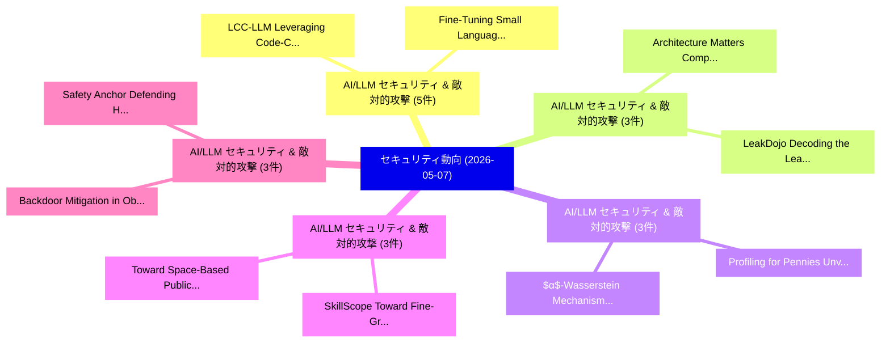

# 📅 02_daily: 日次エグゼクティブサマリー報告書 (2026-05-07)

**集計日時**: 2026-10-02 23:06:08 UTC  
**対象日付**: 2026-05-07  
**本日収集論文数**: 56 件  

---

## 💡 主要セキュリティ動向・脅威インサイト (Executive Insights)

本日の収集論文（計 56 件）において、以下の重点セキュリティ領域で活発な研究動向が確認されました：
- **AI/LLM セキュリティ & 敵対的攻撃** (5 件): 注目論文として 「LCC-LLM: Leveraging Code-Centr...」、「Fine-Tuning Small Language Mod...」 等が発表され、実務防御および攻撃検証の進展が見られます。
- **AI/LLM セキュリティ & 敵対的攻撃** (3 件): 注目論文として 「Architecture Matters: Comparin...」、「LeakDojo: Decoding the Leakage...」 等が発表され、実務防御および攻撃検証の進展が見られます。
- **AI/LLM セキュリティ & 敵対的攻撃** (3 件): 注目論文として 「$α$-Wasserstein Mechanism for ...」、「Profiling for Pennies: Unveili...」 等が発表され、実務防御および攻撃検証の進展が見られます。
- **AI/LLM セキュリティ & 敵対的攻撃** (3 件): 注目論文として 「SkillScope: Toward Fine-Graine...」、「Toward Space-Based Public Key ...」 等が発表され、実務防御および攻撃検証の進展が見られます。
- **AI/LLM セキュリティ & 敵対的攻撃** (3 件): 注目論文として 「Backdoor Mitigation in Object ...」、「Safety Anchor: Defending Harmf...」 等が発表され、実務防御および攻撃検証の進展が見られます。

### 🗺️ 技術・脅威トピックマインドマップ

---

## 📌 日次セキュリティ論文一覧 (日本語表形式)

| No | arXiv ID | 論文タイトル (日本語訳) | 重要キーワード | 構造化エグゼクティブ要約 (背景・提案・影響) | 脅威分類 | 詳細リンク |
|---|---|---|---|---|---|---|
| 1 | `2605.05531v1` | [Beyond Collection: Measuring the Detection Efficacy of Modern Security Logging Standards（セキュリティ分析論文）](../../okf/papers/2026-05-07/2605.05531.md) | `Modern Security Logging Standards`, `Beyond Collection`, `Detection Efficacy` | 【提案】概要 (Overview & Key Finding) 本論文「Beyond Collection: Measuring the Detection Efficacy of ...。実証評価により経営層・セキュリティ管理者向け推奨アクション (E... | `arXiv` | [arXiv](https://arxiv.org/abs/2605.05531v1) &#124; [OKF](../../okf/papers/2026-05-07/2605.05531.md) |
| 2 | `2605.05559v1` | [Adversarial procurement in blockchains（セキュリティ分析論文）](../../okf/papers/2026-05-07/2605.05559.md) | `Maryam Bahrani`, `Michael Neuder`, `Matthew Weinberg` | 【提案】概要 (Overview & Key Finding) 本論文「Adversarial procurement in blockchains（セキュリティ分析論文）」（原題:...。実証評価によりMatthew Weinberg - **公開日時... | `arXiv` | [arXiv](https://arxiv.org/abs/2605.05559v1) &#124; [OKF](../../okf/papers/2026-05-07/2605.05559.md) |
| 3 | `2605.05630v2` | [One Turn Too Late: Response-Aware Defense Against Hidden Malicious Intent in Multi-Turn Dialogue（セキュリティ分析論文）](../../okf/papers/2026-05-07/2605.05630.md) | `Turn Dialogue`, `Response-Aware Defense`, `Multi-Turn Dialogue` | 【提案】概要 (Overview & Key Finding) 本論文「One Turn Too Late: Response-Aware Defense Against Hidde...。実証評価により経営層・セキュリティ管理者向け推奨アクション (E... | `arXiv` | [arXiv](https://arxiv.org/abs/2605.05630v2) &#124; [OKF](../../okf/papers/2026-05-07/2605.05630.md) |
| 4 | `2605.05632v1` | [Architecture Matters: Comparing RAG Systems under Knowledge Base Poisoning（セキュリティ分析論文）](../../okf/papers/2026-05-07/2605.05632.md) | `Knowledge Base Poisoning`, `Architecture Matters`, `Samuel Korn` | 【提案】概要 (Overview & Key Finding) 本論文「Architecture Matters: Comparing RAG Systems under Knowl...。実証評価により経営層・セキュリティ管理者向け推奨アクション (E... | `arXiv` | [arXiv](https://arxiv.org/abs/2605.05632v1) &#124; [OKF](../../okf/papers/2026-05-07/2605.05632.md) |
| 5 | `2605.05644v1` | [AoI-Guided Client Selection for Robust and Timely Federated Intrusion Detection in Cloud-Edge Security Analytics（セキュリティ分析論文）](../../okf/papers/2026-05-07/2605.05644.md) | `Timely Federated Intrusion Detection`, `Guided Client Selection`, `Edge Security Analytics` | 【提案】概要 (Overview & Key Finding) 本論文「AoI-Guided Client Selection for Robust and Timely Feder...。実証評価により経営層・セキュリティ管理者向け推奨アクション (E... | `arXiv` | [arXiv](https://arxiv.org/abs/2605.05644v1) &#124; [OKF](../../okf/papers/2026-05-07/2605.05644.md) |
| 6 | `2605.05692v1` | [CFE-PPAR: Compression-friendly encryption for privacy-preserving action recognition leveraging video transformers（セキュリティ分析論文）](../../okf/papers/2026-05-07/2605.05692.md) | `Compression-friendly encryption`, `privacy-preserving action`, `Haiwei Lin` | 【提案】概要 (Overview & Key Finding) 本論文「CFE-PPAR: Compression-friendly encryption for privacy-p...。実証評価により経営層・セキュリティ管理者向け推奨アクション (E... | `arXiv` | [arXiv](https://arxiv.org/abs/2605.05692v1) &#124; [OKF](../../okf/papers/2026-05-07/2605.05692.md) |
| 7 | `2605.05704v3` | [SafeHarbor: Defining Precise Decision Boundaries via Hierarchical Memory-Augmented Guardrail for LLM Agent Safety（セキュリティ分析論文）](../../okf/papers/2026-05-07/2605.05704.md) | `Defining Precise Decision Boundaries`, `Hierarchical Memory`, `Augmented Guardrail` | 【提案】概要 (Overview & Key Finding) 本論文「SafeHarbor: Defining Precise Decision Boundaries via Hi...。実証評価により経営層・セキュリティ管理者向け推奨アクション (E... | `arXiv` | [arXiv](https://arxiv.org/abs/2605.05704v3) &#124; [OKF](../../okf/papers/2026-05-07/2605.05704.md) |
| 8 | `2605.05723v1` | [$α$-Wasserstein Mechanism for Rényi Pufferfish Privacy（セキュリティ分析論文）](../../okf/papers/2026-05-07/2605.05723.md) | `Wasserstein Mechanism`, `Pufferfish Privacy`, `Ni Ding` | 【提案】概要 (Overview & Key Finding) 本論文「$α$-Wasserstein Mechanism for Rényi Pufferfish Privacy（...。実証評価により経営層・セキュリティ管理者向け推奨アクション (E... | `arXiv` | [arXiv](https://arxiv.org/abs/2605.05723v1) &#124; [OKF](../../okf/papers/2026-05-07/2605.05723.md) |
| 9 | `2605.05774v2` | [SuperPaymaster: Eliminating Centralized Signer Authority via Asset-Oriented Abstraction to Reconcile Usability and Decentralization in Account Abstraction（セキュリティ分析論文）](../../okf/papers/2026-05-07/2605.05774.md) | `Eliminating Centralized Signer Authority`, `Oriented Abstraction`, `Reconcile Usability` | 【提案】概要 (Overview & Key Finding) 本論文「SuperPaymaster: Eliminating Centralized Signer Authorit...。実証評価により経営層・セキュリティ管理者向け推奨アクション (E... | `arXiv` | [arXiv](https://arxiv.org/abs/2605.05774v2) &#124; [OKF](../../okf/papers/2026-05-07/2605.05774.md) |
| 10 | `2605.05789v1` | [Stego Battlefield: Evaluating Image Steganography Attacks and Steganalysis Defenses（セキュリティ分析論文）](../../okf/papers/2026-05-07/2605.05789.md) | `Evaluating Image Steganography Attacks`, `Stego Battlefield`, `Steganalysis Defenses` | 【提案】概要 (Overview & Key Finding) 本論文「Stego Battlefield: Evaluating Image Steganography Attac...。実証評価により経営層・セキュリティ管理者向け推奨アクション (E... | `arXiv` | [arXiv](https://arxiv.org/abs/2605.05789v1) &#124; [OKF](../../okf/papers/2026-05-07/2605.05789.md) |
| 11 | `2605.05807v1` | [LCC-LLM: Leveraging Code-Centric 大規模言語モデル for Malware Attribution](../../okf/papers/2026-05-07/2605.05807.md) | `Leveraging Code`, `Malware Attribution`, `Centric Large Language Models` | 【提案】概要 (Overview & Key Finding) 本論文「LCC-LLM: Leveraging Code-Centric 大規模言語モデル for マルウェア Att...。実証評価により経営層・セキュリティ管理者向け推奨アクション (E... | `arXiv` | [arXiv](https://arxiv.org/abs/2605.05807v1) &#124; [OKF](../../okf/papers/2026-05-07/2605.05807.md) |
| 12 | `2605.05818v1` | [LeakDojo: Decoding the Leakage Threats of RAG Systems（セキュリティ分析論文）](../../okf/papers/2026-05-07/2605.05818.md) | `Leakage Threats`, `Maosen Zhang`, `Jianshuo Dong` | 【提案】概要 (Overview & Key Finding) 本論文「LeakDojo: Decoding the Leakage Threats of RAG Systems（セ...。実証評価により経営層・セキュリティ管理者向け推奨アクション (E... | `arXiv` | [arXiv](https://arxiv.org/abs/2605.05818v1) &#124; [OKF](../../okf/papers/2026-05-07/2605.05818.md) |
| 13 | `2605.05846v1` | [LoopTrap: Termination Poisoning Attacks on LLMエージェント](../../okf/papers/2026-05-07/2605.05846.md) | `Termination Poisoning Attacks`, `Huiyu Xu`, `Zhibo Wang` | 【提案】概要 (Overview & Key Finding) 本論文「LoopTrap: Termination Poisoning Attacks on LLMエージェント」（原...。実証評価により経営層・セキュリティ管理者向け推奨アクション (E... | `arXiv` | [arXiv](https://arxiv.org/abs/2605.05846v1) &#124; [OKF](../../okf/papers/2026-05-07/2605.05846.md) |
| 14 | `2605.05868v1` | [SkillScope: Toward Fine-Grained Least-Privilege Enforcement for Agent Skills（セキュリティ分析論文）](../../okf/papers/2026-05-07/2605.05868.md) | `Toward Fine`, `Grained Least`, `Privilege Enforcement` | 【提案】概要 (Overview & Key Finding) 本論文「SkillScope: Toward Fine-Grained Least-Privilege Enforce...。実証評価により経営層・セキュリティ管理者向け推奨アクション (E... | `arXiv` | [arXiv](https://arxiv.org/abs/2605.05868v1) &#124; [OKF](../../okf/papers/2026-05-07/2605.05868.md) |
| 15 | `2605.05887v1` | [ActiveFlowMark: Assessing Tor Anonymity under Active Bandwidth Watermarking（セキュリティ分析論文）](../../okf/papers/2026-05-07/2605.05887.md) | `Assessing Tor Anonymity`, `Active Bandwidth Watermarking`, `Active Bandwidth Wat` | 【提案】概要 (Overview & Key Finding) 本論文「ActiveFlowMark: Assessing Tor Anonymity under Active Ba...。実証評価により経営層・セキュリティ管理者向け推奨アクション (E... | `arXiv` | [arXiv](https://arxiv.org/abs/2605.05887v1) &#124; [OKF](../../okf/papers/2026-05-07/2605.05887.md) |
| 16 | `2605.05928v1` | [Backdoor Mitigation in Object Detection via Adversarial Fine-Tuning（セキュリティ分析論文）](../../okf/papers/2026-05-07/2605.05928.md) | `Backdoor Mitigation`, `Object Detection`, `Adversarial Fine` | 【提案】概要 (Overview & Key Finding) 本論文「Backdoor Mitigation in Object Detection via Adversarial...。実証評価により経営層・セキュリティ管理者向け推奨アクション (E... | `arXiv` | [arXiv](https://arxiv.org/abs/2605.05928v1) &#124; [OKF](../../okf/papers/2026-05-07/2605.05928.md) |
| 17 | `2605.05948v1` | [Toward Space-Based Public Key Systems: Enabling Secure Space Communications through In-Orbit Trust Services（セキュリティ分析論文）](../../okf/papers/2026-05-07/2605.05948.md) | `Based Public Key Systems`, `Enabling Secure Space Communications`, `Orbit Trust Services` | 【提案】概要 (Overview & Key Finding) 本論文「Toward Space-Based Public Key Systems: Enabling Secure ...。実証評価により経営層・セキュリティ管理者向け推奨アクション (E... | `arXiv` | [arXiv](https://arxiv.org/abs/2605.05948v1) &#124; [OKF](../../okf/papers/2026-05-07/2605.05948.md) |
| 18 | `2605.05969v2` | [Heimdallr: Characterizing and Detecting LLM-Induced Security Risks in GitHub CI Workflows（セキュリティ分析論文）](../../okf/papers/2026-05-07/2605.05969.md) | `Induced Security Risks`, `LLM-Induced Security`, `Bonan Ruan` | 【提案】概要 (Overview & Key Finding) 本論文「Heimdallr: Characterizing and Detecting LLM-Induced Sec...。実証評価により経営層・セキュリティ管理者向け推奨アクション (E... | `arXiv` | [arXiv](https://arxiv.org/abs/2605.05969v2) &#124; [OKF](../../okf/papers/2026-05-07/2605.05969.md) |
| 19 | `2605.05974v2` | [PragLocker: Protecting Agent Intellectual Property in Untrusted Deployments via Non-Portable Prompts（セキュリティ分析論文）](../../okf/papers/2026-05-07/2605.05974.md) | `Protecting Agent Intellectual Property`, `Untrusted Deployments`, `Portable Prompts` | 【提案】概要 (Overview & Key Finding) 本論文「PragLocker: Protecting Agent Intellectual Property in U...。実証評価により経営層・セキュリティ管理者向け推奨アクション (E... | `arXiv` | [arXiv](https://arxiv.org/abs/2605.05974v2) &#124; [OKF](../../okf/papers/2026-05-07/2605.05974.md) |
| 20 | `2605.05995v2` | [Safety Anchor: Defending Harmful Fine-tuning via Geometric Bottlenecks（セキュリティ分析論文）](../../okf/papers/2026-05-07/2605.05995.md) | `Defending Harmful Fine`, `Safety Anchor`, `Geometric Bottlenecks` | 【提案】概要 (Overview & Key Finding) 本論文「Safety Anchor: Defending Harmful Fine-tuning via Geomet...。実証評価により経営層・セキュリティ管理者向け推奨アクション (E... | `arXiv` | [arXiv](https://arxiv.org/abs/2605.05995v2) &#124; [OKF](../../okf/papers/2026-05-07/2605.05995.md) |
| 21 | `2605.06153v1` | [Secure Seed-Based Multi-bit Watermarking for Diffusion Models from First Principles（セキュリティ分析論文）](../../okf/papers/2026-05-07/2605.06153.md) | `Secure Seed`, `Based Multi`, `Diffusion Models` | 【提案】概要 (Overview & Key Finding) 本論文「Secure Seed-Based Multi-bit Watermarking for Diffusion ...。実証評価により経営層・セキュリティ管理者向け推奨アクション (E... | `arXiv` | [arXiv](https://arxiv.org/abs/2605.06153v1) &#124; [OKF](../../okf/papers/2026-05-07/2605.06153.md) |
| 22 | `2605.06158v1` | [Stateful Agent Backdoor（セキュリティ分析論文）](../../okf/papers/2026-05-07/2605.06158.md) | `Stateful Agent Backdoor`, `Zhengchunmin Dai`, `Jiaxiong Tang` | 【提案】概要 (Overview & Key Finding) 本論文「Stateful Agent Backdoor（セキュリティ分析論文）」（原題: Stateful Agent...。実証評価により経営層・セキュリティ管理者向け推奨アクション (E... | `arXiv` | [arXiv](https://arxiv.org/abs/2605.06158v1) &#124; [OKF](../../okf/papers/2026-05-07/2605.06158.md) |
| 23 | `2605.06205v1` | [ClawGuard: Out-of-Band LLM Agent Workflow Hijacking via EM Side Channelの検出](../../okf/papers/2026-05-07/2605.06205.md) | `Agent Workflow Hijacking`, `Band Detection`, `Side Channel` | 【提案】概要 (Overview & Key Finding) 本論文「ClawGuard: Out-of-Band LLM Agent Workflow Hijacking via...。実証評価により経営層・セキュリティ管理者向け推奨アクション (E... | `arXiv` | [arXiv](https://arxiv.org/abs/2605.06205v1) &#124; [OKF](../../okf/papers/2026-05-07/2605.06205.md) |
| 24 | `2605.06232v1` | [Profiling for Pennies: Unveiling the Privacy Iceberg of LLMエージェント](../../okf/papers/2026-05-07/2605.06232.md) | `Privacy Iceberg`, `Jiahao Chen`, `Qi Zhang` | 【提案】概要 (Overview & Key Finding) 本論文「Profiling for Pennies: Unveiling the Privacy Iceberg of...。実証評価により経営層・セキュリティ管理者向け推奨アクション (E... | `arXiv` | [arXiv](https://arxiv.org/abs/2605.06232v1) &#124; [OKF](../../okf/papers/2026-05-07/2605.06232.md) |
| 25 | `2605.06259v2` | [Trade-off Functions for DP-SGD with Subsampling based on Random Shuffling: Tight Upper and Lower Bounds（セキュリティ分析論文）](../../okf/papers/2026-05-07/2605.06259.md) | `Random Shuffling`, `Tight Upper`, `Lower Bounds` | 【提案】概要 (Overview & Key Finding) 本論文「Trade-off Functions for DP-SGD with Subsampling based o...。実証評価により経営層・セキュリティ管理者向け推奨アクション (E... | `arXiv` | [arXiv](https://arxiv.org/abs/2605.06259v2) &#124; [OKF](../../okf/papers/2026-05-07/2605.06259.md) |
| 26 | `2605.06324v1` | [Gaming the Metric, Not the Harm: Certifying Safety Audits against Strategic Platform Manipulation（セキュリティ分析論文）](../../okf/papers/2026-05-07/2605.06324.md) | `Certifying Safety Audits`, `Strategic Platform Manipulation`, `Raw Meta` | 【提案】背景とセキュリティ上の課題 (Background & Problem) 本研究はサイバー脅威環境におけるセキュリティ構造・脆弱性の検証を目的としています。(主要検出項目: ...。実証評価により経営層・セキュリティ管理者向け推奨アクション (E... | `arXiv` | [arXiv](https://arxiv.org/abs/2605.06324v1) &#124; [OKF](../../okf/papers/2026-05-07/2605.06324.md) |
| 27 | `2605.06330v1` | [Fine-Tuning Small Language Models for Solution-Oriented Windows Event Log Analysis（セキュリティ分析論文）](../../okf/papers/2026-05-07/2605.06330.md) | `Tuning Small Language Models`, `Fine-Tuning Small`, `Solution-Oriented Windows` | 【提案】概要 (Overview & Key Finding) 本論文「Fine-Tuning Small Language Models for Solution-Oriented...。実証評価により経営層・セキュリティ管理者向け推奨アクション (E... | `arXiv` | [arXiv](https://arxiv.org/abs/2605.06330v1) &#124; [OKF](../../okf/papers/2026-05-07/2605.06330.md) |
| 28 | `2605.06393v1` | [Constraining Host-Level Abuse in Self-Hosted Computer-Use Agents via TEE-Backed Isolation（セキュリティ分析論文）](../../okf/papers/2026-05-07/2605.06393.md) | `Constraining Host`, `Level Abuse`, `Hosted Computer` | 【提案】概要 (Overview & Key Finding) 本論文「Constraining Host-Level Abuse in Self-Hosted Computer-U...。実証評価により経営層・セキュリティ管理者向け推奨アクション (E... | `arXiv` | [arXiv](https://arxiv.org/abs/2605.06393v1) &#124; [OKF](../../okf/papers/2026-05-07/2605.06393.md) |
| 29 | `2605.06423v1` | [Pop Quiz Attack: Black-box Membership Inference Attacks Against 大規模言語モデル](../../okf/papers/2026-05-07/2605.06423.md) | `Pop Quiz Attack`, `Black-box Membership`, `Zeyuan Chen` | 【提案】概要 (Overview & Key Finding) 本論文「Pop Quiz Attack: Black-box Membership Inference Attacks...。実証評価により経営層・セキュリティ管理者向け推奨アクション (E... | `arXiv` | [arXiv](https://arxiv.org/abs/2605.06423v1) &#124; [OKF](../../okf/papers/2026-05-07/2605.06423.md) |
| 30 | `2605.06486v1` | [Autonomous Adversary: Red-Teaming in the age of LLM（セキュリティ分析論文）](../../okf/papers/2026-05-07/2605.06486.md) | `Autonomous Adversary`, `Mohammad Mamun`, `Mohamed Gaber` | 【提案】概要 (Overview & Key Finding) 本論文「Autonomous Adversary: Red-Teaming in the age of LLM（セキュ...。実証評価により経営層・セキュリティ管理者向け推奨アクション (E... | `arXiv` | [arXiv](https://arxiv.org/abs/2605.06486v1) &#124; [OKF](../../okf/papers/2026-05-07/2605.06486.md) |
| 31 | `2605.06502v1` | [Privacy by Postprocessing the Discrete Laplace Mechanism（セキュリティ分析論文）](../../okf/papers/2026-05-07/2605.06502.md) | `Discrete Laplace Mechanism`, `Quentin Hillebrand`, `Jacob Imola` | 【提案】概要 (Overview & Key Finding) 本論文「Privacy by Postprocessing the Discrete Laplace Mechanis...。実証評価により経営層・セキュリティ管理者向け推奨アクション (E... | `arXiv` | [arXiv](https://arxiv.org/abs/2605.06502v1) &#124; [OKF](../../okf/papers/2026-05-07/2605.06502.md) |
| 32 | `2605.06505v2` | [PACZero: PAC-Private Fine-Tuning of Language Models via Sign Quantization（セキュリティ分析論文）](../../okf/papers/2026-05-07/2605.06505.md) | `Private Fine`, `Language Models`, `Sign Quantization` | 【提案】概要 (Overview & Key Finding) 本論文「PACZero: PAC-Private Fine-Tuning of Language Models via...。実証評価により経営層・セキュリティ管理者向け推奨アクション (E... | `arXiv` | [arXiv](https://arxiv.org/abs/2605.06505v2) &#124; [OKF](../../okf/papers/2026-05-07/2605.06505.md) |
| 33 | `2605.06508v1` | [On the Security of Research Artifacts（セキュリティ分析論文）](../../okf/papers/2026-05-07/2605.06508.md) | `Research Artifacts`, `Nanda Rani`, `Christian Rossow` | 【提案】概要 (Overview & Key Finding) 本論文「On the Security of Research Artifacts（セキュリティ分析論文）」（原題: ...。実証評価により経営層・セキュリティ管理者向け推奨アクション (E... | `arXiv` | [arXiv](https://arxiv.org/abs/2605.06508v1) &#124; [OKF](../../okf/papers/2026-05-07/2605.06508.md) |
| 34 | `2605.06571v1` | [CLAD: A Clustered Label-Agnostic 連合学習 Framework for Joint Anomaly Detection and Attack Classification](../../okf/papers/2026-05-07/2605.06571.md) | `Joint Anomaly Detection`, `Clustered Label`, `Attack Classification` | 【提案】概要 (Overview & Key Finding) 本論文「CLAD: A Clustered Label-Agnostic 連合学習 Framework for Joi...。実証評価により経営層・セキュリティ管理者向け推奨アクション (E... | `arXiv` | [arXiv](https://arxiv.org/abs/2605.06571v1) &#124; [OKF](../../okf/papers/2026-05-07/2605.06571.md) |
| 35 | `2605.06596v1` | [FedAttr: Privacy-preserving Client-Level Attribution in Federated LLM Fine-tuningに向けて](../../okf/papers/2026-05-07/2605.06596.md) | `Level Attribution`, `Privacy-preserving Client`, `Towards Privacy` | 【提案】概要 (Overview & Key Finding) 本論文「FedAttr: Privacy-preserving Client-Level Attribution in...。実証評価により経営層・セキュリティ管理者向け推奨アクション (E... | `arXiv` | [arXiv](https://arxiv.org/abs/2605.06596v1) &#124; [OKF](../../okf/papers/2026-05-07/2605.06596.md) |
| 36 | `2605.06601v1` | [Patch2Vuln: Agentic Reconstruction of Vulnerabilities from Linux Distribution Binary Patches（セキュリティ分析論文）](../../okf/papers/2026-05-07/2605.06601.md) | `Linux Distribution Binary Patches`, `Agentic Reconstruction`, `Isaac David` | 【提案】概要 (Overview & Key Finding) 本論文「Patch2Vuln: Agentic Reconstruction of Vulnerabilities f...。実証評価により経営層・セキュリティ管理者向け推奨アクション (E... | `arXiv` | [arXiv](https://arxiv.org/abs/2605.06601v1) &#124; [OKF](../../okf/papers/2026-05-07/2605.06601.md) |
| 37 | `2605.06718v1` | [TUANDROMD-X: Advanced Entropy and Visual Analytics Dataset for Enhanced マルウェア検出 and Classification](../../okf/papers/2026-05-07/2605.06718.md) | `Visual Analytics Dataset`, `Advanced Entropy`, `Enhanced Malware Detection` | 【提案】概要 (Overview & Key Finding) 本論文「TUANDROMD-X: Advanced Entropy and Visual Analytics Data...。実証評価により経営層・セキュリティ管理者向け推奨アクション (E... | `arXiv` | [arXiv](https://arxiv.org/abs/2605.06718v1) &#124; [OKF](../../okf/papers/2026-05-07/2605.06718.md) |
| 38 | `2605.06731v1` | [When Routine Chats Turn Toxic: Unintended Long-Term State Poisoning in Personalized Agents（セキュリティ分析論文）](../../okf/papers/2026-05-07/2605.06731.md) | `Term State Poisoning`, `Unintended Long`, `Personalized Agents` | 【提案】概要 (Overview & Key Finding) 本論文「When Routine Chats Turn Toxic: Unintended Long-Term Sta...。実証評価により経営層・セキュリティ管理者向け推奨アクション (E... | `arXiv` | [arXiv](https://arxiv.org/abs/2605.06731v1) &#124; [OKF](../../okf/papers/2026-05-07/2605.06731.md) |
| 39 | `2605.06738v2` | [Trust Without Trusting: A Recomputable Trust Protocol for Autonomous Agents（セキュリティ分析論文）](../../okf/papers/2026-05-07/2605.06738.md) | `Trust Without Trusting`, `Recomputable Trust Protocol`, `Autonomous Agents` | 【提案】背景とセキュリティ上の課題 (Background & Problem) 本研究はサイバー脅威環境におけるセキュリティ構造・脆弱性の検証を目的としています。(主要検出項目: ...。実証評価により経営層・セキュリティ管理者向け推奨アクション (E... | `arXiv` | [arXiv](https://arxiv.org/abs/2605.06738v2) &#124; [OKF](../../okf/papers/2026-05-07/2605.06738.md) |
| 40 | `2605.06744v1` | [A UEFI System with SPDM to Protect Against Unauthorized Device Connections（セキュリティ分析論文）](../../okf/papers/2026-05-07/2605.06744.md) | `Raw Meta`, `Executive Summary`, `Key Finding` | 【提案】概要 (Overview & Key Finding) 本論文「A UEFI System with SPDM to Protect Against Unauthorized...。実証評価により経営層・セキュリティ管理者向け推奨アクション (E... | `arXiv` | [arXiv](https://arxiv.org/abs/2605.06744v1) &#124; [OKF](../../okf/papers/2026-05-07/2605.06744.md) |
| 41 | `2605.06750v1` | [When to Use Wireless Challenge-Response Physical Layer Authentication: Design of a Measurable Guideline for OFDM（セキュリティ分析論文）](../../okf/papers/2026-05-07/2605.06750.md) | `Use Wireless Challenge`, `Response Physical Layer Authentication`, `Measurable Guideline` | 【提案】概要 (Overview & Key Finding) 本論文「When to Use Wireless Challenge-Response Physical Layer ...。実証評価により経営層・セキュリティ管理者向け推奨アクション (E... | `arXiv` | [arXiv](https://arxiv.org/abs/2605.06750v1) &#124; [OKF](../../okf/papers/2026-05-07/2605.06750.md) |
| 42 | `2605.06751v2` | [Cryptographic and Information-theoretic Security Capacities for General Arbitrarily Varying Wiretap Channels（セキュリティ分析論文）](../../okf/papers/2026-05-07/2605.06751.md) | `General Arbitrarily Varying Wiretap Channels`, `Security Capacities`, `Information-theoretic Security` | 【提案】概要 (Overview & Key Finding) 本論文「Cryptographic and Information-theoretic Security Capaci...。実証評価により経営層・セキュリティ管理者向け推奨アクション (E... | `arXiv` | [arXiv](https://arxiv.org/abs/2605.06751v2) &#124; [OKF](../../okf/papers/2026-05-07/2605.06751.md) |
| 43 | `2605.06760v1` | [Language Models Can Autonomously Hack and Self-Replicate（セキュリティ分析論文）](../../okf/papers/2026-05-07/2605.06760.md) | `Language Models Can Autonomously Hack`, `Alena Air`, `Nikolaj Kotov` | 【提案】概要 (Overview & Key Finding) 本論文「Language Models Can Autonomously Hack and Self-Replicat...。実証評価により経営層・セキュリティ管理者向け推奨アクション (E... | `arXiv` | [arXiv](https://arxiv.org/abs/2605.06760v1) &#124; [OKF](../../okf/papers/2026-05-07/2605.06760.md) |
| 44 | `2605.06833v1` | [PAMPOS: Causal Transformer-based Trajectory Prediction for Attack-Agnostic Misbehavior Detection in V2X Networks（セキュリティ分析論文）](../../okf/papers/2026-05-07/2605.06833.md) | `Agnostic Misbehavior Detection`, `Causal Transformer`, `Trajectory Prediction` | 【提案】概要 (Overview & Key Finding) 本論文「PAMPOS: Causal Transformer-based Trajectory Prediction ...。実証評価により経営層・セキュリティ管理者向け推奨アクション (E... | `arXiv` | [arXiv](https://arxiv.org/abs/2605.06833v1) &#124; [OKF](../../okf/papers/2026-05-07/2605.06833.md) |
| 45 | `2605.06846v3` | [Narrow Secret Loyalty Dodges Black-Box Audits（セキュリティ分析論文）](../../okf/papers/2026-05-07/2605.06846.md) | `Narrow Secret Loyalty Dodges Black`, `Box Audits`, `Black-Box Audits` | 【提案】概要 (Overview & Key Finding) 本論文「Narrow Secret Loyalty Dodges Black-Box Audits（セキュリティ分析論...。実証評価により経営層・セキュリティ管理者向け推奨アクション (E... | `arXiv` | [arXiv](https://arxiv.org/abs/2605.06846v3) &#124; [OKF](../../okf/papers/2026-05-07/2605.06846.md) |
| 46 | `2605.06853v1` | [The Cost of Quantum Resistance: A Hash-Based Commit-Reveal Alternative for Minimizing Blockchain Infrastructure Overhead（セキュリティ分析論文）](../../okf/papers/2026-05-07/2605.06853.md) | `Minimizing Blockchain Infrastructure Overhead`, `Quantum Resistance`, `Based Commit` | 【提案】概要 (Overview & Key Finding) 本論文「The Cost of 量子 Resistance: A Hash-Based Commit-Reveal A...。実証評価により経営層・セキュリティ管理者向け推奨アクション (E... | `arXiv` | [arXiv](https://arxiv.org/abs/2605.06853v1) &#124; [OKF](../../okf/papers/2026-05-07/2605.06853.md) |
| 47 | `2605.06880v1` | [Zombies in Alternate Realities: The Afterlife of Domain Names in DNS Integrations（セキュリティ分析論文）](../../okf/papers/2026-05-07/2605.06880.md) | `Alternate Realities`, `Domain Names`, `Sulyab Thottungal Valapu` | 【提案】概要 (Overview & Key Finding) 本論文「Zombies in Alternate Realities: The Afterlife of Domain...。実証評価により経営層・セキュリティ管理者向け推奨アクション (E... | `arXiv` | [arXiv](https://arxiv.org/abs/2605.06880v1) &#124; [OKF](../../okf/papers/2026-05-07/2605.06880.md) |
| 48 | `2605.06894v1` | [McNdroid: A Longitudinal Multimodal Benchmark for Robust Drift Detection in Android Malware（セキュリティ分析論文）](../../okf/papers/2026-05-07/2605.06894.md) | `Longitudinal Multimodal Benchmark`, `Robust Drift Detection`, `Android Malware` | 【提案】概要 (Overview & Key Finding) 本論文「McNdroid: A Longitudinal Multimodal Benchmark for Robus...。実証評価により経営層・セキュリティ管理者向け推奨アクション (E... | `arXiv` | [arXiv](https://arxiv.org/abs/2605.06894v1) &#124; [OKF](../../okf/papers/2026-05-07/2605.06894.md) |
| 49 | `2605.06910v1` | [Large Language Models for IoC Recovery under Adversarial Code Obfuscation and Encryptionのベンチマーク評価](../../okf/papers/2026-05-07/2605.06910.md) | `Adversarial Code Obfuscation`, `Benchmarking Large Language Models`, `Large Language Models` | 【提案】概要 (Overview & Key Finding) 本論文「Large Language Models for IoC Recovery under Adversaria...。実証評価により経営層・セキュリティ管理者向け推奨アクション (E... | `arXiv` | [arXiv](https://arxiv.org/abs/2605.06910v1) &#124; [OKF](../../okf/papers/2026-05-07/2605.06910.md) |
| 50 | `2605.06932v1` | [Aquaman: A Transparent Proxy Architecture for Quantum Resilient Key Establishment（セキュリティ分析論文）](../../okf/papers/2026-05-07/2605.06932.md) | `Quantum Resilient Key Establishment`, `Transparent Proxy Architecture`, `Tushin Mallick` | 【提案】概要 (Overview & Key Finding) 本論文「Aquaman: A Transparent Proxy Architecture for 量子 Resili...。実証評価により経営層・セキュリティ管理者向け推奨アクション (E... | `arXiv` | [arXiv](https://arxiv.org/abs/2605.06932v1) &#124; [OKF](../../okf/papers/2026-05-07/2605.06932.md) |
| 51 | `2605.06933v2` | [MAGIQ: A Post-Quantum Multi-Agentic AI Governance System with Provable Security（セキュリティ分析論文）](../../okf/papers/2026-05-07/2605.06933.md) | `Quantum Multi`, `Post-Quantum Multi`, `Governance System` | 【提案】概要 (Overview & Key Finding) 本論文「MAGIQ: A Post-量子 Multi-Agentic AI Governance System wit...。実証評価により経営層・セキュリティ管理者向け推奨アクション (E... | `arXiv` | [arXiv](https://arxiv.org/abs/2605.06933v2) &#124; [OKF](../../okf/papers/2026-05-07/2605.06933.md) |
| 52 | `2605.07008v1` | [Pomegranate: A Lightweight Compartmentalization Architecture using Virtualization Extensions（セキュリティ分析論文）](../../okf/papers/2026-05-07/2605.07008.md) | `Lightweight Compartmentalization Architecture`, `Virtualization Extensions`, `Shriram Raja` | 【提案】概要 (Overview & Key Finding) 本論文「Pomegranate: A Lightweight Compartmentalization Archite...。実証評価により経営層・セキュリティ管理者向け推奨アクション (E... | `arXiv` | [arXiv](https://arxiv.org/abs/2605.07008v1) &#124; [OKF](../../okf/papers/2026-05-07/2605.07008.md) |
| 53 | `2605.07034v1` | [Beyond the Wrapper: Identifying Artifact Reliance in Static Malware Classifiers using TRUSTEE（セキュリティ分析論文）](../../okf/papers/2026-05-07/2605.07034.md) | `Identifying Artifact Reliance`, `Static Malware Classifiers`, `Riyazuddin Mohammed` | 【提案】概要 (Overview & Key Finding) 本論文「Beyond the Wrapper: Identifying Artifact Reliance in St...。実証評価により経営層・セキュリティ管理者向け推奨アクション (E... | `arXiv` | [arXiv](https://arxiv.org/abs/2605.07034v1) &#124; [OKF](../../okf/papers/2026-05-07/2605.07034.md) |
| 54 | `2605.08246v1` | [Smart Railway Obstruction Detection System using IoT and Computer Vision（セキュリティ分析論文）](../../okf/papers/2026-05-07/2605.08246.md) | `Smart Railway Obstruction Detection System`, `Computer Vision`, `Mritunjay Shall Peelam` | 【提案】概要 (Overview & Key Finding) 本論文「Smart Railway Obstruction Detection System using IoT an...。実証評価により経営層・セキュリティ管理者向け推奨アクション (E... | `arXiv` | [arXiv](https://arxiv.org/abs/2605.08246v1) &#124; [OKF](../../okf/papers/2026-05-07/2605.08246.md) |
| 55 | `2605.08257v1` | [Research on Security Enhancement Methods for Adversarial Robust Large Language Model Intelligent Agents for Medical Decision-Making Tasks（セキュリティ分析論文）](../../okf/papers/2026-05-07/2605.08257.md) | `Adversarial Robust Large Language Model Intelligent Agents`, `Security Enhancement Methods`, `Medical Decision` | 【提案】概要 (Overview & Key Finding) 本論文「Research on Security Enhancement Methods for Adversaria...。実証評価により経営層・セキュリティ管理者向け推奨アクション (E... | `arXiv` | [arXiv](https://arxiv.org/abs/2605.08257v1) &#124; [OKF](../../okf/papers/2026-05-07/2605.08257.md) |
| 56 | `2605.16336v2` | [On Seeding Watermarks to Detect Verbatim LLM Copy-Paste Responses（セキュリティ分析論文）](../../okf/papers/2026-05-07/2605.16336.md) | `Detect Verbatim`, `Paste Responses`, `Copy-Paste Responses` | 【提案】概要 (Overview & Key Finding) 本論文「On Seeding Watermarks to Detect Verbatim LLM Copy-Paste...。実証評価により経営層・セキュリティ管理者向け推奨アクション (E... | `arXiv` | [arXiv](https://arxiv.org/abs/2605.16336v2) &#124; [OKF](../../okf/papers/2026-05-07/2605.16336.md) |

