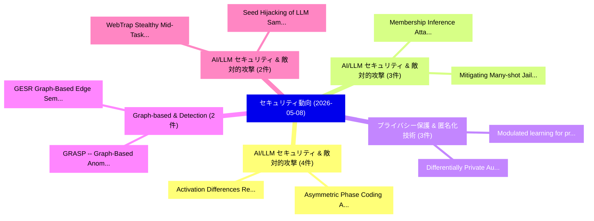

# 📅 02_daily: 日次エグゼクティブサマリー報告書 (2026-05-08)

**集計日時**: 2026-10-02 23:06:09 UTC  
**対象日付**: 2026-05-08  
**本日収集論文数**: 49 件  

---

## 💡 主要セキュリティ動向・脅威インサイト (Executive Insights)

本日の収集論文（計 49 件）において、以下の重点セキュリティ領域で活発な研究動向が確認されました：
- **AI/LLM セキュリティ & 敵対的攻撃** (4 件): 注目論文として 「Asymmetric Phase Coding Audio ...」、「Activation Differences Reveal ...」 等が発表され、実務防御および攻撃検証の進展が見られます。
- **AI/LLM セキュリティ & 敵対的攻撃** (3 件): 注目論文として 「Membership Inference Attacks o...」、「Mitigating Many-shot Jailbreak...」 等が発表され、実務防御および攻撃検証の進展が見られます。
- **プライバシー保護 & 匿名化技術** (3 件): 注目論文として 「Modulated learning for private...」、「Differentially Private Auditin...」 等が発表され、実務防御および攻撃検証の進展が見られます。
- **Graph-based & Detection** (2 件): 注目論文として 「GESR: Graph-Based Edge Semanti...」、「GRASP -- Graph-Based Anomaly D...」 等が発表され、実務防御および攻撃検証の進展が見られます。
- **AI/LLM セキュリティ & 敵対的攻撃** (2 件): 注目論文として 「WebTrap: Stealthy Mid-Task Hij...」、「Seed Hijacking of LLM Sampling...」 等が発表され、実務防御および攻撃検証の進展が見られます。

### 🗺️ 技術・脅威トピックマインドマップ

---

## 📌 日次セキュリティ論文一覧 (日本語表形式)

| No | arXiv ID | 論文タイトル (日本語訳) | 重要キーワード | 構造化エグゼクティブ要約 (背景・提案・影響) | 脅威分類 | 詳細リンク |
|---|---|---|---|---|---|---|
| 1 | `2605.07072v1` | [Less Random, More Private: What is the Optimal Subsampling Scheme for DP-SGD?（セキュリティ分析論文）](../../okf/papers/2026-05-08/2605.07072.md) | `Optimal Subsampling Scheme`, `Less Random`, `Andy Dong` | 【提案】### (日本語題名: Less Random, More Private: What is the Optimal Subsampling Scheme for DP-SG...。実証評価により経営層・セキュリティ管理者向け推奨アクション (E... | `arXiv` | [arXiv](https://arxiv.org/abs/2605.07072v1) &#124; [OKF](../../okf/papers/2026-05-08/2605.07072.md) |
| 2 | `2605.07088v1` | [Membership Inference Attacks on Vision-Language-Action Models（セキュリティ分析論文）](../../okf/papers/2026-05-08/2605.07088.md) | `Membership Inference Attacks`, `Action Models`, `Yuefeng Peng` | 【提案】概要 (Overview & Key Finding) 本論文「Membership Inference Attacks on Vision-Language-Action ...。実証評価により経営層・セキュリティ管理者向け推奨アクション (E... | `arXiv` | [arXiv](https://arxiv.org/abs/2605.07088v1) &#124; [OKF](../../okf/papers/2026-05-08/2605.07088.md) |
| 3 | `2605.07135v1` | [Demystifying and Detecting Agentic Workflow Injection Vulnerabilities in GitHub Actions（セキュリティ分析論文）](../../okf/papers/2026-05-08/2605.07135.md) | `Detecting Agentic Workflow Injection Vulnerabilities`, `Shenao Wang`, `Xinyi Hou` | 【提案】概要 (Overview & Key Finding) 本論文「Demystifying and Detecting Agentic Workflow Injection V...。実証評価により経営層・セキュリティ管理者向け推奨アクション (E... | `arXiv` | [arXiv](https://arxiv.org/abs/2605.07135v1) &#124; [OKF](../../okf/papers/2026-05-08/2605.07135.md) |
| 4 | `2605.07160v1` | [TENNOR: Trustworthy Execution for Neural Networks through Obliviousness and Retrievals（セキュリティ分析論文）](../../okf/papers/2026-05-08/2605.07160.md) | `Trustworthy Execution`, `Neural Networks`, `Zifan Qu` | 【提案】概要 (Overview & Key Finding) 本論文「TENNOR: Trustworthy Execution for Neural Networks throu...。実証評価により経営層・セキュリティ管理者向け推奨アクション (E... | `arXiv` | [arXiv](https://arxiv.org/abs/2605.07160v1) &#124; [OKF](../../okf/papers/2026-05-08/2605.07160.md) |
| 5 | `2605.07233v2` | [Modulated learning for private and distributed regression with just a single sample per client device（セキュリティ分析論文）](../../okf/papers/2026-05-08/2605.07233.md) | `Praneeth Vepakomma`, `Amirhossein Reisizadeh`, `Raw Meta` | 【提案】概要 (Overview & Key Finding) 本論文「Modulated learning for private and distributed regressi...。実証評価により経営層・セキュリティ管理者向け推奨アクション (E... | `arXiv` | [arXiv](https://arxiv.org/abs/2605.07233v2) &#124; [OKF](../../okf/papers/2026-05-08/2605.07233.md) |
| 6 | `2605.07241v2` | [Asymmetric Phase Coding Audio Watermarking（セキュリティ分析論文）](../../okf/papers/2026-05-08/2605.07241.md) | `Asymmetric Phase Coding Audio Watermarking`, `Guang Yang`, `Amir Ghasemian` | 【提案】概要 (Overview & Key Finding) 本論文「Asymmetric Phase Coding Audio Watermarking（セキュリティ分析論文）」...。実証評価により経営層・セキュリティ管理者向け推奨アクション (E... | `arXiv` | [arXiv](https://arxiv.org/abs/2605.07241v2) &#124; [OKF](../../okf/papers/2026-05-08/2605.07241.md) |
| 7 | `2605.07293v1` | [When the Ruler is Broken: Parsing-Induced Suppression in LLM-Based Security Log Evaluation（セキュリティ分析論文）](../../okf/papers/2026-05-08/2605.07293.md) | `Induced Suppression`, `Parsing-Induced Suppression`, `LLM-Based Security` | 【提案】概要 (Overview & Key Finding) 本論文「When the Ruler is Broken: Parsing-Induced Suppression i...。実証評価により経営層・セキュリティ管理者向け推奨アクション (E... | `arXiv` | [arXiv](https://arxiv.org/abs/2605.07293v1) &#124; [OKF](../../okf/papers/2026-05-08/2605.07293.md) |
| 8 | `2605.07324v1` | [Activation Differences Reveal Backdoors: A Comparison of SAE Architectures（セキュリティ分析論文）](../../okf/papers/2026-05-08/2605.07324.md) | `Activation Differences Reveal Backdoors`, `Sachin Kumar`, `Raw Meta` | 【提案】概要 (Overview & Key Finding) 本論文「Activation Differences Reveal Backdoors: A Comparison o...。実証評価により経営層・セキュリティ管理者向け推奨アクション (E... | `arXiv` | [arXiv](https://arxiv.org/abs/2605.07324v1) &#124; [OKF](../../okf/papers/2026-05-08/2605.07324.md) |
| 9 | `2605.07340v1` | [A Unified Open-Set Framework for Scalable PUF-Based Authentication of Heterogeneous IoT Devices（セキュリティ分析論文）](../../okf/papers/2026-05-08/2605.07340.md) | `Unified Open`, `Based Authentication`, `PUF-Based Authentication` | 【提案】概要 (Overview & Key Finding) 本論文「A Unified Open-Set Framework for Scalable PUF-Based Aut...。実証評価により経営層・セキュリティ管理者向け推奨アクション (E... | `arXiv` | [arXiv](https://arxiv.org/abs/2605.07340v1) &#124; [OKF](../../okf/papers/2026-05-08/2605.07340.md) |
| 10 | `2605.07383v1` | [Combating Organized Platform Abuse: Amplifying Weak Risk Signals with Structural Information（セキュリティ分析論文）](../../okf/papers/2026-05-08/2605.07383.md) | `Combating Organized Platform Abuse`, `Amplifying Weak Risk Signals`, `Structural Information` | 【提案】概要 (Overview & Key Finding) 本論文「Combating Organized Platform Abuse: Amplifying Weak Ris...。実証評価により経営層・セキュリティ管理者向け推奨アクション (E... | `arXiv` | [arXiv](https://arxiv.org/abs/2605.07383v1) &#124; [OKF](../../okf/papers/2026-05-08/2605.07383.md) |
| 11 | `2605.07387v1` | [Game-Theoretic Transaction Selection in DAG-Based Distributed Ledgersの分析](../../okf/papers/2026-05-08/2605.07387.md) | `DAG-Based Distributed`, `Based Distributed Ledgers`, `Theoretic Transaction Selection` | 【提案】概要 (Overview & Key Finding) 本論文「Game-Theoretic Transaction Selection in DAG-Based Distr...。実証評価により経営層・セキュリティ管理者向け推奨アクション (E... | `arXiv` | [arXiv](https://arxiv.org/abs/2605.07387v1) &#124; [OKF](../../okf/papers/2026-05-08/2605.07387.md) |
| 12 | `2605.07400v1` | [From Conceptual Scaffold to Prototype: A Standardized Zonal Architecture for Wi-Fi Security Training（セキュリティ分析論文）](../../okf/papers/2026-05-08/2605.07400.md) | `Standardized Zonal Architecture`, `Fi Security Training`, `Wi-Fi Security` | 【提案】概要 (Overview & Key Finding) 本論文「From Conceptual Scaffold to Prototype: A Standardized Z...。実証評価により経営層・セキュリティ管理者向け推奨アクション (E... | `arXiv` | [arXiv](https://arxiv.org/abs/2605.07400v1) &#124; [OKF](../../okf/papers/2026-05-08/2605.07400.md) |
| 13 | `2605.07414v1` | [OrchJail: Jailbreaking Tool-Calling Text-to-Image Agents by Orchestration-Guided Fuzzing（セキュリティ分析論文）](../../okf/papers/2026-05-08/2605.07414.md) | `Jailbreaking Tool`, `Calling Text`, `Image Agents` | 【提案】概要 (Overview & Key Finding) 本論文「OrchJail: ジェイルブレイクing Tool-Calling Text-to-Image Agents...。実証評価により経営層・セキュリティ管理者向け推奨アクション (E... | `arXiv` | [arXiv](https://arxiv.org/abs/2605.07414v1) &#124; [OKF](../../okf/papers/2026-05-08/2605.07414.md) |
| 14 | `2605.07430v1` | [Forensic video data deletion and recovery in Honeywell surveillance file systemの分析](../../okf/papers/2026-05-08/2605.07430.md) | `Jinhee Yoon`, `Sungjae Hwang`, `Raw Meta` | 【提案】概要 (Overview & Key Finding) 本論文「Forensic video data deletion and recovery in Honeywell ...。実証評価により経営層・セキュリティ管理者向け推奨アクション (E... | `arXiv` | [arXiv](https://arxiv.org/abs/2605.07430v1) &#124; [OKF](../../okf/papers/2026-05-08/2605.07430.md) |
| 15 | `2605.07472v1` | [HBEE: Human Behavioral Entropy Engine -- Pre-Registered Multi-Agent LLM Simulation of Peer-Suspicion-Based Detection Inversion（セキュリティ分析論文）](../../okf/papers/2026-05-08/2605.07472.md) | `Human Behavioral Entropy Engine`, `Based Detection Inversion`, `Registered Multi` | 【提案】概要 (Overview & Key Finding) 本論文「HBEE: Human Behavioral Entropy Engine -- Pre-Registered...。実証評価により経営層・セキュリティ管理者向け推奨アクション (E... | `arXiv` | [arXiv](https://arxiv.org/abs/2605.07472v1) &#124; [OKF](../../okf/papers/2026-05-08/2605.07472.md) |
| 16 | `2605.07481v1` | [Vaporizer: Breaking Watermarking Schemes for Large Language Model Outputs（セキュリティ分析論文）](../../okf/papers/2026-05-08/2605.07481.md) | `Large Language Model Outputs`, `Breaking Watermarking Schemes`, `Jonathan Hong Jin Ng` | 【提案】概要 (Overview & Key Finding) 本論文「Vaporizer: Breaking Watermarking Schemes for Large Lang...。実証評価により経営層・セキュリティ管理者向け推奨アクション (E... | `arXiv` | [arXiv](https://arxiv.org/abs/2605.07481v1) &#124; [OKF](../../okf/papers/2026-05-08/2605.07481.md) |
| 17 | `2605.07486v1` | [Spying Across Chiplets: Side-Channel Attacks in 2.5/3D Integrated Systems（セキュリティ分析論文）](../../okf/papers/2026-05-08/2605.07486.md) | `Spying Across Chiplets`, `Channel Attacks`, `Side-Channel Attacks` | 【提案】概要 (Overview & Key Finding) 本論文「Spying Across Chiplets: サイドチャネル攻撃 Attacks in 2.5/3D Int...。実証評価により経営層・セキュリティ管理者向け推奨アクション (E... | `arXiv` | [arXiv](https://arxiv.org/abs/2605.07486v1) &#124; [OKF](../../okf/papers/2026-05-08/2605.07486.md) |
| 18 | `2605.07490v1` | [Cross-Modal Backdoors in Multimodal 大規模言語モデル](../../okf/papers/2026-05-08/2605.07490.md) | `Modal Backdoors`, `Cross-Modal Backdoors`, `Multimodal Large Language Models` | 【提案】概要 (Overview & Key Finding) 本論文「Cross-Modal Backdoors in Multimodal 大規模言語モデル」（原題: Cross...。実証評価により経営層・セキュリティ管理者向け推奨アクション (E... | `arXiv` | [arXiv](https://arxiv.org/abs/2605.07490v1) &#124; [OKF](../../okf/papers/2026-05-08/2605.07490.md) |
| 19 | `2605.07515v1` | [An Automated Framework for サイバーセキュリティ Policy Compliance Assessment Against Security Control Standards](../../okf/papers/2026-05-08/2605.07515.md) | `Sandeep Kumar Shukla`, `Cybersecurity Policy Compliance`, `Bikash Saha` | 【提案】概要 (Overview & Key Finding) 本論文「An Automated Framework for サイバーセキュリティ Policy Compliance...。実証評価により経営層・セキュリティ管理者向け推奨アクション (E... | `arXiv` | [arXiv](https://arxiv.org/abs/2605.07515v1) &#124; [OKF](../../okf/papers/2026-05-08/2605.07515.md) |
| 20 | `2605.07535v1` | [Resilience of IEC 61850 Sampled Values-Based Protection Systems Under Coordinated False Data Injections（セキュリティ分析論文）](../../okf/papers/2026-05-08/2605.07535.md) | `Sampled Values`, `Values-Based Protection`, `Denys Mishchenko` | 【提案】概要 (Overview & Key Finding) 本論文「Resilience of IEC 61850 Sampled Values-Based Protection...。実証評価により経営層・セキュリティ管理者向け推奨アクション (E... | `arXiv` | [arXiv](https://arxiv.org/abs/2605.07535v1) &#124; [OKF](../../okf/papers/2026-05-08/2605.07535.md) |
| 21 | `2605.07536v1` | [GESR: Graph-Based Edge Semantic Reconstruction for Stealthy Communication Detection with Benign-Only Training（セキュリティ分析論文）](../../okf/papers/2026-05-08/2605.07536.md) | `Based Edge Semantic Reconstruction`, `Stealthy Communication Detection`, `Graph-Based Edge` | 【提案】概要 (Overview & Key Finding) 本論文「GESR: Graph-Based Edge Semantic Reconstruction for Stea...。実証評価により経営層・セキュリティ管理者向け推奨アクション (E... | `arXiv` | [arXiv](https://arxiv.org/abs/2605.07536v1) &#124; [OKF](../../okf/papers/2026-05-08/2605.07536.md) |
| 22 | `2605.07548v1` | [CCX: Enabling Unmodified Intel SGX Applications on Arm CCA（セキュリティ分析論文）](../../okf/papers/2026-05-08/2605.07548.md) | `Enabling Unmodified Intel`, `Matti Schulze`, `Thorsten Holz` | 【提案】概要 (Overview & Key Finding) 本論文「CCX: Enabling Unmodified Intel SGX Applications on Arm ...。実証評価により経営層・セキュリティ管理者向け推奨アクション (E... | `arXiv` | [arXiv](https://arxiv.org/abs/2605.07548v1) &#124; [OKF](../../okf/papers/2026-05-08/2605.07548.md) |
| 23 | `2605.07663v2` | [Quotient Semivalues for False-Name-Resistant Data Attribution（セキュリティ分析論文）](../../okf/papers/2026-05-08/2605.07663.md) | `Resistant Data Attribution`, `Quotient Semivalues`, `Raw Meta` | 【提案】概要 (Overview & Key Finding) 本論文「Quotient Semivalues for False-Name-Resistant Data Attri...。実証評価によりDavidson - **公開日時**: `202... | `arXiv` | [arXiv](https://arxiv.org/abs/2605.07663v2) &#124; [OKF](../../okf/papers/2026-05-08/2605.07663.md) |
| 24 | `2605.07674v2` | [Differentially Private Auditing Under Strategic Response（セキュリティ分析論文）](../../okf/papers/2026-05-08/2605.07674.md) | `Raw Meta`, `Executive Summary`, `Key Finding` | 【提案】概要 (Overview & Key Finding) 本論文「Differentially Private Auditing Under Strategic Respons...。実証評価によりBurnat - **公開日時**: `2026-... | `arXiv` | [arXiv](https://arxiv.org/abs/2605.07674v2) &#124; [OKF](../../okf/papers/2026-05-08/2605.07674.md) |
| 25 | `2605.07812v1` | [GRASP -- Graph-Based Anomaly Detection Through Self-Supervised Classification（セキュリティ分析論文）](../../okf/papers/2026-05-08/2605.07812.md) | `Supervised Classification`, `Graph-Based Anomaly`, `Self-Supervised Classification` | 【提案】概要 (Overview & Key Finding) 本論文「GRASP -- Graph-Based Anomaly Detection Through Self-Sup...。実証評価により経営層・セキュリティ管理者向け推奨アクション (E... | `arXiv` | [arXiv](https://arxiv.org/abs/2605.07812v1) &#124; [OKF](../../okf/papers/2026-05-08/2605.07812.md) |
| 26 | `2605.07814v1` | [Can I Check What I Designed? Mapping Security Design DSLs to Code Analyzers（セキュリティ分析論文）](../../okf/papers/2026-05-08/2605.07814.md) | `Mapping Security Design`, `Code Analyzers`, `Sven Peldszus` | 【提案】Mapping Security Design DSLs to Code Analyzers ### (日本語題名: Can I Check What I Designed?。実証評価により経営層・セキュリティ管理者向け推奨アクション (Exec... | `arXiv` | [arXiv](https://arxiv.org/abs/2605.07814v1) &#124; [OKF](../../okf/papers/2026-05-08/2605.07814.md) |
| 27 | `2605.07830v1` | [CyBiasBench: Bias in LLM Agents for Cyber-Attack Scenariosのベンチマーク評価](../../okf/papers/2026-05-08/2605.07830.md) | `Benchmarking Bias`, `Attack Scenarios`, `Cyber-Attack Scenarios` | 【提案】概要 (Overview & Key Finding) 本論文「CyBiasBench: Bias in LLM Agents for Cyber-Attack Scenar...。実証評価により経営層・セキュリティ管理者向け推奨アクション (E... | `arXiv` | [arXiv](https://arxiv.org/abs/2605.07830v1) &#124; [OKF](../../okf/papers/2026-05-08/2605.07830.md) |
| 28 | `2605.07854v1` | [Zero-determinant Strategy for Moving Target Defense: Existence, Performance, and Computation（セキュリティ分析論文）](../../okf/papers/2026-05-08/2605.07854.md) | `Moving Target Defense`, `Zero-determinant Strategy`, `Zhaoyang Cheng` | 【提案】概要 (Overview & Key Finding) 本論文「Zero-determinant Strategy for Moving Target Defense: Ex...。実証評価により経営層・セキュリティ管理者向け推奨アクション (E... | `arXiv` | [arXiv](https://arxiv.org/abs/2605.07854v1) &#124; [OKF](../../okf/papers/2026-05-08/2605.07854.md) |
| 29 | `2605.07900v1` | [Longitudinal Analyses of SAST Tools: A CodeQL Case Study（セキュリティ分析論文）](../../okf/papers/2026-05-08/2605.07900.md) | `Longitudinal Analyses`, `Charles Noirot Ferrand`, `Kyle Domico` | 【提案】概要 (Overview & Key Finding) 本論文「Longitudinal Analyses of SAST Tools: A CodeQL Case Stud...。実証評価により経営層・セキュリティ管理者向け推奨アクション (E... | `arXiv` | [arXiv](https://arxiv.org/abs/2605.07900v1) &#124; [OKF](../../okf/papers/2026-05-08/2605.07900.md) |
| 30 | `2605.07961v2` | [Graph Representation Learning Augmented Model Manipulation on Federated Fine-Tuning of LLMs（セキュリティ分析論文）](../../okf/papers/2026-05-08/2605.07961.md) | `Graph Representation Learning Augmented Model Manipulation`, `Federated Fine`, `Hanlin Cai` | 【提案】概要 (Overview & Key Finding) 本論文「Graph Representation Learning Augmented Model Manipulat...。実証評価により経営層・セキュリティ管理者向け推奨アクション (E... | `arXiv` | [arXiv](https://arxiv.org/abs/2605.07961v2) &#124; [OKF](../../okf/papers/2026-05-08/2605.07961.md) |
| 31 | `2605.07982v1` | [GLiGuard: Schema-Conditioned Classification for LLM Safeguard（セキュリティ分析論文）](../../okf/papers/2026-05-08/2605.07982.md) | `Conditioned Classification`, `Schema-Conditioned Classification`, `Urchade Zaratiana` | 【提案】概要 (Overview & Key Finding) 本論文「GLiGuard: Schema-Conditioned Classification for LLM Saf...。実証評価により経営層・セキュリティ管理者向け推奨アクション (E... | `arXiv` | [arXiv](https://arxiv.org/abs/2605.07982v1) &#124; [OKF](../../okf/papers/2026-05-08/2605.07982.md) |
| 32 | `2605.08277v1` | [Mitigating Many-shot Jailbreak Attacks with One Single Demonstration（セキュリティ分析論文）](../../okf/papers/2026-05-08/2605.08277.md) | `One Single Demonstration`, `Mitigating Many`, `Jailbreak Attacks` | 【提案】概要 (Overview & Key Finding) 本論文「Mitigating Many-shot ジェイルブレイク Attacks with One Single D...。実証評価により経営層・セキュリティ管理者向け推奨アクション (E... | `arXiv` | [arXiv](https://arxiv.org/abs/2605.08277v1) &#124; [OKF](../../okf/papers/2026-05-08/2605.08277.md) |
| 33 | `2605.08278v2` | [Trapping Attacker in Dilemma: Examining Internal Correlations and External Influences of Trigger for Defending GNN Backdoors（セキュリティ分析論文）](../../okf/papers/2026-05-08/2605.08278.md) | `Examining Internal Correlations`, `Trapping Attacker`, `External Influences` | 【提案】概要 (Overview & Key Finding) 本論文「Trapping Attacker in Dilemma: Examining Internal Correl...。実証評価により経営層・セキュリティ管理者向け推奨アクション (E... | `arXiv` | [arXiv](https://arxiv.org/abs/2605.08278v2) &#124; [OKF](../../okf/papers/2026-05-08/2605.08278.md) |
| 34 | `2605.08288v1` | [UMEDA: Unified Multi-modal Efficient Data Fusion for Privacy-Preserving Graph 連合学習 via Spectral-Gated Attention and Diffusion-Based Operator Alignment](../../okf/papers/2026-05-08/2605.08288.md) | `Efficient Data Fusion`, `Based Operator Alignment`, `Unified Multi` | 【提案】概要 (Overview & Key Finding) 本論文「UMEDA: Unified Multi-modal Efficient Data Fusion for Pr...。実証評価により経営層・セキュリティ管理者向け推奨アクション (E... | `arXiv` | [arXiv](https://arxiv.org/abs/2605.08288v1) &#124; [OKF](../../okf/papers/2026-05-08/2605.08288.md) |
| 35 | `2605.08310v1` | [WebTrap: Stealthy Mid-Task Hijacking of Browser Agents During Navigation（セキュリティ分析論文）](../../okf/papers/2026-05-08/2605.08310.md) | `Stealthy Mid`, `Task Hijacking`, `Mid-Task Hijacking` | 【提案】概要 (Overview & Key Finding) 本論文「WebTrap: Stealthy Mid-Task Hijacking of Browser Agents ...。実証評価により経営層・セキュリティ管理者向け推奨アクション (E... | `arXiv` | [arXiv](https://arxiv.org/abs/2605.08310v1) &#124; [OKF](../../okf/papers/2026-05-08/2605.08310.md) |
| 36 | `2605.08313v1` | [Seed Hijacking of LLM Sampling and Quantum Random Number Defense（セキュリティ分析論文）](../../okf/papers/2026-05-08/2605.08313.md) | `Quantum Random Number Defense`, `Seed Hijacking`, `Xiaoke Yang` | 【提案】概要 (Overview & Key Finding) 本論文「Seed Hijacking of LLM Sampling and 量子 Random Number Def...。実証評価により経営層・セキュリティ管理者向け推奨アクション (E... | `arXiv` | [arXiv](https://arxiv.org/abs/2605.08313v1) &#124; [OKF](../../okf/papers/2026-05-08/2605.08313.md) |
| 37 | `2605.08316v2` | [AI-Driven Security Alert Screening and Alert Fatigue Mitigation in Security Operations Centers: A Survey（セキュリティ分析論文）](../../okf/papers/2026-05-08/2605.08316.md) | `Driven Security Alert Screening`, `Alert Fatigue Mitigation`, `Security Operations Centers` | 【提案】概要 (Overview & Key Finding) 本論文「AI-Driven Security Alert Screening and Alert Fatigue Mi...。実証評価により経営層・セキュリティ管理者向け推奨アクション (E... | `arXiv` | [arXiv](https://arxiv.org/abs/2605.08316v2) &#124; [OKF](../../okf/papers/2026-05-08/2605.08316.md) |
| 38 | `2605.08343v1` | [Private Vertical Federated Inference for Time-Series（セキュリティ分析論文）](../../okf/papers/2026-05-08/2605.08343.md) | `Private Vertical Federated Inference`, `Lucas Fenaux`, `Larris Xie` | 【提案】概要 (Overview & Key Finding) 本論文「Private Vertical Federated Inference for Time-Series（セキ...。実証評価により経営層・セキュリティ管理者向け推奨アクション (E... | `arXiv` | [arXiv](https://arxiv.org/abs/2605.08343v1) &#124; [OKF](../../okf/papers/2026-05-08/2605.08343.md) |
| 39 | `2605.08363v1` | [Kettle: Attested builds for verifiable software provenance（セキュリティ分析論文）](../../okf/papers/2026-05-08/2605.08363.md) | `Amean Asad`, `Raw Meta`, `Executive Summary` | 【提案】概要 (Overview & Key Finding) 本論文「Kettle: Attested builds for verifiable software provena...。実証評価により経営層・セキュリティ管理者向け推奨アクション (E... | `arXiv` | [arXiv](https://arxiv.org/abs/2605.08363v1) &#124; [OKF](../../okf/papers/2026-05-08/2605.08363.md) |
| 40 | `2605.08382v1` | [SecureForge: Finding and Preventing Vulnerabilities in LLM-Generated Code via Prompt Optimization（セキュリティ分析論文）](../../okf/papers/2026-05-08/2605.08382.md) | `Preventing Vulnerabilities`, `Generated Code`, `Prompt Optimization` | 【提案】概要 (Overview & Key Finding) 本論文「SecureForge: Finding and Preventing Vulnerabilities in ...。実証評価により経営層・セキュリティ管理者向け推奨アクション (E... | `arXiv` | [arXiv](https://arxiv.org/abs/2605.08382v1) &#124; [OKF](../../okf/papers/2026-05-08/2605.08382.md) |
| 41 | `2605.08385v1` | [Quantifiable Uncertainty: A Stochastic Consensus Multi-Agent RAG Framework for Robust マルウェア検出](../../okf/papers/2026-05-08/2605.08385.md) | `Stochastic Consensus Multi`, `Quantifiable Uncertainty`, `Multi-Agent RAG` | 【提案】概要 (Overview & Key Finding) 本論文「Quantifiable Uncertainty: A Stochastic Consensus Multi-...。実証評価により経営層・セキュリティ管理者向け推奨アクション (E... | `arXiv` | [arXiv](https://arxiv.org/abs/2605.08385v1) &#124; [OKF](../../okf/papers/2026-05-08/2605.08385.md) |
| 42 | `2605.08418v2` | [Binge, Bot, Repeat: Unpacking the Ecosystem of Video Piracy on Telegram（セキュリティ分析論文）](../../okf/papers/2026-05-08/2605.08418.md) | `Video Piracy`, `Sayak Saha Roy`, `Sadikshya Gyawali` | 【提案】概要 (Overview & Key Finding) 本論文「Binge, Bot, Repeat: Unpacking the Ecosystem of Video Pi...。実証評価により経営層・セキュリティ管理者向け推奨アクション (E... | `arXiv` | [arXiv](https://arxiv.org/abs/2605.08418v2) &#124; [OKF](../../okf/papers/2026-05-08/2605.08418.md) |
| 43 | `2605.08419v2` | [Deterministic Fully-Static Whole-Binary Translation without Heuristics（セキュリティ分析論文）](../../okf/papers/2026-05-08/2605.08419.md) | `Deterministic Fully`, `Static Whole`, `Binary Translation` | 【提案】背景とセキュリティ上の課題 (Background & Problem) 本研究はサイバー脅威環境におけるセキュリティ構造・脆弱性の検証を目的としています。(主要検出項目: ...。実証評価により経営層・セキュリティ管理者向け推奨アクション (E... | `arXiv` | [arXiv](https://arxiv.org/abs/2605.08419v2) &#124; [OKF](../../okf/papers/2026-05-08/2605.08419.md) |
| 44 | `2605.08442v5` | [Injection-Execution Dissociation: A Mechanistic Evaluation of Persistent Memory Attacks and Defenses in Stateful LLMエージェント](../../okf/papers/2026-05-08/2605.08442.md) | `Persistent Memory Attacks`, `Execution Dissociation`, `Injection-Execution Dissociation` | 【提案】概要 (Overview & Key Finding) 本論文「Injection-Execution Dissociation: A Mechanistic Evaluat...。実証評価により経営層・セキュリティ管理者向け推奨アクション (E... | `arXiv` | [arXiv](https://arxiv.org/abs/2605.08442v5) &#124; [OKF](../../okf/papers/2026-05-08/2605.08442.md) |
| 45 | `2605.08443v1` | [Improving Parameter-Efficient 連合学習 with Differentially Private Refactorization](../../okf/papers/2026-05-08/2605.08443.md) | `Differentially Private Refactorization`, `Improving Parameter`, `Efficient Federated Learning` | 【提案】概要 (Overview & Key Finding) 本論文「Improving Parameter-Efficient 連合学習 with Differentially ...。実証評価により経営層・セキュリティ管理者向け推奨アクション (E... | `arXiv` | [arXiv](https://arxiv.org/abs/2605.08443v1) &#124; [OKF](../../okf/papers/2026-05-08/2605.08443.md) |
| 46 | `2605.08449v1` | [SL5 Standard for AI Security（セキュリティ分析論文）](../../okf/papers/2026-05-08/2605.08449.md) | `Lisa Thiergart`, `Yoav Tzfati`, `Peter Wagstaff` | 【提案】概要 (Overview & Key Finding) 本論文「SL5 Standard for AI Security（セキュリティ分析論文）」（原題: SL5 Stand...。実証評価により経営層・セキュリティ管理者向け推奨アクション (E... | `arXiv` | [arXiv](https://arxiv.org/abs/2605.08449v1) &#124; [OKF](../../okf/papers/2026-05-08/2605.08449.md) |
| 47 | `2605.08456v1` | [HEART: A High-Efficiency Adaptive Real-Time Telemonitoring Framework for Secure Electrocardiogram Signal Transmission Using Chaotic Encryption（セキュリティ分析論文）](../../okf/papers/2026-05-08/2605.08456.md) | `Secure Electrocardiogram Signal Transmission Using Chaotic Encryption`, `Efficiency Adaptive Real`, `High-Efficiency Adaptive` | 【提案】概要 (Overview & Key Finding) 本論文「HEART: A High-Efficiency Adaptive Real-Time Telemonitor...。実証評価により経営層・セキュリティ管理者向け推奨アクション (E... | `arXiv` | [arXiv](https://arxiv.org/abs/2605.08456v1) &#124; [OKF](../../okf/papers/2026-05-08/2605.08456.md) |
| 48 | `2605.08460v1` | [When Child Inherits: Modeling and Exploiting Subagent Spawn in Multi-Agent Networks（セキュリティ分析論文）](../../okf/papers/2026-05-08/2605.08460.md) | `Exploiting Subagent Spawn`, `Agent Networks`, `Multi-Agent Networks` | 【提案】概要 (Overview & Key Finding) 本論文「When Child Inherits: Modeling and Exploiting Subagent S...。実証評価により経営層・セキュリティ管理者向け推奨アクション (E... | `arXiv` | [arXiv](https://arxiv.org/abs/2605.08460v1) &#124; [OKF](../../okf/papers/2026-05-08/2605.08460.md) |
| 49 | `2605.16346v1` | [PropGuard: Safeguarding LLM-MAS via Propagation-Aware Exploration and Remediation（セキュリティ分析論文）](../../okf/papers/2026-05-08/2605.16346.md) | `Aware Exploration`, `LLM-MAS via`, `Propagation-Aware Exploration` | 【提案】概要 (Overview & Key Finding) 本論文「PropGuard: Safeguarding LLM-MAS via Propagation-Aware E...。実証評価により経営層・セキュリティ管理者向け推奨アクション (E... | `arXiv` | [arXiv](https://arxiv.org/abs/2605.16346v1) &#124; [OKF](../../okf/papers/2026-05-08/2605.16346.md) |

