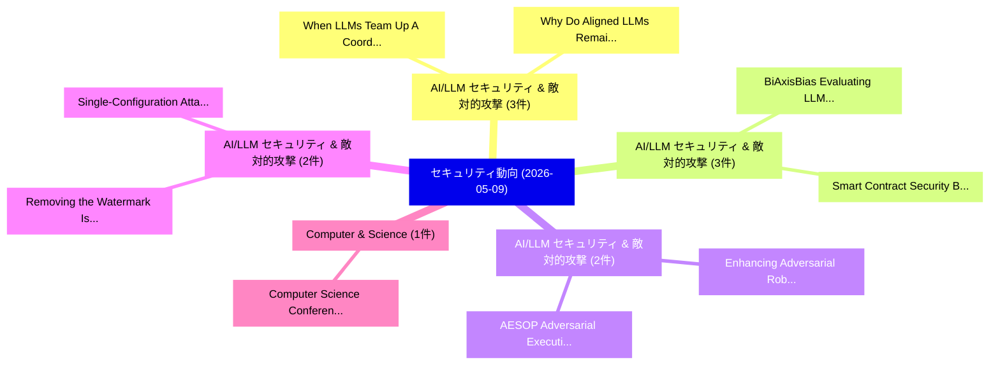

# 📅 02_daily: 日次エグゼクティブサマリー報告書 (2026-05-09)

**集計日時**: 2026-10-02 23:06:09 UTC  
**対象日付**: 2026-05-09  
**本日収集論文数**: 23 件  

---

## 💡 主要セキュリティ動向・脅威インサイト (Executive Insights)

本日の収集論文（計 23 件）において、以下の重点セキュリティ領域で活発な研究動向が確認されました：
- **AI/LLM セキュリティ & 敵対的攻撃** (3 件): 注目論文として 「When LLMs Team Up: A Coordinat...」、「Why Do Aligned LLMs Remain Jai...」 等が発表され、実務防御および攻撃検証の進展が見られます。
- **AI/LLM セキュリティ & 敵対的攻撃** (3 件): 注目論文として 「BiAxisBias: Evaluating LLM Bia...」、「Smart Contract Security Beyond...」 等が発表され、実務防御および攻撃検証の進展が見られます。
- **AI/LLM セキュリティ & 敵対的攻撃** (2 件): 注目論文として 「Enhancing Adversarial Robustne...」、「AESOP: Adversarial Execution-p...」 等が発表され、実務防御および攻撃検証の進展が見られます。
- **AI/LLM セキュリティ & 敵対的攻撃** (2 件): 注目論文として 「Single-Configuration Attack Su...」、「Removing the Watermark Is Not ...」 等が発表され、実務防御および攻撃検証の進展が見られます。
- **Computer & Science** (1 件): 注目論文として 「Computer Science Conferences S...」 等が発表され、実務防御および攻撃検証の進展が見られます。

### 🗺️ 技術・脅威トピックマインドマップ

---

## 📌 日次セキュリティ論文一覧 (日本語表形式)

| No | arXiv ID | 論文タイトル (日本語訳) | 重要キーワード | 構造化エグゼクティブ要約 (背景・提案・影響) | 脅威分類 | 詳細リンク |
|---|---|---|---|---|---|---|
| 1 | `2605.08586v1` | [Computer Science Conferences Should Require Nonrepudiable Experimental Results（セキュリティ分析論文）](../../okf/papers/2026-05-09/2605.08586.md) | `Christopher Homan`, `Raw Meta`, `Executive Summary` | 【提案】概要 (Overview & Key Finding) 本論文「Computer Science Conferences Should Require Nonrepudiab...。実証評価により# Computer Science Confer... | `arXiv` | [arXiv](https://arxiv.org/abs/2605.08586v1) &#124; [OKF](../../okf/papers/2026-05-09/2605.08586.md) |
| 2 | `2605.08604v1` | [WATSON: Leveraging Data Watchpoints for Shadow Stack Protection on Embedded Systems（セキュリティ分析論文）](../../okf/papers/2026-05-09/2605.08604.md) | `Leveraging Data Watchpoints`, `Shadow Stack Protection`, `Embedded Systems` | 【提案】概要 (Overview & Key Finding) 本論文「WATSON: Leveraging Data Watchpoints for Shadow Stack Pr...。実証評価により経営層・セキュリティ管理者向け推奨アクション (E... | `arXiv` | [arXiv](https://arxiv.org/abs/2605.08604v1) &#124; [OKF](../../okf/papers/2026-05-09/2605.08604.md) |
| 3 | `2605.08690v1` | [AI-Accelerated Brute Force Cryptanalysis（セキュリティ分析論文）](../../okf/papers/2026-05-09/2605.08690.md) | `Accelerated Brute Force Cryptanalysis`, `AI-Accelerated Brute`, `Gideon Samid` | 【提案】概要 (Overview & Key Finding) 本論文「AI-Accelerated Brute Force Cryptanalysis（セキュリティ分析論文）」（原...。実証評価により経営層・セキュリティ管理者向け推奨アクション (E... | `arXiv` | [arXiv](https://arxiv.org/abs/2605.08690v1) &#124; [OKF](../../okf/papers/2026-05-09/2605.08690.md) |
| 4 | `2605.08730v1` | [Classification-Head Bias in Class-Level Machine Unlearning: Diagnosis, Mitigation, and Evaluation（セキュリティ分析論文）](../../okf/papers/2026-05-09/2605.08730.md) | `Level Machine Unlearning`, `Head Bias`, `Classification-Head Bias` | 【提案】概要 (Overview & Key Finding) 本論文「Classification-Head Bias in Class-Level Machine Unlearn...。実証評価により# Classification-Head Bia... | `arXiv` | [arXiv](https://arxiv.org/abs/2605.08730v1) &#124; [OKF](../../okf/papers/2026-05-09/2605.08730.md) |
| 5 | `2605.08763v1` | [When LLMs Team Up: A Coordinated Attack Framework for Automated Cyber Intrusions（セキュリティ分析論文）](../../okf/papers/2026-05-09/2605.08763.md) | `Automated Cyber Intrusions`, `Automated Cyber Intrusi`, `Minfeng Qi` | 【提案】概要 (Overview & Key Finding) 本論文「When LLMs Team Up: A Coordinated Attack Framework for A...。実証評価により経営層・セキュリティ管理者向け推奨アクション (E... | `arXiv` | [arXiv](https://arxiv.org/abs/2605.08763v1) &#124; [OKF](../../okf/papers/2026-05-09/2605.08763.md) |
| 6 | `2605.08820v1` | [FraudBench: A Multimodal Benchmark for Detecting AI-Generated Fraudulent Refund Evidence（セキュリティ分析論文）](../../okf/papers/2026-05-09/2605.08820.md) | `Generated Fraudulent Refund Evidence`, `Multimodal Benchmark`, `AI-Generated Fraudulent` | 【提案】概要 (Overview & Key Finding) 本論文「FraudBench: A Multimodal Benchmark for Detecting AI-Gen...。実証評価により経営層・セキュリティ管理者向け推奨アクション (E... | `arXiv` | [arXiv](https://arxiv.org/abs/2605.08820v1) &#124; [OKF](../../okf/papers/2026-05-09/2605.08820.md) |
| 7 | `2605.08878v1` | [Why Do Aligned LLMs Remain Jailbreakable: Refusal-Escape Directions, Operator-Level Sources, and Safety-Utility Trade-off（セキュリティ分析論文）](../../okf/papers/2026-05-09/2605.08878.md) | `Remain Jailbreakable`, `Escape Directions`, `Level Sources` | 【提案】概要 (Overview & Key Finding) 本論文「Why Do Aligned LLMs Remain ジェイルブレイクable: Refusal-Escape...。実証評価により経営層・セキュリティ管理者向け推奨アクション (E... | `arXiv` | [arXiv](https://arxiv.org/abs/2605.08878v1) &#124; [OKF](../../okf/papers/2026-05-09/2605.08878.md) |
| 8 | `2605.08910v1` | [Enhancing Adversarial Robustness in Network Intrusion Detection: A Layer-wise Adaptive Regularization Approach（セキュリティ分析論文）](../../okf/papers/2026-05-09/2605.08910.md) | `Enhancing Adversarial Robustness`, `Network Intrusion Detection`, `Layer-wise Adaptive` | 【提案】概要 (Overview & Key Finding) 本論文「Enhancing Adversarial Robustness in Network Intrusion D...。実証評価により経営層・セキュリティ管理者向け推奨アクション (E... | `arXiv` | [arXiv](https://arxiv.org/abs/2605.08910v1) &#124; [OKF](../../okf/papers/2026-05-09/2605.08910.md) |
| 9 | `2605.08922v1` | [Toward Web 4.0: Bidirectional Trust between AI Agents and Blockchain（セキュリティ分析論文）](../../okf/papers/2026-05-09/2605.08922.md) | `Toward Web`, `Bidirectional Trust`, `Yunfeng Xia` | 【提案】概要 (Overview & Key Finding) 本論文「Toward Web 4.0: Bidirectional Trust between AI Agents a...。実証評価により経営層・セキュリティ管理者向け推奨アクション (E... | `arXiv` | [arXiv](https://arxiv.org/abs/2605.08922v1) &#124; [OKF](../../okf/papers/2026-05-09/2605.08922.md) |
| 10 | `2605.08984v1` | [Hardware-Accelerated Line-Rate Bitstream Screening for Secure FPGA Reconfiguration（セキュリティ分析論文）](../../okf/papers/2026-05-09/2605.08984.md) | `Rate Bitstream Screening`, `Accelerated Line`, `Hardware-Accelerated Line` | 【提案】概要 (Overview & Key Finding) 本論文「Hardware-Accelerated Line-Rate Bitstream Screening for ...。実証評価により経営層・セキュリティ管理者向け推奨アクション (E... | `arXiv` | [arXiv](https://arxiv.org/abs/2605.08984v1) &#124; [OKF](../../okf/papers/2026-05-09/2605.08984.md) |
| 11 | `2605.09033v3` | [ShadowMerge: A Novel Poisoning Attack on Graph-Based Agent Memory via Relation-Channel Conflicts（セキュリティ分析論文）](../../okf/papers/2026-05-09/2605.09033.md) | `Based Agent Memory`, `Graph-Based Agent`, `Channel Conflicts` | 【提案】概要 (Overview & Key Finding) 本論文「ShadowMerge: A Novel Poisoning Attack on Graph-Based Ag...。実証評価により経営層・セキュリティ管理者向け推奨アクション (E... | `arXiv` | [arXiv](https://arxiv.org/abs/2605.09033v3) &#124; [OKF](../../okf/papers/2026-05-09/2605.09033.md) |
| 12 | `2605.09041v2` | [BiAxisBias: Evaluating LLM Bias Beyond a Single Prompt and a Single Explanation（セキュリティ分析論文）](../../okf/papers/2026-05-09/2605.09041.md) | `Bias Beyond`, `Single Prompt`, `Single Explanation` | 【提案】概要 (Overview & Key Finding) 本論文「BiAxisBias: Evaluating LLM Bias Beyond a Single Prompt ...。実証評価により経営層・セキュリティ管理者向け推奨アクション (E... | `AI/ML Security` | [arXiv](https://arxiv.org/abs/2605.09041v2) &#124; [OKF](../../okf/papers/2026-05-09/2605.09041.md) |
| 13 | `2605.09045v2` | [Containment Verification: AI Safety Guarantees Independent of Alignment（セキュリティ分析論文）](../../okf/papers/2026-05-09/2605.09045.md) | `Safety Guarantees Independent`, `Containment Verification`, `Royce Moon` | 【提案】概要 (Overview & Key Finding) 本論文「Containment Verification: AI Safety Guarantees Independ...。実証評価によりVarshney - **公開日時**: `202... | `arXiv` | [arXiv](https://arxiv.org/abs/2605.09045v2) &#124; [OKF](../../okf/papers/2026-05-09/2605.09045.md) |
| 14 | `2605.09054v2` | [Personalized w-Event Privacy for Infinite Stream Estimation（セキュリティ分析論文）](../../okf/papers/2026-05-09/2605.09054.md) | `Infinite Stream Estimation`, `Event Privacy`, `w-Event Privacy` | 【提案】概要 (Overview & Key Finding) 本論文「Personalized w-Event Privacy for Infinite Stream Estima...。実証評価により経営層・セキュリティ管理者向け推奨アクション (E... | `arXiv` | [arXiv](https://arxiv.org/abs/2605.09054v2) &#124; [OKF](../../okf/papers/2026-05-09/2605.09054.md) |
| 15 | `2605.09070v1` | [Single-Configuration Attack Success Rate Is Not Enough: Jailbreak Evaluations Should Report Distributional Attack Success（セキュリティ分析論文）](../../okf/papers/2026-05-09/2605.09070.md) | `Single-Configuration Attack`, `Carsten Maple`, `Abhishek Kumar` | 【提案】背景とセキュリティ上の課題 (Background & Problem) 本研究はサイバー脅威環境におけるセキュリティ構造・脆弱性の検証を目的としています。(主要検出項目: ...。実証評価により概要 (Overview & Key Findin... | `arXiv` | [arXiv](https://arxiv.org/abs/2605.09070v1) &#124; [OKF](../../okf/papers/2026-05-09/2605.09070.md) |
| 16 | `2605.09115v2` | [AI Native Asset Intelligence（セキュリティ分析論文）](../../okf/papers/2026-05-09/2605.09115.md) | `Native Asset Intelligence`, `Gal Engelberg`, `Leon Goldberg` | 【提案】概要 (Overview & Key Finding) 本論文「AI Native Asset Intelligence（セキュリティ分析論文）」（原題: AI Native...。実証評価により経営層・セキュリティ管理者向け推奨アクション (E... | `arXiv` | [arXiv](https://arxiv.org/abs/2605.09115v2) &#124; [OKF](../../okf/papers/2026-05-09/2605.09115.md) |
| 17 | `2605.09124v2` | [Smart Contract Security Beyond Detection（セキュリティ分析論文）](../../okf/papers/2026-05-09/2605.09124.md) | `Smart Contract Security Beyond Detection`, `Tamer Abdelaziz`, `Raw Meta` | 【提案】概要 (Overview & Key Finding) 本論文「スマートコントラクト Security Beyond Detection（セキュリティ分析論文）」（原題: ス...。実証評価により経営層・セキュリティ管理者向け推奨アクション (E... | `arXiv` | [arXiv](https://arxiv.org/abs/2605.09124v2) &#124; [OKF](../../okf/papers/2026-05-09/2605.09124.md) |
| 18 | `2605.09203v1` | [Removing the Watermark Is Not Enough: Forensic Stealth in Generative-AI Watermark Removal（セキュリティ分析論文）](../../okf/papers/2026-05-09/2605.09203.md) | `Forensic Stealth`, `Watermark Removal`, `Generative-AI Watermark` | 【提案】背景とセキュリティ上の課題 (Background & Problem) 本研究はサイバー脅威環境におけるセキュリティ構造・脆弱性の検証を目的としています。(主要検出項目: ...。実証評価により経営層・セキュリティ管理者向け推奨アクション (E... | `arXiv` | [arXiv](https://arxiv.org/abs/2605.09203v1) &#124; [OKF](../../okf/papers/2026-05-09/2605.09203.md) |
| 19 | `2605.09225v1` | [The Art of the Jailbreak: Formulating Jailbreak Attacks for LLM Security Beyond Binary Scoring（セキュリティ分析論文）](../../okf/papers/2026-05-09/2605.09225.md) | `Formulating Jailbreak Attacks`, `Security Beyond Binary Scoring`, `Md Jahangir Alam` | 【提案】概要 (Overview & Key Finding) 本論文「The Art of the ジェイルブレイク: Formulating ジェイルブレイク Attacks f...。実証評価により経営層・セキュリティ管理者向け推奨アクション (E... | `arXiv` | [arXiv](https://arxiv.org/abs/2605.09225v1) &#124; [OKF](../../okf/papers/2026-05-09/2605.09225.md) |
| 20 | `2605.10977v2` | [PASA: A Principled Embedding-Space Watermarking Approach for LLM-Generated Text under Semantic-Invariant Attacks（セキュリティ分析論文）](../../okf/papers/2026-05-09/2605.10977.md) | `Principled Embedding`, `Generated Text`, `Embedding-Space Watermarking` | 【提案】概要 (Overview & Key Finding) 本論文「PASA: A Principled Embedding-Space Watermarking Approac...。実証評価により経営層・セキュリティ管理者向け推奨アクション (E... | `arXiv` | [arXiv](https://arxiv.org/abs/2605.10977v2) &#124; [OKF](../../okf/papers/2026-05-09/2605.10977.md) |
| 21 | `2605.10987v1` | [AESOP: Adversarial Execution-path Selection to Overload Deep Learning Pipelines（セキュリティ分析論文）](../../okf/papers/2026-05-09/2605.10987.md) | `Overload Deep Learning Pipelines`, `Adversarial Execution`, `Execution-path Selection` | 【提案】概要 (Overview & Key Finding) 本論文「AESOP: Adversarial Execution-path Selection to Overload...。実証評価により経営層・セキュリティ管理者向け推奨アクション (E... | `arXiv` | [arXiv](https://arxiv.org/abs/2605.10987v1) &#124; [OKF](../../okf/papers/2026-05-09/2605.10987.md) |
| 22 | `2605.10998v1` | [Few-Shot Truly Benign DPO Attack for Jailbreaking LLMs（セキュリティ分析論文）](../../okf/papers/2026-05-09/2605.10998.md) | `Shot Truly Benign`, `Few-Shot Truly`, `Sangyeon Yoon` | 【提案】概要 (Overview & Key Finding) 本論文「Few-Shot Truly Benign DPO Attack for ジェイルブレイクing LLMs（セ...。実証評価により経営層・セキュリティ管理者向け推奨アクション (E... | `arXiv` | [arXiv](https://arxiv.org/abs/2605.10998v1) &#124; [OKF](../../okf/papers/2026-05-09/2605.10998.md) |
| 23 | `2607.16207v2` | [JUMP: Single-Pass Membership Inference on Fine-Tuned Diffusion Language Models（セキュリティ分析論文）](../../okf/papers/2026-05-09/2607.16207.md) | `Tuned Diffusion Language Models`, `Pass Membership Inference`, `Single-Pass Membership` | 【提案】概要 (Overview & Key Finding) 本論文「JUMP: Single-Pass Membership Inference on Fine-Tuned Di...。実証評価により経営層・セキュリティ管理者向け推奨アクション (E... | `AI/ML Security` | [arXiv](https://arxiv.org/abs/2607.16207v2) &#124; [OKF](../../okf/papers/2026-05-09/2607.16207.md) |

