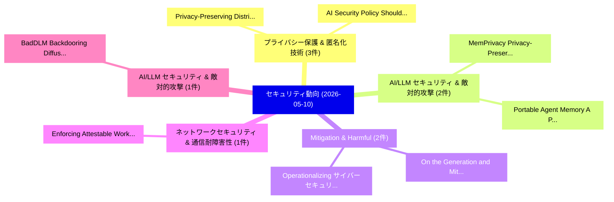

# 📅 02_daily: 日次エグゼクティブサマリー報告書 (2026-05-10)

**集計日時**: 2026-10-02 23:06:09 UTC  
**対象日付**: 2026-05-10  
**本日収集論文数**: 23 件  

---

## 💡 主要セキュリティ動向・脅威インサイト (Executive Insights)

本日の収集論文（計 23 件）において、以下の重点セキュリティ領域で活発な研究動向が確認されました：
- **プライバシー保護 & 匿名化技術** (3 件): 注目論文として 「Privacy-Preserving Distributed...」、「AI Security Policy Should Asse...」 等が発表され、実務防御および攻撃検証の進展が見られます。
- **AI/LLM セキュリティ & 敵対的攻撃** (2 件): 注目論文として 「MemPrivacy: Privacy-Preserving...」、「Portable Agent Memory: A Proto...」 等が発表され、実務防御および攻撃検証の進展が見られます。
- **Mitigation & Harmful** (2 件): 注目論文として 「On the Generation and Mitigati...」、「Operationalizing サイバーセキュリティ Go...」 等が発表され、実務防御および攻撃検証の進展が見られます。
- **ネットワークセキュリティ & 通信耐障害性** (1 件): 注目論文として 「Enforcing Attestable Workflows...」 等が発表され、実務防御および攻撃検証の進展が見られます。
- **AI/LLM セキュリティ & 敵対的攻撃** (1 件): 注目論文として 「BadDLM: Backdooring Diffusion ...」 等が発表され、実務防御および攻撃検証の進展が見られます。

### 🗺️ 技術・脅威トピックマインドマップ

---

## 📌 日次セキュリティ論文一覧 (日本語表形式)

| No | arXiv ID | 論文タイトル (日本語訳) | 重要キーワード | 構造化エグゼクティブ要約 (背景・提案・影響) | 脅威分類 | 詳細リンク |
|---|---|---|---|---|---|---|
| 1 | `2605.09232v1` | [Privacy-Preserving Distributed Learning in IoT Systems: A Unified Threat Model and Evaluation Framework（セキュリティ分析論文）](../../okf/papers/2026-05-10/2605.09232.md) | `Preserving Distributed Learning`, `Unified Threat Model`, `Privacy-Preserving Distributed` | 【提案】概要 (Overview & Key Finding) 本論文「Privacy-Preserving Distributed Learning in IoT Systems:...。実証評価により経営層・セキュリティ管理者向け推奨アクション (E... | `arXiv` | [arXiv](https://arxiv.org/abs/2605.09232v1) &#124; [OKF](../../okf/papers/2026-05-10/2605.09232.md) |
| 2 | `2605.09297v1` | [Enforcing Attestable Workflows across Untrusted Networks（セキュリティ分析論文）](../../okf/papers/2026-05-10/2605.09297.md) | `Enforcing Attestable Workflows`, `Untrusted Networks`, `Hung Dang` | 【提案】概要 (Overview & Key Finding) 本論文「Enforcing Attestable Workflows across Untrusted Network...。実証評価により経営層・セキュリティ管理者向け推奨アクション (E... | `arXiv` | [arXiv](https://arxiv.org/abs/2605.09297v1) &#124; [OKF](../../okf/papers/2026-05-10/2605.09297.md) |
| 3 | `2605.09397v1` | [BadDLM: Backdooring Diffusion Language Models with Diverse Targets（セキュリティ分析論文）](../../okf/papers/2026-05-10/2605.09397.md) | `Backdooring Diffusion Language Models`, `Diverse Targets`, `Shengfang Zhai` | 【提案】概要 (Overview & Key Finding) 本論文「BadDLM: Backdooring Diffusion Language Models with Dive...。実証評価により経営層・セキュリティ管理者向け推奨アクション (E... | `arXiv` | [arXiv](https://arxiv.org/abs/2605.09397v1) &#124; [OKF](../../okf/papers/2026-05-10/2605.09397.md) |
| 4 | `2605.09480v1` | [Permit: Permission-Aware Representation Intervention for Controlled Generation in 大規模言語モデル](../../okf/papers/2026-05-10/2605.09480.md) | `Aware Representation Intervention`, `Permission-Aware Representation`, `Controlled Generation` | 【提案】概要 (Overview & Key Finding) 本論文「Permit: Permission-Aware Representation Intervention fo...。実証評価により経営層・セキュリティ管理者向け推奨アクション (E... | `arXiv` | [arXiv](https://arxiv.org/abs/2605.09480v1) &#124; [OKF](../../okf/papers/2026-05-10/2605.09480.md) |
| 5 | `2605.09497v1` | [Don't Click That: Teaching Web Agents to Resist Deceptive Interfaces（セキュリティ分析論文）](../../okf/papers/2026-05-10/2605.09497.md) | `Teaching Web Agents`, `Resist Deceptive Interfaces`, `Yilin Zhang` | 【提案】概要 (Overview & Key Finding) 本論文「Don't Click That: Teaching Web Agents to Resist Decepti...。実証評価により経営層・セキュリティ管理者向け推奨アクション (E... | `arXiv` | [arXiv](https://arxiv.org/abs/2605.09497v1) &#124; [OKF](../../okf/papers/2026-05-10/2605.09497.md) |
| 6 | `2605.09504v2` | [AI Security Policy Should Assess Systems, Not Only Models（セキュリティ分析論文）](../../okf/papers/2026-05-10/2605.09504.md) | `Raw Meta`, `Executive Summary`, `Key Finding` | 【提案】背景とセキュリティ上の課題 (Background & Problem) 本研究はサイバー脅威環境におけるセキュリティ構造・脆弱性の検証を目的としています。(主要検出項目: ...。実証評価によりRiegler, Inga Strümke - *... | `arXiv` | [arXiv](https://arxiv.org/abs/2605.09504v2) &#124; [OKF](../../okf/papers/2026-05-10/2605.09504.md) |
| 7 | `2605.09530v3` | [MemPrivacy: Privacy-Preserving Personalized Memory Management for Edge-Cloud Agents（セキュリティ分析論文）](../../okf/papers/2026-05-10/2605.09530.md) | `Preserving Personalized Memory Management`, `Cloud Agents`, `Privacy-Preserving Personalized` | 【提案】概要 (Overview & Key Finding) 本論文「MemPrivacy: Privacy-Preserving Personalized Memory Mana...。実証評価により経営層・セキュリティ管理者向け推奨アクション (E... | `arXiv` | [arXiv](https://arxiv.org/abs/2605.09530v3) &#124; [OKF](../../okf/papers/2026-05-10/2605.09530.md) |
| 8 | `2605.09534v1` | [Governing AI-Assisted Security Operations: A Design Science Framework for Operational Decision Support（セキュリティ分析論文）](../../okf/papers/2026-05-10/2605.09534.md) | `Assisted Security Operations`, `Operational Decision Support`, `AI-Assisted Security` | 【提案】概要 (Overview & Key Finding) 本論文「Governing AI-Assisted Security Operations: A Design Sci...。実証評価により経営層・セキュリティ管理者向け推奨アクション (E... | `arXiv` | [arXiv](https://arxiv.org/abs/2605.09534v1) &#124; [OKF](../../okf/papers/2026-05-10/2605.09534.md) |
| 9 | `2605.09594v1` | [Trust Me, Import This: Dependency Steering Attacks via Malicious Agent Skills（セキュリティ分析論文）](../../okf/papers/2026-05-10/2605.09594.md) | `Dependency Steering Attacks`, `Malicious Agent Skills`, `Yiyong Liu` | 【提案】概要 (Overview & Key Finding) 本論文「Trust Me, Import This: Dependency Steering Attacks via ...。実証評価により経営層・セキュリティ管理者向け推奨アクション (E... | `arXiv` | [arXiv](https://arxiv.org/abs/2605.09594v1) &#124; [OKF](../../okf/papers/2026-05-10/2605.09594.md) |
| 10 | `2605.09606v1` | [On the Generation and Mitigation of Harmful Geometry in Image-to-3D Models（セキュリティ分析論文）](../../okf/papers/2026-05-10/2605.09606.md) | `Harmful Geometry`, `Yule Liu`, `Yilong Yang` | 【提案】概要 (Overview & Key Finding) 本論文「On the Generation and Mitigation of Harmful Geometry in...。実証評価により経営層・セキュリティ管理者向け推奨アクション (E... | `arXiv` | [arXiv](https://arxiv.org/abs/2605.09606v1) &#124; [OKF](../../okf/papers/2026-05-10/2605.09606.md) |
| 11 | `2605.09646v1` | ["Training robust watermarking model may hurt authentication!'' Exploring and Mitigating the Identity Leakage in Robust Watermarking（セキュリティ分析論文）](../../okf/papers/2026-05-10/2605.09646.md) | `Identity Leakage`, `Robust Watermarking`, `Xinyu Zhang` | 【提案】概要 (Overview & Key Finding) 本論文「"Training robust watermarking model may hurt authentica...。実証評価により# "Training robust waterm... | `arXiv` | [arXiv](https://arxiv.org/abs/2605.09646v1) &#124; [OKF](../../okf/papers/2026-05-10/2605.09646.md) |
| 12 | `2605.09664v2` | [FreeMOCA: Memory-Free Continual Learning for Malicious Code Analysis（セキュリティ分析論文）](../../okf/papers/2026-05-10/2605.09664.md) | `Free Continual Learning`, `Memory-Free Continual`, `Md Mahmuduzzaman Kamol` | 【提案】概要 (Overview & Key Finding) 本論文「FreeMOCA: Memory-Free Continual Learning for Malicious ...。実証評価により経営層・セキュリティ管理者向け推奨アクション (E... | `arXiv` | [arXiv](https://arxiv.org/abs/2605.09664v2) &#124; [OKF](../../okf/papers/2026-05-10/2605.09664.md) |
| 13 | `2605.09684v1` | [MonitoringBench: Semi-Automated Red-Teaming for Agent Monitoring（セキュリティ分析論文）](../../okf/papers/2026-05-10/2605.09684.md) | `Automated Red`, `Agent Monitoring`, `Semi-Automated Red` | 【提案】概要 (Overview & Key Finding) 本論文「MonitoringBench: Semi-Automated Red-Teaming for Agent M...。実証評価により経営層・セキュリティ管理者向け推奨アクション (E... | `arXiv` | [arXiv](https://arxiv.org/abs/2605.09684v1) &#124; [OKF](../../okf/papers/2026-05-10/2605.09684.md) |
| 14 | `2605.09721v1` | [Security Risks in Tool-Enabled AI Agents: A Systematic Privileged Execution Environmentsの分析](../../okf/papers/2026-05-10/2605.09721.md) | `Security Risks`, `Tool-Enabled AI`, `Privileged Execution Environments` | 【提案】概要 (Overview & Key Finding) 本論文「Security Risks in Tool-Enabled AI Agents: A Systematic ...。実証評価により経営層・セキュリティ管理者向け推奨アクション (E... | `arXiv` | [arXiv](https://arxiv.org/abs/2605.09721v1) &#124; [OKF](../../okf/papers/2026-05-10/2605.09721.md) |
| 15 | `2605.09792v1` | [Operationalizing サイバーセキュリティ Governance for Mitigation Planning with Attack-Path Modeling and Reinforcement Learning](../../okf/papers/2026-05-10/2605.09792.md) | `Mitigation Planning`, `Path Modeling`, `Reinforcement Learning` | 【提案】概要 (Overview & Key Finding) 本論文「Operationalizing サイバーセキュリティ Governance for Mitigation P...。実証評価により経営層・セキュリティ管理者向け推奨アクション (E... | `arXiv` | [arXiv](https://arxiv.org/abs/2605.09792v1) &#124; [OKF](../../okf/papers/2026-05-10/2605.09792.md) |
| 16 | `2605.09817v2` | [Evaluating Tool Cloning in Agentic-AI Ecosystems（セキュリティ分析論文）](../../okf/papers/2026-05-10/2605.09817.md) | `Evaluating Tool Cloning`, `Agentic-AI Ecosystems`, `Taein Kim` | 【提案】概要 (Overview & Key Finding) 本論文「Evaluating Tool Cloning in Agentic-AI Ecosystems（セキュリティ...。実証評価により経営層・セキュリティ管理者向け推奨アクション (E... | `arXiv` | [arXiv](https://arxiv.org/abs/2605.09817v2) &#124; [OKF](../../okf/papers/2026-05-10/2605.09817.md) |
| 17 | `2605.09822v1` | [Oracle Poisoning: Corrupting Knowledge Graphs to Weaponise AI Agent Reasoning（セキュリティ分析論文）](../../okf/papers/2026-05-10/2605.09822.md) | `Corrupting Knowledge Graphs`, `Oracle Poisoning`, `Agent Reasoning` | 【提案】概要 (Overview & Key Finding) 本論文「Oracle Poisoning: Corrupting Knowledge Graphs to Weapon...。実証評価により経営層・セキュリティ管理者向け推奨アクション (E... | `arXiv` | [arXiv](https://arxiv.org/abs/2605.09822v1) &#124; [OKF](../../okf/papers/2026-05-10/2605.09822.md) |
| 18 | `2605.11002v1` | [MT-JailBench: A Modular Benchmark for Understanding Multi-Turn Jailbreak Attacks（セキュリティ分析論文）](../../okf/papers/2026-05-10/2605.11002.md) | `Turn Jailbreak Attacks`, `Modular Benchmark`, `Understanding Multi` | 【提案】概要 (Overview & Key Finding) 本論文「MT-JailBench: A Modular Benchmark for Understanding Mul...。実証評価により経営層・セキュリティ管理者向け推奨アクション (E... | `arXiv` | [arXiv](https://arxiv.org/abs/2605.11002v1) &#124; [OKF](../../okf/papers/2026-05-10/2605.11002.md) |
| 19 | `2605.11003v1` | [The Authorization-Execution Gap Is a Major Safety and Security Problem in Open-World Agents（セキュリティ分析論文）](../../okf/papers/2026-05-10/2605.11003.md) | `Major Safety`, `Security Problem`, `World Agents` | 【提案】概要 (Overview & Key Finding) 本論文「The Authorization-Execution Gap Is a Major Safety and S...。実証評価により経営層・セキュリティ管理者向け推奨アクション (E... | `arXiv` | [arXiv](https://arxiv.org/abs/2605.11003v1) &#124; [OKF](../../okf/papers/2026-05-10/2605.11003.md) |
| 20 | `2605.11015v1` | [DCVD: Dual-Channel Cross-Modal Fusion for Joint 脆弱性検出 and Localization](../../okf/papers/2026-05-10/2605.11015.md) | `Channel Cross`, `Modal Fusion`, `Dual-Channel Cross` | 【提案】概要 (Overview & Key Finding) 本論文「DCVD: Dual-Channel Cross-Modal Fusion for Joint 脆弱性検出 a...。実証評価により経営層・セキュリティ管理者向け推奨アクション (E... | `arXiv` | [arXiv](https://arxiv.org/abs/2605.11015v1) &#124; [OKF](../../okf/papers/2026-05-10/2605.11015.md) |
| 21 | `2605.11026v1` | [AgentShield: Deception-based Compromise Detection for Tool-using LLMエージェント](../../okf/papers/2026-05-10/2605.11026.md) | `Compromise Detection`, `Deception-based Compromise`, `Tool-using LLM` | 【提案】概要 (Overview & Key Finding) 本論文「AgentShield: Deception-based Compromise Detection for T...。実証評価によりRashid - **公開日時**: `2026-0。 | `arXiv` | [arXiv](https://arxiv.org/abs/2605.11026v1) &#124; [OKF](../../okf/papers/2026-05-10/2605.11026.md) |
| 22 | `2605.11029v1` | [FragBench: Cross-Session Attacks Hidden in Benign-Looking Fragments（セキュリティ分析論文）](../../okf/papers/2026-05-10/2605.11029.md) | `Session Attacks Hidden`, `Looking Fragments`, `Cross-Session Attacks` | 【提案】概要 (Overview & Key Finding) 本論文「FragBench: Cross-Session Attacks Hidden in Benign-Looki...。実証評価により経営層・セキュリティ管理者向け推奨アクション (E... | `arXiv` | [arXiv](https://arxiv.org/abs/2605.11029v1) &#124; [OKF](../../okf/papers/2026-05-10/2605.11029.md) |
| 23 | `2605.11032v1` | [Portable Agent Memory: A Protocol for Cryptographically-Verified Memory Transfer Across Heterogeneous AI Agents（セキュリティ分析論文）](../../okf/papers/2026-05-10/2605.11032.md) | `Verified Memory Transfer Across Heterogeneous`, `Portable Agent Memory`, `Cryptographically-Verified Memory` | 【提案】概要 (Overview & Key Finding) 本論文「Portable Agent Memory: A Protocol for Cryptographically...。実証評価により経営層・セキュリティ管理者向け推奨アクション (E... | `arXiv` | [arXiv](https://arxiv.org/abs/2605.11032v1) &#124; [OKF](../../okf/papers/2026-05-10/2605.11032.md) |

