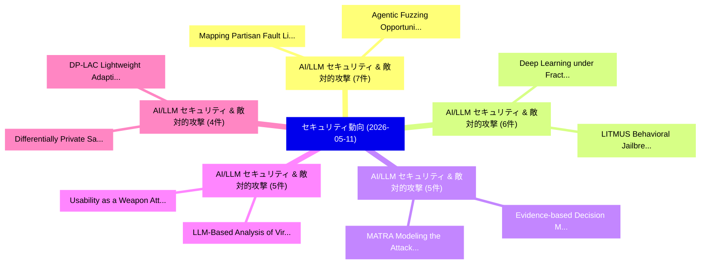

# 📅 02_daily: 日次エグゼクティブサマリー報告書 (2026-05-11)

**集計日時**: 2026-10-02 23:06:09 UTC  
**対象日付**: 2026-05-11  
**本日収集論文数**: 61 件  

---

## 💡 主要セキュリティ動向・脅威インサイト (Executive Insights)

本日の収集論文（計 61 件）において、以下の重点セキュリティ領域で活発な研究動向が確認されました：
- **AI/LLM セキュリティ & 敵対的攻撃** (7 件): 注目論文として 「Agentic Fuzzing: Opportunities...」、「Mapping Partisan Fault Lines W...」 等が発表され、実務防御および攻撃検証の進展が見られます。
- **AI/LLM セキュリティ & 敵対的攻撃** (6 件): 注目論文として 「Deep Learning under Fractional...」、「LITMUS: Behavioral Jailbreaks ...」 等が発表され、実務防御および攻撃検証の進展が見られます。
- **AI/LLM セキュリティ & 敵対的攻撃** (5 件): 注目論文として 「Evidence-based Decision Modeli...」、「MATRA: Modeling the Attack Sur...」 等が発表され、実務防御および攻撃検証の進展が見られます。
- **AI/LLM セキュリティ & 敵対的攻撃** (5 件): 注目論文として 「LLM-Based Analysis of Virtuali...」、「Usability as a Weapon: Attacki...」 等が発表され、実務防御および攻撃検証の進展が見られます。
- **AI/LLM セキュリティ & 敵対的攻撃** (4 件): 注目論文として 「Differentially Private Samplin...」、「DP-LAC: Lightweight Adaptive C...」 等が発表され、実務防御および攻撃検証の進展が見られます。

### 🗺️ 技術・脅威トピックマインドマップ

---

## 📌 日次セキュリティ論文一覧 (日本語表形式)

| No | arXiv ID | 論文タイトル (日本語訳) | 重要キーワード | 構造化エグゼクティブ要約 (背景・提案・影響) | 脅威分類 | 詳細リンク |
|---|---|---|---|---|---|---|
| 1 | `2605.09863v1` | [Nautilus Compass: Black-box Persona Drift Detection for Production LLMエージェント](../../okf/papers/2026-05-11/2605.09863.md) | `Persona Drift Detection`, `Nautilus Compass`, `Black-box Persona` | 【提案】概要 (Overview & Key Finding) 本論文「Nautilus Compass: Black-box Persona Drift Detection for...。実証評価により経営層・セキュリティ管理者向け推奨アクション (E... | `arXiv` | [arXiv](https://arxiv.org/abs/2605.09863v1) &#124; [OKF](../../okf/papers/2026-05-11/2605.09863.md) |
| 2 | `2605.09890v1` | [Deep Learning under Fractional-Order Differential Privacy（セキュリティ分析論文）](../../okf/papers/2026-05-11/2605.09890.md) | `Order Differential Privacy`, `Deep Learning`, `Fractional-Order Differential` | 【提案】概要 (Overview & Key Finding) 本論文「Deep Learning under Fractional-Order 差分プライバシー（セキュリティ分析論...。実証評価により経営層・セキュリティ管理者向け推奨アクション (E... | `arXiv` | [arXiv](https://arxiv.org/abs/2605.09890v1) &#124; [OKF](../../okf/papers/2026-05-11/2605.09890.md) |
| 3 | `2605.09935v2` | [Evidence-based Decision Modeling for Synthetic Face Detection with Uncertainty-driven Active Learning（セキュリティ分析論文）](../../okf/papers/2026-05-11/2605.09935.md) | `Synthetic Face Detection`, `Decision Modeling`, `Evidence-based Decision` | 【提案】概要 (Overview & Key Finding) 本論文「Evidence-based Decision Modeling for Synthetic Face Det...。実証評価により経営層・セキュリティ管理者向け推奨アクション (E... | `arXiv` | [arXiv](https://arxiv.org/abs/2605.09935v2) &#124; [OKF](../../okf/papers/2026-05-11/2605.09935.md) |
| 4 | `2605.09957v1` | [On Scalable Pseudorandom Unitaries and the Unitary Synthesis Problem（セキュリティ分析論文）](../../okf/papers/2026-05-11/2605.09957.md) | `Unitary Synthesis Problem`, `Zvika Brakerski`, `Henry Yuen` | 【提案】概要 (Overview & Key Finding) 本論文「On Scalable Pseudorandom Unitaries and the Unitary Synt...。実証評価により経営層・セキュリティ管理者向け推奨アクション (E... | `arXiv` | [arXiv](https://arxiv.org/abs/2605.09957v1) &#124; [OKF](../../okf/papers/2026-05-11/2605.09957.md) |
| 5 | `2605.09961v1` | [LLM-Based Analysis of Virtualization-Obfuscated Code through Automated Data Generationに向けて](../../okf/papers/2026-05-11/2605.09961.md) | `Obfuscated Code`, `Virtualization-Obfuscated Code`, `Automated Data` | 【提案】概要 (Overview & Key Finding) 本論文「LLM-Based Analysis of Virtualization-Obfuscated Code th...。実証評価により経営層・セキュリティ管理者向け推奨アクション (E... | `arXiv` | [arXiv](https://arxiv.org/abs/2605.09961v1) &#124; [OKF](../../okf/papers/2026-05-11/2605.09961.md) |
| 6 | `2605.10012v1` | [Sketch-based Access Control: A Multimodal Interface for Translating User Preferences into Intent-Aligned Policies（セキュリティ分析論文）](../../okf/papers/2026-05-11/2605.10012.md) | `Translating User Preferences`, `Access Control`, `Multimodal Interface` | 【提案】概要 (Overview & Key Finding) 本論文「Sketch-based アクセス制御: A Multimodal Interface for Transla...。実証評価により経営層・セキュリティ管理者向け推奨アクション (E... | `arXiv` | [arXiv](https://arxiv.org/abs/2605.10012v1) &#124; [OKF](../../okf/papers/2026-05-11/2605.10012.md) |
| 7 | `2605.10013v1` | [When Are LLM Inferences Acceptable? User Reactions and Control Preferences for Inferred Personal Information（セキュリティ分析論文）](../../okf/papers/2026-05-11/2605.10013.md) | `Inferred Personal Information`, `Inferences Acceptable`, `User Reactions` | 【提案】User Reactions and Control Preferences for Inferred Personal Information ### (日本語題名: Wh...。実証評価により経営層・セキュリティ管理者向け推奨アクション (E... | `arXiv` | [arXiv](https://arxiv.org/abs/2605.10013v1) &#124; [OKF](../../okf/papers/2026-05-11/2605.10013.md) |
| 8 | `2605.10015v1` | [Differentially Private Sampling from Distributions via Wasserstein Projection（セキュリティ分析論文）](../../okf/papers/2026-05-11/2605.10015.md) | `Differentially Private Sampling`, `Wasserstein Projection`, `Seng Pei Liew` | 【提案】概要 (Overview & Key Finding) 本論文「Differentially Private Sampling from Distributions via ...。実証評価により経営層・セキュリティ管理者向け推奨アクション (E... | `arXiv` | [arXiv](https://arxiv.org/abs/2605.10015v1) &#124; [OKF](../../okf/papers/2026-05-11/2605.10015.md) |
| 9 | `2605.10049v1` | [Janus: Compiler-Based Defense Against Transient Execution Attacks Using ARM Hardware Primitives（セキュリティ分析論文）](../../okf/papers/2026-05-11/2605.10049.md) | `Hardware Primitives`, `Compiler-Based Defense`, `Ciyan Ouyang` | 【提案】概要 (Overview & Key Finding) 本論文「Janus: Compiler-Based Defense Against Transient Executi...。実証評価により経営層・セキュリティ管理者向け推奨アクション (E... | `arXiv` | [arXiv](https://arxiv.org/abs/2605.10049v1) &#124; [OKF](../../okf/papers/2026-05-11/2605.10049.md) |
| 10 | `2605.10056v2` | [Hardness Amplification for (Sparse) LPN（セキュリティ分析論文）](../../okf/papers/2026-05-11/2605.10056.md) | `Hardness Amplification`, `Divesh Aggarwal`, `Rishav Gupta` | 【提案】概要 (Overview & Key Finding) 本論文「Hardness Amplification for (Sparse) LPN（セキュリティ分析論文）」（原題...。実証評価により経営層・セキュリティ管理者向け推奨アクション (E... | `arXiv` | [arXiv](https://arxiv.org/abs/2605.10056v2) &#124; [OKF](../../okf/papers/2026-05-11/2605.10056.md) |
| 11 | `2605.10074v1` | [Agentic Fuzzing: Opportunities and Challenges（セキュリティ分析論文）](../../okf/papers/2026-05-11/2605.10074.md) | `Agentic Fuzzing`, `Junyoung Park`, `Insu Yun` | 【提案】概要 (Overview & Key Finding) 本論文「Agentic Fuzzing: Opportunities and Challenges（セキュリティ分析論...。実証評価により経営層・セキュリティ管理者向け推奨アクション (E... | `arXiv` | [arXiv](https://arxiv.org/abs/2605.10074v1) &#124; [OKF](../../okf/papers/2026-05-11/2605.10074.md) |
| 12 | `2605.10133v1` | [Usability as a Weapon: Attacking the Safety of LLM-Based Code Generation via Usability Requirements（セキュリティ分析論文）](../../okf/papers/2026-05-11/2605.10133.md) | `Based Code Generation`, `Usability Requirements`, `LLM-Based Code` | 【提案】概要 (Overview & Key Finding) 本論文「Usability as a Weapon: Attacking the Safety of LLM-Base...。実証評価により経営層・セキュリティ管理者向け推奨アクション (E... | `arXiv` | [arXiv](https://arxiv.org/abs/2605.10133v1) &#124; [OKF](../../okf/papers/2026-05-11/2605.10133.md) |
| 13 | `2605.10146v1` | [Safety Risks of Knowledge-Intensive Reasoning under Malicious Knowledge Editingのベンチマーク評価](../../okf/papers/2026-05-11/2605.10146.md) | `Intensive Reasoning`, `Knowledge-Intensive Reasoning`, `Benchmarking Safety Risks` | 【提案】概要 (Overview & Key Finding) 本論文「Safety Risks of Knowledge-Intensive Reasoning under Mal...。実証評価により経営層・セキュリティ管理者向け推奨アクション (E... | `arXiv` | [arXiv](https://arxiv.org/abs/2605.10146v1) &#124; [OKF](../../okf/papers/2026-05-11/2605.10146.md) |
| 14 | `2605.10175v1` | [Key Encapsulation Mechanism-Based Integrated Encryption Scheme (KEM-IES)（セキュリティ分析論文）](../../okf/papers/2026-05-11/2605.10175.md) | `Based Integrated Encryption Scheme`, `Key Encapsulation Mechanism`, `Mechanism-Based Integrated` | 【提案】概要 (Overview & Key Finding) 本論文「Key Encapsulation Mechanism-Based Integrated Encryption...。実証評価により経営層・セキュリティ管理者向け推奨アクション (E... | `arXiv` | [arXiv](https://arxiv.org/abs/2605.10175v1) &#124; [OKF](../../okf/papers/2026-05-11/2605.10175.md) |
| 15 | `2605.10176v1` | [When Prompts Become Payloads: A Framework for Mitigating SQL Injection Attacks in Large Language Model-Driven Applications（セキュリティ分析論文）](../../okf/papers/2026-05-11/2605.10176.md) | `Large Language Model`, `Injection Attacks`, `Driven Applications` | 【提案】概要 (Overview & Key Finding) 本論文「When Prompts Become Payloads: A Framework for Mitigatin...。実証評価により経営層・セキュリティ管理者向け推奨アクション (E... | `arXiv` | [arXiv](https://arxiv.org/abs/2605.10176v1) &#124; [OKF](../../okf/papers/2026-05-11/2605.10176.md) |
| 16 | `2605.10180v1` | [What Concepts Lie Within? Detecting and Suppressing Risky Content in Diffusion Transformers（セキュリティ分析論文）](../../okf/papers/2026-05-11/2605.10180.md) | `Suppressing Risky Content`, `Diffusion Transformers`, `Chenyu Zhang` | 【提案】Detecting and Suppressing Risky Content in Diffusion Transformers ### (日本語題名: What Conc...。実証評価により経営層・セキュリティ管理者向け推奨アクション (E... | `arXiv` | [arXiv](https://arxiv.org/abs/2605.10180v1) &#124; [OKF](../../okf/papers/2026-05-11/2605.10180.md) |
| 17 | `2605.10240v3` | [MARGIN: Margin-Aware Regularized Geometry for Imbalanced 脆弱性検出](../../okf/papers/2026-05-11/2605.10240.md) | `Aware Regularized Geometry`, `Margin-Aware Regularized`, `Imbalanced Vulnerability Detection` | 【提案】概要 (Overview & Key Finding) 本論文「MARGIN: Margin-Aware Regularized Geometry for Imbalance...。実証評価により経営層・セキュリティ管理者向け推奨アクション (E... | `arXiv` | [arXiv](https://arxiv.org/abs/2605.10240v3) &#124; [OKF](../../okf/papers/2026-05-11/2605.10240.md) |
| 18 | `2605.10253v1` | [Knowledge Poisoning Attacks on Medical Multi-Modal Retrieval-Augmented Generation（セキュリティ分析論文）](../../okf/papers/2026-05-11/2605.10253.md) | `Knowledge Poisoning Attacks`, `Medical Multi`, `Modal Retrieval` | 【提案】概要 (Overview & Key Finding) 本論文「Knowledge Poisoning Attacks on Medical Multi-Modal Retr...。実証評価により経営層・セキュリティ管理者向け推奨アクション (E... | `arXiv` | [arXiv](https://arxiv.org/abs/2605.10253v1) &#124; [OKF](../../okf/papers/2026-05-11/2605.10253.md) |
| 19 | `2605.10272v1` | [DP-LAC: Lightweight Adaptive Clipping for Differentially Private Federated Fine-tuning of Language Models（セキュリティ分析論文）](../../okf/papers/2026-05-11/2605.10272.md) | `Differentially Private Federated Fine`, `Lightweight Adaptive Clipping`, `Language Models` | 【提案】概要 (Overview & Key Finding) 本論文「DP-LAC: Lightweight Adaptive Clipping for Differentiall...。実証評価により経営層・セキュリティ管理者向け推奨アクション (E... | `arXiv` | [arXiv](https://arxiv.org/abs/2605.10272v1) &#124; [OKF](../../okf/papers/2026-05-11/2605.10272.md) |
| 20 | `2605.10316v1` | [Mapping Partisan Fault Lines Within DAOs（セキュリティ分析論文）](../../okf/papers/2026-05-11/2605.10316.md) | `Mapping Partisan Fault Lines Within`, `Thomas Lloyd`, `Martin Harrigan` | 【提案】概要 (Overview & Key Finding) 本論文「Mapping Partisan Fault Lines Within DAOs（セキュリティ分析論文）」（原...。実証評価により経営層・セキュリティ管理者向け推奨アクション (E... | `arXiv` | [arXiv](https://arxiv.org/abs/2605.10316v1) &#124; [OKF](../../okf/papers/2026-05-11/2605.10316.md) |
| 21 | `2605.10355v1` | [ObfAx: Obfuscation and IP Piracy Detection in Approximate Circuits（セキュリティ分析論文）](../../okf/papers/2026-05-11/2605.10355.md) | `Piracy Detection`, `Approximate Circuits`, `Lukas Sekanina` | 【提案】概要 (Overview & Key Finding) 本論文「ObfAx: Obfuscation and IP Piracy Detection in Approxima...。実証評価により経営層・セキュリティ管理者向け推奨アクション (E... | `arXiv` | [arXiv](https://arxiv.org/abs/2605.10355v1) &#124; [OKF](../../okf/papers/2026-05-11/2605.10355.md) |
| 22 | `2605.10436v2` | [DRIFT: Drift-Resilient Invariant-Feature Transformer for DGA Detection（セキュリティ分析論文）](../../okf/papers/2026-05-11/2605.10436.md) | `Resilient Invariant`, `Feature Transformer`, `Drift-Resilient Invariant` | 【提案】概要 (Overview & Key Finding) 本論文「DRIFT: Drift-Resilient Invariant-Feature Transformer fo...。実証評価により経営層・セキュリティ管理者向け推奨アクション (E... | `arXiv` | [arXiv](https://arxiv.org/abs/2605.10436v2) &#124; [OKF](../../okf/papers/2026-05-11/2605.10436.md) |
| 23 | `2605.10461v1` | [A Note on Banaszczyk's Inequality（セキュリティ分析論文）](../../okf/papers/2026-05-11/2605.10461.md) | `Hongyuan Qu`, `Chengliang Tian`, `Guangwu Xu` | 【提案】概要 (Overview & Key Finding) 本論文「A Note on Banaszczyk's Inequality（セキュリティ分析論文）」（原題: A No...。実証評価により経営層・セキュリティ管理者向け推奨アクション (E... | `arXiv` | [arXiv](https://arxiv.org/abs/2605.10461v1) &#124; [OKF](../../okf/papers/2026-05-11/2605.10461.md) |
| 24 | `2605.10515v1` | [SoK: A Systematic Bidirectional Literature Review of AI & DLT Convergence（セキュリティ分析論文）](../../okf/papers/2026-05-11/2605.10515.md) | `Systematic Bidirectional Literature Review`, `Ali Irzam Kathia`, `Marco Alberto Javarone` | 【提案】概要 (Overview & Key Finding) 本論文「SoK: A Systematic Bidirectional Literature Review of AI...。実証評価により経営層・セキュリティ管理者向け推奨アクション (E... | `arXiv` | [arXiv](https://arxiv.org/abs/2605.10515v1) &#124; [OKF](../../okf/papers/2026-05-11/2605.10515.md) |
| 25 | `2605.10575v1` | [Acceptance Cards:A Four-Diagnostic Standard for Safe Fine-Tuning Defense Claims（セキュリティ分析論文）](../../okf/papers/2026-05-11/2605.10575.md) | `Tuning Defense Claims`, `Acceptance Cards`, `Diagnostic Standard` | 【提案】概要 (Overview & Key Finding) 本論文「Acceptance Cards:A Four-Diagnostic Standard for Safe Fi...。実証評価により経営層・セキュリティ管理者向け推奨アクション (E... | `arXiv` | [arXiv](https://arxiv.org/abs/2605.10575v1) &#124; [OKF](../../okf/papers/2026-05-11/2605.10575.md) |
| 26 | `2605.10582v1` | [Guaranteed Jailbreaking Defense via Disrupt-and-Rectify Smoothing（セキュリティ分析論文）](../../okf/papers/2026-05-11/2605.10582.md) | `Guaranteed Jailbreaking Defense`, `Rectify Smoothing`, `Zheng Lin` | 【提案】概要 (Overview & Key Finding) 本論文「Guaranteed ジェイルブレイクing Defense via Disrupt-and-Rectify ...。実証評価により経営層・セキュリティ管理者向け推奨アクション (E... | `arXiv` | [arXiv](https://arxiv.org/abs/2605.10582v1) &#124; [OKF](../../okf/papers/2026-05-11/2605.10582.md) |
| 27 | `2605.10600v1` | [Generate "Normal", Edit Poisoned: Branding Injection via Hint Embedding in Image Editing（セキュリティ分析論文）](../../okf/papers/2026-05-11/2605.10600.md) | `Edit Poisoned`, `Branding Injection`, `Hint Embedding` | 【提案】概要 (Overview & Key Finding) 本論文「Generate "Normal", Edit Poisoned: Branding Injection vi...。実証評価により経営層・セキュリティ管理者向け推奨アクション (E... | `arXiv` | [arXiv](https://arxiv.org/abs/2605.10600v1) &#124; [OKF](../../okf/papers/2026-05-11/2605.10600.md) |
| 28 | `2605.10611v1` | [Re-Triggering Safeguards within LLMs for Jailbreak Detection（セキュリティ分析論文）](../../okf/papers/2026-05-11/2605.10611.md) | `Triggering Safeguards`, `Jailbreak Detection`, `Re-Triggering Safeguards` | 【提案】概要 (Overview & Key Finding) 本論文「Re-Triggering Safeguards within LLMs for ジェイルブレイク Detec...。実証評価により経営層・セキュリティ管理者向け推奨アクション (E... | `arXiv` | [arXiv](https://arxiv.org/abs/2605.10611v1) &#124; [OKF](../../okf/papers/2026-05-11/2605.10611.md) |
| 29 | `2605.10632v1` | [Security Time-of-Arrival Estimation via Cross-Correlation under Narrow-Band Conditionsの分析](../../okf/papers/2026-05-11/2605.10632.md) | `Arrival Estimation`, `Security Time`, `Band Conditions` | 【提案】概要 (Overview & Key Finding) 本論文「Security Time-of-Arrival Estimation via Cross-Correlati...。実証評価により経営層・セキュリティ管理者向け推奨アクション (E... | `arXiv` | [arXiv](https://arxiv.org/abs/2605.10632v1) &#124; [OKF](../../okf/papers/2026-05-11/2605.10632.md) |
| 30 | `2605.10647v1` | [diffGHOST: Diffusion based Generative Hedged Oblivious Synthetic Trajectories（セキュリティ分析論文）](../../okf/papers/2026-05-11/2605.10647.md) | `Generative Hedged Oblivious Synthetic Trajectories`, `Cheick Tidiani Cisse`, `Denis Renaud` | 【提案】概要 (Overview & Key Finding) 本論文「diffGHOST: Diffusion based Generative Hedged Oblivious ...。実証評価により経営層・セキュリティ管理者向け推奨アクション (E... | `arXiv` | [arXiv](https://arxiv.org/abs/2605.10647v1) &#124; [OKF](../../okf/papers/2026-05-11/2605.10647.md) |
| 31 | `2605.10712v1` | [AutoSOUP: Safety-Oriented Unit Proof Generation for Component-level Memory-Safety Verification（セキュリティ分析論文）](../../okf/papers/2026-05-11/2605.10712.md) | `Oriented Unit Proof Generation`, `Safety Verification`, `Safety-Oriented Unit` | 【提案】概要 (Overview & Key Finding) 本論文「AutoSOUP: Safety-Oriented Unit Proof Generation for Com...。実証評価により経営層・セキュリティ管理者向け推奨アクション (E... | `arXiv` | [arXiv](https://arxiv.org/abs/2605.10712v1) &#124; [OKF](../../okf/papers/2026-05-11/2605.10712.md) |
| 32 | `2605.10755v1` | [Cybercrime and Prevention: Colonel Blotto in Social Engineering（セキュリティ分析論文）](../../okf/papers/2026-05-11/2605.10755.md) | `Colonel Blotto`, `Social Engineering`, `Katalin Parti` | 【提案】概要 (Overview & Key Finding) 本論文「Cybercrime and Prevention: Colonel Blotto in Social Eng...。実証評価により経営層・セキュリティ管理者向け推奨アクション (E... | `arXiv` | [arXiv](https://arxiv.org/abs/2605.10755v1) &#124; [OKF](../../okf/papers/2026-05-11/2605.10755.md) |
| 33 | `2605.10763v1` | [MATRA: Modeling the Attack Surface of Agentic AI Systems -- OpenClaw Case Study（セキュリティ分析論文）](../../okf/papers/2026-05-11/2605.10763.md) | `Attack Surface`, `Dinil Mon Divakaran`, `Tim Van` | 【提案】概要 (Overview & Key Finding) 本論文「MATRA: Modeling the Attack Surface of Agentic AI System...。実証評価により経営層・セキュリティ管理者向け推奨アクション (E... | `arXiv` | [arXiv](https://arxiv.org/abs/2605.10763v1) &#124; [OKF](../../okf/papers/2026-05-11/2605.10763.md) |
| 34 | `2605.10779v1` | [LITMUS: Behavioral Jailbreaks of LLM Agents in Real OS Environmentsのベンチマーク評価](../../okf/papers/2026-05-11/2605.10779.md) | `Behavioral Jailbreaks`, `Benchmarking Behavioral Jailbreaks`, `Chiyu Zhang` | 【提案】概要 (Overview & Key Finding) 本論文「LITMUS: Behavioral ジェイルブレイクs of LLM Agents in Real OS E...。実証評価により経営層・セキュリティ管理者向け推奨アクション (E... | `arXiv` | [arXiv](https://arxiv.org/abs/2605.10779v1) &#124; [OKF](../../okf/papers/2026-05-11/2605.10779.md) |
| 35 | `2605.10794v1` | [Can You Keep a Secret? Involuntary Information Leakage in Language Model Writing（セキュリティ分析論文）](../../okf/papers/2026-05-11/2605.10794.md) | `Involuntary Information Leakage`, `Language Model Writing`, `Ari Holtzman` | 【提案】Involuntary Information Leakage in Language Model Writing ### (日本語題名: Can You Keep a Se...。実証評価により経営層・セキュリティ管理者向け推奨アクション (E... | `arXiv` | [arXiv](https://arxiv.org/abs/2605.10794v1) &#124; [OKF](../../okf/papers/2026-05-11/2605.10794.md) |
| 36 | `2605.10807v4` | [LLMs for Secure Hardware Design and Related Problems: Opportunities and Challenges（セキュリティ分析論文）](../../okf/papers/2026-05-11/2605.10807.md) | `Secure Hardware Design`, `Related Problems`, `Johann Knechtel` | 【提案】概要 (Overview & Key Finding) 本論文「LLMs for Secure Hardware Design and Related Problems: O...。実証評価により経営層・セキュリティ管理者向け推奨アクション (E... | `arXiv` | [arXiv](https://arxiv.org/abs/2605.10807v4) &#124; [OKF](../../okf/papers/2026-05-11/2605.10807.md) |
| 37 | `2605.10808v1` | [Threat Modelling using Domain-Adapted Language Models: Empirical Evaluation and Insights（セキュリティ分析論文）](../../okf/papers/2026-05-11/2605.10808.md) | `Adapted Language Models`, `Threat Modelling`, `Domain-Adapted Language` | 【提案】概要 (Overview & Key Finding) 本論文「脅威 Modelling using Domain-Adapted Language Models: Empi...。実証評価により経営層・セキュリティ管理者向け推奨アクション (E... | `arXiv` | [arXiv](https://arxiv.org/abs/2605.10808v1) &#124; [OKF](../../okf/papers/2026-05-11/2605.10808.md) |
| 38 | `2605.10812v1` | [Democratizing Measurement of Critical Mobile Infrastructure: Security and Privacy in an Increasingly Centralized Communication Ecosystem（セキュリティ分析論文）](../../okf/papers/2026-05-11/2605.10812.md) | `Increasingly Centralized Communication Ecosystem`, `Critical Mobile Infrastructure`, `Democratizing Measurement` | 【提案】概要 (Overview & Key Finding) 本論文「Democratizing Measurement of Critical Mobile Infrastruc...。実証評価により経営層・セキュリティ管理者向け推奨アクション (E... | `arXiv` | [arXiv](https://arxiv.org/abs/2605.10812v1) &#124; [OKF](../../okf/papers/2026-05-11/2605.10812.md) |
| 39 | `2605.10834v3` | [From Controlled to the Wild: Evaluation of Pentesting Agents for the Real-World（セキュリティ分析論文）](../../okf/papers/2026-05-11/2605.10834.md) | `Pentesting Agents`, `Pedro Conde`, `Henrique Branquinho` | 【提案】概要 (Overview & Key Finding) 本論文「From Controlled to the Wild: Evaluation of Pentesting A...。実証評価により経営層・セキュリティ管理者向け推奨アクション (E... | `arXiv` | [arXiv](https://arxiv.org/abs/2605.10834v3) &#124; [OKF](../../okf/papers/2026-05-11/2605.10834.md) |
| 40 | `2605.10867v2` | [BEACON: A Multimodal Dataset for Learning Behavioral Fingerprints from Gameplay Data（セキュリティ分析論文）](../../okf/papers/2026-05-11/2605.10867.md) | `Learning Behavioral Fingerprints`, `Multimodal Dataset`, `Gameplay Data` | 【提案】概要 (Overview & Key Finding) 本論文「BEACON: A Multimodal Dataset for Learning Behavioral Fi...。実証評価により経営層・セキュリティ管理者向け推奨アクション (E... | `arXiv` | [arXiv](https://arxiv.org/abs/2605.10867v2) &#124; [OKF](../../okf/papers/2026-05-11/2605.10867.md) |
| 41 | `2605.10872v1` | [Local Private Information Retrieval: A New Privacy Perspective for Graph-Based Replicated Systems（セキュリティ分析論文）](../../okf/papers/2026-05-11/2605.10872.md) | `Local Private Information Retrieval`, `New Privacy Perspective`, `Based Replicated Systems` | 【提案】概要 (Overview & Key Finding) 本論文「Local Private Information Retrieval: A New Privacy Pers...。実証評価により経営層・セキュリティ管理者向け推奨アクション (E... | `arXiv` | [arXiv](https://arxiv.org/abs/2605.10872v1) &#124; [OKF](../../okf/papers/2026-05-11/2605.10872.md) |
| 42 | `2605.10879v1` | [Private Information Retrieval With Arbitrary Privacy Requirements for Graph-Based Storage（セキュリティ分析論文）](../../okf/papers/2026-05-11/2605.10879.md) | `Based Storage`, `Graph-Based Storage`, `Mohamed Nomeir` | 【提案】概要 (Overview & Key Finding) 本論文「Private Information Retrieval With Arbitrary Privacy Re...。実証評価により経営層・セキュリティ管理者向け推奨アクション (E... | `arXiv` | [arXiv](https://arxiv.org/abs/2605.10879v1) &#124; [OKF](../../okf/papers/2026-05-11/2605.10879.md) |
| 43 | `2605.10907v3` | [Engineering Robustness into Personal Agents with the AI Workflow Store（セキュリティ分析論文）](../../okf/papers/2026-05-11/2605.10907.md) | `Engineering Robustness`, `Personal Agents`, `Workflow Store` | 【提案】概要 (Overview & Key Finding) 本論文「Engineering Robustness into Personal Agents with the AI...。実証評価により経営層・セキュリティ管理者向け推奨アクション (E... | `arXiv` | [arXiv](https://arxiv.org/abs/2605.10907v3) &#124; [OKF](../../okf/papers/2026-05-11/2605.10907.md) |
| 44 | `2605.11034v1` | [MambaNetBurst: Direct Byte-level Network Traffic Classification without Tokenization or Pretraining（セキュリティ分析論文）](../../okf/papers/2026-05-11/2605.11034.md) | `Network Traffic Classification`, `Direct Byte`, `Byte-level Network` | 【提案】背景とセキュリティ上の課題 (Background & Problem) 本研究はサイバー脅威環境におけるセキュリティ構造・脆弱性の検証を目的としています。(主要検出項目: ...。実証評価により経営層・セキュリティ管理者向け推奨アクション (E... | `arXiv` | [arXiv](https://arxiv.org/abs/2605.11034v1) &#124; [OKF](../../okf/papers/2026-05-11/2605.11034.md) |
| 45 | `2605.11036v1` | [Sequential Behavioral Watermarking for LLMエージェント](../../okf/papers/2026-05-11/2605.11036.md) | `Sequential Behavioral Watermarking`, `Shinwoo Park`, `Dongsu Kim` | 【提案】概要 (Overview & Key Finding) 本論文「Sequential Behavioral Watermarking for LLMエージェント」（原題: S...。実証評価により経営層・セキュリティ管理者向け推奨アクション (E... | `arXiv` | [arXiv](https://arxiv.org/abs/2605.11036v1) &#124; [OKF](../../okf/papers/2026-05-11/2605.11036.md) |
| 46 | `2605.11039v1` | [The Granularity Mismatch in Agent Security: Argument-Level Provenance Solves Enforcement and Isolates the LLM Reasoning Bottleneck（セキュリティ分析論文）](../../okf/papers/2026-05-11/2605.11039.md) | `Level Provenance Solves Enforcement`, `Agent Security`, `Reasoning Bottleneck` | 【提案】概要 (Overview & Key Finding) 本論文「The Granularity Mismatch in Agent Security: Argument-Le...。実証評価により経営層・セキュリティ管理者向け推奨アクション (E... | `arXiv` | [arXiv](https://arxiv.org/abs/2605.11039v1) &#124; [OKF](../../okf/papers/2026-05-11/2605.11039.md) |
| 47 | `2605.11040v1` | [A Multi-Interface Firmware Acquisition and Validation Methodology for Low-Cost Consumer Drones: A Case Study on Three Holy Stone Platforms（セキュリティ分析論文）](../../okf/papers/2026-05-11/2605.11040.md) | `Three Holy Stone Platforms`, `Interface Firmware Acquisition`, `Cost Consumer Drones` | 【提案】概要 (Overview & Key Finding) 本論文「A Multi-Interface Firmware Acquisition and Validation M...。実証評価により経営層・セキュリティ管理者向け推奨アクション (E... | `arXiv` | [arXiv](https://arxiv.org/abs/2605.11040v1) &#124; [OKF](../../okf/papers/2026-05-11/2605.11040.md) |
| 48 | `2605.11047v2` | [Red-Teaming Agent Execution Contexts: Open-World Security Evaluation on OpenClaw（セキュリティ分析論文）](../../okf/papers/2026-05-11/2605.11047.md) | `Teaming Agent Execution Contexts`, `Red-Teaming Agent`, `Open-World Security` | 【提案】概要 (Overview & Key Finding) 本論文「Red-Teaming Agent Execution Contexts: Open-World Securi...。実証評価により経営層・セキュリティ管理者向け推奨アクション (E... | `arXiv` | [arXiv](https://arxiv.org/abs/2605.11047v2) &#124; [OKF](../../okf/papers/2026-05-11/2605.11047.md) |
| 49 | `2605.11053v3` | [Content-Aware Attack Detection in LLM Agent Tool-Call Traffic: Features, Architectures, and Evaluation Protocolsの実証研究](../../okf/papers/2026-05-11/2605.11053.md) | `Aware Attack Detection`, `Agent Tool`, `Call Traffic` | 【提案】概要 (Overview & Key Finding) 本論文「Content-Aware Attack Detection in LLM Agent Tool-Call T...。実証評価により経営層・セキュリティ管理者向け推奨アクション (E... | `arXiv` | [arXiv](https://arxiv.org/abs/2605.11053v3) &#124; [OKF](../../okf/papers/2026-05-11/2605.11053.md) |
| 50 | `2605.11086v1` | [ExploitGym: Can AI Agents Turn Security Vulnerabilities into Real Attacks?（セキュリティ分析論文）](../../okf/papers/2026-05-11/2605.11086.md) | `Agents Turn Security Vulnerabilities`, `Real Attacks`, `Srijiith Sesha Narayana` | 【提案】### (日本語題名: ExploitGym: Can AI Agents Turn Security Vulnerabilities into Real Attacks?（...。実証評価により経営層・セキュリティ管理者向け推奨アクション (E... | `arXiv` | [arXiv](https://arxiv.org/abs/2605.11086v1) &#124; [OKF](../../okf/papers/2026-05-11/2605.11086.md) |
| 51 | `2605.11122v1` | [FedSurrogate: Backdoor Defense in 連合学習 via Layer Criticality and Surrogate Replacement](../../okf/papers/2026-05-11/2605.11122.md) | `Backdoor Defense`, `Layer Criticality`, `Surrogate Replacement` | 【提案】概要 (Overview & Key Finding) 本論文「FedSurrogate: Backdoor Defense in 連合学習 via Layer Critic...。実証評価により経営層・セキュリティ管理者向け推奨アクション (E... | `arXiv` | [arXiv](https://arxiv.org/abs/2605.11122v1) &#124; [OKF](../../okf/papers/2026-05-11/2605.11122.md) |
| 52 | `2605.11163v1` | [LLM-Based Static Analysis for Secure Smart Contract Development: Reliability, Limitations, and Potential Hybrid Solutionsのベンチマーク評価](../../okf/papers/2026-05-11/2605.11163.md) | `Secure Smart Contract Development`, `LLM-Based Static`, `Potential Hybrid Solutions` | 【提案】概要 (Overview & Key Finding) 本論文「LLM-Based Static Analysis for Secure スマートコントラクト Develop...。実証評価により経営層・セキュリティ管理者向け推奨アクション (E... | `arXiv` | [arXiv](https://arxiv.org/abs/2605.11163v1) &#124; [OKF](../../okf/papers/2026-05-11/2605.11163.md) |
| 53 | `2605.11170v2` | [Unlearning with Asymmetric Sources: Improved Unlearning-Utility Trade-off with Public Data（セキュリティ分析論文）](../../okf/papers/2026-05-11/2605.11170.md) | `Asymmetric Sources`, `Improved Unlearning`, `Utility Trade` | 【提案】概要 (Overview & Key Finding) 本論文「Unlearning with Asymmetric Sources: Improved Unlearning...。実証評価により経営層・セキュリティ管理者向け推奨アクション (E... | `arXiv` | [arXiv](https://arxiv.org/abs/2605.11170v2) &#124; [OKF](../../okf/papers/2026-05-11/2605.11170.md) |
| 54 | `2605.11188v1` | [Adversarial SQL Injection Generation with LLM-Based Architectures（セキュリティ分析論文）](../../okf/papers/2026-05-11/2605.11188.md) | `Injection Generation`, `Based Architectures`, `LLM-Based Architectures` | 【提案】概要 (Overview & Key Finding) 本論文「Adversarial SQL Injection Generation with LLM-Based Arc...。実証評価によりBirkan Yilmaz - **公開日時**:。 | `arXiv` | [arXiv](https://arxiv.org/abs/2605.11188v1) &#124; [OKF](../../okf/papers/2026-05-11/2605.11188.md) |
| 55 | `2605.11202v1` | [Continuous Discovery of Vulnerabilities in LLM Serving Systems with Fuzzing（セキュリティ分析論文）](../../okf/papers/2026-05-11/2605.11202.md) | `Continuous Discovery`, `Serving Systems`, `Yunze Zhao` | 【提案】概要 (Overview & Key Finding) 本論文「Continuous Discovery of Vulnerabilities in LLM Serving ...。実証評価により経営層・セキュリティ管理者向け推奨アクション (E... | `arXiv` | [arXiv](https://arxiv.org/abs/2605.11202v1) &#124; [OKF](../../okf/papers/2026-05-11/2605.11202.md) |
| 56 | `2605.11217v1` | [Leveraging RAG for Training-Free Alignment of LLMs（セキュリティ分析論文）](../../okf/papers/2026-05-11/2605.11217.md) | `Free Alignment`, `Training-Free Alignment`, `Raw Meta` | 【提案】概要 (Overview & Key Finding) 本論文「Leveraging RAG for Training-Free Alignment of LLMs（セキュリ...。実証評価によりHalloran - **公開日時**: `202... | `arXiv` | [arXiv](https://arxiv.org/abs/2605.11217v1) &#124; [OKF](../../okf/papers/2026-05-11/2605.11217.md) |
| 57 | `2605.11229v1` | [Comment and Control: Hijacking Agentic Workflows via Context-Grounded Evolution（セキュリティ分析論文）](../../okf/papers/2026-05-11/2605.11229.md) | `Hijacking Agentic Workflows`, `Grounded Evolution`, `Context-Grounded Evolution` | 【提案】概要 (Overview & Key Finding) 本論文「Comment and Control: Hijacking Agentic Workflows via Co...。実証評価により経営層・セキュリティ管理者向け推奨アクション (E... | `arXiv` | [arXiv](https://arxiv.org/abs/2605.11229v1) &#124; [OKF](../../okf/papers/2026-05-11/2605.11229.md) |
| 58 | `2605.11268v1` | [Context-Aware Spear Phishing: Generative AI-Enabled Attacks Against Individuals via Public Social Media Data（セキュリティ分析論文）](../../okf/papers/2026-05-11/2605.11268.md) | `Aware Spear Phishing`, `Public Social Media Data`, `Context-Aware Spear` | 【提案】概要 (Overview & Key Finding) 本論文「Context-Aware Spear Phishing: Generative AI-Enabled Att...。実証評価により経営層・セキュリティ管理者向け推奨アクション (E... | `arXiv` | [arXiv](https://arxiv.org/abs/2605.11268v1) &#124; [OKF](../../okf/papers/2026-05-11/2605.11268.md) |
| 59 | `2605.11315v1` | [Natural Language based Specification and Verification（セキュリティ分析論文）](../../okf/papers/2026-05-11/2605.11315.md) | `Natural Language`, `Zhaorui Li`, `Chengyu Song` | 【提案】概要 (Overview & Key Finding) 本論文「Natural Language based Specification and Verification（セ...。実証評価により経営層・セキュリティ管理者向け推奨アクション (E... | `arXiv` | [arXiv](https://arxiv.org/abs/2605.11315v1) &#124; [OKF](../../okf/papers/2026-05-11/2605.11315.md) |
| 60 | `2605.11339v1` | [A Systematic Security Testing Approach for InterUSS-based environments（セキュリティ分析論文）](../../okf/papers/2026-05-11/2605.11339.md) | `InterUSS-based environments`, `Lopes Roth Ferraz`, `Wagner Comin Sonaglio` | 【提案】概要 (Overview & Key Finding) 本論文「A Systematic Security Testing Approach for InterUSS-bas...。実証評価により経営層・セキュリティ管理者向け推奨アクション (E... | `arXiv` | [arXiv](https://arxiv.org/abs/2605.11339v1) &#124; [OKF](../../okf/papers/2026-05-11/2605.11339.md) |
| 61 | `2607.20437v1` | [TopoGuard: Graph Theory Based Defenses Against Split-Knowledge Attacks on RAG（セキュリティ分析論文）](../../okf/papers/2026-05-11/2607.20437.md) | `Knowledge Attacks`, `Split-Knowledge Attacks`, `Chahana Dahal` | 【提案】概要 (Overview & Key Finding) 本論文「TopoGuard: Graph Theory Based Defenses Against Split-Kn...。実証評価により経営層・セキュリティ管理者向け推奨アクション (E... | `arXiv` | [arXiv](https://arxiv.org/abs/2607.20437v1) &#124; [OKF](../../okf/papers/2026-05-11/2607.20437.md) |

