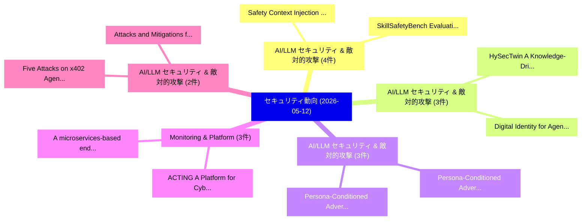

# 📅 02_daily: 日次エグゼクティブサマリー報告書 (2026-05-12)

**集計日時**: 2026-10-02 23:06:09 UTC  
**対象日付**: 2026-05-12  
**本日収集論文数**: 47 件  

---

## 💡 主要セキュリティ動向・脅威インサイト (Executive Insights)

本日の収集論文（計 47 件）において、以下の重点セキュリティ領域で活発な研究動向が確認されました：
- **AI/LLM セキュリティ & 敵対的攻撃** (4 件): 注目論文として 「Safety Context Injection: Infe...」、「SkillSafetyBench: Evaluating A...」 等が発表され、実務防御および攻撃検証の進展が見られます。
- **AI/LLM セキュリティ & 敵対的攻撃** (3 件): 注目論文として 「Digital Identity for Agentic S...」、「HySecTwin: A Knowledge-Driven ...」 等が発表され、実務防御および攻撃検証の進展が見られます。
- **AI/LLM セキュリティ & 敵対的攻撃** (3 件): 注目論文として 「Persona-Conditioned Adversaria...」、「Persona-Conditioned Adversaria...」 等が発表され、実務防御および攻撃検証の進展が見られます。
- **Monitoring & Platform** (3 件): 注目論文として 「A microservices-based endpoint...」、「ACTING: A Platform for Cyber R...」 等が発表され、実務防御および攻撃検証の進展が見られます。
- **AI/LLM セキュリティ & 敵対的攻撃** (2 件): 注目論文として 「Five Attacks on x402 Agentic P...」、「Attacks and Mitigations for Di...」 等が発表され、実務防御および攻撃検証の進展が見られます。

### 🗺️ 技術・脅威トピックマインドマップ

---

## 📌 日次セキュリティ論文一覧 (日本語表形式)

| No | arXiv ID | 論文タイトル (日本語訳) | 重要キーワード | 構造化エグゼクティブ要約 (背景・提案・影響) | 脅威分類 | 詳細リンク |
|---|---|---|---|---|---|---|
| 1 | `2605.11360v1` | [Options, Not Clicks: Lattice Refinement for Consent-Driven MCP Authorization（セキュリティ分析論文）](../../okf/papers/2026-05-12/2605.11360.md) | `Lattice Refinement`, `Consent-Driven MCP`, `Faysal Hossain Shezan` | 【提案】背景とセキュリティ上の課題 (Background & Problem) 本研究はサイバー脅威環境におけるセキュリティ構造・脆弱性の検証を目的としています。(主要検出項目: ...。実証評価により経営層・セキュリティ管理者向け推奨アクション (E... | `arXiv` | [arXiv](https://arxiv.org/abs/2605.11360v1) &#124; [OKF](../../okf/papers/2026-05-12/2605.11360.md) |
| 2 | `2605.11402v1` | [More Than Meets the Eye: A Semantics-Aware Traffic Augmentation Framework for Generalizable Website Fingerprinting（セキュリティ分析論文）](../../okf/papers/2026-05-12/2605.11402.md) | `Generalizable Website Fingerprinting`, `Semantics-Aware Traffic`, `Youquan Xian` | 【提案】概要 (Overview & Key Finding) 本論文「More Than Meets the Eye: A Semantics-Aware Traffic Augm...。実証評価により経営層・セキュリティ管理者向け推奨アクション (E... | `arXiv` | [arXiv](https://arxiv.org/abs/2605.11402v1) &#124; [OKF](../../okf/papers/2026-05-12/2605.11402.md) |
| 3 | `2605.11418v1` | [Under the Hood of SKILL.md: Semantic Supply-chain Attacks on AI Agent Skill Registry（セキュリティ分析論文）](../../okf/papers/2026-05-12/2605.11418.md) | `Agent Skill Registry`, `Semantic Supply`, `Supply-chain Attacks` | 【提案】概要 (Overview & Key Finding) 本論文「Under the Hood of SKILL.md: Semantic Supply-chain Attac...。実証評価により経営層・セキュリティ管理者向け推奨アクション (E... | `arXiv` | [arXiv](https://arxiv.org/abs/2605.11418v1) &#124; [OKF](../../okf/papers/2026-05-12/2605.11418.md) |
| 4 | `2605.11442v1` | [Can a Single Message Paralyze the AI Infrastructure? The Rise of AbO-DDoS Attacks through Targeted Mobius Injection（セキュリティ分析論文）](../../okf/papers/2026-05-12/2605.11442.md) | `Single Message Paralyze`, `Targeted Mobius Injection`, `AbO-DDoS Attacks` | 【提案】The Rise of AbO-DDoS Attacks through Targeted Mobius Injection ### (日本語題名: Can a Single...。実証評価により経営層・セキュリティ管理者向け推奨アクション (E... | `arXiv` | [arXiv](https://arxiv.org/abs/2605.11442v1) &#124; [OKF](../../okf/papers/2026-05-12/2605.11442.md) |
| 5 | `2605.11443v1` | [Experimental Examination of Secure Two-Party Controller Computation（セキュリティ分析論文）](../../okf/papers/2026-05-12/2605.11443.md) | `Party Controller Computation`, `Secure Two`, `Two-Party Controller` | 【提案】概要 (Overview & Key Finding) 本論文「Experimental Examination of Secure Two-Party Controller...。実証評価により経営層・セキュリティ管理者向け推奨アクション (E... | `arXiv` | [arXiv](https://arxiv.org/abs/2605.11443v1) &#124; [OKF](../../okf/papers/2026-05-12/2605.11443.md) |
| 6 | `2605.11487v1` | [Digital Identity for Agentic Systems: Toward a Portable Authorization Standard for Autonomous Agents（セキュリティ分析論文）](../../okf/papers/2026-05-12/2605.11487.md) | `Portable Authorization Standard`, `Digital Identity`, `Agentic Systems` | 【提案】概要 (Overview & Key Finding) 本論文「Digital Identity for Agentic Systems: Toward a Portable...。実証評価により経営層・セキュリティ管理者向け推奨アクション (E... | `arXiv` | [arXiv](https://arxiv.org/abs/2605.11487v1) &#124; [OKF](../../okf/papers/2026-05-12/2605.11487.md) |
| 7 | `2605.11501v1` | [Decaf: Improving Neural Decompilation with Automatic Feedback and Search（セキュリティ分析論文）](../../okf/papers/2026-05-12/2605.11501.md) | `Improving Neural Decompilation`, `Automatic Feedback`, `Alexander Shypula` | 【提案】概要 (Overview & Key Finding) 本論文「Decaf: Improving Neural Decompilation with Automatic Fe...。実証評価により経営層・セキュリティ管理者向け推奨アクション (E... | `arXiv` | [arXiv](https://arxiv.org/abs/2605.11501v1) &#124; [OKF](../../okf/papers/2026-05-12/2605.11501.md) |
| 8 | `2605.11504v2` | [CTFusion: A CTF-based Benchmark for LLM Agent Evaluation（セキュリティ分析論文）](../../okf/papers/2026-05-12/2605.11504.md) | `CTF-based Benchmark`, `Dongjun Lee`, `Insu Yun` | 【提案】概要 (Overview & Key Finding) 本論文「CTFusion: A CTF-based Benchmark for LLM Agent Evaluatio...。実証評価により経営層・セキュリティ管理者向け推奨アクション (E... | `arXiv` | [arXiv](https://arxiv.org/abs/2605.11504v2) &#124; [OKF](../../okf/papers/2026-05-12/2605.11504.md) |
| 9 | `2605.11514v1` | [FlowSteer: Prompt-Only Workflow Steering Exposes Planning-Time Vulnerabilities in Multi-Agent LLM Systems（セキュリティ分析論文）](../../okf/papers/2026-05-12/2605.11514.md) | `Prompt-Only Workflow`, `Time Vulnerabilities`, `Planning-Time Vulnerabilities` | 【提案】概要 (Overview & Key Finding) 本論文「FlowSteer: Prompt-Only Workflow Steering Exposes Planni...。実証評価により経営層・セキュリティ管理者向け推奨アクション (E... | `arXiv` | [arXiv](https://arxiv.org/abs/2605.11514v1) &#124; [OKF](../../okf/papers/2026-05-12/2605.11514.md) |
| 10 | `2605.11527v1` | [FERMI: Exploiting Relations for Membership Inference Against Tabular Diffusion Models（セキュリティ分析論文）](../../okf/papers/2026-05-12/2605.11527.md) | `Exploiting Relations`, `Membership Inference Ag`, `Abtin Mahyar` | 【提案】概要 (Overview & Key Finding) 本論文「FERMI: Exploiting Relations for Membership Inference Ag...。実証評価により経営層・セキュリティ管理者向け推奨アクション (E... | `arXiv` | [arXiv](https://arxiv.org/abs/2605.11527v1) &#124; [OKF](../../okf/papers/2026-05-12/2605.11527.md) |
| 11 | `2605.11592v1` | [SoK: Unlearnability and Unlearning for Model Dememorization（セキュリティ分析論文）](../../okf/papers/2026-05-12/2605.11592.md) | `Model Dememorization`, `Mengying Zhang`, `Derui Wang` | 【提案】概要 (Overview & Key Finding) 本論文「SoK: Unlearnability and Unlearning for Model Dememoriza...。実証評価により経営層・セキュリティ管理者向け推奨アクション (E... | `arXiv` | [arXiv](https://arxiv.org/abs/2605.11592v1) &#124; [OKF](../../okf/papers/2026-05-12/2605.11592.md) |
| 12 | `2605.11606v1` | [Convolutional-Neural-Networks for Deanonymisation of I2P Traffic（セキュリティ分析論文）](../../okf/papers/2026-05-12/2605.11606.md) | `Luca Rohrer`, `Konrad Baechler`, `Dieter Arnold` | 【提案】概要 (Overview & Key Finding) 本論文「Convolutional-Neural-Networks for Deanonymisation of I2...。実証評価により経営層・セキュリティ管理者向け推奨アクション (E... | `arXiv` | [arXiv](https://arxiv.org/abs/2605.11606v1) &#124; [OKF](../../okf/papers/2026-05-12/2605.11606.md) |
| 13 | `2605.11619v1` | [PhishSigma++: Malicious Email Detection with Typed Entity Relations（セキュリティ分析論文）](../../okf/papers/2026-05-12/2605.11619.md) | `Malicious Email Detection`, `Typed Entity Relations`, `Shang Shang` | 【提案】概要 (Overview & Key Finding) 本論文「PhishSigma++: Malicious Email Detection with Typed Enti...。実証評価により経営層・セキュリティ管理者向け推奨アクション (E... | `arXiv` | [arXiv](https://arxiv.org/abs/2605.11619v1) &#124; [OKF](../../okf/papers/2026-05-12/2605.11619.md) |
| 14 | `2605.11653v1` | [Every Bit, Everywhere, All at Once: A Binomial Multibit LLM Watermark（セキュリティ分析論文）](../../okf/papers/2026-05-12/2605.11653.md) | `Every Bit`, `Binomial Multibit`, `Thibaud Gloaguen` | 【提案】概要 (Overview & Key Finding) 本論文「Every Bit, Everywhere, All at Once: A Binomial Multibit...。実証評価により経営層・セキュリティ管理者向け推奨アクション (E... | `arXiv` | [arXiv](https://arxiv.org/abs/2605.11653v1) &#124; [OKF](../../okf/papers/2026-05-12/2605.11653.md) |
| 15 | `2605.11664v1` | [Safety Context Injection: Inference-Time Safety Alignment via Static Filtering and Agentic Analysis（セキュリティ分析論文）](../../okf/papers/2026-05-12/2605.11664.md) | `Safety Context Injection`, `Time Safety Alignment`, `Inference-Time Safety` | 【提案】概要 (Overview & Key Finding) 本論文「Safety Context Injection: Inference-Time Safety Alignme...。実証評価により経営層・セキュリティ管理者向け推奨アクション (E... | `arXiv` | [arXiv](https://arxiv.org/abs/2605.11664v1) &#124; [OKF](../../okf/papers/2026-05-12/2605.11664.md) |
| 16 | `2605.11671v2` | [Cochise: A Reference Harness for Autonomous Penetration Testing（セキュリティ分析論文）](../../okf/papers/2026-05-12/2605.11671.md) | `Autonomous Penetration Testing`, `Reference Harness`, `Andreas Happe` | 【提案】概要 (Overview & Key Finding) 本論文「Cochise: A Reference Harness for Autonomous Penetration...。実証評価により経営層・セキュリティ管理者向け推奨アクション (E... | `arXiv` | [arXiv](https://arxiv.org/abs/2605.11671v2) &#124; [OKF](../../okf/papers/2026-05-12/2605.11671.md) |
| 17 | `2605.11682v2` | [HySecTwin: A Knowledge-Driven Digital Twin Framework Augmented with Hybrid Reasoning for Cyber-Physical Systems（セキュリティ分析論文）](../../okf/papers/2026-05-12/2605.11682.md) | `Hybrid Reasoning`, `Physical Systems`, `Knowledge-Driven Digital` | 【提案】概要 (Overview & Key Finding) 本論文「HySecTwin: A Knowledge-Driven Digital Twin Framework Au...。実証評価により経営層・セキュリティ管理者向け推奨アクション (E... | `arXiv` | [arXiv](https://arxiv.org/abs/2605.11682v2) &#124; [OKF](../../okf/papers/2026-05-12/2605.11682.md) |
| 18 | `2605.11715v2` | [Deanonymizable Scoped Linkable Ring Signatures（セキュリティ分析論文）](../../okf/papers/2026-05-12/2605.11715.md) | `Deanonymizable Scoped Linkable Ring Signatures`, `Montassar Naghmouchi`, `Maryline Laurent` | 【提案】概要 (Overview & Key Finding) 本論文「Deanonymizable Scoped Linkable Ring Signatures（セキュリティ分析...。実証評価により経営層・セキュリティ管理者向け推奨アクション (E... | `arXiv` | [arXiv](https://arxiv.org/abs/2605.11715v2) &#124; [OKF](../../okf/papers/2026-05-12/2605.11715.md) |
| 19 | `2605.11730v1` | [Persona-Conditioned Adversarial Prompting: Multi-Identity Red-Teaming for Adversarial Discovery and Mitigation（セキュリティ分析論文）](../../okf/papers/2026-05-12/2605.11730.md) | `Conditioned Adversarial Prompting`, `Persona-Conditioned Adversarial`, `Identity Red` | 【提案】概要 (Overview & Key Finding) 本論文「Persona-Conditioned Adversarial Prompting: Multi-Identi...。実証評価により経営層・セキュリティ管理者向け推奨アクション (E... | `arXiv` | [arXiv](https://arxiv.org/abs/2605.11730v1) &#124; [OKF](../../okf/papers/2026-05-12/2605.11730.md) |
| 20 | `2605.11770v1` | [Behavioral Integrity Verification for AI Agent Skills（セキュリティ分析論文）](../../okf/papers/2026-05-12/2605.11770.md) | `Behavioral Integrity Verification`, `Agent Skills`, `Yuhao Wu` | 【提案】概要 (Overview & Key Finding) 本論文「Behavioral Integrity Verification for AI Agent Skills（セ...。実証評価により経営層・セキュリティ管理者向け推奨アクション (E... | `arXiv` | [arXiv](https://arxiv.org/abs/2605.11770v1) &#124; [OKF](../../okf/papers/2026-05-12/2605.11770.md) |
| 21 | `2605.11781v1` | [Five Attacks on x402 Agentic Payment Protocol（セキュリティ分析論文）](../../okf/papers/2026-05-12/2605.11781.md) | `Agentic Payment Protocol`, `Five Attacks`, `Zelin Li` | 【提案】概要 (Overview & Key Finding) 本論文「Five Attacks on x402 Agentic Payment Protocol（セキュリティ分析論...。実証評価により経営層・セキュリティ管理者向け推奨アクション (E... | `arXiv` | [arXiv](https://arxiv.org/abs/2605.11781v1) &#124; [OKF](../../okf/papers/2026-05-12/2605.11781.md) |
| 22 | `2605.11868v1` | [IPI-proxy: An Intercepting Proxy for Red-Teaming Web-Browsing AI Agents Against Indirect Prompt Injection（セキュリティ分析論文）](../../okf/papers/2026-05-12/2605.11868.md) | `Teaming Web`, `Red-Teaming Web`, `Kentaroh Toyoda` | 【提案】概要 (Overview & Key Finding) 本論文「IPI-proxy: An Intercepting Proxy for Red-Teaming Web-Br...。実証評価により経営層・セキュリティ管理者向け推奨アクション (E... | `arXiv` | [arXiv](https://arxiv.org/abs/2605.11868v1) &#124; [OKF](../../okf/papers/2026-05-12/2605.11868.md) |
| 23 | `2605.11891v1` | [Proteus: A Self-Evolving Red Team for Agent Skill Ecosystems（セキュリティ分析論文）](../../okf/papers/2026-05-12/2605.11891.md) | `Evolving Red Team`, `Agent Skill Ecosystems`, `Self-Evolving Red` | 【提案】概要 (Overview & Key Finding) 本論文「Proteus: A Self-Evolving Red Team for Agent Skill Ecosy...。実証評価により経営層・セキュリティ管理者向け推奨アクション (E... | `arXiv` | [arXiv](https://arxiv.org/abs/2605.11891v1) &#124; [OKF](../../okf/papers/2026-05-12/2605.11891.md) |
| 24 | `2605.11901v1` | [AccLock: Unlocking Identity with Heartbeat Using In-Ear Accelerometers（セキュリティ分析論文）](../../okf/papers/2026-05-12/2605.11901.md) | `Unlocking Identity`, `Ear Accelerometers`, `In-Ear Accelerometers` | 【提案】概要 (Overview & Key Finding) 本論文「AccLock: Unlocking Identity with Heartbeat Using In-Ear...。実証評価により経営層・セキュリティ管理者向け推奨アクション (E... | `arXiv` | [arXiv](https://arxiv.org/abs/2605.11901v1) &#124; [OKF](../../okf/papers/2026-05-12/2605.11901.md) |
| 25 | `2605.11953v1` | [PROTECT-DB: Protecting Data using Replicated State Machines: Efficient Corruption Detection & Recovery（セキュリティ分析論文）](../../okf/papers/2026-05-12/2605.11953.md) | `Replicated State Machines`, `Efficient Corruption Detection`, `Protecting Data` | 【提案】概要 (Overview & Key Finding) 本論文「PROTECT-DB: Protecting Data using Replicated State Mach...。実証評価により経営層・セキュリティ管理者向け推奨アクション (E... | `arXiv` | [arXiv](https://arxiv.org/abs/2605.11953v1) &#124; [OKF](../../okf/papers/2026-05-12/2605.11953.md) |
| 26 | `2605.11997v2` | [A microservices-based endpoint monitoring platform with predictive NLP models for real-time security and hate-speech risk alerting（セキュリティ分析論文）](../../okf/papers/2026-05-12/2605.11997.md) | `microservices-based endpoint`, `real-time security`, `hate-speech risk` | 【提案】概要 (Overview & Key Finding) 本論文「A microservices-based endpoint monitoring platform with...。実証評価により経営層・セキュリティ管理者向け推奨アクション (E... | `arXiv` | [arXiv](https://arxiv.org/abs/2605.11997v2) &#124; [OKF](../../okf/papers/2026-05-12/2605.11997.md) |
| 27 | `2605.12015v2` | [SkillSafetyBench: Evaluating Agent Safety under Skill-Facing Attack Surfaces（セキュリティ分析論文）](../../okf/papers/2026-05-12/2605.12015.md) | `Evaluating Agent Safety`, `Facing Attack Surfaces`, `Skill-Facing Attack` | 【提案】概要 (Overview & Key Finding) 本論文「SkillSafetyBench: Evaluating Agent Safety under Skill-F...。実証評価により経営層・セキュリティ管理者向け推奨アクション (E... | `arXiv` | [arXiv](https://arxiv.org/abs/2605.12015v2) &#124; [OKF](../../okf/papers/2026-05-12/2605.12015.md) |
| 28 | `2605.12075v1` | [The Deepfakes We Missed: We Built Detectors for a Threat That Didn't Arrive（セキュリティ分析論文）](../../okf/papers/2026-05-12/2605.12075.md) | `Shaina Raza`, `Raw Meta`, `Executive Summary` | 【提案】概要 (Overview & Key Finding) 本論文「The Deepfakes We Missed: We Built Detectors for a 脅威 Th...。実証評価により経営層・セキュリティ管理者向け推奨アクション (E... | `arXiv` | [arXiv](https://arxiv.org/abs/2605.12075v1) &#124; [OKF](../../okf/papers/2026-05-12/2605.12075.md) |
| 29 | `2605.12147v1` | [PrivacySIM: Evaluating LLM Simulation of User Privacy Behavior（セキュリティ分析論文）](../../okf/papers/2026-05-12/2605.12147.md) | `User Privacy Behavior`, `James Flemings`, `Murali Annavaram` | 【提案】概要 (Overview & Key Finding) 本論文「PrivacySIM: Evaluating LLM Simulation of User Privacy B...。実証評価により経営層・セキュリティ管理者向け推奨アクション (E... | `arXiv` | [arXiv](https://arxiv.org/abs/2605.12147v1) &#124; [OKF](../../okf/papers/2026-05-12/2605.12147.md) |
| 30 | `2605.12170v1` | [ACTING: A Platform for Cyber Ranges Federation（セキュリティ分析論文）](../../okf/papers/2026-05-12/2605.12170.md) | `Cyber Ranges Federation`, `Kyriakos Christou`, `Maria Michalopoulou` | 【提案】概要 (Overview & Key Finding) 本論文「ACTING: A Platform for Cyber Ranges Federation（セキュリティ分析...。実証評価により経営層・セキュリティ管理者向け推奨アクション (E... | `arXiv` | [arXiv](https://arxiv.org/abs/2605.12170v1) &#124; [OKF](../../okf/papers/2026-05-12/2605.12170.md) |
| 31 | `2605.12211v1` | [ORCHID: Orchestrated Reduction Consensus for Hash-based Integrity in Distributed Ledgers（セキュリティ分析論文）](../../okf/papers/2026-05-12/2605.12211.md) | `Orchestrated Reduction Consensus`, `Distributed Ledgers`, `Hash-based Integrity` | 【提案】概要 (Overview & Key Finding) 本論文「ORCHID: Orchestrated Reduction Consensus for Hash-based...。実証評価により経営層・セキュリティ管理者向け推奨アクション (E... | `arXiv` | [arXiv](https://arxiv.org/abs/2605.12211v1) &#124; [OKF](../../okf/papers/2026-05-12/2605.12211.md) |
| 32 | `2605.12233v1` | [No More, No Less: Task Alignment in Terminal Agents（セキュリティ分析論文）](../../okf/papers/2026-05-12/2605.12233.md) | `Task Alignment`, `Terminal Agents`, `Sina Mavali` | 【提案】概要 (Overview & Key Finding) 本論文「No More, No Less: Task Alignment in Terminal Agents（セキュ...。実証評価により経営層・セキュリティ管理者向け推奨アクション (E... | `arXiv` | [arXiv](https://arxiv.org/abs/2605.12233v1) &#124; [OKF](../../okf/papers/2026-05-12/2605.12233.md) |
| 33 | `2605.12264v1` | [Reconstruction of Personally Identifiable Information from Supervised Finetuned Models（セキュリティ分析論文）](../../okf/papers/2026-05-12/2605.12264.md) | `Personally Identifiable Information`, `Supervised Finetuned Models`, `Sae Furukawa` | 【提案】概要 (Overview & Key Finding) 本論文「Reconstruction of Personally Identifiable Information f...。実証評価により経営層・セキュリティ管理者向け推奨アクション (E... | `arXiv` | [arXiv](https://arxiv.org/abs/2605.12264v1) &#124; [OKF](../../okf/papers/2026-05-12/2605.12264.md) |
| 34 | `2605.12364v1` | [Attacks and Mitigations for Distributed Governance of Agentic AI under Byzantine Adversaries（セキュリティ分析論文）](../../okf/papers/2026-05-12/2605.12364.md) | `Distributed Governance`, `Byzantine Adversaries`, `Alina Oprea` | 【提案】概要 (Overview & Key Finding) 本論文「Attacks and Mitigations for Distributed Governance of A...。実証評価により経営層・セキュリティ管理者向け推奨アクション (E... | `arXiv` | [arXiv](https://arxiv.org/abs/2605.12364v1) &#124; [OKF](../../okf/papers/2026-05-12/2605.12364.md) |
| 35 | `2605.12456v2` | [TextSeal: A Localized LLM Watermark for Provenance & Distillation Protection（セキュリティ分析論文）](../../okf/papers/2026-05-12/2605.12456.md) | `Distillation Protection`, `Tom Sander`, `Hongyan Chang` | 【提案】概要 (Overview & Key Finding) 本論文「TextSeal: A Localized LLM Watermark for Provenance & Di...。実証評価により経営層・セキュリティ管理者向け推奨アクション (E... | `arXiv` | [arXiv](https://arxiv.org/abs/2605.12456v2) &#124; [OKF](../../okf/papers/2026-05-12/2605.12456.md) |
| 36 | `2605.12563v1` | [OverrideFuzz: Semantic-Aware Grammar Fuzzing for Script-Runtime Vulnerabilities（セキュリティ分析論文）](../../okf/papers/2026-05-12/2605.12563.md) | `Aware Grammar Fuzzing`, `Runtime Vulnerabilities`, `Semantic-Aware Grammar` | 【提案】概要 (Overview & Key Finding) 本論文「OverrideFuzz: Semantic-Aware Grammar Fuzzing for Script...。実証評価により経営層・セキュリティ管理者向け推奨アクション (E... | `arXiv` | [arXiv](https://arxiv.org/abs/2605.12563v1) &#124; [OKF](../../okf/papers/2026-05-12/2605.12563.md) |
| 37 | `2605.12565v1` | [Persona-Conditioned Adversarial Prompting (PCAP): Multi-Identity Red-Teaming for Enhanced Adversarial Prompt Discovery（セキュリティ分析論文）](../../okf/papers/2026-05-12/2605.12565.md) | `Enhanced Adversarial Prompt Discovery`, `Conditioned Adversarial Prompting`, `Identity Red` | 【提案】概要 (Overview & Key Finding) 本論文「Persona-Conditioned Adversarial Prompting (PCAP): Multi...。実証評価により経営層・セキュリティ管理者向け推奨アクション (E... | `arXiv` | [arXiv](https://arxiv.org/abs/2605.12565v1) &#124; [OKF](../../okf/papers/2026-05-12/2605.12565.md) |
| 38 | `2605.12673v1` | [Do Androids Dream of Breaking the Game? Systematically Auditing AI Agent Benchmarks with BenchJack（セキュリティ分析論文）](../../okf/papers/2026-05-12/2605.12673.md) | `Systematically Auditing`, `Agent Benchmarks`, `Hao Wang` | 【提案】Systematically Auditing AI Agent Benchmarks with BenchJack ### (日本語題名: Do Androids Drea...。実証評価により経営層・セキュリティ管理者向け推奨アクション (E... | `arXiv` | [arXiv](https://arxiv.org/abs/2605.12673v1) &#124; [OKF](../../okf/papers/2026-05-12/2605.12673.md) |
| 39 | `2605.12729v2` | [大規模言語モデル for Agentic NetOps and AIOps: Architectures, Evaluation, and Safety](../../okf/papers/2026-05-12/2605.12729.md) | `Large Language Models`, `Muhammad Bilal`, `Jon Crowcroft` | 【提案】概要 (Overview & Key Finding) 本論文「大規模言語モデル for Agentic NetOps and AIOps: Architectures, E...。実証評価により経営層・セキュリティ管理者向け推奨アクション (E... | `arXiv` | [arXiv](https://arxiv.org/abs/2605.12729v2) &#124; [OKF](../../okf/papers/2026-05-12/2605.12729.md) |
| 40 | `2605.12743v1` | [Still Camouflage, Moving Illusion: View-Induced Trajectory Manipulation in Autonomous Driving（セキュリティ分析論文）](../../okf/papers/2026-05-12/2605.12743.md) | `Induced Trajectory Manipulation`, `Still Camouflage`, `Moving Illusion` | 【提案】概要 (Overview & Key Finding) 本論文「Still Camouflage, Moving Illusion: View-Induced Traject...。実証評価により経営層・セキュリティ管理者向け推奨アクション (E... | `arXiv` | [arXiv](https://arxiv.org/abs/2605.12743v1) &#124; [OKF](../../okf/papers/2026-05-12/2605.12743.md) |
| 41 | `2605.12746v1` | [CoT-Guard: Small Models for Strong Monitoring（セキュリティ分析論文）](../../okf/papers/2026-05-12/2605.12746.md) | `Small Models`, `Strong Monitoring`, `Nirav Diwan` | 【提案】概要 (Overview & Key Finding) 本論文「CoT-Guard: Small Models for Strong Monitoring（セキュリティ分析論...。実証評価により経営層・セキュリティ管理者向け推奨アクション (E... | `arXiv` | [arXiv](https://arxiv.org/abs/2605.12746v1) &#124; [OKF](../../okf/papers/2026-05-12/2605.12746.md) |
| 42 | `2605.12794v1` | [Dynamic Transaction Scheduling and Pricing in the Ethereum Mempool（セキュリティ分析論文）](../../okf/papers/2026-05-12/2605.12794.md) | `Dynamic Transaction Scheduling`, `Ethereum Mempool`, `Fatemeh Fardno` | 【提案】概要 (Overview & Key Finding) 本論文「Dynamic Transaction Scheduling and Pricing in the Ether...。実証評価によりRasoul Etesami - **公開日時**... | `arXiv` | [arXiv](https://arxiv.org/abs/2605.12794v1) &#124; [OKF](../../okf/papers/2026-05-12/2605.12794.md) |
| 43 | `2605.12813v2` | [REALISTA: Realistic Latent Adversarial Attacks that Elicit LLM Hallucinations（セキュリティ分析論文）](../../okf/papers/2026-05-12/2605.12813.md) | `Realistic Latent Adversarial Attacks`, `Kwan Ho Ryan Chan`, `Buyun Liang` | 【提案】概要 (Overview & Key Finding) 本論文「REALISTA: Realistic Latent 敵対的攻撃s that Elicit LLM Hallu...。実証評価により経営層・セキュリティ管理者向け推奨アクション (E... | `arXiv` | [arXiv](https://arxiv.org/abs/2605.12813v2) &#124; [OKF](../../okf/papers/2026-05-12/2605.12813.md) |
| 44 | `2605.12827v2` | [GraphIP-Bench: How Hard Is It to Steal a Graph Neural Network, and Can We Stop It?（セキュリティ分析論文）](../../okf/papers/2026-05-12/2605.12827.md) | `Graph Neural Network`, `Kaixiang Zhao`, `Bolin Shen` | 【提案】### (日本語題名: GraphIP-Bench: How Hard Is It to Steal a Graph Neural Network, and Can We S...。実証評価により経営層・セキュリティ管理者向け推奨アクション (E... | `arXiv` | [arXiv](https://arxiv.org/abs/2605.12827v2) &#124; [OKF](../../okf/papers/2026-05-12/2605.12827.md) |
| 45 | `2605.18821v1` | [Quantum Adversarial Machine Learning: From Classical Adaptations to Quantum-Native Methods（セキュリティ分析論文）](../../okf/papers/2026-05-12/2605.18821.md) | `Quantum Adversarial Machine Learning`, `Native Methods`, `Quantum-Native Methods` | 【提案】概要 (Overview & Key Finding) 本論文「量子 Adversarial Machine Learning: From Classical Adaptat...。実証評価により経営層・セキュリティ管理者向け推奨アクション (E... | `arXiv` | [arXiv](https://arxiv.org/abs/2605.18821v1) &#124; [OKF](../../okf/papers/2026-05-12/2605.18821.md) |
| 46 | `2605.18829v1` | [Lossless Anti-Distillation Sampling（セキュリティ分析論文）](../../okf/papers/2026-05-12/2605.18829.md) | `Lossless Anti`, `Distillation Sampling`, `Anti-Distillation Sampling` | 【提案】概要 (Overview & Key Finding) 本論文「Lossless Anti-Distillation Sampling（セキュリティ分析論文）」（原題: Lo...。実証評価により経営層・セキュリティ管理者向け推奨アクション (E... | `arXiv` | [arXiv](https://arxiv.org/abs/2605.18829v1) &#124; [OKF](../../okf/papers/2026-05-12/2605.18829.md) |
| 47 | `2605.22842v1` | [The Misattribution Gap: When Memory Poisoning Looks Like Model Failure in Agentic AI Systems（セキュリティ分析論文）](../../okf/papers/2026-05-12/2605.22842.md) | `Md Jahangir Alam`, `Syed Bahauddin Alam`, `Tanzim Ahad` | 【提案】概要 (Overview & Key Finding) 本論文「The Misattribution Gap: When Memory Poisoning Looks Lik...。実証評価により経営層・セキュリティ管理者向け推奨アクション (E... | `arXiv` | [arXiv](https://arxiv.org/abs/2605.22842v1) &#124; [OKF](../../okf/papers/2026-05-12/2605.22842.md) |

