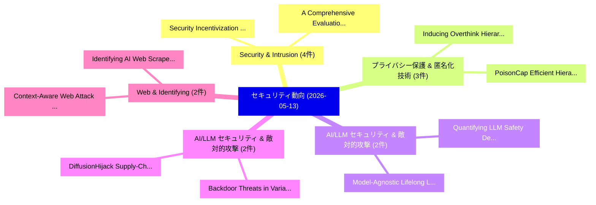

# 📅 02_daily: 日次エグゼクティブサマリー報告書 (2026-05-13)

**集計日時**: 2026-10-02 23:06:10 UTC  
**対象日付**: 2026-05-13  
**本日収集論文数**: 43 件  

---

## 💡 主要セキュリティ動向・脅威インサイト (Executive Insights)

本日の収集論文（計 43 件）において、以下の重点セキュリティ領域で活発な研究動向が確認されました：
- **Security & Intrusion** (4 件): 注目論文として 「Security Incentivization: how ...」、「A Comprehensive Evaluation of ...」 等が発表され、実務防御および攻撃検証の進展が見られます。
- **プライバシー保護 & 匿名化技術** (3 件): 注目論文として 「PoisonCap: Efficient Hierarchi...」、「Inducing Overthink: Hierarchic...」 等が発表され、実務防御および攻撃検証の進展が見られます。
- **AI/LLM セキュリティ & 敵対的攻撃** (2 件): 注目論文として 「Quantifying LLM Safety Degrada...」、「Model-Agnostic Lifelong LLM Sa...」 等が発表され、実務防御および攻撃検証の進展が見られます。
- **AI/LLM セキュリティ & 敵対的攻撃** (2 件): 注目論文として 「DiffusionHijack: Supply-Chain ...」、「Backdoor Threats in Variationa...」 等が発表され、実務防御および攻撃検証の進展が見られます。
- **Web & Identifying** (2 件): 注目論文として 「Context-Aware Web Attack Detec...」、「Identifying AI Web Scrapers Us...」 等が発表され、実務防御および攻撃検証の進展が見られます。

### 🗺️ 技術・脅威トピックマインドマップ

---

## 📌 日次セキュリティ論文一覧 (日本語表形式)

| No | arXiv ID | 論文タイトル (日本語訳) | 重要キーワード | 構造化エグゼクティブ要約 (背景・提案・影響) | 脅威分類 | 詳細リンク |
|---|---|---|---|---|---|---|
| 1 | `2605.12841v1` | [HE-PIM: Demystifying Homomorphic Operations on a Real-world Processing-in-Memory System（セキュリティ分析論文）](../../okf/papers/2026-05-13/2605.12841.md) | `Demystifying Homomorphic Operations`, `Memory System`, `Real-world Processing` | 【提案】概要 (Overview & Key Finding) 本論文「HE-PIM: Demystifying Homomorphic Operations on a Real-w...。実証評価により経営層・セキュリティ管理者向け推奨アクション (E... | `arXiv` | [arXiv](https://arxiv.org/abs/2605.12841v1) &#124; [OKF](../../okf/papers/2026-05-13/2605.12841.md) |
| 2 | `2605.12850v2` | [Persona-Model Collapse in Emergent Misalignment（セキュリティ分析論文）](../../okf/papers/2026-05-13/2605.12850.md) | `Model Collapse`, `Emergent Misalignment`, `Persona-Model Collapse` | 【提案】概要 (Overview & Key Finding) 本論文「Persona-Model Collapse in Emergent Misalignment（セキュリティ分...。実証評価により経営層・セキュリティ管理者向け推奨アクション (E... | `arXiv` | [arXiv](https://arxiv.org/abs/2605.12850v2) &#124; [OKF](../../okf/papers/2026-05-13/2605.12850.md) |
| 3 | `2605.12863v1` | [Language-Based Agent Control（セキュリティ分析論文）](../../okf/papers/2026-05-13/2605.12863.md) | `Based Agent Control`, `Language-Based Agent`, `Timothy Zhou` | 【提案】概要 (Overview & Key Finding) 本論文「Language-Based Agent Control（セキュリティ分析論文）」（原題: Language-...。実証評価により経営層・セキュリティ管理者向け推奨アクション (E... | `arXiv` | [arXiv](https://arxiv.org/abs/2605.12863v1) &#124; [OKF](../../okf/papers/2026-05-13/2605.12863.md) |
| 4 | `2605.12869v1` | [Quantifying LLM Safety Degradation Under Repeated Attacks Using Survival Analysis（セキュリティ分析論文）](../../okf/papers/2026-05-13/2605.12869.md) | `Zvi Topol`, `Raw Meta`, `Executive Summary` | 【提案】概要 (Overview & Key Finding) 本論文「Quantifying LLM Safety Degradation Under Repeated Attac...。実証評価により経営層・セキュリティ管理者向け推奨アクション (E... | `arXiv` | [arXiv](https://arxiv.org/abs/2605.12869v1) &#124; [OKF](../../okf/papers/2026-05-13/2605.12869.md) |
| 5 | `2605.12875v1` | [Do Skill Descriptions Tell the Truth? Detecting Undisclosed Security Behaviors in Code-Backed LLM Skills（セキュリティ分析論文）](../../okf/papers/2026-05-13/2605.12875.md) | `Detecting Undisclosed Security Behaviors`, `Code-Backed LLM`, `Yue Li` | 【提案】Detecting Undisclosed Security Behaviors in Code-Backed LLM Skills ### (日本語題名: Do Skill...。実証評価により経営層・セキュリティ管理者向け推奨アクション (E... | `arXiv` | [arXiv](https://arxiv.org/abs/2605.12875v1) &#124; [OKF](../../okf/papers/2026-05-13/2605.12875.md) |
| 6 | `2605.12927v1` | [ThermalTap: Passive Application Fingerprinting in VR Headsets via Thermal Side Channels（セキュリティ分析論文）](../../okf/papers/2026-05-13/2605.12927.md) | `Passive Application Fingerprinting`, `Thermal Side Channels`, `Mahsin Bin Akram` | 【提案】概要 (Overview & Key Finding) 本論文「ThermalTap: Passive Application Fingerprinting in VR He...。実証評価により経営層・セキュリティ管理者向け推奨アクション (E... | `arXiv` | [arXiv](https://arxiv.org/abs/2605.12927v1) &#124; [OKF](../../okf/papers/2026-05-13/2605.12927.md) |
| 7 | `2605.12942v2` | [From Compression to Accountability: Harmless Copyright Protection for Dataset Distillation（セキュリティ分析論文）](../../okf/papers/2026-05-13/2605.12942.md) | `Harmless Copyright Protection`, `Dataset Distillation`, `Joey Tianyi Zhou` | 【提案】概要 (Overview & Key Finding) 本論文「From Compression to Accountability: Harmless Copyright ...。実証評価により経営層・セキュリティ管理者向け推奨アクション (E... | `arXiv` | [arXiv](https://arxiv.org/abs/2605.12942v2) &#124; [OKF](../../okf/papers/2026-05-13/2605.12942.md) |
| 8 | `2605.12976v1` | [CLOUDBURST: Cloud-Layer Observations Using Beacons for Unified Real-time Surveillance and Threat Attribution（セキュリティ分析論文）](../../okf/papers/2026-05-13/2605.12976.md) | `Layer Observations Using Beacons`, `Unified Real`, `Threat Attribution` | 【提案】概要 (Overview & Key Finding) 本論文「CLOUDBURST: Cloud-Layer Observations Using Beacons for ...。実証評価により経営層・セキュリティ管理者向け推奨アクション (E... | `arXiv` | [arXiv](https://arxiv.org/abs/2605.12976v1) &#124; [OKF](../../okf/papers/2026-05-13/2605.12976.md) |
| 9 | `2605.12990v1` | [Insecure Despite Proven Updated: Extracting the Root VCEK Seed on EPYC Milan via a Software-Only Attack（セキュリティ分析論文）](../../okf/papers/2026-05-13/2605.12990.md) | `Insecure Despite Proven Updated`, `Software-Only Attack`, `Insecure Despite Pro` | 【提案】背景とセキュリティ上の課題 (Background & Problem) 本研究はサイバー脅威環境におけるセキュリティ構造・脆弱性の検証を目的としています。(主要検出項目: ...。実証評価により経営層・セキュリティ管理者向け推奨アクション (E... | `arXiv` | [arXiv](https://arxiv.org/abs/2605.12990v1) &#124; [OKF](../../okf/papers/2026-05-13/2605.12990.md) |
| 10 | `2605.13044v1` | [No Attack Required: Semantic Fuzzing for Specification Violations in Agent Skills（セキュリティ分析論文）](../../okf/papers/2026-05-13/2605.13044.md) | `Semantic Fuzzing`, `Specification Violations`, `Agent Skills` | 【提案】概要 (Overview & Key Finding) 本論文「No Attack Required: Semantic Fuzzing for Specification ...。実証評価により経営層・セキュリティ管理者向け推奨アクション (E... | `arXiv` | [arXiv](https://arxiv.org/abs/2605.13044v1) &#124; [OKF](../../okf/papers/2026-05-13/2605.13044.md) |
| 11 | `2605.13095v2` | [Watermarking Should Be Treated as a Monitoring Primitive（セキュリティ分析論文）](../../okf/papers/2026-05-13/2605.13095.md) | `Monitoring Primitive`, `Toluwani Aremu`, `Nils Lukas` | 【提案】概要 (Overview & Key Finding) 本論文「Watermarking Should Be Treated as a Monitoring Primitiv...。実証評価により経営層・セキュリティ管理者向け推奨アクション (E... | `arXiv` | [arXiv](https://arxiv.org/abs/2605.13095v2) &#124; [OKF](../../okf/papers/2026-05-13/2605.13095.md) |
| 12 | `2605.13100v1` | [Security Incentivization: how Micropayments Impact Code Securityの実証研究](../../okf/papers/2026-05-13/2605.13100.md) | `Security Incentivization`, `Micropayments Impact Code`, `Micropayments Impact Code Security` | 【提案】概要 (Overview & Key Finding) 本論文「Security Incentivization: how Micropayments Impact Code...。実証評価により経営層・セキュリティ管理者向け推奨アクション (E... | `arXiv` | [arXiv](https://arxiv.org/abs/2605.13100v1) &#124; [OKF](../../okf/papers/2026-05-13/2605.13100.md) |
| 13 | `2605.13109v1` | [QCIVET: A Quantum--Classical Pipeline Integrity Framework with Contract-Based Subtype Verification and Hash-Chained Audit Traces（セキュリティ分析論文）](../../okf/papers/2026-05-13/2605.13109.md) | `Based Subtype Verification`, `Chained Audit Traces`, `Contract-Based Subtype` | 【提案】概要 (Overview & Key Finding) 本論文「QCIVET: A 量子--Classical Pipeline Integrity Framework wi...。実証評価により経営層・セキュリティ管理者向け推奨アクション (E... | `arXiv` | [arXiv](https://arxiv.org/abs/2605.13109v1) &#124; [OKF](../../okf/papers/2026-05-13/2605.13109.md) |
| 14 | `2605.13115v1` | [DiffusionHijack: Supply-Chain PRNG Backdoor Attack on Diffusion Models and Quantum Random Number Defense（セキュリティ分析論文）](../../okf/papers/2026-05-13/2605.13115.md) | `Quantum Random Number Defense`, `Backdoor Attack`, `Diffusion Models` | 【提案】概要 (Overview & Key Finding) 本論文「DiffusionHijack: Supply-Chain PRNG Backdoor Attack on D...。実証評価により経営層・セキュリティ管理者向け推奨アクション (E... | `arXiv` | [arXiv](https://arxiv.org/abs/2605.13115v1) &#124; [OKF](../../okf/papers/2026-05-13/2605.13115.md) |
| 15 | `2605.13132v1` | [Extending Blockchain Untraceability with Plausible Deniability（セキュリティ分析論文）](../../okf/papers/2026-05-13/2605.13132.md) | `Extending Blockchain Untraceability`, `Plausible Deniability`, `Won Hoi Kim` | 【提案】概要 (Overview & Key Finding) 本論文「Extending Blockchain Untraceability with Plausible Deni...。実証評価により経営層・セキュリティ管理者向け推奨アクション (E... | `arXiv` | [arXiv](https://arxiv.org/abs/2605.13132v1) &#124; [OKF](../../okf/papers/2026-05-13/2605.13132.md) |
| 16 | `2605.13138v2` | [A Comprehensive Evaluation of Code Language Models for Security Patch Detection（セキュリティ分析論文）](../../okf/papers/2026-05-13/2605.13138.md) | `Code Language Models`, `Security Patch Detection`, `Nils Loose` | 【提案】概要 (Overview & Key Finding) 本論文「A Comprehensive Evaluation of Code Language Models for ...。実証評価により経営層・セキュリティ管理者向け推奨アクション (E... | `arXiv` | [arXiv](https://arxiv.org/abs/2605.13138v2) &#124; [OKF](../../okf/papers/2026-05-13/2605.13138.md) |
| 17 | `2605.13159v1` | [Empowering IoT Security: On-Device Intrusion Detection in Resource Constrained Devices（セキュリティ分析論文）](../../okf/papers/2026-05-13/2605.13159.md) | `Device Intrusion Detection`, `Resource Constrained Devices`, `On-Device Intrusion` | 【提案】概要 (Overview & Key Finding) 本論文「Empowering IoT Security: On-Device Intrusion Detection ...。実証評価により経営層・セキュリティ管理者向け推奨アクション (E... | `arXiv` | [arXiv](https://arxiv.org/abs/2605.13159v1) &#124; [OKF](../../okf/papers/2026-05-13/2605.13159.md) |
| 18 | `2605.13163v1` | [LoREnc: Low-Rank Encryption for Foundation Models and LoRA Adaptersのセキュリティ強化](../../okf/papers/2026-05-13/2605.13163.md) | `Rank Encryption`, `Low-Rank Encryption`, `Securing Foundation Models` | 【提案】概要 (Overview & Key Finding) 本論文「LoREnc: Low-Rank Encryption for Foundation Models and L...。実証評価により経営層・セキュリティ管理者向け推奨アクション (E... | `arXiv` | [arXiv](https://arxiv.org/abs/2605.13163v1) &#124; [OKF](../../okf/papers/2026-05-13/2605.13163.md) |
| 19 | `2605.13210v1` | [PoisonCap: Efficient Hierarchical Temporal Safety for CHERI（セキュリティ分析論文）](../../okf/papers/2026-05-13/2605.13210.md) | `Efficient Hierarchical Temporal Safety`, `Yuecheng Wang`, `Jonathan Woodruff` | 【提案】概要 (Overview & Key Finding) 本論文「PoisonCap: Efficient Hierarchical Temporal Safety for C...。実証評価により経営層・セキュリティ管理者向け推奨アクション (E... | `arXiv` | [arXiv](https://arxiv.org/abs/2605.13210v1) &#124; [OKF](../../okf/papers/2026-05-13/2605.13210.md) |
| 20 | `2605.13214v2` | [Backdoor Channels Hidden in Latent Space: Cryptographic Undetectability in Modern Neural Networks（セキュリティ分析論文）](../../okf/papers/2026-05-13/2605.13214.md) | `Backdoor Channels Hidden`, `Modern Neural Networks`, `Latent Space` | 【提案】概要 (Overview & Key Finding) 本論文「Backdoor Channels Hidden in Latent Space: Cryptographic...。実証評価により経営層・セキュリティ管理者向け推奨アクション (E... | `arXiv` | [arXiv](https://arxiv.org/abs/2605.13214v2) &#124; [OKF](../../okf/papers/2026-05-13/2605.13214.md) |
| 21 | `2605.13246v2` | [Automatic Reference Counting Bugs in Linux Kernel Driversの検出](../../okf/papers/2026-05-13/2605.13246.md) | `Automatic Reference Counting Bugs`, `Reference Counting Bugs`, `Linux Kernel Drivers` | 【提案】概要 (Overview & Key Finding) 本論文「Automatic Reference Counting Bugs in Linux Kernel Drive...。実証評価により経営層・セキュリティ管理者向け推奨アクション (E... | `arXiv` | [arXiv](https://arxiv.org/abs/2605.13246v2) &#124; [OKF](../../okf/papers/2026-05-13/2605.13246.md) |
| 22 | `2605.13337v1` | [Context-Aware Web Attack Detection in Open-Source SIEM Systems via MITRE ATT&CK-Enriched Behavioral Profiling（セキュリティ分析論文）](../../okf/papers/2026-05-13/2605.13337.md) | `Aware Web Attack Detection`, `Enriched Behavioral Profiling`, `Context-Aware Web` | 【提案】概要 (Overview & Key Finding) 本論文「Context-Aware Web Attack Detection in Open-Source SIEM ...。実証評価により経営層・セキュリティ管理者向け推奨アクション (E... | `arXiv` | [arXiv](https://arxiv.org/abs/2605.13337v1) &#124; [OKF](../../okf/papers/2026-05-13/2605.13337.md) |
| 23 | `2605.13338v2` | [Inducing Overthink: Hierarchical Genetic Algorithm-based DoS Attack on Black-Box Large Language Reasoning Models（セキュリティ分析論文）](../../okf/papers/2026-05-13/2605.13338.md) | `Box Large Language Reasoning Models`, `Hierarchical Genetic Algorithm`, `Inducing Overthink` | 【提案】概要 (Overview & Key Finding) 本論文「Inducing Overthink: Hierarchical Genetic Algorithm-base...。実証評価により経営層・セキュリティ管理者向け推奨アクション (E... | `arXiv` | [arXiv](https://arxiv.org/abs/2605.13338v2) &#124; [OKF](../../okf/papers/2026-05-13/2605.13338.md) |
| 24 | `2605.13411v1` | [Model-Agnostic Lifelong LLM Safety via Externalized Attack-Defense Co-Evolution（セキュリティ分析論文）](../../okf/papers/2026-05-13/2605.13411.md) | `Agnostic Lifelong`, `Model-Agnostic Lifelong`, `Externalized Attack` | 【提案】概要 (Overview & Key Finding) 本論文「Model-Agnostic Lifelong LLM Safety via Externalized Att...。実証評価により経営層・セキュリティ管理者向け推奨アクション (E... | `arXiv` | [arXiv](https://arxiv.org/abs/2605.13411v1) &#124; [OKF](../../okf/papers/2026-05-13/2605.13411.md) |
| 25 | `2605.13471v1` | [Sleeper Channels and Provenance Gates: Persistent Prompt Injection in Always-on Autonomous AI Agents（セキュリティ分析論文）](../../okf/papers/2026-05-13/2605.13471.md) | `Persistent Prompt Injection`, `Sleeper Channels`, `Provenance Gates` | 【提案】概要 (Overview & Key Finding) 本論文「Sleeper Channels and Provenance Gates: Persistent プロンプト...。実証評価により経営層・セキュリティ管理者向け推奨アクション (E... | `arXiv` | [arXiv](https://arxiv.org/abs/2605.13471v1) &#124; [OKF](../../okf/papers/2026-05-13/2605.13471.md) |
| 26 | `2605.13492v2` | [Phantom Force: Injecting Adversarial Tactile Perceptions into Embodied Intelligence via EMI（セキュリティ分析論文）](../../okf/papers/2026-05-13/2605.13492.md) | `Injecting Adversarial Tactile Perceptions`, `Phantom Force`, `Embodied Intelligence` | 【提案】概要 (Overview & Key Finding) 本論文「Phantom Force: Injecting Adversarial Tactile Perception...。実証評価により経営層・セキュリティ管理者向け推奨アクション (E... | `arXiv` | [arXiv](https://arxiv.org/abs/2605.13492v2) &#124; [OKF](../../okf/papers/2026-05-13/2605.13492.md) |
| 27 | `2605.13500v1` | [Uncertainty-Aware 3D Position Refinement for Multi-UAV Systems（セキュリティ分析論文）](../../okf/papers/2026-05-13/2605.13500.md) | `Position Refinement`, `Uncertainty-Aware 3D`, `Multi-UAV Systems` | 【提案】概要 (Overview & Key Finding) 本論文「Uncertainty-Aware 3D Position Refinement for Multi-UAV ...。実証評価により経営層・セキュリティ管理者向け推奨アクション (E... | `arXiv` | [arXiv](https://arxiv.org/abs/2605.13500v1) &#124; [OKF](../../okf/papers/2026-05-13/2605.13500.md) |
| 28 | `2605.13503v1` | [Limits of Personalizing Differential Privacy Budgets（セキュリティ分析論文）](../../okf/papers/2026-05-13/2605.13503.md) | `Personalizing Differential Privacy Budgets`, `Edwige Cyffers`, `Juba Ziani` | 【提案】概要 (Overview & Key Finding) 本論文「Limits of Personalizing 差分プライバシー Budgets（セキュリティ分析論文）」（原...。実証評価により経営層・セキュリティ管理者向け推奨アクション (E... | `arXiv` | [arXiv](https://arxiv.org/abs/2605.13503v1) &#124; [OKF](../../okf/papers/2026-05-13/2605.13503.md) |
| 29 | `2605.13676v2` | [EBCC: Enclave-Backed Confidential Containers via OCI-Compatible Runtime Integration（セキュリティ分析論文）](../../okf/papers/2026-05-13/2605.13676.md) | `Backed Confidential Containers`, `Compatible Runtime Integration`, `Enclave-Backed Confidential` | 【提案】概要 (Overview & Key Finding) 本論文「EBCC: Enclave-Backed Confidential Containers via OCI-Co...。実証評価により経営層・セキュリティ管理者向け推奨アクション (E... | `arXiv` | [arXiv](https://arxiv.org/abs/2605.13676v2) &#124; [OKF](../../okf/papers/2026-05-13/2605.13676.md) |
| 30 | `2605.13698v1` | [MQTT Across a Raspberry Pi 5 IoT Network Utilizing Quantum-resistant Signature Algorithms（セキュリティ分析論文）](../../okf/papers/2026-05-13/2605.13698.md) | `Network Utilizing Quantum`, `Raspberry Pi`, `Signature Algorithms` | 【提案】概要 (Overview & Key Finding) 本論文「MQTT Across a Raspberry Pi 5 IoT Network Utilizing 量子-r...。実証評価により経営層・セキュリティ管理者向け推奨アクション (E... | `arXiv` | [arXiv](https://arxiv.org/abs/2605.13698v1) &#124; [OKF](../../okf/papers/2026-05-13/2605.13698.md) |
| 31 | `2605.13706v1` | [Identifying AI Web Scrapers Using Canary Tokens（セキュリティ分析論文）](../../okf/papers/2026-05-13/2605.13706.md) | `Web Scrapers Using Canary Tokens`, `Steven Seiden`, `Triss Ren` | 【提案】概要 (Overview & Key Finding) 本論文「Identifying AI Web Scrapers Using Canary Tokens（セキュリティ分...。実証評価により経営層・セキュリティ管理者向け推奨アクション (E... | `arXiv` | [arXiv](https://arxiv.org/abs/2605.13706v1) &#124; [OKF](../../okf/papers/2026-05-13/2605.13706.md) |
| 32 | `2605.13708v1` | [DisAgg: Distributed Aggregators for Efficient Secure Aggregation in 連合学習](../../okf/papers/2026-05-13/2605.13708.md) | `Efficient Secure Aggregation`, `Distributed Aggregators`, `Federated Learning` | 【提案】概要 (Overview & Key Finding) 本論文「DisAgg: Distributed Aggregators for Efficient Secure Ag...。実証評価により経営層・セキュリティ管理者向け推奨アクション (E... | `arXiv` | [arXiv](https://arxiv.org/abs/2605.13708v1) &#124; [OKF](../../okf/papers/2026-05-13/2605.13708.md) |
| 33 | `2605.13764v1` | [VectorSmuggle: Steganographic Exfiltration in Embedding Stores and a Cryptographic Provenance Defense（セキュリティ分析論文）](../../okf/papers/2026-05-13/2605.13764.md) | `Cryptographic Provenance Defense`, `Steganographic Exfiltration`, `Embedding Stores` | 【提案】概要 (Overview & Key Finding) 本論文「VectorSmuggle: Steganographic Exfiltration in Embedding...。実証評価により経営層・セキュリティ管理者向け推奨アクション (E... | `arXiv` | [arXiv](https://arxiv.org/abs/2605.13764v1) &#124; [OKF](../../okf/papers/2026-05-13/2605.13764.md) |
| 34 | `2605.13796v1` | [Backdoor Threats in Variational Quantum Circuits: Taxonomy, Attacks, and Defenses（セキュリティ分析論文）](../../okf/papers/2026-05-13/2605.13796.md) | `Variational Quantum Circuits`, `Backdoor Threats`, `Lei Jiang` | 【提案】概要 (Overview & Key Finding) 本論文「Backdoor Threats in Variational 量子 Circuits: Taxonomy, ...。実証評価により経営層・セキュリティ管理者向け推奨アクション (E... | `arXiv` | [arXiv](https://arxiv.org/abs/2605.13796v1) &#124; [OKF](../../okf/papers/2026-05-13/2605.13796.md) |
| 35 | `2605.13922v2` | [XAI and Statistical Analysis for Reliable Intrusion Detection in the UAVIDS-2025 Dataset: From Tree to Hybrid and Tabular DNN Ensembles（セキュリティ分析論文）](../../okf/papers/2026-05-13/2605.13922.md) | `Reliable Intrusion Detection`, `UAVIDS-2025 Dataset`, `Christos Zarkadis` | 【提案】概要 (Overview & Key Finding) 本論文「XAI and Statistical Analysis for Reliable Intrusion Det...。実証評価により経営層・セキュリティ管理者向け推奨アクション (E... | `arXiv` | [arXiv](https://arxiv.org/abs/2605.13922v2) &#124; [OKF](../../okf/papers/2026-05-13/2605.13922.md) |
| 36 | `2605.13940v1` | [AgentTrap: Measuring Runtime Trust Failures in Third-Party Agent Skills（セキュリティ分析論文）](../../okf/papers/2026-05-13/2605.13940.md) | `Measuring Runtime Trust Failures`, `Party Agent Skills`, `Third-Party Agent` | 【提案】概要 (Overview & Key Finding) 本論文「AgentTrap: Measuring Runtime Trust Failures in Third-Pa...。実証評価により経営層・セキュリティ管理者向け推奨アクション (E... | `arXiv` | [arXiv](https://arxiv.org/abs/2605.13940v1) &#124; [OKF](../../okf/papers/2026-05-13/2605.13940.md) |
| 37 | `2605.14020v1` | [Memory Forensics Techniques for Automated Detection and Go Malwareの分析](../../okf/papers/2026-05-13/2605.14020.md) | `Memory Forensics Techniques`, `Automated Detection`, `Go Malware` | 【提案】概要 (Overview & Key Finding) 本論文「Memory Forensics Techniques for Automated Detection and...。実証評価により経営層・セキュリティ管理者向け推奨アクション (E... | `arXiv` | [arXiv](https://arxiv.org/abs/2605.14020v1) &#124; [OKF](../../okf/papers/2026-05-13/2605.14020.md) |
| 38 | `2605.14032v1` | [StormShield: Fingerprint-Based Detection and Mitigation of RRC Signaling Storms in O-RAN 5G RANs（セキュリティ分析論文）](../../okf/papers/2026-05-13/2605.14032.md) | `Based Detection`, `Signaling Storms`, `Fingerprint-Based Detection` | 【提案】概要 (Overview & Key Finding) 本論文「StormShield: Fingerprint-Based Detection and Mitigation...。実証評価により経営層・セキュリティ管理者向け推奨アクション (E... | `arXiv` | [arXiv](https://arxiv.org/abs/2605.14032v1) &#124; [OKF](../../okf/papers/2026-05-13/2605.14032.md) |
| 39 | `2605.14152v2` | [ROK-FORTRESS: Measuring the Effect of Geopolitical Transcreation for National Security and Public Safety（セキュリティ分析論文）](../../okf/papers/2026-05-13/2605.14152.md) | `Geopolitical Transcreation`, `National Security`, `Public Safety` | 【提案】概要 (Overview & Key Finding) 本論文「ROK-FORTRESS: Measuring the Effect of Geopolitical Tran...。実証評価により経営層・セキュリティ管理者向け推奨アクション (E... | `arXiv` | [arXiv](https://arxiv.org/abs/2605.14152v2) &#124; [OKF](../../okf/papers/2026-05-13/2605.14152.md) |
| 40 | `2605.14153v1` | [ExploitBench: A Capability Ladder Benchmark for LLM サイバーセキュリティ Agents](../../okf/papers/2026-05-13/2605.14153.md) | `Capability Ladder Benchmark`, `Cybersecurity Agents`, `Seunghyun Lee` | 【提案】概要 (Overview & Key Finding) 本論文「ExploitBench: A Capability Ladder Benchmark for LLM サイバ...。実証評価により経営層・セキュリティ管理者向け推奨アクション (E... | `arXiv` | [arXiv](https://arxiv.org/abs/2605.14153v1) &#124; [OKF](../../okf/papers/2026-05-13/2605.14153.md) |
| 41 | `2605.14165v1` | [DSTAN-Med: Dual-Channel Spatiotemporal Attention with Physiological Plausibility Filtering for False Data Injection Attack Detection in IoT-Based Medical Devices（セキュリティ分析論文）](../../okf/papers/2026-05-13/2605.14165.md) | `False Data Injection Attack Detection`, `Channel Spatiotemporal Attention`, `Physiological Plausibility Filtering` | 【提案】概要 (Overview & Key Finding) 本論文「DSTAN-Med: Dual-Channel Spatiotemporal Attention with P...。実証評価により経営層・セキュリティ管理者向け推奨アクション (E... | `arXiv` | [arXiv](https://arxiv.org/abs/2605.14165v1) &#124; [OKF](../../okf/papers/2026-05-13/2605.14165.md) |
| 42 | `2605.14204v1` | [Day-to-Day Traffic Network Modeling under Route-Guidance Misinformation: Endogenous Trust and Resilience in CAV Environments（セキュリティ分析論文）](../../okf/papers/2026-05-13/2605.14204.md) | `Day Traffic Network Modeling`, `Guidance Misinformation`, `Endogenous Trust` | 【提案】概要 (Overview & Key Finding) 本論文「Day-to-Day Traffic Network Modeling under Route-Guidanc...。実証評価により経営層・セキュリティ管理者向け推奨アクション (E... | `arXiv` | [arXiv](https://arxiv.org/abs/2605.14204v1) &#124; [OKF](../../okf/papers/2026-05-13/2605.14204.md) |
| 43 | `2605.16407v1` | [Proof-Carrying Certificates for LLM Pipelines: A Trust-Boundary Architecture（セキュリティ分析論文）](../../okf/papers/2026-05-13/2605.16407.md) | `Carrying Certificates`, `Boundary Architecture`, `Proof-Carrying Certificates` | 【提案】概要 (Overview & Key Finding) 本論文「Proof-Carrying Certificates for LLM Pipelines: A Trust-...。実証評価により経営層・セキュリティ管理者向け推奨アクション (E... | `arXiv` | [arXiv](https://arxiv.org/abs/2605.16407v1) &#124; [OKF](../../okf/papers/2026-05-13/2605.16407.md) |

