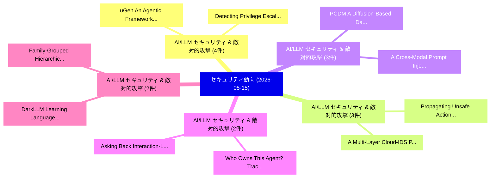

# 📅 02_daily: 日次エグゼクティブサマリー報告書 (2026-05-15)

**集計日時**: 2026-10-02 23:06:10 UTC  
**対象日付**: 2026-05-15  
**本日収集論文数**: 36 件  

---

## 💡 主要セキュリティ動向・脅威インサイト (Executive Insights)

本日の収集論文（計 36 件）において、以下の重点セキュリティ領域で活発な研究動向が確認されました：
- **AI/LLM セキュリティ & 敵対的攻撃** (4 件): 注目論文として 「uGen: An Agentic Framework for...」、「Detecting Privilege Escalation...」 等が発表され、実務防御および攻撃検証の進展が見られます。
- **AI/LLM セキュリティ & 敵対的攻撃** (3 件): 注目論文として 「Propagating Unsafe Actions in ...」、「A Multi-Layer Cloud-IDS Pipeli...」 等が発表され、実務防御および攻撃検証の進展が見られます。
- **AI/LLM セキュリティ & 敵対的攻撃** (3 件): 注目論文として 「A Cross-Modal Prompt Injection...」、「PCDM: A Diffusion-Based Data P...」 等が発表され、実務防御および攻撃検証の進展が見られます。
- **AI/LLM セキュリティ & 敵対的攻撃** (2 件): 注目論文として 「Who Owns This Agent? Tracing A...」、「Asking Back: Interaction-Layer...」 等が発表され、実務防御および攻撃検証の進展が見られます。
- **AI/LLM セキュリティ & 敵対的攻撃** (2 件): 注目論文として 「Family-Grouped Hierarchical Fe...」、「DarkLLM: Learning Language-Dri...」 等が発表され、実務防御および攻撃検証の進展が見られます。

### 🗺️ 技術・脅威トピックマインドマップ

---

## 📌 日次セキュリティ論文一覧 (日本語表形式)

| No | arXiv ID | 論文タイトル (日本語訳) | 重要キーワード | 構造化エグゼクティブ要約 (背景・提案・影響) | 脅威分類 | 詳細リンク |
|---|---|---|---|---|---|---|
| 1 | `2605.15503v1` | [uGen: An Agentic Framework for Generating Microarchitectural Attack PoCs（セキュリティ分析論文）](../../okf/papers/2026-05-15/2605.15503.md) | `Generating Microarchitectural Attack`, `Debopriya Roy Dipta`, `Thore Tiemann` | 【提案】概要 (Overview & Key Finding) 本論文「uGen: An Agentic Framework for Generating Microarchitec...。実証評価により経営層・セキュリティ管理者向け推奨アクション (E... | `arXiv` | [arXiv](https://arxiv.org/abs/2605.15503v1) &#124; [OKF](../../okf/papers/2026-05-15/2605.15503.md) |
| 2 | `2605.15569v1` | [Detecting Privilege Escalation in Polyglot Microservices via Agentic Program Analysis（セキュリティ分析論文）](../../okf/papers/2026-05-15/2605.15569.md) | `Detecting Privilege Escalation`, `Polyglot Microservices`, `Hong Yau Chong` | 【提案】概要 (Overview & Key Finding) 本論文「Detecting 権限昇格 in Polyglot Microservices via Agentic Pr...。実証評価により経営層・セキュリティ管理者向け推奨アクション (E... | `arXiv` | [arXiv](https://arxiv.org/abs/2605.15569v1) &#124; [OKF](../../okf/papers/2026-05-15/2605.15569.md) |
| 3 | `2605.15598v1` | [Compositional Jailbreaking: An Empirical Mutator Chain Interactions in Aligned LLMsの分析](../../okf/papers/2026-05-15/2605.15598.md) | `Compositional Jailbreaking`, `Mutator Chain Interactions`, `Reinelle Jan Bugnot` | 【提案】概要 (Overview & Key Finding) 本論文「Compositional ジェイルブレイクing: An Empirical Mutator Chain I...。実証評価により経営層・セキュリティ管理者向け推奨アクション (E... | `arXiv` | [arXiv](https://arxiv.org/abs/2605.15598v1) &#124; [OKF](../../okf/papers/2026-05-15/2605.15598.md) |
| 4 | `2605.15641v2` | [Propagating Unsafe Actions in LLM Controlled Multi-Robot Collaboration via Single Robot Compromise（セキュリティ分析論文）](../../okf/papers/2026-05-15/2605.15641.md) | `Propagating Unsafe Actions`, `Single Robot Compromise`, `Controlled Multi` | 【提案】概要 (Overview & Key Finding) 本論文「Propagating Unsafe Actions in LLM Controlled Multi-Robo...。実証評価により経営層・セキュリティ管理者向け推奨アクション (E... | `arXiv` | [arXiv](https://arxiv.org/abs/2605.15641v2) &#124; [OKF](../../okf/papers/2026-05-15/2605.15641.md) |
| 5 | `2605.15648v1` | [Rethinking the Security of DP-SGD: A Corrected Differentially Private Machine Learningの分析](../../okf/papers/2026-05-15/2605.15648.md) | `Corrected Differentially Private Machine`, `Differentially Private Machine Learning`, `Differentially Private Machine` | 【提案】概要 (Overview & Key Finding) 本論文「Rethinking the Security of DP-SGD: A Corrected Differen...。実証評価により経営層・セキュリティ管理者向け推奨アクション (E... | `arXiv` | [arXiv](https://arxiv.org/abs/2605.15648v1) &#124; [OKF](../../okf/papers/2026-05-15/2605.15648.md) |
| 6 | `2605.15746v5` | [The Privacy Subsidy: Kyle's $λ$ under Noise-Perturbed Order-Flow Observation（セキュリティ分析論文）](../../okf/papers/2026-05-15/2605.15746.md) | `Perturbed Order`, `Flow Observation`, `Noise-Perturbed Order` | 【提案】概要 (Overview & Key Finding) 本論文「The Privacy Subsidy: Kyle's $λ$ under Noise-Perturbed O...。実証評価により経営層・セキュリティ管理者向け推奨アクション (E... | `arXiv` | [arXiv](https://arxiv.org/abs/2605.15746v5) &#124; [OKF](../../okf/papers/2026-05-15/2605.15746.md) |
| 7 | `2605.15774v1` | [Beyond Controlled Noise: Achieving Symmetric FHE through Dynamic Position Shifting（セキュリティ分析論文）](../../okf/papers/2026-05-15/2605.15774.md) | `Beyond Controlled Noise`, `Dynamic Position Shifting`, `Achieving Symmetric` | 【提案】概要 (Overview & Key Finding) 本論文「Beyond Controlled Noise: Achieving Symmetric FHE throug...。実証評価により経営層・セキュリティ管理者向け推奨アクション (E... | `arXiv` | [arXiv](https://arxiv.org/abs/2605.15774v1) &#124; [OKF](../../okf/papers/2026-05-15/2605.15774.md) |
| 8 | `2605.15804v1` | [Security a Communication Protocol: MQTTの分析](../../okf/papers/2026-05-15/2605.15804.md) | `Communication Protocol`, `Clarisse Sousa`, `Filipe Duarte` | 【提案】概要 (Overview & Key Finding) 本論文「Security a Communication Protocol: MQTTの分析」（原題: Securit...。実証評価により経営層・セキュリティ管理者向け推奨アクション (E... | `arXiv` | [arXiv](https://arxiv.org/abs/2605.15804v1) &#124; [OKF](../../okf/papers/2026-05-15/2605.15804.md) |
| 9 | `2605.15885v1` | [FedEDAuth -- Federated Embedding Distribution Authentication for Counterfeit IC Detection（セキュリティ分析論文）](../../okf/papers/2026-05-15/2605.15885.md) | `Federated Embedding Distribution Authentication`, `Naseeruddin Lodge`, `Dhruva Aklekar` | 【提案】概要 (Overview & Key Finding) 本論文「FedEDAuth -- Federated Embedding Distribution Authentic...。実証評価により経営層・セキュリティ管理者向け推奨アクション (E... | `arXiv` | [arXiv](https://arxiv.org/abs/2605.15885v1) &#124; [OKF](../../okf/papers/2026-05-15/2605.15885.md) |
| 10 | `2605.15889v1` | [A Multi-Layer Cloud-IDS Pipeline with LLM and Adaptive Q-Learning Calibration（セキュリティ分析論文）](../../okf/papers/2026-05-15/2605.15889.md) | `Layer Cloud`, `Learning Calibration`, `Multi-Layer Cloud` | 【提案】概要 (Overview & Key Finding) 本論文「A Multi-Layer Cloud-IDS Pipeline with LLM and Adaptive ...。実証評価により経営層・セキュリティ管理者向け推奨アクション (E... | `arXiv` | [arXiv](https://arxiv.org/abs/2605.15889v1) &#124; [OKF](../../okf/papers/2026-05-15/2605.15889.md) |
| 11 | `2605.15934v1` | [Privacy is Fungibility: Why Endogenous Tokens Are Not Money（セキュリティ分析論文）](../../okf/papers/2026-05-15/2605.15934.md) | `Alex Lynham`, `Geoffrey Goodell`, `Raw Meta` | 【提案】背景とセキュリティ上の課題 (Background & Problem) 本研究はサイバー脅威環境におけるセキュリティ構造・脆弱性の検証を目的としています。(主要検出項目: ...。実証評価により経営層・セキュリティ管理者向け推奨アクション (E... | `arXiv` | [arXiv](https://arxiv.org/abs/2605.15934v1) &#124; [OKF](../../okf/papers/2026-05-15/2605.15934.md) |
| 12 | `2605.15962v1` | [PersonaFingerprint: Measuring Persona Inference on Modern Websites with LLM-Driven Browsing（セキュリティ分析論文）](../../okf/papers/2026-05-15/2605.15962.md) | `Measuring Persona Inference`, `Modern Websites`, `Driven Browsing` | 【提案】概要 (Overview & Key Finding) 本論文「PersonaFingerprint: Measuring Persona Inference on Mode...。実証評価により経営層・セキュリティ管理者向け推奨アクション (E... | `arXiv` | [arXiv](https://arxiv.org/abs/2605.15962v1) &#124; [OKF](../../okf/papers/2026-05-15/2605.15962.md) |
| 13 | `2605.15984v1` | [Beyond Content: A Comprehensive Speech Toxicity Dataset and Detection Framework Incorporating Paralinguistic Cues（セキュリティ分析論文）](../../okf/papers/2026-05-15/2605.15984.md) | `Comprehensive Speech Toxicity Dataset`, `Beyond Content`, `Zhongjie Ba` | 【提案】概要 (Overview & Key Finding) 本論文「Beyond Content: A Comprehensive Speech Toxicity Dataset...。実証評価により経営層・セキュリティ管理者向け推奨アクション (E... | `arXiv` | [arXiv](https://arxiv.org/abs/2605.15984v1) &#124; [OKF](../../okf/papers/2026-05-15/2605.15984.md) |
| 14 | `2605.15991v4` | [Quantum Futures Interactive: A Live Demonstration of Post-Quantum Blockchain Security, Infrastructure Tradeoffs, and Sustainable Distributed Trust（セキュリティ分析論文）](../../okf/papers/2026-05-15/2605.15991.md) | `Quantum Futures Interactive`, `Quantum Blockchain Security`, `Sustainable Distributed Trust` | 【提案】概要 (Overview & Key Finding) 本論文「量子 Futures Interactive: A Live Demonstration of Post-量子...。実証評価により経営層・セキュリティ管理者向け推奨アクション (E... | `arXiv` | [arXiv](https://arxiv.org/abs/2605.15991v4) &#124; [OKF](../../okf/papers/2026-05-15/2605.15991.md) |
| 15 | `2605.16035v1` | [Who Owns This Agent? Tracing AI Agents Back to Their Owners（セキュリティ分析論文）](../../okf/papers/2026-05-15/2605.16035.md) | `Agents Back`, `Doron Jonathan Ben Chayim`, `Ruben Chocron` | 【提案】Tracing AI Agents Back to Their Owners ### (日本語題名: Who Owns This Agent?。実証評価により経営層・セキュリティ管理者向け推奨アクション (Executive Recommenda... | `arXiv` | [arXiv](https://arxiv.org/abs/2605.16035v1) &#124; [OKF](../../okf/papers/2026-05-15/2605.16035.md) |
| 16 | `2605.16090v1` | [A Cross-Modal Prompt Injection Attack against Large Vision-Language Models with Image-Only Perturbation（セキュリティ分析論文）](../../okf/papers/2026-05-15/2605.16090.md) | `Modal Prompt Injection Attack`, `Cross-Modal Prompt`, `Large Vision` | 【提案】概要 (Overview & Key Finding) 本論文「A Cross-Modal プロンプトインジェクション Attack against Large Vision...。実証評価により経営層・セキュリティ管理者向け推奨アクション (E... | `arXiv` | [arXiv](https://arxiv.org/abs/2605.16090v1) &#124; [OKF](../../okf/papers/2026-05-15/2605.16090.md) |
| 17 | `2605.16098v1` | [PCDM: A Diffusion-Based Data Poisoning Attack Against 連合学習 Systems](../../okf/papers/2026-05-15/2605.16098.md) | `Diffusion-Based Data`, `Khaled Ben Letaief`, `Wei Sun` | 【提案】概要 (Overview & Key Finding) 本論文「PCDM: A Diffusion-Based Data Poisoning Attack Against 連...。実証評価により経営層・セキュリティ管理者向け推奨アクション (E... | `arXiv` | [arXiv](https://arxiv.org/abs/2605.16098v1) &#124; [OKF](../../okf/papers/2026-05-15/2605.16098.md) |
| 18 | `2605.16167v1` | [From Backup Restoration to Minimum Viable Factory Recovery: A Systematization of Ransomware Recovery in Manufacturing Systems（セキュリティ分析論文）](../../okf/papers/2026-05-15/2605.16167.md) | `Minimum Viable Factory Recovery`, `Ransomware Recovery`, `Manufacturing Systems` | 【提案】概要 (Overview & Key Finding) 本論文「From Backup Restoration to Minimum Viable Factory Recov...。実証評価により経営層・セキュリティ管理者向け推奨アクション (E... | `arXiv` | [arXiv](https://arxiv.org/abs/2605.16167v1) &#124; [OKF](../../okf/papers/2026-05-15/2605.16167.md) |
| 19 | `2605.16227v1` | [LymphNode: A Plug-and-Play Access Control Method for Deep Neural Networks（セキュリティ分析論文）](../../okf/papers/2026-05-15/2605.16227.md) | `Deep Neural Networks`, `Hanyu Pei`, `Shang Liu` | 【提案】概要 (Overview & Key Finding) 本論文「LymphNode: A Plug-and-Play アクセス制御 Method for Deep Neura...。実証評価により経営層・セキュリティ管理者向け推奨アクション (E... | `arXiv` | [arXiv](https://arxiv.org/abs/2605.16227v1) &#124; [OKF](../../okf/papers/2026-05-15/2605.16227.md) |
| 20 | `2605.16455v1` | [MalwarePT: A Binary-Level Foundation Model for Malware Analysis（セキュリティ分析論文）](../../okf/papers/2026-05-15/2605.16455.md) | `Level Foundation Model`, `Binary-Level Foundation`, `Saastha Vasan` | 【提案】概要 (Overview & Key Finding) 本論文「マルウェアPT: A Binary-Level Foundation Model for マルウェア Anal...。実証評価により経営層・セキュリティ管理者向け推奨アクション (E... | `arXiv` | [arXiv](https://arxiv.org/abs/2605.16455v1) &#124; [OKF](../../okf/papers/2026-05-15/2605.16455.md) |
| 21 | `2605.16462v1` | [Asking Back: Interaction-Layer Antidistillation Watermarks（セキュリティ分析論文）](../../okf/papers/2026-05-15/2605.16462.md) | `Layer Antidistillation Watermarks`, `Asking Back`, `Interaction-Layer Antidistillation` | 【提案】概要 (Overview & Key Finding) 本論文「Asking Back: Interaction-Layer Antidistillation Waterma...。実証評価により経営層・セキュリティ管理者向け推奨アクション (E... | `arXiv` | [arXiv](https://arxiv.org/abs/2605.16462v1) &#124; [OKF](../../okf/papers/2026-05-15/2605.16462.md) |
| 22 | `2605.16471v1` | [From AI-Generated Content to Agentic Action: Security and Safety Threats in Generative AI（セキュリティ分析論文）](../../okf/papers/2026-05-15/2605.16471.md) | `Generated Content`, `Agentic Action`, `AI-Generated Content` | 【提案】概要 (Overview & Key Finding) 本論文「From AI-Generated Content to Agentic Action: Security a...。実証評価により経営層・セキュリティ管理者向け推奨アクション (E... | `arXiv` | [arXiv](https://arxiv.org/abs/2605.16471v1) &#124; [OKF](../../okf/papers/2026-05-15/2605.16471.md) |
| 23 | `2605.16549v1` | [Post-Quantum Discovery as a Governance Capability: Evidence-Based Cryptographic Visibility and Exposure Prioritisation in a Critical Service Provider（セキュリティ分析論文）](../../okf/papers/2026-05-15/2605.16549.md) | `Based Cryptographic Visibility`, `Critical Service Provider`, `Quantum Discovery` | 【提案】概要 (Overview & Key Finding) 本論文「Post-量子 Discovery as a Governance Capability: Evidence-...。実証評価により経営層・セキュリティ管理者向け推奨アクション (E... | `arXiv` | [arXiv](https://arxiv.org/abs/2605.16549v1) &#124; [OKF](../../okf/papers/2026-05-15/2605.16549.md) |
| 24 | `2605.16561v1` | [Compile-time Security Analysis and Optimization of Sensitive String Producers（セキュリティ分析論文）](../../okf/papers/2026-05-15/2605.16561.md) | `Sensitive String Producers`, `Compile-time Security`, `Mike Samuel` | 【提案】概要 (Overview & Key Finding) 本論文「Compile-time Security Analysis and Optimization of Sens...。実証評価により経営層・セキュリティ管理者向け推奨アクション (E... | `arXiv` | [arXiv](https://arxiv.org/abs/2605.16561v1) &#124; [OKF](../../okf/papers/2026-05-15/2605.16561.md) |
| 25 | `2605.16563v1` | [A Method for Securely Transmitting Large Video Files Using Chaotic Compression and Encryption（セキュリティ分析論文）](../../okf/papers/2026-05-15/2605.16563.md) | `Securely Transmitting Large Video Files Using Chaotic Compression`, `Securely Transmitting Large Video Files Using Chaotic Co`, `Shiladitya Bhattacharjee` | 【提案】概要 (Overview & Key Finding) 本論文「A Method for Securely Transmitting Large Video Files Us...。実証評価により経営層・セキュリティ管理者向け推奨アクション (E... | `arXiv` | [arXiv](https://arxiv.org/abs/2605.16563v1) &#124; [OKF](../../okf/papers/2026-05-15/2605.16563.md) |
| 26 | `2605.16589v1` | [STRIKE: A Structured Taxonomy of Cybercrime for Risk, Impact, Knowledge, and Evolution（セキュリティ分析論文）](../../okf/papers/2026-05-15/2605.16589.md) | `Structured Taxonomy`, `Melissa Pappy`, `Linh Nguyen` | 【提案】概要 (Overview & Key Finding) 本論文「STRIKE: A Structured Taxonomy of Cybercrime for Risk, I...。実証評価により経営層・セキュリティ管理者向け推奨アクション (E... | `arXiv` | [arXiv](https://arxiv.org/abs/2605.16589v1) &#124; [OKF](../../okf/papers/2026-05-15/2605.16589.md) |
| 27 | `2605.16626v2` | [SLEIGHT-Bench: A Benchmark of Evasion Attacks Against Agent Monitors（セキュリティ分析論文）](../../okf/papers/2026-05-15/2605.16626.md) | `Elle Najt`, `Colin Toft`, `Tyler Tracy` | 【提案】概要 (Overview & Key Finding) 本論文「SLEIGHT-Bench: A Benchmark of Evasion Attacks Against A...。実証評価により経営層・セキュリティ管理者向け推奨アクション (E... | `arXiv` | [arXiv](https://arxiv.org/abs/2605.16626v2) &#124; [OKF](../../okf/papers/2026-05-15/2605.16626.md) |
| 28 | `2605.16630v2` | [PrivScope: Task-scoped Disclosure Control for Hybrid Agentic Systems（セキュリティ分析論文）](../../okf/papers/2026-05-15/2605.16630.md) | `Hybrid Agentic Systems`, `Disclosure Control`, `Task-scoped Disclosure` | 【提案】概要 (Overview & Key Finding) 本論文「PrivScope: Task-scoped Disclosure Control for Hybrid Ag...。実証評価により経営層・セキュリティ管理者向け推奨アクション (E... | `arXiv` | [arXiv](https://arxiv.org/abs/2605.16630v2) &#124; [OKF](../../okf/papers/2026-05-15/2605.16630.md) |
| 29 | `2605.16647v1` | [Public-Decay Homomorphic State Space Models for Private Sequence Inference（セキュリティ分析論文）](../../okf/papers/2026-05-15/2605.16647.md) | `Decay Homomorphic State Space Models`, `Private Sequence Inference`, `Public-Decay Homomorphic` | 【提案】概要 (Overview & Key Finding) 本論文「Public-Decay Homomorphic State Space Models for Private...。実証評価により経営層・セキュリティ管理者向け推奨アクション (E... | `arXiv` | [arXiv](https://arxiv.org/abs/2605.16647v1) &#124; [OKF](../../okf/papers/2026-05-15/2605.16647.md) |
| 30 | `2605.16656v1` | [Read This Paper to Get $50 Million:* An Mobile Messaging Scams Using Reddit Dataの分析](../../okf/papers/2026-05-15/2605.16656.md) | `Mobile Messaging Scams Using Reddit Data`, `Mobile Messaging Scams Using Reddit Da`, `Allison Lu` | 【提案】概要 (Overview & Key Finding) 本論文「Read This Paper to Get $50 Million:* An Mobile Messagin...。実証評価により経営層・セキュリティ管理者向け推奨アクション (E... | `arXiv` | [arXiv](https://arxiv.org/abs/2605.16656v1) &#124; [OKF](../../okf/papers/2026-05-15/2605.16656.md) |
| 31 | `2605.16678v1` | [Spatially Adaptive Detection for Satellite-based QKD under Atmospheric Turbulence Channel（セキュリティ分析論文）](../../okf/papers/2026-05-15/2605.16678.md) | `Spatially Adaptive Detection`, `Atmospheric Turbulence Channel`, `Satellite-based QKD` | 【提案】概要 (Overview & Key Finding) 本論文「Spatially Adaptive Detection for Satellite-based QKD un...。実証評価により経営層・セキュリティ管理者向け推奨アクション (E... | `arXiv` | [arXiv](https://arxiv.org/abs/2605.16678v1) &#124; [OKF](../../okf/papers/2026-05-15/2605.16678.md) |
| 32 | `2605.16707v2` | [On-Device Interpretable Tsetlin Machine-Based Intrusion Detection for Secure IoMT（セキュリティ分析論文）](../../okf/papers/2026-05-15/2605.16707.md) | `Device Interpretable Tsetlin Machine`, `Based Intrusion Detection`, `On-Device Interpretable` | 【提案】概要 (Overview & Key Finding) 本論文「On-Device Interpretable Tsetlin Machine-Based Intrusion...。実証評価により経営層・セキュリティ管理者向け推奨アクション (E... | `arXiv` | [arXiv](https://arxiv.org/abs/2605.16707v2) &#124; [OKF](../../okf/papers/2026-05-15/2605.16707.md) |
| 33 | `2605.16714v1` | [GRID: Graph Representation of Intelligence Data for Security Text Knowledge Graph Construction（セキュリティ分析論文）](../../okf/papers/2026-05-15/2605.16714.md) | `Security Text Knowledge Graph Construction`, `Graph Representation`, `Intelligence Data` | 【提案】概要 (Overview & Key Finding) 本論文「GRID: Graph Representation of Intelligence Data for Sec...。実証評価により経営層・セキュリティ管理者向け推奨アクション (E... | `arXiv` | [arXiv](https://arxiv.org/abs/2605.16714v1) &#124; [OKF](../../okf/papers/2026-05-15/2605.16714.md) |
| 34 | `2605.18862v1` | [Family-Grouped Hierarchical Federated Learning on Sub-5KB Models: A Feasibility Study of Privacy-Preserving ECG Monitoring for Ultra-Resource-Constrained Wearablesに向けて](../../okf/papers/2026-05-15/2605.18862.md) | `Grouped Hierarchical Federated Learning`, `Family-Grouped Hierarchical`, `Sub-5KB Models` | 【提案】概要 (Overview & Key Finding) 本論文「Family-Grouped Hierarchical Federated Learning on Sub-5...。実証評価により経営層・セキュリティ管理者向け推奨アクション (E... | `arXiv` | [arXiv](https://arxiv.org/abs/2605.18862v1) &#124; [OKF](../../okf/papers/2026-05-15/2605.18862.md) |
| 35 | `2605.18868v1` | [DarkLLM: Learning Language-Driven Adversarial Attacks with 大規模言語モデル](../../okf/papers/2026-05-15/2605.18868.md) | `Driven Adversarial Attacks`, `Learning Language`, `Language-Driven Adversarial` | 【提案】概要 (Overview & Key Finding) 本論文「DarkLLM: Learning Language-Driven 敵対的攻撃s with 大規模言語モデル」...。実証評価により経営層・セキュリティ管理者向け推奨アクション (E... | `arXiv` | [arXiv](https://arxiv.org/abs/2605.18868v1) &#124; [OKF](../../okf/papers/2026-05-15/2605.18868.md) |
| 36 | `2605.18873v1` | [GenAI-FDIA: Physics-Informed Generative Models for False Data Injection Attacks（セキュリティ分析論文）](../../okf/papers/2026-05-15/2605.18873.md) | `False Data Injection Attacks`, `Informed Generative Models`, `Physics-Informed Generative` | 【提案】概要 (Overview & Key Finding) 本論文「GenAI-FDIA: Physics-Informed Generative Models for Fals...。実証評価により経営層・セキュリティ管理者向け推奨アクション (E... | `arXiv` | [arXiv](https://arxiv.org/abs/2605.18873v1) &#124; [OKF](../../okf/papers/2026-05-15/2605.18873.md) |

