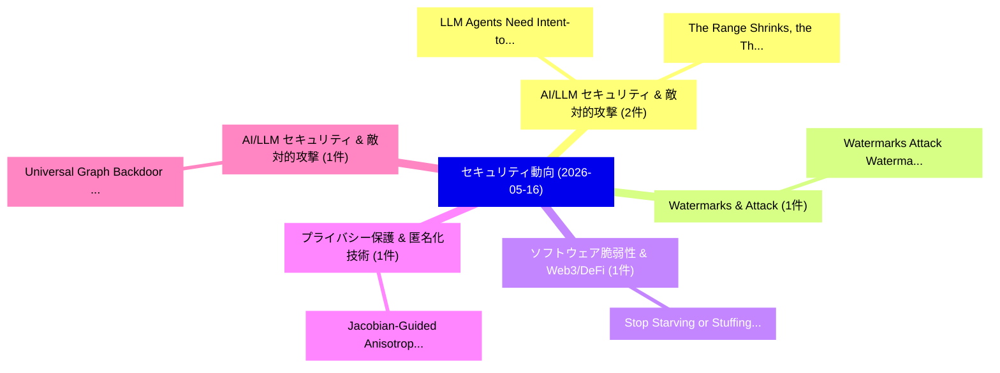

# 📅 02_daily: 日次エグゼクティブサマリー報告書 (2026-05-16)

**集計日時**: 2026-10-02 23:06:10 UTC  
**対象日付**: 2026-05-16  
**本日収集論文数**: 14 件  

---

## 💡 主要セキュリティ動向・脅威インサイト (Executive Insights)

本日の収集論文（計 14 件）において、以下の重点セキュリティ領域で活発な研究動向が確認されました：
- **AI/LLM セキュリティ & 敵対的攻撃** (2 件): 注目論文として 「LLM Agents Need Intent-to-Exec...」、「The Range Shrinks, the Threat ...」 等が発表され、実務防御および攻撃検証の進展が見られます。
- **Watermarks & Attack** (1 件): 注目論文として 「Watermarks Attack Watermarks: ...」 等が発表され、実務防御および攻撃検証の進展が見られます。
- **ソフトウェア脆弱性 & Web3/DeFi** (1 件): 注目論文として 「Stop Starving or Stuffing Me: ...」 等が発表され、実務防御および攻撃検証の進展が見られます。
- **プライバシー保護 & 匿名化技術** (1 件): 注目論文として 「Jacobian-Guided Anisotropic No...」 等が発表され、実務防御および攻撃検証の進展が見られます。
- **AI/LLM セキュリティ & 敵対的攻撃** (1 件): 注目論文として 「Universal Graph Backdoor Defen...」 等が発表され、実務防御および攻撃検証の進展が見られます。

### 🗺️ 技術・脅威トピックマインドマップ

---

## 📌 日次セキュリティ論文一覧 (日本語表形式)

| No | arXiv ID | 論文タイトル (日本語訳) | 重要キーワード | 構造化エグゼクティブ要約 (背景・提案・影響) | 脅威分類 | 詳細リンク |
|---|---|---|---|---|---|---|
| 1 | `2605.16796v1` | [Watermarks Attack Watermarks: Re-Watermarking as a Generic Removal Strategy（セキュリティ分析論文）](../../okf/papers/2026-05-16/2605.16796.md) | `Watermarks Attack Watermarks`, `Generic Removal Strategy`, `Maria Bulychev` | 【提案】概要 (Overview & Key Finding) 本論文「Watermarks Attack Watermarks: Re-Watermarking as a Gene...。実証評価により経営層・セキュリティ管理者向け推奨アクション (E... | `arXiv` | [arXiv](https://arxiv.org/abs/2605.16796v1) &#124; [OKF](../../okf/papers/2026-05-16/2605.16796.md) |
| 2 | `2605.16798v1` | [Stop Starving or Stuffing Me: Boosting Firmware Fuzzing Efficiency with On-demand Input Delivery（セキュリティ分析論文）](../../okf/papers/2026-05-16/2605.16798.md) | `Boosting Firmware Fuzzing Efficiency`, `Stop Starving`, `Input Delivery` | 【提案】概要 (Overview & Key Finding) 本論文「Stop Starving or Stuffing Me: Boosting Firmware Fuzzing...。実証評価により経営層・セキュリティ管理者向け推奨アクション (E... | `arXiv` | [arXiv](https://arxiv.org/abs/2605.16798v1) &#124; [OKF](../../okf/papers/2026-05-16/2605.16798.md) |
| 3 | `2605.16812v3` | [Jacobian-Guided Anisotropic Noise Reshaping for Enhancing Representation Utility under Local Differential Privacy（セキュリティ分析論文）](../../okf/papers/2026-05-16/2605.16812.md) | `Guided Anisotropic Noise Reshaping`, `Enhancing Representation Utility`, `Local Differential Privacy` | 【提案】概要 (Overview & Key Finding) 本論文「Jacobian-Guided Anisotropic Noise Reshaping for Enhanci...。実証評価により経営層・セキュリティ管理者向け推奨アクション (E... | `Privacy & Provenance` | [arXiv](https://arxiv.org/abs/2605.16812v3) &#124; [OKF](../../okf/papers/2026-05-16/2605.16812.md) |
| 4 | `2605.16815v2` | [Universal Graph Backdoor Defense: A Feature-based Homophily Perspective（セキュリティ分析論文）](../../okf/papers/2026-05-16/2605.16815.md) | `Universal Graph Backdoor Defense`, `Homophily Perspective`, `Feature-based Homophily` | 【提案】概要 (Overview & Key Finding) 本論文「Universal Graph Backdoor Defense: A Feature-based Homop...。実証評価により経営層・セキュリティ管理者向け推奨アクション (E... | `arXiv` | [arXiv](https://arxiv.org/abs/2605.16815v2) &#124; [OKF](../../okf/papers/2026-05-16/2605.16815.md) |
| 5 | `2605.16908v1` | [BIDO: A Biometric Identity Online Authentication Framework（セキュリティ分析論文）](../../okf/papers/2026-05-16/2605.16908.md) | `Aditya Mithra`, `Sibi Chakkaravarthy`, `Srinivas Kankanala` | 【提案】概要 (Overview & Key Finding) 本論文「BIDO: A Biometric Identity Online Authentication Framew...。実証評価により経営層・セキュリティ管理者向け推奨アクション (E... | `arXiv` | [arXiv](https://arxiv.org/abs/2605.16908v1) &#124; [OKF](../../okf/papers/2026-05-16/2605.16908.md) |
| 6 | `2605.16912v1` | [A Lightweight QR-assisted Zero-knowledge Identification Protocol For Secure Authentication（セキュリティ分析論文）](../../okf/papers/2026-05-16/2605.16912.md) | `QR-assisted Zero`, `Raw Meta`, `Executive Summary` | 【提案】概要 (Overview & Key Finding) 本論文「A Lightweight QR-assisted Zero-knowledge Identification...。実証評価により経営層・セキュリティ管理者向け推奨アクション (E... | `arXiv` | [arXiv](https://arxiv.org/abs/2605.16912v1) &#124; [OKF](../../okf/papers/2026-05-16/2605.16912.md) |
| 7 | `2605.16976v1` | [LLM Agents Need Intent-to-Execution Integrityのセキュリティ強化](../../okf/papers/2026-05-16/2605.16976.md) | `Agents Need Intent`, `Execution Integrity`, `Wenjie Qu` | 【提案】概要 (Overview & Key Finding) 本論文「LLM Agents Need Intent-to-Execution Integrityのセキュリティ強化」...。実証評価により経営層・セキュリティ管理者向け推奨アクション (E... | `arXiv` | [arXiv](https://arxiv.org/abs/2605.16976v1) &#124; [OKF](../../okf/papers/2026-05-16/2605.16976.md) |
| 8 | `2605.17034v2` | [プライバシーポリシー Enforcement Guardrails for Data-Sensitive Retrieval-Augmented Generation](../../okf/papers/2026-05-16/2605.17034.md) | `Sensitive Retrieval`, `Augmented Generation`, `Data-Sensitive Retrieval` | 【提案】概要 (Overview & Key Finding) 本論文「プライバシーポリシー Enforcement Guardrails for Data-Sensitive Re...。実証評価により経営層・セキュリティ管理者向け推奨アクション (E... | `arXiv` | [arXiv](https://arxiv.org/abs/2605.17034v2) &#124; [OKF](../../okf/papers/2026-05-16/2605.17034.md) |
| 9 | `2605.17061v1` | [quantum-safe: Bridging the Post-Quantum Production Gap with a Hybrid-by-Default Python Cryptography Library（セキュリティ分析論文）](../../okf/papers/2026-05-16/2605.17061.md) | `Default Python Cryptography Library`, `Quantum Production Gap`, `Post-Quantum Production` | 【提案】概要 (Overview & Key Finding) 本論文「量子-safe: Bridging the Post-量子 Production Gap with a Hyb...。実証評価により経営層・セキュリティ管理者向け推奨アクション (E... | `arXiv` | [arXiv](https://arxiv.org/abs/2605.17061v1) &#124; [OKF](../../okf/papers/2026-05-16/2605.17061.md) |
| 10 | `2605.17062v3` | [The Range Shrinks, the Threat Remains: Re-evaluating LLM Package Hallucinations on the 2026 Frontier-Model Cohort（セキュリティ分析論文）](../../okf/papers/2026-05-16/2605.17062.md) | `Threat Remains`, `Re-evaluating LLM`, `Package Hallucinations` | 【提案】概要 (Overview & Key Finding) 本論文「The Range Shrinks, the 脅威 Remains: Re-evaluating LLM Pa...。実証評価により経営層・セキュリティ管理者向け推奨アクション (E... | `arXiv` | [arXiv](https://arxiv.org/abs/2605.17062v3) &#124; [OKF](../../okf/papers/2026-05-16/2605.17062.md) |
| 11 | `2605.17075v1` | [A Red Teaming Framework for Evaluating Robustness of AI-enabled Security Orchestration, Automation, and Response Systems（セキュリティ分析論文）](../../okf/papers/2026-05-16/2605.17075.md) | `Evaluating Robustness`, `Security Orchestration`, `Response Systems` | 【提案】概要 (Overview & Key Finding) 本論文「A Red Teaming Framework for Evaluating Robustness of AI...。実証評価により# A Red Teaming Framework... | `arXiv` | [arXiv](https://arxiv.org/abs/2605.17075v1) &#124; [OKF](../../okf/papers/2026-05-16/2605.17075.md) |
| 12 | `2605.17116v2` | [Simple Power Analysis on Post-Quantum Code Based Cryptosystems（セキュリティ分析論文）](../../okf/papers/2026-05-16/2605.17116.md) | `Quantum Code Based Cryptosystems`, `Post-Quantum Code`, `Konstantinos Spalas` | 【提案】概要 (Overview & Key Finding) 本論文「Simple Power Analysis on Post-量子 Code Based Cryptosyste...。実証評価により経営層・セキュリティ管理者向け推奨アクション (E... | `arXiv` | [arXiv](https://arxiv.org/abs/2605.17116v2) &#124; [OKF](../../okf/papers/2026-05-16/2605.17116.md) |
| 13 | `2605.17128v1` | [New Wide-Net-Casting Jailbreak Attacks Risk Large Models（セキュリティ分析論文）](../../okf/papers/2026-05-16/2605.17128.md) | `Casting Jailbreak Attacks Risk Large Models`, `New Wide`, `Qiuchi Xiang` | 【提案】概要 (Overview & Key Finding) 本論文「New Wide-Net-Casting ジェイルブレイク Attacks Risk Large Models...。実証評価により経営層・セキュリティ管理者向け推奨アクション (E... | `arXiv` | [arXiv](https://arxiv.org/abs/2605.17128v1) &#124; [OKF](../../okf/papers/2026-05-16/2605.17128.md) |
| 14 | `2605.17163v1` | [STRIDE-AI: A Threat Modeling Framework for Generative AI Security Assessment（セキュリティ分析論文）](../../okf/papers/2026-05-16/2605.17163.md) | `Security Assessment`, `Tsafac Nkombong Regine Cyrille`, `Franziska Schwarz` | 【提案】概要 (Overview & Key Finding) 本論文「STRIDE-AI: A 脅威 Modeling Framework for Generative AI Se...。実証評価により経営層・セキュリティ管理者向け推奨アクション (E... | `arXiv` | [arXiv](https://arxiv.org/abs/2605.17163v1) &#124; [OKF](../../okf/papers/2026-05-16/2605.17163.md) |

