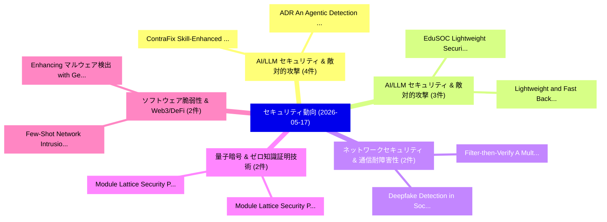

# 📅 02_daily: 日次エグゼクティブサマリー報告書 (2026-05-17)

**集計日時**: 2026-10-02 23:06:10 UTC  
**対象日付**: 2026-05-17  
**本日収集論文数**: 29 件  

---

## 💡 主要セキュリティ動向・脅威インサイト (Executive Insights)

本日の収集論文（計 29 件）において、以下の重点セキュリティ領域で活発な研究動向が確認されました：
- **AI/LLM セキュリティ & 敵対的攻撃** (4 件): 注目論文として 「ADR: An Agentic Detection Syst...」、「ContraFix: Skill-Enhanced Cont...」 等が発表され、実務防御および攻撃検証の進展が見られます。
- **AI/LLM セキュリティ & 敵対的攻撃** (3 件): 注目論文として 「EduSOC: Lightweight Security O...」、「Lightweight and Fast Backdoor ...」 等が発表され、実務防御および攻撃検証の進展が見られます。
- **ネットワークセキュリティ & 通信耐障害性** (2 件): 注目論文として 「Filter-then-Verify: A Multipha...」、「Deepfake Detection in Social M...」 等が発表され、実務防御および攻撃検証の進展が見られます。
- **量子暗号 & ゼロ知識証明技術** (2 件): 注目論文として 「Module Lattice Security (Part ...」、「Module Lattice Security (Part ...」 等が発表され、実務防御および攻撃検証の進展が見られます。
- **ソフトウェア脆弱性 & Web3/DeFi** (2 件): 注目論文として 「Few-Shot Network Intrusion Det...」、「Enhancing マルウェア検出 with Generat...」 等が発表され、実務防御および攻撃検証の進展が見られます。

### 🗺️ 技術・脅威トピックマインドマップ

---

## 📌 日次セキュリティ論文一覧 (日本語表形式)

| No | arXiv ID | 論文タイトル (日本語訳) | 重要キーワード | 構造化エグゼクティブ要約 (背景・提案・影響) | 脅威分類 | 詳細リンク |
|---|---|---|---|---|---|---|
| 1 | `2605.17201v1` | [Filter-then-Verify: A Multiphase GNN and ModernBERT Framework for Social Engineering Detection in Email Networks（セキュリティ分析論文）](../../okf/papers/2026-05-17/2605.17201.md) | `Social Engineering Detection`, `Email Networks`, `Barsat Khadka` | 【提案】概要 (Overview & Key Finding) 本論文「Filter-then-Verify: A Multiphase GNN and ModernBERT Fra...。実証評価により経営層・セキュリティ管理者向け推奨アクション (E... | `arXiv` | [arXiv](https://arxiv.org/abs/2605.17201v1) &#124; [OKF](../../okf/papers/2026-05-17/2605.17201.md) |
| 2 | `2605.17219v1` | [Integration of AI in サイバーセキュリティ: Current Trends with a Focused Look at Intrusion Detection Applications](../../okf/papers/2026-05-17/2605.17219.md) | `Intrusion Detection Applications`, `Current Trends`, `Focused Look` | 【提案】概要 (Overview & Key Finding) 本論文「Integration of AI in サイバーセキュリティ: Current Trends with a ...。実証評価により経営層・セキュリティ管理者向け推奨アクション (E... | `arXiv` | [arXiv](https://arxiv.org/abs/2605.17219v1) &#124; [OKF](../../okf/papers/2026-05-17/2605.17219.md) |
| 3 | `2605.17222v2` | [Triple-Hoisted Baby-Step Giant-Step Linear Transformation over CKKS Homomorphic Encryption and Hardware Accelerator（セキュリティ分析論文）](../../okf/papers/2026-05-17/2605.17222.md) | `Step Linear Transformation`, `Hoisted Baby`, `Step Giant` | 【提案】概要 (Overview & Key Finding) 本論文「Triple-Hoisted Baby-Step Giant-Step Linear Transformati...。実証評価により経営層・セキュリティ管理者向け推奨アクション (E... | `arXiv` | [arXiv](https://arxiv.org/abs/2605.17222v2) &#124; [OKF](../../okf/papers/2026-05-17/2605.17222.md) |
| 4 | `2605.17288v1` | [When Efficiency Backfires: Cascading LLMs Trigger Cascade Failure under Adversarial Attack（セキュリティ分析論文）](../../okf/papers/2026-05-17/2605.17288.md) | `Trigger Cascade Failure`, `Adversarial Attack`, `Trigger Cascade Failu` | 【提案】概要 (Overview & Key Finding) 本論文「When Efficiency Backfires: Cascading LLMs Trigger Casca...。実証評価により経営層・セキュリティ管理者向け推奨アクション (E... | `arXiv` | [arXiv](https://arxiv.org/abs/2605.17288v1) &#124; [OKF](../../okf/papers/2026-05-17/2605.17288.md) |
| 5 | `2605.17324v1` | [ASPI: Seeking Ambiguity Clarification Amplifies Prompt Injection Vulnerability in LLMエージェント](../../okf/papers/2026-05-17/2605.17324.md) | `Seeking Ambiguity Clarification Amplifies Prompt Injection Vulnerability`, `Udari Madhushani Sehwag`, `Zhengyang Shan` | 【提案】概要 (Overview & Key Finding) 本論文「ASPI: Seeking Ambiguity Clarification Amplifies プロンプトイン...。実証評価により経営層・セキュリティ管理者向け推奨アクション (E... | `arXiv` | [arXiv](https://arxiv.org/abs/2605.17324v1) &#124; [OKF](../../okf/papers/2026-05-17/2605.17324.md) |
| 6 | `2605.17325v1` | [Federated Stream-Processing and Latency-Gated Response for Cross-Sector Threat Detection and Collaborative Containment（セキュリティ分析論文）](../../okf/papers/2026-05-17/2605.17325.md) | `Sector Threat Detection`, `Federated Stream`, `Gated Response` | 【提案】概要 (Overview & Key Finding) 本論文「Federated Stream-Processing and Latency-Gated Response ...。実証評価により経営層・セキュリティ管理者向け推奨アクション (E... | `arXiv` | [arXiv](https://arxiv.org/abs/2605.17325v1) &#124; [OKF](../../okf/papers/2026-05-17/2605.17325.md) |
| 7 | `2605.17329v1` | [LPG: Balancing Efficiency and Policy Reasoning in Latent Policy Guardrails（セキュリティ分析論文）](../../okf/papers/2026-05-17/2605.17329.md) | `Latent Policy Guardrails`, `Balancing Efficiency`, `Policy Reasoning` | 【提案】概要 (Overview & Key Finding) 本論文「LPG: Balancing Efficiency and Policy Reasoning in Laten...。実証評価により経営層・セキュリティ管理者向け推奨アクション (E... | `arXiv` | [arXiv](https://arxiv.org/abs/2605.17329v1) &#124; [OKF](../../okf/papers/2026-05-17/2605.17329.md) |
| 8 | `2605.17358v1` | [Loaded Dice: Solving the Non-Selection Problem for Scalable Probabilistic RowHammer Defense（セキュリティ分析論文）](../../okf/papers/2026-05-17/2605.17358.md) | `Loaded Dice`, `Selection Problem`, `Scalable Probabilistic` | 【提案】概要 (Overview & Key Finding) 本論文「Loaded Dice: Solving the Non-Selection Problem for Scal...。実証評価により経営層・セキュリティ管理者向け推奨アクション (E... | `arXiv` | [arXiv](https://arxiv.org/abs/2605.17358v1) &#124; [OKF](../../okf/papers/2026-05-17/2605.17358.md) |
| 9 | `2605.17380v1` | [ADR: An Agentic Detection System for Enterprise Agentic AI Security（セキュリティ分析論文）](../../okf/papers/2026-05-17/2605.17380.md) | `Enterprise Agentic`, `Chenning Li`, `Pan Hu` | 【提案】概要 (Overview & Key Finding) 本論文「ADR: An Agentic Detection System for Enterprise Agentic...。実証評価により経営層・セキュリティ管理者向け推奨アクション (E... | `arXiv` | [arXiv](https://arxiv.org/abs/2605.17380v1) &#124; [OKF](../../okf/papers/2026-05-17/2605.17380.md) |
| 10 | `2605.17404v1` | [Module Lattice Security (Part III): Structured CVP Distance on the Log-Unit Lattice（セキュリティ分析論文）](../../okf/papers/2026-05-17/2605.17404.md) | `Module Lattice Security`, `Unit Lattice`, `Log-Unit Lattice` | 【提案】概要 (Overview & Key Finding) 本論文「Module Lattice Security (Part III): Structured CVP Dist...。実証評価により経営層・セキュリティ管理者向け推奨アクション (E... | `math.ST` | [arXiv](https://arxiv.org/abs/2605.17404v1) &#124; [OKF](../../okf/papers/2026-05-17/2605.17404.md) |
| 11 | `2605.17406v1` | [Rethinking Side-Channel Analysis: Automated Discovery and Side-Channel Leakage with LLM-Assisted Agentsの分析](../../okf/papers/2026-05-17/2605.17406.md) | `Rethinking Side`, `Automated Discovery`, `Channel Leakage` | 【提案】概要 (Overview & Key Finding) 本論文「Rethinking サイドチャネル攻撃 Analysis: Automated Discovery and ...。実証評価により経営層・セキュリティ管理者向け推奨アクション (E... | `arXiv` | [arXiv](https://arxiv.org/abs/2605.17406v1) &#124; [OKF](../../okf/papers/2026-05-17/2605.17406.md) |
| 12 | `2605.17412v2` | [Module Lattice Security (Part IV): Probabilistic Polynomial Quantum Attack on Module-LWE over 2-Power Cyclotomics（セキュリティ分析論文）](../../okf/papers/2026-05-17/2605.17412.md) | `Module Lattice Security`, `Probabilistic Polynomial Quantum Attack`, `Power Cyclotomics` | 【提案】概要 (Overview & Key Finding) 本論文「Module Lattice Security (Part IV): Probabilistic Polyno...。実証評価により経営層・セキュリティ管理者向け推奨アクション (E... | `arXiv` | [arXiv](https://arxiv.org/abs/2605.17412v2) &#124; [OKF](../../okf/papers/2026-05-17/2605.17412.md) |
| 13 | `2605.17413v1` | [Ablating Safety: Mechanisms for Removing Alignment in Language Models for Security Applications（セキュリティ分析論文）](../../okf/papers/2026-05-17/2605.17413.md) | `Ablating Safety`, `Removing Alignment`, `Language Models` | 【提案】概要 (Overview & Key Finding) 本論文「Ablating Safety: Mechanisms for Removing Alignment in L...。実証評価により経営層・セキュリティ管理者向け推奨アクション (E... | `arXiv` | [arXiv](https://arxiv.org/abs/2605.17413v1) &#124; [OKF](../../okf/papers/2026-05-17/2605.17413.md) |
| 14 | `2605.17432v1` | [DP-SelFT: Differentially Private Selective Fine-Tuning for 大規模言語モデル](../../okf/papers/2026-05-17/2605.17432.md) | `Differentially Private Selective Fine`, `Large Language Models`, `Haichao Sha` | 【提案】概要 (Overview & Key Finding) 本論文「DP-SelFT: Differentially Private Selective Fine-Tuning ...。実証評価により経営層・セキュリティ管理者向け推奨アクション (E... | `arXiv` | [arXiv](https://arxiv.org/abs/2605.17432v1) &#124; [OKF](../../okf/papers/2026-05-17/2605.17432.md) |
| 15 | `2605.17450v2` | [ContraFix: Skill-Enhanced Contrastive Runtime Analysis for Vulnerability Repair（セキュリティ分析論文）](../../okf/papers/2026-05-17/2605.17450.md) | `Vulnerability Repair`, `Skill-Enhanced Contrastive`, `Simiao Liu` | 【提案】概要 (Overview & Key Finding) 本論文「ContraFix: Skill-Enhanced Contrastive Runtime Analysis ...。実証評価により経営層・セキュリティ管理者向け推奨アクション (E... | `arXiv` | [arXiv](https://arxiv.org/abs/2605.17450v2) &#124; [OKF](../../okf/papers/2026-05-17/2605.17450.md) |
| 16 | `2605.17453v1` | [Trust No Tool: Evaluating and Defending LLMエージェント under Untrusted Tool Feedback](../../okf/papers/2026-05-17/2605.17453.md) | `Untrusted Tool Feedback`, `Untrusted Tool Fee`, `Lecheng Yan` | 【提案】概要 (Overview & Key Finding) 本論文「Trust No Tool: Evaluating and Defending LLMエージェント under...。実証評価により経営層・セキュリティ管理者向け推奨アクション (E... | `arXiv` | [arXiv](https://arxiv.org/abs/2605.17453v1) &#124; [OKF](../../okf/papers/2026-05-17/2605.17453.md) |
| 17 | `2605.17505v1` | [Explicit cost Toom-4 multiplication for incomplete NTT in lattice-based cryptographyの分析](../../okf/papers/2026-05-17/2605.17505.md) | `Toom-4 multiplication`, `lattice-based cryptography`, `Sakura Oku` | 【提案】概要 (Overview & Key Finding) 本論文「Explicit cost Toom-4 multiplication for incomplete NTT ...。実証評価により経営層・セキュリティ管理者向け推奨アクション (E... | `arXiv` | [arXiv](https://arxiv.org/abs/2605.17505v1) &#124; [OKF](../../okf/papers/2026-05-17/2605.17505.md) |
| 18 | `2605.17530v1` | [Few-Shot Network Intrusion Detection Using Online Triplet Mining（セキュリティ分析論文）](../../okf/papers/2026-05-17/2605.17530.md) | `Shot Network Intrusion Detection Using Online Triplet Mining`, `Few-Shot Network`, `Jack Wilkie` | 【提案】概要 (Overview & Key Finding) 本論文「Few-Shot Network Intrusion Detection Using Online Tripl...。実証評価により経営層・セキュリティ管理者向け推奨アクション (E... | `arXiv` | [arXiv](https://arxiv.org/abs/2605.17530v1) &#124; [OKF](../../okf/papers/2026-05-17/2605.17530.md) |
| 19 | `2605.17573v1` | [Deepfake Detection in Social Media: A Temporal Artifact Analysis Using 3D Convolutional Neural Networks（セキュリティ分析論文）](../../okf/papers/2026-05-17/2605.17573.md) | `Convolutional Neural Networks`, `Deepfake Detection`, `Social Media` | 【提案】概要 (Overview & Key Finding) 本論文「Deepfake Detection in Social Media: A Temporal Artifact...。実証評価により経営層・セキュリティ管理者向け推奨アクション (E... | `arXiv` | [arXiv](https://arxiv.org/abs/2605.17573v1) &#124; [OKF](../../okf/papers/2026-05-17/2605.17573.md) |
| 20 | `2605.17634v1` | [AI Agents May Always Fall for Prompt Injections（セキュリティ分析論文）](../../okf/papers/2026-05-17/2605.17634.md) | `Agents May Always Fall`, `Prompt Injections`, `Sahar Abdelnabi` | 【提案】概要 (Overview & Key Finding) 本論文「AI Agents May Always Fall for プロンプトインジェクションs（セキュリティ分析論文...。実証評価により経営層・セキュリティ管理者向け推奨アクション (E... | `arXiv` | [arXiv](https://arxiv.org/abs/2605.17634v1) &#124; [OKF](../../okf/papers/2026-05-17/2605.17634.md) |
| 21 | `2605.17685v1` | [Attention-Guided Fusion of 1D and 2D CNNs for Robust ECG-Based Biometric Recognition（セキュリティ分析論文）](../../okf/papers/2026-05-17/2605.17685.md) | `Based Biometric Recognition`, `Guided Fusion`, `Attention-Guided Fusion` | 【提案】概要 (Overview & Key Finding) 本論文「Attention-Guided Fusion of 1D and 2D CNNs for Robust EC...。実証評価により経営層・セキュリティ管理者向け推奨アクション (E... | `arXiv` | [arXiv](https://arxiv.org/abs/2605.17685v1) &#124; [OKF](../../okf/papers/2026-05-17/2605.17685.md) |
| 22 | `2605.17703v2` | [EduSOC: Lightweight Security Operations Center Simulator for サイバーセキュリティ Education](../../okf/papers/2026-05-17/2605.17703.md) | `Lightweight Security Operations Center Simulator`, `Cybersecurity Education`, `Martin Higgins` | 【提案】概要 (Overview & Key Finding) 本論文「EduSOC: Lightweight Security Operations Center Simulato...。実証評価により経営層・セキュリティ管理者向け推奨アクション (E... | `arXiv` | [arXiv](https://arxiv.org/abs/2605.17703v2) &#124; [OKF](../../okf/papers/2026-05-17/2605.17703.md) |
| 23 | `2605.18901v2` | [Zero Trust Architecture: A Pilot Study on Information Systems Security Readiness amongst Small and Medium Enterprisesに向けて](../../okf/papers/2026-05-17/2605.18901.md) | `Information Systems Security Readiness`, `Zero Trust Architecture`, `Towards Zero Trust Architecture` | 【提案】概要 (Overview & Key Finding) 本論文「ゼロトラスト Architecture: A Pilot Study on Information Syste...。実証評価により経営層・セキュリティ管理者向け推奨アクション (E... | `arXiv` | [arXiv](https://arxiv.org/abs/2605.18901v2) &#124; [OKF](../../okf/papers/2026-05-17/2605.18901.md) |
| 24 | `2605.18907v1` | [Lightweight and Fast Backdoor Model Detection（セキュリティ分析論文）](../../okf/papers/2026-05-17/2605.18907.md) | `Fast Backdoor Model Detection`, `Yinbo Yu`, `Jing Fang` | 【提案】概要 (Overview & Key Finding) 本論文「Lightweight and Fast Backdoor Model Detection（セキュリティ分析論...。実証評価により経営層・セキュリティ管理者向け推奨アクション (E... | `arXiv` | [arXiv](https://arxiv.org/abs/2605.18907v1) &#124; [OKF](../../okf/papers/2026-05-17/2605.18907.md) |
| 25 | `2605.18908v1` | [Fast and Lightweight Backdoor Detection via Head Random Probing（セキュリティ分析論文）](../../okf/papers/2026-05-17/2605.18908.md) | `Lightweight Backdoor Detection`, `Head Random Probing`, `Yinbo Yu` | 【提案】概要 (Overview & Key Finding) 本論文「Fast and Lightweight Backdoor Detection via Head Random...。実証評価により経営層・セキュリティ管理者向け推奨アクション (E... | `arXiv` | [arXiv](https://arxiv.org/abs/2605.18908v1) &#124; [OKF](../../okf/papers/2026-05-17/2605.18908.md) |
| 26 | `2605.18913v1` | [SCAFDS: Edge-Feature Graph Attention for Interbank Fraud Detection with Attribution-Grounded SAR Generation（セキュリティ分析論文）](../../okf/papers/2026-05-17/2605.18913.md) | `Feature Graph Attention`, `Interbank Fraud Detection`, `Edge-Feature Graph` | 【提案】概要 (Overview & Key Finding) 本論文「SCAFDS: Edge-Feature Graph Attention for Interbank Frau...。実証評価により経営層・セキュリティ管理者向け推奨アクション (E... | `arXiv` | [arXiv](https://arxiv.org/abs/2605.18913v1) &#124; [OKF](../../okf/papers/2026-05-17/2605.18913.md) |
| 27 | `2605.23989v1` | [trustworthy agentic AI: a comprehensive survey of safety, robustness, privacy, and system securityに向けて](../../okf/papers/2026-05-17/2605.23989.md) | `Jinhu Qi`, `Muzhi Li`, `Jiahong Liu` | 【提案】概要 (Overview & Key Finding) 本論文「trustworthy agentic AI: a comprehensive survey of safet...。実証評価により経営層・セキュリティ管理者向け推奨アクション (E... | `arXiv` | [arXiv](https://arxiv.org/abs/2605.23989v1) &#124; [OKF](../../okf/papers/2026-05-17/2605.23989.md) |
| 28 | `2606.06501v1` | [Enhancing マルウェア検出 with Generative AI: Using Variational Autoencoders to Boost Machine Learning Classifiers' Performance](../../okf/papers/2026-05-17/2606.06501.md) | `Boost Machine Learning Classifiers`, `Using Variational Autoencoders`, `Enhancing Malware Detection` | 【提案】概要 (Overview & Key Finding) 本論文「Enhancing マルウェア検出 with Generative AI: Using Variational...。実証評価により経営層・セキュリティ管理者向け推奨アクション (E... | `arXiv` | [arXiv](https://arxiv.org/abs/2606.06501v1) &#124; [OKF](../../okf/papers/2026-05-17/2606.06501.md) |
| 29 | `2608.16891v1` | [Runtime Governance for Agentic AI: Action-Boundary Control with Trusted Provenance and Fail-Closed Execution（セキュリティ分析論文）](../../okf/papers/2026-05-17/2608.16891.md) | `Runtime Governance`, `Boundary Control`, `Trusted Provenance` | 【提案】概要 (Overview & Key Finding) 本論文「Runtime Governance for Agentic AI: Action-Boundary Cont...。実証評価により経営層・セキュリティ管理者向け推奨アクション (E... | `AI/ML Security` | [arXiv](https://arxiv.org/abs/2608.16891v1) &#124; [OKF](../../okf/papers/2026-05-17/2608.16891.md) |

