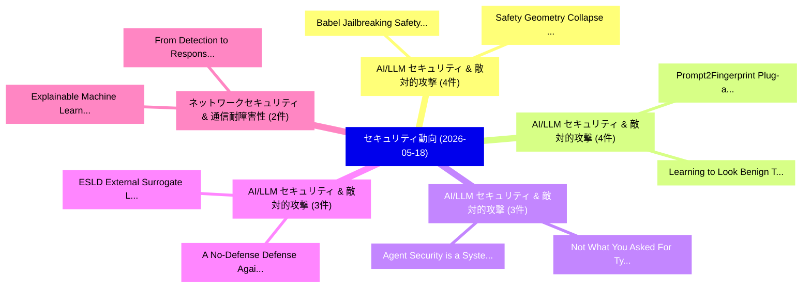

# 📅 02_daily: 日次エグゼクティブサマリー報告書 (2026-05-18)

**集計日時**: 2026-10-02 23:06:10 UTC  
**対象日付**: 2026-05-18  
**本日収集論文数**: 37 件  

---

## 💡 主要セキュリティ動向・脅威インサイト (Executive Insights)

本日の収集論文（計 37 件）において、以下の重点セキュリティ領域で活発な研究動向が確認されました：
- **AI/LLM セキュリティ & 敵対的攻撃** (4 件): 注目論文として 「Babel: Jailbreaking Safety Att...」、「Safety Geometry Collapse in Mu...」 等が発表され、実務防御および攻撃検証の進展が見られます。
- **AI/LLM セキュリティ & 敵対的攻撃** (4 件): 注目論文として 「Prompt2Fingerprint: Plug-and-P...」、「Learning to Look Benign: Targe...」 等が発表され、実務防御および攻撃検証の進展が見られます。
- **AI/LLM セキュリティ & 敵対的攻撃** (3 件): 注目論文として 「Not What You Asked For: Typogr...」、「Agent Security is a Systems Pr...」 等が発表され、実務防御および攻撃検証の進展が見られます。
- **AI/LLM セキュリティ & 敵対的攻撃** (3 件): 注目論文として 「A No-Defense Defense Against G...」、「ESLD (External Surrogate Laten...」 等が発表され、実務防御および攻撃検証の進展が見られます。
- **ネットワークセキュリティ & 通信耐障害性** (2 件): 注目論文として 「Explainable Machine Learning f...」、「From Detection to Response: A ...」 等が発表され、実務防御および攻撃検証の進展が見られます。

### 🗺️ 技術・脅威トピックマインドマップ

---

## 📌 日次セキュリティ論文一覧 (日本語表形式)

| No | arXiv ID | 論文タイトル (日本語訳) | 重要キーワード | 構造化エグゼクティブ要約 (背景・提案・影響) | 脅威分類 | 詳細リンク |
|---|---|---|---|---|---|---|
| 1 | `2605.17707v1` | [Speed Kills: Exploring Confused Deputy Attacks Through Edge AI Accelerators（セキュリティ分析論文）](../../okf/papers/2026-05-18/2605.17707.md) | `Speed Kills`, `Datta Manikanta Sri Hari Danduri`, `Aravind Kumar Machiry` | 【提案】概要 (Overview & Key Finding) 本論文「Speed Kills: Exploring Confused Deputy Attacks Through ...。実証評価により経営層・セキュリティ管理者向け推奨アクション (E... | `arXiv` | [arXiv](https://arxiv.org/abs/2605.17707v1) &#124; [OKF](../../okf/papers/2026-05-18/2605.17707.md) |
| 2 | `2605.17891v1` | [Explainable Machine Learning for Phishing Detection on Heterogeneous Datasets with MCP-Enabled Deployment（セキュリティ分析論文）](../../okf/papers/2026-05-18/2605.17891.md) | `Explainable Machine Learning`, `Phishing Detection`, `Heterogeneous Datasets` | 【提案】概要 (Overview & Key Finding) 本論文「Explainable Machine Learning for Phishing Detection on ...。実証評価により経営層・セキュリティ管理者向け推奨アクション (E... | `arXiv` | [arXiv](https://arxiv.org/abs/2605.17891v1) &#124; [OKF](../../okf/papers/2026-05-18/2605.17891.md) |
| 3 | `2605.17955v1` | [Operationalising Post Quantum TLS Automated Configuration Profiling and Hybrid PQC Deployment in Financial Infrastructure（セキュリティ分析論文）](../../okf/papers/2026-05-18/2605.17955.md) | `Operationalising Post Quantum`, `Automated Configuration Profiling`, `Financial Infrastructure` | 【提案】概要 (Overview & Key Finding) 本論文「Operationalising Post 量子 TLS Automated Configuration Pr...。実証評価により経営層・セキュリティ管理者向け推奨アクション (E... | `arXiv` | [arXiv](https://arxiv.org/abs/2605.17955v1) &#124; [OKF](../../okf/papers/2026-05-18/2605.17955.md) |
| 4 | `2605.17960v1` | [From Detection to Response: A Deep Learning and Retrieval-Augmented Generation Framework for Network Intrusion Mitigation（セキュリティ分析論文）](../../okf/papers/2026-05-18/2605.17960.md) | `Network Intrusion Mitigation`, `Deep Learning`, `Retrieval-Augmented Generation` | 【提案】概要 (Overview & Key Finding) 本論文「From Detection to Response: A Deep Learning and Retriev...。実証評価により経営層・セキュリティ管理者向け推奨アクション (E... | `arXiv` | [arXiv](https://arxiv.org/abs/2605.17960v1) &#124; [OKF](../../okf/papers/2026-05-18/2605.17960.md) |
| 5 | `2605.17971v1` | [Babel: Jailbreaking Safety Attention via Obfuscation Distribution Optimized Sampling（セキュリティ分析論文）](../../okf/papers/2026-05-18/2605.17971.md) | `Obfuscation Distribution Optimized Sampling`, `Jailbreaking Safety Attention`, `Ziwei Wang` | 【提案】概要 (Overview & Key Finding) 本論文「Babel: ジェイルブレイクing Safety Attention via Obfuscation Dis...。実証評価により経営層・セキュリティ管理者向け推奨アクション (E... | `arXiv` | [arXiv](https://arxiv.org/abs/2605.17971v1) &#124; [OKF](../../okf/papers/2026-05-18/2605.17971.md) |
| 6 | `2605.17986v3` | [LivePI: More Realistic of Agents Against Indirect Prompt Injectionのベンチマーク評価](../../okf/papers/2026-05-18/2605.17986.md) | `Lei Zhao`, `Abhay Bhaskar`, `Edgar Dobriban` | 【提案】概要 (Overview & Key Finding) 本論文「LivePI: More Realistic of Agents Against Indirect プロンプト...。実証評価により経営層・セキュリティ管理者向け推奨アクション (E... | `arXiv` | [arXiv](https://arxiv.org/abs/2605.17986v3) &#124; [OKF](../../okf/papers/2026-05-18/2605.17986.md) |
| 7 | `2605.18053v1` | [Protection Is (Nearly) All You Need: Structural Protection Dominates Scoring in Globally Capped KV Eviction（セキュリティ分析論文）](../../okf/papers/2026-05-18/2605.18053.md) | `Structural Protection Dominates Scoring`, `Globally Capped`, `Gabriel Garcia` | 【提案】概要 (Overview & Key Finding) 本論文「Protection Is (Nearly) All You Need: Structural Protect...。実証評価により経営層・セキュリティ管理者向け推奨アクション (E... | `arXiv` | [arXiv](https://arxiv.org/abs/2605.18053v1) &#124; [OKF](../../okf/papers/2026-05-18/2605.18053.md) |
| 8 | `2605.18104v1` | [Safety Geometry Collapse in Multimodal LLMs and Adaptive Drift Correction（セキュリティ分析論文）](../../okf/papers/2026-05-18/2605.18104.md) | `Safety Geometry Collapse`, `Adaptive Drift Correction`, `Jiahe Guo` | 【提案】概要 (Overview & Key Finding) 本論文「Safety Geometry Collapse in Multimodal LLMs and Adaptiv...。実証評価により経営層・セキュリティ管理者向け推奨アクション (E... | `arXiv` | [arXiv](https://arxiv.org/abs/2605.18104v1) &#124; [OKF](../../okf/papers/2026-05-18/2605.18104.md) |
| 9 | `2605.18133v1` | [Privacy Leakage Chains via Prompt Injection in Black-Box Chatbot Environmentsの実証研究](../../okf/papers/2026-05-18/2605.18133.md) | `Privacy Leakage Chains`, `Prompt Injection`, `Black-Box Chatbot` | 【提案】概要 (Overview & Key Finding) 本論文「Privacy Leakage Chains via プロンプトインジェクション in Black-Box C...。実証評価により経営層・セキュリティ管理者向け推奨アクション (E... | `arXiv` | [arXiv](https://arxiv.org/abs/2605.18133v1) &#124; [OKF](../../okf/papers/2026-05-18/2605.18133.md) |
| 10 | `2605.18146v3` | [DARTIC: Decentralized Anonymous Reputation at Scale for Trustworthy Crowdsourcing（セキュリティ分析論文）](../../okf/papers/2026-05-18/2605.18146.md) | `Decentralized Anonymous Reputation`, `Trustworthy Crowdsourcing`, `Mouhamed Amine Bouchiha` | 【提案】概要 (Overview & Key Finding) 本論文「DARTIC: Decentralized Anonymous Reputation at Scale for...。実証評価により経営層・セキュリティ管理者向け推奨アクション (E... | `arXiv` | [arXiv](https://arxiv.org/abs/2605.18146v3) &#124; [OKF](../../okf/papers/2026-05-18/2605.18146.md) |
| 11 | `2605.18168v1` | [Acoustic Interference: A New Paradigm Weaponizing Acoustic Latent Semantic for Universal Jailbreak against Large Audio Language Models（セキュリティ分析論文）](../../okf/papers/2026-05-18/2605.18168.md) | `New Paradigm Weaponizing Acoustic Latent Semantic`, `Large Audio Language Models`, `Acoustic Interference` | 【提案】概要 (Overview & Key Finding) 本論文「Acoustic Interference: A New Paradigm Weaponizing Acous...。実証評価により経営層・セキュリティ管理者向け推奨アクション (E... | `arXiv` | [arXiv](https://arxiv.org/abs/2605.18168v1) &#124; [OKF](../../okf/papers/2026-05-18/2605.18168.md) |
| 12 | `2605.18414v2` | [Prompts Don't Protect: Architectural Enforcement via MCP Proxy for LLM Tool Access Control（セキュリティ分析論文）](../../okf/papers/2026-05-18/2605.18414.md) | `Tool Access Control`, `Prompts Don`, `Architectural Enforcement` | 【提案】概要 (Overview & Key Finding) 本論文「Prompts Don't Protect: Architectural Enforcement via MC...。実証評価により経営層・セキュリティ管理者向け推奨アクション (E... | `arXiv` | [arXiv](https://arxiv.org/abs/2605.18414v2) &#124; [OKF](../../okf/papers/2026-05-18/2605.18414.md) |
| 13 | `2605.18474v2` | [Prompt2Fingerprint: Plug-and-Play LLM Fingerprinting via Text-to-Weight Generation（セキュリティ分析論文）](../../okf/papers/2026-05-18/2605.18474.md) | `Weight Generation`, `Sixu Chen`, `Xiang Chen` | 【提案】概要 (Overview & Key Finding) 本論文「Prompt2Fingerprint: Plug-and-Play LLM Fingerprinting vi...。実証評価により経営層・セキュリティ管理者向け推奨アクション (E... | `arXiv` | [arXiv](https://arxiv.org/abs/2605.18474v2) &#124; [OKF](../../okf/papers/2026-05-18/2605.18474.md) |
| 14 | `2605.18484v1` | [Bridging the Cybersecurity Gap Between Web2 and Web3 -- An Incident-Based Organizational and Application-Level Security Failuresの分析](../../okf/papers/2026-05-18/2605.18484.md) | `Application-Level Security`, `Level Security Failures`, `Based Organizational` | 【提案】概要 (Overview & Key Finding) 本論文「Bridging the Cybersecurity Gap Between Web2 and Web3 --...。実証評価により経営層・セキュリティ管理者向け推奨アクション (E... | `arXiv` | [arXiv](https://arxiv.org/abs/2605.18484v1) &#124; [OKF](../../okf/papers/2026-05-18/2605.18484.md) |
| 15 | `2605.18549v1` | [Monitoring the Internal Monologue: Probe Trajectories Reveal Reasoning Dynamics（セキュリティ分析論文）](../../okf/papers/2026-05-18/2605.18549.md) | `Probe Trajectories Reveal Reasoning Dynamics`, `Internal Monologue`, `Probe Trajectories Revea` | 【提案】概要 (Overview & Key Finding) 本論文「Monitoring the Internal Monologue: Probe Trajectories R...。実証評価により経営層・セキュリティ管理者向け推奨アクション (E... | `arXiv` | [arXiv](https://arxiv.org/abs/2605.18549v1) &#124; [OKF](../../okf/papers/2026-05-18/2605.18549.md) |
| 16 | `2605.18583v1` | [Overeager Coding Agents: Measuring Out-of-Scope Actions on Benign Tasks（セキュリティ分析論文）](../../okf/papers/2026-05-18/2605.18583.md) | `Overeager Coding Agents`, `Scope Actions`, `Benign Tasks` | 【提案】概要 (Overview & Key Finding) 本論文「Overeager Coding Agents: Measuring Out-of-Scope Actions...。実証評価により経営層・セキュリティ管理者向け推奨アクション (E... | `arXiv` | [arXiv](https://arxiv.org/abs/2605.18583v1) &#124; [OKF](../../okf/papers/2026-05-18/2605.18583.md) |
| 17 | `2605.18593v1` | [Not What You Asked For: Typographic Attacks in Household Robot Manipulation（セキュリティ分析論文）](../../okf/papers/2026-05-18/2605.18593.md) | `Household Robot Manipulation`, `Typographic Attacks`, `Ali Iranmanesh` | 【提案】背景とセキュリティ上の課題 (Background & Problem) 本研究はサイバー脅威環境におけるセキュリティ構造・脆弱性の検証を目的としています。(主要検出項目: ...。実証評価により経営層・セキュリティ管理者向け推奨アクション (E... | `arXiv` | [arXiv](https://arxiv.org/abs/2605.18593v1) &#124; [OKF](../../okf/papers/2026-05-18/2605.18593.md) |
| 18 | `2605.18624v1` | [Learning to Look Benign: Targeted Evasion of Malware Detectors via API Import Injection（セキュリティ分析論文）](../../okf/papers/2026-05-18/2605.18624.md) | `Look Benign`, `Targeted Evasion`, `Malware Detectors` | 【提案】概要 (Overview & Key Finding) 本論文「Learning to Look Benign: Targeted Evasion of マルウェア Dete...。実証評価により経営層・セキュリティ管理者向け推奨アクション (E... | `arXiv` | [arXiv](https://arxiv.org/abs/2605.18624v1) &#124; [OKF](../../okf/papers/2026-05-18/2605.18624.md) |
| 19 | `2605.18647v1` | [Federated Naive Bayes with Real Mixture of Gaussians and Institutional Governance Regularization for Network Intrusion Detection（セキュリティ分析論文）](../../okf/papers/2026-05-18/2605.18647.md) | `Federated Naive Bayes`, `Institutional Governance Regularization`, `Network Intrusion Detection` | 【提案】概要 (Overview & Key Finding) 本論文「Federated Naive Bayes with Real Mixture of Gaussians an...。実証評価により経営層・セキュリティ管理者向け推奨アクション (E... | `arXiv` | [arXiv](https://arxiv.org/abs/2605.18647v1) &#124; [OKF](../../okf/papers/2026-05-18/2605.18647.md) |
| 20 | `2605.18666v1` | [A No-Defense Defense Against Gradient-Based ML-NIDS: Is Less More?に対する敵対的攻撃](../../okf/papers/2026-05-18/2605.18666.md) | `No-Defense Defense`, `Based Adversarial Attacks`, `Gradient-Based Adversarial` | 【提案】### (日本語題名: A No-Defense Defense Against Gradient-Based ML-NIDS: Is Less More?に対する敵対的攻撃...。実証評価により経営層・セキュリティ管理者向け推奨アクション (E... | `arXiv` | [arXiv](https://arxiv.org/abs/2605.18666v1) &#124; [OKF](../../okf/papers/2026-05-18/2605.18666.md) |
| 21 | `2605.18670v1` | [Sublinear Risk-Limiting Audits from Direct Ballot Selection and Statistical Ballot Manifests（セキュリティ分析論文）](../../okf/papers/2026-05-18/2605.18670.md) | `Direct Ballot Selection`, `Statistical Ballot Manifests`, `Sublinear Risk` | 【提案】概要 (Overview & Key Finding) 本論文「Sublinear Risk-Limiting Audits from Direct Ballot Selec...。実証評価により経営層・セキュリティ管理者向け推奨アクション (E... | `arXiv` | [arXiv](https://arxiv.org/abs/2605.18670v1) &#124; [OKF](../../okf/papers/2026-05-18/2605.18670.md) |
| 22 | `2605.18915v1` | [DMN: A Compositional Framework for Jailbreaking Multimodal LLMs with Multi-Image Inputs（セキュリティ分析論文）](../../okf/papers/2026-05-18/2605.18915.md) | `Jailbreaking Multimodal`, `Image Inputs`, `Multi-Image Inputs` | 【提案】概要 (Overview & Key Finding) 本論文「DMN: A Compositional Framework for ジェイルブレイクing Multimod...。実証評価により経営層・セキュリティ管理者向け推奨アクション (E... | `arXiv` | [arXiv](https://arxiv.org/abs/2605.18915v1) &#124; [OKF](../../okf/papers/2026-05-18/2605.18915.md) |
| 23 | `2605.18918v1` | [ESLD (External Surrogate Latent Defense): A Latent-Space Architecture for Faster, Stronger Prompt-Injection Defense（セキュリティ分析論文）](../../okf/papers/2026-05-18/2605.18918.md) | `External Surrogate Latent Defense`, `Space Architecture`, `Latent-Space Architecture` | 【提案】概要 (Overview & Key Finding) 本論文「ESLD (External Surrogate Latent Defense): A Latent-Spac...。実証評価により経営層・セキュリティ管理者向け推奨アクション (E... | `arXiv` | [arXiv](https://arxiv.org/abs/2605.18918v1) &#124; [OKF](../../okf/papers/2026-05-18/2605.18918.md) |
| 24 | `2605.18919v1` | [MoCo-EA: Exploiting Adversarial Mode Connectivity for Efficient Evolutionary Attacks（セキュリティ分析論文）](../../okf/papers/2026-05-18/2605.18919.md) | `Exploiting Adversarial Mode Connectivity`, `Efficient Evolutionary Attacks`, `Hyo Seo Kim` | 【提案】概要 (Overview & Key Finding) 本論文「MoCo-EA: Exploiting Adversarial Mode Connectivity for E...。実証評価により経営層・セキュリティ管理者向け推奨アクション (E... | `arXiv` | [arXiv](https://arxiv.org/abs/2605.18919v1) &#124; [OKF](../../okf/papers/2026-05-18/2605.18919.md) |
| 25 | `2605.18928v1` | [A Risk-Aware Framework for Covert Quantum Communication under Stochastic Channel Uncertainty（セキュリティ分析論文）](../../okf/papers/2026-05-18/2605.18928.md) | `Covert Quantum Communication`, `Stochastic Channel Uncertainty`, `Abbas Arghavani` | 【提案】概要 (Overview & Key Finding) 本論文「A Risk-Aware Framework for Covert 量子 Communication unde...。実証評価により経営層・セキュリティ管理者向け推奨アクション (E... | `arXiv` | [arXiv](https://arxiv.org/abs/2605.18928v1) &#124; [OKF](../../okf/papers/2026-05-18/2605.18928.md) |
| 26 | `2605.18930v1` | [OEP: Poisoning Self-Evolving LLMエージェント via Locally Correct but Non-Transferable Experiences](../../okf/papers/2026-05-18/2605.18930.md) | `Poisoning Self`, `Locally Correct`, `Transferable Experiences` | 【提案】概要 (Overview & Key Finding) 本論文「OEP: Poisoning Self-Evolving LLMエージェント via Locally Corr...。実証評価により経営層・セキュリティ管理者向け推奨アクション (E... | `arXiv` | [arXiv](https://arxiv.org/abs/2605.18930v1) &#124; [OKF](../../okf/papers/2026-05-18/2605.18930.md) |
| 27 | `2605.18988v1` | [Surviving the Unseen: Predictive Defense for Novel Multi-Turn Multimodal Attacks（セキュリティ分析論文）](../../okf/papers/2026-05-18/2605.18988.md) | `Turn Multimodal Attacks`, `Predictive Defense`, `Multi-Turn Multimodal` | 【提案】概要 (Overview & Key Finding) 本論文「Surviving the Unseen: Predictive Defense for Novel Mult...。実証評価により経営層・セキュリティ管理者向け推奨アクション (E... | `arXiv` | [arXiv](https://arxiv.org/abs/2605.18988v1) &#124; [OKF](../../okf/papers/2026-05-18/2605.18988.md) |
| 28 | `2605.18990v1` | [Concave is the New Linear: The Impossibility of Anti-Plutocratic DAO Governance（セキュリティ分析論文）](../../okf/papers/2026-05-18/2605.18990.md) | `New Linear`, `Anti-Plutocratic DAO`, `Preston Vander Vos` | 【提案】概要 (Overview & Key Finding) 本論文「Concave is the New Linear: The Impossibility of Anti-Pl...。実証評価により経営層・セキュリティ管理者向け推奨アクション (E... | `arXiv` | [arXiv](https://arxiv.org/abs/2605.18990v1) &#124; [OKF](../../okf/papers/2026-05-18/2605.18990.md) |
| 29 | `2605.18991v2` | [Agent Security is a Systems Problem（セキュリティ分析論文）](../../okf/papers/2026-05-18/2605.18991.md) | `Agent Security`, `Systems Problem`, `Mihai Christodorescu` | 【提案】概要 (Overview & Key Finding) 本論文「Agent Security is a Systems Problem（セキュリティ分析論文）」（原題: Ag...。実証評価により経営層・セキュリティ管理者向け推奨アクション (E... | `arXiv` | [arXiv](https://arxiv.org/abs/2605.18991v2) &#124; [OKF](../../okf/papers/2026-05-18/2605.18991.md) |
| 30 | `2605.19123v1` | [Structural Cryptographic Sequences using Stringology-Based Fingerprintingの分析](../../okf/papers/2026-05-18/2605.19123.md) | `Structural Cryptographic Sequences`, `Cryptographic Sequences`, `Based Fingerprinting` | 【提案】概要 (Overview & Key Finding) 本論文「Structural Cryptographic Sequences using Stringology-Ba...。実証評価により経営層・セキュリティ管理者向け推奨アクション (E... | `arXiv` | [arXiv](https://arxiv.org/abs/2605.19123v1) &#124; [OKF](../../okf/papers/2026-05-18/2605.19123.md) |
| 31 | `2605.19147v1` | [Be Kind, Rewrite: Benign Projections via Rewriting Defend Against LLM Data Poisoning Attacks（セキュリティ分析論文）](../../okf/papers/2026-05-18/2605.19147.md) | `Data Poisoning Attacks`, `Benign Projections`, `Raw Meta` | 【提案】概要 (Overview & Key Finding) 本論文「Be Kind, Rewrite: Benign Projections via Rewriting Defe...。実証評価により経営層・セキュリティ管理者向け推奨アクション (E... | `arXiv` | [arXiv](https://arxiv.org/abs/2605.19147v1) &#124; [OKF](../../okf/papers/2026-05-18/2605.19147.md) |
| 32 | `2605.19149v1` | [Agent Meltdowns: The Road to Hell Is Paved with Helpful Agents（セキュリティ分析論文）](../../okf/papers/2026-05-18/2605.19149.md) | `Agent Meltdowns`, `Helpful Agents`, `Rishi Jha` | 【提案】概要 (Overview & Key Finding) 本論文「Agent Meltdowns: The Road to Hell Is Paved with Helpful...。実証評価により経営層・セキュリティ管理者向け推奨アクション (E... | `arXiv` | [arXiv](https://arxiv.org/abs/2605.19149v1) &#124; [OKF](../../okf/papers/2026-05-18/2605.19149.md) |
| 33 | `2605.19159v1` | [On the Geometric Limits of Transformer Defenses against Obfuscation Attacks: Latent Embedding Collapse & Performance Robustness Gap（セキュリティ分析論文）](../../okf/papers/2026-05-18/2605.19159.md) | `Latent Embedding Collapse`, `Performance Robustness Gap`, `Geometric Limits` | 【提案】概要 (Overview & Key Finding) 本論文「On the Geometric Limits of Transformer Defenses against...。実証評価により経営層・セキュリティ管理者向け推奨アクション (E... | `arXiv` | [arXiv](https://arxiv.org/abs/2605.19159v1) &#124; [OKF](../../okf/papers/2026-05-18/2605.19159.md) |
| 34 | `2605.19192v2` | [Hallucination as Exploit: Evidence-Carrying Multimodal Agents（セキュリティ分析論文）](../../okf/papers/2026-05-18/2605.19192.md) | `Carrying Multimodal Agents`, `Evidence-Carrying Multimodal`, `Guijia Zhang` | 【提案】概要 (Overview & Key Finding) 本論文「Hallucination as エクスプロイト: Evidence-Carrying Multimodal ...。実証評価により経営層・セキュリティ管理者向け推奨アクション (E... | `arXiv` | [arXiv](https://arxiv.org/abs/2605.19192v2) &#124; [OKF](../../okf/papers/2026-05-18/2605.19192.md) |
| 35 | `2605.20258v1` | [It Takes Two: Complementary Self-Distillation for Contextual Integrity in LLMs（セキュリティ分析論文）](../../okf/papers/2026-05-18/2605.20258.md) | `Complementary Self`, `Contextual Integrity`, `Seong Joon Oh` | 【提案】概要 (Overview & Key Finding) 本論文「It Takes Two: Complementary Self-Distillation for Conte...。実証評価により経営層・セキュリティ管理者向け推奨アクション (E... | `arXiv` | [arXiv](https://arxiv.org/abs/2605.20258v1) &#124; [OKF](../../okf/papers/2026-05-18/2605.20258.md) |
| 36 | `2605.30366v1` | [Escaping the Linearity Trap: Manifold Detours for Black-Box Singing Audio Deepfake Detectionに対する敵対的攻撃](../../okf/papers/2026-05-18/2605.30366.md) | `Linearity Trap`, `Manifold Detours`, `Singing Audio Deepfake Detection` | 【提案】概要 (Overview & Key Finding) 本論文「Escaping the Linearity Trap: Manifold Detours for Black...。実証評価により経営層・セキュリティ管理者向け推奨アクション (E... | `arXiv` | [arXiv](https://arxiv.org/abs/2605.30366v1) &#124; [OKF](../../okf/papers/2026-05-18/2605.30366.md) |
| 37 | `2606.06502v1` | [Subtle Injection for Ground-truth Inference of LLM Training Data（セキュリティ分析論文）](../../okf/papers/2026-05-18/2606.06502.md) | `Subtle Injection`, `Training Data`, `Ground-truth Inference` | 【提案】概要 (Overview & Key Finding) 本論文「Subtle Injection for Ground-truth Inference of LLM Trai...。実証評価により経営層・セキュリティ管理者向け推奨アクション (E... | `arXiv` | [arXiv](https://arxiv.org/abs/2606.06502v1) &#124; [OKF](../../okf/papers/2026-05-18/2606.06502.md) |

