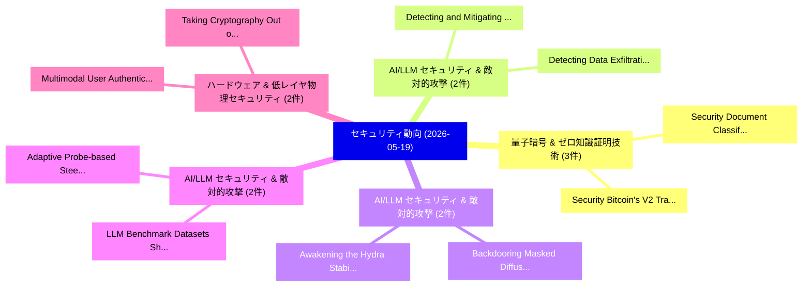

# 📅 02_daily: 日次エグゼクティブサマリー報告書 (2026-05-19)

**集計日時**: 2026-10-02 23:06:11 UTC  
**対象日付**: 2026-05-19  
**本日収集論文数**: 39 件  

---

## 💡 主要セキュリティ動向・脅威インサイト (Executive Insights)

本日の収集論文（計 39 件）において、以下の重点セキュリティ領域で活発な研究動向が確認されました：
- **量子暗号 & ゼロ知識証明技術** (3 件): 注目論文として 「Security Bitcoin's V2 Transpor...」、「Security Document Classificati...」 等が発表され、実務防御および攻撃検証の進展が見られます。
- **AI/LLM セキュリティ & 敵対的攻撃** (2 件): 注目論文として 「Detecting and Mitigating Backd...」、「Detecting Data Exfiltration th...」 等が発表され、実務防御および攻撃検証の進展が見られます。
- **AI/LLM セキュリティ & 敵対的攻撃** (2 件): 注目論文として 「Backdooring Masked Diffusion L...」、「Awakening the Hydra: Stabilizi...」 等が発表され、実務防御および攻撃検証の進展が見られます。
- **AI/LLM セキュリティ & 敵対的攻撃** (2 件): 注目論文として 「LLM Benchmark Datasets Should ...」、「Adaptive Probe-based Steering ...」 等が発表され、実務防御および攻撃検証の進展が見られます。
- **ハードウェア & 低レイヤ物理セキュリティ** (2 件): 注目論文として 「Taking Cryptography Out of the...」、「Multimodal User Authentication...」 等が発表され、実務防御および攻撃検証の進展が見られます。

### 🗺️ 技術・脅威トピックマインドマップ

---

## 📌 日次セキュリティ論文一覧 (日本語表形式)

| No | arXiv ID | 論文タイトル (日本語訳) | 重要キーワード | 構造化エグゼクティブ要約 (背景・提案・影響) | 脅威分類 | 詳細リンク |
|---|---|---|---|---|---|---|
| 1 | `2605.19227v1` | [Token by Token, Compromised: Backdoor Vulnerabilities in Unified Autoregressive Models（セキュリティ分析論文）](../../okf/papers/2026-05-19/2605.19227.md) | `Unified Autoregressive Models`, `Backdoor Vulnerabilities`, `Jonas Henry Grebe` | 【提案】概要 (Overview & Key Finding) 本論文「Token by Token, Compromised: Backdoor Vulnerabilities i...。実証評価により経営層・セキュリティ管理者向け推奨アクション (E... | `arXiv` | [arXiv](https://arxiv.org/abs/2605.19227v1) &#124; [OKF](../../okf/papers/2026-05-19/2605.19227.md) |
| 2 | `2605.19232v1` | [Devilray: A Systematic Adversarial Model Revealing Blind Spots in Fake Base Station Detection（セキュリティ分析論文）](../../okf/papers/2026-05-19/2605.19232.md) | `Systematic Adversarial Model Revealing Blind Spots`, `Fake Base Station Detection`, `Taekkyung Oh` | 【提案】概要 (Overview & Key Finding) 本論文「Devilray: A Systematic Adversarial Model Revealing Blin...。実証評価により経営層・セキュリティ管理者向け推奨アクション (E... | `arXiv` | [arXiv](https://arxiv.org/abs/2605.19232v1) &#124; [OKF](../../okf/papers/2026-05-19/2605.19232.md) |
| 3 | `2605.19233v2` | [Quantum Machine Learning for Cyber-Physical Anomaly Detection in Unmanned Aerial Vehicles: A Leakage-Free Evaluation with Proxy-Audited Feature Sets（セキュリティ分析論文）](../../okf/papers/2026-05-19/2605.19233.md) | `Quantum Machine Learning`, `Physical Anomaly Detection`, `Unmanned Aerial Vehicles` | 【提案】概要 (Overview & Key Finding) 本論文「量子 Machine Learning for Cyber-Physical Anomaly Detectio...。実証評価により経営層・セキュリティ管理者向け推奨アクション (E... | `arXiv` | [arXiv](https://arxiv.org/abs/2605.19233v2) &#124; [OKF](../../okf/papers/2026-05-19/2605.19233.md) |
| 4 | `2605.19253v1` | [Detecting and Mitigating Backdoor Attacks in OTA-FL Systems: A Two-Stage Robust Aggregation Scheme（セキュリティ分析論文）](../../okf/papers/2026-05-19/2605.19253.md) | `Mitigating Backdoor Attacks`, `Stage Robust Aggregation Scheme`, `OTA-FL Systems` | 【提案】概要 (Overview & Key Finding) 本論文「Detecting and Mitigating Backdoor Attacks in OTA-FL Sys...。実証評価により# Detecting and Mitigatin... | `arXiv` | [arXiv](https://arxiv.org/abs/2605.19253v1) &#124; [OKF](../../okf/papers/2026-05-19/2605.19253.md) |
| 5 | `2605.19262v2` | [Backdooring Masked Diffusion Language Models（セキュリティ分析論文）](../../okf/papers/2026-05-19/2605.19262.md) | `Backdooring Masked Diffusion Language Models`, `Daniel Yiming Cao`, `Chengzhong Wang` | 【提案】概要 (Overview & Key Finding) 本論文「Backdooring Masked Diffusion Language Models（セキュリティ分析論文...。実証評価により経営層・セキュリティ管理者向け推奨アクション (E... | `arXiv` | [arXiv](https://arxiv.org/abs/2605.19262v2) &#124; [OKF](../../okf/papers/2026-05-19/2605.19262.md) |
| 6 | `2605.19312v1` | [MultiBallot: Verifiable and privacy-preserving E-Collecting in the Swiss setting（セキュリティ分析論文）](../../okf/papers/2026-05-19/2605.19312.md) | `privacy-preserving E`, `Florian Moser`, `Raw Meta` | 【提案】概要 (Overview & Key Finding) 本論文「MultiBallot: Verifiable and privacy-preserving E-Collec...。実証評価により経営層・セキュリティ管理者向け推奨アクション (E... | `arXiv` | [arXiv](https://arxiv.org/abs/2605.19312v1) &#124; [OKF](../../okf/papers/2026-05-19/2605.19312.md) |
| 7 | `2605.19321v1` | [Exploring and Developing a Pre-Model Safeguard with Draft Models（セキュリティ分析論文）](../../okf/papers/2026-05-19/2605.19321.md) | `Model Safeguard`, `Draft Models`, `Pre-Model Safeguard` | 【提案】概要 (Overview & Key Finding) 本論文「Exploring and Developing a Pre-Model Safeguard with Dra...。実証評価により経営層・セキュリティ管理者向け推奨アクション (E... | `arXiv` | [arXiv](https://arxiv.org/abs/2605.19321v1) &#124; [OKF](../../okf/papers/2026-05-19/2605.19321.md) |
| 8 | `2605.19328v1` | [RoboJailBench: Adversarial Attacks and Defenses in Embodied Robotic Agentsのベンチマーク評価](../../okf/papers/2026-05-19/2605.19328.md) | `Benchmarking Adversarial Attacks`, `Adversarial Attacks`, `Embodied Robotic` | 【提案】概要 (Overview & Key Finding) 本論文「RoboJailBench: 敵対的攻撃s and Defenses in Embodied Robotic ...。実証評価により経営層・セキュリティ管理者向け推奨アクション (E... | `arXiv` | [arXiv](https://arxiv.org/abs/2605.19328v1) &#124; [OKF](../../okf/papers/2026-05-19/2605.19328.md) |
| 9 | `2605.19367v1` | [Locked Out at 8,000 Miles: Why UK-China Partnership Students Are Suffering（セキュリティ分析論文）](../../okf/papers/2026-05-19/2605.19367.md) | `UK-China Partnership`, `Benjamin Kenwright`, `Raw Meta` | 【提案】概要 (Overview & Key Finding) 本論文「Locked Out at 8,000 Miles: Why UK-China Partnership Stu...。実証評価により経営層・セキュリティ管理者向け推奨アクション (E... | `arXiv` | [arXiv](https://arxiv.org/abs/2605.19367v1) &#124; [OKF](../../okf/papers/2026-05-19/2605.19367.md) |
| 10 | `2605.19402v2` | [High-Rate Public-Key Pseudorandom Codes for Edit Errors（セキュリティ分析論文）](../../okf/papers/2026-05-19/2605.19402.md) | `Key Pseudorandom Codes`, `Rate Public`, `Edit Errors` | 【提案】概要 (Overview & Key Finding) 本論文「High-Rate Public-Key Pseudorandom Codes for Edit Errors...。実証評価により経営層・セキュリティ管理者向け推奨アクション (E... | `arXiv` | [arXiv](https://arxiv.org/abs/2605.19402v2) &#124; [OKF](../../okf/papers/2026-05-19/2605.19402.md) |
| 11 | `2605.19437v1` | [Fifty Shades of Darknet（セキュリティ分析論文）](../../okf/papers/2026-05-19/2605.19437.md) | `Fifty Shades`, `Siddique Abubakr Muntaka`, `Jacques Bou Abdo` | 【提案】概要 (Overview & Key Finding) 本論文「Fifty Shades of Darknet（セキュリティ分析論文）」（原題: Fifty Shades o...。実証評価により経営層・セキュリティ管理者向け推奨アクション (E... | `arXiv` | [arXiv](https://arxiv.org/abs/2605.19437v1) &#124; [OKF](../../okf/papers/2026-05-19/2605.19437.md) |
| 12 | `2605.19448v1` | [XAI FL-IDS: A 連合学習 and SHAP-Based Explainable Framework for Distributed Intrusion Detection Systems](../../okf/papers/2026-05-19/2605.19448.md) | `Distributed Intrusion Detection Systems`, `SHAP-Based Explainable`, `Federated Learning` | 【提案】概要 (Overview & Key Finding) 本論文「XAI FL-IDS: A 連合学習 and SHAP-Based Explainable Framework...。実証評価により経営層・セキュリティ管理者向け推奨アクション (E... | `arXiv` | [arXiv](https://arxiv.org/abs/2605.19448v1) &#124; [OKF](../../okf/papers/2026-05-19/2605.19448.md) |
| 13 | `2605.19478v1` | [Exposing Functional Fusion: A New Class of Strategic Backdoor in Dynamic Prompt Architectures（セキュリティ分析論文）](../../okf/papers/2026-05-19/2605.19478.md) | `Exposing Functional Fusion`, `Dynamic Prompt Architectures`, `New Class` | 【提案】概要 (Overview & Key Finding) 本論文「Exposing Functional Fusion: A New Class of Strategic Ba...。実証評価により経営層・セキュリティ管理者向け推奨アクション (E... | `arXiv` | [arXiv](https://arxiv.org/abs/2605.19478v1) &#124; [OKF](../../okf/papers/2026-05-19/2605.19478.md) |
| 14 | `2605.19644v1` | [Inferring Sensitive Attributes from Knowledge Graph Embeddings: Attack and Defense Strategies（セキュリティ分析論文）](../../okf/papers/2026-05-19/2605.19644.md) | `Inferring Sensitive Attributes`, `Knowledge Graph Embeddings`, `Defense Strategies` | 【提案】概要 (Overview & Key Finding) 本論文「Inferring Sensitive Attributes from Knowledge Graph Emb...。実証評価により経営層・セキュリティ管理者向け推奨アクション (E... | `arXiv` | [arXiv](https://arxiv.org/abs/2605.19644v1) &#124; [OKF](../../okf/papers/2026-05-19/2605.19644.md) |
| 15 | `2605.19668v1` | [SCARA: A Semantics-Constrained Autonomous Remediation Agent for Opaque Industrial Software Vulnerabilities（セキュリティ分析論文）](../../okf/papers/2026-05-19/2605.19668.md) | `Constrained Autonomous Remediation Agent`, `Opaque Industrial Software Vulnerabilities`, `Semantics-Constrained Autonomous` | 【提案】概要 (Overview & Key Finding) 本論文「SCARA: A Semantics-Constrained Autonomous Remediation A...。実証評価により経営層・セキュリティ管理者向け推奨アクション (E... | `arXiv` | [arXiv](https://arxiv.org/abs/2605.19668v1) &#124; [OKF](../../okf/papers/2026-05-19/2605.19668.md) |
| 16 | `2605.19698v1` | [Awakening the Hydra: Stabilizing Multi-Concept Backdoor Injection in Text-to-Image Diffusion Models（セキュリティ分析論文）](../../okf/papers/2026-05-19/2605.19698.md) | `Concept Backdoor Injection`, `Image Diffusion Models`, `Stabilizing Multi` | 【提案】概要 (Overview & Key Finding) 本論文「Awakening the Hydra: Stabilizing Multi-Concept Backdoor...。実証評価により経営層・セキュリティ管理者向け推奨アクション (E... | `arXiv` | [arXiv](https://arxiv.org/abs/2605.19698v1) &#124; [OKF](../../okf/papers/2026-05-19/2605.19698.md) |
| 17 | `2605.19715v1` | [Security Bitcoin's V2 Transport Protocol: Exploiting Design Implications for Sustained Eclipse and Downgrade Attacksの分析](../../okf/papers/2026-05-19/2605.19715.md) | `V2 Transport Protocol`, `Exploiting Design Implications`, `Sustained Eclipse` | 【提案】概要 (Overview & Key Finding) 本論文「Security Bitcoin's V2 Transport Protocol: Exploiting De...。実証評価により経営層・セキュリティ管理者向け推奨アクション (E... | `arXiv` | [arXiv](https://arxiv.org/abs/2605.19715v1) &#124; [OKF](../../okf/papers/2026-05-19/2605.19715.md) |
| 18 | `2605.19722v1` | [Measuring Safety Alignment Effects in Autonomous Security Agents（セキュリティ分析論文）](../../okf/papers/2026-05-19/2605.19722.md) | `Measuring Safety Alignment Effects`, `Autonomous Security Agents`, `Isaac David` | 【提案】概要 (Overview & Key Finding) 本論文「Measuring Safety Alignment Effects in Autonomous Securi...。実証評価により経営層・セキュリティ管理者向け推奨アクション (E... | `arXiv` | [arXiv](https://arxiv.org/abs/2605.19722v1) &#124; [OKF](../../okf/papers/2026-05-19/2605.19722.md) |
| 19 | `2605.19742v4` | [The Privacy Subsidy in Glosten-Milgrom: Bid-Ask Spread and Welfare under Flip-Noise Direction Observation（セキュリティ分析論文）](../../okf/papers/2026-05-19/2605.19742.md) | `Noise Direction Observation`, `Ask Spread`, `Bid-Ask Spread` | 【提案】概要 (Overview & Key Finding) 本論文「The Privacy Subsidy in Glosten-Milgrom: Bid-Ask Spread ...。実証評価により経営層・セキュリティ管理者向け推奨アクション (E... | `arXiv` | [arXiv](https://arxiv.org/abs/2605.19742v4) &#124; [OKF](../../okf/papers/2026-05-19/2605.19742.md) |
| 20 | `2605.19847v2` | [Auditing Privacy in Multi-Tenant RAG under Account Collusion（セキュリティ分析論文）](../../okf/papers/2026-05-19/2605.19847.md) | `Auditing Privacy`, `Account Collusion`, `Multi-Tenant RAG` | 【提案】概要 (Overview & Key Finding) 本論文「Auditing Privacy in Multi-Tenant RAG under Account Coll...。実証評価によりBurnat - **公開日時**: `2026-... | `arXiv` | [arXiv](https://arxiv.org/abs/2605.19847v2) &#124; [OKF](../../okf/papers/2026-05-19/2605.19847.md) |
| 21 | `2605.19885v1` | [Set Shaping Theory as a Complementary Payload-Shaping Layer for Steganography（セキュリティ分析論文）](../../okf/papers/2026-05-19/2605.19885.md) | `Set Shaping Theory`, `Complementary Payload`, `Shaping Layer` | 【提案】概要 (Overview & Key Finding) 本論文「Set Shaping Theory as a Complementary Payload-Shaping L...。実証評価により経営層・セキュリティ管理者向け推奨アクション (E... | `arXiv` | [arXiv](https://arxiv.org/abs/2605.19885v1) &#124; [OKF](../../okf/papers/2026-05-19/2605.19885.md) |
| 22 | `2605.19899v1` | [reconCTI: A Proactive Approach to Cyber-Threat Intelligence（セキュリティ分析論文）](../../okf/papers/2026-05-19/2605.19899.md) | `Threat Intelligence`, `Cyber-Threat Intelligence`, `Mohammed Mahir Rahman` | 【提案】概要 (Overview & Key Finding) 本論文「reconCTI: A Proactive Approach to Cyber-脅威 Intelligence...。実証評価により経営層・セキュリティ管理者向け推奨アクション (E... | `arXiv` | [arXiv](https://arxiv.org/abs/2605.19899v1) &#124; [OKF](../../okf/papers/2026-05-19/2605.19899.md) |
| 23 | `2605.19955v2` | [DASM: Domain-Aware Sharpness Minimization for Multi-Domain Voice Stream Steganalysis（セキュリティ分析論文）](../../okf/papers/2026-05-19/2605.19955.md) | `Domain Voice Stream Steganalysis`, `Aware Sharpness Minimization`, `Domain-Aware Sharpness` | 【提案】概要 (Overview & Key Finding) 本論文「DASM: Domain-Aware Sharpness Minimization for Multi-Dom...。実証評価により経営層・セキュリティ管理者向け推奨アクション (E... | `arXiv` | [arXiv](https://arxiv.org/abs/2605.19955v2) &#124; [OKF](../../okf/papers/2026-05-19/2605.19955.md) |
| 24 | `2605.19999v1` | [LLM Benchmark Datasets Should Be Contamination-Resistant（セキュリティ分析論文）](../../okf/papers/2026-05-19/2605.19999.md) | `Ali Al`, `Jason Lucas`, `Dongwon Lee` | 【提案】概要 (Overview & Key Finding) 本論文「LLM Benchmark Datasets Should Be Contamination-Resistan...。実証評価により経営層・セキュリティ管理者向け推奨アクション (E... | `arXiv` | [arXiv](https://arxiv.org/abs/2605.19999v1) &#124; [OKF](../../okf/papers/2026-05-19/2605.19999.md) |
| 25 | `2605.20047v1` | [Taking Cryptography Out of the Data Path via Near-Memory Processing in DRAM（セキュリティ分析論文）](../../okf/papers/2026-05-19/2605.20047.md) | `Data Path`, `Memory Processing`, `Near-Memory Processing` | 【提案】概要 (Overview & Key Finding) 本論文「Taking 暗号技術 Out of the Data Path via Near-Memory Proces...。実証評価により経営層・セキュリティ管理者向け推奨アクション (E... | `arXiv` | [arXiv](https://arxiv.org/abs/2605.20047v1) &#124; [OKF](../../okf/papers/2026-05-19/2605.20047.md) |
| 26 | `2605.20051v1` | [Hunting Vulnerability Variants in AI Infra: Measurement and Reference-Driven Detection（セキュリティ分析論文）](../../okf/papers/2026-05-19/2605.20051.md) | `Hunting Vulnerability Variants`, `Driven Detection`, `Reference-Driven Detection` | 【提案】概要 (Overview & Key Finding) 本論文「Hunting 脆弱性 Variants in AI Infra: Measurement and Refer...。実証評価により経営層・セキュリティ管理者向け推奨アクション (E... | `arXiv` | [arXiv](https://arxiv.org/abs/2605.20051v1) &#124; [OKF](../../okf/papers/2026-05-19/2605.20051.md) |
| 27 | `2605.20123v1` | [BiRD: A Bidirectional Ranking Defense Mechanism for Retrieval Augmented Generation（セキュリティ分析論文）](../../okf/papers/2026-05-19/2605.20123.md) | `Bidirectional Ranking Defense Mechanism`, `Retrieval Augmented Generation`, `Chengcai Gao` | 【提案】概要 (Overview & Key Finding) 本論文「BiRD: A Bidirectional Ranking Defense Mechanism for Ret...。実証評価により経営層・セキュリティ管理者向け推奨アクション (E... | `arXiv` | [arXiv](https://arxiv.org/abs/2605.20123v1) &#124; [OKF](../../okf/papers/2026-05-19/2605.20123.md) |
| 28 | `2605.20157v1` | [SAGE: Scalable Automatic Gating Ensemble for Confident Negative Harvesting in Fraud Detection（セキュリティ分析論文）](../../okf/papers/2026-05-19/2605.20157.md) | `Scalable Automatic Gating Ensemble`, `Confident Negative Harvesting`, `Fraud Detection` | 【提案】概要 (Overview & Key Finding) 本論文「SAGE: Scalable Automatic Gating Ensemble for Confident ...。実証評価により経営層・セキュリティ管理者向け推奨アクション (E... | `arXiv` | [arXiv](https://arxiv.org/abs/2605.20157v1) &#124; [OKF](../../okf/papers/2026-05-19/2605.20157.md) |
| 29 | `2605.20286v1` | [Adaptive Probe-based Steering for Robust LLM Jailbreaking（セキュリティ分析論文）](../../okf/papers/2026-05-19/2605.20286.md) | `Adaptive Probe`, `Probe-based Steering`, `Junxi Chen` | 【提案】概要 (Overview & Key Finding) 本論文「Adaptive Probe-based Steering for Robust LLM ジェイルブレイクin...。実証評価により経営層・セキュリティ管理者向け推奨アクション (E... | `arXiv` | [arXiv](https://arxiv.org/abs/2605.20286v1) &#124; [OKF](../../okf/papers/2026-05-19/2605.20286.md) |
| 30 | `2605.20312v1` | [Pramana: A Protocol-Layer Treatment of Claim Verification in Autonomous Agent Networks（セキュリティ分析論文）](../../okf/papers/2026-05-19/2605.20312.md) | `Autonomous Agent Networks`, `Layer Treatment`, `Claim Verification` | 【提案】概要 (Overview & Key Finding) 本論文「Pramana: A Protocol-Layer Treatment of Claim Verificati...。実証評価により経営層・セキュリティ管理者向け推奨アクション (E... | `arXiv` | [arXiv](https://arxiv.org/abs/2605.20312v1) &#124; [OKF](../../okf/papers/2026-05-19/2605.20312.md) |
| 31 | `2605.20341v2` | [Causal Unlearning in Collaborative Optimization: Exact and Approximate Influence Reversal under Adversarial Contributions（セキュリティ分析論文）](../../okf/papers/2026-05-19/2605.20341.md) | `Approximate Influence Reversal`, `Causal Unlearning`, `Collaborative Optimization` | 【提案】概要 (Overview & Key Finding) 本論文「Causal Unlearning in Collaborative Optimization: Exact ...。実証評価により経営層・セキュリティ管理者向け推奨アクション (E... | `arXiv` | [arXiv](https://arxiv.org/abs/2605.20341v2) &#124; [OKF](../../okf/papers/2026-05-19/2605.20341.md) |
| 32 | `2605.20351v1` | [Refusal Evaluation in Coding LLMs and Code Agents: A Systematic Review of Thirteen Malicious-Code Prompt Corpora (2023-2025)（セキュリティ分析論文）](../../okf/papers/2026-05-19/2605.20351.md) | `Code Prompt Corpora`, `Code Agents`, `Systematic Review` | 【提案】概要 (Overview & Key Finding) 本論文「Refusal Evaluation in Coding LLMs and Code Agents: A Sy...。実証評価により経営層・セキュリティ管理者向け推奨アクション (E... | `arXiv` | [arXiv](https://arxiv.org/abs/2605.20351v1) &#124; [OKF](../../okf/papers/2026-05-19/2605.20351.md) |
| 33 | `2605.20368v1` | [Security Document Classification with a Fine-Tuned Local Large Language Model: Benchmark Data and an Open-Source System（セキュリティ分析論文）](../../okf/papers/2026-05-19/2605.20368.md) | `Tuned Local Large Language Model`, `Security Document Classification`, `Fine-Tuned Local` | 【提案】概要 (Overview & Key Finding) 本論文「Security Document Classification with a Fine-Tuned Loca...。実証評価により経営層・セキュリティ管理者向け推奨アクション (E... | `arXiv` | [arXiv](https://arxiv.org/abs/2605.20368v1) &#124; [OKF](../../okf/papers/2026-05-19/2605.20368.md) |
| 34 | `2605.20391v1` | [Latent Geometry as a Structural Monitor: Eigenspace Alignment for Anomaly Detection in Anonymity Networks（セキュリティ分析論文）](../../okf/papers/2026-05-19/2605.20391.md) | `Latent Geometry`, `Structural Monitor`, `Eigenspace Alignment` | 【提案】概要 (Overview & Key Finding) 本論文「Latent Geometry as a Structural Monitor: Eigenspace Ali...。実証評価により経営層・セキュリティ管理者向け推奨アクション (E... | `arXiv` | [arXiv](https://arxiv.org/abs/2605.20391v1) &#124; [OKF](../../okf/papers/2026-05-19/2605.20391.md) |
| 35 | `2605.20450v1` | [SMA-DP: Spectral Memory-Aware Differential Privacy for Deep Learning（セキュリティ分析論文）](../../okf/papers/2026-05-19/2605.20450.md) | `Aware Differential Privacy`, `Spectral Memory`, `Deep Learning` | 【提案】概要 (Overview & Key Finding) 本論文「SMA-DP: Spectral Memory-Aware 差分プライバシー for Deep Learnin...。実証評価により経営層・セキュリティ管理者向け推奨アクション (E... | `arXiv` | [arXiv](https://arxiv.org/abs/2605.20450v1) &#124; [OKF](../../okf/papers/2026-05-19/2605.20450.md) |
| 36 | `2605.20521v1` | [An exponential mechanism based on quadratic approximations for fine-tuning machine learning models with privacy guarantees（セキュリティ分析論文）](../../okf/papers/2026-05-19/2605.20521.md) | `fine-tuning machine`, `Hoang Tran`, `Jorge Ramirez` | 【提案】概要 (Overview & Key Finding) 本論文「An exponential mechanism based on quadratic approximati...。実証評価により経営層・セキュリティ管理者向け推奨アクション (E... | `arXiv` | [arXiv](https://arxiv.org/abs/2605.20521v1) &#124; [OKF](../../okf/papers/2026-05-19/2605.20521.md) |
| 37 | `2605.20546v1` | [Detecting Data Exfiltration through I2P Anonymity Networks: A Two-Phase Machine Learning Approach（セキュリティ分析論文）](../../okf/papers/2026-05-19/2605.20546.md) | `Detecting Data Exfiltration`, `Anonymity Networks`, `Two-Phase Machine` | 【提案】概要 (Overview & Key Finding) 本論文「Detecting Data Exfiltration through I2P Anonymity Netwo...。実証評価により経営層・セキュリティ管理者向け推奨アクション (E... | `arXiv` | [arXiv](https://arxiv.org/abs/2605.20546v1) &#124; [OKF](../../okf/papers/2026-05-19/2605.20546.md) |
| 38 | `2606.00058v1` | [A Survey on Security with Quantum Computing（セキュリティ分析論文）](../../okf/papers/2026-05-19/2606.00058.md) | `Quantum Computing`, `Manik Kumar Sangala`, `Robin Naira` | 【提案】概要 (Overview & Key Finding) 本論文「A Survey on Security with 量子 Computing（セキュリティ分析論文）」（原題:...。実証評価により経営層・セキュリティ管理者向け推奨アクション (E... | `arXiv` | [arXiv](https://arxiv.org/abs/2606.00058v1) &#124; [OKF](../../okf/papers/2026-05-19/2606.00058.md) |
| 39 | `2607.24747v1` | [Multimodal User Authentication Method via Fusion of Keystroke Dynamics and Glove-Based Hand Kinematics（セキュリティ分析論文）](../../okf/papers/2026-05-19/2607.24747.md) | `Based Hand Kinematics`, `Keystroke Dynamics`, `Glove-Based Hand` | 【提案】概要 (Overview & Key Finding) 本論文「Multimodal User Authentication Method via Fusion of Key...。実証評価により経営層・セキュリティ管理者向け推奨アクション (E... | `arXiv` | [arXiv](https://arxiv.org/abs/2607.24747v1) &#124; [OKF](../../okf/papers/2026-05-19/2607.24747.md) |

