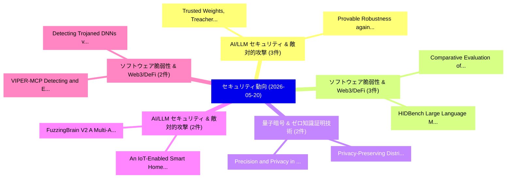

# 📅 02_daily: 日次エグゼクティブサマリー報告書 (2026-05-20)

**集計日時**: 2026-10-02 23:06:11 UTC  
**対象日付**: 2026-05-20  
**本日収集論文数**: 34 件  

---

## 💡 主要セキュリティ動向・脅威インサイト (Executive Insights)

本日の収集論文（計 34 件）において、以下の重点セキュリティ領域で活発な研究動向が確認されました：
- **AI/LLM セキュリティ & 敵対的攻撃** (3 件): 注目論文として 「Trusted Weights, Treacherous O...」、「Provable Robustness against Ba...」 等が発表され、実務防御および攻撃検証の進展が見られます。
- **ソフトウェア脆弱性 & Web3/DeFi** (3 件): 注目論文として 「Comparative Evaluation of Deep...」、「HIDBench: Large Language Model...」 等が発表され、実務防御および攻撃検証の進展が見られます。
- **量子暗号 & ゼロ知識証明技術** (2 件): 注目論文として 「Precision and Privacy in Distr...」、「Privacy-Preserving Distributed...」 等が発表され、実務防御および攻撃検証の進展が見られます。
- **AI/LLM セキュリティ & 敵対的攻撃** (2 件): 注目論文として 「An IoT-Enabled Smart Home Auto...」、「FuzzingBrain V2: A Multi-Agent...」 等が発表され、実務防御および攻撃検証の進展が見られます。
- **ソフトウェア脆弱性 & Web3/DeFi** (2 件): 注目論文として 「Detecting Trojaned DNNs via Sp...」、「VIPER-MCP: Detecting and Explo...」 等が発表され、実務防御および攻撃検証の進展が見られます。

### 🗺️ 技術・脅威トピックマインドマップ

---

## 📌 日次セキュリティ論文一覧 (日本語表形式)

| No | arXiv ID | 論文タイトル (日本語訳) | 重要キーワード | 構造化エグゼクティブ要約 (背景・提案・影響) | 脅威分類 | 詳細リンク |
|---|---|---|---|---|---|---|
| 1 | `2605.20641v1` | [Trusted Weights, Treacherous Optimizations? Optimization-Triggered Backdoor Attacks on LLMs（セキュリティ分析論文）](../../okf/papers/2026-05-20/2605.20641.md) | `Triggered Backdoor Attacks`, `Trusted Weights`, `Treacherous Optimizations` | 【提案】Optimization-Triggered Backdoor Attacks on LLMs ### (日本語題名: Trusted Weights, Treacherou...。実証評価により経営層・セキュリティ管理者向け推奨アクション (E... | `arXiv` | [arXiv](https://arxiv.org/abs/2605.20641v1) &#124; [OKF](../../okf/papers/2026-05-20/2605.20641.md) |
| 2 | `2605.20704v1` | [Heartbeat-Bound Hierarchical Credentials: Cryptographic Revocation for AI Agent Swarms（セキュリティ分析論文）](../../okf/papers/2026-05-20/2605.20704.md) | `Bound Hierarchical Credentials`, `Cryptographic Revocation`, `Agent Swarms` | 【提案】概要 (Overview & Key Finding) 本論文「Heartbeat-Bound Hierarchical Credentials: Cryptographic...。実証評価により経営層・セキュリティ管理者向け推奨アクション (E... | `arXiv` | [arXiv](https://arxiv.org/abs/2605.20704v1) &#124; [OKF](../../okf/papers/2026-05-20/2605.20704.md) |
| 3 | `2605.20734v1` | [An Application-Layer Multi-Modal Covert-Channel Reference Monitor for LLM Agent Egress（セキュリティ分析論文）](../../okf/papers/2026-05-20/2605.20734.md) | `Channel Reference Monitor`, `Layer Multi`, `Modal Covert` | 【提案】概要 (Overview & Key Finding) 本論文「An Application-Layer Multi-Modal Covert-Channel Referen...。実証評価により経営層・セキュリティ管理者向け推奨アクション (E... | `arXiv` | [arXiv](https://arxiv.org/abs/2605.20734v1) &#124; [OKF](../../okf/papers/2026-05-20/2605.20734.md) |
| 4 | `2605.20759v1` | [Rethinking Fraud Safety Evaluation: Multi-Round Attacks Reveal Safety-Utility Tradeoffs in Graph-Context LLM Defenders（セキュリティ分析論文）](../../okf/papers/2026-05-20/2605.20759.md) | `Round Attacks Reveal Safety`, `Utility Tradeoffs`, `Multi-Round Attacks` | 【提案】概要 (Overview & Key Finding) 本論文「Rethinking Fraud Safety Evaluation: Multi-Round Attacks...。実証評価により経営層・セキュリティ管理者向け推奨アクション (E... | `arXiv` | [arXiv](https://arxiv.org/abs/2605.20759v1) &#124; [OKF](../../okf/papers/2026-05-20/2605.20759.md) |
| 5 | `2605.20765v1` | [Precision and Privacy in Distributed Quantum Sensing: A Quantum Fisher Information Duality（セキュリティ分析論文）](../../okf/papers/2026-05-20/2605.20765.md) | `Quantum Fisher Information Duality`, `Distributed Quantum Sensing`, `Quantum Fisher Information` | 【提案】概要 (Overview & Key Finding) 本論文「Precision and Privacy in Distributed 量子 Sensing: A 量子 F...。実証評価により経営層・セキュリティ管理者向け推奨アクション (E... | `arXiv` | [arXiv](https://arxiv.org/abs/2605.20765v1) &#124; [OKF](../../okf/papers/2026-05-20/2605.20765.md) |
| 6 | `2605.20896v2` | [GenAI-Driven Threat Detection with Microsoft Security Copilot（セキュリティ分析論文）](../../okf/papers/2026-05-20/2605.20896.md) | `Driven Threat Detection`, `Microsoft Security Copilot`, `GenAI-Driven Threat` | 【提案】概要 (Overview & Key Finding) 本論文「GenAI-Driven 脅威 Detection with Microsoft Security Copil...。実証評価により経営層・セキュリティ管理者向け推奨アクション (E... | `arXiv` | [arXiv](https://arxiv.org/abs/2605.20896v2) &#124; [OKF](../../okf/papers/2026-05-20/2605.20896.md) |
| 7 | `2605.20944v1` | [Privacy-Preserving Distributed Optimization Under Time Constraints Using Secure Multi-Party Computation and Evolutionary Algorithms（セキュリティ分析論文）](../../okf/papers/2026-05-20/2605.20944.md) | `Party Computation`, `Evolutionary Algorithms`, `Privacy-Preserving Distributed` | 【提案】概要 (Overview & Key Finding) 本論文「Privacy-Preserving Distributed Optimization Under Time ...。実証評価により経営層・セキュリティ管理者向け推奨アクション (E... | `arXiv` | [arXiv](https://arxiv.org/abs/2605.20944v1) &#124; [OKF](../../okf/papers/2026-05-20/2605.20944.md) |
| 8 | `2605.20952v2` | [Ark: Offchain Transaction Batching in Bitcoin（セキュリティ分析論文）](../../okf/papers/2026-05-20/2605.20952.md) | `Offchain Transaction Batching`, `Pim Keer`, `Ioannis Alexopoulos` | 【提案】概要 (Overview & Key Finding) 本論文「Ark: Offchain Transaction Batching in Bitcoin（セキュリティ分析論...。実証評価により経営層・セキュリティ管理者向け推奨アクション (E... | `arXiv` | [arXiv](https://arxiv.org/abs/2605.20952v2) &#124; [OKF](../../okf/papers/2026-05-20/2605.20952.md) |
| 9 | `2605.20971v1` | [Comparative Evaluation of Deep Learning Models for Fake Image Detection（セキュリティ分析論文）](../../okf/papers/2026-05-20/2605.20971.md) | `Deep Learning Models`, `Fake Image Detection`, `Mohammed Mahir Rahman` | 【提案】概要 (Overview & Key Finding) 本論文「Comparative Evaluation of Deep Learning Models for Fake...。実証評価により経営層・セキュリティ管理者向け推奨アクション (E... | `arXiv` | [arXiv](https://arxiv.org/abs/2605.20971v1) &#124; [OKF](../../okf/papers/2026-05-20/2605.20971.md) |
| 10 | `2605.20975v2` | [Choose Wisely and Privately: Proactive Client Selection for Fair and Efficient 連合学習](../../okf/papers/2026-05-20/2605.20975.md) | `Proactive Client Selection`, `Choose Wisely`, `Efficient Federated Learning` | 【提案】概要 (Overview & Key Finding) 本論文「Choose Wisely and Privately: Proactive Client Selection...。実証評価により経営層・セキュリティ管理者向け推奨アクション (E... | `arXiv` | [arXiv](https://arxiv.org/abs/2605.20975v2) &#124; [OKF](../../okf/papers/2026-05-20/2605.20975.md) |
| 11 | `2605.20981v1` | [An IoT-Enabled Smart Home Automation System for Energy Efficiency with Web-Based Control（セキュリティ分析論文）](../../okf/papers/2026-05-20/2605.20981.md) | `Enabled Smart Home Automation System`, `IoT-Enabled Smart`, `Energy Efficiency` | 【提案】概要 (Overview & Key Finding) 本論文「An IoT-Enabled Smart Home Automation System for Energy ...。実証評価により経営層・セキュリティ管理者向け推奨アクション (E... | `arXiv` | [arXiv](https://arxiv.org/abs/2605.20981v1) &#124; [OKF](../../okf/papers/2026-05-20/2605.20981.md) |
| 12 | `2605.20984v1` | [Domijn: The Security of Domain Registrars and the Risk of a Domain Name Takeover（セキュリティ分析論文）](../../okf/papers/2026-05-20/2605.20984.md) | `Domain Name Takeover`, `Domain Registrars`, `Raw Meta` | 【提案】概要 (Overview & Key Finding) 本論文「Domijn: The Security of Domain Registrars and the Risk ...。実証評価により経営層・セキュリティ管理者向け推奨アクション (E... | `arXiv` | [arXiv](https://arxiv.org/abs/2605.20984v1) &#124; [OKF](../../okf/papers/2026-05-20/2605.20984.md) |
| 13 | `2605.21002v1` | [Verifiable Provenance and Watermarking for Generative AI: An Evidentiary Framework for International Operational Law and Domestic Courts（セキュリティ分析論文）](../../okf/papers/2026-05-20/2605.21002.md) | `International Operational Law`, `Verifiable Provenance`, `Domestic Courts` | 【提案】概要 (Overview & Key Finding) 本論文「Verifiable Provenance and Watermarking for Generative A...。実証評価により経営層・セキュリティ管理者向け推奨アクション (E... | `arXiv` | [arXiv](https://arxiv.org/abs/2605.21002v1) &#124; [OKF](../../okf/papers/2026-05-20/2605.21002.md) |
| 14 | `2605.21089v1` | [An Evidence-driven Protocol for Trustworthy CI Pipelines（セキュリティ分析論文）](../../okf/papers/2026-05-20/2605.21089.md) | `Evidence-driven Protocol`, `Fernando Castillo`, `Eduardo Brito` | 【提案】概要 (Overview & Key Finding) 本論文「An Evidence-driven Protocol for Trustworthy CI Pipeline...。実証評価により経営層・セキュリティ管理者向け推奨アクション (E... | `arXiv` | [arXiv](https://arxiv.org/abs/2605.21089v1) &#124; [OKF](../../okf/papers/2026-05-20/2605.21089.md) |
| 15 | `2605.21095v1` | [Backchaining Loss of Control Mitigations from Mission-Specific Benchmarks in National Security（セキュリティ分析論文）](../../okf/papers/2026-05-20/2605.21095.md) | `Backchaining Loss`, `Control Mitigations`, `Specific Benchmarks` | 【提案】概要 (Overview & Key Finding) 本論文「Backchaining Loss of Control Mitigations from Mission-S...。実証評価により経営層・セキュリティ管理者向け推奨アクション (E... | `arXiv` | [arXiv](https://arxiv.org/abs/2605.21095v1) &#124; [OKF](../../okf/papers/2026-05-20/2605.21095.md) |
| 16 | `2605.21118v2` | [Image Encryption via Data-Identified Discrete Chaotic Maps（セキュリティ分析論文）](../../okf/papers/2026-05-20/2605.21118.md) | `Identified Discrete Chaotic Maps`, `Image Encryption`, `Data-Identified Discrete` | 【提案】概要 (Overview & Key Finding) 本論文「Image Encryption via Data-Identified Discrete Chaotic M...。実証評価により経営層・セキュリティ管理者向け推奨アクション (E... | `arXiv` | [arXiv](https://arxiv.org/abs/2605.21118v2) &#124; [OKF](../../okf/papers/2026-05-20/2605.21118.md) |
| 17 | `2605.21146v1` | [Detecting Trojaned DNNs via Spectral Regression Analysis（セキュリティ分析論文）](../../okf/papers/2026-05-20/2605.21146.md) | `Detecting Trojaned`, `Samuele Pasini`, `Jinhan Kim` | 【提案】概要 (Overview & Key Finding) 本論文「Detecting Trojaned DNNs via Spectral Regression Analysi...。実証評価により経営層・セキュリティ管理者向け推奨アクション (E... | `arXiv` | [arXiv](https://arxiv.org/abs/2605.21146v1) &#124; [OKF](../../okf/papers/2026-05-20/2605.21146.md) |
| 18 | `2605.21185v1` | [Information Leakage Envelopes（セキュリティ分析論文）](../../okf/papers/2026-05-20/2605.21185.md) | `Information Leakage Envelopes`, `Sara Saeidian`, `Catuscia Palamidessi` | 【提案】概要 (Overview & Key Finding) 本論文「Information Leakage Envelopes（セキュリティ分析論文）」（原題: Informat...。実証評価により経営層・セキュリティ管理者向け推奨アクション (E... | `arXiv` | [arXiv](https://arxiv.org/abs/2605.21185v1) &#124; [OKF](../../okf/papers/2026-05-20/2605.21185.md) |
| 19 | `2605.21246v1` | [Profiling User Vulnerability to Phishing Through Psychological and Behavioral Factors（セキュリティ分析論文）](../../okf/papers/2026-05-20/2605.21246.md) | `Profiling User Vulnerability`, `Behavioral Factors`, `Gennaro Esposito Mocerino` | 【提案】概要 (Overview & Key Finding) 本論文「Profiling User 脆弱性 to Phishing Through Psychological an...。実証評価により経営層・セキュリティ管理者向け推奨アクション (E... | `arXiv` | [arXiv](https://arxiv.org/abs/2605.21246v1) &#124; [OKF](../../okf/papers/2026-05-20/2605.21246.md) |
| 20 | `2605.21349v1` | [Onion-Routed Multi-Circuit Key Establishment for Quantum-Resilient Sessions（セキュリティ分析論文）](../../okf/papers/2026-05-20/2605.21349.md) | `Circuit Key Establishment`, `Routed Multi`, `Resilient Sessions` | 【提案】概要 (Overview & Key Finding) 本論文「Onion-Routed Multi-Circuit Key Establishment for 量子-Res...。実証評価により経営層・セキュリティ管理者向け推奨アクション (E... | `arXiv` | [arXiv](https://arxiv.org/abs/2605.21349v1) &#124; [OKF](../../okf/papers/2026-05-20/2605.21349.md) |
| 21 | `2605.21378v2` | [Auditing Apple's DifferentialPrivacy.framework: Implementation Bugs, Misconfigurations, and Practical Risks（セキュリティ分析論文）](../../okf/papers/2026-05-20/2605.21378.md) | `Auditing Apple`, `Implementation Bugs`, `Practical Risks` | 【提案】概要 (Overview & Key Finding) 本論文「Auditing Apple's DifferentialPrivacy.framework: Impleme...。実証評価により経営層・セキュリティ管理者向け推奨アクション (E... | `arXiv` | [arXiv](https://arxiv.org/abs/2605.21378v2) &#124; [OKF](../../okf/papers/2026-05-20/2605.21378.md) |
| 22 | `2605.21392v2` | [VIPER-MCP: Detecting and Exploiting Taint-Style Vulnerabilities in Model Context Protocol Servers（セキュリティ分析論文）](../../okf/papers/2026-05-20/2605.21392.md) | `Model Context Protocol Servers`, `Exploiting Taint`, `Style Vulnerabilities` | 【提案】概要 (Overview & Key Finding) 本論文「VIPER-MCP: Detecting and Exploiting Taint-Style Vulnera...。実証評価により経営層・セキュリティ管理者向け推奨アクション (E... | `arXiv` | [arXiv](https://arxiv.org/abs/2605.21392v2) &#124; [OKF](../../okf/papers/2026-05-20/2605.21392.md) |
| 23 | `2605.21541v1` | [Frequency-Domain Regularized Adversarial Alignment for Transferable Attacks against Closed-Source MLLMs（セキュリティ分析論文）](../../okf/papers/2026-05-20/2605.21541.md) | `Domain Regularized Adversarial Alignment`, `Transferable Attacks`, `Frequency-Domain Regularized` | 【提案】概要 (Overview & Key Finding) 本論文「Frequency-Domain Regularized Adversarial Alignment for ...。実証評価により経営層・セキュリティ管理者向け推奨アクション (E... | `arXiv` | [arXiv](https://arxiv.org/abs/2605.21541v1) &#124; [OKF](../../okf/papers/2026-05-20/2605.21541.md) |
| 24 | `2605.21601v1` | [Near-Optimal Generalized Private Testing（セキュリティ分析論文）](../../okf/papers/2026-05-20/2605.21601.md) | `Optimal Generalized Private Testing`, `Near-Optimal Generalized`, `Anamay Chaturvedi` | 【提案】概要 (Overview & Key Finding) 本論文「Near-Optimal Generalized Private Testing（セキュリティ分析論文）」（原...。実証評価により経営層・セキュリティ管理者向け推奨アクション (E... | `arXiv` | [arXiv](https://arxiv.org/abs/2605.21601v1) &#124; [OKF](../../okf/papers/2026-05-20/2605.21601.md) |
| 25 | `2605.21615v1` | [ASSEMBLAGE-DEEPHISTORY: A Cross-Build Binary Dataset with Temporal Coverage（セキュリティ分析論文）](../../okf/papers/2026-05-20/2605.21615.md) | `Build Binary Dataset`, `Cross-Build Binary`, `Temporal Coverage` | 【提案】概要 (Overview & Key Finding) 本論文「ASSEMBLAGE-DEEPHISTORY: A Cross-Build Binary Dataset wi...。実証評価により経営層・セキュリティ管理者向け推奨アクション (E... | `arXiv` | [arXiv](https://arxiv.org/abs/2605.21615v1) &#124; [OKF](../../okf/papers/2026-05-20/2605.21615.md) |
| 26 | `2605.21674v1` | [Adversarial Reframing: A Framework for Targeted Generation in Language Models（セキュリティ分析論文）](../../okf/papers/2026-05-20/2605.21674.md) | `Adversarial Reframing`, `Targeted Generation`, `Language Models` | 【提案】概要 (Overview & Key Finding) 本論文「Adversarial Reframing: A Framework for Targeted Generat...。実証評価により経営層・セキュリティ管理者向け推奨アクション (E... | `arXiv` | [arXiv](https://arxiv.org/abs/2605.21674v1) &#124; [OKF](../../okf/papers/2026-05-20/2605.21674.md) |
| 27 | `2605.21694v1` | [PocketAgents: A Manifest-Driven Library of Autonomous Defense Agents（セキュリティ分析論文）](../../okf/papers/2026-05-20/2605.21694.md) | `Autonomous Defense Agents`, `Driven Library`, `Manifest-Driven Library` | 【提案】概要 (Overview & Key Finding) 本論文「PocketAgents: A Manifest-Driven Library of Autonomous D...。実証評価により経営層・セキュリティ管理者向け推奨アクション (E... | `arXiv` | [arXiv](https://arxiv.org/abs/2605.21694v1) &#124; [OKF](../../okf/papers/2026-05-20/2605.21694.md) |
| 28 | `2605.21773v1` | [HIDBench: Large Language Models for Host-Based Intrusion Detectionのベンチマーク評価](../../okf/papers/2026-05-20/2605.21773.md) | `Host-Based Intrusion`, `Benchmarking Large Language Models`, `Based Intrusion Detection` | 【提案】概要 (Overview & Key Finding) 本論文「HIDBench: Large Language Models for Host-Based Intrusio...。実証評価により経営層・セキュリティ管理者向け推奨アクション (E... | `arXiv` | [arXiv](https://arxiv.org/abs/2605.21773v1) &#124; [OKF](../../okf/papers/2026-05-20/2605.21773.md) |
| 29 | `2605.21779v1` | [FuzzingBrain V2: A Multi-Agent LLM System for Automated Vulnerability Discovery and Reproduction（セキュリティ分析論文）](../../okf/papers/2026-05-20/2605.21779.md) | `Automated Vulnerability Discovery`, `Multi-Agent LLM`, `Ze Sheng` | 【提案】概要 (Overview & Key Finding) 本論文「FuzzingBrain V2: A Multi-Agent LLM System for Automated...。実証評価により経営層・セキュリティ管理者向け推奨アクション (E... | `arXiv` | [arXiv](https://arxiv.org/abs/2605.21779v1) &#124; [OKF](../../okf/papers/2026-05-20/2605.21779.md) |
| 30 | `2605.21780v1` | [Provable Robustness against Backdoor Attacks via the Primal-Dual Perspective on Differential Privacy（セキュリティ分析論文）](../../okf/papers/2026-05-20/2605.21780.md) | `Provable Robustness`, `Backdoor Attacks`, `Dual Perspective` | 【提案】概要 (Overview & Key Finding) 本論文「Provable Robustness against Backdoor Attacks via the Pr...。実証評価により経営層・セキュリティ管理者向け推奨アクション (E... | `arXiv` | [arXiv](https://arxiv.org/abs/2605.21780v1) &#124; [OKF](../../okf/papers/2026-05-20/2605.21780.md) |
| 31 | `2605.21797v1` | [Polars inside Intel SGX2 Enclaves: Confidential Analytical Query Processingの実証研究](../../okf/papers/2026-05-20/2605.21797.md) | `Confidential Analytical Query Processing`, `Confidential Analytical Query`, `Wei Wang` | 【提案】概要 (Overview & Key Finding) 本論文「Polars inside Intel SGX2 Enclaves: Confidential Analyti...。実証評価により経営層・セキュリティ管理者向け推奨アクション (E... | `arXiv` | [arXiv](https://arxiv.org/abs/2605.21797v1) &#124; [OKF](../../okf/papers/2026-05-20/2605.21797.md) |
| 32 | `2605.21819v1` | [Graph Structure of Chebyshev Permutation Polynomials over Binary and Ternary Adic Rings（セキュリティ分析論文）](../../okf/papers/2026-05-20/2605.21819.md) | `Chebyshev Permutation Polynomials`, `Ternary Adic Rings`, `Graph Structure` | 【提案】概要 (Overview & Key Finding) 本論文「Graph Structure of Chebyshev Permutation Polynomials ov...。実証評価により経営層・セキュリティ管理者向け推奨アクション (E... | `arXiv` | [arXiv](https://arxiv.org/abs/2605.21819v1) &#124; [OKF](../../okf/papers/2026-05-20/2605.21819.md) |
| 33 | `2605.21821v1` | [A Large Language Model Approach to Generating Bypass Rules for Malware Evasion in Analysis Sandbox（セキュリティ分析論文）](../../okf/papers/2026-05-20/2605.21821.md) | `Generating Bypass Rules`, `Malware Evasion`, `Mst Eshita Khatun` | 【提案】概要 (Overview & Key Finding) 本論文「A Large Language Model Approach to Generating Bypass Ru...。実証評価により経営層・セキュリティ管理者向け推奨アクション (E... | `arXiv` | [arXiv](https://arxiv.org/abs/2605.21821v1) &#124; [OKF](../../okf/papers/2026-05-20/2605.21821.md) |
| 34 | `2605.21824v1` | [Quality-Assured Fuzz Harness Generation via the Four Principles Framework（セキュリティ分析論文）](../../okf/papers/2026-05-20/2605.21824.md) | `Assured Fuzz Harness Generation`, `Quality-Assured Fuzz`, `Ze Sheng` | 【提案】概要 (Overview & Key Finding) 本論文「Quality-Assured Fuzz Harness Generation via the Four Pr...。実証評価により経営層・セキュリティ管理者向け推奨アクション (E... | `arXiv` | [arXiv](https://arxiv.org/abs/2605.21824v1) &#124; [OKF](../../okf/papers/2026-05-20/2605.21824.md) |

