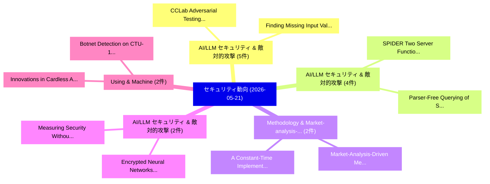

# 📅 02_daily: 日次エグゼクティブサマリー報告書 (2026-05-21)

**集計日時**: 2026-10-02 23:06:11 UTC  
**対象日付**: 2026-05-21  
**本日収集論文数**: 37 件  

---

## 💡 主要セキュリティ動向・脅威インサイト (Executive Insights)

本日の収集論文（計 37 件）において、以下の重点セキュリティ領域で活発な研究動向が確認されました：
- **AI/LLM セキュリティ & 敵対的攻撃** (5 件): 注目論文として 「CCLab: Adversarial Testing of ...」、「Finding Missing Input Validati...」 等が発表され、実務防御および攻撃検証の進展が見られます。
- **AI/LLM セキュリティ & 敵対的攻撃** (4 件): 注目論文として 「SPIDER: Two Server Functionali...」、「Parser-Free Querying of Securi...」 等が発表され、実務防御および攻撃検証の進展が見られます。
- **Methodology & Market-analysis-driven** (2 件): 注目論文として 「Market-Analysis-Driven Methodo...」、「A Constant-Time Implementation...」 等が発表され、実務防御および攻撃検証の進展が見られます。
- **AI/LLM セキュリティ & 敵対的攻撃** (2 件): 注目論文として 「Measuring Security Without Foo...」、「Encrypted Neural Networks with...」 等が発表され、実務防御および攻撃検証の進展が見られます。
- **Using & Machine** (2 件): 注目論文として 「Innovations in Cardless Artifi...」、「Botnet Detection on CTU-13 Usi...」 等が発表され、実務防御および攻撃検証の進展が見られます。

### 🗺️ 技術・脅威トピックマインドマップ

---

## 📌 日次セキュリティ論文一覧 (日本語表形式)

| No | arXiv ID | 論文タイトル (日本語訳) | 重要キーワード | 構造化エグゼクティブ要約 (背景・提案・影響) | 脅威分類 | 詳細リンク |
|---|---|---|---|---|---|---|
| 1 | `2605.21857v1` | [SPIDER: Two Server Functionality for the Cost of Zero（セキュリティ分析論文）](../../okf/papers/2026-05-21/2605.21857.md) | `Two Server Functionality`, `Ofir Dvir`, `Kali Hale` | 【提案】概要 (Overview & Key Finding) 本論文「SPIDER: Two Server Functionality for the Cost of Zero（セ...。実証評価により経営層・セキュリティ管理者向け推奨アクション (E... | `arXiv` | [arXiv](https://arxiv.org/abs/2605.21857v1) &#124; [OKF](../../okf/papers/2026-05-21/2605.21857.md) |
| 2 | `2605.21865v1` | [PEMark: Watermarking API Responses Based on Proxy Gateways and Position Encoding（セキュリティ分析論文）](../../okf/papers/2026-05-21/2605.21865.md) | `Responses Based`, `Proxy Gateways`, `Position Encoding` | 【提案】概要 (Overview & Key Finding) 本論文「PEMark: Watermarking API Responses Based on Proxy Gatew...。実証評価により経営層・セキュリティ管理者向け推奨アクション (E... | `arXiv` | [arXiv](https://arxiv.org/abs/2605.21865v1) &#124; [OKF](../../okf/papers/2026-05-21/2605.21865.md) |
| 3 | `2605.21915v1` | [CCLab: Adversarial Testing of Learning- and Non-Learning-Based Congestion Controllers（セキュリティ分析論文）](../../okf/papers/2026-05-21/2605.21915.md) | `Based Congestion Controllers`, `Adversarial Testing`, `Shehab Sarar Ahmed` | 【提案】概要 (Overview & Key Finding) 本論文「CCLab: Adversarial Testing of Learning- and Non-Learnin...。実証評価により経営層・セキュリティ管理者向け推奨アクション (E... | `arXiv` | [arXiv](https://arxiv.org/abs/2605.21915v1) &#124; [OKF](../../okf/papers/2026-05-21/2605.21915.md) |
| 4 | `2605.21938v1` | [Optimal Guarantees for Auditing Rényi Differentially Private Machine Learning（セキュリティ分析論文）](../../okf/papers/2026-05-21/2605.21938.md) | `Differentially Private Machine Learning`, `Optimal Guarantees`, `Daniel Alabi` | 【提案】概要 (Overview & Key Finding) 本論文「Optimal Guarantees for Auditing Rényi Differentially Pr...。実証評価により経営層・セキュリティ管理者向け推奨アクション (E... | `arXiv` | [arXiv](https://arxiv.org/abs/2605.21938v1) &#124; [OKF](../../okf/papers/2026-05-21/2605.21938.md) |
| 5 | `2605.22001v1` | [Blind Spots in the Guard: How Domain-Camouflaged Injection Attacks Evade Detection in Multi-Agent LLM Systems（セキュリティ分析論文）](../../okf/papers/2026-05-21/2605.22001.md) | `Camouflaged Injection Attacks Evade Detection`, `Blind Spots`, `Domain-Camouflaged Injection` | 【提案】概要 (Overview & Key Finding) 本論文「Blind Spots in the Guard: How Domain-Camouflaged Inject...。実証評価により経営層・セキュリティ管理者向け推奨アクション (E... | `arXiv` | [arXiv](https://arxiv.org/abs/2605.22001v1) &#124; [OKF](../../okf/papers/2026-05-21/2605.22001.md) |
| 6 | `2605.22027v1` | [Parser-Free Querying of Security Logs（セキュリティ分析論文）](../../okf/papers/2026-05-21/2605.22027.md) | `Free Querying`, `Security Logs`, `Parser-Free Querying` | 【提案】概要 (Overview & Key Finding) 本論文「Parser-Free Querying of Security Logs（セキュリティ分析論文）」（原題: ...。実証評価により経営層・セキュリティ管理者向け推奨アクション (E... | `arXiv` | [arXiv](https://arxiv.org/abs/2605.22027v1) &#124; [OKF](../../okf/papers/2026-05-21/2605.22027.md) |
| 7 | `2605.22039v1` | [Secure and Parallel Determinant Computation for Large-Scale Matrices in Edge Environments（セキュリティ分析論文）](../../okf/papers/2026-05-21/2605.22039.md) | `Parallel Determinant Computation`, `Scale Matrices`, `Large-Scale Matrices` | 【提案】概要 (Overview & Key Finding) 本論文「Secure and Parallel Determinant Computation for Large-S...。実証評価により経営層・セキュリティ管理者向け推奨アクション (E... | `arXiv` | [arXiv](https://arxiv.org/abs/2605.22039v1) &#124; [OKF](../../okf/papers/2026-05-21/2605.22039.md) |
| 8 | `2605.22041v1` | [RADAR: Defending RAG Dynamically against Retrieval Corruption（セキュリティ分析論文）](../../okf/papers/2026-05-21/2605.22041.md) | `Retrieval Corruption`, `Ziyuan Chen`, `Yueming Lyu` | 【提案】概要 (Overview & Key Finding) 本論文「RADAR: Defending RAG Dynamically against Retrieval Corr...。実証評価により経営層・セキュリティ管理者向け推奨アクション (E... | `arXiv` | [arXiv](https://arxiv.org/abs/2605.22041v1) &#124; [OKF](../../okf/papers/2026-05-21/2605.22041.md) |
| 9 | `2605.22058v1` | [Finding Missing Input Validation in TEEs via LLM-Assisted Symbolic Execution（セキュリティ分析論文）](../../okf/papers/2026-05-21/2605.22058.md) | `Finding Missing Input Validation`, `Assisted Symbolic Execution`, `LLM-Assisted Symbolic` | 【提案】概要 (Overview & Key Finding) 本論文「Finding Missing Input Validation in TEEs via LLM-Assist...。実証評価により経営層・セキュリティ管理者向け推奨アクション (E... | `arXiv` | [arXiv](https://arxiv.org/abs/2605.22058v1) &#124; [OKF](../../okf/papers/2026-05-21/2605.22058.md) |
| 10 | `2605.22060v1` | [Safeguarding Text-to-Image Generative Models Against Unauthorized Knowledge Distillation（セキュリティ分析論文）](../../okf/papers/2026-05-21/2605.22060.md) | `Safeguarding Text`, `Yilan Gao`, `Sida Huang` | 【提案】概要 (Overview & Key Finding) 本論文「Safeguarding Text-to-Image Generative Models Against Un...。実証評価により経営層・セキュリティ管理者向け推奨アクション (E... | `arXiv` | [arXiv](https://arxiv.org/abs/2605.22060v1) &#124; [OKF](../../okf/papers/2026-05-21/2605.22060.md) |
| 11 | `2605.22087v1` | [Automated Repair of TEE Partitioning Issues via DSL-Guided and LLM-Assisted Patching（セキュリティ分析論文）](../../okf/papers/2026-05-21/2605.22087.md) | `Automated Repair`, `Partitioning Issues`, `Assisted Patching` | 【提案】概要 (Overview & Key Finding) 本論文「Automated Repair of TEE Partitioning Issues via DSL-Gui...。実証評価により経営層・セキュリティ管理者向け推奨アクション (E... | `arXiv` | [arXiv](https://arxiv.org/abs/2605.22087v1) &#124; [OKF](../../okf/papers/2026-05-21/2605.22087.md) |
| 12 | `2605.22113v1` | [QT-PUF: Quantum Tunneling Leakage Based PUF for Implantable IoMT Devices（セキュリティ分析論文）](../../okf/papers/2026-05-21/2605.22113.md) | `Quantum Tunneling Leakage Based`, `Yueqi Ma`, `Vivek Mohan` | 【提案】概要 (Overview & Key Finding) 本論文「QT-PUF: 量子 Tunneling Leakage Based PUF for Implantable ...。実証評価により経営層・セキュリティ管理者向け推奨アクション (E... | `arXiv` | [arXiv](https://arxiv.org/abs/2605.22113v1) &#124; [OKF](../../okf/papers/2026-05-21/2605.22113.md) |
| 13 | `2605.22119v2` | [Human Vulnerability Assessment in サイバーセキュリティ: A Systematic Literature Review of Methods, Models, and Instruments](../../okf/papers/2026-05-21/2605.22119.md) | `Human Vulnerability Assessment`, `Systematic Literature Review`, `Michail Alexandros Kourtis` | 【提案】概要 (Overview & Key Finding) 本論文「Human 脆弱性 Assessment in サイバーセキュリティ: A Systematic Litera...。実証評価により経営層・セキュリティ管理者向け推奨アクション (E... | `arXiv` | [arXiv](https://arxiv.org/abs/2605.22119v2) &#124; [OKF](../../okf/papers/2026-05-21/2605.22119.md) |
| 14 | `2605.22122v1` | [Adversarial Trust Poisoning in Vehicular Collaborative Perception（セキュリティ分析論文）](../../okf/papers/2026-05-21/2605.22122.md) | `Adversarial Trust Poisoning`, `Vehicular Collaborative Perception`, `Yutong Liu` | 【提案】概要 (Overview & Key Finding) 本論文「Adversarial Trust Poisoning in Vehicular Collaborative ...。実証評価によりLi, Qingzhao Zhang - **公開... | `arXiv` | [arXiv](https://arxiv.org/abs/2605.22122v1) &#124; [OKF](../../okf/papers/2026-05-21/2605.22122.md) |
| 15 | `2605.22151v1` | [Market-Analysis-Driven Methodology for Assessing Charging Station サイバーセキュリティ](../../okf/papers/2026-05-21/2605.22151.md) | `Driven Methodology`, `Assessing Charging Station Cybersecurity`, `Assessing Charging Station` | 【提案】概要 (Overview & Key Finding) 本論文「Market-Analysis-Driven Methodology for Assessing Chargi...。実証評価により経営層・セキュリティ管理者向け推奨アクション (E... | `arXiv` | [arXiv](https://arxiv.org/abs/2605.22151v1) &#124; [OKF](../../okf/papers/2026-05-21/2605.22151.md) |
| 16 | `2605.22237v2` | [Decision-Aware Quadratic ReLU Replacement for HE-Friendly Inference（セキュリティ分析論文）](../../okf/papers/2026-05-21/2605.22237.md) | `Aware Quadratic`, `Friendly Inference`, `Decision-Aware Quadratic` | 【提案】概要 (Overview & Key Finding) 本論文「Decision-Aware Quadratic ReLU Replacement for HE-Friend...。実証評価により経営層・セキュリティ管理者向け推奨アクション (E... | `arXiv` | [arXiv](https://arxiv.org/abs/2605.22237v2) &#124; [OKF](../../okf/papers/2026-05-21/2605.22237.md) |
| 17 | `2605.22321v2` | [ASEval: Automated Trajectory-Level Security Testing for Autonomous Agents（セキュリティ分析論文）](../../okf/papers/2026-05-21/2605.22321.md) | `Level Security Testing`, `Automated Trajectory`, `Trajectory-Level Security` | 【提案】概要 (Overview & Key Finding) 本論文「ASEval: Automated Trajectory-Level Security Testing for...。実証評価により経営層・セキュリティ管理者向け推奨アクション (E... | `arXiv` | [arXiv](https://arxiv.org/abs/2605.22321v2) &#124; [OKF](../../okf/papers/2026-05-21/2605.22321.md) |
| 18 | `2605.22324v1` | [PACT: Reducing Alert Fatigue in Low-Prevalence SOC Streams with Triggered Active Learning（セキュリティ分析論文）](../../okf/papers/2026-05-21/2605.22324.md) | `Reducing Alert Fatigue`, `Triggered Active Learning`, `Low-Prevalence SOC` | 【提案】概要 (Overview & Key Finding) 本論文「PACT: Reducing Alert Fatigue in Low-Prevalence SOC Stre...。実証評価により経営層・セキュリティ管理者向け推奨アクション (E... | `arXiv` | [arXiv](https://arxiv.org/abs/2605.22324v1) &#124; [OKF](../../okf/papers/2026-05-21/2605.22324.md) |
| 19 | `2605.22332v2` | [Building Europe's Quantum Shield: The Strategic view for a Continent-Wide Quantum Key Distribution (QKD) Infrastructure（セキュリティ分析論文）](../../okf/papers/2026-05-21/2605.22332.md) | `Wide Quantum Key Distribution`, `Building Europe`, `Quantum Shield` | 【提案】概要 (Overview & Key Finding) 本論文「Building Europe's 量子 Shield: The Strategic view for a C...。実証評価により経営層・セキュリティ管理者向け推奨アクション (E... | `arXiv` | [arXiv](https://arxiv.org/abs/2605.22332v2) &#124; [OKF](../../okf/papers/2026-05-21/2605.22332.md) |
| 20 | `2605.22333v1` | [A First Measurement Study on Authentication Security in Real-World Remote MCP Servers（セキュリティ分析論文）](../../okf/papers/2026-05-21/2605.22333.md) | `Authentication Security`, `World Remote`, `Real-World Remote` | 【提案】概要 (Overview & Key Finding) 本論文「A First Measurement Study on Authentication Security in...。実証評価により経営層・セキュリティ管理者向け推奨アクション (E... | `arXiv` | [arXiv](https://arxiv.org/abs/2605.22333v1) &#124; [OKF](../../okf/papers/2026-05-21/2605.22333.md) |
| 21 | `2605.22365v2` | [TimeGuard: Channel-wise Pool Training for Backdoor Defense in Time Series Forecasting（セキュリティ分析論文）](../../okf/papers/2026-05-21/2605.22365.md) | `Time Series Forecasting`, `Channel-wise Pool`, `Pool Training` | 【提案】概要 (Overview & Key Finding) 本論文「TimeGuard: Channel-wise Pool Training for Backdoor Defe...。実証評価により経営層・セキュリティ管理者向け推奨アクション (E... | `arXiv` | [arXiv](https://arxiv.org/abs/2605.22365v2) &#124; [OKF](../../okf/papers/2026-05-21/2605.22365.md) |
| 22 | `2605.22437v1` | [Characterizing the Fault Response of the Intel Neural Compute Stick 2 Under Single-Pulse Electromagnetic Fault Injection（セキュリティ分析論文）](../../okf/papers/2026-05-21/2605.22437.md) | `Intel Neural Compute Stick`, `Pulse Electromagnetic Fault Injection`, `Fault Response` | 【提案】概要 (Overview & Key Finding) 本論文「Characterizing the Fault Response of the Intel Neural C...。実証評価により経営層・セキュリティ管理者向け推奨アクション (E... | `arXiv` | [arXiv](https://arxiv.org/abs/2605.22437v1) &#124; [OKF](../../okf/papers/2026-05-21/2605.22437.md) |
| 23 | `2605.22441v1` | [A Constant-Time Implementation Methodology for Activation Functions on Microcontrollers（セキュリティ分析論文）](../../okf/papers/2026-05-21/2605.22441.md) | `Time Implementation Methodology`, `Activation Functions`, `Constant-Time Implementation` | 【提案】概要 (Overview & Key Finding) 本論文「A Constant-Time Implementation Methodology for Activati...。実証評価により経営層・セキュリティ管理者向け推奨アクション (E... | `arXiv` | [arXiv](https://arxiv.org/abs/2605.22441v1) &#124; [OKF](../../okf/papers/2026-05-21/2605.22441.md) |
| 24 | `2605.22477v1` | [Exact Hidden Paths in Noisy High Dimensional Path Spaces（セキュリティ分析論文）](../../okf/papers/2026-05-21/2605.22477.md) | `Noisy High Dimensional Path Spaces`, `Exact Hidden Paths`, `Victor Duarte Melo` | 【提案】概要 (Overview & Key Finding) 本論文「Exact Hidden Paths in Noisy High Dimensional Path Space...。実証評価により経営層・セキュリティ管理者向け推奨アクション (E... | `arXiv` | [arXiv](https://arxiv.org/abs/2605.22477v1) &#124; [OKF](../../okf/papers/2026-05-21/2605.22477.md) |
| 25 | `2605.22506v1` | [EnCAgg: Enhanced Clustering Aggregation for Robust 連合学習 against Dynamic Model Poisoning](../../okf/papers/2026-05-21/2605.22506.md) | `Enhanced Clustering Aggregation`, `Dynamic Model Poisoning`, `Robust Federated Learning` | 【提案】概要 (Overview & Key Finding) 本論文「EnCAgg: Enhanced Clustering Aggregation for Robust 連合学習...。実証評価により経営層・セキュリティ管理者向け推奨アクション (E... | `arXiv` | [arXiv](https://arxiv.org/abs/2605.22506v1) &#124; [OKF](../../okf/papers/2026-05-21/2605.22506.md) |
| 26 | `2605.22568v1` | [Measuring Security Without Fooling Ourselves: Why Agents Is Hardのベンチマーク評価](../../okf/papers/2026-05-21/2605.22568.md) | `Sahar Abdelnabi`, `Chris Hicks`, `Konrad Rieck` | 【提案】背景とセキュリティ上の課題 (Background & Problem) 本研究はサイバー脅威環境におけるセキュリティ構造・脆弱性の検証を目的としています。(主要検出項目: ...。実証評価により経営層・セキュリティ管理者向け推奨アクション (E... | `arXiv` | [arXiv](https://arxiv.org/abs/2605.22568v1) &#124; [OKF](../../okf/papers/2026-05-21/2605.22568.md) |
| 27 | `2605.22569v1` | [A Formal Basis for Quantum Cryptographic Exposure Measurement under HNDL Threat（セキュリティ分析論文）](../../okf/papers/2026-05-21/2605.22569.md) | `Quantum Cryptographic Exposure Measurement`, `Formal Basis`, `Rafael Duarte Marcelino` | 【提案】概要 (Overview & Key Finding) 本論文「A Formal Basis for 量子 Cryptographic Exposure Measuremen...。実証評価により経営層・セキュリティ管理者向け推奨アクション (E... | `arXiv` | [arXiv](https://arxiv.org/abs/2605.22569v1) &#124; [OKF](../../okf/papers/2026-05-21/2605.22569.md) |
| 28 | `2605.22590v1` | [Building an Open Source Operational Technology Pentesting Platform: Lessons from LINICS（セキュリティ分析論文）](../../okf/papers/2026-05-21/2605.22590.md) | `Open Source Operational Technology Pentesting Platform`, `Awais Rashid`, `Joseph Gardiner` | 【提案】概要 (Overview & Key Finding) 本論文「Building an Open Source Operational Technology Pentesti...。実証評価により経営層・セキュリティ管理者向け推奨アクション (E... | `arXiv` | [arXiv](https://arxiv.org/abs/2605.22590v1) &#124; [OKF](../../okf/papers/2026-05-21/2605.22590.md) |
| 29 | `2605.22604v1` | [Innovations in Cardless Artificial Intelligence Banking: A Comprehensive Framework for Cyber Secure and Fraud Mitigation using Machine Learning Algorithms（セキュリティ分析論文）](../../okf/papers/2026-05-21/2605.22604.md) | `Cardless Artificial Intelligence Banking`, `Machine Learning Algorithms`, `Cyber Secure` | 【提案】概要 (Overview & Key Finding) 本論文「Innovations in Cardless Artificial Intelligence Banking...。実証評価により経営層・セキュリティ管理者向け推奨アクション (E... | `arXiv` | [arXiv](https://arxiv.org/abs/2605.22604v1) &#124; [OKF](../../okf/papers/2026-05-21/2605.22604.md) |
| 30 | `2605.22621v1` | [UNAD+: An Explainable Hybrid Framework for Unknown Network Attack Detection（セキュリティ分析論文）](../../okf/papers/2026-05-21/2605.22621.md) | `Unknown Network Attack Detection`, `Saif Alzubi`, `Frederic Stahl` | 【提案】概要 (Overview & Key Finding) 本論文「UNAD+: An Explainable Hybrid Framework for Unknown Netw...。実証評価により経営層・セキュリティ管理者向け推奨アクション (E... | `arXiv` | [arXiv](https://arxiv.org/abs/2605.22621v1) &#124; [OKF](../../okf/papers/2026-05-21/2605.22621.md) |
| 31 | `2605.22709v1` | [TriSweep: A Four-Drone Swarm Framework for Electromagnetic Side-Channel Analysis（セキュリティ分析論文）](../../okf/papers/2026-05-21/2605.22709.md) | `Electromagnetic Side`, `Four-Drone Swarm`, `Eric Yocam` | 【提案】概要 (Overview & Key Finding) 本論文「TriSweep: A Four-Drone Swarm Framework for Electromagne...。実証評価により経営層・セキュリティ管理者向け推奨アクション (E... | `arXiv` | [arXiv](https://arxiv.org/abs/2605.22709v1) &#124; [OKF](../../okf/papers/2026-05-21/2605.22709.md) |
| 32 | `2605.22985v1` | [Beyond Zero: Enterprise Security for the AI Era（セキュリティ分析論文）](../../okf/papers/2026-05-21/2605.22985.md) | `Beyond Zero`, `Enterprise Security`, `Joseph Valente` | 【提案】概要 (Overview & Key Finding) 本論文「Beyond Zero: Enterprise Security for the AI Era（セキュリティ分...。実証評価により経営層・セキュリティ管理者向け推奨アクション (E... | `arXiv` | [arXiv](https://arxiv.org/abs/2605.22985v1) &#124; [OKF](../../okf/papers/2026-05-21/2605.22985.md) |
| 33 | `2605.23004v2` | [Botnet Detection on CTU-13 Using Lightweight Machine Learning Models（セキュリティ分析論文）](../../okf/papers/2026-05-21/2605.23004.md) | `Using Lightweight Machine Learning Models`, `Botnet Detection`, `CTU-13 Using` | 【提案】概要 (Overview & Key Finding) 本論文「Botnet Detection on CTU-13 Using Lightweight Machine Le...。実証評価により経営層・セキュリティ管理者向け推奨アクション (E... | `arXiv` | [arXiv](https://arxiv.org/abs/2605.23004v2) &#124; [OKF](../../okf/papers/2026-05-21/2605.23004.md) |
| 34 | `2605.23059v1` | [BYOT-CPS: A Hybrid Cyber-Physical Systems Testbed for IoT Security Assessment and Platform Evaluation（セキュリティ分析論文）](../../okf/papers/2026-05-21/2605.23059.md) | `Physical Systems Testbed`, `Hybrid Cyber`, `Security Assessment` | 【提案】概要 (Overview & Key Finding) 本論文「BYOT-CPS: A Hybrid Cyber-Physical Systems Testbed for I...。実証評価により経営層・セキュリティ管理者向け推奨アクション (E... | `arXiv` | [arXiv](https://arxiv.org/abs/2605.23059v1) &#124; [OKF](../../okf/papers/2026-05-21/2605.23059.md) |
| 35 | `2605.23091v1` | [Security of LLM-generated Code: A Comparative Analysis（セキュリティ分析論文）](../../okf/papers/2026-05-21/2605.23091.md) | `LLM-generated Code`, `Mahmoud Selim`, `Hala Assal` | 【提案】概要 (Overview & Key Finding) 本論文「Security of LLM-generated Code: A Comparative Analysis（...。実証評価により経営層・セキュリティ管理者向け推奨アクション (E... | `arXiv` | [arXiv](https://arxiv.org/abs/2605.23091v1) &#124; [OKF](../../okf/papers/2026-05-21/2605.23091.md) |
| 36 | `2605.23096v1` | [Encrypted Neural Networks without Overflows（セキュリティ分析論文）](../../okf/papers/2026-05-21/2605.23096.md) | `Encrypted Neural Networks`, `Philipp Kern`, `Lorenzo Rovida` | 【提案】背景とセキュリティ上の課題 (Background & Problem) 本研究はサイバー脅威環境におけるセキュリティ構造・脆弱性の検証を目的としています。(主要検出項目: ...。実証評価により経営層・セキュリティ管理者向け推奨アクション (E... | `arXiv` | [arXiv](https://arxiv.org/abs/2605.23096v1) &#124; [OKF](../../okf/papers/2026-05-21/2605.23096.md) |
| 37 | `2605.28860v2` | [Mechanistic origins of catastrophic forgetting: why RL preserves circuits better than SFT?（セキュリティ分析論文）](../../okf/papers/2026-05-21/2605.28860.md) | `Jeanmely Rojas Nunez`, `Viraj Sawant`, `Nathan Allen` | 【提案】### (日本語題名: Mechanistic origins of catastrophic forgetting: why RL preserves circuits b...。実証評価により経営層・セキュリティ管理者向け推奨アクション (E... | `arXiv` | [arXiv](https://arxiv.org/abs/2605.28860v2) &#124; [OKF](../../okf/papers/2026-05-21/2605.28860.md) |

