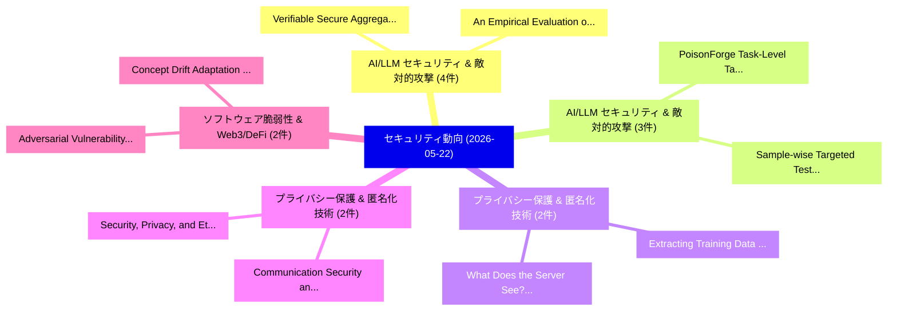

# 📅 02_daily: 日次エグゼクティブサマリー報告書 (2026-05-22)

**集計日時**: 2026-10-02 23:06:11 UTC  
**対象日付**: 2026-05-22  
**本日収集論文数**: 38 件  

---

## 💡 主要セキュリティ動向・脅威インサイト (Executive Insights)

本日の収集論文（計 38 件）において、以下の重点セキュリティ領域で活発な研究動向が確認されました：
- **AI/LLM セキュリティ & 敵対的攻撃** (4 件): 注目論文として 「Verifiable Secure Aggregation ...」、「An Empirical Evaluation of LLM...」 等が発表され、実務防御および攻撃検証の進展が見られます。
- **AI/LLM セキュリティ & 敵対的攻撃** (3 件): 注目論文として 「PoisonForge: Task-Level Target...」、「Sample-wise Targeted Test-time...」 等が発表され、実務防御および攻撃検証の進展が見られます。
- **プライバシー保護 & 匿名化技術** (2 件): 注目論文として 「What Does the Server See? Unde...」、「Extracting Training Data from ...」 等が発表され、実務防御および攻撃検証の進展が見られます。
- **プライバシー保護 & 匿名化技術** (2 件): 注目論文として 「Security, Privacy, and Ethical...」、「Communication Security and Sen...」 等が発表され、実務防御および攻撃検証の進展が見られます。
- **ソフトウェア脆弱性 & Web3/DeFi** (2 件): 注目論文として 「Adversarial Vulnerability Unde...」、「Concept Drift Adaptation Using...」 等が発表され、実務防御および攻撃検証の進展が見られます。

### 🗺️ 技術・脅威トピックマインドマップ

---

## 📌 日次セキュリティ論文一覧 (日本語表形式)

| No | arXiv ID | 論文タイトル (日本語訳) | 重要キーワード | 構造化エグゼクティブ要約 (背景・提案・影響) | 脅威分類 | 詳細リンク |
|---|---|---|---|---|---|---|
| 1 | `2605.23130v2` | [From Preventive to Reactive: How AI Coding Assistants Transform Developers' Security Awareness（セキュリティ分析論文）](../../okf/papers/2026-05-22/2605.23130.md) | `Coding Assistants Transform Developers`, `Security Awareness`, `Faisal Haque Bappy` | 【提案】概要 (Overview & Key Finding) 本論文「From Preventive to Reactive: How AI Coding Assistants T...。実証評価により経営層・セキュリティ管理者向け推奨アクション (E... | `arXiv` | [arXiv](https://arxiv.org/abs/2605.23130v2) &#124; [OKF](../../okf/papers/2026-05-22/2605.23130.md) |
| 2 | `2605.23158v1` | [What Does the Server See? Understanding Privacy Leakage from 大規模言語モデル in Split Inference](../../okf/papers/2026-05-22/2605.23158.md) | `Understanding Privacy Leakage`, `Server See`, `Split Inference` | 【提案】Understanding Privacy Leakage from Large Language Models in Split Inference ### (日本語題名:...。実証評価により経営層・セキュリティ管理者向け推奨アクション (E... | `arXiv` | [arXiv](https://arxiv.org/abs/2605.23158v1) &#124; [OKF](../../okf/papers/2026-05-22/2605.23158.md) |
| 3 | `2605.23162v2` | [SolarChain: A Physics-Grounded Embodied IoT System for Verifiable Urban Solar Market Design（セキュリティ分析論文）](../../okf/papers/2026-05-22/2605.23162.md) | `Verifiable Urban Solar Market Design`, `Grounded Embodied`, `Physics-Grounded Embodied` | 【提案】概要 (Overview & Key Finding) 本論文「SolarChain: A Physics-Grounded Embodied IoT System for ...。実証評価により経営層・セキュリティ管理者向け推奨アクション (E... | `arXiv` | [arXiv](https://arxiv.org/abs/2605.23162v2) &#124; [OKF](../../okf/papers/2026-05-22/2605.23162.md) |
| 4 | `2605.23168v1` | [PoisonForge: Task-Level Targeted Poisoning Benchmark for Instruction-Tuned LLMs（セキュリティ分析論文）](../../okf/papers/2026-05-22/2605.23168.md) | `Level Targeted Poisoning Benchmark`, `Task-Level Targeted`, `Instruction-Tuned LLMs` | 【提案】概要 (Overview & Key Finding) 本論文「PoisonForge: Task-Level Targeted Poisoning Benchmark fo...。実証評価により経営層・セキュリティ管理者向け推奨アクション (E... | `arXiv` | [arXiv](https://arxiv.org/abs/2605.23168v1) &#124; [OKF](../../okf/papers/2026-05-22/2605.23168.md) |
| 5 | `2605.23175v1` | [Robust LLM Watermarking with Minimal Semantic Distortion for IP Protection（セキュリティ分析論文）](../../okf/papers/2026-05-22/2605.23175.md) | `Minimal Semantic Distortion`, `Kieu Dang`, `Phung Lai` | 【提案】概要 (Overview & Key Finding) 本論文「Robust LLM Watermarking with Minimal Semantic Distortio...。実証評価により経営層・セキュリティ管理者向け推奨アクション (E... | `arXiv` | [arXiv](https://arxiv.org/abs/2605.23175v1) &#124; [OKF](../../okf/papers/2026-05-22/2605.23175.md) |
| 6 | `2605.23196v1` | [Prompt Overflow: What the Guardrail Inspects Is Not What the Model Infers（セキュリティ分析論文）](../../okf/papers/2026-05-22/2605.23196.md) | `Prompt Overflow`, `Model Infers`, `Yuanbo Zhou` | 【提案】背景とセキュリティ上の課題 (Background & Problem) 本研究はサイバー脅威環境におけるセキュリティ構造・脆弱性の検証を目的としています。(主要検出項目: ...。実証評価により経営層・セキュリティ管理者向け推奨アクション (E... | `arXiv` | [arXiv](https://arxiv.org/abs/2605.23196v1) &#124; [OKF](../../okf/papers/2026-05-22/2605.23196.md) |
| 7 | `2605.23224v1` | [On APN Exponents and the Differential and Boomerang Properties of Binomials in Characteristic 3（セキュリティ分析論文）](../../okf/papers/2026-05-22/2605.23224.md) | `Boomerang Properties`, `Namhun Koo`, `Soonhak Kwon` | 【提案】概要 (Overview & Key Finding) 本論文「On APN Exponents and the Differential and Boomerang Pro...。実証評価により経営層・セキュリティ管理者向け推奨アクション (E... | `arXiv` | [arXiv](https://arxiv.org/abs/2605.23224v1) &#124; [OKF](../../okf/papers/2026-05-22/2605.23224.md) |
| 8 | `2605.23243v5` | [Are Frontier LLMs Ready for サイバーセキュリティ? Evidence for Vertical Foundation Models from Dual-Mode Vulnerability Benchmarks](../../okf/papers/2026-05-22/2605.23243.md) | `Vertical Foundation Models`, `Mode Vulnerability Benchmarks`, `Dual-Mode Vulnerability` | 【提案】Evidence for Vertical Foundation Models from Dual-Mode 脆弱性 Benchmarks ### (日本語題名: Are F...。実証評価により経営層・セキュリティ管理者向け推奨アクション (E... | `arXiv` | [arXiv](https://arxiv.org/abs/2605.23243v5) &#124; [OKF](../../okf/papers/2026-05-22/2605.23243.md) |
| 9 | `2605.23316v2` | [Formal Verification of Probing Security via Conditional Independence（セキュリティ分析論文）](../../okf/papers/2026-05-22/2605.23316.md) | `Formal Verification`, `Probing Security`, `Conditional Independence` | 【提案】概要 (Overview & Key Finding) 本論文「Formal Verification of Probing Security via Conditional...。実証評価により経営層・セキュリティ管理者向け推奨アクション (E... | `arXiv` | [arXiv](https://arxiv.org/abs/2605.23316v2) &#124; [OKF](../../okf/papers/2026-05-22/2605.23316.md) |
| 10 | `2605.23330v1` | [Security, Privacy, and Ethical Risks in OpenClaw（セキュリティ分析論文）](../../okf/papers/2026-05-22/2605.23330.md) | `Ethical Risks`, `Yutong Jin`, `Zelin Zhang` | 【提案】概要 (Overview & Key Finding) 本論文「Security, Privacy, and Ethical Risks in OpenClaw（セキュリティ...。実証評価により経営層・セキュリティ管理者向け推奨アクション (E... | `arXiv` | [arXiv](https://arxiv.org/abs/2605.23330v1) &#124; [OKF](../../okf/papers/2026-05-22/2605.23330.md) |
| 11 | `2605.23411v1` | [Sample-wise Targeted Test-time Adaptationに対する敵対的攻撃](../../okf/papers/2026-05-22/2605.23411.md) | `Sample-wise Targeted`, `Targeted Adversarial Attacks`, `Targeted Test` | 【提案】概要 (Overview & Key Finding) 本論文「Sample-wise Targeted Test-time Adaptationに対する敵対的攻撃」（原題:...。実証評価により経営層・セキュリティ管理者向け推奨アクション (E... | `arXiv` | [arXiv](https://arxiv.org/abs/2605.23411v1) &#124; [OKF](../../okf/papers/2026-05-22/2605.23411.md) |
| 12 | `2605.23429v3` | [Communication Security and Sensing Privacy in FMCW-Based ISAC Through Signal Modulation（セキュリティ分析論文）](../../okf/papers/2026-05-22/2605.23429.md) | `Communication Security`, `Sensing Privacy`, `FMCW-Based ISAC` | 【提案】概要 (Overview & Key Finding) 本論文「Communication Security and Sensing Privacy in FMCW-Base...。実証評価により経営層・セキュリティ管理者向け推奨アクション (E... | `arXiv` | [arXiv](https://arxiv.org/abs/2605.23429v3) &#124; [OKF](../../okf/papers/2026-05-22/2605.23429.md) |
| 13 | `2605.23448v1` | [AI Security Research Should Better Incentivize Defense Research（セキュリティ分析論文）](../../okf/papers/2026-05-22/2605.23448.md) | `Youqian Zhang`, `Raw Meta`, `Executive Summary` | 【提案】概要 (Overview & Key Finding) 本論文「AI Security Research Should Better Incentivize Defense ...。実証評価により経営層・セキュリティ管理者向け推奨アクション (E... | `arXiv` | [arXiv](https://arxiv.org/abs/2605.23448v1) &#124; [OKF](../../okf/papers/2026-05-22/2605.23448.md) |
| 14 | `2605.23598v1` | [When Youth Enter the Algorithmic Wild: Discovering and Understanding Potentially Harmful Teen Videos on Douyin and Kwai（セキュリティ分析論文）](../../okf/papers/2026-05-22/2605.23598.md) | `Understanding Potentially Harmful Teen Videos`, `Algorithmic Wild`, `Shaoxuan Zhou` | 【提案】概要 (Overview & Key Finding) 本論文「When Youth Enter the Algorithmic Wild: Discovering and ...。実証評価により経営層・セキュリティ管理者向け推奨アクション (E... | `arXiv` | [arXiv](https://arxiv.org/abs/2605.23598v1) &#124; [OKF](../../okf/papers/2026-05-22/2605.23598.md) |
| 15 | `2605.23623v1` | [Adversarial Vulnerability Under Temporal Concept Drift: A Longitudinal Study of Android マルウェア検出](../../okf/papers/2026-05-22/2605.23623.md) | `Android Malware Detection`, `Ahmed Sabbah`, `Mohammed Kharma` | 【提案】概要 (Overview & Key Finding) 本論文「Adversarial 脆弱性 Under Temporal Concept Drift: A Longitu...。実証評価により経営層・セキュリティ管理者向け推奨アクション (E... | `arXiv` | [arXiv](https://arxiv.org/abs/2605.23623v1) &#124; [OKF](../../okf/papers/2026-05-22/2605.23623.md) |
| 16 | `2605.23640v1` | [CachePrune: Privacy-Aware and Fine-Grained KV Cache Sharing for Efficient LLM Inference（セキュリティ分析論文）](../../okf/papers/2026-05-22/2605.23640.md) | `Cache Sharing`, `Fine-Grained KV`, `Guanlong Wu` | 【提案】概要 (Overview & Key Finding) 本論文「CachePrune: Privacy-Aware and Fine-Grained KV Cache Sha...。実証評価により経営層・セキュリティ管理者向け推奨アクション (E... | `arXiv` | [arXiv](https://arxiv.org/abs/2605.23640v1) &#124; [OKF](../../okf/papers/2026-05-22/2605.23640.md) |
| 17 | `2605.23641v1` | [Kernel-Based ReLU Approximation for Homomorphic Encryption-Compatible Privacy-preserving Deep Learning Models（セキュリティ分析論文）](../../okf/papers/2026-05-22/2605.23641.md) | `Deep Learning Models`, `Homomorphic Encryption`, `Compatible Privacy` | 【提案】概要 (Overview & Key Finding) 本論文「Kernel-Based ReLU Approximation for 準同型暗号-Compatible Pr...。実証評価により経営層・セキュリティ管理者向け推奨アクション (E... | `arXiv` | [arXiv](https://arxiv.org/abs/2605.23641v1) &#124; [OKF](../../okf/papers/2026-05-22/2605.23641.md) |
| 18 | `2605.23643v1` | [Less Effort, Shorter Proofs: Reinforcement Learning for Security Protocol Analysis in Tamarin（セキュリティ分析論文）](../../okf/papers/2026-05-22/2605.23643.md) | `Less Effort`, `Shorter Proofs`, `Reinforcement Learning` | 【提案】概要 (Overview & Key Finding) 本論文「Less Effort, Shorter Proofs: Reinforcement Learning for...。実証評価により経営層・セキュリティ管理者向け推奨アクション (E... | `arXiv` | [arXiv](https://arxiv.org/abs/2605.23643v1) &#124; [OKF](../../okf/papers/2026-05-22/2605.23643.md) |
| 19 | `2605.23695v1` | [Validating Threat Modeling Results with the Help of Vulnerable Test Applications（セキュリティ分析論文）](../../okf/papers/2026-05-22/2605.23695.md) | `Vulnerable Test Applications`, `Felix Viktor Jedrzejewski`, `Oleksandr Adamov` | 【提案】概要 (Overview & Key Finding) 本論文「Validating 脅威 Modeling Results with the Help of Vulnera...。実証評価により経営層・セキュリティ管理者向け推奨アクション (E... | `arXiv` | [arXiv](https://arxiv.org/abs/2605.23695v1) &#124; [OKF](../../okf/papers/2026-05-22/2605.23695.md) |
| 20 | `2605.23843v1` | [A blueprint for constructing 3-pass AKE protocols under commitment-based models（セキュリティ分析論文）](../../okf/papers/2026-05-22/2605.23843.md) | `3-pass AKE`, `commitment-based models`, `Raw Meta` | 【提案】概要 (Overview & Key Finding) 本論文「A blueprint for constructing 3-pass AKE protocols under...。実証評価により経営層・セキュリティ管理者向け推奨アクション (E... | `arXiv` | [arXiv](https://arxiv.org/abs/2605.23843v1) &#124; [OKF](../../okf/papers/2026-05-22/2605.23843.md) |
| 21 | `2605.23879v1` | [On the Stability of Spherical Hellinger-Kantorovich Flows and Their Implications for Differential Privacy（セキュリティ分析論文）](../../okf/papers/2026-05-22/2605.23879.md) | `Spherical Hellinger`, `Kantorovich Flows`, `Hellinger-Kantorovich Flows` | 【提案】概要 (Overview & Key Finding) 本論文「On the Stability of Spherical Hellinger-Kantorovich Flo...。実証評価により経営層・セキュリティ管理者向け推奨アクション (E... | `math.ST` | [arXiv](https://arxiv.org/abs/2605.23879v1) &#124; [OKF](../../okf/papers/2026-05-22/2605.23879.md) |
| 22 | `2605.23887v1` | [CHRONOS: Temporally-Aware Multi-Agent Coordination for Evolving Data Marketplaces（セキュリティ分析論文）](../../okf/papers/2026-05-22/2605.23887.md) | `Evolving Data Marketplaces`, `Aware Multi`, `Agent Coordination` | 【提案】概要 (Overview & Key Finding) 本論文「CHRONOS: Temporally-Aware Multi-Agent Coordination for ...。実証評価により経営層・セキュリティ管理者向け推奨アクション (E... | `arXiv` | [arXiv](https://arxiv.org/abs/2605.23887v1) &#124; [OKF](../../okf/papers/2026-05-22/2605.23887.md) |
| 23 | `2605.24054v1` | [Verifiable Secure Aggregation via Dual Servers with Linear Tags in 連合学習](../../okf/papers/2026-05-22/2605.24054.md) | `Verifiable Secure Aggregation`, `Dual Servers`, `Linear Tags` | 【提案】概要 (Overview & Key Finding) 本論文「Verifiable Secure Aggregation via Dual Servers with Lin...。実証評価により経営層・セキュリティ管理者向け推奨アクション (E... | `arXiv` | [arXiv](https://arxiv.org/abs/2605.24054v1) &#124; [OKF](../../okf/papers/2026-05-22/2605.24054.md) |
| 24 | `2605.24063v1` | [MicroCloud Cryptographic Workloads for Privacy-Preserving Healthcare IoTのベンチマーク評価](../../okf/papers/2026-05-22/2605.24063.md) | `Preserving Healthcare`, `Privacy-Preserving Healthcare`, `Microbenchmarking Cloud Cryptographic Workloads` | 【提案】概要 (Overview & Key Finding) 本論文「MicroCloud Cryptographic Workloads for Privacy-Preservi...。実証評価により経営層・セキュリティ管理者向け推奨アクション (E... | `arXiv` | [arXiv](https://arxiv.org/abs/2605.24063v1) &#124; [OKF](../../okf/papers/2026-05-22/2605.24063.md) |
| 25 | `2605.24069v1` | [When the Manual Lies: A Realistic Benchmark to Evaluate MCP Poisoning Attacks for LLMエージェント](../../okf/papers/2026-05-22/2605.24069.md) | `Manual Lies`, `Realistic Benchmark`, `Poisoning Attacks` | 【提案】概要 (Overview & Key Finding) 本論文「When the Manual Lies: A Realistic Benchmark to Evaluate...。実証評価により経営層・セキュリティ管理者向け推奨アクション (E... | `arXiv` | [arXiv](https://arxiv.org/abs/2605.24069v1) &#124; [OKF](../../okf/papers/2026-05-22/2605.24069.md) |
| 26 | `2605.24166v2` | [Optimal Quantum Differential Privacy via Fisher Information Spectral Analysis（セキュリティ分析論文）](../../okf/papers/2026-05-22/2605.24166.md) | `Optimal Quantum Differential Privacy`, `Godfred Manu Addo Boakye`, `Justice Owusu Agyemang` | 【提案】概要 (Overview & Key Finding) 本論文「Optimal 量子 差分プライバシー via Fisher Information Spectral Ana...。実証評価により経営層・セキュリティ管理者向け推奨アクション (E... | `arXiv` | [arXiv](https://arxiv.org/abs/2605.24166v2) &#124; [OKF](../../okf/papers/2026-05-22/2605.24166.md) |
| 27 | `2605.24173v1` | [Extracting Training Data from Diffusion Language Models via Infilling（セキュリティ分析論文）](../../okf/papers/2026-05-22/2605.24173.md) | `Extracting Training Data`, `Diffusion Language Models`, `Yihan Wang` | 【提案】概要 (Overview & Key Finding) 本論文「Extracting Training Data from Diffusion Language Models...。実証評価によりAsokan - **公開日時**: `2026-... | `arXiv` | [arXiv](https://arxiv.org/abs/2605.24173v1) &#124; [OKF](../../okf/papers/2026-05-22/2605.24173.md) |
| 28 | `2605.24190v1` | [サイバーセキュリティ of Electric Vehicle Charging Infrastructure: Recent Advances, Open Challenges, and Future Directions](../../okf/papers/2026-05-22/2605.24190.md) | `Electric Vehicle Charging Infrastructure`, `Recent Advances`, `Open Challenges` | 【提案】概要 (Overview & Key Finding) 本論文「サイバーセキュリティ of Electric Vehicle Charging Infrastructure:...。実証評価により経営層・セキュリティ管理者向け推奨アクション (E... | `arXiv` | [arXiv](https://arxiv.org/abs/2605.24190v1) &#124; [OKF](../../okf/papers/2026-05-22/2605.24190.md) |
| 29 | `2605.24206v1` | [FALCON-C: Flow-based Analysis and Labeling for Connected Vehicular Network サイバーセキュリティ](../../okf/papers/2026-05-22/2605.24206.md) | `Connected Vehicular Network Cybersecurity`, `Connected Vehicular Network`, `Dimitrios Michael Manias` | 【提案】概要 (Overview & Key Finding) 本論文「FALCON-C: Flow-based Analysis and Labeling for Connecte...。実証評価により経営層・セキュリティ管理者向け推奨アクション (E... | `arXiv` | [arXiv](https://arxiv.org/abs/2605.24206v1) &#124; [OKF](../../okf/papers/2026-05-22/2605.24206.md) |
| 30 | `2605.24216v1` | [Agent-ToM: Learning to Monitor Autonomous LLMエージェント via Theory-of-Mind Reasoning](../../okf/papers/2026-05-22/2605.24216.md) | `Monitor Autonomous`, `Mind Reasoning`, `Nima Nafisi` | 【提案】概要 (Overview & Key Finding) 本論文「Agent-ToM: Learning to Monitor Autonomous LLMエージェント via...。実証評価により経営層・セキュリティ管理者向け推奨アクション (E... | `arXiv` | [arXiv](https://arxiv.org/abs/2605.24216v1) &#124; [OKF](../../okf/papers/2026-05-22/2605.24216.md) |
| 31 | `2605.24239v1` | [Unlocking Apple's Private Cloud Compute: An Privacy-Preserving Artificial Intelligenceの分析](../../okf/papers/2026-05-22/2605.24239.md) | `Private Cloud Compute`, `Unlocking Apple`, `Privacy-Preserving Artificial` | 【提案】概要 (Overview & Key Finding) 本論文「Unlocking Apple's Private Cloud Compute: An Privacy-Pre...。実証評価により経営層・セキュリティ管理者向け推奨アクション (E... | `arXiv` | [arXiv](https://arxiv.org/abs/2605.24239v1) &#124; [OKF](../../okf/papers/2026-05-22/2605.24239.md) |
| 32 | `2605.24245v1` | [Deep-Research Agents Can Be Poisoned via User-Generated Content（セキュリティ分析論文）](../../okf/papers/2026-05-22/2605.24245.md) | `Generated Content`, `Deep-Research Agents`, `User-Generated Content` | 【提案】概要 (Overview & Key Finding) 本論文「Deep-Research Agents Can Be Poisoned via User-Generated...。実証評価により経営層・セキュリティ管理者向け推奨アクション (E... | `arXiv` | [arXiv](https://arxiv.org/abs/2605.24245v1) &#124; [OKF](../../okf/papers/2026-05-22/2605.24245.md) |
| 33 | `2605.24248v2` | [Attested Tool-Server Admission: A Security Extension to the Model Context Protocol（セキュリティ分析論文）](../../okf/papers/2026-05-22/2605.24248.md) | `Model Context Protocol`, `Attested Tool`, `Server Admission` | 【提案】概要 (Overview & Key Finding) 本論文「Attested Tool-Server Admission: A Security Extension to...。実証評価により経営層・セキュリティ管理者向け推奨アクション (E... | `arXiv` | [arXiv](https://arxiv.org/abs/2605.24248v2) &#124; [OKF](../../okf/papers/2026-05-22/2605.24248.md) |
| 34 | `2605.24270v1` | [Safety-Oriented Routing Mixtral MoE Under Benign and Harmful Promptsの分析](../../okf/papers/2026-05-22/2605.24270.md) | `Safety-Oriented Routing`, `Oriented Routing Mixtral`, `Harmful Prompts` | 【提案】概要 (Overview & Key Finding) 本論文「Safety-Oriented Routing Mixtral MoE Under Benign and Ha...。実証評価により経営層・セキュリティ管理者向け推奨アクション (E... | `arXiv` | [arXiv](https://arxiv.org/abs/2605.24270v1) &#124; [OKF](../../okf/papers/2026-05-22/2605.24270.md) |
| 35 | `2605.24294v1` | [Concept Drift Adaptation Using Self-Supervised and Reinforcement Learning In Android マルウェア検出](../../okf/papers/2026-05-22/2605.24294.md) | `Concept Drift Adaptation Using Self`, `Ahmed Sabbah`, `Mohammad Kharma` | 【提案】概要 (Overview & Key Finding) 本論文「Concept Drift Adaptation Using Self-Supervised and Rein...。実証評価により経営層・セキュリティ管理者向け推奨アクション (E... | `arXiv` | [arXiv](https://arxiv.org/abs/2605.24294v1) &#124; [OKF](../../okf/papers/2026-05-22/2605.24294.md) |
| 36 | `2605.24298v1` | [An Empirical Evaluation of LLM-Generated Code Security Across Prompting Methods（セキュリティ分析論文）](../../okf/papers/2026-05-22/2605.24298.md) | `Generated Code Security Across Prompting Methods`, `LLM-Generated Code`, `Generated Code Secu` | 【提案】概要 (Overview & Key Finding) 本論文「An Empirical Evaluation of LLM-Generated Code Security ...。実証評価により経営層・セキュリティ管理者向け推奨アクション (E... | `arXiv` | [arXiv](https://arxiv.org/abs/2605.24298v1) &#124; [OKF](../../okf/papers/2026-05-22/2605.24298.md) |
| 37 | `2605.24300v1` | [Enhancing Reliability in LLM-Based Secure Code Generation（セキュリティ分析論文）](../../okf/papers/2026-05-22/2605.24300.md) | `Based Secure Code Generation`, `Enhancing Reliability`, `LLM-Based Secure` | 【提案】概要 (Overview & Key Finding) 本論文「Enhancing Reliability in LLM-Based Secure Code Generati...。実証評価によりKharma, Mohammad Alkhanaf... | `arXiv` | [arXiv](https://arxiv.org/abs/2605.24300v1) &#124; [OKF](../../okf/papers/2026-05-22/2605.24300.md) |
| 38 | `2606.02597v1` | [Making Brain-Computer Interfaces More Secure（セキュリティ分析論文）](../../okf/papers/2026-05-22/2606.02597.md) | `Making Brain`, `Brain-Computer Interfaces`, `Md Fahimul Kabir Chowdhury` | 【提案】概要 (Overview & Key Finding) 本論文「Making Brain-Computer Interfaces More Secure（セキュリティ分析論文...。実証評価により経営層・セキュリティ管理者向け推奨アクション (E... | `arXiv` | [arXiv](https://arxiv.org/abs/2606.02597v1) &#124; [OKF](../../okf/papers/2026-05-22/2606.02597.md) |

