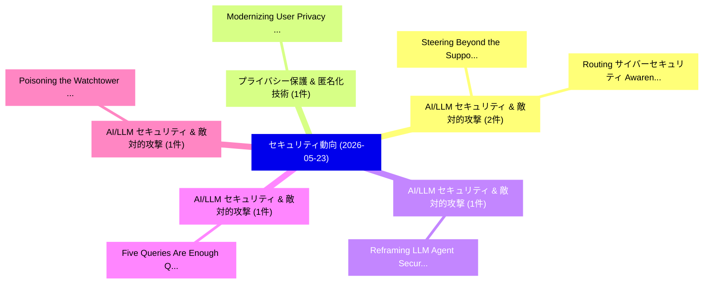

# 📅 02_daily: 日次エグゼクティブサマリー報告書 (2026-05-23)

**集計日時**: 2026-10-02 23:06:11 UTC  
**対象日付**: 2026-05-23  
**本日収集論文数**: 15 件  

---

## 💡 主要セキュリティ動向・脅威インサイト (Executive Insights)

本日の収集論文（計 15 件）において、以下の重点セキュリティ領域で活発な研究動向が確認されました：
- **AI/LLM セキュリティ & 敵対的攻撃** (2 件): 注目論文として 「Steering Beyond the Support: A...」、「Routing サイバーセキュリティ Awareness T...」 等が発表され、実務防御および攻撃検証の進展が見られます。
- **プライバシー保護 & 匿名化技術** (1 件): 注目論文として 「Modernizing User Privacy Prefe...」 等が発表され、実務防御および攻撃検証の進展が見られます。
- **AI/LLM セキュリティ & 敵対的攻撃** (1 件): 注目論文として 「Reframing LLM Agent Security a...」 等が発表され、実務防御および攻撃検証の進展が見られます。
- **AI/LLM セキュリティ & 敵対的攻撃** (1 件): 注目論文として 「Five Queries Are Enough: Query...」 等が発表され、実務防御および攻撃検証の進展が見られます。
- **AI/LLM セキュリティ & 敵対的攻撃** (1 件): 注目論文として 「Poisoning the Watchtower: Prom...」 等が発表され、実務防御および攻撃検証の進展が見られます。

### 🗺️ 技術・脅威トピックマインドマップ

---

## 📌 日次セキュリティ論文一覧 (日本語表形式)

| No | arXiv ID | 論文タイトル (日本語訳) | 重要キーワード | 構造化エグゼクティブ要約 (背景・提案・影響) | 脅威分類 | 詳細リンク |
|---|---|---|---|---|---|---|
| 1 | `2605.24307v1` | [Modernizing User Privacy Preference Measurement through GPPI: A GDPR-aligned Privacy Preference Item Bank（セキュリティ分析論文）](../../okf/papers/2026-05-23/2605.24307.md) | `Modernizing User Privacy Preference Measurement`, `Privacy Preference Item Bank`, `GDPR-aligned Privacy` | 【提案】概要 (Overview & Key Finding) 本論文「Modernizing User Privacy Preference Measurement through...。実証評価により経営層・セキュリティ管理者向け推奨アクション (E... | `arXiv` | [arXiv](https://arxiv.org/abs/2605.24307v1) &#124; [OKF](../../okf/papers/2026-05-23/2605.24307.md) |
| 2 | `2605.24309v1` | [Reframing LLM Agent Security as an Agent-Human Interaction Problem（セキュリティ分析論文）](../../okf/papers/2026-05-23/2605.24309.md) | `Human Interaction Problem`, `Agent Security`, `Agent-Human Interaction` | 【提案】概要 (Overview & Key Finding) 本論文「Reframing LLM Agent Security as an Agent-Human Interact...。実証評価により経営層・セキュリティ管理者向け推奨アクション (E... | `arXiv` | [arXiv](https://arxiv.org/abs/2605.24309v1) &#124; [OKF](../../okf/papers/2026-05-23/2605.24309.md) |
| 3 | `2605.24312v4` | [Five Queries Are Enough: Query-Efficient and Surrogate-Free Membership Inference Attacks on RAG via Entailment（セキュリティ分析論文）](../../okf/papers/2026-05-23/2605.24312.md) | `Free Membership Inference Attacks`, `Surrogate-Free Membership`, `Nguyen Linh Bao Nguyen` | 【提案】概要 (Overview & Key Finding) 本論文「Five Queries Are Enough: Query-Efficient and Surrogate-...。実証評価により経営層・セキュリティ管理者向け推奨アクション (E... | `AI/ML Security` | [arXiv](https://arxiv.org/abs/2605.24312v4) &#124; [OKF](../../okf/papers/2026-05-23/2605.24312.md) |
| 4 | `2605.24421v1` | [Poisoning the Watchtower: Prompt Injection Attacks Against LLM-Augmented Security Operations Through Adversarial Log Content（セキュリティ分析論文）](../../okf/papers/2026-05-23/2605.24421.md) | `LLM-Augmented Security`, `Rohan Pandey`, `Archit Bhujang` | 【提案】概要 (Overview & Key Finding) 本論文「Poisoning the Watchtower: プロンプトインジェクション Attacks Against...。実証評価により経営層・セキュリティ管理者向け推奨アクション (E... | `arXiv` | [arXiv](https://arxiv.org/abs/2605.24421v1) &#124; [OKF](../../okf/papers/2026-05-23/2605.24421.md) |
| 5 | `2605.24535v2` | [Steering Beyond the Support: Adversarial Training on Unsupervised Jailbroken Activation Simulation（セキュリティ分析論文）](../../okf/papers/2026-05-23/2605.24535.md) | `Unsupervised Jailbroken Activation Simulation`, `Steering Beyond`, `Adversarial Training` | 【提案】概要 (Overview & Key Finding) 本論文「Steering Beyond the Support: Adversarial Training on Un...。実証評価により経営層・セキュリティ管理者向け推奨アクション (E... | `arXiv` | [arXiv](https://arxiv.org/abs/2605.24535v2) &#124; [OKF](../../okf/papers/2026-05-23/2605.24535.md) |
| 6 | `2605.24542v1` | [AI-Driven Adaptive Adversaries and the Erosion of Cryptographic Trust in Public Key Systems（セキュリティ分析論文）](../../okf/papers/2026-05-23/2605.24542.md) | `Driven Adaptive Adversaries`, `Public Key Systems`, `AI-Driven Adaptive` | 【提案】概要 (Overview & Key Finding) 本論文「AI-Driven Adaptive Adversaries and the Erosion of Crypt...。実証評価により経営層・セキュリティ管理者向け推奨アクション (E... | `arXiv` | [arXiv](https://arxiv.org/abs/2605.24542v1) &#124; [OKF](../../okf/papers/2026-05-23/2605.24542.md) |
| 7 | `2605.24551v1` | [Routing サイバーセキュリティ Awareness Training by FFM Personality Trait: A Quasi-Experimental Evaluation](../../okf/papers/2026-05-23/2605.24551.md) | `Personality Trait`, `Routing Cybersecurity Awareness Training`, `Awareness Training` | 【提案】概要 (Overview & Key Finding) 本論文「Routing サイバーセキュリティ Awareness Training by FFM Personalit...。実証評価により経営層・セキュリティ管理者向け推奨アクション (E... | `arXiv` | [arXiv](https://arxiv.org/abs/2605.24551v1) &#124; [OKF](../../okf/papers/2026-05-23/2605.24551.md) |
| 8 | `2605.24552v1` | [Ellipsoid Control: A White-list Jailbreak Defense via Benign Latent Modeling（セキュリティ分析論文）](../../okf/papers/2026-05-23/2605.24552.md) | `Benign Latent Modeling`, `Ellipsoid Control`, `Jailbreak Defense` | 【提案】概要 (Overview & Key Finding) 本論文「Ellipsoid Control: A White-list ジェイルブレイク Defense via Be...。実証評価により経営層・セキュリティ管理者向け推奨アクション (E... | `arXiv` | [arXiv](https://arxiv.org/abs/2605.24552v1) &#124; [OKF](../../okf/papers/2026-05-23/2605.24552.md) |
| 9 | `2605.24559v1` | [Analyzing Concentration, Temporal Routines and Targeting in Public Ransomware Leak Site Data（セキュリティ分析論文）](../../okf/papers/2026-05-23/2605.24559.md) | `Public Ransomware Leak Site Data`, `Analyzing Concentration`, `Temporal Routines` | 【提案】概要 (Overview & Key Finding) 本論文「Analyzing Concentration, Temporal Routines and Targetin...。実証評価により経営層・セキュリティ管理者向け推奨アクション (E... | `arXiv` | [arXiv](https://arxiv.org/abs/2605.24559v1) &#124; [OKF](../../okf/papers/2026-05-23/2605.24559.md) |
| 10 | `2605.24632v1` | [Demystifying the Mythos or Disrupting Bugonomics? From Zero-Day Asymmetry to Defender Remediation Throughput（セキュリティ分析論文）](../../okf/papers/2026-05-23/2605.24632.md) | `Defender Remediation Throughput`, `Disrupting Bugonomics`, `Day Asymmetry` | 【提案】From Zero-Day Asymmetry to Defender Remediation Throughput ### (日本語題名: Demystifying the...。実証評価により経営層・セキュリティ管理者向け推奨アクション (E... | `arXiv` | [arXiv](https://arxiv.org/abs/2605.24632v1) &#124; [OKF](../../okf/papers/2026-05-23/2605.24632.md) |
| 11 | `2605.24663v1` | [CyBOKClaw: Human-in-the-Loop CyBOK Mapping for サイバーセキュリティ Curriculum](../../okf/papers/2026-05-23/2605.24663.md) | `the-Loop CyBOK`, `Cybersecurity Curriculum`, `Yan Lin Aung` | 【提案】概要 (Overview & Key Finding) 本論文「CyBOKClaw: Human-in-the-Loop CyBOK Mapping for サイバーセキュリ...。実証評価により経営層・セキュリティ管理者向け推奨アクション (E... | `arXiv` | [arXiv](https://arxiv.org/abs/2605.24663v1) &#124; [OKF](../../okf/papers/2026-05-23/2605.24663.md) |
| 12 | `2605.24696v2` | [CALIBURN: Operationally Calibrated Streaming Intrusion Detection with Regime-Dependent Conformal Risk Control（セキュリティ分析論文）](../../okf/papers/2026-05-23/2605.24696.md) | `Operationally Calibrated Streaming Intrusion Detection`, `Dependent Conformal Risk Control`, `Regime-Dependent Conformal` | 【提案】概要 (Overview & Key Finding) 本論文「CALIBURN: Operationally Calibrated Streaming Intrusion ...。実証評価により経営層・セキュリティ管理者向け推奨アクション (E... | `arXiv` | [arXiv](https://arxiv.org/abs/2605.24696v2) &#124; [OKF](../../okf/papers/2026-05-23/2605.24696.md) |
| 13 | `2605.24765v1` | [CyberMaskQA: A Privacy-Aware Benchmark for Evaluating 大規模言語モデル in Cybersecurity Question Answering](../../okf/papers/2026-05-23/2605.24765.md) | `Cybersecurity Question Answering`, `Aware Benchmark`, `Privacy-Aware Benchmark` | 【提案】概要 (Overview & Key Finding) 本論文「CyberMaskQA: A Privacy-Aware Benchmark for Evaluating 大...。実証評価により経営層・セキュリティ管理者向け推奨アクション (E... | `arXiv` | [arXiv](https://arxiv.org/abs/2605.24765v1) &#124; [OKF](../../okf/papers/2026-05-23/2605.24765.md) |
| 14 | `2606.00088v1` | [From Frontier to Shadow AI: A Simmering Threat to Assurance and Security in Critical Infrastructure（セキュリティ分析論文）](../../okf/papers/2026-05-23/2606.00088.md) | `Simmering Threat`, `Critical Infrastructure`, `Mohan Baruwal Chhetri` | 【提案】概要 (Overview & Key Finding) 本論文「From Frontier to Shadow AI: A Simmering 脅威 to Assurance...。実証評価により経営層・セキュリティ管理者向け推奨アクション (E... | `arXiv` | [arXiv](https://arxiv.org/abs/2606.00088v1) &#124; [OKF](../../okf/papers/2026-05-23/2606.00088.md) |
| 15 | `2606.02607v1` | [Geometry-Aware Tabular Diffusion（セキュリティ分析論文）](../../okf/papers/2026-05-23/2606.02607.md) | `Aware Tabular Diffusion`, `Geometry-Aware Tabular`, `David Turtora Zagardo` | 【提案】概要 (Overview & Key Finding) 本論文「Geometry-Aware Tabular Diffusion（セキュリティ分析論文）」（原題: Geome...。実証評価により経営層・セキュリティ管理者向け推奨アクション (E... | `arXiv` | [arXiv](https://arxiv.org/abs/2606.02607v1) &#124; [OKF](../../okf/papers/2026-05-23/2606.02607.md) |

