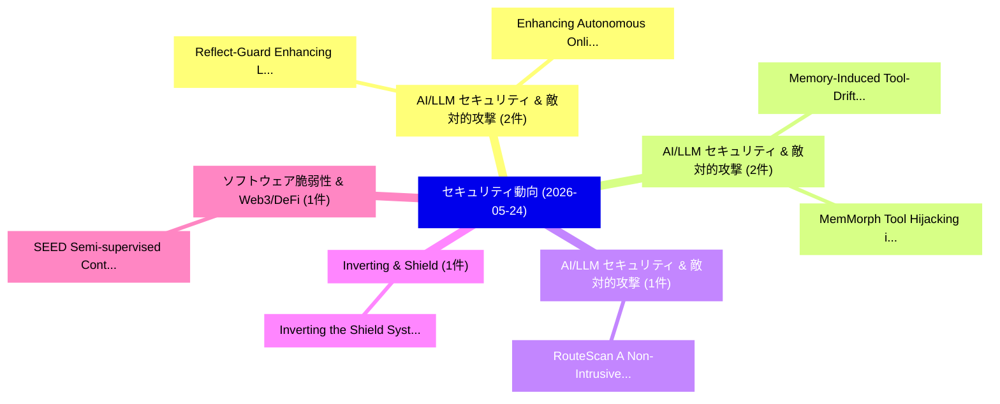

# 📅 02_daily: 日次エグゼクティブサマリー報告書 (2026-05-24)

**集計日時**: 2026-10-02 23:06:11 UTC  
**対象日付**: 2026-05-24  
**本日収集論文数**: 18 件  

---

## 💡 主要セキュリティ動向・脅威インサイト (Executive Insights)

本日の収集論文（計 18 件）において、以下の重点セキュリティ領域で活発な研究動向が確認されました：
- **AI/LLM セキュリティ & 敵対的攻撃** (2 件): 注目論文として 「Reflect-Guard: Enhancing LLM S...」、「Enhancing Autonomous Online In...」 等が発表され、実務防御および攻撃検証の進展が見られます。
- **AI/LLM セキュリティ & 敵対的攻撃** (2 件): 注目論文として 「Memory-Induced Tool-Drift in L...」、「MemMorph: Tool Hijacking in LL...」 等が発表され、実務防御および攻撃検証の進展が見られます。
- **AI/LLM セキュリティ & 敵対的攻撃** (1 件): 注目論文として 「RouteScan: A Non-Intrusive App...」 等が発表され、実務防御および攻撃検証の進展が見られます。
- **Inverting & Shield** (1 件): 注目論文として 「Inverting the Shield: Systemat...」 等が発表され、実務防御および攻撃検証の進展が見られます。
- **ソフトウェア脆弱性 & Web3/DeFi** (1 件): 注目論文として 「SEED: Semi-supervised Continua...」 等が発表され、実務防御および攻撃検証の進展が見られます。

### 🗺️ 技術・脅威トピックマインドマップ

---

## 📌 日次セキュリティ論文一覧 (日本語表形式)

| No | arXiv ID | 論文タイトル (日本語訳) | 重要キーワード | 構造化エグゼクティブ要約 (背景・提案・影響) | 脅威分類 | 詳細リンク |
|---|---|---|---|---|---|---|
| 1 | `2605.24817v1` | [RouteScan: A Non-Intrusive Approach to Auditing MoE LLMs Safety via Expert Routing Telemetry（セキュリティ分析論文）](../../okf/papers/2026-05-24/2605.24817.md) | `Expert Routing Telemetry`, `Bo Lv`, `Zhiheng Xu` | 【提案】概要 (Overview & Key Finding) 本論文「RouteScan: A Non-Intrusive Approach to Auditing MoE LLM...。実証評価により経営層・セキュリティ管理者向け推奨アクション (E... | `arXiv` | [arXiv](https://arxiv.org/abs/2605.24817v1) &#124; [OKF](../../okf/papers/2026-05-24/2605.24817.md) |
| 2 | `2605.24834v1` | [Reflect-Guard: Enhancing LLM Safeguards against Adversarial Prompts via Logical Self-Reflection（セキュリティ分析論文）](../../okf/papers/2026-05-24/2605.24834.md) | `Adversarial Prompts`, `Logical Self`, `Lixing Lin` | 【提案】概要 (Overview & Key Finding) 本論文「Reflect-Guard: Enhancing LLM Safeguards against Adversa...。実証評価により経営層・セキュリティ管理者向け推奨アクション (E... | `arXiv` | [arXiv](https://arxiv.org/abs/2605.24834v1) &#124; [OKF](../../okf/papers/2026-05-24/2605.24834.md) |
| 3 | `2605.24883v1` | [Inverting the Shield: Systematically Generating Safety Tests from Policy Specifications（セキュリティ分析論文）](../../okf/papers/2026-05-24/2605.24883.md) | `Systematically Generating Safety Tests`, `Policy Specifications`, `Jin Song Dong` | 【提案】概要 (Overview & Key Finding) 本論文「Inverting the Shield: Systematically Generating Safety ...。実証評価により経営層・セキュリティ管理者向け推奨アクション (E... | `arXiv` | [arXiv](https://arxiv.org/abs/2605.24883v1) &#124; [OKF](../../okf/papers/2026-05-24/2605.24883.md) |
| 4 | `2605.24903v2` | [SEED: Semi-supervised Continual マルウェア検出 for Tackling ConcEpt Drift on a BuDget](../../okf/papers/2026-05-24/2605.24903.md) | `Semi-supervised Continual`, `Suresh Kumar Amalapuram`, `Bheemarjuna Reddy Tamma` | 【提案】概要 (Overview & Key Finding) 本論文「SEED: Semi-supervised Continual マルウェア検出 for Tackling Co...。実証評価により経営層・セキュリティ管理者向け推奨アクション (E... | `arXiv` | [arXiv](https://arxiv.org/abs/2605.24903v2) &#124; [OKF](../../okf/papers/2026-05-24/2605.24903.md) |
| 5 | `2605.24941v1` | [Memory-Induced Tool-Drift in LLMエージェント](../../okf/papers/2026-05-24/2605.24941.md) | `Induced Tool`, `Memory-Induced Tool`, `Mahavir Dabas` | 【提案】概要 (Overview & Key Finding) 本論文「Memory-Induced Tool-Drift in LLMエージェント」（原題: Memory-Indu...。実証評価により経営層・セキュリティ管理者向け推奨アクション (E... | `arXiv` | [arXiv](https://arxiv.org/abs/2605.24941v1) &#124; [OKF](../../okf/papers/2026-05-24/2605.24941.md) |
| 6 | `2605.24949v1` | [APT-Agent: Automated Penetration Testing using 大規模言語モデル](../../okf/papers/2026-05-24/2605.24949.md) | `Automated Penetration Testing`, `Large Language Models`, `William Guanting Li` | 【提案】概要 (Overview & Key Finding) 本論文「APT-Agent: Automated Penetration Testing using 大規模言語モデル...。実証評価により経営層・セキュリティ管理者向け推奨アクション (E... | `arXiv` | [arXiv](https://arxiv.org/abs/2605.24949v1) &#124; [OKF](../../okf/papers/2026-05-24/2605.24949.md) |
| 7 | `2605.24951v1` | [EnThM: Energy Theft Mitigation in Smart Grids using Hierarchical Verification of Metering Data（セキュリティ分析論文）](../../okf/papers/2026-05-24/2605.24951.md) | `Energy Theft Mitigation`, `Smart Grids`, `Hierarchical Verification` | 【提案】概要 (Overview & Key Finding) 本論文「EnThM: Energy Theft Mitigation in Smart Grids using Hie...。実証評価により経営層・セキュリティ管理者向け推奨アクション (E... | `arXiv` | [arXiv](https://arxiv.org/abs/2605.24951v1) &#124; [OKF](../../okf/papers/2026-05-24/2605.24951.md) |
| 8 | `2605.25002v2` | [MemMark: State-Evolution Attribution Watermarking for Agent Long-Term Memory Systems（セキュリティ分析論文）](../../okf/papers/2026-05-24/2605.25002.md) | `Evolution Attribution Watermarking`, `Term Memory Systems`, `Agent Long` | 【提案】概要 (Overview & Key Finding) 本論文「MemMark: State-Evolution Attribution Watermarking for A...。実証評価により経営層・セキュリティ管理者向け推奨アクション (E... | `arXiv` | [arXiv](https://arxiv.org/abs/2605.25002v2) &#124; [OKF](../../okf/papers/2026-05-24/2605.25002.md) |
| 9 | `2605.25026v1` | [High-Performance Data Transfers: Implementing AES Encryption in RDMA Systemsのセキュリティ強化](../../okf/papers/2026-05-24/2605.25026.md) | `Performance Data Transfers`, `High-Performance Data`, `Securing High` | 【提案】概要 (Overview & Key Finding) 本論文「High-Performance Data Transfers: Implementing AES Encry...。実証評価により経営層・セキュリティ管理者向け推奨アクション (E... | `arXiv` | [arXiv](https://arxiv.org/abs/2605.25026v1) &#124; [OKF](../../okf/papers/2026-05-24/2605.25026.md) |
| 10 | `2605.25066v1` | [QML-PipeGuard: Drift-Aware Behavioral Fingerprinting for Quantum Machine Learning Pipeline Integrity（セキュリティ分析論文）](../../okf/papers/2026-05-24/2605.25066.md) | `Quantum Machine Learning Pipeline Integrity`, `Aware Behavioral Fingerprinting`, `Drift-Aware Behavioral` | 【提案】概要 (Overview & Key Finding) 本論文「QML-PipeGuard: Drift-Aware Behavioral Fingerprinting fo...。実証評価により経営層・セキュリティ管理者向け推奨アクション (E... | `arXiv` | [arXiv](https://arxiv.org/abs/2605.25066v1) &#124; [OKF](../../okf/papers/2026-05-24/2605.25066.md) |
| 11 | `2605.25073v1` | [Security in the Fine-Tuning Lifecycle of 大規模言語モデル: Threats, Defenses,Evaluation, and Future Directions](../../okf/papers/2026-05-24/2605.25073.md) | `Tuning Lifecycle`, `Fine-Tuning Lifecycle`, `Future Directions` | 【提案】概要 (Overview & Key Finding) 本論文「Security in the Fine-Tuning Lifecycle of 大規模言語モデル: Thre...。実証評価により経営層・セキュリティ管理者向け推奨アクション (E... | `arXiv` | [arXiv](https://arxiv.org/abs/2605.25073v1) &#124; [OKF](../../okf/papers/2026-05-24/2605.25073.md) |
| 12 | `2605.25142v2` | [Pre-Characterization of Electromagnetic Side-Channel Leakage Using Publicly Available Information: A Case Study on E-Voting Interfaces（セキュリティ分析論文）](../../okf/papers/2026-05-24/2605.25142.md) | `Channel Leakage Using Publicly Available Information`, `Electromagnetic Side`, `Voting Interfaces` | 【提案】概要 (Overview & Key Finding) 本論文「Pre-Characterization of Electromagnetic サイドチャネル攻撃 Leaka...。実証評価により経営層・セキュリティ管理者向け推奨アクション (E... | `arXiv` | [arXiv](https://arxiv.org/abs/2605.25142v2) &#124; [OKF](../../okf/papers/2026-05-24/2605.25142.md) |
| 13 | `2605.25207v1` | [Decoupling Reentrancy Protection from Smart Contract Implementation Logic（セキュリティ分析論文）](../../okf/papers/2026-05-24/2605.25207.md) | `Smart Contract Implementation Logic`, `Decoupling Reentrancy Protection`, `Shashank Joshi` | 【提案】概要 (Overview & Key Finding) 本論文「Decoupling Reentrancy Protection from スマートコントラクト Implem...。実証評価により経営層・セキュリティ管理者向け推奨アクション (E... | `arXiv` | [arXiv](https://arxiv.org/abs/2605.25207v1) &#124; [OKF](../../okf/papers/2026-05-24/2605.25207.md) |
| 14 | `2605.26154v1` | [MemMorph: Tool Hijacking in LLMエージェント via Memory Poisoning](../../okf/papers/2026-05-24/2605.26154.md) | `Tool Hijacking`, `Memory Poisoning`, `Xuanye Zhang` | 【提案】概要 (Overview & Key Finding) 本論文「MemMorph: Tool Hijacking in LLMエージェント via Memory Poison...。実証評価により経営層・セキュリティ管理者向け推奨アクション (E... | `arXiv` | [arXiv](https://arxiv.org/abs/2605.26154v1) &#124; [OKF](../../okf/papers/2026-05-24/2605.26154.md) |
| 15 | `2605.26156v2` | [Turning Bias into Bugs: Bandit-Guided Style Manipulation Attacks on LLM Judges（セキュリティ分析論文）](../../okf/papers/2026-05-24/2605.26156.md) | `Guided Style Manipulation Attacks`, `Turning Bias`, `Bandit-Guided Style` | 【提案】概要 (Overview & Key Finding) 本論文「Turning Bias into Bugs: Bandit-Guided Style Manipulatio...。実証評価により経営層・セキュリティ管理者向け推奨アクション (E... | `arXiv` | [arXiv](https://arxiv.org/abs/2605.26156v2) &#124; [OKF](../../okf/papers/2026-05-24/2605.26156.md) |
| 16 | `2605.26158v1` | [Furina: Fragmented Uncertainty-Driven Refusal Instability Attack（セキュリティ分析論文）](../../okf/papers/2026-05-24/2605.26158.md) | `Driven Refusal Instability Attack`, `Fragmented Uncertainty`, `Uncertainty-Driven Refusal` | 【提案】概要 (Overview & Key Finding) 本論文「Furina: Fragmented Uncertainty-Driven Refusal Instabili...。実証評価により経営層・セキュリティ管理者向け推奨アクション (E... | `arXiv` | [arXiv](https://arxiv.org/abs/2605.26158v1) &#124; [OKF](../../okf/papers/2026-05-24/2605.26158.md) |
| 17 | `2605.26159v1` | [Device Context Protocol: A Compact, Safety-First Architecture for LLM-Driven Control of Constrained Devices（セキュリティ分析論文）](../../okf/papers/2026-05-24/2605.26159.md) | `Device Context Protocol`, `First Architecture`, `Driven Control` | 【提案】概要 (Overview & Key Finding) 本論文「Device Context Protocol: A Compact, Safety-First Archit...。実証評価により経営層・セキュリティ管理者向け推奨アクション (E... | `arXiv` | [arXiv](https://arxiv.org/abs/2605.26159v1) &#124; [OKF](../../okf/papers/2026-05-24/2605.26159.md) |
| 18 | `2605.26166v1` | [Enhancing Autonomous Online Intrusion Detection for IoT with Balanced Learning, Reliable Pseudo-Labels, and Lightweight Architectures（セキュリティ分析論文）](../../okf/papers/2026-05-24/2605.26166.md) | `Enhancing Autonomous Online Intrusion Detection`, `Balanced Learning`, `Reliable Pseudo` | 【提案】概要 (Overview & Key Finding) 本論文「Enhancing Autonomous Online Intrusion Detection for IoT...。実証評価により経営層・セキュリティ管理者向け推奨アクション (E... | `arXiv` | [arXiv](https://arxiv.org/abs/2605.26166v1) &#124; [OKF](../../okf/papers/2026-05-24/2605.26166.md) |

