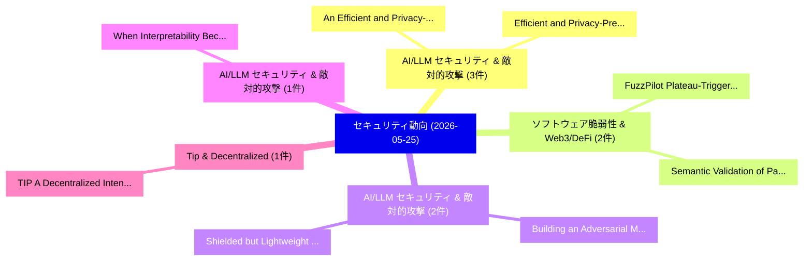

# 📅 02_daily: 日次エグゼクティブサマリー報告書 (2026-05-25)

**集計日時**: 2026-10-02 23:06:11 UTC  
**対象日付**: 2026-05-25  
**本日収集論文数**: 29 件  

---

## 💡 主要セキュリティ動向・脅威インサイト (Executive Insights)

本日の収集論文（計 29 件）において、以下の重点セキュリティ領域で活発な研究動向が確認されました：
- **AI/LLM セキュリティ & 敵対的攻撃** (3 件): 注目論文として 「An Efficient and Privacy-Prese...」、「Efficient and Privacy-Preservi...」 等が発表され、実務防御および攻撃検証の進展が見られます。
- **ソフトウェア脆弱性 & Web3/DeFi** (2 件): 注目論文として 「Semantic Validation of Packer ...」、「FuzzPilot: Plateau-Triggered R...」 等が発表され、実務防御および攻撃検証の進展が見られます。
- **AI/LLM セキュリティ & 敵対的攻撃** (2 件): 注目論文として 「Building an Adversarial Malwar...」、「Shielded but Lightweight: Buil...」 等が発表され、実務防御および攻撃検証の進展が見られます。
- **AI/LLM セキュリティ & 敵対的攻撃** (1 件): 注目論文として 「When Interpretability Becomes ...」 等が発表され、実務防御および攻撃検証の進展が見られます。
- **Tip & Decentralized** (1 件): 注目論文として 「TIP: A Decentralized Intent-Ba...」 等が発表され、実務防御および攻撃検証の進展が見られます。

### 🗺️ 技術・脅威トピックマインドマップ

---

## 📌 日次セキュリティ論文一覧 (日本語表形式)

| No | arXiv ID | 論文タイトル (日本語訳) | 重要キーワード | 構造化エグゼクティブ要約 (背景・提案・影響) | 脅威分類 | 詳細リンク |
|---|---|---|---|---|---|---|
| 1 | `2605.25304v1` | [When Interpretability Becomes a Liability: CBM Concept Layersに対する敵対的攻撃](../../okf/papers/2026-05-25/2605.25304.md) | `Adversarial Attacks`, `Concept Layers`, `Aditya Sridhar` | 【提案】概要 (Overview & Key Finding) 本論文「When Interpretability Becomes a Liability: CBM Concept ...。実証評価により経営層・セキュリティ管理者向け推奨アクション (E... | `arXiv` | [arXiv](https://arxiv.org/abs/2605.25304v1) &#124; [OKF](../../okf/papers/2026-05-25/2605.25304.md) |
| 2 | `2605.25332v1` | [TIP: A Decentralized Intent-Based Protocol for Declarative IoT Interoperability and Sandboxed Schema Adaptation（セキュリティ分析論文）](../../okf/papers/2026-05-25/2605.25332.md) | `Sandboxed Schema Adaptation`, `Decentralized Intent`, `Based Protocol` | 【提案】概要 (Overview & Key Finding) 本論文「TIP: A Decentralized Intent-Based Protocol for Declarat...。実証評価により経営層・セキュリティ管理者向け推奨アクション (E... | `arXiv` | [arXiv](https://arxiv.org/abs/2605.25332v1) &#124; [OKF](../../okf/papers/2026-05-25/2605.25332.md) |
| 3 | `2605.25376v2` | [KYA: A Framework-Agnostic Trust Layer for Autonomous Systems with Verifiable Provenance and Hierarchical Policy Composition（セキュリティ分析論文）](../../okf/papers/2026-05-25/2605.25376.md) | `Agnostic Trust Layer`, `Hierarchical Policy Composition`, `Autonomous Systems` | 【提案】概要 (Overview & Key Finding) 本論文「KYA: A Framework-Agnostic Trust Layer for Autonomous Sy...。実証評価により経営層・セキュリティ管理者向け推奨アクション (E... | `arXiv` | [arXiv](https://arxiv.org/abs/2605.25376v2) &#124; [OKF](../../okf/papers/2026-05-25/2605.25376.md) |
| 4 | `2605.25389v1` | [Evo-Attacker: Memory-Augmented Reinforcement Learning for Long-Horizon Tool Attacks on LLM-MAS（セキュリティ分析論文）](../../okf/papers/2026-05-25/2605.25389.md) | `Augmented Reinforcement Learning`, `Horizon Tool Attacks`, `Memory-Augmented Reinforcement` | 【提案】概要 (Overview & Key Finding) 本論文「Evo-Attacker: Memory-Augmented Reinforcement Learning f...。実証評価により経営層・セキュリティ管理者向け推奨アクション (E... | `arXiv` | [arXiv](https://arxiv.org/abs/2605.25389v1) &#124; [OKF](../../okf/papers/2026-05-25/2605.25389.md) |
| 5 | `2605.25411v1` | [Heimdall: Formally Verified Automated Migration of Legacy eBPF Programs to Rust（セキュリティ分析論文）](../../okf/papers/2026-05-25/2605.25411.md) | `Formally Verified Automated Migration`, `Md Rafi Ur Rashid`, `Formally Verified Automated Migrati` | 【提案】概要 (Overview & Key Finding) 本論文「Heimdall: Formally Verified Automated Migration of Lega...。実証評価により経営層・セキュリティ管理者向け推奨アクション (E... | `arXiv` | [arXiv](https://arxiv.org/abs/2605.25411v1) &#124; [OKF](../../okf/papers/2026-05-25/2605.25411.md) |
| 6 | `2605.25631v4` | [The Privacy Subsidy in Continuous-Time Kyle: Cumulative Welfare under Noise-Perturbed Order-Flow Observation（セキュリティ分析論文）](../../okf/papers/2026-05-25/2605.25631.md) | `Time Kyle`, `Cumulative Welfare`, `Continuous-Time Kyle` | 【提案】概要 (Overview & Key Finding) 本論文「The Privacy Subsidy in Continuous-Time Kyle: Cumulative...。実証評価により経営層・セキュリティ管理者向け推奨アクション (E... | `arXiv` | [arXiv](https://arxiv.org/abs/2605.25631v4) &#124; [OKF](../../okf/papers/2026-05-25/2605.25631.md) |
| 7 | `2605.25673v1` | [Referential Security as a New Paradigm for AI Evaluations（セキュリティ分析論文）](../../okf/papers/2026-05-25/2605.25673.md) | `Referential Security`, `New Paradigm`, `Dan Ristea` | 【提案】概要 (Overview & Key Finding) 本論文「Referential Security as a New Paradigm for AI Evaluatio...。実証評価により経営層・セキュリティ管理者向け推奨アクション (E... | `arXiv` | [arXiv](https://arxiv.org/abs/2605.25673v1) &#124; [OKF](../../okf/papers/2026-05-25/2605.25673.md) |
| 8 | `2605.25692v1` | [Homomorphic Quantum Error Correction（セキュリティ分析論文）](../../okf/papers/2026-05-25/2605.25692.md) | `Homomorphic Quantum Error Correction`, `Kornikar Sen`, `Raw Meta` | 【提案】概要 (Overview & Key Finding) 本論文「Homomorphic 量子 Error Correction（セキュリティ分析論文）」（原題: Homomo...。実証評価によりMartin-Delgado - **公開日時**... | `arXiv` | [arXiv](https://arxiv.org/abs/2605.25692v1) &#124; [OKF](../../okf/papers/2026-05-25/2605.25692.md) |
| 9 | `2605.25713v1` | [Ecosystem-Driven Privacy Exposure in Mobile Gaming Apps: A Configuration-Aware Empirical Analysis（セキュリティ分析論文）](../../okf/papers/2026-05-25/2605.25713.md) | `Driven Privacy Exposure`, `Mobile Gaming Apps`, `Ecosystem-Driven Privacy` | 【提案】概要 (Overview & Key Finding) 本論文「Ecosystem-Driven Privacy Exposure in Mobile Gaming Apps...。実証評価により経営層・セキュリティ管理者向け推奨アクション (E... | `arXiv` | [arXiv](https://arxiv.org/abs/2605.25713v1) &#124; [OKF](../../okf/papers/2026-05-25/2605.25713.md) |
| 10 | `2605.25716v1` | [An Efficient and Privacy-Preserving Architecture for Cross-Institutional Collaborative RAG（セキュリティ分析論文）](../../okf/papers/2026-05-25/2605.25716.md) | `Preserving Architecture`, `Institutional Collaborative`, `Privacy-Preserving Architecture` | 【提案】概要 (Overview & Key Finding) 本論文「An Efficient and Privacy-Preserving Architecture for Cr...。実証評価により経営層・セキュリティ管理者向け推奨アクション (E... | `arXiv` | [arXiv](https://arxiv.org/abs/2605.25716v1) &#124; [OKF](../../okf/papers/2026-05-25/2605.25716.md) |
| 11 | `2605.25791v3` | [Efficient and Privacy-Preserving Distribution Statistics Analytics on Mobile Spatial Data（セキュリティ分析論文）](../../okf/papers/2026-05-25/2605.25791.md) | `Preserving Distribution Statistics Analytics`, `Mobile Spatial Data`, `Privacy-Preserving Distribution` | 【提案】概要 (Overview & Key Finding) 本論文「Efficient and Privacy-Preserving Distribution Statistic...。実証評価により経営層・セキュリティ管理者向け推奨アクション (E... | `arXiv` | [arXiv](https://arxiv.org/abs/2605.25791v3) &#124; [OKF](../../okf/papers/2026-05-25/2605.25791.md) |
| 12 | `2605.25796v3` | [SAMark: A Self-Anchored Text Watermarking with Paragraph-Level Paraphrase Robustness（セキュリティ分析論文）](../../okf/papers/2026-05-25/2605.25796.md) | `Anchored Text Watermarking`, `Level Paraphrase Robustness`, `Self-Anchored Text` | 【提案】概要 (Overview & Key Finding) 本論文「SAMark: A Self-Anchored Text Watermarking with Paragrap...。実証評価により経営層・セキュリティ管理者向け推奨アクション (E... | `arXiv` | [arXiv](https://arxiv.org/abs/2605.25796v3) &#124; [OKF](../../okf/papers/2026-05-25/2605.25796.md) |
| 13 | `2605.25819v1` | [On Reliability of Efficient Membership Inference Vulnerability Evaluation（セキュリティ分析論文）](../../okf/papers/2026-05-25/2605.25819.md) | `Gauri Pradhan`, `Antti Honkela`, `Raw Meta` | 【提案】概要 (Overview & Key Finding) 本論文「On Reliability of Efficient Membership Inference 脆弱性 Ev...。実証評価により経営層・セキュリティ管理者向け推奨アクション (E... | `arXiv` | [arXiv](https://arxiv.org/abs/2605.25819v1) &#124; [OKF](../../okf/papers/2026-05-25/2605.25819.md) |
| 14 | `2605.25822v1` | ["What is the Problem Space?" Defining Host-space Adversarial Perturbations against Network Intrusion Detection Systems（セキュリティ分析論文）](../../okf/papers/2026-05-25/2605.25822.md) | `Network Intrusion Detection Systems`, `Problem Space`, `Defining Host` | 【提案】概要 (Overview & Key Finding) 本論文「"What is the Problem Space?" Defining Host-space Advers...。実証評価により経営層・セキュリティ管理者向け推奨アクション (E... | `arXiv` | [arXiv](https://arxiv.org/abs/2605.25822v1) &#124; [OKF](../../okf/papers/2026-05-25/2605.25822.md) |
| 15 | `2605.25836v1` | [TTPrint: Evidence-Grounded TTP Extraction via Diverge-then-Converge Verification（セキュリティ分析論文）](../../okf/papers/2026-05-25/2605.25836.md) | `Evidence-Grounded TTP`, `Converge Verification`, `Raihan Sultan Pasha Basuki` | 【提案】概要 (Overview & Key Finding) 本論文「TTPrint: Evidence-Grounded TTP Extraction via Diverge-t...。実証評価により経営層・セキュリティ管理者向け推奨アクション (E... | `arXiv` | [arXiv](https://arxiv.org/abs/2605.25836v1) &#124; [OKF](../../okf/papers/2026-05-25/2605.25836.md) |
| 16 | `2605.25844v1` | [Proof of Useful Attestation: A Consensus Primitive for Attestation-Native Chains（セキュリティ分析論文）](../../okf/papers/2026-05-25/2605.25844.md) | `Useful Attestation`, `Consensus Primitive`, `Native Chains` | 【提案】概要 (Overview & Key Finding) 本論文「Proof of Useful Attestation: A Consensus Primitive for ...。実証評価により経営層・セキュリティ管理者向け推奨アクション (E... | `arXiv` | [arXiv](https://arxiv.org/abs/2605.25844v1) &#124; [OKF](../../okf/papers/2026-05-25/2605.25844.md) |
| 17 | `2605.25865v1` | [Broken Object Level Authorization in the Wild: An Empirical Taxonomy from 100+ Bug Bounty Disclosures（セキュリティ分析論文）](../../okf/papers/2026-05-25/2605.25865.md) | `Broken Object Level Authorization`, `Bug Bounty Disclosures`, `Bandana Kaur` | 【提案】概要 (Overview & Key Finding) 本論文「Broken Object Level Authorization in the Wild: An Empir...。実証評価により経営層・セキュリティ管理者向け推奨アクション (E... | `arXiv` | [arXiv](https://arxiv.org/abs/2605.25865v1) &#124; [OKF](../../okf/papers/2026-05-25/2605.25865.md) |
| 18 | `2605.25871v1` | [How Agentic AI Coding Assistants Become the Attacker's Shell（セキュリティ分析論文）](../../okf/papers/2026-05-25/2605.25871.md) | `Coding Assistants Become`, `Yue Liu`, `Yanjie Zhao` | 【提案】概要 (Overview & Key Finding) 本論文「How Agentic AI Coding Assistants Become the Attacker's ...。実証評価により経営層・セキュリティ管理者向け推奨アクション (E... | `arXiv` | [arXiv](https://arxiv.org/abs/2605.25871v1) &#124; [OKF](../../okf/papers/2026-05-25/2605.25871.md) |
| 19 | `2605.25889v4` | [Capability and Robustness Cannot Both Be Free: An Information-Theoretic Bound for Vision-Language-Action Models（セキュリティ分析論文）](../../okf/papers/2026-05-25/2605.25889.md) | `Theoretic Bound`, `Information-Theoretic Bound`, `Action Models` | 【提案】背景とセキュリティ上の課題 (Background & Problem) 本研究はサイバー脅威環境におけるセキュリティ構造・脆弱性の検証を目的としています。(主要検出項目: ...。実証評価により経営層・セキュリティ管理者向け推奨アクション (E... | `arXiv` | [arXiv](https://arxiv.org/abs/2605.25889v4) &#124; [OKF](../../okf/papers/2026-05-25/2605.25889.md) |
| 20 | `2605.25923v2` | [Semantic Validation of Packer Identification Tools: Characterization, Repair, and Downstream Impact（セキュリティ分析論文）](../../okf/papers/2026-05-25/2605.25923.md) | `Packer Identification Tools`, `Semantic Validation`, `Downstream Impact` | 【提案】概要 (Overview & Key Finding) 本論文「Semantic Validation of Packer Identification Tools: Cha...。実証評価により経営層・セキュリティ管理者向け推奨アクション (E... | `arXiv` | [arXiv](https://arxiv.org/abs/2605.25923v2) &#124; [OKF](../../okf/papers/2026-05-25/2605.25923.md) |
| 21 | `2605.25937v1` | [Building an Adversarial Malware Dataset by Family and Type: Generation, Evasion, and Poisoning Evaluation（セキュリティ分析論文）](../../okf/papers/2026-05-25/2605.25937.md) | `Adversarial Malware Dataset`, `Raw Meta`, `Executive Summary` | 【提案】概要 (Overview & Key Finding) 本論文「Building an Adversarial マルウェア Dataset by Family and Typ...。実証評価により経営層・セキュリティ管理者向け推奨アクション (E... | `arXiv` | [arXiv](https://arxiv.org/abs/2605.25937v1) &#124; [OKF](../../okf/papers/2026-05-25/2605.25937.md) |
| 22 | `2605.26018v1` | [Shielded but Lightweight: Building Practical Confidential Containers with ARM CCA（セキュリティ分析論文）](../../okf/papers/2026-05-25/2605.26018.md) | `Building Practical Confidential Containers`, `Building Practical Confident`, `Liantao Song` | 【提案】概要 (Overview & Key Finding) 本論文「Shielded but Lightweight: Building Practical Confidenti...。実証評価により経営層・セキュリティ管理者向け推奨アクション (E... | `arXiv` | [arXiv](https://arxiv.org/abs/2605.26018v1) &#124; [OKF](../../okf/papers/2026-05-25/2605.26018.md) |
| 23 | `2605.26195v2` | [CyberEvolver: Structured Self-Evolution for サイバーセキュリティ Agents On the Fly](../../okf/papers/2026-05-25/2605.26195.md) | `Structured Self`, `Yihe Fan`, `Changyi Li` | 【提案】概要 (Overview & Key Finding) 本論文「CyberEvolver: Structured Self-Evolution for サイバーセキュリティ ...。実証評価により経営層・セキュリティ管理者向け推奨アクション (E... | `arXiv` | [arXiv](https://arxiv.org/abs/2605.26195v2) &#124; [OKF](../../okf/papers/2026-05-25/2605.26195.md) |
| 24 | `2605.26196v1` | ["You do understand that people don't trust technology?": Explaining Trusted Execution Environments to Non-Experts（セキュリティ分析論文）](../../okf/papers/2026-05-25/2605.26196.md) | `Explaining Trusted Execution Environments`, `Lorrie Faith Cranor`, `Carolina Carreira` | 【提案】概要 (Overview & Key Finding) 本論文「"You do understand that people don't trust technology?"...。実証評価により経営層・セキュリティ管理者向け推奨アクション (E... | `arXiv` | [arXiv](https://arxiv.org/abs/2605.26196v1) &#124; [OKF](../../okf/papers/2026-05-25/2605.26196.md) |
| 25 | `2605.26269v1` | [AgentSecBench: Measuring Prompt Injection, Privacy Leakage, and Tool-Use Integrity in LLMエージェント](../../okf/papers/2026-05-25/2605.26269.md) | `Measuring Prompt Injection`, `Privacy Leakage`, `Use Integrity` | 【提案】概要 (Overview & Key Finding) 本論文「AgentSecBench: Measuring プロンプトインジェクション, Privacy Leakage...。実証評価により経営層・セキュリティ管理者向け推奨アクション (E... | `arXiv` | [arXiv](https://arxiv.org/abs/2605.26269v1) &#124; [OKF](../../okf/papers/2026-05-25/2605.26269.md) |
| 26 | `2605.26298v1` | [Sandlock: Confining AI Agent Code with Unprivileged Linux Primitives（セキュリティ分析論文）](../../okf/papers/2026-05-25/2605.26298.md) | `Unprivileged Linux Primitives`, `Agent Code`, `Cong Wang` | 【提案】概要 (Overview & Key Finding) 本論文「Sandlock: Confining AI Agent Code with Unprivileged Lin...。実証評価により経営層・セキュリティ管理者向け推奨アクション (E... | `arXiv` | [arXiv](https://arxiv.org/abs/2605.26298v1) &#124; [OKF](../../okf/papers/2026-05-25/2605.26298.md) |
| 27 | `2605.26307v1` | [Intelligent Detection and Mitigation of Carpet-Bombing DDoS Attacks in SDN Using Retrieval-Augmented Generation and 大規模言語モデル](../../okf/papers/2026-05-25/2605.26307.md) | `Intelligent Detection`, `Using Retrieval`, `Augmented Generation` | 【提案】概要 (Overview & Key Finding) 本論文「Intelligent Detection and Mitigation of Carpet-Bombing ...。実証評価により経営層・セキュリティ管理者向け推奨アクション (E... | `arXiv` | [arXiv](https://arxiv.org/abs/2605.26307v1) &#124; [OKF](../../okf/papers/2026-05-25/2605.26307.md) |
| 28 | `2605.26351v1` | [Context-Aware Metric Differential Privacy for Vehicle Trajectory Data（セキュリティ分析論文）](../../okf/papers/2026-05-25/2605.26351.md) | `Aware Metric Differential Privacy`, `Vehicle Trajectory Data`, `Context-Aware Metric` | 【提案】概要 (Overview & Key Finding) 本論文「Context-Aware Metric 差分プライバシー for Vehicle Trajectory Da...。実証評価により経営層・セキュリティ管理者向け推奨アクション (E... | `arXiv` | [arXiv](https://arxiv.org/abs/2605.26351v1) &#124; [OKF](../../okf/papers/2026-05-25/2605.26351.md) |
| 29 | `2605.26539v1` | [FuzzPilot: Plateau-Triggered Recipe Validation for Structured Text Fuzzing（セキュリティ分析論文）](../../okf/papers/2026-05-25/2605.26539.md) | `Triggered Recipe Validation`, `Structured Text Fuzzing`, `Plateau-Triggered Recipe` | 【提案】概要 (Overview & Key Finding) 本論文「FuzzPilot: Plateau-Triggered Recipe Validation for Stru...。実証評価により経営層・セキュリティ管理者向け推奨アクション (E... | `arXiv` | [arXiv](https://arxiv.org/abs/2605.26539v1) &#124; [OKF](../../okf/papers/2026-05-25/2605.26539.md) |

