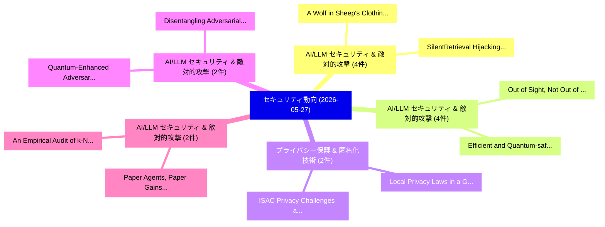

# 📅 02_daily: 日次エグゼクティブサマリー報告書 (2026-05-27)

**集計日時**: 2026-10-02 23:06:12 UTC  
**対象日付**: 2026-05-27  
**本日収集論文数**: 51 件  

---

## 💡 主要セキュリティ動向・脅威インサイト (Executive Insights)

本日の収集論文（計 51 件）において、以下の重点セキュリティ領域で活発な研究動向が確認されました：
- **AI/LLM セキュリティ & 敵対的攻撃** (4 件): 注目論文として 「SilentRetrieval: Hijacking Ret...」、「A Wolf in Sheep's Clothing: Ta...」 等が発表され、実務防御および攻撃検証の進展が見られます。
- **AI/LLM セキュリティ & 敵対的攻撃** (4 件): 注目論文として 「Out of Sight, Not Out of Mind:...」、「Efficient and Quantum-safe Int...」 等が発表され、実務防御および攻撃検証の進展が見られます。
- **プライバシー保護 & 匿名化技術** (2 件): 注目論文として 「Local Privacy Laws in a Global...」、「ISAC Privacy: Challenges and S...」 等が発表され、実務防御および攻撃検証の進展が見られます。
- **AI/LLM セキュリティ & 敵対的攻撃** (2 件): 注目論文として 「Disentangling Adversarial Prom...」、「Quantum-Enhanced Adversarial R...」 等が発表され、実務防御および攻撃検証の進展が見られます。
- **AI/LLM セキュリティ & 敵対的攻撃** (2 件): 注目論文として 「An Empirical Audit of k-NAF Bu...」、「Paper Agents, Paper Gains: An ...」 等が発表され、実務防御および攻撃検証の進展が見られます。

### 🗺️ 技術・脅威トピックマインドマップ

---

## 📌 日次セキュリティ論文一覧 (日本語表形式)

| No | arXiv ID | 論文タイトル (日本語訳) | 重要キーワード | 構造化エグゼクティブ要約 (背景・提案・影響) | 脅威分類 | 詳細リンク |
|---|---|---|---|---|---|---|
| 1 | `2605.27782v1` | [Revisiting ML Training under Fully Homomorphic Encryption: Convergence Guarantees, Differential Privacy, and Efficient Algorithms（セキュリティ分析論文）](../../okf/papers/2026-05-27/2605.27782.md) | `Fully Homomorphic Encryption`, `Convergence Guarantees`, `Differential Privacy` | 【提案】概要 (Overview & Key Finding) 本論文「Revisiting ML Training under Fully 準同型暗号: Convergence G...。実証評価により経営層・セキュリティ管理者向け推奨アクション (E... | `arXiv` | [arXiv](https://arxiv.org/abs/2605.27782v1) &#124; [OKF](../../okf/papers/2026-05-27/2605.27782.md) |
| 2 | `2605.27801v1` | [Local Privacy Laws in a Globalized World（セキュリティ分析論文）](../../okf/papers/2026-05-27/2605.27801.md) | `Local Privacy Laws`, `Globalized World`, `Lorenzo De Carli` | 【提案】概要 (Overview & Key Finding) 本論文「Local Privacy Laws in a Globalized World（セキュリティ分析論文）」（原...。実証評価により経営層・セキュリティ管理者向け推奨アクション (E... | `arXiv` | [arXiv](https://arxiv.org/abs/2605.27801v1) &#124; [OKF](../../okf/papers/2026-05-27/2605.27801.md) |
| 3 | `2605.27803v1` | [HammerSim: A System-Level Tool to Model RowHammer（セキュリティ分析論文）](../../okf/papers/2026-05-27/2605.27803.md) | `Level Tool`, `System-Level Tool`, `Kaustav Goswami` | 【提案】概要 (Overview & Key Finding) 本論文「HammerSim: A System-Level Tool to Model RowHammer（セキュリテ...。実証評価により経営層・セキュリティ管理者向け推奨アクション (E... | `arXiv` | [arXiv](https://arxiv.org/abs/2605.27803v1) &#124; [OKF](../../okf/papers/2026-05-27/2605.27803.md) |
| 4 | `2605.27804v1` | [Patchlings: Safety-Preserving Flash-Based Hotpatching for Automotive Microcontrollers（セキュリティ分析論文）](../../okf/papers/2026-05-27/2605.27804.md) | `Preserving Flash`, `Safety-Preserving Flash`, `Based Hotpatching` | 【提案】概要 (Overview & Key Finding) 本論文「Patchlings: Safety-Preserving Flash-Based Hotpatching f...。実証評価により経営層・セキュリティ管理者向け推奨アクション (E... | `arXiv` | [arXiv](https://arxiv.org/abs/2605.27804v1) &#124; [OKF](../../okf/papers/2026-05-27/2605.27804.md) |
| 5 | `2605.27809v2` | [Density-aware Sample-specific Attack（セキュリティ分析論文）](../../okf/papers/2026-05-27/2605.27809.md) | `Density-aware Sample`, `Qiyuan Wang`, `Yao Li` | 【提案】概要 (Overview & Key Finding) 本論文「Density-aware Sample-specific Attack（セキュリティ分析論文）」（原題: D...。実証評価によりWong - **公開日時**: `2026-05... | `arXiv` | [arXiv](https://arxiv.org/abs/2605.27809v2) &#124; [OKF](../../okf/papers/2026-05-27/2605.27809.md) |
| 6 | `2605.27823v1` | [Disentangling Adversarial Prompts: A Semantic-Graph Defense for Robust LLM Security（セキュリティ分析論文）](../../okf/papers/2026-05-27/2605.27823.md) | `Disentangling Adversarial Prompts`, `Graph Defense`, `Semantic-Graph Defense` | 【提案】概要 (Overview & Key Finding) 本論文「Disentangling Adversarial Prompts: A Semantic-Graph Def...。実証評価により経営層・セキュリティ管理者向け推奨アクション (E... | `arXiv` | [arXiv](https://arxiv.org/abs/2605.27823v1) &#124; [OKF](../../okf/papers/2026-05-27/2605.27823.md) |
| 7 | `2605.27825v1` | [MRMMIA: Membership Inference Attacks on Memory in Chat Agents（セキュリティ分析論文）](../../okf/papers/2026-05-27/2605.27825.md) | `Membership Inference Attacks`, `Chat Agents`, `Kai Chen` | 【提案】概要 (Overview & Key Finding) 本論文「MRMMIA: Membership Inference Attacks on Memory in Chat ...。実証評価により経営層・セキュリティ管理者向け推奨アクション (E... | `arXiv` | [arXiv](https://arxiv.org/abs/2605.27825v1) &#124; [OKF](../../okf/papers/2026-05-27/2605.27825.md) |
| 8 | `2605.27836v1` | [Symmetry Defeats Auditing（セキュリティ分析論文）](../../okf/papers/2026-05-27/2605.27836.md) | `Symmetry Defeats Auditing`, `Nick Merrill`, `Zeke Medley` | 【提案】概要 (Overview & Key Finding) 本論文「Symmetry Defeats Auditing（セキュリティ分析論文）」（原題: Symmetry Def...。実証評価により経営層・セキュリティ管理者向け推奨アクション (E... | `arXiv` | [arXiv](https://arxiv.org/abs/2605.27836v1) &#124; [OKF](../../okf/papers/2026-05-27/2605.27836.md) |
| 9 | `2605.27912v2` | [Privately Estimating Monotone Statistics in Polynomial Time（セキュリティ分析論文）](../../okf/papers/2026-05-27/2605.27912.md) | `Privately Estimating Monotone Statistics`, `Polynomial Time`, `Gavin Brown` | 【提案】概要 (Overview & Key Finding) 本論文「Privately Estimating Monotone Statistics in Polynomial ...。実証評価により経営層・セキュリティ管理者向け推奨アクション (E... | `arXiv` | [arXiv](https://arxiv.org/abs/2605.27912v2) &#124; [OKF](../../okf/papers/2026-05-27/2605.27912.md) |
| 10 | `2605.27932v1` | [When Think-with-Image Meets Safety: What Determines Multimodal Jailbreak Robustness?（セキュリティ分析論文）](../../okf/papers/2026-05-27/2605.27932.md) | `Image Meets Safety`, `Neil Zhenqiang Gong`, `Yuan Tian` | 【提案】### (日本語題名: When Think-with-Image Meets Safety: What Determines Multimodal ジェイルブレイク Rob...。実証評価により経営層・セキュリティ管理者向け推奨アクション (E... | `arXiv` | [arXiv](https://arxiv.org/abs/2605.27932v1) &#124; [OKF](../../okf/papers/2026-05-27/2605.27932.md) |
| 11 | `2605.28001v1` | [An Empirical Audit of k-NAF Budget Accounting for Anchored Decoding（セキュリティ分析論文）](../../okf/papers/2026-05-27/2605.28001.md) | `Budget Accounting`, `Anchored Decoding`, `k-NAF Budget` | 【提案】概要 (Overview & Key Finding) 本論文「An Empirical Audit of k-NAF Budget Accounting for Ancho...。実証評価によりVijayavallabh - **公開日時**:... | `arXiv` | [arXiv](https://arxiv.org/abs/2605.28001v1) &#124; [OKF](../../okf/papers/2026-05-27/2605.28001.md) |
| 12 | `2605.28017v2` | [Can It Reach the Generator? Investigating the Survival of Prompt-Injection Attacks in Realistic RAG Settings（セキュリティ分析論文）](../../okf/papers/2026-05-27/2605.28017.md) | `Injection Attacks`, `Prompt-Injection Attacks`, `Yu Yin` | 【提案】Investigating the Survival of Prompt-Injection Attacks in Realistic RAG Settings ### (日...。実証評価により経営層・セキュリティ管理者向け推奨アクション (E... | `arXiv` | [arXiv](https://arxiv.org/abs/2605.28017v2) &#124; [OKF](../../okf/papers/2026-05-27/2605.28017.md) |
| 13 | `2605.28030v1` | [SPARD: Defending Harmful Fine-Tuning Attack via Safety Projection with Relevance-Diversity Data Selection（セキュリティ分析論文）](../../okf/papers/2026-05-27/2605.28030.md) | `Defending Harmful Fine`, `Diversity Data Selection`, `Tuning Attack` | 【提案】概要 (Overview & Key Finding) 本論文「SPARD: Defending Harmful Fine-Tuning Attack via Safety ...。実証評価により経営層・セキュリティ管理者向け推奨アクション (E... | `arXiv` | [arXiv](https://arxiv.org/abs/2605.28030v1) &#124; [OKF](../../okf/papers/2026-05-27/2605.28030.md) |
| 14 | `2605.28071v1` | [AgentGuard: An Attribute-Based Access Control Framework for Tool-Use LLM-Based Agent（セキュリティ分析論文）](../../okf/papers/2026-05-27/2605.28071.md) | `Based Agent`, `Attribute-Based Access`, `Tool-Use LLM` | 【提案】概要 (Overview & Key Finding) 本論文「AgentGuard: An Attribute-Based アクセス制御 Framework for Too...。実証評価により経営層・セキュリティ管理者向け推奨アクション (E... | `arXiv` | [arXiv](https://arxiv.org/abs/2605.28071v1) &#124; [OKF](../../okf/papers/2026-05-27/2605.28071.md) |
| 15 | `2605.28074v1` | [SilentRetrieval: Hijacking Retrieval-Augmented Generation via Semantically-Preserving Adversarial Data Poisoning（セキュリティ分析論文）](../../okf/papers/2026-05-27/2605.28074.md) | `Preserving Adversarial Data Poisoning`, `Hijacking Retrieval`, `Augmented Generation` | 【提案】概要 (Overview & Key Finding) 本論文「SilentRetrieval: Hijacking Retrieval-Augmented Generati...。実証評価により経営層・セキュリティ管理者向け推奨アクション (E... | `arXiv` | [arXiv](https://arxiv.org/abs/2605.28074v1) &#124; [OKF](../../okf/papers/2026-05-27/2605.28074.md) |
| 16 | `2605.28078v1` | [Mind the Gap: Mixtures of Gaussians in Approximate Differential Privacy（セキュリティ分析論文）](../../okf/papers/2026-05-27/2605.28078.md) | `Approximate Differential Privacy`, `Huikang Liu`, `Aras Selvi` | 【提案】概要 (Overview & Key Finding) 本論文「Mind the Gap: Mixtures of Gaussians in Approximate 差分プラ...。実証評価により経営層・セキュリティ管理者向け推奨アクション (E... | `arXiv` | [arXiv](https://arxiv.org/abs/2605.28078v1) &#124; [OKF](../../okf/papers/2026-05-27/2605.28078.md) |
| 17 | `2605.28112v1` | [A Wolf in Sheep's Clothing: Targeted Routing Hijacking in Federated RAG（セキュリティ分析論文）](../../okf/papers/2026-05-27/2605.28112.md) | `Targeted Routing Hijacking`, `Junjie Mu`, `Qiongxiu Li` | 【提案】概要 (Overview & Key Finding) 本論文「A Wolf in Sheep's Clothing: Targeted Routing Hijacking ...。実証評価により経営層・セキュリティ管理者向け推奨アクション (E... | `arXiv` | [arXiv](https://arxiv.org/abs/2605.28112v1) &#124; [OKF](../../okf/papers/2026-05-27/2605.28112.md) |
| 18 | `2605.28116v1` | [MIRAGE: Context-Aware Prompt Injection against Mobile GUI Agents via User-Generated Content（セキュリティ分析論文）](../../okf/papers/2026-05-27/2605.28116.md) | `Aware Prompt Injection`, `Context-Aware Prompt`, `Generated Content` | 【提案】概要 (Overview & Key Finding) 本論文「MIRAGE: Context-Aware プロンプトインジェクション against Mobile GUI ...。実証評価により経営層・セキュリティ管理者向け推奨アクション (E... | `arXiv` | [arXiv](https://arxiv.org/abs/2605.28116v1) &#124; [OKF](../../okf/papers/2026-05-27/2605.28116.md) |
| 19 | `2605.28122v1` | [SNARE: Adaptive Scenario Synthesis for Eliciting Overeager Behavior in Coding Agents（セキュリティ分析論文）](../../okf/papers/2026-05-27/2605.28122.md) | `Adaptive Scenario Synthesis`, `Eliciting Overeager Behavior`, `Coding Agents` | 【提案】概要 (Overview & Key Finding) 本論文「SNARE: Adaptive Scenario Synthesis for Eliciting Overea...。実証評価により経営層・セキュリティ管理者向け推奨アクション (E... | `arXiv` | [arXiv](https://arxiv.org/abs/2605.28122v1) &#124; [OKF](../../okf/papers/2026-05-27/2605.28122.md) |
| 20 | `2605.28146v1` | [サイバーセキュリティ AI (CAI) Dataset](../../okf/papers/2026-05-27/2605.28146.md) | `Raw Meta`, `Executive Summary`, `Key Finding` | 【提案】概要 (Overview & Key Finding) 本論文「サイバーセキュリティ AI (CAI) Dataset」（原題: Cybersecurity AI (CAI)...。実証評価により経営層・セキュリティ管理者向け推奨アクション (E... | `arXiv` | [arXiv](https://arxiv.org/abs/2605.28146v1) &#124; [OKF](../../okf/papers/2026-05-27/2605.28146.md) |
| 21 | `2605.28214v1` | [Out of Sight, Not Out of Mind: Unveiling Latent Attack in Latent-based Multi-Agent Systems（セキュリティ分析論文）](../../okf/papers/2026-05-27/2605.28214.md) | `Unveiling Latent Attack`, `Agent Systems`, `Latent-based Multi` | 【提案】背景とセキュリティ上の課題 (Background & Problem) 本研究はサイバー脅威環境におけるセキュリティ構造・脆弱性の検証を目的としています。(主要検出項目: ...。実証評価により経営層・セキュリティ管理者向け推奨アクション (E... | `arXiv` | [arXiv](https://arxiv.org/abs/2605.28214v1) &#124; [OKF](../../okf/papers/2026-05-27/2605.28214.md) |
| 22 | `2605.28325v1` | [ISAC Privacy: Challenges and Solutions for 6G（セキュリティ分析論文）](../../okf/papers/2026-05-27/2605.28325.md) | `Stefano Tomasin`, `Francesco Chiti`, `Prajnamaya Dass` | 【提案】概要 (Overview & Key Finding) 本論文「ISAC Privacy: Challenges and Solutions for 6G（セキュリティ分析論...。実証評価によりVilela, Francesco Chiti, ... | `arXiv` | [arXiv](https://arxiv.org/abs/2605.28325v1) &#124; [OKF](../../okf/papers/2026-05-27/2605.28325.md) |
| 23 | `2605.28334v2` | [Cybersecurity SuperIntelligence (CSI): What's the best harness for cybersecurity?に向けて](../../okf/papers/2026-05-27/2605.28334.md) | `Towards Cybersecurity`, `Paul Zabalegui Landa`, `Francesco Balassone` | 【提案】### (日本語題名: Cybersecurity SuperIntelligence (CSI): What's the best harness for cybersec...。実証評価により経営層・セキュリティ管理者向け推奨アクション (E... | `arXiv` | [arXiv](https://arxiv.org/abs/2605.28334v2) &#124; [OKF](../../okf/papers/2026-05-27/2605.28334.md) |
| 24 | `2605.28476v1` | [Do you dare to try Test-Driven Forensics? Increasing Trust in Desktop Forensics with ADARE（セキュリティ分析論文）](../../okf/papers/2026-05-27/2605.28476.md) | `Driven Forensics`, `Increasing Trust`, `Test-Driven Forensics` | 【提案】Increasing Trust in Desktop Forensics with ADARE ### (日本語題名: Do you dare to try Test-Dr...。実証評価により経営層・セキュリティ管理者向け推奨アクション (E... | `arXiv` | [arXiv](https://arxiv.org/abs/2605.28476v1) &#124; [OKF](../../okf/papers/2026-05-27/2605.28476.md) |
| 25 | `2605.28553v1` | [Refusal Before Decoding: Detecting and Exploiting Refusal Signals in Intermediate LLM Activations（セキュリティ分析論文）](../../okf/papers/2026-05-27/2605.28553.md) | `Exploiting Refusal Signals`, `Matteo Gioele Collu`, `Riccardo Conte` | 【提案】概要 (Overview & Key Finding) 本論文「Refusal Before Decoding: Detecting and Exploiting Refus...。実証評価により経営層・セキュリティ管理者向け推奨アクション (E... | `arXiv` | [arXiv](https://arxiv.org/abs/2605.28553v1) &#124; [OKF](../../okf/papers/2026-05-27/2605.28553.md) |
| 26 | `2605.28588v1` | [Technical Report: Exploring the Emerging Threats of the Agent Skill Ecosystem（セキュリティ分析論文）](../../okf/papers/2026-05-27/2605.28588.md) | `Agent Skill Ecosystem`, `Technical Report`, `Emerging Threats` | 【提案】概要 (Overview & Key Finding) 本論文「Technical Report: Exploring the Emerging Threats of the...。実証評価により経営層・セキュリティ管理者向け推奨アクション (E... | `arXiv` | [arXiv](https://arxiv.org/abs/2605.28588v1) &#124; [OKF](../../okf/papers/2026-05-27/2605.28588.md) |
| 27 | `2605.28597v1` | [Position: Retire the "Positive Backdoor" Label -- Secret Alignment Requires Strict and Systematic Evaluation（セキュリティ分析論文）](../../okf/papers/2026-05-27/2605.28597.md) | `Secret Alignment Requires Strict`, `Positive Backdoor`, `Secret Alignment Requires Stri` | 【提案】概要 (Overview & Key Finding) 本論文「Position: Retire the "Positive Backdoor" Label -- Secre...。実証評価により経営層・セキュリティ管理者向け推奨アクション (E... | `arXiv` | [arXiv](https://arxiv.org/abs/2605.28597v1) &#124; [OKF](../../okf/papers/2026-05-27/2605.28597.md) |
| 28 | `2605.28632v1` | [Blind PRNG Hijacking: An Undetectable Integrity-Preserving Attack Against LLM Watermarking（セキュリティ分析論文）](../../okf/papers/2026-05-27/2605.28632.md) | `Integrity-Preserving Attack`, `Xiaoke Yang`, `Xuxing Lu` | 【提案】概要 (Overview & Key Finding) 本論文「Blind PRNG Hijacking: An Undetectable Integrity-Preserv...。実証評価により経営層・セキュリティ管理者向け推奨アクション (E... | `arXiv` | [arXiv](https://arxiv.org/abs/2605.28632v1) &#124; [OKF](../../okf/papers/2026-05-27/2605.28632.md) |
| 29 | `2605.28645v1` | [GraphSteal: Structural Knowledge Stealing from Graph RAG via Traversal Reconstruction（セキュリティ分析論文）](../../okf/papers/2026-05-27/2605.28645.md) | `Structural Knowledge Stealing`, `Traversal Reconstruction`, `Jinze Gu` | 【提案】概要 (Overview & Key Finding) 本論文「GraphSteal: Structural Knowledge Stealing from Graph RA...。実証評価により経営層・セキュリティ管理者向け推奨アクション (E... | `arXiv` | [arXiv](https://arxiv.org/abs/2605.28645v1) &#124; [OKF](../../okf/papers/2026-05-27/2605.28645.md) |
| 30 | `2605.28646v2` | [MaskClaw: Edge-Side Personalized Privacy Arbitration for GUI Agents with Behavior-Driven Skill Evolution（セキュリティ分析論文）](../../okf/papers/2026-05-27/2605.28646.md) | `Side Personalized Privacy Arbitration`, `Driven Skill Evolution`, `Edge-Side Personalized` | 【提案】概要 (Overview & Key Finding) 本論文「MaskClaw: Edge-Side Personalized Privacy Arbitration fo...。実証評価により経営層・セキュリティ管理者向け推奨アクション (E... | `arXiv` | [arXiv](https://arxiv.org/abs/2605.28646v2) &#124; [OKF](../../okf/papers/2026-05-27/2605.28646.md) |
| 31 | `2605.28660v1` | [Efficient and Quantum-safe Internet Key Exchange Protocols for Satellite Communications（セキュリティ分析論文）](../../okf/papers/2026-05-27/2605.28660.md) | `Internet Key Exchange Protocols`, `Quantum-safe Internet`, `Satellite Communications` | 【提案】概要 (Overview & Key Finding) 本論文「Efficient and 量子-safe Internet Key Exchange Protocols f...。実証評価により経営層・セキュリティ管理者向け推奨アクション (E... | `arXiv` | [arXiv](https://arxiv.org/abs/2605.28660v1) &#124; [OKF](../../okf/papers/2026-05-27/2605.28660.md) |
| 32 | `2605.28734v2` | [Code as a Weapon: A Consensus-Labeled Prompt Bank for Measuring Coding-Model Compliance with Malicious-Code Requests（セキュリティ分析論文）](../../okf/papers/2026-05-27/2605.28734.md) | `Labeled Prompt Bank`, `Measuring Coding`, `Model Compliance` | 【提案】概要 (Overview & Key Finding) 本論文「Code as a Weapon: A Consensus-Labeled Prompt Bank for M...。実証評価により経営層・セキュリティ管理者向け推奨アクション (E... | `arXiv` | [arXiv](https://arxiv.org/abs/2605.28734v2) &#124; [OKF](../../okf/papers/2026-05-27/2605.28734.md) |
| 33 | `2605.28890v1` | [Echoes within the Reasoning: Stealthy and Effective Watermarking via Chain of Thought（セキュリティ分析論文）](../../okf/papers/2026-05-27/2605.28890.md) | `Effective Watermarking`, `Jiacheng Lu`, `Yiming Li` | 【提案】概要 (Overview & Key Finding) 本論文「Echoes within the Reasoning: Stealthy and Effective Wat...。実証評価により経営層・セキュリティ管理者向け推奨アクション (E... | `arXiv` | [arXiv](https://arxiv.org/abs/2605.28890v1) &#124; [OKF](../../okf/papers/2026-05-27/2605.28890.md) |
| 34 | `2605.28893v2` | [Demystifying and Repairing LLM-in-the-Loop Vulnerabilitiesに向けて](../../okf/papers/2026-05-27/2605.28893.md) | `Towards Demystifying`, `Loop Vulnerabilities`, `the-Loop Vulnerabilities` | 【提案】概要 (Overview & Key Finding) 本論文「Demystifying and Repairing LLM-in-the-Loop Vulnerabilit...。実証評価により経営層・セキュリティ管理者向け推奨アクション (E... | `arXiv` | [arXiv](https://arxiv.org/abs/2605.28893v2) &#124; [OKF](../../okf/papers/2026-05-27/2605.28893.md) |
| 35 | `2605.28899v1` | [Quantum-Enhanced Adversarial Robustness in Artificial Intelligence（セキュリティ分析論文）](../../okf/papers/2026-05-27/2605.28899.md) | `Enhanced Adversarial Robustness`, `Artificial Intelligence`, `Quantum-Enhanced Adversarial` | 【提案】概要 (Overview & Key Finding) 本論文「量子-Enhanced Adversarial Robustness in Artificial Intell...。実証評価により経営層・セキュリティ管理者向け推奨アクション (E... | `arXiv` | [arXiv](https://arxiv.org/abs/2605.28899v1) &#124; [OKF](../../okf/papers/2026-05-27/2605.28899.md) |
| 36 | `2605.28912v2` | [Cycle-Space Informed Autoencoded Blind False Data Injection Attacks on Power Systemsの検出](../../okf/papers/2026-05-27/2605.28912.md) | `Space Informed Autoencoded Blind False Data Injection Attacks`, `Cycle-Space Informed`, `Autoencoded Blind False Data Injection Attacks` | 【提案】概要 (Overview & Key Finding) 本論文「Cycle-Space Informed Autoencoded Blind False Data Injec...。実証評価により経営層・セキュリティ管理者向け推奨アクション (E... | `arXiv` | [arXiv](https://arxiv.org/abs/2605.28912v2) &#124; [OKF](../../okf/papers/2026-05-27/2605.28912.md) |
| 37 | `2605.28914v1` | [AIRGuard: Guarding Agent Actions with Runtime Authority Control（セキュリティ分析論文）](../../okf/papers/2026-05-27/2605.28914.md) | `Guarding Agent Actions`, `Runtime Authority Control`, `Suliu Qin` | 【提案】概要 (Overview & Key Finding) 本論文「AIRGuard: Guarding Agent Actions with Runtime Authority...。実証評価により経営層・セキュリティ管理者向け推奨アクション (E... | `arXiv` | [arXiv](https://arxiv.org/abs/2605.28914v1) &#124; [OKF](../../okf/papers/2026-05-27/2605.28914.md) |
| 38 | `2605.28952v2` | [Optimal Rates for Differentially Private Hypothesis Testing with E-values（セキュリティ分析論文）](../../okf/papers/2026-05-27/2605.28952.md) | `Differentially Private Hypothesis Testing`, `Optimal Rates`, `Ben Jacobsen` | 【提案】概要 (Overview & Key Finding) 本論文「Optimal Rates for Differentially Private Hypothesis Tes...。実証評価により経営層・セキュリティ管理者向け推奨アクション (E... | `math.ST` | [arXiv](https://arxiv.org/abs/2605.28952v2) &#124; [OKF](../../okf/papers/2026-05-27/2605.28952.md) |
| 39 | `2605.28991v1` | [A Secure, Manifest-Based Framework for Delegated Privilege Promotion（セキュリティ分析論文）](../../okf/papers/2026-05-27/2605.28991.md) | `Delegated Privilege Promotion`, `Rajarshi Chowdhury`, `Akshay Shah` | 【提案】概要 (Overview & Key Finding) 本論文「A Secure, Manifest-Based Framework for Delegated Privil...。実証評価により経営層・セキュリティ管理者向け推奨アクション (E... | `arXiv` | [arXiv](https://arxiv.org/abs/2605.28991v1) &#124; [OKF](../../okf/papers/2026-05-27/2605.28991.md) |
| 40 | `2605.28999v1` | [Measuring Real-World Prompt Injection Attacks in LLM-based Resume Screening（セキュリティ分析論文）](../../okf/papers/2026-05-27/2605.28999.md) | `World Prompt Injection Attacks`, `Measuring Real`, `Real-World Prompt` | 【提案】概要 (Overview & Key Finding) 本論文「Measuring Real-World プロンプトインジェクション Attacks in LLM-based...。実証評価により経営層・セキュリティ管理者向け推奨アクション (E... | `arXiv` | [arXiv](https://arxiv.org/abs/2605.28999v1) &#124; [OKF](../../okf/papers/2026-05-27/2605.28999.md) |
| 41 | `2605.29059v1` | [SCDBench: A Benchmark for LLM-Based Smart Contract Decompilers（セキュリティ分析論文）](../../okf/papers/2026-05-27/2605.29059.md) | `Based Smart Contract Decompilers`, `LLM-Based Smart`, `Kaihua Qin` | 【提案】概要 (Overview & Key Finding) 本論文「SCDBench: A Benchmark for LLM-Based スマートコントラクト Decompil...。実証評価により経営層・セキュリティ管理者向け推奨アクション (E... | `arXiv` | [arXiv](https://arxiv.org/abs/2605.29059v1) &#124; [OKF](../../okf/papers/2026-05-27/2605.29059.md) |
| 42 | `2605.29068v1` | [Robust and Efficient Guardrails with Latent Reasoning（セキュリティ分析論文）](../../okf/papers/2026-05-27/2605.29068.md) | `Efficient Guardrails`, `Latent Reasoning`, `Siddharth Sai` | 【提案】概要 (Overview & Key Finding) 本論文「Robust and Efficient Guardrails with Latent Reasoning（セ...。実証評価により経営層・セキュリティ管理者向け推奨アクション (E... | `arXiv` | [arXiv](https://arxiv.org/abs/2605.29068v1) &#124; [OKF](../../okf/papers/2026-05-27/2605.29068.md) |
| 43 | `2605.29107v2` | [GEO-Bench: Ranking Manipulation in Generative Engine Optimizationのベンチマーク評価](../../okf/papers/2026-05-27/2605.29107.md) | `Benchmarking Ranking Manipulation`, `Generative Engine Optimization`, `Ranking Manipulation` | 【提案】概要 (Overview & Key Finding) 本論文「GEO-Bench: Ranking Manipulation in Generative Engine Op...。実証評価により経営層・セキュリティ管理者向け推奨アクション (E... | `arXiv` | [arXiv](https://arxiv.org/abs/2605.29107v2) &#124; [OKF](../../okf/papers/2026-05-27/2605.29107.md) |
| 44 | `2605.29114v1` | [ReasonBreak: Probing Vulnerabilities in Reasoning-Enabled Vision-Language-Action Models for Autonomous Driving（セキュリティ分析論文）](../../okf/papers/2026-05-27/2605.29114.md) | `Probing Vulnerabilities`, `Enabled Vision`, `Action Models` | 【提案】概要 (Overview & Key Finding) 本論文「ReasonBreak: Probing Vulnerabilities in Reasoning-Enabl...。実証評価により経営層・セキュリティ管理者向け推奨アクション (E... | `arXiv` | [arXiv](https://arxiv.org/abs/2605.29114v1) &#124; [OKF](../../okf/papers/2026-05-27/2605.29114.md) |
| 45 | `2605.29115v1` | [unix-ctf: Procedural Environments for Unix-Competence Reinforcement Learning（セキュリティ分析論文）](../../okf/papers/2026-05-27/2605.29115.md) | `Competence Reinforcement Learning`, `Procedural Environments`, `Unix-Competence Reinforcement` | 【提案】概要 (Overview & Key Finding) 本論文「unix-ctf: Procedural Environments for Unix-Competence R...。実証評価により経営層・セキュリティ管理者向け推奨アクション (E... | `arXiv` | [arXiv](https://arxiv.org/abs/2605.29115v1) &#124; [OKF](../../okf/papers/2026-05-27/2605.29115.md) |
| 46 | `2605.29131v1` | [Techreport: Evaluating Tor-based Location Privacy for Ethereum Validators（セキュリティ分析論文）](../../okf/papers/2026-05-27/2605.29131.md) | `Evaluating Tor`, `Location Privacy`, `Ethereum Validators` | 【提案】概要 (Overview & Key Finding) 本論文「Techreport: Evaluating Tor-based Location Privacy for E...。実証評価により経営層・セキュリティ管理者向け推奨アクション (E... | `arXiv` | [arXiv](https://arxiv.org/abs/2605.29131v1) &#124; [OKF](../../okf/papers/2026-05-27/2605.29131.md) |
| 47 | `2605.29140v1` | [S3C2 Summit 2025-07: Government Secure Supply Chain Summit（セキュリティ分析論文）](../../okf/papers/2026-05-27/2605.29140.md) | `Government Secure Supply Chain Summit`, `Sivana Hamer`, `Pat Morrison` | 【提案】概要 (Overview & Key Finding) 本論文「S3C2 Summit 2025-07: Government Secure Supply Chain Sum...。実証評価により経営層・セキュリティ管理者向け推奨アクション (E... | `arXiv` | [arXiv](https://arxiv.org/abs/2605.29140v1) &#124; [OKF](../../okf/papers/2026-05-27/2605.29140.md) |
| 48 | `2605.29169v1` | [Domain-Informed Representation for Evolutionary Sieving in Integral and Module Lattices（セキュリティ分析論文）](../../okf/papers/2026-05-27/2605.29169.md) | `Informed Representation`, `Evolutionary Sieving`, `Module Lattices` | 【提案】概要 (Overview & Key Finding) 本論文「Domain-Informed Representation for Evolutionary Sieving...。実証評価により経営層・セキュリティ管理者向け推奨アクション (E... | `arXiv` | [arXiv](https://arxiv.org/abs/2605.29169v1) &#124; [OKF](../../okf/papers/2026-05-27/2605.29169.md) |
| 49 | `2605.29174v1` | [Paper Agents, Paper Gains: An Empirical DeFi Investment Agentsの分析](../../okf/papers/2026-05-27/2605.29174.md) | `Investment Agents`, `Jay Yu`, `Amy Zhao` | 【提案】概要 (Overview & Key Finding) 本論文「Paper Agents, Paper Gains: An Empirical DeFi Investment...。実証評価により経営層・セキュリティ管理者向け推奨アクション (E... | `arXiv` | [arXiv](https://arxiv.org/abs/2605.29174v1) &#124; [OKF](../../okf/papers/2026-05-27/2605.29174.md) |
| 50 | `2605.29177v1` | [EvaluatAR: A Cross-Device Evaluation Framework for Rapid Prototyping of Bystander PETs in AR（セキュリティ分析論文）](../../okf/papers/2026-05-27/2605.29177.md) | `Rapid Prototyping`, `Syed Ibrahim Mustafa Shah Bukhari`, `Matthew Corbett` | 【提案】概要 (Overview & Key Finding) 本論文「EvaluatAR: A Cross-Device Evaluation Framework for Rapi...。実証評価により経営層・セキュリティ管理者向け推奨アクション (E... | `arXiv` | [arXiv](https://arxiv.org/abs/2605.29177v1) &#124; [OKF](../../okf/papers/2026-05-27/2605.29177.md) |
| 51 | `2605.29178v1` | [The Best-Laid SCHEMEs: Coordinated Sabotage and Monitoring in Multi-Agent Systems（セキュリティ分析論文）](../../okf/papers/2026-05-27/2605.29178.md) | `Coordinated Sabotage`, `Best-Laid SCHEMEs`, `Agent Systems` | 【提案】概要 (Overview & Key Finding) 本論文「The Best-Laid SCHEMEs: Coordinated Sabotage and Monitor...。実証評価により経営層・セキュリティ管理者向け推奨アクション (E... | `arXiv` | [arXiv](https://arxiv.org/abs/2605.29178v1) &#124; [OKF](../../okf/papers/2026-05-27/2605.29178.md) |

