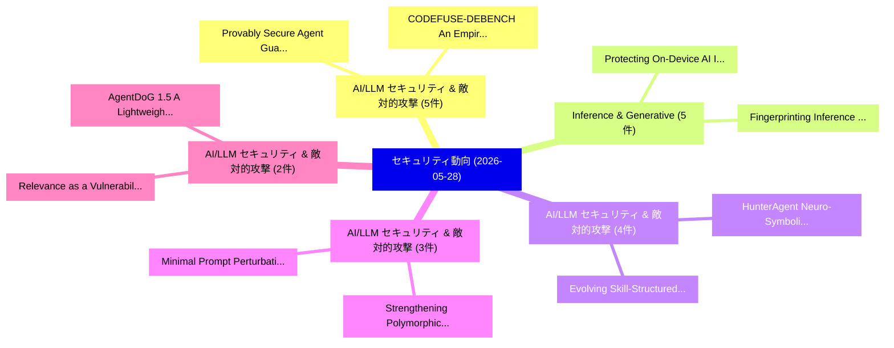

# 📅 02_daily: 日次エグゼクティブサマリー報告書 (2026-05-28)

**集計日時**: 2026-10-02 23:06:12 UTC  
**対象日付**: 2026-05-28  
**本日収集論文数**: 51 件  

---

## 💡 主要セキュリティ動向・脅威インサイト (Executive Insights)

本日の収集論文（計 51 件）において、以下の重点セキュリティ領域で活発な研究動向が確認されました：
- **AI/LLM セキュリティ & 敵対的攻撃** (5 件): 注目論文として 「Provably Secure Agent Guardrai...」、「CODEFUSE-DEBENCH: An Empirical...」 等が発表され、実務防御および攻撃検証の進展が見られます。
- **Inference & Generative** (5 件): 注目論文として 「Protecting On-Device AI Infere...」、「Fingerprinting Inference Syste...」 等が発表され、実務防御および攻撃検証の進展が見られます。
- **AI/LLM セキュリティ & 敵対的攻撃** (4 件): 注目論文として 「Evolving Skill-Structured Atta...」、「HunterAgent: Neuro-Symbolic At...」 等が発表され、実務防御および攻撃検証の進展が見られます。
- **AI/LLM セキュリティ & 敵対的攻撃** (3 件): 注目論文として 「Minimal Prompt Perturbations L...」、「Strengthening Polymorphic Prom...」 等が発表され、実務防御および攻撃検証の進展が見られます。
- **AI/LLM セキュリティ & 敵対的攻撃** (2 件): 注目論文として 「Relevance as a Vulnerability: ...」、「AgentDoG 1.5: A Lightweight an...」 等が発表され、実務防御および攻撃検証の進展が見られます。

### 🗺️ 技術・脅威トピックマインドマップ

---

## 📌 日次セキュリティ論文一覧 (日本語表形式)

| No | arXiv ID | 論文タイトル (日本語訳) | 重要キーワード | 構造化エグゼクティブ要約 (背景・提案・影響) | 脅威分類 | 詳細リンク |
|---|---|---|---|---|---|---|
| 1 | `2605.29210v1` | [SAMD: A Tool for Identifying False Data Injection Scenarios in AI/ML-enabled Medical Devices（セキュリティ分析論文）](../../okf/papers/2026-05-28/2605.29210.md) | `Identifying False Data Injection Scenarios`, `Medical Devices`, `ML-enabled Medical` | 【提案】概要 (Overview & Key Finding) 本論文「SAMD: A Tool for Identifying False Data Injection Scena...。実証評価により経営層・セキュリティ管理者向け推奨アクション (E... | `arXiv` | [arXiv](https://arxiv.org/abs/2605.29210v1) &#124; [OKF](../../okf/papers/2026-05-28/2605.29210.md) |
| 2 | `2605.29224v1` | [Relevance as a Vulnerability: How Web Retrieval Degrades Safety Alignment in LLMエージェント](../../okf/papers/2026-05-28/2605.29224.md) | `Aditya Nawal`, `Manit Baser`, `Mohan Gurusamy` | 【提案】概要 (Overview & Key Finding) 本論文「Relevance as a 脆弱性: How Web Retrieval Degrades Safety A...。実証評価により経営層・セキュリティ管理者向け推奨アクション (E... | `arXiv` | [arXiv](https://arxiv.org/abs/2605.29224v1) &#124; [OKF](../../okf/papers/2026-05-28/2605.29224.md) |
| 3 | `2605.29226v1` | [S3C2 Summit 2025-09: Industry Secure Supply Chain Summit（セキュリティ分析論文）](../../okf/papers/2026-05-28/2605.29226.md) | `Industry Secure Supply Chain Summit`, `Md Atiqur Rahman`, `Yasemin Acar` | 【提案】概要 (Overview & Key Finding) 本論文「S3C2 Summit 2025-09: Industry Secure Supply Chain Summi...。実証評価により経営層・セキュリティ管理者向け推奨アクション (E... | `arXiv` | [arXiv](https://arxiv.org/abs/2605.29226v1) &#124; [OKF](../../okf/papers/2026-05-28/2605.29226.md) |
| 4 | `2605.29237v2` | [Evolving Skill-Structured Attack Memory Enhances LLM Jailbreaking（セキュリティ分析論文）](../../okf/papers/2026-05-28/2605.29237.md) | `Structured Attack Memory Enhances`, `Evolving Skill`, `Skill-Structured Attack` | 【提案】概要 (Overview & Key Finding) 本論文「Evolving Skill-Structured Attack Memory Enhances LLM ジェ...。実証評価により経営層・セキュリティ管理者向け推奨アクション (E... | `AI/ML Security` | [arXiv](https://arxiv.org/abs/2605.29237v2) &#124; [OKF](../../okf/papers/2026-05-28/2605.29237.md) |
| 5 | `2605.29245v2` | [Implicit Identity Technologies for LLMs: Fingerprinting and Watermarking across Datasets, Models, and Generated Content（セキュリティ分析論文）](../../okf/papers/2026-05-28/2605.29245.md) | `Implicit Identity Technologies`, `Generated Content`, `Bing Liu` | 【提案】概要 (Overview & Key Finding) 本論文「Implicit Identity Technologies for LLMs: Fingerprinting...。実証評価により経営層・セキュリティ管理者向け推奨アクション (E... | `arXiv` | [arXiv](https://arxiv.org/abs/2605.29245v2) &#124; [OKF](../../okf/papers/2026-05-28/2605.29245.md) |
| 6 | `2605.29251v1` | [Provably Secure Agent Guardrail（セキュリティ分析論文）](../../okf/papers/2026-05-28/2605.29251.md) | `Provably Secure Agent Guardrail`, `Benlong Wu`, `Weiming Zhang` | 【提案】概要 (Overview & Key Finding) 本論文「Provably Secure Agent Guardrail（セキュリティ分析論文）」（原題: Provab...。実証評価により経営層・セキュリティ管理者向け推奨アクション (E... | `arXiv` | [arXiv](https://arxiv.org/abs/2605.29251v1) &#124; [OKF](../../okf/papers/2026-05-28/2605.29251.md) |
| 7 | `2605.29269v1` | [HunterAgent: Neuro-Symbolic Attack Trace Reconstruction under Anti-Forensics（セキュリティ分析論文）](../../okf/papers/2026-05-28/2605.29269.md) | `Symbolic Attack Trace Reconstruction`, `Neuro-Symbolic Attack`, `Guangze Zhao` | 【提案】概要 (Overview & Key Finding) 本論文「HunterAgent: Neuro-Symbolic Attack Trace Reconstruction...。実証評価により経営層・セキュリティ管理者向け推奨アクション (E... | `arXiv` | [arXiv](https://arxiv.org/abs/2605.29269v1) &#124; [OKF](../../okf/papers/2026-05-28/2605.29269.md) |
| 8 | `2605.29353v1` | [DeepFake Forensics AI: A Multi-Modal Detection and Blockchain-Anchored Evidence Management Platform（セキュリティ分析論文）](../../okf/papers/2026-05-28/2605.29353.md) | `Anchored Evidence Management Platform`, `Modal Detection`, `Multi-Modal Detection` | 【提案】概要 (Overview & Key Finding) 本論文「DeepFake Forensics AI: A Multi-Modal Detection and Bloc...。実証評価により経営層・セキュリティ管理者向け推奨アクション (E... | `arXiv` | [arXiv](https://arxiv.org/abs/2605.29353v1) &#124; [OKF](../../okf/papers/2026-05-28/2605.29353.md) |
| 9 | `2605.29354v1` | [Harmless Yet Harmful: Neutral Prompting Attacks for Stealthy Hallucination Steering in Agent Skills（セキュリティ分析論文）](../../okf/papers/2026-05-28/2605.29354.md) | `Harmless Yet Harmful`, `Neutral Prompting Attacks`, `Stealthy Hallucination Steering` | 【提案】概要 (Overview & Key Finding) 本論文「Harmless Yet Harmful: Neutral Prompting Attacks for Ste...。実証評価により経営層・セキュリティ管理者向け推奨アクション (E... | `arXiv` | [arXiv](https://arxiv.org/abs/2605.29354v1) &#124; [OKF](../../okf/papers/2026-05-28/2605.29354.md) |
| 10 | `2605.29434v1` | [AliMark: Enhancing Robustness of Sentence-Level Watermarking Against Text Paraphrasing（セキュリティ分析論文）](../../okf/papers/2026-05-28/2605.29434.md) | `Enhancing Robustness`, `Sentence-Level Watermarking`, `Yuexin Li` | 【提案】概要 (Overview & Key Finding) 本論文「AliMark: Enhancing Robustness of Sentence-Level Waterma...。実証評価により経営層・セキュリティ管理者向け推奨アクション (E... | `arXiv` | [arXiv](https://arxiv.org/abs/2605.29434v1) &#124; [OKF](../../okf/papers/2026-05-28/2605.29434.md) |
| 11 | `2605.29450v1` | [Protecting On-Device AI Inference: A Systematic Review of Attacks and Defence Mechanisms（セキュリティ分析論文）](../../okf/papers/2026-05-28/2605.29450.md) | `Systematic Review`, `Defence Mechanisms`, `On-Device AI` | 【提案】概要 (Overview & Key Finding) 本論文「Protecting On-Device AI Inference: A Systematic Review ...。実証評価により経営層・セキュリティ管理者向け推奨アクション (E... | `arXiv` | [arXiv](https://arxiv.org/abs/2605.29450v1) &#124; [OKF](../../okf/papers/2026-05-28/2605.29450.md) |
| 12 | `2605.29465v1` | [Bridging Theory and Practice: An Executable Taxonomy of Security Properties for ProVerif and Tamarin（セキュリティ分析論文）](../../okf/papers/2026-05-28/2605.29465.md) | `Bridging Theory`, `Security Properties`, `Leonard Tudorache` | 【提案】概要 (Overview & Key Finding) 本論文「Bridging Theory and Practice: An Executable Taxonomy of...。実証評価により経営層・セキュリティ管理者向け推奨アクション (E... | `arXiv` | [arXiv](https://arxiv.org/abs/2605.29465v1) &#124; [OKF](../../okf/papers/2026-05-28/2605.29465.md) |
| 13 | `2605.29468v1` | [SciIntBench: Measuring LLM Compliance with Research Integrity Norms Under Adversarial Framing（セキュリティ分析論文）](../../okf/papers/2026-05-28/2605.29468.md) | `Almene De Meran Meguimtsop`, `Maria Leonor Pacheco`, `Raw Meta` | 【提案】概要 (Overview & Key Finding) 本論文「SciIntBench: Measuring LLM Compliance with Research Int...。実証評価により経営層・セキュリティ管理者向け推奨アクション (E... | `arXiv` | [arXiv](https://arxiv.org/abs/2605.29468v1) &#124; [OKF](../../okf/papers/2026-05-28/2605.29468.md) |
| 14 | `2605.29490v1` | [CODEFUSE-DEBENCH: An Empirical Study on Readability, Recompilability, and Functionality（セキュリティ分析論文）](../../okf/papers/2026-05-28/2605.29490.md) | `Puzhuo Liu`, `Yuhan Huang`, `Jianlei Chi` | 【提案】概要 (Overview & Key Finding) 本論文「CODEFUSE-DEBENCH: An Empirical Study on Readability, Re...。実証評価により経営層・セキュリティ管理者向け推奨アクション (E... | `arXiv` | [arXiv](https://arxiv.org/abs/2605.29490v1) &#124; [OKF](../../okf/papers/2026-05-28/2605.29490.md) |
| 15 | `2605.29524v2` | [KBF: Knowledge Boundary as Fingerprint for Language Model and Black-Box API Auditing（セキュリティ分析論文）](../../okf/papers/2026-05-28/2605.29524.md) | `Knowledge Boundary`, `Language Model`, `Black-Box API` | 【提案】概要 (Overview & Key Finding) 本論文「KBF: Knowledge Boundary as Fingerprint for Language Mod...。実証評価により経営層・セキュリティ管理者向け推奨アクション (E... | `arXiv` | [arXiv](https://arxiv.org/abs/2605.29524v2) &#124; [OKF](../../okf/papers/2026-05-28/2605.29524.md) |
| 16 | `2605.29526v2` | [Temporal Motif-aware Graph Test-time Adaptation for OOD Blockchain Anomaly Detection（セキュリティ分析論文）](../../okf/papers/2026-05-28/2605.29526.md) | `Blockchain Anomaly Detection`, `Temporal Motif`, `Graph Test` | 【提案】概要 (Overview & Key Finding) 本論文「Temporal Motif-aware Graph Test-time Adaptation for OOD...。実証評価により経営層・セキュリティ管理者向け推奨アクション (E... | `arXiv` | [arXiv](https://arxiv.org/abs/2605.29526v2) &#124; [OKF](../../okf/papers/2026-05-28/2605.29526.md) |
| 17 | `2605.29569v2` | [LoRA-Key: User-Centric LoRA Watermarking for Text-to-Image Diffusion Models（セキュリティ分析論文）](../../okf/papers/2026-05-28/2605.29569.md) | `Image Diffusion Models`, `User-Centric LoRA`, `Yaopeng Wang` | 【提案】概要 (Overview & Key Finding) 本論文「LoRA-Key: User-Centric LoRA Watermarking for Text-to-Im...。実証評価により経営層・セキュリティ管理者向け推奨アクション (E... | `arXiv` | [arXiv](https://arxiv.org/abs/2605.29569v2) &#124; [OKF](../../okf/papers/2026-05-28/2605.29569.md) |
| 18 | `2605.29620v1` | [Control Flow Graph Recovery for Dynamically Loaded Code via Symbolic Library Resolution（セキュリティ分析論文）](../../okf/papers/2026-05-28/2605.29620.md) | `Control Flow Graph Recovery`, `Dynamically Loaded Code`, `Symbolic Library Resolution` | 【提案】概要 (Overview & Key Finding) 本論文「Control Flow Graph Recovery for Dynamically Loaded Code...。実証評価により経営層・セキュリティ管理者向け推奨アクション (E... | `arXiv` | [arXiv](https://arxiv.org/abs/2605.29620v1) &#124; [OKF](../../okf/papers/2026-05-28/2605.29620.md) |
| 19 | `2605.29621v1` | [Information Security in Small-Scale Protests: Surveillance of Ugandan Anti-EACOP Protesters（セキュリティ分析論文）](../../okf/papers/2026-05-28/2605.29621.md) | `Information Security`, `Scale Protests`, `Small-Scale Protests` | 【提案】概要 (Overview & Key Finding) 本論文「Information Security in Small-Scale Protests: Surveilla...。実証評価により経営層・セキュリティ管理者向け推奨アクション (E... | `arXiv` | [arXiv](https://arxiv.org/abs/2605.29621v1) &#124; [OKF](../../okf/papers/2026-05-28/2605.29621.md) |
| 20 | `2605.29651v2` | [Scarcity Is Not Enough: Structural Limits of Linear Sybil Cost Under Parallelizable Resources（セキュリティ分析論文）](../../okf/papers/2026-05-28/2605.29651.md) | `Structural Limits`, `Homayoun Maleki`, `Nekane Sainz` | 【提案】背景とセキュリティ上の課題 (Background & Problem) 本研究はサイバー脅威環境におけるセキュリティ構造・脆弱性の検証を目的としています。(主要検出項目: ...。実証評価により経営層・セキュリティ管理者向け推奨アクション (E... | `arXiv` | [arXiv](https://arxiv.org/abs/2605.29651v2) &#124; [OKF](../../okf/papers/2026-05-28/2605.29651.md) |
| 21 | `2605.29654v1` | [FIDEM: A Standard-Compliant Framework for Secure Binding of MUD Profiles to IoT Devices（セキュリティ分析論文）](../../okf/papers/2026-05-28/2605.29654.md) | `Secure Binding`, `Alessandro Lotto`, `Savio Sciancalepore` | 【提案】概要 (Overview & Key Finding) 本論文「FIDEM: A Standard-Compliant Framework for Secure Bindin...。実証評価により経営層・セキュリティ管理者向け推奨アクション (E... | `arXiv` | [arXiv](https://arxiv.org/abs/2605.29654v1) &#124; [OKF](../../okf/papers/2026-05-28/2605.29654.md) |
| 22 | `2605.29737v1` | [Minimal Prompt Perturbations Lead to Code Vulnerabilities: Prompt Fragility and Hidden-State Signals in Coding LLMs（セキュリティ分析論文）](../../okf/papers/2026-05-28/2605.29737.md) | `Minimal Prompt Perturbations Lead`, `Code Vulnerabilities`, `Prompt Fragility` | 【提案】概要 (Overview & Key Finding) 本論文「Minimal Prompt Perturbations Lead to Code Vulnerabiliti...。実証評価により経営層・セキュリティ管理者向け推奨アクション (E... | `arXiv` | [arXiv](https://arxiv.org/abs/2605.29737v1) &#124; [OKF](../../okf/papers/2026-05-28/2605.29737.md) |
| 23 | `2605.29760v1` | [Secure Distributed Hypothesis Testing（セキュリティ分析論文）](../../okf/papers/2026-05-28/2605.29760.md) | `Secure Distributed Hypothesis Testing`, `Varun Narayanan`, `Raw Meta` | 【提案】概要 (Overview & Key Finding) 本論文「Secure Distributed Hypothesis Testing（セキュリティ分析論文）」（原題: ...。実証評価によりSahasranand - **公開日時**: `... | `arXiv` | [arXiv](https://arxiv.org/abs/2605.29760v1) &#124; [OKF](../../okf/papers/2026-05-28/2605.29760.md) |
| 24 | `2605.29801v1` | [AgentDoG 1.5: A Lightweight and Scalable Alignment Framework for AI Agent Safety and Security（セキュリティ分析論文）](../../okf/papers/2026-05-28/2605.29801.md) | `Agent Safety`, `Dongrui Liu`, `Yu Li` | 【提案】概要 (Overview & Key Finding) 本論文「AgentDoG 1.5: A Lightweight and Scalable Alignment Fram...。実証評価により経営層・セキュリティ管理者向け推奨アクション (E... | `arXiv` | [arXiv](https://arxiv.org/abs/2605.29801v1) &#124; [OKF](../../okf/papers/2026-05-28/2605.29801.md) |
| 25 | `2605.29809v1` | [Cert-LAS: Toward Certified Model Ownership Verification for Text-to-Image Diffusion Models via Layer-Adaptive Smoothing（セキュリティ分析論文）](../../okf/papers/2026-05-28/2605.29809.md) | `Toward Certified Model Ownership Verification`, `Image Diffusion Models`, `Adaptive Smoothing` | 【提案】概要 (Overview & Key Finding) 本論文「Cert-LAS: Toward Certified Model Ownership Verification...。実証評価により経営層・セキュリティ管理者向け推奨アクション (E... | `arXiv` | [arXiv](https://arxiv.org/abs/2605.29809v1) &#124; [OKF](../../okf/papers/2026-05-28/2605.29809.md) |
| 26 | `2605.29868v1` | [Ciphera: A Decentralised Biometric Identity Framework（セキュリティ分析論文）](../../okf/papers/2026-05-28/2605.29868.md) | `Ankit Kanaiyalal Prajapati`, `Mohammed Mahir Rahman`, `Shahzad Memon` | 【提案】概要 (Overview & Key Finding) 本論文「Ciphera: A Decentralised Biometric Identity Framework（セ...。実証評価により経営層・セキュリティ管理者向け推奨アクション (E... | `arXiv` | [arXiv](https://arxiv.org/abs/2605.29868v1) &#124; [OKF](../../okf/papers/2026-05-28/2605.29868.md) |
| 27 | `2605.29901v1` | [Dissecting the Black Box: Circuit-Level LLM Vulnerability Detectionの分析](../../okf/papers/2026-05-28/2605.29901.md) | `Black Box`, `Vulnerability Detection`, `Circuit-Level LLM` | 【提案】概要 (Overview & Key Finding) 本論文「Dissecting the Black Box: Circuit-Level LLM 脆弱性 Detecti...。実証評価により経営層・セキュリティ管理者向け推奨アクション (E... | `arXiv` | [arXiv](https://arxiv.org/abs/2605.29901v1) &#124; [OKF](../../okf/papers/2026-05-28/2605.29901.md) |
| 28 | `2605.29960v1` | [Hijacking Agent Memory: Stealthy Trojan Attacks Through Conversational Interaction（セキュリティ分析論文）](../../okf/papers/2026-05-28/2605.29960.md) | `Hijacking Agent Memory`, `Hongtao Wang`, `Se Yang` | 【提案】概要 (Overview & Key Finding) 本論文「Hijacking Agent Memory: Stealthy Trojan Attacks Through...。実証評価により経営層・セキュリティ管理者向け推奨アクション (E... | `arXiv` | [arXiv](https://arxiv.org/abs/2605.29960v1) &#124; [OKF](../../okf/papers/2026-05-28/2605.29960.md) |
| 29 | `2605.29963v1` | [Honeyval: A Comprehensive Evaluation Framework for LLM-powered HTTP Honeypots（セキュリティ分析論文）](../../okf/papers/2026-05-28/2605.29963.md) | `LLM-powered HTTP`, `Mark Vero`, `Fabian Kaczmarczyck` | 【提案】概要 (Overview & Key Finding) 本論文「Honeyval: A Comprehensive Evaluation Framework for LLM-...。実証評価により経営層・セキュリティ管理者向け推奨アクション (E... | `arXiv` | [arXiv](https://arxiv.org/abs/2605.29963v1) &#124; [OKF](../../okf/papers/2026-05-28/2605.29963.md) |
| 30 | `2605.29979v1` | [Fingerprinting Inference Systems of 大規模言語モデル](../../okf/papers/2026-05-28/2605.29979.md) | `Fingerprinting Inference Systems`, `Large Language Models`, `Anna Wimbauer` | 【提案】概要 (Overview & Key Finding) 本論文「Fingerprinting Inference Systems of 大規模言語モデル」（原題: Finge...。実証評価により経営層・セキュリティ管理者向け推奨アクション (E... | `arXiv` | [arXiv](https://arxiv.org/abs/2605.29979v1) &#124; [OKF](../../okf/papers/2026-05-28/2605.29979.md) |
| 31 | `2605.30040v1` | [Token Inflation: How Dishonest Providers Can Overcharge for Large Language Model Usage（セキュリティ分析論文）](../../okf/papers/2026-05-28/2605.30040.md) | `Large Language Model Usage`, `Token Inflation`, `Shahinul Hoque` | 【提案】概要 (Overview & Key Finding) 本論文「Token Inflation: How Dishonest Providers Can Overcharge...。実証評価により経営層・セキュリティ管理者向け推奨アクション (E... | `arXiv` | [arXiv](https://arxiv.org/abs/2605.30040v1) &#124; [OKF](../../okf/papers/2026-05-28/2605.30040.md) |
| 32 | `2605.30096v1` | [How Reliable Are AI Attackers Against a Fixed Vulnerable Target? A 400-Run Empirical Study of LLM Penetration Testing Consistency（セキュリティ分析論文）](../../okf/papers/2026-05-28/2605.30096.md) | `Fixed Vulnerable Target`, `Penetration Testing Consistency`, `400-Run Empirical` | 【提案】A 400-Run Empirical Study of LLM Penetration Testing Consistency ### (日本語題名: How Reliab...。実証評価により経営層・セキュリティ管理者向け推奨アクション (E... | `arXiv` | [arXiv](https://arxiv.org/abs/2605.30096v1) &#124; [OKF](../../okf/papers/2026-05-28/2605.30096.md) |
| 33 | `2605.30123v2` | [Privacy-Enhanced Zero-Order 連合学習 via xMK-CKKS over Wireless Channels](../../okf/papers/2026-05-28/2605.30123.md) | `Enhanced Zero`, `Wireless Channels`, `Privacy-Enhanced Zero` | 【提案】概要 (Overview & Key Finding) 本論文「Privacy-Enhanced Zero-Order 連合学習 via xMK-CKKS over Wire...。実証評価により経営層・セキュリティ管理者向け推奨アクション (E... | `arXiv` | [arXiv](https://arxiv.org/abs/2605.30123v2) &#124; [OKF](../../okf/papers/2026-05-28/2605.30123.md) |
| 34 | `2605.30162v1` | [BioRefusalAudit: Auditing Biosecurity Refusal Depth Using General and Domain-Fine-Tuned Sparse Autoencoders（セキュリティ分析論文）](../../okf/papers/2026-05-28/2605.30162.md) | `Auditing Biosecurity Refusal Depth Using General`, `Tuned Sparse Autoencoders`, `Raw Meta` | 【提案】概要 (Overview & Key Finding) 本論文「BioRefusalAudit: Auditing Biosecurity Refusal Depth Usi...。実証評価により経営層・セキュリティ管理者向け推奨アクション (E... | `arXiv` | [arXiv](https://arxiv.org/abs/2605.30162v1) &#124; [OKF](../../okf/papers/2026-05-28/2605.30162.md) |
| 35 | `2605.30189v1` | [Token-Level Generalization in LoRA Adapter Backdoors: Attack Characterization and Behavioral Detection（セキュリティ分析論文）](../../okf/papers/2026-05-28/2605.30189.md) | `Level Generalization`, `Adapter Backdoors`, `Attack Characterization` | 【提案】概要 (Overview & Key Finding) 本論文「Token-Level Generalization in LoRA Adapter Backdoors: A...。実証評価により経営層・セキュリティ管理者向け推奨アクション (E... | `arXiv` | [arXiv](https://arxiv.org/abs/2605.30189v1) &#124; [OKF](../../okf/papers/2026-05-28/2605.30189.md) |
| 36 | `2605.30203v1` | [A Bayesian Approach to Membership Inference for Statistical Release（セキュリティ分析論文）](../../okf/papers/2026-05-28/2605.30203.md) | `Membership Inference`, `Statistical Release`, `Lisa Oakley` | 【提案】概要 (Overview & Key Finding) 本論文「A Bayesian Approach to Membership Inference for Statist...。実証評価により経営層・セキュリティ管理者向け推奨アクション (E... | `arXiv` | [arXiv](https://arxiv.org/abs/2605.30203v1) &#124; [OKF](../../okf/papers/2026-05-28/2605.30203.md) |
| 37 | `2605.30212v1` | [bpK#: Delegatable Pseudonyms And Their Applications to National eID Systems（セキュリティ分析論文）](../../okf/papers/2026-05-28/2605.30212.md) | `Stephan Krenn`, `Doryan Lesaignoux`, `Sebastian Ramacher` | 【提案】概要 (Overview & Key Finding) 本論文「bpK#: Delegatable Pseudonyms And Their Applications to ...。実証評価により経営層・セキュリティ管理者向け推奨アクション (E... | `arXiv` | [arXiv](https://arxiv.org/abs/2605.30212v1) &#124; [OKF](../../okf/papers/2026-05-28/2605.30212.md) |
| 38 | `2605.30312v1` | [DP-SAPF: Saliency-Aware Parameter Fine-tuning of Public Models for Differentially Private Image Synthesis（セキュリティ分析論文）](../../okf/papers/2026-05-28/2605.30312.md) | `Aware Parameter Fine`, `Differentially Private Image Synthesis`, `Public Models` | 【提案】概要 (Overview & Key Finding) 本論文「DP-SAPF: Saliency-Aware Parameter Fine-tuning of Public...。実証評価により経営層・セキュリティ管理者向け推奨アクション (E... | `arXiv` | [arXiv](https://arxiv.org/abs/2605.30312v1) &#124; [OKF](../../okf/papers/2026-05-28/2605.30312.md) |
| 39 | `2605.30393v1` | [NumLeak: Public Numeric Benchmarks as Latent Labels in Foundation Models（セキュリティ分析論文）](../../okf/papers/2026-05-28/2605.30393.md) | `Public Numeric Benchmarks`, `Latent Labels`, `Foundation Models` | 【提案】概要 (Overview & Key Finding) 本論文「NumLeak: Public Numeric Benchmarks as Latent Labels in ...。実証評価により経営層・セキュリティ管理者向け推奨アクション (E... | `arXiv` | [arXiv](https://arxiv.org/abs/2605.30393v1) &#124; [OKF](../../okf/papers/2026-05-28/2605.30393.md) |
| 40 | `2605.30454v1` | [The Surface You Test Is Not the Surface That Breaks（セキュリティ分析論文）](../../okf/papers/2026-05-28/2605.30454.md) | `Syed Nazmus Sakib`, `Shahrear Bin Amin`, `Nafiul Haque` | 【提案】背景とセキュリティ上の課題 (Background & Problem) 本研究はサイバー脅威環境におけるセキュリティ構造・脆弱性の検証を目的としています。(主要検出項目: ...。実証評価により経営層・セキュリティ管理者向け推奨アクション (E... | `arXiv` | [arXiv](https://arxiv.org/abs/2605.30454v1) &#124; [OKF](../../okf/papers/2026-05-28/2605.30454.md) |
| 41 | `2605.30476v1` | [Local Differential Privacy with Correlated Noise Achieves Central-DP Optimal Cost（セキュリティ分析論文）](../../okf/papers/2026-05-28/2605.30476.md) | `Correlated Noise Achieves Central`, `Local Differential Privacy`, `Optimal Cost` | 【提案】概要 (Overview & Key Finding) 本論文「Local 差分プライバシー with Correlated Noise Achieves Central-D...。実証評価により経営層・セキュリティ管理者向け推奨アクション (E... | `arXiv` | [arXiv](https://arxiv.org/abs/2605.30476v1) &#124; [OKF](../../okf/papers/2026-05-28/2605.30476.md) |
| 42 | `2605.30534v1` | [Strengthening Polymorphic Prompt Assembling: Dynamic Separator Generation Against Emerging Prompt Injection Attacks（セキュリティ分析論文）](../../okf/papers/2026-05-28/2605.30534.md) | `Strengthening Polymorphic Prompt Assembling`, `Dynamic Separator Generation Ag`, `Nima Dorzhiev` | 【提案】概要 (Overview & Key Finding) 本論文「Strengthening Polymorphic Prompt Assembling: Dynamic Se...。実証評価により経営層・セキュリティ管理者向け推奨アクション (E... | `arXiv` | [arXiv](https://arxiv.org/abs/2605.30534v1) &#124; [OKF](../../okf/papers/2026-05-28/2605.30534.md) |
| 43 | `2605.30544v1` | [On-Device Generative AI for GDPR-Compliant Visual Monitoring: Natural Language Alerts from Local Object Detection（セキュリティ分析論文）](../../okf/papers/2026-05-28/2605.30544.md) | `Compliant Visual Monitoring`, `Natural Language Alerts`, `Local Object Detection` | 【提案】概要 (Overview & Key Finding) 本論文「On-Device Generative AI for GDPR-Compliant Visual Monit...。実証評価により経営層・セキュリティ管理者向け推奨アクション (E... | `arXiv` | [arXiv](https://arxiv.org/abs/2605.30544v1) &#124; [OKF](../../okf/papers/2026-05-28/2605.30544.md) |
| 44 | `2605.30578v1` | [AdvScene: Rethinking Adversarial Patch Evaluation Through Scene Robustness（セキュリティ分析論文）](../../okf/papers/2026-05-28/2605.30578.md) | `Raw Meta`, `Executive Summary`, `Key Finding` | 【提案】概要 (Overview & Key Finding) 本論文「AdvScene: Rethinking Adversarial Patch Evaluation Throu...。実証評価により# AdvScene: Rethinking Ad... | `arXiv` | [arXiv](https://arxiv.org/abs/2605.30578v1) &#124; [OKF](../../okf/papers/2026-05-28/2605.30578.md) |
| 45 | `2605.30604v1` | [An Organization-Scoped LLM Agent Runtime Architecture for Regulated サイバーセキュリティ Operations](../../okf/papers/2026-05-28/2605.30604.md) | `Agent Runtime Architecture`, `Organization-Scoped LLM`, `Regulated Cybersecurity Operations` | 【提案】概要 (Overview & Key Finding) 本論文「An Organization-Scoped LLM Agent Runtime Architecture f...。実証評価により経営層・セキュリティ管理者向け推奨アクション (E... | `arXiv` | [arXiv](https://arxiv.org/abs/2605.30604v1) &#124; [OKF](../../okf/papers/2026-05-28/2605.30604.md) |
| 46 | `2605.30613v1` | [CacheProbe: Auditing Prompt Cache Isolation in Gateway APIs（セキュリティ分析論文）](../../okf/papers/2026-05-28/2605.30613.md) | `Auditing Prompt Cache Isolation`, `Ryan Fahey`, `Raw Meta` | 【提案】概要 (Overview & Key Finding) 本論文「CacheProbe: Auditing Prompt Cache Isolation in Gateway ...。実証評価により経営層・セキュリティ管理者向け推奨アクション (E... | `arXiv` | [arXiv](https://arxiv.org/abs/2605.30613v1) &#124; [OKF](../../okf/papers/2026-05-28/2605.30613.md) |
| 47 | `2605.30614v1` | [Audio Pirates: Black-box Audio Watermark Removal via Diffusion Priors（セキュリティ分析論文）](../../okf/papers/2026-05-28/2605.30614.md) | `Audio Watermark Removal`, `Audio Pirates`, `Black-box Audio` | 【提案】概要 (Overview & Key Finding) 本論文「Audio Pirates: Black-box Audio Watermark Removal via Di...。実証評価により経営層・セキュリティ管理者向け推奨アクション (E... | `arXiv` | [arXiv](https://arxiv.org/abs/2605.30614v1) &#124; [OKF](../../okf/papers/2026-05-28/2605.30614.md) |
| 48 | `2605.30650v1` | [When AI Meets Wall Street: A Survey on Trustworthy AI in Fintech（セキュリティ分析論文）](../../okf/papers/2026-05-28/2605.30650.md) | `Meets Wall Street`, `Moe Thandar Kyaw Wynn`, `Kwang Raymond Choo` | 【提案】概要 (Overview & Key Finding) 本論文「When AI Meets Wall Street: A Survey on Trustworthy AI i...。実証評価により経営層・セキュリティ管理者向け推奨アクション (E... | `arXiv` | [arXiv](https://arxiv.org/abs/2605.30650v1) &#124; [OKF](../../okf/papers/2026-05-28/2605.30650.md) |
| 49 | `2605.30667v1` | [Automatically Attacking Software Reverse Engineering AI Agents（セキュリティ分析論文）](../../okf/papers/2026-05-28/2605.30667.md) | `Automatically Attacking Software Reverse Engineering`, `Brian Crawford`, `Justin Phillips` | 【提案】概要 (Overview & Key Finding) 本論文「Automatically Attacking Software Reverse Engineering AI...。実証評価により経営層・セキュリティ管理者向け推奨アクション (E... | `arXiv` | [arXiv](https://arxiv.org/abs/2605.30667v1) &#124; [OKF](../../okf/papers/2026-05-28/2605.30667.md) |
| 50 | `2606.00134v1` | [XAI-SOH-FL: Enhancing SOH-FL with Adaptive Aggregation and Explainable AI for Intrusion Detection in Heterogeneous IoT（セキュリティ分析論文）](../../okf/papers/2026-05-28/2606.00134.md) | `Adaptive Aggregation`, `Intrusion Detection`, `Muhammad Khuram Shahzad` | 【提案】概要 (Overview & Key Finding) 本論文「XAI-SOH-FL: Enhancing SOH-FL with Adaptive Aggregation ...。実証評価により経営層・セキュリティ管理者向け推奨アクション (E... | `arXiv` | [arXiv](https://arxiv.org/abs/2606.00134v1) &#124; [OKF](../../okf/papers/2026-05-28/2606.00134.md) |
| 51 | `2606.00136v1` | [Generative AI and Digital Ecosystem Resilience: A Proactive Lifecycle-Based Survey（セキュリティ分析論文）](../../okf/papers/2026-05-28/2606.00136.md) | `Digital Ecosystem Resilience`, `Proactive Lifecycle`, `Based Survey` | 【提案】概要 (Overview & Key Finding) 本論文「Generative AI and Digital Ecosystem Resilience: A Proac...。実証評価により経営層・セキュリティ管理者向け推奨アクション (E... | `arXiv` | [arXiv](https://arxiv.org/abs/2606.00136v1) &#124; [OKF](../../okf/papers/2026-05-28/2606.00136.md) |

