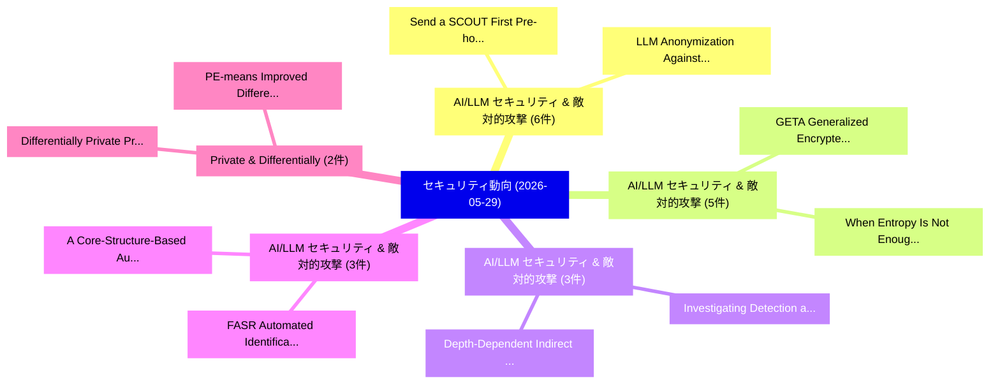

# 📅 02_daily: 日次エグゼクティブサマリー報告書 (2026-05-29)

**集計日時**: 2026-10-02 23:06:12 UTC  
**対象日付**: 2026-05-29  
**本日収集論文数**: 38 件  

---

## 💡 主要セキュリティ動向・脅威インサイト (Executive Insights)

本日の収集論文（計 38 件）において、以下の重点セキュリティ領域で活発な研究動向が確認されました：
- **AI/LLM セキュリティ & 敵対的攻撃** (6 件): 注目論文として 「Send a SCOUT First: Pre-hoc Re...」、「LLM Anonymization Against Agen...」 等が発表され、実務防御および攻撃検証の進展が見られます。
- **AI/LLM セキュリティ & 敵対的攻撃** (5 件): 注目論文として 「GETA: Generalized Encrypted Tr...」、「When Entropy Is Not Enough: Mu...」 等が発表され、実務防御および攻撃検証の進展が見られます。
- **AI/LLM セキュリティ & 敵対的攻撃** (3 件): 注目論文として 「Investigating Detection and Ob...」、「Depth-Dependent Indirect Promp...」 等が発表され、実務防御および攻撃検証の進展が見られます。
- **AI/LLM セキュリティ & 敵対的攻撃** (3 件): 注目論文として 「FASR: Automated Identification...」、「A Core-Structure-Based Automat...」 等が発表され、実務防御および攻撃検証の進展が見られます。
- **Private & Differentially** (2 件): 注目論文として 「Differentially Private Prefere...」、「PE-means: Improved Differentia...」 等が発表され、実務防御および攻撃検証の進展が見られます。

### 🗺️ 技術・脅威トピックマインドマップ

---

## 📌 日次セキュリティ論文一覧 (日本語表形式)

| No | arXiv ID | 論文タイトル (日本語訳) | 重要キーワード | 構造化エグゼクティブ要約 (背景・提案・影響) | 脅威分類 | 詳細リンク |
|---|---|---|---|---|---|---|
| 1 | `2605.30677v1` | [Investigating Detection and Obfuscation of Prompt Injection Attacks Against Software Reverse Engineering AI Agents（セキュリティ分析論文）](../../okf/papers/2026-05-29/2605.30677.md) | `Investigating Detection`, `Brian Crawford`, `Raw Meta` | 【提案】概要 (Overview & Key Finding) 本論文「Investigating Detection and Obfuscation of プロンプトインジェクショ...。実証評価により経営層・セキュリティ管理者向け推奨アクション (E... | `arXiv` | [arXiv](https://arxiv.org/abs/2605.30677v1) &#124; [OKF](../../okf/papers/2026-05-29/2605.30677.md) |
| 2 | `2605.30686v1` | [Depth-Dependent Indirect Prompt Injection in Tool-Calling ReAct Agents: Injection Depth, Payload Framing, and Turn-Budget Sensitivity（セキュリティ分析論文）](../../okf/papers/2026-05-29/2605.30686.md) | `Dependent Indirect Prompt Injection`, `Injection Depth`, `Payload Framing` | 【提案】概要 (Overview & Key Finding) 本論文「Depth-Dependent Indirect プロンプトインジェクション in Tool-Calling ...。実証評価により経営層・セキュリティ管理者向け推奨アクション (E... | `arXiv` | [arXiv](https://arxiv.org/abs/2605.30686v1) &#124; [OKF](../../okf/papers/2026-05-29/2605.30686.md) |
| 3 | `2605.30693v1` | [Triaging Threats to Specialized Guardrails（セキュリティ分析論文）](../../okf/papers/2026-05-29/2605.30693.md) | `Triaging Threats`, `Specialized Guardrails`, `Wenjie Jacky Mo` | 【提案】概要 (Overview & Key Finding) 本論文「Triaging Threats to Specialized Guardrails（セキュリティ分析論文）」...。実証評価により経営層・セキュリティ管理者向け推奨アクション (E... | `arXiv` | [arXiv](https://arxiv.org/abs/2605.30693v1) &#124; [OKF](../../okf/papers/2026-05-29/2605.30693.md) |
| 4 | `2605.30697v1` | [FASR: Automated Identification of Unsafe Control Actions in STPA（セキュリティ分析論文）](../../okf/papers/2026-05-29/2605.30697.md) | `Unsafe Control Actions`, `Automated Identification`, `Ian Dardik` | 【提案】概要 (Overview & Key Finding) 本論文「FASR: Automated Identification of Unsafe Control Action...。実証評価により経営層・セキュリティ管理者向け推奨アクション (E... | `arXiv` | [arXiv](https://arxiv.org/abs/2605.30697v1) &#124; [OKF](../../okf/papers/2026-05-29/2605.30697.md) |
| 5 | `2605.30732v1` | [How To Track Qubits Through Space and Time (Or: Sailing in a Quantum Boat)（セキュリティ分析論文）](../../okf/papers/2026-05-29/2605.30732.md) | `Quantum Boat`, `James Bartusek`, `Zikuan Huang` | 【提案】概要 (Overview & Key Finding) 本論文「How To Track Qubits Through Space and Time (Or: Sailing...。実証評価により経営層・セキュリティ管理者向け推奨アクション (E... | `arXiv` | [arXiv](https://arxiv.org/abs/2605.30732v1) &#124; [OKF](../../okf/papers/2026-05-29/2605.30732.md) |
| 6 | `2605.30808v1` | [Differentially Private Preference Data Synthesis for Large Language Model Alignment（セキュリティ分析論文）](../../okf/papers/2026-05-29/2605.30808.md) | `Differentially Private Preference Data Synthesis`, `Large Language Model Alignment`, `Fengyu Gao` | 【提案】概要 (Overview & Key Finding) 本論文「Differentially Private Preference Data Synthesis for La...。実証評価により経営層・セキュリティ管理者向け推奨アクション (E... | `arXiv` | [arXiv](https://arxiv.org/abs/2605.30808v1) &#124; [OKF](../../okf/papers/2026-05-29/2605.30808.md) |
| 7 | `2605.30837v2` | [Send a SCOUT First: Pre-hoc Reasoning for Adaptive Detector Allocation in Prompt-Injection Defense（セキュリティ分析論文）](../../okf/papers/2026-05-29/2605.30837.md) | `Adaptive Detector Allocation`, `Pre-hoc Reasoning`, `Injection Defense` | 【提案】概要 (Overview & Key Finding) 本論文「Send a SCOUT First: Pre-hoc Reasoning for Adaptive Dete...。実証評価により経営層・セキュリティ管理者向け推奨アクション (E... | `arXiv` | [arXiv](https://arxiv.org/abs/2605.30837v2) &#124; [OKF](../../okf/papers/2026-05-29/2605.30837.md) |
| 8 | `2605.30848v2` | [LLM Anonymization Against Agentic Re-Identification（セキュリティ分析論文）](../../okf/papers/2026-05-29/2605.30848.md) | `Ziwen Li`, `Jianing Wen`, `Tianshi Li` | 【提案】概要 (Overview & Key Finding) 本論文「LLM Anonymization Against Agentic Re-Identification（セキュ...。実証評価により経営層・セキュリティ管理者向け推奨アクション (E... | `arXiv` | [arXiv](https://arxiv.org/abs/2605.30848v2) &#124; [OKF](../../okf/papers/2026-05-29/2605.30848.md) |
| 9 | `2605.30883v1` | [TRACE: Task-Aware Adaptive Self-Evolving Agentic Jailbreaking（セキュリティ分析論文）](../../okf/papers/2026-05-29/2605.30883.md) | `Aware Adaptive Self`, `Evolving Agentic Jailbreaking`, `Task-Aware Adaptive` | 【提案】概要 (Overview & Key Finding) 本論文「TRACE: Task-Aware Adaptive Self-Evolving Agentic ジェイルブレ...。実証評価により経営層・セキュリティ管理者向け推奨アクション (E... | `arXiv` | [arXiv](https://arxiv.org/abs/2605.30883v1) &#124; [OKF](../../okf/papers/2026-05-29/2605.30883.md) |
| 10 | `2605.30902v1` | [A Core-Structure-Based Automated Analysis Tool for Commercial Virtualization Obfuscation Deobfuscation（セキュリティ分析論文）](../../okf/papers/2026-05-29/2605.30902.md) | `Commercial Virtualization Obfuscation Deobfuscation`, `Wanju Kim`, `Seoksu Lee` | 【提案】概要 (Overview & Key Finding) 本論文「A Core-Structure-Based Automated Analysis Tool for Comm...。実証評価により経営層・セキュリティ管理者向け推奨アクション (E... | `arXiv` | [arXiv](https://arxiv.org/abs/2605.30902v1) &#124; [OKF](../../okf/papers/2026-05-29/2605.30902.md) |
| 11 | `2605.30977v1` | [Software Platform for Hybrid Pseudo-Random Sequence Generation and Predictability Analysis Based on LFSR and Mersenne Twister（セキュリティ分析論文）](../../okf/papers/2026-05-29/2605.30977.md) | `Random Sequence Generation`, `Software Platform`, `Hybrid Pseudo` | 【提案】概要 (Overview & Key Finding) 本論文「Software Platform for Hybrid Pseudo-Random Sequence Gen...。実証評価により経営層・セキュリティ管理者向け推奨アクション (E... | `arXiv` | [arXiv](https://arxiv.org/abs/2605.30977v1) &#124; [OKF](../../okf/papers/2026-05-29/2605.30977.md) |
| 12 | `2605.30998v2` | [Free-Riding the Agentic Web: A Systematic Security x402 Paymentsの分析](../../okf/papers/2026-05-29/2605.30998.md) | `Agentic Web`, `Systematic Security`, `Shengchen Ling` | 【提案】概要 (Overview & Key Finding) 本論文「Free-Riding the Agentic Web: A Systematic Security x402...。実証評価により経営層・セキュリティ管理者向け推奨アクション (E... | `arXiv` | [arXiv](https://arxiv.org/abs/2605.30998v2) &#124; [OKF](../../okf/papers/2026-05-29/2605.30998.md) |
| 13 | `2605.31004v1` | [HE^2: A Communication-Light Heterogeneous Architecture for Efficient Fully Homomorphic Encryption（セキュリティ分析論文）](../../okf/papers/2026-05-29/2605.31004.md) | `Efficient Fully Homomorphic Encryption`, `Light Heterogeneous Architecture`, `Communication-Light Heterogeneous` | 【提案】概要 (Overview & Key Finding) 本論文「HE^2: A Communication-Light Heterogeneous Architecture ...。実証評価により経営層・セキュリティ管理者向け推奨アクション (E... | `arXiv` | [arXiv](https://arxiv.org/abs/2605.31004v1) &#124; [OKF](../../okf/papers/2026-05-29/2605.31004.md) |
| 14 | `2605.31020v1` | [Thou Shall Not Pass: Gatekeeping Outbound TLS Connections（セキュリティ分析論文）](../../okf/papers/2026-05-29/2605.31020.md) | `Gatekeeping Outbound`, `Matteo Franzil`, `Riccardo Germenia` | 【提案】背景とセキュリティ上の課題 (Background & Problem) 本研究はサイバー脅威環境におけるセキュリティ構造・脆弱性の検証を目的としています。(主要検出項目: ...。実証評価によりBrum, Matteo Franzil, Ric... | `arXiv` | [arXiv](https://arxiv.org/abs/2605.31020v1) &#124; [OKF](../../okf/papers/2026-05-29/2605.31020.md) |
| 15 | `2605.31042v1` | [From Prompt Injection to Persistent Control: Defending Agentic Harness Against Trojan Backdoors（セキュリティ分析論文）](../../okf/papers/2026-05-29/2605.31042.md) | `Persistent Control`, `Jiejun Tan`, `Zhicheng Dou` | 【提案】概要 (Overview & Key Finding) 本論文「From プロンプトインジェクション to Persistent Control: Defending Age...。実証評価により経営層・セキュリティ管理者向け推奨アクション (E... | `arXiv` | [arXiv](https://arxiv.org/abs/2605.31042v1) &#124; [OKF](../../okf/papers/2026-05-29/2605.31042.md) |
| 16 | `2605.31135v1` | [R+R: Reassessing Java Security API Misuse in Current LLMs: A Replication on JCA and JSSE APIs with External Security Knowledge（セキュリティ分析論文）](../../okf/papers/2026-05-29/2605.31135.md) | `Reassessing Java Security`, `External Security Knowledge`, `Sakuna Harinda Jayasundara` | 【提案】概要 (Overview & Key Finding) 本論文「R+R: Reassessing Java Security API Misuse in Current LL...。実証評価により経営層・セキュリティ管理者向け推奨アクション (E... | `arXiv` | [arXiv](https://arxiv.org/abs/2605.31135v1) &#124; [OKF](../../okf/papers/2026-05-29/2605.31135.md) |
| 17 | `2605.31140v1` | [EvoDefense: Co-Evolving Black-Box Defense with 大規模言語モデル](../../okf/papers/2026-05-29/2605.31140.md) | `Evolving Black`, `Box Defense`, `Co-Evolving Black` | 【提案】概要 (Overview & Key Finding) 本論文「EvoDefense: Co-Evolving Black-Box Defense with 大規模言語モデル...。実証評価により経営層・セキュリティ管理者向け推奨アクション (E... | `arXiv` | [arXiv](https://arxiv.org/abs/2605.31140v1) &#124; [OKF](../../okf/papers/2026-05-29/2605.31140.md) |
| 18 | `2605.31199v1` | [MAECO-Lite: Modular Ontology for Dynamic Malware Analysis（セキュリティ分析論文）](../../okf/papers/2026-05-29/2605.31199.md) | `Modular Ontology`, `Zekeri Adams`, `Roderik Ploszek` | 【提案】概要 (Overview & Key Finding) 本論文「MAECO-Lite: Modular Ontology for Dynamic マルウェア Analysis...。実証評価により経営層・セキュリティ管理者向け推奨アクション (E... | `arXiv` | [arXiv](https://arxiv.org/abs/2605.31199v1) &#124; [OKF](../../okf/papers/2026-05-29/2605.31199.md) |
| 19 | `2605.31219v2` | [Latent Geometric Chords for Query-Efficient Decision-Based Adversarial Attacks（セキュリティ分析論文）](../../okf/papers/2026-05-29/2605.31219.md) | `Latent Geometric Chords`, `Based Adversarial Attacks`, `Efficient Decision` | 【提案】概要 (Overview & Key Finding) 本論文「Latent Geometric Chords for Query-Efficient Decision-Ba...。実証評価により経営層・セキュリティ管理者向け推奨アクション (E... | `arXiv` | [arXiv](https://arxiv.org/abs/2605.31219v2) &#124; [OKF](../../okf/papers/2026-05-29/2605.31219.md) |
| 20 | `2605.31246v1` | [BadBone: Backdoor Attacks Against Backbone Models in Visual Prompt Learning（セキュリティ分析論文）](../../okf/papers/2026-05-29/2605.31246.md) | `Visual Prompt Learning`, `Ziqing Yang`, `Rui Wen` | 【提案】概要 (Overview & Key Finding) 本論文「BadBone: Backdoor Attacks Against Backbone Models in Vi...。実証評価により経営層・セキュリティ管理者向け推奨アクション (E... | `arXiv` | [arXiv](https://arxiv.org/abs/2605.31246v1) &#124; [OKF](../../okf/papers/2026-05-29/2605.31246.md) |
| 21 | `2605.31277v1` | [GETA: Generalized Encrypted Traffic Analysis（セキュリティ分析論文）](../../okf/papers/2026-05-29/2605.31277.md) | `Ransika Gunasekara`, `Rahat Masood`, `Salil Kanhere` | 【提案】概要 (Overview & Key Finding) 本論文「GETA: Generalized Encrypted Traffic Analysis（セキュリティ分析論文...。実証評価により経営層・セキュリティ管理者向け推奨アクション (E... | `arXiv` | [arXiv](https://arxiv.org/abs/2605.31277v1) &#124; [OKF](../../okf/papers/2026-05-29/2605.31277.md) |
| 22 | `2605.31326v1` | [MeshGuard: MUD-Based Network Access Control for Large-Scale Thread-Powered IoT Networks（セキュリティ分析論文）](../../okf/papers/2026-05-29/2605.31326.md) | `Based Network Access Control`, `MUD-Based Network`, `Scale Thread` | 【提案】概要 (Overview & Key Finding) 本論文「MeshGuard: MUD-Based Network アクセス制御 for Large-Scale Thr...。実証評価により経営層・セキュリティ管理者向け推奨アクション (E... | `arXiv` | [arXiv](https://arxiv.org/abs/2605.31326v1) &#124; [OKF](../../okf/papers/2026-05-29/2605.31326.md) |
| 23 | `2605.31337v1` | [When Entropy Is Not Enough: Multi-Modal Classification of Encrypted and Compressed Data Fragments（セキュリティ分析論文）](../../okf/papers/2026-05-29/2605.31337.md) | `Compressed Data Fragments`, `Modal Classification`, `Multi-Modal Classification` | 【提案】背景とセキュリティ上の課題 (Background & Problem) 本研究はサイバー脅威環境におけるセキュリティ構造・脆弱性の検証を目的としています。(主要検出項目: ...。実証評価により経営層・セキュリティ管理者向け推奨アクション (E... | `arXiv` | [arXiv](https://arxiv.org/abs/2605.31337v1) &#124; [OKF](../../okf/papers/2026-05-29/2605.31337.md) |
| 24 | `2605.31375v1` | [Toward Accessible Mobile Money: A Voice-Driven, Biometrically Secured USSD Automation Framework for Visually Impaired Users（セキュリティ分析論文）](../../okf/papers/2026-05-29/2605.31375.md) | `Toward Accessible Mobile Money`, `Visually Impaired Users`, `Biometrically Secured` | 【提案】概要 (Overview & Key Finding) 本論文「Toward Accessible Mobile Money: A Voice-Driven, Biometr...。実証評価により経営層・セキュリティ管理者向け推奨アクション (E... | `arXiv` | [arXiv](https://arxiv.org/abs/2605.31375v1) &#124; [OKF](../../okf/papers/2026-05-29/2605.31375.md) |
| 25 | `2605.31389v1` | [Neuroforger: certified violation witnesses for smart contracts verification via LLMs（セキュリティ分析論文）](../../okf/papers/2026-05-29/2605.31389.md) | `Massimo Bartoletti`, `Enrico Lipparini`, `Raw Meta` | 【提案】概要 (Overview & Key Finding) 本論文「Neuroforger: certified violation witnesses for スマートコントラ...。実証評価により経営層・セキュリティ管理者向け推奨アクション (E... | `arXiv` | [arXiv](https://arxiv.org/abs/2605.31389v1) &#124; [OKF](../../okf/papers/2026-05-29/2605.31389.md) |
| 26 | `2605.31448v1` | [Pseudoentanglement in constant depth: How trivial states can have non-trivial entanglement structure（セキュリティ分析論文）](../../okf/papers/2026-05-29/2605.31448.md) | `non-trivial entanglement`, `Alexandru Gheorghiu`, `Raw Meta` | 【提案】概要 (Overview & Key Finding) 本論文「Pseudoentanglement in constant depth: How trivial state...。実証評価により経営層・セキュリティ管理者向け推奨アクション (E... | `arXiv` | [arXiv](https://arxiv.org/abs/2605.31448v1) &#124; [OKF](../../okf/papers/2026-05-29/2605.31448.md) |
| 27 | `2605.31520v1` | [Separating Secrets from Placeholders: A Hybrid CNN-CodeBERT Framework for Three-Class Credential Leakage Detection（セキュリティ分析論文）](../../okf/papers/2026-05-29/2605.31520.md) | `Class Credential Leakage Detection`, `Separating Secrets`, `Three-Class Credential` | 【提案】概要 (Overview & Key Finding) 本論文「Separating Secrets from Placeholders: A Hybrid CNN-Code...。実証評価により経営層・セキュリティ管理者向け推奨アクション (E... | `arXiv` | [arXiv](https://arxiv.org/abs/2605.31520v1) &#124; [OKF](../../okf/papers/2026-05-29/2605.31520.md) |
| 28 | `2605.31593v1` | [Stateful Online Monitoring Catches Distributed Agent Attacks（セキュリティ分析論文）](../../okf/papers/2026-05-29/2605.31593.md) | `Stateful Online Monitoring Catches Distributed Agent Attacks`, `Davis Brown`, `Samarth Bhargav` | 【提案】概要 (Overview & Key Finding) 本論文「Stateful Online Monitoring Catches Distributed Agent At...。実証評価により経営層・セキュリティ管理者向け推奨アクション (E... | `arXiv` | [arXiv](https://arxiv.org/abs/2605.31593v1) &#124; [OKF](../../okf/papers/2026-05-29/2605.31593.md) |
| 29 | `2606.00150v1` | [Persona Attack: Incremental Memory Injection Jailbreak Attack against 大規模言語モデル](../../okf/papers/2026-05-29/2606.00150.md) | `Incremental Memory Injection Jailbreak Attack`, `Persona Attack`, `Large Language Models` | 【提案】概要 (Overview & Key Finding) 本論文「Persona Attack: Incremental Memory Injection ジェイルブレイク A...。実証評価により経営層・セキュリティ管理者向け推奨アクション (E... | `arXiv` | [arXiv](https://arxiv.org/abs/2606.00150v1) &#124; [OKF](../../okf/papers/2026-05-29/2606.00150.md) |
| 30 | `2606.00152v2` | [PrivacyPeek: Auditing What LLM-Based Agents Acquire, Not Just What They Say（セキュリティ分析論文）](../../okf/papers/2026-05-29/2606.00152.md) | `Based Agents Acquire`, `LLM-Based Agents`, `Mingxuan Zhang` | 【提案】背景とセキュリティ上の課題 (Background & Problem) 本研究はサイバー脅威環境におけるセキュリティ構造・脆弱性の検証を目的としています。(主要検出項目: ...。実証評価により経営層・セキュリティ管理者向け推奨アクション (E... | `arXiv` | [arXiv](https://arxiv.org/abs/2606.00152v2) &#124; [OKF](../../okf/papers/2026-05-29/2606.00152.md) |
| 31 | `2606.00155v1` | [A Protocol-Language Model for Network Intrusion (Without Deep Packet Inspection)（セキュリティ分析論文）](../../okf/papers/2026-05-29/2606.00155.md) | `Without Deep Packet Inspection`, `Language Model`, `Network Intrusion` | 【提案】背景とセキュリティ上の課題 (Background & Problem) 本研究はサイバー脅威環境におけるセキュリティ構造・脆弱性の検証を目的としています。(主要検出項目: ...。実証評価により経営層・セキュリティ管理者向け推奨アクション (E... | `arXiv` | [arXiv](https://arxiv.org/abs/2606.00155v1) &#124; [OKF](../../okf/papers/2026-05-29/2606.00155.md) |
| 32 | `2606.00160v1` | [DataShield: Safety-degrading Data Filtering for LLM Benign Instruction Fine-Tuning（セキュリティ分析論文）](../../okf/papers/2026-05-29/2606.00160.md) | `Benign Instruction Fine`, `Safety-degrading Data`, `Data Filtering` | 【提案】概要 (Overview & Key Finding) 本論文「DataShield: Safety-degrading Data Filtering for LLM Ben...。実証評価により経営層・セキュリティ管理者向け推奨アクション (E... | `arXiv` | [arXiv](https://arxiv.org/abs/2606.00160v1) &#124; [OKF](../../okf/papers/2026-05-29/2606.00160.md) |
| 33 | `2606.00161v1` | [Improving IoT Intrusion Detection Through SMOTE-Based Oversampling and Extended Multi-Model Evaluation on Side-Channel Power Data（セキュリティ分析論文）](../../okf/papers/2026-05-29/2606.00161.md) | `Channel Power Data`, `Based Oversampling`, `Extended Multi` | 【提案】概要 (Overview & Key Finding) 本論文「Improving IoT Intrusion Detection Through SMOTE-Based O...。実証評価により経営層・セキュリティ管理者向け推奨アクション (E... | `arXiv` | [arXiv](https://arxiv.org/abs/2606.00161v1) &#124; [OKF](../../okf/papers/2026-05-29/2606.00161.md) |
| 34 | `2606.00184v2` | [Passive Reconnaissance of Routing-Layer Defenses in OLSR-Based MANETs using ML（セキュリティ分析論文）](../../okf/papers/2026-05-29/2606.00184.md) | `Passive Reconnaissance`, `Layer Defenses`, `Routing-Layer Defenses` | 【提案】概要 (Overview & Key Finding) 本論文「Passive Reconnaissance of Routing-Layer Defenses in OLS...。実証評価により経営層・セキュリティ管理者向け推奨アクション (E... | `arXiv` | [arXiv](https://arxiv.org/abs/2606.00184v2) &#124; [OKF](../../okf/papers/2026-05-29/2606.00184.md) |
| 35 | `2606.00186v2` | [How to Compare the Security of Code Written by Humans to LLM-generated Code（セキュリティ分析論文）](../../okf/papers/2026-05-29/2606.00186.md) | `Code Written`, `LLM-generated Code`, `Jasmine Egli` | 【提案】概要 (Overview & Key Finding) 本論文「How to Compare the Security of Code Written by Humans t...。実証評価により経営層・セキュリティ管理者向け推奨アクション (E... | `arXiv` | [arXiv](https://arxiv.org/abs/2606.00186v2) &#124; [OKF](../../okf/papers/2026-05-29/2606.00186.md) |
| 36 | `2606.00190v2` | [A Moderatorless Protocol for WEREWOLF（セキュリティ分析論文）](../../okf/papers/2026-05-29/2606.00190.md) | `Moderatorless Protocol`, `Naoki Kitamura`, `Hironori Kiya` | 【提案】概要 (Overview & Key Finding) 本論文「A Moderatorless Protocol for WEREWOLF（セキュリティ分析論文）」（原題: ...。実証評価により経営層・セキュリティ管理者向け推奨アクション (E... | `arXiv` | [arXiv](https://arxiv.org/abs/2606.00190v2) &#124; [OKF](../../okf/papers/2026-05-29/2606.00190.md) |
| 37 | `2606.00279v2` | [Bit-Exact AI Inference Verification Without Performance Tradeoffs（セキュリティ分析論文）](../../okf/papers/2026-05-29/2606.00279.md) | `Inference Verification Without Performance Tradeoffs`, `Bit-Exact AI`, `Naci Cankaya` | 【提案】背景とセキュリティ上の課題 (Background & Problem) 本研究はサイバー脅威環境におけるセキュリティ構造・脆弱性の検証を目的としています。(主要検出項目: ...。実証評価により経営層・セキュリティ管理者向け推奨アクション (E... | `arXiv` | [arXiv](https://arxiv.org/abs/2606.00279v2) &#124; [OKF](../../okf/papers/2026-05-29/2606.00279.md) |
| 38 | `2606.00342v2` | [PE-means: Improved Differentially Private $k$-means Clustering through Private Evolution（セキュリティ分析論文）](../../okf/papers/2026-05-29/2606.00342.md) | `Improved Differentially Private`, `Private Evolution`, `Thomas Humphries` | 【提案】概要 (Overview & Key Finding) 本論文「PE-means: Improved Differentially Private $k$-means Clu...。実証評価により経営層・セキュリティ管理者向け推奨アクション (E... | `arXiv` | [arXiv](https://arxiv.org/abs/2606.00342v2) &#124; [OKF](../../okf/papers/2026-05-29/2606.00342.md) |

