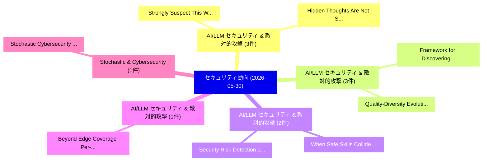

# 📅 02_daily: 日次エグゼクティブサマリー報告書 (2026-05-30)

**集計日時**: 2026-10-02 23:06:12 UTC  
**対象日付**: 2026-05-30  
**本日収集論文数**: 21 件  

---

## 💡 主要セキュリティ動向・脅威インサイト (Executive Insights)

本日の収集論文（計 21 件）において、以下の重点セキュリティ領域で活発な研究動向が確認されました：
- **AI/LLM セキュリティ & 敵対的攻撃** (3 件): 注目論文として 「"I Strongly Suspect This Websi...」、「Hidden Thoughts Are Not Secret...」 等が発表され、実務防御および攻撃検証の進展が見られます。
- **AI/LLM セキュリティ & 敵対的攻撃** (3 件): 注目論文として 「Quality-Diversity Evolution fo...」、「Framework for Discovering GPS ...」 等が発表され、実務防御および攻撃検証の進展が見られます。
- **AI/LLM セキュリティ & 敵対的攻撃** (2 件): 注目論文として 「When Safe Skills Collide: Meas...」、「Security Risk Detection and Ve...」 等が発表され、実務防御および攻撃検証の進展が見られます。
- **AI/LLM セキュリティ & 敵対的攻撃** (1 件): 注目論文として 「Beyond Edge Coverage: Per-Task...」 等が発表され、実務防御および攻撃検証の進展が見られます。
- **Stochastic & Cybersecurity** (1 件): 注目論文として 「Stochastic Cybersecurity Defen...」 等が発表され、実務防御および攻撃検証の進展が見られます。

### 🗺️ 技術・脅威トピックマインドマップ

---

## 📌 日次セキュリティ論文一覧 (日本語表形式)

| No | arXiv ID | 論文タイトル (日本語訳) | 重要キーワード | 構造化エグゼクティブ要約 (背景・提案・影響) | 脅威分類 | 詳細リンク |
|---|---|---|---|---|---|---|
| 1 | `2606.00448v1` | [When Safe Skills Collide: Measuring Compositional Risk in Agent Skill Ecosystems（セキュリティ分析論文）](../../okf/papers/2026-05-30/2606.00448.md) | `Measuring Compositional Risk`, `Agent Skill Ecosystems`, `Su Wang` | 【提案】概要 (Overview & Key Finding) 本論文「When Safe Skills Collide: Measuring Compositional Risk ...。実証評価により経営層・セキュリティ管理者向け推奨アクション (E... | `arXiv` | [arXiv](https://arxiv.org/abs/2606.00448v1) &#124; [OKF](../../okf/papers/2026-05-30/2606.00448.md) |
| 2 | `2606.00455v3` | [Beyond Edge Coverage: Per-Task Data-Flow Extraction at Kernel Function Boundaries via LLVM（セキュリティ分析論文）](../../okf/papers/2026-05-30/2606.00455.md) | `Beyond Edge Coverage`, `Kernel Function Boundaries`, `Task Data` | 【提案】概要 (Overview & Key Finding) 本論文「Beyond Edge Coverage: Per-Task Data-Flow Extraction at ...。実証評価により経営層・セキュリティ管理者向け推奨アクション (E... | `arXiv` | [arXiv](https://arxiv.org/abs/2606.00455v3) &#124; [OKF](../../okf/papers/2026-05-30/2606.00455.md) |
| 3 | `2606.00481v1` | [Stochastic Cybersecurity Defense Strategies Under Single Attack Scenarioの分析](../../okf/papers/2026-05-30/2606.00481.md) | `Kyoo Kim`, `Raw Meta`, `Executive Summary` | 【提案】概要 (Overview & Key Finding) 本論文「Stochastic Cybersecurity Defense Strategies Under Singl...。実証評価により経営層・セキュリティ管理者向け推奨アクション (E... | `arXiv` | [arXiv](https://arxiv.org/abs/2606.00481v1) &#124; [OKF](../../okf/papers/2026-05-30/2606.00481.md) |
| 4 | `2606.00485v1` | [Confused ChatGPT: Cross-App Context Poisoning via First-Party APIs（セキュリティ分析論文）](../../okf/papers/2026-05-30/2606.00485.md) | `App Context Poisoning`, `Cross-App Context`, `First-Party APIs` | 【提案】概要 (Overview & Key Finding) 本論文「Confused ChatGPT: Cross-App Context Poisoning via First...。実証評価により経営層・セキュリティ管理者向け推奨アクション (E... | `arXiv` | [arXiv](https://arxiv.org/abs/2606.00485v1) &#124; [OKF](../../okf/papers/2026-05-30/2606.00485.md) |
| 5 | `2606.00497v1` | ["I Strongly Suspect This Website Is a Scam": PII Leakage and Detection without Defense in Autonomous Web Agentsのベンチマーク評価](../../okf/papers/2026-05-30/2606.00497.md) | `Autonomous Web Agents`, `Autonomous Web`, `Soham Roy` | 【提案】背景とセキュリティ上の課題 (Background & Problem) 本研究はサイバー脅威環境におけるセキュリティ構造・脆弱性の検証を目的としています。(主要検出項目: ...。実証評価により経営層・セキュリティ管理者向け推奨アクション (E... | `arXiv` | [arXiv](https://arxiv.org/abs/2606.00497v1) &#124; [OKF](../../okf/papers/2026-05-30/2606.00497.md) |
| 6 | `2606.00566v1` | [Same Payload, Different Channel: Measuring Trust Asymmetry in Tool-Using Language Models（セキュリティ分析論文）](../../okf/papers/2026-05-30/2606.00566.md) | `Measuring Trust Asymmetry`, `Using Language Models`, `Different Channel` | 【提案】概要 (Overview & Key Finding) 本論文「Same Payload, Different Channel: Measuring Trust Asymme...。実証評価により経営層・セキュリティ管理者向け推奨アクション (E... | `arXiv` | [arXiv](https://arxiv.org/abs/2606.00566v1) &#124; [OKF](../../okf/papers/2026-05-30/2606.00566.md) |
| 7 | `2606.00621v1` | [Authenticity Debt and the Synthetic Content Threat Landscape: A Layered Framework for Trust, Provenance, and IP Governance in the Generative AI Era（セキュリティ分析論文）](../../okf/papers/2026-05-30/2606.00621.md) | `Synthetic Content Threat Landscape`, `Authenticity Debt`, `Shubhashis Sengupta` | 【提案】概要 (Overview & Key Finding) 本論文「Authenticity Debt and the Synthetic Content 脅威 Landscap...。実証評価により経営層・セキュリティ管理者向け推奨アクション (E... | `arXiv` | [arXiv](https://arxiv.org/abs/2606.00621v1) &#124; [OKF](../../okf/papers/2026-05-30/2606.00621.md) |
| 8 | `2606.00625v1` | [NICE: A Framework for Declarative and Machine-Checkable Vulnerability Reproduction（セキュリティ分析論文）](../../okf/papers/2026-05-30/2606.00625.md) | `Checkable Vulnerability Reproduction`, `Machine-Checkable Vulnerability`, `Olivier Levillain` | 【提案】概要 (Overview & Key Finding) 本論文「NICE: A Framework for Declarative and Machine-Checkable...。実証評価により経営層・セキュリティ管理者向け推奨アクション (E... | `arXiv` | [arXiv](https://arxiv.org/abs/2606.00625v1) &#124; [OKF](../../okf/papers/2026-05-30/2606.00625.md) |
| 9 | `2606.00642v1` | [Hidden Thoughts Are Not Secret: Reasoning Trace Exposure in LLMs（セキュリティ分析論文）](../../okf/papers/2026-05-30/2606.00642.md) | `Reasoning Trace Exposure`, `Raluca Ada Popa`, `Yang Tsai` | 【提案】背景とセキュリティ上の課題 (Background & Problem) 本研究はサイバー脅威環境におけるセキュリティ構造・脆弱性の検証を目的としています。(主要検出項目: ...。実証評価により経営層・セキュリティ管理者向け推奨アクション (E... | `arXiv` | [arXiv](https://arxiv.org/abs/2606.00642v1) &#124; [OKF](../../okf/papers/2026-05-30/2606.00642.md) |
| 10 | `2606.00654v1` | [The Invitation Trap: Proactive Availability Backdoor in LLMs via Conversational Induction（セキュリティ分析論文）](../../okf/papers/2026-05-30/2606.00654.md) | `Proactive Availability Backdoor`, `Conversational Induction`, `Jun Feng` | 【提案】概要 (Overview & Key Finding) 本論文「The Invitation Trap: Proactive Availability Backdoor in...。実証評価により経営層・セキュリティ管理者向け推奨アクション (E... | `arXiv` | [arXiv](https://arxiv.org/abs/2606.00654v1) &#124; [OKF](../../okf/papers/2026-05-30/2606.00654.md) |
| 11 | `2606.00669v1` | [NeuroLog: Reasoning You Can Audit -- Neuro-Symbolic Vulnerability Discovery via LLM Facts, Datalog, and SMT（セキュリティ分析論文）](../../okf/papers/2026-05-30/2606.00669.md) | `Symbolic Vulnerability Discovery`, `Neuro-Symbolic Vulnerability`, `Sanjay Rawat` | 【提案】概要 (Overview & Key Finding) 本論文「NeuroLog: Reasoning You Can Audit -- Neuro-Symbolic 脆弱性...。実証評価により経営層・セキュリティ管理者向け推奨アクション (E... | `arXiv` | [arXiv](https://arxiv.org/abs/2606.00669v1) &#124; [OKF](../../okf/papers/2026-05-30/2606.00669.md) |
| 12 | `2606.00801v1` | [Quality-Diversity Evolution for Discovering Diverse Vulnerabilities in LLM Safety（セキュリティ分析論文）](../../okf/papers/2026-05-30/2606.00801.md) | `Discovering Diverse Vulnerabilities`, `Diversity Evolution`, `Quality-Diversity Evolution` | 【提案】概要 (Overview & Key Finding) 本論文「Quality-Diversity Evolution for Discovering Diverse Vul...。実証評価により経営層・セキュリティ管理者向け推奨アクション (E... | `arXiv` | [arXiv](https://arxiv.org/abs/2606.00801v1) &#124; [OKF](../../okf/papers/2026-05-30/2606.00801.md) |
| 13 | `2606.00813v1` | [Cross-Generational Transfer of Adversarial Attacks Reveals Non-Monotonic Safety Alignment in LLMs（セキュリティ分析論文）](../../okf/papers/2026-05-30/2606.00813.md) | `Adversarial Attacks Reveals Non`, `Monotonic Safety Alignment`, `Generational Transfer` | 【提案】概要 (Overview & Key Finding) 本論文「Cross-Generational Transfer of 敵対的攻撃s Reveals Non-Monot...。実証評価により経営層・セキュリティ管理者向け推奨アクション (E... | `arXiv` | [arXiv](https://arxiv.org/abs/2606.00813v1) &#124; [OKF](../../okf/papers/2026-05-30/2606.00813.md) |
| 14 | `2606.00856v1` | [GCVE: A Decentralized Model for Vulnerability Identification, Publication, and Operational Enrichment（セキュリティ分析論文）](../../okf/papers/2026-05-30/2606.00856.md) | `Decentralized Model`, `Vulnerability Identification`, `Operational Enrichment` | 【提案】概要 (Overview & Key Finding) 本論文「GCVE: A Decentralized Model for 脆弱性 Identification, Pub...。実証評価により経営層・セキュリティ管理者向け推奨アクション (E... | `arXiv` | [arXiv](https://arxiv.org/abs/2606.00856v1) &#124; [OKF](../../okf/papers/2026-05-30/2606.00856.md) |
| 15 | `2606.00889v1` | [A Lightweight Hybrid MLP-Based Framework for Real-Time Phishing URL Detection Using Structural URL Features（セキュリティ分析論文）](../../okf/papers/2026-05-30/2606.00889.md) | `Detection Using Structural`, `Lightweight Hybrid`, `Time Phishing` | 【提案】概要 (Overview & Key Finding) 本論文「A Lightweight Hybrid MLP-Based Framework for Real-Time ...。実証評価により経営層・セキュリティ管理者向け推奨アクション (E... | `arXiv` | [arXiv](https://arxiv.org/abs/2606.00889v1) &#124; [OKF](../../okf/papers/2026-05-30/2606.00889.md) |
| 16 | `2606.00904v1` | [Framework for Discovering GPS Spoofing Attacks in Drone Swarms（セキュリティ分析論文）](../../okf/papers/2026-05-30/2606.00904.md) | `Spoofing Attacks`, `Drone Swarms`, `Yingao Elaine Yao` | 【提案】概要 (Overview & Key Finding) 本論文「Framework for Discovering GPS Spoofing Attacks in Drone...。実証評価により経営層・セキュリティ管理者向け推奨アクション (E... | `arXiv` | [arXiv](https://arxiv.org/abs/2606.00904v1) &#124; [OKF](../../okf/papers/2026-05-30/2606.00904.md) |
| 17 | `2606.00914v1` | [Adversarial Feeds Steer LLM Agent Decisions Against Their Defaults（セキュリティ分析論文）](../../okf/papers/2026-05-30/2606.00914.md) | `Adversarial Feeds Steer`, `Rana Muhammad Usman`, `Raw Meta` | 【提案】概要 (Overview & Key Finding) 本論文「Adversarial Feeds Steer LLM Agent Decisions Against The...。実証評価により経営層・セキュリティ管理者向け推奨アクション (E... | `arXiv` | [arXiv](https://arxiv.org/abs/2606.00914v1) &#124; [OKF](../../okf/papers/2026-05-30/2606.00914.md) |
| 18 | `2606.00918v2` | [One (Thread) Can Keep a (PRNG) Secret, but not Two（セキュリティ分析論文）](../../okf/papers/2026-05-30/2606.00918.md) | `Can Keep`, `Ehood Porat`, `Amit Klein` | 【提案】背景とセキュリティ上の課題 (Background & Problem) 本研究はサイバー脅威環境におけるセキュリティ構造・脆弱性の検証を目的としています。(主要検出項目: ...。実証評価により経営層・セキュリティ管理者向け推奨アクション (E... | `arXiv` | [arXiv](https://arxiv.org/abs/2606.00918v2) &#124; [OKF](../../okf/papers/2026-05-30/2606.00918.md) |
| 19 | `2606.00925v1` | [Security Risk Detection and Verification in Open Agentic Skill Ecosystemsのベンチマーク評価](../../okf/papers/2026-05-30/2606.00925.md) | `Benchmarking Security Risk Detection`, `Open Agentic Skill Ecosystems`, `Security Risk Detection` | 【提案】概要 (Overview & Key Finding) 本論文「Security Risk Detection and Verification in Open Agenti...。実証評価により経営層・セキュリティ管理者向け推奨アクション (E... | `arXiv` | [arXiv](https://arxiv.org/abs/2606.00925v1) &#124; [OKF](../../okf/papers/2026-05-30/2606.00925.md) |
| 20 | `2606.02630v1` | [MultiTurnPSB: Evaluating Multi-Turn Jailbreak Attacks an dClassifier-Based Defenses for Medical AI Safety（セキュリティ分析論文）](../../okf/papers/2026-05-30/2606.02630.md) | `Turn Jailbreak Attacks`, `Evaluating Multi`, `Based Defenses` | 【提案】概要 (Overview & Key Finding) 本論文「MultiTurnPSB: Evaluating Multi-Turn ジェイルブレイク Attacks an...。実証評価により経営層・セキュリティ管理者向け推奨アクション (E... | `arXiv` | [arXiv](https://arxiv.org/abs/2606.02630v1) &#124; [OKF](../../okf/papers/2026-05-30/2606.02630.md) |
| 21 | `2607.02530v1` | [Cybercrime Victimization Among Young Adult Males Aged 18--20: A Post-Pandemic Converging Risk Factorsの分析](../../okf/papers/2026-05-30/2607.02530.md) | `Cybercrime Victimization Among Young Adult Males Aged`, `Pandemic Converging Risk`, `Post-Pandemic Converging` | 【提案】概要 (Overview & Key Finding) 本論文「Cybercrime Victimization Among Young Adult Males Aged 1...。実証評価により経営層・セキュリティ管理者向け推奨アクション (E... | `arXiv` | [arXiv](https://arxiv.org/abs/2607.02530v1) &#124; [OKF](../../okf/papers/2026-05-30/2607.02530.md) |

