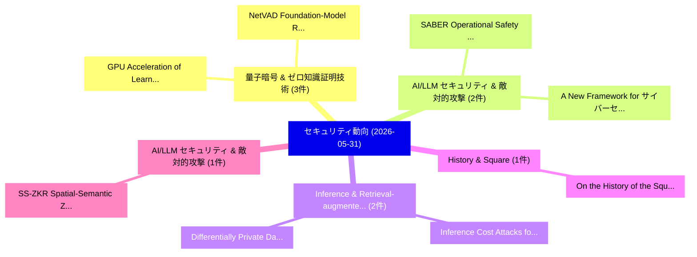

# 📅 02_daily: 日次エグゼクティブサマリー報告書 (2026-05-31)

**集計日時**: 2026-10-02 23:06:12 UTC  
**対象日付**: 2026-05-31  
**本日収集論文数**: 19 件  

---

## 💡 主要セキュリティ動向・脅威インサイト (Executive Insights)

本日の収集論文（計 19 件）において、以下の重点セキュリティ領域で活発な研究動向が確認されました：
- **量子暗号 & ゼロ知識証明技術** (3 件): 注目論文として 「GPU Acceleration of Learning W...」、「NetVAD: Foundation-Model Repre...」 等が発表され、実務防御および攻撃検証の進展が見られます。
- **AI/LLM セキュリティ & 敵対的攻撃** (2 件): 注目論文として 「SABER: Operational Safety of L...」、「A New Framework for サイバーセキュリティ...」 等が発表され、実務防御および攻撃検証の進展が見られます。
- **Inference & Retrieval-augmented** (2 件): 注目論文として 「Differentially Private Datasto...」、「Inference Cost Attacks for Ret...」 等が発表され、実務防御および攻撃検証の進展が見られます。
- **History & Square** (1 件): 注目論文として 「On the History of the Square a...」 等が発表され、実務防御および攻撃検証の進展が見られます。
- **AI/LLM セキュリティ & 敵対的攻撃** (1 件): 注目論文として 「SS-ZKR: Spatial-Semantic Zero-...」 等が発表され、実務防御および攻撃検証の進展が見られます。

### 🗺️ 技術・脅威トピックマインドマップ

---

## 📌 日次セキュリティ論文一覧 (日本語表形式)

| No | arXiv ID | 論文タイトル (日本語訳) | 重要キーワード | 構造化エグゼクティブ要約 (背景・提案・影響) | 脅威分類 | 詳細リンク |
|---|---|---|---|---|---|---|
| 1 | `2606.00958v3` | [On the History of the Square and Multiply Algorithm（セキュリティ分析論文）](../../okf/papers/2026-05-31/2606.00958.md) | `Multiply Algorithm`, `Nuh Aydin`, `Omid Khormali` | 【提案】概要 (Overview & Key Finding) 本論文「On the History of the Square and Multiply Algorithm（セキュ...。実証評価によりAzarian, Omid Khormali, G... | `arXiv` | [arXiv](https://arxiv.org/abs/2606.00958v3) &#124; [OKF](../../okf/papers/2026-05-31/2606.00958.md) |
| 2 | `2606.00962v1` | [SS-ZKR: Spatial-Semantic Zero-Knowledge Routing for Privacy-Preserving Multi-Agent Collaboration（セキュリティ分析論文）](../../okf/papers/2026-05-31/2606.00962.md) | `Semantic Zero`, `Knowledge Routing`, `Spatial-Semantic Zero` | 【提案】概要 (Overview & Key Finding) 本論文「SS-ZKR: Spatial-Semantic Zero-Knowledge Routing for Pri...。実証評価により経営層・セキュリティ管理者向け推奨アクション (E... | `arXiv` | [arXiv](https://arxiv.org/abs/2606.00962v1) &#124; [OKF](../../okf/papers/2026-05-31/2606.00962.md) |
| 3 | `2606.01138v4` | [memorywire: A Vendor-Neutral Wire Format for Agent Memory Operations（セキュリティ分析論文）](../../okf/papers/2026-05-31/2606.01138.md) | `Neutral Wire Format`, `Agent Memory Operations`, `Vendor-Neutral Wire` | 【提案】概要 (Overview & Key Finding) 本論文「memorywire: A Vendor-Neutral Wire Format for Agent Memo...。実証評価により経営層・セキュリティ管理者向け推奨アクション (E... | `arXiv` | [arXiv](https://arxiv.org/abs/2606.01138v4) &#124; [OKF](../../okf/papers/2026-05-31/2606.01138.md) |
| 4 | `2606.01166v2` | [BraveGuard: From Open-World Threats to Safer Computer-Use Agents（セキュリティ分析論文）](../../okf/papers/2026-05-31/2606.01166.md) | `World Threats`, `Open-World Threats`, `Safer Computer` | 【提案】概要 (Overview & Key Finding) 本論文「BraveGuard: From Open-World Threats to Safer Computer-U...。実証評価により経営層・セキュリティ管理者向け推奨アクション (E... | `arXiv` | [arXiv](https://arxiv.org/abs/2606.01166v2) &#124; [OKF](../../okf/papers/2026-05-31/2606.01166.md) |
| 5 | `2606.01208v1` | [Schema-Agnostic Knowledge Graph Construction via Hybrid Ontology Discovery for Cyber Threat Intelligence（セキュリティ分析論文）](../../okf/papers/2026-05-31/2606.01208.md) | `Agnostic Knowledge Graph Construction`, `Hybrid Ontology Discovery`, `Cyber Threat Intelligence` | 【提案】概要 (Overview & Key Finding) 本論文「Schema-Agnostic Knowledge Graph Construction via Hybrid...。実証評価により経営層・セキュリティ管理者向け推奨アクション (E... | `arXiv` | [arXiv](https://arxiv.org/abs/2606.01208v1) &#124; [OKF](../../okf/papers/2026-05-31/2606.01208.md) |
| 6 | `2606.01211v1` | [GPU Acceleration of Learning With Errors KEMs Using OpenACC for Post-Quantum Cryptography（セキュリティ分析論文）](../../okf/papers/2026-05-31/2606.01211.md) | `Quantum Cryptography`, `Post-Quantum Cryptography`, `Tiziana Liberati` | 【提案】概要 (Overview & Key Finding) 本論文「GPU Acceleration of Learning With Errors KEMs Using Ope...。実証評価により経営層・セキュリティ管理者向け推奨アクション (E... | `arXiv` | [arXiv](https://arxiv.org/abs/2606.01211v1) &#124; [OKF](../../okf/papers/2026-05-31/2606.01211.md) |
| 7 | `2606.01212v2` | [DiscourseFlip: An Oblique Discourse-Level Opinion Manipulation Attack against Black-box Retrieval-Augmented Generation（セキュリティ分析論文）](../../okf/papers/2026-05-31/2606.01212.md) | `Level Opinion Manipulation Attack`, `Augmented Generation`, `Discourse-Level Opinion` | 【提案】概要 (Overview & Key Finding) 本論文「DiscourseFlip: An Oblique Discourse-Level Opinion Manip...。実証評価により経営層・セキュリティ管理者向け推奨アクション (E... | `arXiv` | [arXiv](https://arxiv.org/abs/2606.01212v2) &#124; [OKF](../../okf/papers/2026-05-31/2606.01212.md) |
| 8 | `2606.01225v1` | [Privacy-Preserving Smart Surveillance with Cross-Dataset Violence Detection and Decentralized Evidence Governance（セキュリティ分析論文）](../../okf/papers/2026-05-31/2606.01225.md) | `Preserving Smart Surveillance`, `Dataset Violence Detection`, `Decentralized Evidence Governance` | 【提案】概要 (Overview & Key Finding) 本論文「Privacy-Preserving Smart Surveillance with Cross-Datase...。実証評価により経営層・セキュリティ管理者向け推奨アクション (E... | `arXiv` | [arXiv](https://arxiv.org/abs/2606.01225v1) &#124; [OKF](../../okf/papers/2026-05-31/2606.01225.md) |
| 9 | `2606.01274v1` | [Strategic Users in a Priority Queue with Bulk Service on Blockchains（セキュリティ分析論文）](../../okf/papers/2026-05-31/2606.01274.md) | `Strategic Users`, `Priority Queue`, `Bulk Service` | 【提案】概要 (Overview & Key Finding) 本論文「Strategic Users in a Priority Queue with Bulk Service o...。実証評価により経営層・セキュリティ管理者向け推奨アクション (E... | `arXiv` | [arXiv](https://arxiv.org/abs/2606.01274v1) &#124; [OKF](../../okf/papers/2026-05-31/2606.01274.md) |
| 10 | `2606.01317v1` | [SABER: Operational Safety of LLM Coding Agents in Stateful Project Workspacesのベンチマーク評価](../../okf/papers/2026-05-31/2606.01317.md) | `Coding Agents`, `Operational Safety`, `Stateful Project` | 【提案】概要 (Overview & Key Finding) 本論文「SABER: Operational Safety of LLM Coding Agents in State...。実証評価により経営層・セキュリティ管理者向け推奨アクション (E... | `arXiv` | [arXiv](https://arxiv.org/abs/2606.01317v1) &#124; [OKF](../../okf/papers/2026-05-31/2606.01317.md) |
| 11 | `2606.01364v1` | [Needles at Scale: LLM-Assisted Target Selection for Windows Vulnerability Research（セキュリティ分析論文）](../../okf/papers/2026-05-31/2606.01364.md) | `Assisted Target Selection`, `Windows Vulnerability Research`, `LLM-Assisted Target` | 【提案】概要 (Overview & Key Finding) 本論文「Needles at Scale: LLM-Assisted Target Selection for Win...。実証評価により経営層・セキュリティ管理者向け推奨アクション (E... | `arXiv` | [arXiv](https://arxiv.org/abs/2606.01364v1) &#124; [OKF](../../okf/papers/2026-05-31/2606.01364.md) |
| 12 | `2606.01381v1` | [Formal Verification of Secure Encrypted Virtualization（セキュリティ分析論文）](../../okf/papers/2026-05-31/2606.01381.md) | `Secure Encrypted Virtualization`, `Formal Verification`, `Hansika Weerasena` | 【提案】概要 (Overview & Key Finding) 本論文「Formal Verification of Secure Encrypted Virtualization（...。実証評価により経営層・セキュリティ管理者向け推奨アクション (E... | `arXiv` | [arXiv](https://arxiv.org/abs/2606.01381v1) &#124; [OKF](../../okf/papers/2026-05-31/2606.01381.md) |
| 13 | `2606.01413v1` | [Differentially Private Datastore Generation for Retrieval-Augmented Inference（セキュリティ分析論文）](../../okf/papers/2026-05-31/2606.01413.md) | `Differentially Private Datastore Generation`, `Augmented Inference`, `Retrieval-Augmented Inference` | 【提案】概要 (Overview & Key Finding) 本論文「Differentially Private Datastore Generation for Retriev...。実証評価により経営層・セキュリティ管理者向け推奨アクション (E... | `arXiv` | [arXiv](https://arxiv.org/abs/2606.01413v1) &#124; [OKF](../../okf/papers/2026-05-31/2606.01413.md) |
| 14 | `2606.01442v1` | [On the Evaluation of Spiking Neural Network Configurations for Network Intrusion Detection（セキュリティ分析論文）](../../okf/papers/2026-05-31/2606.01442.md) | `Spiking Neural Network Configurations`, `Network Intrusion Detection`, `Network Intrusion Dete` | 【提案】概要 (Overview & Key Finding) 本論文「On the Evaluation of Spiking Neural Network Configurati...。実証評価により経営層・セキュリティ管理者向け推奨アクション (E... | `arXiv` | [arXiv](https://arxiv.org/abs/2606.01442v1) &#124; [OKF](../../okf/papers/2026-05-31/2606.01442.md) |
| 15 | `2606.01452v2` | [NetVAD: Foundation-Model Representation Learning for Identifier-Free Unsupervised Intrusion Detection（セキュリティ分析論文）](../../okf/papers/2026-05-31/2606.01452.md) | `Free Unsupervised Intrusion Detection`, `Model Representation Learning`, `Foundation-Model Representation` | 【提案】概要 (Overview & Key Finding) 本論文「NetVAD: Foundation-Model Representation Learning for Id...。実証評価により経営層・セキュリティ管理者向け推奨アクション (E... | `arXiv` | [arXiv](https://arxiv.org/abs/2606.01452v2) &#124; [OKF](../../okf/papers/2026-05-31/2606.01452.md) |
| 16 | `2606.01494v1` | [ClawHub Security Signals: When VirusTotal, Static Analysis, and SkillSpector Disagree（セキュリティ分析論文）](../../okf/papers/2026-05-31/2606.01494.md) | `Security Signals`, `Vincent Koc`, `Patrick Erichsen` | 【提案】概要 (Overview & Key Finding) 本論文「ClawHub Security Signals: When VirusTotal, Static Analy...。実証評価により経営層・セキュリティ管理者向け推奨アクション (E... | `arXiv` | [arXiv](https://arxiv.org/abs/2606.01494v1) &#124; [OKF](../../okf/papers/2026-05-31/2606.01494.md) |
| 17 | `2606.02640v1` | [D-Judge: Disrupting Multi-Turn Jailbreaks using Semantics-Preserving Output Rewriting（セキュリティ分析論文）](../../okf/papers/2026-05-31/2606.02640.md) | `Preserving Output Rewriting`, `Disrupting Multi`, `Turn Jailbreaks` | 【提案】概要 (Overview & Key Finding) 本論文「D-Judge: Disrupting Multi-Turn ジェイルブレイクs using Semantic...。実証評価により経営層・セキュリティ管理者向け推奨アクション (E... | `arXiv` | [arXiv](https://arxiv.org/abs/2606.02640v1) &#124; [OKF](../../okf/papers/2026-05-31/2606.02640.md) |
| 18 | `2606.02643v1` | [Inference Cost Attacks for Retrieval-Augmented 大規模言語モデル](../../okf/papers/2026-05-31/2606.02643.md) | `Inference Cost Attacks`, `Augmented Large Language Models`, `Retrieval-Augmented Large` | 【提案】概要 (Overview & Key Finding) 本論文「Inference Cost Attacks for Retrieval-Augmented 大規模言語モデル...。実証評価により経営層・セキュリティ管理者向け推奨アクション (E... | `arXiv` | [arXiv](https://arxiv.org/abs/2606.02643v1) &#124; [OKF](../../okf/papers/2026-05-31/2606.02643.md) |
| 19 | `2606.02644v1` | [A New Framework for サイバーセキュリティ Refusals in AI Agents](../../okf/papers/2026-05-31/2606.02644.md) | `Cybersecurity Refusals`, `Eliot Krzysztof Jones`, `Mateusz Dziemian` | 【提案】概要 (Overview & Key Finding) 本論文「A New Framework for サイバーセキュリティ Refusals in AI Agents」（原...。実証評価により経営層・セキュリティ管理者向け推奨アクション (E... | `arXiv` | [arXiv](https://arxiv.org/abs/2606.02644v1) &#124; [OKF](../../okf/papers/2026-05-31/2606.02644.md) |

