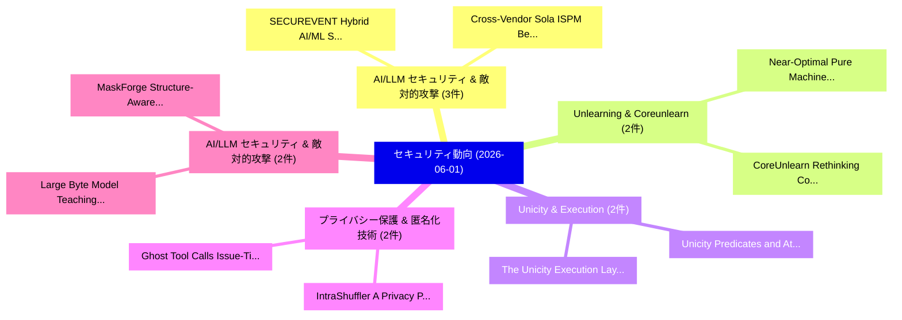

# 📅 02_daily: 日次エグゼクティブサマリー報告書 (2026-06-01)

**集計日時**: 2026-10-02 23:06:13 UTC  
**対象日付**: 2026-06-01  
**本日収集論文数**: 36 件  

---

## 💡 主要セキュリティ動向・脅威インサイト (Executive Insights)

本日の収集論文（計 36 件）において、以下の重点セキュリティ領域で活発な研究動向が確認されました：
- **AI/LLM セキュリティ & 敵対的攻撃** (3 件): 注目論文として 「SECUREVENT: Hybrid AI/ML Secur...」、「Cross-Vendor Sola ISPM Benchma...」 等が発表され、実務防御および攻撃検証の進展が見られます。
- **Unlearning & Coreunlearn** (2 件): 注目論文として 「Near-Optimal Pure Machine Unle...」、「CoreUnlearn: Rethinking Concep...」 等が発表され、実務防御および攻撃検証の進展が見られます。
- **Unicity & Execution** (2 件): 注目論文として 「The Unicity Execution Layer（セキ...」、「Unicity: Predicates and Atomic...」 等が発表され、実務防御および攻撃検証の進展が見られます。
- **プライバシー保護 & 匿名化技術** (2 件): 注目論文として 「Ghost Tool Calls: Issue-Time P...」、「IntraShuffler: A Privacy Prese...」 等が発表され、実務防御および攻撃検証の進展が見られます。
- **AI/LLM セキュリティ & 敵対的攻撃** (2 件): 注目論文として 「Large Byte Model: Teaching Lan...」、「MaskForge: Structure-Aware Ada...」 等が発表され、実務防御および攻撃検証の進展が見られます。

### 🗺️ 技術・脅威トピックマインドマップ

---

## 📌 日次セキュリティ論文一覧 (日本語表形式)

| No | arXiv ID | 論文タイトル (日本語訳) | 重要キーワード | 構造化エグゼクティブ要約 (背景・提案・影響) | 脅威分類 | 詳細リンク |
|---|---|---|---|---|---|---|
| 1 | `2606.01508v1` | [Agent Operating Systems (AOS): Integrating Agentic Control Planes into, and Beyond, Traditional Operating Systems（セキュリティ分析論文）](../../okf/papers/2026-06-01/2606.01508.md) | `Integrating Agentic Control Planes`, `Agent Operating Systems`, `Traditional Operating Systems` | 【提案】概要 (Overview & Key Finding) 本論文「Agent Operating Systems (AOS): Integrating Agentic Cont...。実証評価により経営層・セキュリティ管理者向け推奨アクション (E... | `arXiv` | [arXiv](https://arxiv.org/abs/2606.01508v1) &#124; [OKF](../../okf/papers/2026-06-01/2606.01508.md) |
| 2 | `2606.01527v1` | [Near-Optimal Pure Machine Unlearning for Smooth Strongly Convex Losses（セキュリティ分析論文）](../../okf/papers/2026-06-01/2606.01527.md) | `Optimal Pure Machine Unlearning`, `Smooth Strongly Convex Losses`, `Near-Optimal Pure` | 【提案】概要 (Overview & Key Finding) 本論文「Near-Optimal Pure Machine Unlearning for Smooth Strongl...。実証評価により経営層・セキュリティ管理者向け推奨アクション (E... | `arXiv` | [arXiv](https://arxiv.org/abs/2606.01527v1) &#124; [OKF](../../okf/papers/2026-06-01/2606.01527.md) |
| 3 | `2606.01567v2` | [Defenses & Enablers For Skill Injection Attacks on Terminal Based Agents（セキュリティ分析論文）](../../okf/papers/2026-06-01/2606.01567.md) | `Terminal Based Agents`, `Makesh Narsimhan Sreedhar`, `Yoshinari Fujinuma` | 【提案】概要 (Overview & Key Finding) 本論文「Defenses & Enablers For Skill Injection Attacks on Term...。実証評価により経営層・セキュリティ管理者向け推奨アクション (E... | `arXiv` | [arXiv](https://arxiv.org/abs/2606.01567v2) &#124; [OKF](../../okf/papers/2026-06-01/2606.01567.md) |
| 4 | `2606.01658v1` | [CoreUnlearn: Rethinking Concept Unlearning through Disentangled Component-Level Erasure in Text-guided Diffusion Models（セキュリティ分析論文）](../../okf/papers/2026-06-01/2606.01658.md) | `Rethinking Concept Unlearning`, `Disentangled Component`, `Level Erasure` | 【提案】概要 (Overview & Key Finding) 本論文「CoreUnlearn: Rethinking Concept Unlearning through Dise...。実証評価により経営層・セキュリティ管理者向け推奨アクション (E... | `arXiv` | [arXiv](https://arxiv.org/abs/2606.01658v1) &#124; [OKF](../../okf/papers/2026-06-01/2606.01658.md) |
| 5 | `2606.01691v1` | [IstGPT: LLM-based Anomaly Detection for Spatial-Temporal Graph in Industrial Systems（セキュリティ分析論文）](../../okf/papers/2026-06-01/2606.01691.md) | `Anomaly Detection`, `Temporal Graph`, `Industrial Systems` | 【提案】概要 (Overview & Key Finding) 本論文「IstGPT: LLM-based Anomaly Detection for Spatial-Tempora...。実証評価により経営層・セキュリティ管理者向け推奨アクション (E... | `arXiv` | [arXiv](https://arxiv.org/abs/2606.01691v1) &#124; [OKF](../../okf/papers/2026-06-01/2606.01691.md) |
| 6 | `2606.01719v1` | [Fair Finetuning Mitigates Distribution Inference Attacks（セキュリティ分析論文）](../../okf/papers/2026-06-01/2606.01719.md) | `Fair Finetuning Mitigates Distribution Inference Attacks`, `Rakshit Naidu`, `Raw Meta` | 【提案】概要 (Overview & Key Finding) 本論文「Fair Finetuning Mitigates Distribution Inference Attack...。実証評価により経営層・セキュリティ管理者向け推奨アクション (E... | `arXiv` | [arXiv](https://arxiv.org/abs/2606.01719v1) &#124; [OKF](../../okf/papers/2026-06-01/2606.01719.md) |
| 7 | `2606.01741v1` | [SECUREVENT: Hybrid AI/ML Security Monitoring for Distributed Event-Based Systems（セキュリティ分析論文）](../../okf/papers/2026-06-01/2606.01741.md) | `Security Monitoring`, `Distributed Event`, `Based Systems` | 【提案】概要 (Overview & Key Finding) 本論文「SECUREVENT: Hybrid AI/ML Security Monitoring for Distri...。実証評価により経営層・セキュリティ管理者向け推奨アクション (E... | `arXiv` | [arXiv](https://arxiv.org/abs/2606.01741v1) &#124; [OKF](../../okf/papers/2026-06-01/2606.01741.md) |
| 8 | `2606.01794v2` | [Tridirectional Discriminating-Power Formal Verification of Smart Contract Reentrancy Defense Against Production-Deployed Solidity Source（セキュリティ分析論文）](../../okf/papers/2026-06-01/2606.01794.md) | `Power Formal Verification`, `Deployed Solidity Source`, `Tridirectional Discriminating` | 【提案】概要 (Overview & Key Finding) 本論文「Tridirectional Discriminating-Power Formal Verification...。実証評価により経営層・セキュリティ管理者向け推奨アクション (E... | `arXiv` | [arXiv](https://arxiv.org/abs/2606.01794v2) &#124; [OKF](../../okf/papers/2026-06-01/2606.01794.md) |
| 9 | `2606.01837v1` | [Benign Inputs, Harmful Outputs: Cross-Modal Jailbreaking via Distributed Semantic Recomposition（セキュリティ分析論文）](../../okf/papers/2026-06-01/2606.01837.md) | `Distributed Semantic Recomposition`, `Benign Inputs`, `Harmful Outputs` | 【提案】概要 (Overview & Key Finding) 本論文「Benign Inputs, Harmful Outputs: Cross-Modal ジェイルブレイクing...。実証評価により経営層・セキュリティ管理者向け推奨アクション (E... | `arXiv` | [arXiv](https://arxiv.org/abs/2606.01837v1) &#124; [OKF](../../okf/papers/2026-06-01/2606.01837.md) |
| 10 | `2606.01849v2` | [ContinuousBench: Can Differentially Private Synthetic Text Improve Capabilities?（セキュリティ分析論文）](../../okf/papers/2026-06-01/2606.01849.md) | `Can Differentially Private Synthetic Text Improve Capabilities`, `Can Differentially Private Syntheti`, `Peihan Liu` | 【提案】### (日本語題名: ContinuousBench: Can Differentially Private Synthetic Text Improve Capabili...。実証評価により経営層・セキュリティ管理者向け推奨アクション (E... | `arXiv` | [arXiv](https://arxiv.org/abs/2606.01849v2) &#124; [OKF](../../okf/papers/2026-06-01/2606.01849.md) |
| 11 | `2606.01968v1` | [Implementation and Optimization of HQC Decoding on NPU-Integrated Devices（セキュリティ分析論文）](../../okf/papers/2026-06-01/2606.01968.md) | `Integrated Devices`, `NPU-Integrated Devices`, `Vu Minh Chau` | 【提案】概要 (Overview & Key Finding) 本論文「Implementation and Optimization of HQC Decoding on NPU-...。実証評価により経営層・セキュリティ管理者向け推奨アクション (E... | `arXiv` | [arXiv](https://arxiv.org/abs/2606.01968v1) &#124; [OKF](../../okf/papers/2026-06-01/2606.01968.md) |
| 12 | `2606.02126v1` | [PeAR: A Static Binary Rewriting Framework for Binary-Only Fuzzing（セキュリティ分析論文）](../../okf/papers/2026-06-01/2606.02126.md) | `Binary-Only Fuzzing`, `Alvin Charles`, `Adrian Herrera` | 【提案】概要 (Overview & Key Finding) 本論文「PeAR: A Static Binary Rewriting Framework for Binary-On...。実証評価により経営層・セキュリティ管理者向け推奨アクション (E... | `arXiv` | [arXiv](https://arxiv.org/abs/2606.02126v1) &#124; [OKF](../../okf/papers/2026-06-01/2606.02126.md) |
| 13 | `2606.02181v1` | [The Unicity Execution Layer（セキュリティ分析論文）](../../okf/papers/2026-06-01/2606.02181.md) | `Ahto Buldas`, `Dirk Draheim`, `Mike Gault` | 【提案】概要 (Overview & Key Finding) 本論文「The Unicity Execution Layer（セキュリティ分析論文）」（原題: The Unicit...。実証評価により経営層・セキュリティ管理者向け推奨アクション (E... | `arXiv` | [arXiv](https://arxiv.org/abs/2606.02181v1) &#124; [OKF](../../okf/papers/2026-06-01/2606.02181.md) |
| 14 | `2606.02192v1` | [Unicity: Predicates and Atomic Swaps（セキュリティ分析論文）](../../okf/papers/2026-06-01/2606.02192.md) | `Atomic Swaps`, `Ahto Buldas`, `Dirk Draheim` | 【提案】概要 (Overview & Key Finding) 本論文「Unicity: Predicates and Atomic Swaps（セキュリティ分析論文）」（原題: U...。実証評価により経営層・セキュリティ管理者向け推奨アクション (E... | `arXiv` | [arXiv](https://arxiv.org/abs/2606.02192v1) &#124; [OKF](../../okf/papers/2026-06-01/2606.02192.md) |
| 15 | `2606.02196v1` | [PyFEX: Uncovering Evasive Python-based Threats via Resilient and Exhaustive Path Exploration（セキュリティ分析論文）](../../okf/papers/2026-06-01/2606.02196.md) | `Uncovering Evasive Python`, `Exhaustive Path Exploration`, `Python-based Threats` | 【提案】概要 (Overview & Key Finding) 本論文「PyFEX: Uncovering Evasive Python-based Threats via Resi...。実証評価により経営層・セキュリティ管理者向け推奨アクション (E... | `arXiv` | [arXiv](https://arxiv.org/abs/2606.02196v1) &#124; [OKF](../../okf/papers/2026-06-01/2606.02196.md) |
| 16 | `2606.02240v3` | [AgentRedBench: Dynamic Redteaming and Integration-Aware Defense for LLMエージェント over SaaS Integrations](../../okf/papers/2026-06-01/2606.02240.md) | `Dynamic Redteaming`, `Aware Defense`, `Integration-Aware Defense` | 【提案】概要 (Overview & Key Finding) 本論文「AgentRedBench: Dynamic Redteaming and Integration-Aware...。実証評価により経営層・セキュリティ管理者向け推奨アクション (E... | `arXiv` | [arXiv](https://arxiv.org/abs/2606.02240v3) &#124; [OKF](../../okf/papers/2026-06-01/2606.02240.md) |
| 17 | `2606.02302v1` | [SeClaw: Spec-Driven Security Task Synthesis for Evaluating Autonomous Agents（セキュリティ分析論文）](../../okf/papers/2026-06-01/2606.02302.md) | `Driven Security Task Synthesis`, `Evaluating Autonomous Agents`, `Spec-Driven Security` | 【提案】概要 (Overview & Key Finding) 本論文「SeClaw: Spec-Driven Security Task Synthesis for Evaluat...。実証評価により経営層・セキュリティ管理者向け推奨アクション (E... | `arXiv` | [arXiv](https://arxiv.org/abs/2606.02302v1) &#124; [OKF](../../okf/papers/2026-06-01/2606.02302.md) |
| 18 | `2606.02323v2` | [Multidimensional Reconciliation in Continuous-Variable QKD: Review, Coding Schemes, and Open Source Simulation（セキュリティ分析論文）](../../okf/papers/2026-06-01/2606.02323.md) | `Open Source Simulation`, `Multidimensional Reconciliation`, `Coding Schemes` | 【提案】概要 (Overview & Key Finding) 本論文「Multidimensional Reconciliation in Continuous-Variable ...。実証評価により経営層・セキュリティ管理者向け推奨アクション (E... | `arXiv` | [arXiv](https://arxiv.org/abs/2606.02323v2) &#124; [OKF](../../okf/papers/2026-06-01/2606.02323.md) |
| 19 | `2606.02344v1` | [I-(OT)^2: A Client-optimal Oblivious Transfer Protocol for IoT Devices（セキュリティ分析論文）](../../okf/papers/2026-06-01/2606.02344.md) | `Oblivious Transfer Protocol`, `Client-optimal Oblivious`, `Roberto Di Pietro` | 【提案】概要 (Overview & Key Finding) 本論文「I-(OT)^2: A Client-optimal Oblivious Transfer Protocol ...。実証評価により経営層・セキュリティ管理者向け推奨アクション (E... | `arXiv` | [arXiv](https://arxiv.org/abs/2606.02344v1) &#124; [OKF](../../okf/papers/2026-06-01/2606.02344.md) |
| 20 | `2606.02348v2` | [Mechanism Design for Privacy-Preserving Information Sharing in Oligopoly Competition（セキュリティ分析論文）](../../okf/papers/2026-06-01/2606.02348.md) | `Preserving Information Sharing`, `Mechanism Design`, `Oligopoly Competition` | 【提案】概要 (Overview & Key Finding) 本論文「Mechanism Design for Privacy-Preserving Information Sha...。実証評価により経営層・セキュリティ管理者向け推奨アクション (E... | `arXiv` | [arXiv](https://arxiv.org/abs/2606.02348v2) &#124; [OKF](../../okf/papers/2026-06-01/2606.02348.md) |
| 21 | `2606.02442v1` | [Poking Around in the Dark: Why a Shared Understanding of Components Matters（セキュリティ分析論文）](../../okf/papers/2026-06-01/2606.02442.md) | `Poking Around`, `Shared Understanding`, `Components Matters` | 【提案】概要 (Overview & Key Finding) 本論文「Poking Around in the Dark: Why a Shared Understanding o...。実証評価により経営層・セキュリティ管理者向け推奨アクション (E... | `arXiv` | [arXiv](https://arxiv.org/abs/2606.02442v1) &#124; [OKF](../../okf/papers/2026-06-01/2606.02442.md) |
| 22 | `2606.02483v1` | [Ghost Tool Calls: Issue-Time Privacy for Speculative Agent Tools（セキュリティ分析論文）](../../okf/papers/2026-06-01/2606.02483.md) | `Ghost Tool Calls`, `Speculative Agent Tools`, `Time Privacy` | 【提案】概要 (Overview & Key Finding) 本論文「Ghost Tool Calls: Issue-Time Privacy for Speculative Ag...。実証評価により経営層・セキュリティ管理者向け推奨アクション (E... | `arXiv` | [arXiv](https://arxiv.org/abs/2606.02483v1) &#124; [OKF](../../okf/papers/2026-06-01/2606.02483.md) |
| 23 | `2606.02563v2` | [IntraShuffler: A Privacy Preserving Framework for Heterogeneous DP 連合学習](../../okf/papers/2026-06-01/2606.02563.md) | `Federated Learning`, `Farhin Farhad Riya`, `Jinyuan Stella Sun` | 【提案】概要 (Overview & Key Finding) 本論文「IntraShuffler: A Privacy Preserving Framework for Heter...。実証評価により経営層・セキュリティ管理者向け推奨アクション (E... | `arXiv` | [arXiv](https://arxiv.org/abs/2606.02563v2) &#124; [OKF](../../okf/papers/2026-06-01/2606.02563.md) |
| 24 | `2606.02668v1` | [What You Approve Is What Executes: Consent Integrity for Black-Box LLMエージェント](../../okf/papers/2026-06-01/2606.02668.md) | `Consent Integrity`, `Black-Box LLM`, `Xiaoqi Weng` | 【提案】概要 (Overview & Key Finding) 本論文「What You Approve Is What Executes: Consent Integrity fo...。実証評価により経営層・セキュリティ管理者向け推奨アクション (E... | `arXiv` | [arXiv](https://arxiv.org/abs/2606.02668v1) &#124; [OKF](../../okf/papers/2026-06-01/2606.02668.md) |
| 25 | `2606.02674v1` | [Cross-Vendor Sola ISPM Benchmark: Evaluating Agentic AI for Federated Identity Security Reasoning（セキュリティ分析論文）](../../okf/papers/2026-06-01/2606.02674.md) | `Federated Identity Security Reasoning`, `Vendor Sola`, `Evaluating Agentic` | 【提案】概要 (Overview & Key Finding) 本論文「Cross-Vendor Sola ISPM Benchmark: Evaluating Agentic AI...。実証評価により経営層・セキュリティ管理者向け推奨アクション (E... | `arXiv` | [arXiv](https://arxiv.org/abs/2606.02674v1) &#124; [OKF](../../okf/papers/2026-06-01/2606.02674.md) |
| 26 | `2606.02797v2` | [On Improving Robustness of Deepfake Image Detectors（セキュリティ分析論文）](../../okf/papers/2026-06-01/2606.02797.md) | `Deepfake Image Detectors`, `Abu Taib Mohammed Shahjahan`, `Abdessamad Ben Hamza` | 【提案】概要 (Overview & Key Finding) 本論文「On Improving Robustness of Deepfake Image Detectors（セキュ...。実証評価により経営層・セキュリティ管理者向け推奨アクション (E... | `arXiv` | [arXiv](https://arxiv.org/abs/2606.02797v2) &#124; [OKF](../../okf/papers/2026-06-01/2606.02797.md) |
| 27 | `2606.02822v1` | [Which Defense Closes Which Threat? Attributing OWASP-LLM-Top-10 Coverage and Its Brittleness Under Paraphrasing（セキュリティ分析論文）](../../okf/papers/2026-06-01/2606.02822.md) | `Top-10 Coverage`, `Raw Meta`, `Executive Summary` | 【提案】Attributing OWASP-LLM-Top-10 Coverage and Its Brittleness Under Paraphrasing ### (日本語題名...。実証評価により経営層・セキュリティ管理者向け推奨アクション (E... | `arXiv` | [arXiv](https://arxiv.org/abs/2606.02822v1) &#124; [OKF](../../okf/papers/2026-06-01/2606.02822.md) |
| 28 | `2606.02834v1` | [Large Byte Model: Teaching Language Models About Compiled Code（セキュリティ分析論文）](../../okf/papers/2026-06-01/2606.02834.md) | `Large Byte Model`, `Andrei Stan`, `Alexandru Dinu` | 【提案】概要 (Overview & Key Finding) 本論文「Large Byte Model: Teaching Language Models About Compil...。実証評価により経営層・セキュリティ管理者向け推奨アクション (E... | `arXiv` | [arXiv](https://arxiv.org/abs/2606.02834v1) &#124; [OKF](../../okf/papers/2026-06-01/2606.02834.md) |
| 29 | `2606.02839v1` | [Human Factors in サイバーセキュリティ in Icelandic Small and Medium-sized Enterprises](../../okf/papers/2026-06-01/2606.02839.md) | `Human Factors`, `Icelandic Small`, `Medium-sized Enterprises` | 【提案】概要 (Overview & Key Finding) 本論文「Human Factors in サイバーセキュリティ in Icelandic Small and Medi...。実証評価により経営層・セキュリティ管理者向け推奨アクション (E... | `arXiv` | [arXiv](https://arxiv.org/abs/2606.02839v1) &#124; [OKF](../../okf/papers/2026-06-01/2606.02839.md) |
| 30 | `2606.02934v1` | [Quantifying Side-Channel Leakage in Public Metrology Releases（セキュリティ分析論文）](../../okf/papers/2026-06-01/2606.02934.md) | `Public Metrology Releases`, `Quantifying Side`, `Channel Leakage` | 【提案】概要 (Overview & Key Finding) 本論文「Quantifying サイドチャネル攻撃 Leakage in Public Metrology Relea...。実証評価により経営層・セキュリティ管理者向け推奨アクション (E... | `arXiv` | [arXiv](https://arxiv.org/abs/2606.02934v1) &#124; [OKF](../../okf/papers/2026-06-01/2606.02934.md) |
| 31 | `2606.02946v1` | [Outsmarting the Chameleon: Counterfactual Decoupling for Tactical OOD Shifts in Live Streaming Risk Assessment（セキュリティ分析論文）](../../okf/papers/2026-06-01/2606.02946.md) | `Live Streaming Risk Assessment`, `Counterfactual Decoupling`, `Yiran Qiao` | 【提案】概要 (Overview & Key Finding) 本論文「Outsmarting the Chameleon: Counterfactual Decoupling fo...。実証評価により経営層・セキュリティ管理者向け推奨アクション (E... | `arXiv` | [arXiv](https://arxiv.org/abs/2606.02946v1) &#124; [OKF](../../okf/papers/2026-06-01/2606.02946.md) |
| 32 | `2606.02958v1` | [Echelon: Auditable Aggregate-Only Language-Model Adaptation Across Privacy Boundaries（セキュリティ分析論文）](../../okf/papers/2026-06-01/2606.02958.md) | `Model Adaptation Across Privacy Boundaries`, `Auditable Aggregate`, `Aggregate-Only Language` | 【提案】概要 (Overview & Key Finding) 本論文「Echelon: Auditable Aggregate-Only Language-Model Adapta...。実証評価により経営層・セキュリティ管理者向け推奨アクション (E... | `arXiv` | [arXiv](https://arxiv.org/abs/2606.02958v1) &#124; [OKF](../../okf/papers/2026-06-01/2606.02958.md) |
| 33 | `2606.02959v1` | [Gate AI: LLM Security Benchmark Evaluation Methodology and Results（セキュリティ分析論文）](../../okf/papers/2026-06-01/2606.02959.md) | `Ryle Goehausen`, `Marcus Sousa`, `Raw Meta` | 【提案】概要 (Overview & Key Finding) 本論文「Gate AI: LLM Security Benchmark Evaluation Methodology ...。実証評価により# Gate AI: LLM Security B... | `arXiv` | [arXiv](https://arxiv.org/abs/2606.02959v1) &#124; [OKF](../../okf/papers/2026-06-01/2606.02959.md) |
| 34 | `2606.04027v1` | [MaskForge: Structure-Aware Adaptive Attacks for Jailbreaking Diffusion 大規模言語モデル](../../okf/papers/2026-06-01/2606.04027.md) | `Aware Adaptive Attacks`, `Structure-Aware Adaptive`, `Jailbreaking Diffusion Large Language Models` | 【提案】概要 (Overview & Key Finding) 本論文「MaskForge: Structure-Aware Adaptive Attacks for ジェイルブレイ...。実証評価により経営層・セキュリティ管理者向け推奨アクション (E... | `arXiv` | [arXiv](https://arxiv.org/abs/2606.04027v1) &#124; [OKF](../../okf/papers/2026-06-01/2606.04027.md) |
| 35 | `2606.09865v1` | [LLM-as-a-Discriminator: When Synthetic Tables Still Look Real（セキュリティ分析論文）](../../okf/papers/2026-06-01/2606.09865.md) | `Manel Slokom`, `Malek Slokom`, `Thierno Kante` | 【提案】概要 (Overview & Key Finding) 本論文「LLM-as-a-Discriminator: When Synthetic Tables Still Loo...。実証評価により経営層・セキュリティ管理者向け推奨アクション (E... | `arXiv` | [arXiv](https://arxiv.org/abs/2606.09865v1) &#124; [OKF](../../okf/papers/2026-06-01/2606.09865.md) |
| 36 | `2606.09869v1` | [QSplitFL: Capability Aware Deep Q-Learning for Optimal Split Point Selection in Split 連合学習](../../okf/papers/2026-06-01/2606.09869.md) | `Optimal Split Point Selection`, `Capability Aware Deep`, `Split Federated Learning` | 【提案】概要 (Overview & Key Finding) 本論文「QSplitFL: Capability Aware Deep Q-Learning for Optimal ...。実証評価により経営層・セキュリティ管理者向け推奨アクション (E... | `arXiv` | [arXiv](https://arxiv.org/abs/2606.09869v1) &#124; [OKF](../../okf/papers/2026-06-01/2606.09869.md) |

