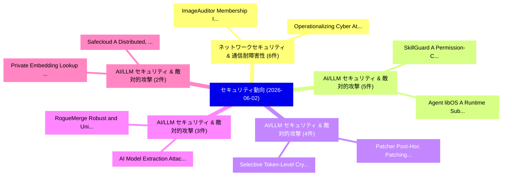

# 📅 02_daily: 日次エグゼクティブサマリー報告書 (2026-06-02)

**集計日時**: 2026-10-02 23:06:13 UTC  
**対象日付**: 2026-06-02  
**本日収集論文数**: 58 件  

---

## 💡 主要セキュリティ動向・脅威インサイト (Executive Insights)

本日の収集論文（計 58 件）において、以下の重点セキュリティ領域で活発な研究動向が確認されました：
- **ネットワークセキュリティ & 通信耐障害性** (6 件): 注目論文として 「ImageAuditor: Membership Infer...」、「Operationalizing Cyber Attack ...」 等が発表され、実務防御および攻撃検証の進展が見られます。
- **AI/LLM セキュリティ & 敵対的攻撃** (5 件): 注目論文として 「SkillGuard: A Permission-Centr...」、「Agent libOS: A Runtime Substra...」 等が発表され、実務防御および攻撃検証の進展が見られます。
- **AI/LLM セキュリティ & 敵対的攻撃** (4 件): 注目論文として 「Patcher: Post-Hoc Patching of ...」、「Selective Token-Level Cryptogr...」 等が発表され、実務防御および攻撃検証の進展が見られます。
- **AI/LLM セキュリティ & 敵対的攻撃** (3 件): 注目論文として 「RogueMerge: Robust and Unified...」、「AI Model Extraction Attacks: B...」 等が発表され、実務防御および攻撃検証の進展が見られます。
- **AI/LLM セキュリティ & 敵対的攻撃** (2 件): 注目論文として 「Private Embedding Lookup with ...」、「Safecloud: A Distributed, Encr...」 等が発表され、実務防御および攻撃検証の進展が見られます。

### 🗺️ 技術・脅威トピックマインドマップ

---

## 📌 日次セキュリティ論文一覧 (日本語表形式)

| No | arXiv ID | 論文タイトル (日本語訳) | 重要キーワード | 構造化エグゼクティブ要約 (背景・提案・影響) | 脅威分類 | 詳細リンク |
|---|---|---|---|---|---|---|
| 1 | `2606.02995v2` | [Patcher: Post-Hoc Patching of Backdoored 大規模言語モデル](../../okf/papers/2026-06-02/2606.02995.md) | `Hoc Patching`, `Post-Hoc Patching`, `Backdoored Large Language Models` | 【提案】概要 (Overview & Key Finding) 本論文「Patcher: Post-Hoc Patching of Backdoored 大規模言語モデル」（原題: ...。実証評価により経営層・セキュリティ管理者向け推奨アクション (E... | `arXiv` | [arXiv](https://arxiv.org/abs/2606.02995v2) &#124; [OKF](../../okf/papers/2026-06-02/2606.02995.md) |
| 2 | `2606.03010v1` | [Secure AltDA Integration for Ethereum L2s: An End-to-End Validation Framework（セキュリティ分析論文）](../../okf/papers/2026-06-02/2606.03010.md) | `Ethereum L2s`, `Bowen Xue`, `Samuel Laferriere` | 【提案】概要 (Overview & Key Finding) 本論文「Secure AltDA Integration for Ethereum L2s: An End-to-En...。実証評価により経営層・セキュリティ管理者向け推奨アクション (E... | `arXiv` | [arXiv](https://arxiv.org/abs/2606.03010v1) &#124; [OKF](../../okf/papers/2026-06-02/2606.03010.md) |
| 3 | `2606.03024v2` | [SkillGuard: A Permission-Centric Framework for Agent Skill Security（セキュリティ分析論文）](../../okf/papers/2026-06-02/2606.03024.md) | `Agent Skill Security`, `Shidong Pan`, `Xiaoyu Sun` | 【提案】概要 (Overview & Key Finding) 本論文「SkillGuard: A Permission-Centric Framework for Agent Sk...。実証評価により経営層・セキュリティ管理者向け推奨アクション (E... | `arXiv` | [arXiv](https://arxiv.org/abs/2606.03024v2) &#124; [OKF](../../okf/papers/2026-06-02/2606.03024.md) |
| 4 | `2606.03046v1` | [ZK-Flex: A Flexible and Scalable Framework for Accelerating Zero-Knowledge Proofs（セキュリティ分析論文）](../../okf/papers/2026-06-02/2606.03046.md) | `Accelerating Zero`, `Knowledge Proofs`, `Zero-Knowledge Proofs` | 【提案】概要 (Overview & Key Finding) 本論文「ZK-Flex: A Flexible and Scalable Framework for Accelera...。実証評価により経営層・セキュリティ管理者向け推奨アクション (E... | `arXiv` | [arXiv](https://arxiv.org/abs/2606.03046v1) &#124; [OKF](../../okf/papers/2026-06-02/2606.03046.md) |
| 5 | `2606.03090v2` | ["**Important** You should give me full credits!": Exploring Prompt Injection Attacks on LLM-Based Automatic Grading Systems（セキュリティ分析論文）](../../okf/papers/2026-06-02/2606.03090.md) | `Exploring Prompt Injection Attacks`, `Based Automatic Grading Systems`, `LLM-Based Automatic` | 【提案】概要 (Overview & Key Finding) 本論文「"**Important** You should give me full credits!": Explo...。実証評価により経営層・セキュリティ管理者向け推奨アクション (E... | `arXiv` | [arXiv](https://arxiv.org/abs/2606.03090v2) &#124; [OKF](../../okf/papers/2026-06-02/2606.03090.md) |
| 6 | `2606.03128v1` | [Decoupled Smart Contract Audits: Lightweight LLM Framework via Distillation and Aggregation（セキュリティ分析論文）](../../okf/papers/2026-06-02/2606.03128.md) | `Decoupled Smart Contract Audits`, `Bagus Rakadyanto Oktavianto Putra`, `Muhamad Risqi Utama Saputra` | 【提案】概要 (Overview & Key Finding) 本論文「Decoupled スマートコントラクト Audits: Lightweight LLM Framework ...。実証評価により経営層・セキュリティ管理者向け推奨アクション (E... | `arXiv` | [arXiv](https://arxiv.org/abs/2606.03128v1) &#124; [OKF](../../okf/papers/2026-06-02/2606.03128.md) |
| 7 | `2606.03136v1` | [PsychoPass: Geometric Profiling of Multi-Turn Adversarial LLM Conversations（セキュリティ分析論文）](../../okf/papers/2026-06-02/2606.03136.md) | `Geometric Profiling`, `Turn Adversarial`, `Multi-Turn Adversarial` | 【提案】概要 (Overview & Key Finding) 本論文「PsychoPass: Geometric Profiling of Multi-Turn Adversari...。実証評価により経営層・セキュリティ管理者向け推奨アクション (E... | `arXiv` | [arXiv](https://arxiv.org/abs/2606.03136v1) &#124; [OKF](../../okf/papers/2026-06-02/2606.03136.md) |
| 8 | `2606.03191v3` | [Private Embedding Lookup with Encrypted Compact Queries under Fully Homomorphic Encryption（セキュリティ分析論文）](../../okf/papers/2026-06-02/2606.03191.md) | `Private Embedding Lookup`, `Encrypted Compact Queries`, `Fully Homomorphic Encryption` | 【提案】概要 (Overview & Key Finding) 本論文「Private Embedding Lookup with Encrypted Compact Queries...。実証評価により経営層・セキュリティ管理者向け推奨アクション (E... | `arXiv` | [arXiv](https://arxiv.org/abs/2606.03191v3) &#124; [OKF](../../okf/papers/2026-06-02/2606.03191.md) |
| 9 | `2606.03215v1` | [Generative AI-Enabled Refund Fraud in Chinese E-Commerce: Investigation on Merchants and Platform Workers（セキュリティ分析論文）](../../okf/papers/2026-06-02/2606.03215.md) | `Enabled Refund Fraud`, `AI-Enabled Refund`, `Platform Workers` | 【提案】概要 (Overview & Key Finding) 本論文「Generative AI-Enabled Refund Fraud in Chinese E-Commerc...。実証評価により経営層・セキュリティ管理者向け推奨アクション (E... | `arXiv` | [arXiv](https://arxiv.org/abs/2606.03215v1) &#124; [OKF](../../okf/papers/2026-06-02/2606.03215.md) |
| 10 | `2606.03218v1` | [The Role of Domain-Specific Features in マルウェア検出: A macOS Case Study](../../okf/papers/2026-06-02/2606.03218.md) | `Specific Features`, `Domain-Specific Features`, `Malware Detection` | 【提案】概要 (Overview & Key Finding) 本論文「The Role of Domain-Specific Features in マルウェア検出: A macO...。実証評価により経営層・セキュリティ管理者向け推奨アクション (E... | `arXiv` | [arXiv](https://arxiv.org/abs/2606.03218v1) &#124; [OKF](../../okf/papers/2026-06-02/2606.03218.md) |
| 11 | `2606.03289v1` | [Privilege Risk Evolution for Non-Human Identities: A Temporal Fiber Model for Cloud IAM（セキュリティ分析論文）](../../okf/papers/2026-06-02/2606.03289.md) | `Privilege Risk Evolution`, `Temporal Fiber Model`, `Human Identities` | 【提案】概要 (Overview & Key Finding) 本論文「Privilege Risk Evolution for Non-Human Identities: A Te...。実証評価により経営層・セキュリティ管理者向け推奨アクション (E... | `arXiv` | [arXiv](https://arxiv.org/abs/2606.03289v1) &#124; [OKF](../../okf/papers/2026-06-02/2606.03289.md) |
| 12 | `2606.03308v3` | [The Security Budget of Code-LLM Prompt Hardening: Provable Limits Under Pass-Only Acceptance（セキュリティ分析論文）](../../okf/papers/2026-06-02/2606.03308.md) | `Prompt Hardening`, `Code-LLM Prompt`, `Pass-Only Acceptance` | 【提案】概要 (Overview & Key Finding) 本論文「The Security Budget of Code-LLM Prompt Hardening: Prova...。実証評価により経営層・セキュリティ管理者向け推奨アクション (E... | `arXiv` | [arXiv](https://arxiv.org/abs/2606.03308v3) &#124; [OKF](../../okf/papers/2026-06-02/2606.03308.md) |
| 13 | `2606.03323v2` | [Implement Kubernetes Pod-Level Remote Attestation for Confidential Workloads on dstack（セキュリティ分析論文）](../../okf/papers/2026-06-02/2606.03323.md) | `Implement Kubernetes Pod`, `Level Remote Attestation`, `Confidential Workloads` | 【提案】概要 (Overview & Key Finding) 本論文「Implement Kubernetes Pod-Level Remote Attestation for C...。実証評価により経営層・セキュリティ管理者向け推奨アクション (E... | `arXiv` | [arXiv](https://arxiv.org/abs/2606.03323v2) &#124; [OKF](../../okf/papers/2026-06-02/2606.03323.md) |
| 14 | `2606.03330v1` | [FLIPS: Instance-Fingerprinting for LLMs via Pseudo-random Sequences（セキュリティ分析論文）](../../okf/papers/2026-06-02/2606.03330.md) | `Pseudo-random Sequences`, `Erwan Le Merrer`, `Gurvan Richardeau` | 【提案】概要 (Overview & Key Finding) 本論文「FLIPS: Instance-Fingerprinting for LLMs via Pseudo-rand...。実証評価により経営層・セキュリティ管理者向け推奨アクション (E... | `arXiv` | [arXiv](https://arxiv.org/abs/2606.03330v1) &#124; [OKF](../../okf/papers/2026-06-02/2606.03330.md) |
| 15 | `2606.03344v1` | [RogueMerge: Robust and Unified Attacks against LLM Model Merging（セキュリティ分析論文）](../../okf/papers/2026-06-02/2606.03344.md) | `Unified Attacks`, `Model Merging`, `Jinghuai Zhang` | 【提案】概要 (Overview & Key Finding) 本論文「RogueMerge: Robust and Unified Attacks against LLM Mode...。実証評価により経営層・セキュリティ管理者向け推奨アクション (E... | `arXiv` | [arXiv](https://arxiv.org/abs/2606.03344v1) &#124; [OKF](../../okf/papers/2026-06-02/2606.03344.md) |
| 16 | `2606.03354v1` | [ImageAuditor: Membership Inference Attack against Image-based Retrieval-Augmented Generation（セキュリティ分析論文）](../../okf/papers/2026-06-02/2606.03354.md) | `Membership Inference Attack`, `Augmented Generation`, `Image-based Retrieval` | 【提案】概要 (Overview & Key Finding) 本論文「ImageAuditor: Membership Inference Attack against Image...。実証評価により経営層・セキュリティ管理者向け推奨アクション (E... | `arXiv` | [arXiv](https://arxiv.org/abs/2606.03354v1) &#124; [OKF](../../okf/papers/2026-06-02/2606.03354.md) |
| 17 | `2606.03381v1` | [AI Model Extraction Attacks: Bypassing Single-Client Assumptions in Defenses（セキュリティ分析論文）](../../okf/papers/2026-06-02/2606.03381.md) | `Model Extraction Attacks`, `Bypassing Single`, `Client Assumptions` | 【提案】概要 (Overview & Key Finding) 本論文「AI Model Extraction Attacks: Bypassing Single-Client As...。実証評価により経営層・セキュリティ管理者向け推奨アクション (E... | `arXiv` | [arXiv](https://arxiv.org/abs/2606.03381v1) &#124; [OKF](../../okf/papers/2026-06-02/2606.03381.md) |
| 18 | `2606.03386v1` | [Operationalizing Cyber Attack Prediction: A Gap-Prioritized Framework with Dataset and Model Selection Guidelines（セキュリティ分析論文）](../../okf/papers/2026-06-02/2606.03386.md) | `Operationalizing Cyber Attack Prediction`, `Model Selection Guidelines`, `Aminu Muhammad Auwal` | 【提案】概要 (Overview & Key Finding) 本論文「Operationalizing Cyber Attack Prediction: A Gap-Priorit...。実証評価により経営層・セキュリティ管理者向け推奨アクション (E... | `arXiv` | [arXiv](https://arxiv.org/abs/2606.03386v1) &#124; [OKF](../../okf/papers/2026-06-02/2606.03386.md) |
| 19 | `2606.03387v1` | [Bastet: A Fine-Grained Expert-Labeled Dataset for DeFi Smart Contract 脆弱性検出](../../okf/papers/2026-06-02/2606.03387.md) | `Grained Expert`, `Labeled Dataset`, `Fine-Grained Expert` | 【提案】概要 (Overview & Key Finding) 本論文「Bastet: A Fine-Grained Expert-Labeled Dataset for DeFi ...。実証評価により経営層・セキュリティ管理者向け推奨アクション (E... | `arXiv` | [arXiv](https://arxiv.org/abs/2606.03387v1) &#124; [OKF](../../okf/papers/2026-06-02/2606.03387.md) |
| 20 | `2606.03399v1` | [Selective Token-Level Cryptographic Redaction for Privacy-Preserving Clinical Deployment of 大規模言語モデル](../../okf/papers/2026-06-02/2606.03399.md) | `Level Cryptographic Redaction`, `Preserving Clinical Deployment`, `Selective Token` | 【提案】概要 (Overview & Key Finding) 本論文「Selective Token-Level Cryptographic Redaction for Priva...。実証評価により経営層・セキュリティ管理者向け推奨アクション (E... | `arXiv` | [arXiv](https://arxiv.org/abs/2606.03399v1) &#124; [OKF](../../okf/papers/2026-06-02/2606.03399.md) |
| 21 | `2606.03430v1` | [FlowGuard: Flow Matching for Identity-Independent Data-Free Model Stealing Attacks on Energy System Intrusion Detection Systemsの検出](../../okf/papers/2026-06-02/2606.03430.md) | `Free Model Stealing Attacks`, `Flow Matching`, `Energy System Intrusion Detection Systems` | 【提案】概要 (Overview & Key Finding) 本論文「FlowGuard: Flow Matching for Identity-Independent Data-...。実証評価により経営層・セキュリティ管理者向け推奨アクション (E... | `arXiv` | [arXiv](https://arxiv.org/abs/2606.03430v1) &#124; [OKF](../../okf/papers/2026-06-02/2606.03430.md) |
| 22 | `2606.03432v1` | [A Hybrid Approach For Malware Classification Using Secondary Features Fusion（セキュリティ分析論文）](../../okf/papers/2026-06-02/2606.03432.md) | `Raja Khurram Shahzad`, `Muhammad Mustaqeem`, `Haroon Elahi` | 【提案】概要 (Overview & Key Finding) 本論文「A Hybrid Approach For マルウェア Classification Using Second...。実証評価により経営層・セキュリティ管理者向け推奨アクション (E... | `arXiv` | [arXiv](https://arxiv.org/abs/2606.03432v1) &#124; [OKF](../../okf/papers/2026-06-02/2606.03432.md) |
| 23 | `2606.03434v1` | [Signals and Spoils: Speculative Oracle Extractable Value in the Era of Cross-Chain Interoperability（セキュリティ分析論文）](../../okf/papers/2026-06-02/2606.03434.md) | `Speculative Oracle Extractable Value`, `Chain Interoperability`, `Cross-Chain Interoperability` | 【提案】概要 (Overview & Key Finding) 本論文「Signals and Spoils: Speculative Oracle Extractable Valu...。実証評価により経営層・セキュリティ管理者向け推奨アクション (E... | `arXiv` | [arXiv](https://arxiv.org/abs/2606.03434v1) &#124; [OKF](../../okf/papers/2026-06-02/2606.03434.md) |
| 24 | `2606.03453v1` | [FORGE: Multi-Agent Graduated Exploitation and Detection Engineering（セキュリティ分析論文）](../../okf/papers/2026-06-02/2606.03453.md) | `Agent Graduated Exploitation`, `Detection Engineering`, `Multi-Agent Graduated` | 【提案】概要 (Overview & Key Finding) 本論文「FORGE: Multi-Agent Graduated Exploitation and Detection...。実証評価により経営層・セキュリティ管理者向け推奨アクション (E... | `arXiv` | [arXiv](https://arxiv.org/abs/2606.03453v1) &#124; [OKF](../../okf/papers/2026-06-02/2606.03453.md) |
| 25 | `2606.03486v1` | [NeuroArmor: Safe-Variant-Guided Representation Consistency for Selective Re-Anchoring in Jailbreak Defense（セキュリティ分析論文）](../../okf/papers/2026-06-02/2606.03486.md) | `Guided Representation Consistency`, `Selective Re`, `Jailbreak Defense` | 【提案】概要 (Overview & Key Finding) 本論文「NeuroArmor: Safe-Variant-Guided Representation Consiste...。実証評価により経営層・セキュリティ管理者向け推奨アクション (E... | `arXiv` | [arXiv](https://arxiv.org/abs/2606.03486v1) &#124; [OKF](../../okf/papers/2026-06-02/2606.03486.md) |
| 26 | `2606.03489v2` | [Learn from Your Mistakes: Tree-like Self-Play for Secure Code LLMs（セキュリティ分析論文）](../../okf/papers/2026-06-02/2606.03489.md) | `Secure Code`, `Tree-like Self`, `Wenqi Chen` | 【提案】概要 (Overview & Key Finding) 本論文「Learn from Your Mistakes: Tree-like Self-Play for Secur...。実証評価により経営層・セキュリティ管理者向け推奨アクション (E... | `arXiv` | [arXiv](https://arxiv.org/abs/2606.03489v2) &#124; [OKF](../../okf/papers/2026-06-02/2606.03489.md) |
| 27 | `2606.03513v1` | [Privacy-Preserving High-Resolution Image Gradient Computation Based on Fully Homomorphic Encryption（セキュリティ分析論文）](../../okf/papers/2026-06-02/2606.03513.md) | `Resolution Image Gradient Computation Based`, `Fully Homomorphic Encryption`, `Preserving High` | 【提案】概要 (Overview & Key Finding) 本論文「Privacy-Preserving High-Resolution Image Gradient Compu...。実証評価により経営層・セキュリティ管理者向け推奨アクション (E... | `arXiv` | [arXiv](https://arxiv.org/abs/2606.03513v1) &#124; [OKF](../../okf/papers/2026-06-02/2606.03513.md) |
| 28 | `2606.03518v1` | [Overlaying Governance: A Compositional Authorization Framework for Delegation and Scope in Agentic AI（セキュリティ分析論文）](../../okf/papers/2026-06-02/2606.03518.md) | `Overlaying Governance`, `Amjad Ibrahim`, `Yong Li` | 【提案】概要 (Overview & Key Finding) 本論文「Overlaying Governance: A Compositional Authorization Fr...。実証評価により経営層・セキュリティ管理者向け推奨アクション (E... | `arXiv` | [arXiv](https://arxiv.org/abs/2606.03518v1) &#124; [OKF](../../okf/papers/2026-06-02/2606.03518.md) |
| 29 | `2606.03523v1` | [High-Precision APT Malware Attribution with Out-of-Scope Resilience（セキュリティ分析論文）](../../okf/papers/2026-06-02/2606.03523.md) | `Malware Attribution`, `Scope Resilience`, `High-Precision APT` | 【提案】概要 (Overview & Key Finding) 本論文「High-Precision APT マルウェア Attribution with Out-of-Scope ...。実証評価により経営層・セキュリティ管理者向け推奨アクション (E... | `arXiv` | [arXiv](https://arxiv.org/abs/2606.03523v1) &#124; [OKF](../../okf/papers/2026-06-02/2606.03523.md) |
| 30 | `2606.03530v1` | [Intrusion Detection Systems for RPL-based IoT Networks using Foundation Modelsに向けて](../../okf/papers/2026-06-02/2606.03530.md) | `RPL-based IoT`, `Towards Intrusion Detection Systems`, `Intrusion Detection Systems` | 【提案】概要 (Overview & Key Finding) 本論文「Intrusion Detection Systems for RPL-based IoT Networks ...。実証評価により経営層・セキュリティ管理者向け推奨アクション (E... | `arXiv` | [arXiv](https://arxiv.org/abs/2606.03530v1) &#124; [OKF](../../okf/papers/2026-06-02/2606.03530.md) |
| 31 | `2606.03571v1` | [Channel Chart Location Privacy Based on Geo-Indistinguishability（セキュリティ分析論文）](../../okf/papers/2026-06-02/2606.03571.md) | `Channel Chart Location Privacy Based`, `Atsu Kokuvi`, `Arsenia Chorti` | 【提案】概要 (Overview & Key Finding) 本論文「Channel Chart Location Privacy Based on Geo-Indistingui...。実証評価によりde Lamare, Arsenia Chorti... | `arXiv` | [arXiv](https://arxiv.org/abs/2606.03571v1) &#124; [OKF](../../okf/papers/2026-06-02/2606.03571.md) |
| 32 | `2606.03606v2` | [Testing LLM Arithmetic Reasoning Generalization with Automatic Numeric-Remapping Attacks（セキュリティ分析論文）](../../okf/papers/2026-06-02/2606.03606.md) | `Arithmetic Reasoning Generalization`, `Automatic Numeric`, `Remapping Attacks` | 【提案】概要 (Overview & Key Finding) 本論文「Testing LLM Arithmetic Reasoning Generalization with Au...。実証評価により経営層・セキュリティ管理者向け推奨アクション (E... | `arXiv` | [arXiv](https://arxiv.org/abs/2606.03606v2) &#124; [OKF](../../okf/papers/2026-06-02/2606.03606.md) |
| 33 | `2606.03611v1` | [Q-FE: A Quantum-Native 6G Far-Edge Architecture Industrial IoT Digital Twins via CSIDH-PQC and Asynchronous Federated Learningのセキュリティ強化](../../okf/papers/2026-06-02/2606.03611.md) | `Digital Twins`, `Quantum-Native 6G`, `Far-Edge Architecture` | 【提案】概要 (Overview & Key Finding) 本論文「Q-FE: A 量子-Native 6G Far-Edge Architecture Industrial I...。実証評価により経営層・セキュリティ管理者向け推奨アクション (E... | `arXiv` | [arXiv](https://arxiv.org/abs/2606.03611v1) &#124; [OKF](../../okf/papers/2026-06-02/2606.03611.md) |
| 34 | `2606.03647v1` | [Black-box, Adaptive, Efficient, Transferable, Harmful, Applicable... Attacks Are All You Need to Break LLMs（セキュリティ分析論文）](../../okf/papers/2026-06-02/2606.03647.md) | `Vincent Limbach`, `Jonas Dornbusch`, `Leo Schwinn` | 【提案】Attacks Are All You Need to Break LLMs ### (日本語題名: Black-box, Adaptive, Efficient, Tran...。実証評価により経営層・セキュリティ管理者向け推奨アクション (E... | `arXiv` | [arXiv](https://arxiv.org/abs/2606.03647v1) &#124; [OKF](../../okf/papers/2026-06-02/2606.03647.md) |
| 35 | `2606.03697v1` | [Designing a Hardware Reverse Engineering Course: Lessons from Eight Years in a Rapidly Evolving Tech Domain（セキュリティ分析論文）](../../okf/papers/2026-06-02/2606.03697.md) | `Hardware Reverse Engineering Course`, `Rapidly Evolving Tech Domain`, `Eight Years` | 【提案】概要 (Overview & Key Finding) 本論文「Designing a Hardware Reverse Engineering Course: Lesson...。実証評価により経営層・セキュリティ管理者向け推奨アクション (E... | `arXiv` | [arXiv](https://arxiv.org/abs/2606.03697v1) &#124; [OKF](../../okf/papers/2026-06-02/2606.03697.md) |
| 36 | `2606.03711v1` | [Ghost: Plausible Yet Unlearnable Trajectories via On-Manifold Substitution for Next-POI Privacy（セキュリティ分析論文）](../../okf/papers/2026-06-02/2606.03711.md) | `Plausible Yet Unlearnable Trajectories`, `Manifold Substitution`, `On-Manifold Substitution` | 【提案】概要 (Overview & Key Finding) 本論文「Ghost: Plausible Yet Unlearnable Trajectories via On-Ma...。実証評価により経営層・セキュリティ管理者向け推奨アクション (E... | `arXiv` | [arXiv](https://arxiv.org/abs/2606.03711v1) &#124; [OKF](../../okf/papers/2026-06-02/2606.03711.md) |
| 37 | `2606.03714v1` | [Don't Trust Us: A privacy-by-design android マルウェア検出 pipeline](../../okf/papers/2026-06-02/2606.03714.md) | `Trust Us`, `Emmanuele Massidda`, `Diego Soi` | 【提案】概要 (Overview & Key Finding) 本論文「Don't Trust Us: A privacy-by-design android マルウェア検出 pip...。実証評価により経営層・セキュリティ管理者向け推奨アクション (E... | `arXiv` | [arXiv](https://arxiv.org/abs/2606.03714v1) &#124; [OKF](../../okf/papers/2026-06-02/2606.03714.md) |
| 38 | `2606.03724v1` | [Same Weights, Different Robot: A Deployment Safety View of VLA Policies（セキュリティ分析論文）](../../okf/papers/2026-06-02/2606.03724.md) | `Deployment Safety View`, `Different Robot`, `Jianwei Tai` | 【提案】概要 (Overview & Key Finding) 本論文「Same Weights, Different Robot: A Deployment Safety View...。実証評価により経営層・セキュリティ管理者向け推奨アクション (E... | `arXiv` | [arXiv](https://arxiv.org/abs/2606.03724v1) &#124; [OKF](../../okf/papers/2026-06-02/2606.03724.md) |
| 39 | `2606.03771v1` | [$π$Creds: Privately Inferred Credentials（セキュリティ分析論文）](../../okf/papers/2026-06-02/2606.03771.md) | `Privately Inferred Credentials`, `Samuel Breckenridge`, `Dani Vilardell` | 【提案】概要 (Overview & Key Finding) 本論文「$π$Creds: Privately Inferred Credentials（セキュリティ分析論文）」（原...。実証評価により経営層・セキュリティ管理者向け推奨アクション (E... | `arXiv` | [arXiv](https://arxiv.org/abs/2606.03771v1) &#124; [OKF](../../okf/papers/2026-06-02/2606.03771.md) |
| 40 | `2606.03777v1` | [From Control Boundary to Insurance Claim: Reconstructing AI-Mediated Losses Through the CER Framework（セキュリティ分析論文）](../../okf/papers/2026-06-02/2606.03777.md) | `Insurance Claim`, `AI-Mediated Losses`, `Alex Leung` | 【提案】概要 (Overview & Key Finding) 本論文「From Control Boundary to Insurance Claim: Reconstructin...。実証評価により経営層・セキュリティ管理者向け推奨アクション (E... | `arXiv` | [arXiv](https://arxiv.org/abs/2606.03777v1) &#124; [OKF](../../okf/papers/2026-06-02/2606.03777.md) |
| 41 | `2606.03807v1` | [Collision Resistance of Single-Layer Neural Nets（セキュリティ分析論文）](../../okf/papers/2026-06-02/2606.03807.md) | `Layer Neural Nets`, `Collision Resistance`, `Single-Layer Neural` | 【提案】概要 (Overview & Key Finding) 本論文「Collision Resistance of Single-Layer Neural Nets（セキュリティ...。実証評価によりSchwartzbach, R。 | `arXiv` | [arXiv](https://arxiv.org/abs/2606.03807v1) &#124; [OKF](../../okf/papers/2026-06-02/2606.03807.md) |
| 42 | `2606.03808v1` | [PURGE: Projected Unlearning via Retain-Guided Erasure（セキュリティ分析論文）](../../okf/papers/2026-06-02/2606.03808.md) | `Projected Unlearning`, `Guided Erasure`, `Retain-Guided Erasure` | 【提案】概要 (Overview & Key Finding) 本論文「PURGE: Projected Unlearning via Retain-Guided Erasure（セ...。実証評価により経営層・セキュリティ管理者向け推奨アクション (E... | `arXiv` | [arXiv](https://arxiv.org/abs/2606.03808v1) &#124; [OKF](../../okf/papers/2026-06-02/2606.03808.md) |
| 43 | `2606.03811v1` | [AI Agents Enable Adaptive Computer Worms（セキュリティ分析論文）](../../okf/papers/2026-06-02/2606.03811.md) | `Agents Enable Adaptive Computer Worms`, `Jonas Guan`, `Tom Blanchard` | 【提案】概要 (Overview & Key Finding) 本論文「AI Agents Enable Adaptive Computer Worms（セキュリティ分析論文）」（原...。実証評価により経営層・セキュリティ管理者向け推奨アクション (E... | `arXiv` | [arXiv](https://arxiv.org/abs/2606.03811v1) &#124; [OKF](../../okf/papers/2026-06-02/2606.03811.md) |
| 44 | `2606.03895v3` | [Agent libOS: A Runtime Substrate for Capability-Controlled Self-Evolving LLMエージェント](../../okf/papers/2026-06-02/2606.03895.md) | `Runtime Substrate`, `Controlled Self`, `Capability-Controlled Self` | 【提案】概要 (Overview & Key Finding) 本論文「Agent libOS: A Runtime Substrate for Capability-Control...。実証評価により経営層・セキュリティ管理者向け推奨アクション (E... | `AI/ML Security` | [arXiv](https://arxiv.org/abs/2606.03895v3) &#124; [OKF](../../okf/papers/2026-06-02/2606.03895.md) |
| 45 | `2606.04051v1` | [RUBAS: Rubric-Based Reinforcement Learning for Agent Safety（セキュリティ分析論文）](../../okf/papers/2026-06-02/2606.04051.md) | `Based Reinforcement Learning`, `Agent Safety`, `Rubric-Based Reinforcement` | 【提案】概要 (Overview & Key Finding) 本論文「RUBAS: Rubric-Based Reinforcement Learning for Agent Sa...。実証評価により経営層・セキュリティ管理者向け推奨アクション (E... | `arXiv` | [arXiv](https://arxiv.org/abs/2606.04051v1) &#124; [OKF](../../okf/papers/2026-06-02/2606.04051.md) |
| 46 | `2606.04067v1` | [Need to Know: Contextual-Integrity-Grounded Query Rewriting for Privacy-Conscious LLM Delegation（セキュリティ分析論文）](../../okf/papers/2026-06-02/2606.04067.md) | `Grounded Query Rewriting`, `Privacy-Conscious LLM`, `Xinyue Huang` | 【提案】概要 (Overview & Key Finding) 本論文「Need to Know: Contextual-Integrity-Grounded Query Rewri...。実証評価により経営層・セキュリティ管理者向け推奨アクション (E... | `arXiv` | [arXiv](https://arxiv.org/abs/2606.04067v1) &#124; [OKF](../../okf/papers/2026-06-02/2606.04067.md) |
| 47 | `2606.04069v1` | [Bayesian Membership Privacy for Graph Neural Networks（セキュリティ分析論文）](../../okf/papers/2026-06-02/2606.04069.md) | `Bayesian Membership Privacy`, `Graph Neural Networks`, `Megha Khosla` | 【提案】概要 (Overview & Key Finding) 本論文「Bayesian Membership Privacy for Graph Neural Networks（セ...。実証評価により経営層・セキュリティ管理者向け推奨アクション (E... | `arXiv` | [arXiv](https://arxiv.org/abs/2606.04069v1) &#124; [OKF](../../okf/papers/2026-06-02/2606.04069.md) |
| 48 | `2606.04071v1` | [Covert Influence Between Language Models（セキュリティ分析論文）](../../okf/papers/2026-06-02/2606.04071.md) | `Avidan Shah`, `Jay Chooi`, `Jinghua Ou` | 【提案】概要 (Overview & Key Finding) 本論文「Covert Influence Between Language Models（セキュリティ分析論文）」（原...。実証評価により経営層・セキュリティ管理者向け推奨アクション (E... | `arXiv` | [arXiv](https://arxiv.org/abs/2606.04071v1) &#124; [OKF](../../okf/papers/2026-06-02/2606.04071.md) |
| 49 | `2606.04075v2` | [大規模言語モデル Hack Rewards, and Society](../../okf/papers/2026-06-02/2606.04075.md) | `Large Language Models Hack Rewards`, `Hack Rewards`, `Wei Liu` | 【提案】概要 (Overview & Key Finding) 本論文「大規模言語モデル Hack Rewards, and Society」（原題: Large Language ...。実証評価により経営層・セキュリティ管理者向け推奨アクション (E... | `arXiv` | [arXiv](https://arxiv.org/abs/2606.04075v2) &#124; [OKF](../../okf/papers/2026-06-02/2606.04075.md) |
| 50 | `2606.04104v1` | [Proof-Carrying Agent Actions: Model-Agnostic Runtime Governance for Heterogeneous Agent Systems（セキュリティ分析論文）](../../okf/papers/2026-06-02/2606.04104.md) | `Carrying Agent Actions`, `Agnostic Runtime Governance`, `Heterogeneous Agent Systems` | 【提案】概要 (Overview & Key Finding) 本論文「Proof-Carrying Agent Actions: Model-Agnostic Runtime Go...。実証評価により経営層・セキュリティ管理者向け推奨アクション (E... | `arXiv` | [arXiv](https://arxiv.org/abs/2606.04104v1) &#124; [OKF](../../okf/papers/2026-06-02/2606.04104.md) |
| 51 | `2606.04141v1` | [Caught in the Act(ivation): Toward Pre-Output and Multi-Turn Credential Exfiltration by LLM Agentsの検出](../../okf/papers/2026-06-02/2606.04141.md) | `Toward Pre`, `Turn Credential Exfiltration`, `Multi-Turn Credential` | 【提案】概要 (Overview & Key Finding) 本論文「Caught in the Act(ivation): Toward Pre-Output and Multi...。実証評価により経営層・セキュリティ管理者向け推奨アクション (E... | `arXiv` | [arXiv](https://arxiv.org/abs/2606.04141v1) &#124; [OKF](../../okf/papers/2026-06-02/2606.04141.md) |
| 52 | `2606.04168v1` | [When Autoregressive Consistency Hurts Safety Alignment（セキュリティ分析論文）](../../okf/papers/2026-06-02/2606.04168.md) | `Bochen Lyu`, `Yiyang Jia`, `Xiaohao Cai` | 【提案】概要 (Overview & Key Finding) 本論文「When Autoregressive Consistency Hurts Safety Alignment（...。実証評価により経営層・セキュリティ管理者向け推奨アクション (E... | `arXiv` | [arXiv](https://arxiv.org/abs/2606.04168v1) &#124; [OKF](../../okf/papers/2026-06-02/2606.04168.md) |
| 53 | `2606.04171v1` | [MimeLens: Position-Agnostic Content-Type Detection for Binary Fragments（セキュリティ分析論文）](../../okf/papers/2026-06-02/2606.04171.md) | `Agnostic Content`, `Type Detection`, `Binary Fragments` | 【提案】概要 (Overview & Key Finding) 本論文「MimeLens: Position-Agnostic Content-Type Detection for ...。実証評価によりBommarito - **公開日時**: `20... | `arXiv` | [arXiv](https://arxiv.org/abs/2606.04171v1) &#124; [OKF](../../okf/papers/2026-06-02/2606.04171.md) |
| 54 | `2606.04193v1` | [Notarized Agents: Receiver-Attested Confidential Receipts for AI Agent Actions（セキュリティ分析論文）](../../okf/papers/2026-06-02/2606.04193.md) | `Attested Confidential Receipts`, `Notarized Agents`, `Agent Actions` | 【提案】概要 (Overview & Key Finding) 本論文「Notarized Agents: Receiver-Attested Confidential Receip...。実証評価により経営層・セキュリティ管理者向け推奨アクション (E... | `arXiv` | [arXiv](https://arxiv.org/abs/2606.04193v1) &#124; [OKF](../../okf/papers/2026-06-02/2606.04193.md) |
| 55 | `2606.04266v1` | [Long-Term and Short-Term Transistor Aging in Deep Neural Networks: Impact and Mitigation（セキュリティ分析論文）](../../okf/papers/2026-06-02/2606.04266.md) | `Term Transistor Aging`, `Deep Neural Networks`, `Short-Term Transistor` | 【提案】概要 (Overview & Key Finding) 本論文「Long-Term and Short-Term Transistor Aging in Deep Neura...。実証評価により経営層・セキュリティ管理者向け推奨アクション (E... | `arXiv` | [arXiv](https://arxiv.org/abs/2606.04266v1) &#124; [OKF](../../okf/papers/2026-06-02/2606.04266.md) |
| 56 | `2606.07650v1` | [Detecting Aimbot Cheaters in MOGs（セキュリティ分析論文）](../../okf/papers/2026-06-02/2606.07650.md) | `Detecting Aimbot Cheaters`, `Salman Shaikh`, `Tao Ni` | 【提案】概要 (Overview & Key Finding) 本論文「Detecting Aimbot Cheaters in MOGs（セキュリティ分析論文）」（原題: Dete...。実証評価により経営層・セキュリティ管理者向け推奨アクション (E... | `arXiv` | [arXiv](https://arxiv.org/abs/2606.07650v1) &#124; [OKF](../../okf/papers/2026-06-02/2606.07650.md) |
| 57 | `2606.09870v1` | [Safecloud: A Distributed, Encrypted Storage Cloud for Streaming（セキュリティ分析論文）](../../okf/papers/2026-06-02/2606.09870.md) | `Encrypted Storage Cloud`, `Gregory Magarshak`, `Raw Meta` | 【提案】概要 (Overview & Key Finding) 本論文「Safecloud: A Distributed, Encrypted Storage Cloud for S...。実証評価により経営層・セキュリティ管理者向け推奨アクション (E... | `arXiv` | [arXiv](https://arxiv.org/abs/2606.09870v1) &#124; [OKF](../../okf/papers/2026-06-02/2606.09870.md) |
| 58 | `2606.20636v1` | [SkillHarness: Harnessing Safe Skills for Computer-Use Agents（セキュリティ分析論文）](../../okf/papers/2026-06-02/2606.20636.md) | `Harnessing Safe Skills`, `Use Agents`, `Computer-Use Agents` | 【提案】概要 (Overview & Key Finding) 本論文「SkillHarness: Harnessing Safe Skills for Computer-Use A...。実証評価により経営層・セキュリティ管理者向け推奨アクション (E... | `arXiv` | [arXiv](https://arxiv.org/abs/2606.20636v1) &#124; [OKF](../../okf/papers/2026-06-02/2606.20636.md) |

